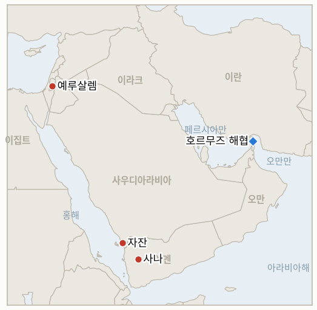

# 중동 일일 브리핑

**2026년 9월 9일**

- **보고 기간:** 약 24시간, 9월 8일 09:00 ~ 9월 9일 09:00 (한국시간)
- **종합 평가:** 예멘의 재개된 내전은 더 이상 예멘만의 전쟁이 아니게 됐다. 국방차관 사미르 알사브리가 정부가 사나 탈환을 "결정"했다고 선언하고 타이즈·알바이다주·알자우프주 전역에서 전투가 격화된 지 몇 시간 만에, 후티는 예멘 정부군이 아니라 사우디아라비아 본토를 직접 겨냥해 드론과 탄도미사일을 퍼부었다. 73명이 다쳤고 아브하·카미스 무샤이트·자잔·나즈란의 아람코 시설과 킹칼리드 공군기지가 타격을 입어 재개된 전쟁이 사우디 영토를 가장 깊숙이 파고든 사건이 됐다. 리야드는 같은 날 타이즈와 마리브에 반격을 가했으며, CNN 소식통에 따르면 동맹국들에 추가 보복 계획을 알린 상태다. 한편 이란은 호르무즈를 둘러싼 자신의 서사를 미확인 타격 주장에서 나포 주장으로 한 단계 끌어올렸으나, 중부사령부는 사건 발생 자체는 인정하면서도 이를 조목조목 반박해, 압류가 아니라 고장난 저가치 자산을 단순 회수했을 뿐이라고 맞섰다. 이스라엘-팔레스타인 국면에서는 영국이 워싱턴과 뚜렷이 갈라섰다. 다른 11개국과 함께 이스라엘 서안 정착촌과의 교역을 금지하고 점령을 공식적으로 불법이라 규정하자, 이스라엘은 예루살렘 영사관을 폐쇄하고 팔레스타인 자치정부군에 대한 영국의 훈련을 중단시켰으며 영국 의원 12명의 입국을 금지했다. 이는 미 국무부 스스로도 가자 평화 프로세스를 복잡하게 만들 수 있다고 경고한, 미국의 동맹국과의 외교적 파열이다. 그리고 한국에는 이재명 대통령의 파리 마크롱 정상회담이 구체적이지만 제한적인 성과를 냈다. 호르무즈 항행의 자유 회복을 위해 협력한다는 합의가 그것이며, 대통령실은 파병 결정이 내려진 바 없다는 입장을 거듭 확인했다. 같은 날의 유가 충격은 코스피가 한 주 넘게 이어온 중동 뉴스 무시 습관을 마침내 깨뜨려, 7,000선 돌파를 잠시 넘본 뒤 하락 마감했고 원화는 5거래일 만에 처음으로 약세를 보였다.

---

## 1. 무슨 일이 있었나

<figure style="float:right; width:46%; margin:2pt 0 8pt 14pt;">

<figcaption style="font-size:8pt; color:#666; text-align:center; margin-top:3pt; font-style:italic;">주요 논의 지점</figcaption>
</figure>

### 1.1 예멘 전쟁, 사우디아라비아로 번지다… 정부는 사나 탈환 다짐

예멘의 국제적으로 인정받는 정부는 월요일에서 화요일 사이 목표를 한 단계 더 끌어올렸다. 국방차관 사미르 알사브리는 국영 방송에서 정부가 사나 자체를 탈환하기로 "결정"했다고 밝혔고, 예멘군 대변인 마지드 알누자일리는 이번 작전을 후티의 "손아귀"로부터 예멘을 해방시키는 것으로 규정했다. 여덟 개 주를 잇는 요충지인 알바이다주와 수도로 가는 주요 관문으로 꼽히는 알자우프주, 그리고 타이즈에서 전투가 격화됐다([Al Jazeera](https://www.aljazeera.com/news/2026/9/8/yemeni-forces-launch-counteroffensive-against-houthis-vow-to-retake-sanaa)). 후티 측은 알자우프 공세를 격퇴했다고 주장하며, 사우디가 알하즘의 한 교도소를 타격해 최소 7명이 숨지고 수감자 35명이 잔해에 갇혔다고 비난했다([Al Jazeera](https://www.aljazeera.com/news/2026/9/7/houthis-accuse-saudi-arabia-of-killing-seven-in-yemen-prison-attack)). 세계보건기구는 8월 23일 이후 최소 728명이 죽거나 다쳤다고 집계했고, 국제이주기구(IOM)는 피란민을 거의 2만 명으로 집계했다([Arab News](https://www.arabnews.com/middle-east/renewed-fighting-displaces-nearly-20000-in-yemen-iom-3000917)). 몇 시간 뒤 전쟁은 예멘 국경을 완전히 넘어섰다. 후티는 수십 발의 드론과 탄도미사일을 아브하, 카미스 무샤이트, 자잔(하루 40만 배럴 규모의 자잔 정유공장 포함), 나즈란의 사우디 아람코 시설과 킹칼리드 공군기지에 발사해 73명이 다치고 화재로 여러 시설이 일시 가동 중단됐다. 재개된 전쟁이 사우디 영토를 가장 깊숙이 파고든 사건이다([The National](https://www.thenationalnews.com/news/2026/09/08/saudi-led-coalition-in-yemen-says-73-people-wounded-in-houthi-attacks-on-saudi-arabia/); [CNN](https://www.cnn.com/2026/09/08/middleeast/houthis-attack-saudi-arabia-yemen-intl-hnk)). 사우디 외무장관 파이살 빈 파르한은 "왕국은 스스로를 방어하는 데 주저하지 않을 것"이라면서도 외교의 문은 "닫히지 않았다"고 밝혔고([Arab News](https://www.arabnews.com/saudi-arabia/saudi-fm-says-kingdom-will-not-hesitate-to-defend-itself-against-houthi-attacks-3000913)), 사우디군은 같은 날 타이즈와 마리브의 후티 진지를 타격했으며 CNN 소식통은 리야드가 동맹국들에 추가 보복 계획을 알렸다고 전했다([Euronews](https://www.euronews.com/2026/09/08/saudi-arabia-strikes-back-after-houthis-hit-oil-sites-in-heaviest-attack-in-years)). 하이스 및 인접 전과의 유지·확대를 검증하는 **IND-20260907-2**는 사나 탈환이라는 목표 선언으로 확증 쪽에 더 가까워졌으나, 이는 원래 기준보다 훨씬 큰 주장이다. 이번 사우디 공격과 리야드의 대응은 신규 **IND-20260909-1**을 열었으며, 8월의 더 작고 미확인된 주장에 대한 사우디의 자제를 검증하던 **IND-20260822-1**은 오늘 반증으로 종결됐다. 시한을 나흘 넘긴 것으로, 이번 훨씬 큰 규모의 공격에 의해 실질적 의미가 대체됐다. **신뢰도: 높음** (사나 탈환 선언, 사우디 공격의 표적과 피해 규모, 사우디의 반격, 1~2등급 출처, Al Jazeera·The National·CNN·Arab News·Euronews); 알하즘 교도소 사망자 수는 후티 계열 소식통(알마시라)에 주로 의존해 **중간**.

### 1.2 이란, 호르무즈서 미 해군 무인잠수정 나포 주장… 중부사령부는 반박

이란 관영 매체는 화요일 혁명수비대 해군이 "복합적인 정보·현장 작전"을 통해 호르무즈 해협 입구에서 미 해군 무인잠수정을 나포했다고 보도했다. 타스님 통신은 이를 안두릴 인더스트리스가 제작해 2025년 미 해군 무인수중차량 제1그룹에 처음 인도된 자율 잠수정 다이브-LD로 특정했으며, 혁명수비대 매체는 "사진 증거와 상세 영상"이 뒤따를 것이라고 밝혔다([Bloomberg](https://www.bloomberg.com/news/articles/2026-09-08/iran-seizes-underwater-drone-that-us-forces-say-malfunctioned); [Maritime Executive](https://maritime-executive.com/article/irgc-captures-u-s-drone-sub-in-strait-of-hormuz)). 중부사령부는 사건 자체는 인정했으나 이란의 서사를 정면으로 반박하며 "미군이 운용하던 무인잠수정이 하루 넘게 전에 고장났다"고 밝혔고, "해당 결함 드론은 민감한 데이터를 수집하지도, 기밀 소나·레이더 장비를 탑재하지도 않은 구형 모델"이라고 덧붙였다([Bloomberg](https://www.bloomberg.com/news/articles/2026-09-08/iran-seizes-underwater-drone-that-us-forces-say-malfunctioned)). 화요일 보도 시점보다 "하루 넘게" 전이라는 시점은 이란이 9월 6일 주장한 "무인 군용 선박" 타격 시점과 거의 일치해, 동일한 사건이 타격에서 나포로 재구성됐을 가능성을 시사한다. 어느 쪽이든 이는 해당 주장에 대한 중부사령부의 첫 대응으로, **IND-20260908-2**를 시한보다 엿새 앞서 확증으로 종결시킨다. 다만 타격·나포 대 고장이라는 근본적 쟁점은 여전히 미해결이며, 이는 신규 **IND-20260909-2**로 이란이 약속한 사진 증거가 실제로 공개되는지를 검증한다. **신뢰도: 중간** (무인잠수정 관련 사건 자체가 발생했다는 점은 양측 모두 인정, 1~2등급, Bloomberg가 전한 중부사령부 성명); "작전을 통한 나포"라는 이란 측 구성은 **낮음**, "고장"이라는 중부사령부 구성은 **중간**, 어느 쪽 완전한 서사도 독립적으로 검증되지 않았기 때문이다.

### 1.3 영국, 이스라엘 정착촌 교역 금지… 이스라엘은 예루살렘 영사관 폐쇄로 맞대응

영국 외무장관 에드 밀리밴드는 화요일 의회에서 "영국 정부의 공식 입장은 [서안] 점령이 불법이라는 것"이라고 밝히며, 이스라엘 서안 정착촌에서 생산된 모든 물품의 수입을 금지하고 영국 기업이 정착촌 관련 금융·건설·부동산·광고 서비스를 제공하는 것을 금지한다고 발표했다(이스라엘 본토산 제품은 영향받지 않는다). 정착촌 확장에 자금을 대는 단체와 개인에 대한 제재, 새로운 무기 수출 거부도 함께 포함됐다. 밀리밴드는 정부가 서안 일부 지역에서 정착민들이 팔레스타인인에 대한 "인종청소"를 자행하고 있다는 데 동의한다고 말했다([Al Jazeera](https://www.aljazeera.com/news/2026/9/8/uk-bans-goods-from-israeli-west-bank-settlements-what-that-really-means); [NPR](https://www.npr.org/2026/09/08/nx-s1-5961044/uk-occcupied-west-bank-goods-israel)). 프랑스, 캐나다, 덴마크, 스페인, 핀란드, 아일랜드, 아이슬란드, 노르웨이, 폴란드, 포르투갈, 스웨덴 등 11개국이 2국가 해법 지지와 자체 교역 제한을 담은 공동성명에 동참했으며, 시행까지는 6~9개월이 걸릴 것으로 예상된다. 이스라엘 외무장관 기데온 사르는 네 가지 보복 조치를 발표했다. 예루살렘 주재 영국 영사관 폐쇄, 영국의 팔레스타인 자치정부군 훈련 중단, 가자 지원센터 조율 업무에서 영국 대표 철수, 영국 의원 12명의 이스라엘 입국 금지가 그것이다. 미 국무장관 마르코 루비오는 이번 조치가 "가자 평화 노력을 훼손할 수 있다"며 "영국이 한 대로 우리가 할 일은 없다"고 경고했고, 허커비 대사는 영국 제약품의 약 4분의 1이 이스라엘산이라는 점을 들어 미국 기업의 보복 가능성을 시사했다([CNBC](https://www.cnbc.com/2026/09/08/uk-israel-sanctions-miliband-florida-trump.html)). 팔레스타인의 주영 대사는 이번 결정을 "너무 늦었다"면서 "규탄에서 결과로" 옮겨간 것이라 평가했다. 이는 신규 **IND-20260909-3**을 열어, 12개국 연합이 실질적 이행으로 나아가는지, 아니면 이스라엘의 대응이 이번 파열의 정점이 되는지를 검증한다. **신뢰도: 높음** (영국 발표의 범위, 연합 성명, 이스라엘의 네 가지 보복 조치, 1등급, Al Jazeera·NPR·CNBC 다수 매체); 발표된 6~9개월 시행 시한이 실제로 얼마나 지켜질지는 **중간**.

### 1.4 이재명·마크롱, 호르무즈 협력 합의… 한국 대통령실은 파병 결정 없다 확인

이재명 대통령과 마크롱 대통령은 화요일 엘리제궁 정상회담에서 호르무즈 해협 항행의 자유 회복을 위해 협력하기로 합의했다. 마크롱 대통령은 프랑스와 영국이 지난 3월 35개국 군 관계자를 소집한 이래 주도해 온 다국적 임무를 "평화적"이라고 규정했으며, 두 정상은 임무 참여국들 사이에 합의가 이뤄지는 대로 협력을 진행하기로 했다([Korea Times](https://www.koreatimes.co.kr/world/20260909/lee-macron-back-hormuz-cooperation-stress-peaceful-multinational-mission); [SBS](https://news.sbs.co.kr/english/article.do?news_id=N1008743827)). 다만 한국 대통령실은 한국의 군사적 기여에 대한 결정은 내려진 바 없다고 명확히 밝혔고, 이란은 별도로 한국의 호르무즈 작전 참여를 미군 군사행동 지원으로 간주해 "심각한 결과"가 따를 것이라고 경고했다([Seoul Economic Daily](https://en.sedaily.com/politics/2026/09/09/presidential-office-says-no-decision-yet-on-hormuz-contribution)). 이는 **IND-20260907-3**을 시한보다 하루 앞서 확증으로 종결시킨다. 호르무즈 협력에 관한 공동 입장 자체가 해당 지표가 설정한 기준이기 때문이다. 다만 이는 더 높은 기준을 요구하는 **IND-20260906-2**(정식 국회 동의안 또는 표결)를 충족시키지는 않으며, 해당 지표는 여전히 열린 상태다. **신뢰도: 높음** (정상회담 합의의 내용과 대통령실의 결정 없음 발언, 1~2등급 출처, Korea Times·SBS·Seoul Economic Daily); 프랑스의 다국적 틀 자체가 구체화된 이후 실제 한국의 역할이 얼마나 빨리 뒤따를지는 **중간**.

---

## 2. 심층 분석: 유인과 동기

### 2.1 후티가 걸프의 지배적 군사 강국인 사우디아라비아와의 양면 전쟁 위험을 무릅쓰고 지금 사우디 본토 깊숙이 타격하기로 한 이유는 무엇인가?

정부가 사나 자체를 탈환하겠다고 선언한 것은 이번 재개된 전쟁의 어느 국면보다 질적으로 큰 위협으로, 후티의 계산법을 바꾸어 놓기 때문이다. 전쟁의 목표가 특정 지역이나 항구가 아니라 이제 정권 생존 자체라면, 사우디 본토에 상응하는 대가를 물리지 않은 채 사우디의 지원을 받는 압박만 흡수하는 것은 미래의 협상력에 아무런 도움이 되지 않는다. 따라서 아람코 시설과 사우디 공군기지를 직접 타격하는 것은, 지금까지 자제 패턴(IND-20260822-1, IND-20260810-3)이 피해 온 사우디의 직접적·지속적 개입을 자초할 위험을 감수하더라도, 사우디가 정부의 사나 공세를 계속 뒷받침하는 데 드는 비용을 재고할 만큼 키우려는 시도다.

### 2.2 이란이 9월 6일 사건에 대한 서사를 타격에서 나포로 끌어올린 이유는 무엇이며, 사실관계 자체보다 워싱턴의 반박 논리가 더 중요한 까닭은 무엇인가?

명명된 플랫폼과 제조사, 그리고 약속된 사진 증거까지 갖춘 나포 주장은 미확인 대상에 대한 미확인 타격 주장보다 훨씬 가시적인 선전 자산이기 때문이다. 이는 갈리바프가 위협한 "더 빠르고 더 무겁고 더 고통스러운" 대응이 여전히 수사에 그치고 있는(여전히 열려 있는 IND-20260907-1) 시점에 테헤란이 국내적으로 내세울 구체적 전리품을 준다. 중부사령부가 평범한 고장이라고 고집하는 이유는 이 드론 한 대의 사실관계보다 선례의 문제에 가깝다. 작전을 통한 나포였음을 인정한다면 해협 내에서 미군 자산을 차단할 수 있다는 이란의 주장을 정당화하게 되며, 이는 이번 전쟁 내내 워싱턴이 단 한 번도 인정한 적 없는 사안이다.

### 2.3 영국이 이번 주 서안 정책에서 미국과 갈라서기로 한 이유는 무엇이며, 이스라엘이 경제적 보복이 아니라 영사관 폐쇄로 대응한 이유는 무엇인가?

런던이 점령을 공식적으로 불법이라 규정하기로 한 결정이 나온 시점은, 미국의 관심과 외교적 역량이 확대되는 이란·예멘 전선에 눈에 띄게 소모되고 있어 워싱턴이 조용한 뉴스 주기 때보다 가자와 서안에 대한 통일된 노선을 동맹국에 강제할 정치적 여력이 부족한 순간이며, 영국 내 정착민 폭력에 대한 국내 압력 자체는 이번 사태 이전부터 이미 쌓여오고 있었다. 이스라엘이 G7 무역 상대국과의 무역 전쟁을 확대하는 대신 영사관 폐쇄, 훈련 프로그램 종료, 의원 입국 금지 같은 대체로 상징적인 보복을 택한 것은, 예루살렘이 영국과의 무역 분쟁을 키우는 데서 잃을 것이 더 많다는 판단을 반영한다. 특히 루비오가 이미 공개적으로 반발함으로써 런던을 압박하는 역할을 대신 해주고 있는 상황에서는, 이스라엘 스스로 경제적 지렛대를 쓸 필요가 크지 않다.

### 2.4 한국 대통령실이 마크롱과의 호르무즈 협력에 합의하면서도 실제 파병에는 여전히 나서지 않은 이유는 무엇인가?

협력 합의는 이재명 대통령이 트럼프의 지속적인 압박과 수개월간 이어진 한국의 불참 비판에 눈에 보이게 응답한 모습으로 파리에서 귀국할 수 있게 해주면서도, 국회에서 여권 내부의 분열(여전히 열려 있는 IND-20260906-2)을 먼저 해결할 필요는 없게 해주기 때문이다. 한국의 궁극적 기여를 미국의 양자 요청이 아니라 여전히 형성 중인 프랑스의 다국적 틀에 연계함으로써, 이재명 대통령은 향후 어떤 파병이든 미국의 직접 압박에 따른 단독 행동이 아니라 이미 확립된 국제적 임무에 합류하는 것으로 규정할 수 있는 방법을 확보하게 되며, 이는 9월 6일 파병 이야기가 처음 불거진 이래 이 장부가 계속 추적해 온 바로 그 국내 정치적 순서 짜기의 이점을 그대로 보존한다.

---

## 3. 한국에 대한 정책적 함의

**익스포저 현황:** 한국의 원유 수입은 여전히 약 70%가 호르무즈 해협 통항에 의존하고 있으며, LNG 수입의 약 36%가 중동산이다. 카타르 라스라판이 단일 최대 LNG 공급 노출원이다(전체 완화 방안은 2026년 8월 14일 최종 갱신된 `instructions/korea-exposure.md` 참조). 이번 보고 기간 중 이 기준치에 대한 중대한 갱신은 없었으나, 오늘의 사안들은 익스포저 그림을 두 방향에서 동시에 건드린다. 프랑스와의 새롭고 확증된 호르무즈 협력 틀, 그리고 호르무즈가 아니라 사우디아라비아 자체의 남부 에너지 기반시설에서 비롯된 새로운 공급 충격이다.

**사안별 함의:**

- **예멘 전쟁의 사우디아라비아 확산 (§1.1):** 이는 최근 몇 주간 이 장부에서 한국의 에너지 안보 기준치에 대한 가장 직접적인 신규 위협이다. 타격된 자잔 정유공장 등 사우디 아람코 시설은 한국의 완화 계획이 초점을 맞춰온 호르무즈 초크포인트 바깥에 있어, 확대되는 사우디-후티 전쟁은 한국의 기존 바브엘만데브·홍해 우회 경로로는 대응할 수 없는 공급 리스크를 만들어낸다.
- **이란의 무인잠수정 나포 주장 (§1.2):** 근본 사실관계가 다투어지는 상황에서도, 이 사건은 호르무즈 인접 사건들의 꾸준한 뉴스 흐름을 이어가며, 오늘 유가 상승의 배경이 된 리스크 프리미엄을 지탱해 한국 정유사와 산업통상자원부 원유 수급상황 점검회의가 계속 반영해야 할 요인이다.
- **영국의 정착촌 교역 금지 (§1.3):** 한국의 직접적인 선박이나 금융 노출은 없으나, G7 국가가 미국의 반발에도 서안 정책에서 워싱턴과 갈라선 것은 동맹국이 미국의 중동 입장에서 얼마나 벗어날 외교적 여지를 갖는지에 대한 외교부의 참고 사례이며, 이는 한국이 워싱턴의 선호와 별개로 자체 호르무즈 입장을 저울질하는 데 관련이 있다.
- **이재명·마크롱 호르무즈 합의 (§1.4):** 오늘 장부에서 가장 명확한 한국 관련 정책 노선이다. 프랑스와의 확증된 협력 틀은 존재하지만, 한국 자체의 파병 결정은 명시적으로 내려지지 않은 상태로 남아, 이제 구속력 있는 제약은 합류할 국제적 틀의 부재가 아니라 국내 국회 사안(IND-20260906-2)임을 보여준다.
- **유가 상승과 코스피 반락 (§1.4, 시장 데이터):** 오늘은 지난 한 주 넘게 이어진 AI·반도체 랠리가 아니라 중동 리스크가 코스피 방향을 좌우한 첫 거래일로, 최근의 탈동조화가 지속적인 단절이 아니라 비교적 조용했던 뉴스 주기의 산물이었음을 보여주는 사례다.

**검증 가능한 지표:**

- **IND-20260909-1** (신규): 9월 8일 후티의 사우디아라비아 공격이 타이즈·마리브에 대한 초기 대응을 넘어 추가로 확인된 사우디의 후티 표적 타격으로 이어져 지속적인 직접 전투 역할을 확증하는지, 아니면 화요일의 대응이 일회성 보복에 그치는지를 검증한다. 시한 ~2026-09-23.
- **IND-20260909-2** (신규): 이란이 주장한 미 해군 무인잠수정 나포가 약속된 사진·영상 증거로 뒷받침되는지, 아니면 그 증거가 끝내 나오지 않아 중부사령부의 고장 설명만 유일하게 입증된 서사로 남는지를 검증한다. 시한 ~2026-09-16.
- **IND-20260909-3** (신규): 영국의 정착촌 교역 금지가 확인된 이행 조치나 추가 국가의 동참으로 이어지는지, 아니면 이스라엘의 네 가지 보복 조치를 정점으로 발표가 정체되는지를 검증한다. 시한 ~2026-10-09.
- **IND-20260908-1** (진행): 이스라엘의 9월 7일 크파르 루만·간두르 병원 공습이 별도의 국제인도법 대응을 끌어내는지 검증한다. 이번 보고 기간에는 나타나지 않았다. 시한 ~2026-09-22.
- **IND-20260908-3** (진행): 하자 급습 사망 사건이 실명 체포나 조사로 이어지는지 검증한다. 이번 보고 기간에는 나타나지 않았다. 시한 ~2026-09-21.
- **IND-20260907-1** (진행): 갈리바프가 선언한 비례적 대응 시대의 종료가 질적으로 더 큰 이란의 대미 타격으로 전환되는지 검증한다. 이번 보고 기간의 확전은 이란 자신이 아니라 그 동맹인 후티가 사우디아라비아를 상대로 일으켰다. 시한 ~2026-09-20.
- **IND-20260907-2** (진행): 예멘 정부군의 전과가 유지·확대되는지 검증한다. 전과는 유지됐고, 정부 자체의 목표는 사나 전면 탈환으로 확대됐다. 시한 ~2026-09-20.
- **IND-20260906-1** (진행): 혁명수비대가 유인 미 해군 함정에 대한 확인된 직접 공격을 반복하는지 검증한다. 반복 공격은 없었으나, 무인 선박 타격 주장이 다투어지는 무인잠수정 사건으로 확대됐다. 시한 ~2026-09-19.
- **IND-20260906-2** (진행): 한국의 호르무즈 파병이 정식 국회 동의안 단계에 이르는지 검증한다. 오늘의 이재명·마크롱 협력 합의는 이 더 높은 기준과는 별개이며 이를 충족하지 않는다. 시한 ~2026-09-28.
- **IND-20260905-3** (진행): 레바논의 확대된 교전이 UNIFIL·레바논군·미국 중재 성명을 끌어내는지 검증한다. 이번 보고 기간에는 나타나지 않았다. 시한 ~2026-09-19.
- **IND-20260904-2** (진행): 벤그비르의 가자 이주 계획이 실명 대상국이나 정부의 공식 조치를 끌어내는지 검증한다. 이번 보고 기간에는 나타나지 않았다. 시한 ~2026-09-18.

---

## 4. 관찰 목록

- **트럼프와 이란의 9월 1~2일 확전 위협 (IND-20260902-2, IND-20260903-2):** 둘 다 오늘 9월 9일 시한에 반증으로 종결됐다. 추가 미국의 대이란 본토 타격도, 요르단·바레인·이라크·쿠웨이트에 대한 추가 이란 타격도 나타나지 않았으나, 전쟁은 다른 경로(사우디-후티 전투, 다투어지는 호르무즈 드론 사건)를 통해 계속 확대됐다.
- **사우디의 자제 패턴 (IND-20260822-1):** 오늘 반증으로 종결됐다. 장부 정리 차원에서 시한을 나흘 넘긴 것으로, 훨씬 큰 9월 8일 공격과 사우디의 확인된 대응으로 실질적 의미가 대체됐다.
- **픽액스 마운틴 (IND-20260905-1):** 이번 보고 기간까지도 타격되지 않았다. 시한 ~09-18.
- **벤그비르의 디스인게이지먼트 710 계획 (IND-20260904-2):** 여전히 확인된 대상국의 관심이나 정부의 공식 조치가 없다.
- **잔금 시핑의 호르무즈 노출 (IND-20260903-3):** 시한 ~09-17. 이번 보고 기간 중 변화가 확인되지 않았다.
- **라스라판 카타르 LNG 선적량 (IND-20260714-4):** 여전히 새로운 주간 선적 수치가 없다. 수출 동결은 이 장부에서 가장 오래 미해결 상태로 남은 지표다.
- **이스라엘 10월 27일 총선:** 이번 주 정당 명부 등록이 마무리됐고(38개 정당), 네타냐후는 새 리쿠드당 후보들을 공개했다. 선거전이 이란 전쟁과 가자 처리에 대한 신임 투표로 규정되는 흐름은 쿠슈너 관련 마찰(IND-20260907-4)과 영국의 정착촌 파열 배경에도 깔려 있다.

---

## 5. 출처 신뢰도 요약

| 주장 | 출처 | 신뢰도 |
|---|---|---|
| 예멘 정부, 사나 탈환 목표 선언; 타이즈·알바이다·알자우프 전역 전투 격화 | Al Jazeera, Armenpress (1~2등급) | 높음 |
| 후티, 사우디의 알하즘 교도소 타격으로 최소 7명 사망 주장 | Al Jazeera, 알마시라 인용 (2~3등급, 후티 계열 소식통) | 중간 |
| 세계보건기구·IOM: 8월 23일 이후 728명 사상, 거의 2만 명 피란 | Arab News (1~2등급, WHO·IOM 인용) | 높음 |
| 후티의 사우디 아람코 시설·킹칼리드 공군기지 드론·미사일 공세로 73명 부상 | The National, CNN, Arab News (1~2등급) | 높음 |
| 사우디 외무장관 파이살 빈 파르한의 발언; 사우디군의 타이즈·마리브 동시 반격 | Arab News, Euronews (1~2등급) | 발언과 공격 자체는 높음; 리야드의 비공개 추가 보복 계획(CNN 소식통)은 중간 |
| 혁명수비대, 호르무즈서 미 해군 다이브-LD 무인잠수정 나포 주장 | Bloomberg, Maritime Executive, Press TV (2~3등급, 이란 관영매체 및 서방 통신 인용) | "작전을 통한 나포" 구성은 낮음 |
| 중부사령부, 나포 주장 반박하며 고장이라고 발표 | Bloomberg (1등급, 중부사령부 직접 성명) | 중간 (사건 발생 자체는 확인되나 전체 서사는 검증 불가) |
| 영국, 정착촌 교역 금지 및 점령 불법 규정, 인종청소 지적; 11개국 연합 | Al Jazeera, NPR (1등급) | 높음 |
| 이스라엘, 예루살렘 영사관 폐쇄·의원 12명 입국 금지·PA 훈련 중단·가자 지원센터 철수 | CNBC, Al Jazeera (1~2등급) | 높음 |
| 루비오, 영국의 조치가 가자 평화 노력을 훼손할 수 있다고 경고 | CNBC (1등급) | 높음 |
| 이재명·마크롱, 호르무즈 협력 틀에 합의 | Korea Times, SBS (1~2등급, 한국 통신사) | 높음 |
| 대통령실, 한국의 파병 결정 없다고 확인 | Seoul Economic Daily (1~2등급) | 높음 |
| 후티의 사우디 공격으로 유가 장중 100달러 근접 | Reuters via Business Recorder, CNBC (1~2등급) | 중간 (정산가 아닌 장중 시세) |
| 코스피, 7,000선 돌파 되돌리며 0.58% 하락한 6954.52 마감; 원화 1345.6원으로 약세 | Businesskorea, Money Today (2등급, 한국 경제지) | 높음 |
