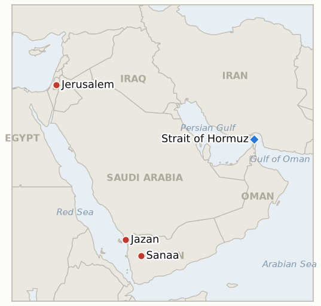

# Middle East Daily Briefing

**September 9, 2026**

- **Reporting window:** ~24 hours, September 8, 09:00 to September 9, 09:00 KST
- **Overall assessment:** Yemen's renewed war stopped being a Yemeni war alone: hours after Deputy Defense Minister Samir Al-Sabri declared the government has "decided" to retake Sanaa and fighting intensified across Taiz, Al-Bayda and Al-Jawf, the Houthis answered not against Yemeni government forces but with a direct drone and ballistic missile barrage on Saudi Arabia itself, wounding 73 people and hitting Aramco facilities in Abha, Khamis Mushait, Jazan and Najran plus King Khalid Air Base, the deepest the renewed war has cut into Saudi territory; Riyadh struck back the same day against Taiz and Marib and, per a CNN source, has told allies further retaliation is coming. Iran, separately, escalated its own Hormuz narrative from an unconfirmed claimed strike to a claimed capture of a US Navy underwater drone, a story CENTCOM contested point for point, confirming an incident occurred while insisting it was nothing more than a malfunctioning, low value asset recovered rather than seized. In the Israeli Palestinian arena, the United Kingdom broke sharply with Washington, banning trade with Israeli West Bank settlements alongside eleven other countries and formally calling the occupation unlawful, prompting Israel to close its Jerusalem consulate, end UK training of Palestinian Authority forces and bar a dozen British lawmakers, a diplomatic rupture with a US ally the State Department itself warned could complicate Gaza's peace process. And for South Korea, President Lee's Paris summit with President Macron produced a concrete, if limited, deliverable: an agreement to cooperate on restoring Hormuz freedom of navigation, even as the presidential office reiterated no deployment decision has been made, while the same day's oil shock finally broke KOSPI's week long habit of shrugging off Middle East news, reversing a brief run above 7000 to close lower as the won weakened for the first time in five sessions.

---

## 1. What Happened

<figure style="float:right; width:46%; margin:2pt 0 8pt 14pt;">

<figcaption style="font-size:8pt; color:#666; text-align:center; margin-top:3pt; font-style:italic;">Major places of discussion</figcaption>
</figure>

### 1.1 Yemen's War Spills Into Saudi Arabia as Government Vows to Retake Sanaa

Yemen's internationally recognized government escalated its declared aims Monday into Tuesday: Deputy Defense Minister Samir Al-Sabri said on state television the government has "decided" to retake Sanaa itself, while military spokesman Majid al-Nuzaili framed the campaign as liberating Yemen from the Houthis' "grip," as fighting intensified across Taiz, Al-Bayda (a hub connecting eight governorates) and Al-Jawf, the latter seen as the main gateway to the capital ([Al Jazeera](https://www.aljazeera.com/news/2026/9/8/yemeni-forces-launch-counteroffensive-against-houthis-vow-to-retake-sanaa)). The Houthis said they repelled the Al-Jawf push and accused Saudi Arabia of striking a prison in al-Hazm, killing at least seven and trapping 35 inmates under rubble ([Al Jazeera](https://www.aljazeera.com/news/2026/9/7/houthis-accuse-saudi-arabia-of-killing-seven-in-yemen-prison-attack)); the WHO separately tallied at least 728 killed or wounded since August 23 and the IOM put displacement at nearly 20,000 ([Arab News](https://www.arabnews.com/middle-east/renewed-fighting-displaces-nearly-20000-in-yemen-iom-3000917)). Hours later the war jumped Yemen's border entirely: the Houthis fired dozens of drones and ballistic missiles at Saudi Aramco facilities in Abha, Khamis Mushait, Jazan (including the 400,000 barrel a day Jazan refinery) and Najran, plus King Khalid Air Base, wounding 73 people and igniting fires that forced temporary shutdowns, the deepest the renewed war has cut into Saudi territory ([The National](https://www.thenationalnews.com/news/2026/09/08/saudi-led-coalition-in-yemen-says-73-people-wounded-in-houthi-attacks-on-saudi-arabia/); [CNN](https://www.cnn.com/2026/09/08/middleeast/houthis-attack-saudi-arabia-yemen-intl-hnk)). Saudi FM Faisal bin Farhan said the kingdom "will not hesitate to defend" itself while calling diplomacy "not closed" ([Arab News](https://www.arabnews.com/saudi-arabia/saudi-fm-says-kingdom-will-not-hesitate-to-defend-itself-against-houthi-attacks-3000913)), and Saudi forces struck Houthi positions in Taiz and Marib the same day, with a CNN source saying Riyadh has informed allies it plans further retaliation ([Euronews](https://www.euronews.com/2026/09/08/saudi-arabia-strikes-back-after-houthis-hit-oil-sites-in-heaviest-attack-in-years)). **IND-20260907-2** (Hays and adjacent gains holding) trends further toward confirmed given the declared Sanaa goal, though that is a materially larger claim than its original bar; the Saudi attack and Riyadh's response open new **IND-20260909-1**, and **IND-20260822-1**, which tested Saudi restraint after a smaller, unconfirmed August claim, resolves falsified today, four days past its own deadline, superseded in relevance by this far larger strike. **Confidence: High** on the Sanaa declaration, the Saudi attack's targets and toll, and the Saudi counterstrike (Tier 1-2, Al Jazeera, The National, CNN, Arab News, Euronews); Medium on the al-Hazm prison toll, which rests on Houthi-aligned sourcing (al-Masirah).

### 1.2 Iran Claims Capture of US Navy Underwater Drone at Hormuz, CENTCOM Disputes Account

Iranian state media reported Tuesday that the IRGC Navy captured a US Navy unmanned underwater vehicle at the entrance to the Strait of Hormuz via a "complex intelligence and field operation," with Tasnim identifying it as a Dive-LD, an autonomous submersible made by Anduril Industries and first delivered to the Navy's Unmanned Undersea Vehicle Group 1 in 2025; IRGC media said "photographic evidence and detailed footage" would follow ([Bloomberg](https://www.bloomberg.com/news/articles/2026-09-08/iran-seizes-underwater-drone-that-us-forces-say-malfunctioned); [Maritime Executive](https://maritime-executive.com/article/irgc-captures-u-s-drone-sub-in-strait-of-hormuz)). CENTCOM confirmed an incident occurred but flatly disputed Iran's framing, saying "an underwater drone operated by U.S. forces malfunctioned more than a day ago" while surveying regional waters, and that "the defective drone was an older model that neither collected sensitive data nor carried any classified sonar or radar equipment" ([Bloomberg](https://www.bloomberg.com/news/articles/2026-09-08/iran-seizes-underwater-drone-that-us-forces-say-malfunctioned)). The timing, roughly "more than a day" before Tuesday's report, aligns closely with Iran's own Sept 6 claim of striking an "unmanned US military vessel," suggesting this is the same episode reframed from a strike into a capture; either way, it is CENTCOM's first statement addressing that claim, resolving **IND-20260908-2** confirmed, six days early, though the underlying dispute over strike or capture versus malfunction is untouched and now tracked by new **IND-20260909-2**, testing whether Iran's promised photographic evidence ever surfaces. **Confidence: Medium** on an underwater drone incident having occurred (both sides agree on this much; Tier 1-2, CENTCOM statement carried by Bloomberg); **Low** on Iran's "capture via operation" framing and **Medium** on CENTCOM's "malfunction" account, since neither side's fuller narrative is independently verifiable.

### 1.3 UK Bans Trade With Israeli Settlements, Israel Closes Jerusalem Consulate in Response

UK Foreign Secretary Ed Miliband told Parliament Tuesday that "the official view of the British government is that the occupation [of the West Bank] is unlawful," announcing a ban on importing all goods from Israeli West Bank settlements and barring UK companies from financing, construction, real estate or advertising services tied to them (goods from Israel proper are unaffected), alongside sanctions on organizations and individuals financing settlement expansion and new weapons export refusals; Miliband said the government agrees settlers are carrying out "ethnic cleansing" of Palestinians in parts of the West Bank ([Al Jazeera](https://www.aljazeera.com/news/2026/9/8/uk-bans-goods-from-israeli-west-bank-settlements-what-that-really-means); [NPR](https://www.npr.org/2026/09/08/nx-s1-5961044/uk-occcupied-west-bank-goods-israel)). Eleven other countries, France, Canada, Denmark, Spain, Finland, Ireland, Iceland, Norway, Poland, Portugal and Sweden, joined a supporting statement backing a two state solution and their own trade restrictions; implementation is expected to take six to nine months. Israel's FM Gideon Saar announced four retaliatory steps: closing the British consulate in Jerusalem, ending UK training of Palestinian Authority forces, withdrawing UK representatives from Gaza Support Center coordination, and barring 12 named British MPs from entering Israel. US Secretary of State Rubio warned the move "could undermine Gaza peace efforts," saying "we're not going to do what the UK did," while Ambassador Huckabee suggested it could invite US business reprisals given roughly a quarter of UK pharmaceuticals originate in Israel ([CNBC](https://www.cnbc.com/2026/09/08/uk-israel-sanctions-miliband-florida-trump.html)). Palestine's UK ambassador called the decision "long overdue," describing a shift "from condemnation to consequences." This opens new **IND-20260909-3**, testing whether the 12 country coalition advances toward real implementation or Israel's response marks the rupture's peak. **Confidence: High** on the UK announcement's scope, the coalition statement, and Israel's four retaliatory measures (Tier 1, Al Jazeera, NPR, CNBC multi-sourced); Medium on how binding the announced six to nine month implementation timeline proves in practice.

### 1.4 Lee and Macron Agree on Hormuz Cooperation, but Seoul Confirms No Deployment Decision

President Lee and President Macron agreed at their Elysee Palace summit Tuesday to cooperate on restoring freedom of navigation through the Strait of Hormuz, with Macron describing France's planned multinational mission, which France and the UK have led since convening 35 countries' military officials in March, as "peaceful"; the two leaders said cooperation would proceed once agreement is reached among the mission's participating countries ([Korea Times](https://www.koreatimes.co.kr/world/20260909/lee-macron-back-hormuz-cooperation-stress-peaceful-multinational-mission); [SBS](https://news.sbs.co.kr/english/article.do?news_id=N1008743827)). Seoul's presidential office nonetheless said explicitly that no decision on a Korean military contribution has been made, and Iran separately warned that any South Korean involvement in Hormuz operations would be viewed as support for US military action carrying "serious consequences" ([Seoul Economic Daily](https://en.sedaily.com/politics/2026/09/09/presidential-office-says-no-decision-yet-on-hormuz-contribution)). This resolves **IND-20260907-3** confirmed, a day ahead of its deadline, since a joint statement on Hormuz cooperation is exactly the bar that indicator set; it does not, however, resolve the separate and higher bar tracked by **IND-20260906-2** (a formal National Assembly motion or vote), which stays open. **Confidence: High** on the joint agreement's substance and the presidential office's no decision statement (Tier 1-2, Korea Times, SBS, Seoul Economic Daily); Medium on how quickly a concrete Korean role follows once France's multinational framework itself firms up.

---

## 2. Deep Dive: Incentives and Motives

### 2.1 Why did the Houthis choose to strike deep into Saudi Arabia now, when doing so risks converting a Yemeni civil war into a two front conflict with the Gulf's dominant military power?

Because the government's declared goal of retaking Sanaa itself, a qualitatively larger threat than any prior phase of this renewed war, changes the Houthis' calculation about what restraint buys them: if the war's stated endpoint is now regime survival rather than a contested district or port, absorbing Saudi-backed pressure without imposing a comparable cost on Saudi Arabia's own territory offers no future bargaining leverage, so striking Aramco facilities and a Saudi air base directly is a bid to make the kingdom's continued backing of the government's Sanaa campaign expensive enough to reconsider, even at the risk of inviting the sustained Saudi combat role the restraint pattern (IND-20260822-1, IND-20260810-3) had until now avoided.

### 2.2 Why did Iran escalate its account of the Sept 6 incident from a strike to a capture, and why does Washington's competing explanation matter more than the underlying facts?

Because a claimed capture, complete with a named platform, a named manufacturer, and promised photographic evidence, is a far more visible propaganda asset than an unconfirmed claimed strike on an unnamed vessel, giving Tehran a tangible prize to display domestically at a moment when Ghalibaf's threatened "faster, heavier, more painful" response has otherwise stayed rhetorical (IND-20260907-1, still open); CENTCOM's insistence on a mundane malfunction rather than an Iranian operation matters less for the facts of one drone than for the precedent, conceding an operational capture would validate Iran's claimed ability to interdict US assets inside the strait, an admission Washington has resisted making even once during this war.

### 2.3 Why did the UK choose this week to break with the US on West Bank policy, and why did Israel respond with a consulate closure rather than an economic countermeasure?

Because London's decision to formally call the occupation unlawful lands as US attention and diplomatic capital are visibly consumed by the widening Iran and Yemen fronts, a moment when Washington is less able to spend political effort holding allies to a unified line on Gaza and the West Bank than during a quieter news cycle, and the UK's own domestic pressure over settler violence had been building since well before this window; Israel's choice of largely symbolic retaliation, a consulate closure, an end to a training program, a travel ban on lawmakers, rather than economic countermeasures against a G7 trading partner, reflects that Jerusalem has more to lose from escalating a trade fight with the UK than from a diplomatic gesture, especially with Rubio's own public objection already doing the work of pressuring London without Israel needing to spend its own economic leverage.

### 2.4 Why would Seoul agree to Hormuz cooperation with Macron while still declining to commit to an actual deployment?

Because a cooperation agreement lets President Lee return from Paris having visibly responded to sustained Trump pressure and months of US criticism over Korea's non-participation, without Seoul's own National Assembly having to first resolve the ruling coalition's internal split (IND-20260906-2, still open); tying Korea's eventual contribution to France's still-forming multinational framework, rather than to a bilateral US request, gives Lee a way to frame any future deployment as joining an established international mission rather than acting alone under direct US pressure, preserving exactly the domestic political sequencing advantage this ledger has tracked since the Sept 6 deployment story first broke.

---

## 3. Policy Implications for South Korea

**Exposure snapshot:** South Korea's crude imports remain roughly 70% dependent on Strait of Hormuz transit and about 36% of its LNG imports come from the Middle East, with Qatar's Ras Laffan as the single largest LNG supplier exposure (see `instructions/korea-exposure.md`, last updated August 14, 2026, for the full mitigation picture). No material update to these baselines surfaced in the window, though today's developments touch the exposure picture from two directions at once: a new, confirmed Hormuz cooperation framework with France, and a fresh supply shock originating not in Hormuz but in Saudi Arabia's own southern energy infrastructure.

**Implications by development:**

- **Yemen's war spilling into Saudi Arabia (§1.1):** This is the most direct new threat to Korea's energy security baseline in this ledger in weeks: the Jazan refinery and other Saudi Aramco facilities struck sit well outside the Hormuz chokepoint Korea's mitigation planning has centered on, meaning a widening Saudi-Houthi war creates supply risk that Korea's existing Bab el-Mandeb and Red Sea workaround routing does not address.
- **Iran's drone capture claim (§1.2):** Even with the underlying facts disputed, the episode keeps a steady drumbeat of Hormuz-adjacent incidents in the news, sustaining the risk premium behind today's oil price climb that Korean refiners and MOTIE's crude supply review meetings must continue pricing in.
- **UK's settlement trade ban (§1.3):** No direct Korean shipping or financial exposure, but a G7 country breaking with Washington on West Bank policy while the US pushes back publicly is a data point for MOFA on how much diplomatic space allies retain to diverge from US Middle East positioning, relevant background as Seoul weighs its own Hormuz posture independent of Washington's preferences.
- **Lee-Macron Hormuz agreement (§1.4):** The clearest Korea-specific policy line in today's ledger: a confirmed cooperation framework with France exists, but Seoul's own deployment decision remains explicitly unmade, meaning the domestic National Assembly question (IND-20260906-2) is now the binding constraint rather than the absence of an international framework to join.
- **Oil's climb and KOSPI's reversal (§1.4, market data):** Today marks the first session in over a week where Middle East risk, not the AI and chip rally, drove KOSPI's direction, a reminder that the recent decoupling was a function of a relatively quiet news cycle rather than a durable break between Korean equities and regional escalation.

**Testable indicators:**

- **IND-20260909-1** (new): The Sept 8 Houthi attack on Saudi Arabia either draws a further verified Saudi strike on Houthi targets beyond the initial Taiz/Marib response, confirming a sustained direct Saudi combat role, or Tuesday's response proves a one-off retaliation. Deadline ~2026-09-23.
- **IND-20260909-2** (new): Iran's claimed capture of a US Navy underwater drone either gets corroborated by the promised photographic and video evidence, or that evidence never surfaces, leaving CENTCOM's malfunction account as the only substantiated version. Deadline ~2026-09-16.
- **IND-20260909-3** (new): The UK's settlement trade ban either advances toward confirmed implementing steps or further country accessions, or the announcement stalls with Israel's four retaliatory measures marking the rupture's peak. Deadline ~2026-10-09.
- **IND-20260908-1** (open): Whether Israel's Sept 7 Kfar Rumman and Ghandour Hospital strikes draw a distinct humanitarian law response; none found this window. Deadline ~2026-09-22.
- **IND-20260908-3** (open): Whether the fatal Hajja raid draws a named arrest or investigation; none found this window. Deadline ~2026-09-21.
- **IND-20260907-1** (open): Whether Ghalibaf's declared end to proportionate responses converts into a qualitatively larger Iranian strike on the US; this window's escalation came from Iran's Houthi allies against Saudi Arabia instead, not from Iran directly against a US asset. Deadline ~2026-09-20.
- **IND-20260907-2** (open): Whether Yemen's government gains hold and extend; they held, and the government's own declared ambitions widened to a full Sanaa retake. Deadline ~2026-09-20.
- **IND-20260906-1** (open): Whether the IRGC repeats a confirmed direct attack on a crewed US Navy vessel; no repeat occurred, though the unmanned-vessel claim escalated into the disputed underwater drone episode. Deadline ~2026-09-19.
- **IND-20260906-2** (open): Whether Korea's Hormuz deployment reaches a formal National Assembly motion; today's Lee-Macron cooperation agreement is distinct from and does not confirm this higher bar. Deadline ~2026-09-28.
- **IND-20260905-3** (open): Whether Lebanon's widened exchange draws a UNIFIL, LAF or US-mediated statement; none surfaced this window. Deadline ~2026-09-19.
- **IND-20260904-2** (open): Whether Ben Gvir's Gaza emigration plan draws a named host country or formal government action; neither surfaced this window. Deadline ~2026-09-18.

---

## 4. Watch List

- **Trump's and Iran's Sept 1-2 escalation threats (IND-20260902-2, IND-20260903-2):** both resolved falsified today at their Sept 9 deadlines; neither a further US strike on Iranian territory nor a further Iranian strike on Jordan, Bahrain, Iraq or Kuwait materialized, though the war escalated through other channels instead (Houthi-Saudi fighting, the disputed Hormuz drone episode).
- **Saudi restraint pattern (IND-20260822-1):** resolved falsified today, four days overdue in ledger housekeeping, its practical relevance now superseded by the much larger Sept 8 attack and Saudi Arabia's confirmed response.
- **Pickaxe Mountain (IND-20260905-1):** still not struck as of this window; deadline ~09-18.
- **Ben Gvir's Disengagement 710 plan (IND-20260904-2):** still no confirmed host country interest or formal government action.
- **Janggeum Shipping's Hormuz exposure (IND-20260903-3):** deadline ~09-17; no verified change in the Korean-linked charterer's Hormuz activity this window.
- **Qatari LNG loadings at Ras Laffan (IND-20260714-4):** still no fresh weekly loading figure; the export freeze remains the ledger's longest-running unresolved indicator.
- **Israel's October 27 election:** party lists formally registered this week (38 parties), with Netanyahu presenting new Likud candidates; the campaign's framing as a referendum on the Iran war and Gaza's handling sits in the background of both the Kushner friction (IND-20260907-4) and the UK settlement rupture.

---

## 5. Source Quality Summary

| Claim | Sources | Confidence |
|---|---|---|
| Yemen's government declares goal of retaking Sanaa; fighting intensifies across Taiz, Al-Bayda, Al-Jawf | Al Jazeera, Armenpress (Tier 1-2) | High |
| Houthis accuse Saudi Arabia of al-Hazm prison strike killing at least seven | Al Jazeera, citing al-Masirah (Tier 2-3, Houthi-aligned sourcing) | Medium |
| WHO/IOM: 728 killed or wounded since Aug 23; nearly 20,000 displaced | Arab News (Tier 1-2, citing WHO/IOM) | High |
| Houthi drone/missile barrage on Saudi Aramco facilities and King Khalid Air Base wounds 73 | The National, CNN, Arab News (Tier 1-2) | High |
| Saudi FM Faisal bin Farhan's statement; Saudi forces strike Taiz and Marib same day | Arab News, Euronews (Tier 1-2) | High on the statement and strikes; Medium on Riyadh's undisclosed further retaliation plans (CNN source) |
| IRGC claims capture of US Navy Dive-LD underwater drone at Hormuz | Bloomberg, Maritime Executive, Press TV (Tier 2-3, Iranian state media plus Western wire pickup) | Low on the "capture via operation" framing |
| CENTCOM statement disputing capture, calling it a malfunction | Bloomberg (Tier 1, direct CENTCOM statement) | Medium (an incident occurred; the fuller narrative is unverifiable) |
| UK bans settlement trade, calls occupation unlawful, cites ethnic cleansing; 11 country coalition | Al Jazeera, NPR (Tier 1) | High |
| Israel closes Jerusalem consulate, bars 12 MPs, ends PA training, exits Gaza Support Center coordination | CNBC, Al Jazeera (Tier 1-2) | High |
| Rubio warns UK move could undermine Gaza peace efforts | CNBC (Tier 1) | High |
| Lee and Macron agree on Hormuz cooperation framework | Korea Times, SBS (Tier 1-2, Korean wire) | High |
| Presidential office confirms no Korean deployment decision made | Seoul Economic Daily (Tier 1-2) | High |
| Oil climbs toward 100 dollars intraday on Houthi Saudi attack | Reuters via Business Recorder, CNBC (Tier 1-2) | Medium (intraday reads, not confirmed settles) |
| KOSPI reverses run above 7000 to close 0.58% lower at 6954.52; won weakens to 1345.6 | Businesskorea, Money Today (Tier 2, Korean financial press) | High |
