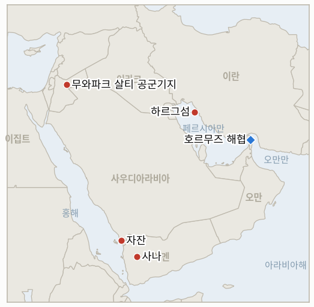

# 중동 일일 브리핑

**2026년 9월 10일**

- **보고 기간:** 약 24시간, 9월 9일 09:00 ~ 9월 10일 09:00 (한국시간)
- **종합 평가:** 전쟁의 무게중심이 한 창(窓) 안에서 두 번 옮겨갔다. 처음에는 미국과 이란의 직접 접촉 쪽으로, 그리고 몇 시간 뒤에는 다시 그로부터 멀어지는 쪽으로였다. 중부사령부는 혁명수비대가 이틀 동안 두 차례 미 군함을 노렸다가 모두 실패한 뒤 이란 유조선 5척을 파괴했다고 밝혔다. 이란의 대응은 그 군함에 대한 세 번째 시도가 아니라 요르단 무와파크 살티 공군기지를 겨냥한 탄도미사일 20발이었다. 미국 자산이 아니라 미국의 우방국을 노린 것으로, 요르단 방공망이 그중 18발을 요격했다. 이는 하루 전 후티가 사우디아라비아에 적용한 것과 같은 확전 논리이며, 예멘 정부군은 같은 논리를 밤새 이어갔다. 후티가 운영하던 한 교도소 공습 사망자는 23명으로 늘었고 리야드는 지속적 보복을 다짐했다. 이란은 또한 확전보다 드문 일을 했다. 바로 약속을 지킨 것이다. 나포했다는 안두릴 다이브-LD 무인잠수정의 사진과 영상을 공개했고, 독립적인 해군 분석가들은 이것이 미국산 설계와 신빙성 있게 일치한다고 평가했다. 중부사령부의 "고장" 설명만으로는 완전히 뒤집을 수 없는, 테헤란의 서사에 유리한 성과다. 한국에는 이날 결정이 아니라 절차가 주어졌다. 이미 UAE에 파견된 점검단, "아무것도 결정된 바 없다"를 반복하는 국무총리와 국가안보실장, 그리고 이 모든 것을 무시한 증시였다. 코스피는 33거래일 만에 처음으로 7,000선을 회복했고, 이는 브렌트유가 다시 100달러를 넘고 트럼프 대통령이 자신이 거듭 "곧 끝난다"고 말해온 전쟁이 실은 11월 중간선거 이후까지 이어질 것이라고 묻지도 않았는데 시인한 것과 같은 날 벌어진 일이다.

---

## 1. 무슨 일이 있었나

<figure style="float:right; width:46%; margin:2pt 0 8pt 14pt;">

<figcaption style="font-size:8pt; color:#666; text-align:center; margin-top:3pt; font-style:italic;">주요 논의 지점</figcaption>
</figure>

### 1.1 중부사령부, 이란 유조선 5척 파괴… 이란은 요르단 아즈라크 기지에 미사일 보복

중부사령부는 화요일 밤에서 수요일 사이 미군이 이란 정부 소유 유조선 5척, 오만 만의 카비즈함·차르미나르함·호라이즌1함·리에스코함과 하르그섬 인근의 데리아함을 파괴했다고 밝혔다. 혁명수비대가 "지난 이틀간 두 차례 미 군함을 노렸다"는 데 따른 대응으로, 중부사령부는 해당 함정이 두 시도 모두 "성공적으로 회피"했으며 미군 인명피해는 없었다고 설명했다. 유조선 승조원들은 미군이 선박을 무력화하기 전 배에서 대피하도록 안내받았다([Al Jazeera](https://www.aljazeera.com/news/2026/9/9/us-destroys-five-iranian-tankers-iran-retaliates-with-attacks-on-jordan-base)). 혁명수비대는 별도로 탄도미사일 공격으로 미 해군 구축함 DDG-119함과 DDG-53함에 "상당한 피해"를 입혔다고 주장했으나, 중부사령부는 이를 "완전한 거짓"이라며 "미 해군 함정은 타격을 입지 않았다", "혁명수비대의 모든 공격 시도는 실패했다"고 못박았다. 유조선 파괴에 대한 이란의 보복은 미 해군 표적이 아니라 요르단 무와파크 살티(아즈라크) 공군기지에 이번 전쟁 두 번째로 가해졌다. 혁명수비대는 탄도미사일 20발을 발사했고 요르단 방공망이 그중 18발을 요격·파괴했으며 나머지 2발은 무인 지역에 떨어져 인명피해는 없었다. 혁명수비대는 미군 전투기가 있던 격납고가 파괴됐다고 주장했으나 확인되지 않았다([Al Jazeera](https://www.aljazeera.com/news/2026/9/9/what-is-jordans-al-azraq-base-and-why-is-iran-targeting-it)). 소식이 전해지며 브렌트유는 5월 이후 처음으로 다시 배럴당 100달러를 돌파했다. 트럼프 대통령은 전쟁의 향방을 묻는 질문에 "선거가 끝나면 곧바로 전쟁이 끝날 것이라고 생각한다. 그들이 더는 버틸 수 없기 때문"이라며 이란이 "선거에 영향을 미치려고 필사적"이라고 덧붙였고, 오른 휘발유 가격이 11월 전에는 낮아지지 않을 것이라고도 했다([CNN](https://www.cnn.com/2026/09/09/politics/iran-war-end-midterms-trump)). 이는 **IND-20260907-1**을 시한보다 닷새 앞서 확증으로 종결시킨다. 갈리바프가 위협한 "더 빠르고 무겁고 고통스러운" 대응이 기존의 유조선 대 유조선 패턴을 넘어 미군 자산이 주둔한 제3국 공군기지에 대한 타격으로 실현된 것이다. 다만 혁명수비대가 주장한 구축함 피해는 여전히 논란이며 확인되지 않았다(계속 추적하는 **IND-20260906-1**은 열려 있음). **신뢰도: 높음** (유조선 타격, 실패한 군함 공격 시도, 요르단 미사일 공격과 요격 수치, 1등급, 중부사령부·요르단군 성명을 인용한 Al Jazeera); 혁명수비대가 주장한 구축함 피해는 중부사령부가 명확히 부인하고 있어 **낮음**.

### 1.2 예멘의 사우디-후티 전쟁, 더욱 확대… 교도소 사망자 늘고 리야드는 지속 공습 다짐

예멘의 재개된 전쟁은 화요일 사우디아라비아로 번진 이후에도 계속됐다. 앞서 사우디 주도 연합군의 공습을 받은 알하즘의 후티 운영 교도소에서 수요일 시신 4구가 추가로 수습되며 해당 사건 사망자가 23명으로 늘었다([KSAT/AP](https://www.ksat.com/news/world/2026/09/09/yemens-houthi-rebels-say-saudi-backed-forces-launched-airstrikes-and-other-key-mideast-news/)). 후티 측은 사우디 지원 부대가 예멘 4개 주 전역에 밤새 수십 차례 공습을 가했다고 밝혔다. 이는 후티 자신이 화요일 사우디아라비아를 향해 가한 공세에 대한 보복으로 규정됐으며, 후티는 아브하·카미스 무샤이트·자잔·나즈란에 대한 자신들의 공격을 앞선 사흘간 사우디가 예멘에 가한 120회 이상의 공습에 대한 대응으로 규정했다. 사우디 연합군 관계자들은 추가 후티 공격을 억제하기 위해 "필요한 모든 작전 조치를 취하겠다"고 다짐했다. 지상에서는 정부 측 부대가 알바이다주의 알라바나트 산악지대와 디 나임 지역으로 진격했고, 화요일 선언한 공세를 이어가며 사나로 가는 주요 관문으로 꼽히는 알자우프주의 야트마 마을을 점령했다([Al Jazeera](https://www.aljazeera.com/news/2026/9/8/saudi-houthi-fighting-in-yemen-escalates-what-happened-and-whats-next)). 타이즈 전투 재개 이후 피란민은 약 2만 1,000명(약 3,000가구)에 달했으며, 사우디 평론가 칼레드 바타르피 등 분석가들은 이번 교전이 장기 전면전으로 번지지는 않은 채 계속 격화될 것으로 내다봤다. 이는 **IND-20260909-1**을 시한보다 2주 앞서 확증으로 종결시킨다. 후티 측이 밝힌 "4개 주 전역 수십 차례 공습"은 사우디가 화요일 발표한 최초의 타이즈·마리브 대응을 훨씬 넘어서는 것으로, 지속적인 사우디 직접 전투 개입이라는 기준을 충족한다. **IND-20260907-2**(예멘 정부군 전과 유지)는 야트마 점령으로 확증 쪽에 더 가까워졌으나, 늘어나는 사망자 수는 이를 비용이 낮고 결정적인 전환으로 읽기 어렵게 만든다. **신뢰도: 높음** (교도소 사망자 증가와 정부 측 영토 주장, 1~2등급, Al Jazeera·AP); 후티 측의 "사우디 120회 공습" 규정과 "밤새 수십 차례 공습" 수치는 후티 측 소식통에 의존하고 있어 독립적으로 검증되지 않아 **중간**.

### 1.3 이란, 나포한 미군 드론의 사진·영상 증거 공개… 독립 분석가들이 신빙성 뒷받침

이란 관영 매체는 앞서 약속한 안두릴 다이브-LD 무인잠수정 나포의 사진과 영상 증거를 공개했다. 바지선 위에 거의 온전한 상태로 놓인 해당 기체를 보여주며 약 5.8미터 길이의 선체, 노즈콘, 침수구, 투명한 전방 마스트, X자형 후미 제어면이 확인됐다([Naval News](https://www.navalnews.com/naval-news/2026/09/underwater-drone-captured-by-iran-matches-american-anduril-model/)). 독립 해군 분석가들은 해당 영상이 세밀한 부분까지 미국산 다이브-LD 설계와 신빙성 있게 일치한다고 평가했다. 이는 이란이 확보한 드론이 중부사령부 스스로 호르무즈 해협 인근에서 고장났다고 확인한 그 실물임을 뒷받침하는 것이다. 다만 이 영상만으로는 혁명수비대 주장대로 작전을 통해 적극적으로 나포했는지, 아니면 중부사령부 주장대로 단순히 무력화된 기체를 회수했는지는 판단할 수 없다([Newsweek](https://www.newsweek.com/dive-ld-submarine-iran-capture-12419188)). 이는 **IND-20260909-2**를 시한보다 일주일 앞서 확증으로 종결시킨다. 이 지표가 정한 구체적 기준, 즉 이란이 약속한 사진·영상 증거가 실제로 공개되는지 여부가 이제 충족됐으며, 나포냐 고장이냐 하는 더 좁은 쟁점만이 유일하게 미해결로 남았다. **신뢰도: 높음** (영상이 진짜 안두릴 다이브-LD 드론을 촬영한 것이라는 점, 1~2등급, Naval News·Newsweek 및 독립적 설계 분석); 이란의 "작전을 통한 나포" 구성과 중부사령부의 "고장 후 회수" 구성 중 어느 쪽이 실제 경위를 더 정확히 설명하는지는 **중간**.

### 1.4 한국, 호르무즈 평가를 위해 UAE에 점검단 파견… 결정 없이 검토만 진전

한국 국방부는 주말 동안 지역 안보 상황과 호르무즈 해협의 운용 환경을 평가하기 위한 현장 점검단이 UAE로 출발했다고 확인했다. 점검단은 이르면 이번 주 국가안전보장회의에 결과를 보고할 예정이다([Korea Herald](https://www.koreaherald.com/article/10867867)). 위성락 국가안보실장은 논의의 초점이 파병 자체보다는 한국이 국제 해상 안보 노력에 어떻게 기여할 수 있을지에 맞춰져 있다며 "아직 검토 단계"라고 밝혔고, 한성숙 국무총리는 "파병과 관련한 어떤 사항도 아직 결정된 바 없다"고 분명히 했다. 대통령실 관계자는 국회 동의 관련 논의가 다음 주 국가안전보장회의에서 시작될 수 있다면서도 "현재로서는 아무것도 결정되지 않아 구체적인 시간표를 제시하기 어렵다"고 말했다. 절차가 진행될 경우 국가안전보장회의 검토, 국무회의 심의, 국회 동의의 순서를 거치게 된다. 이는 **IND-20260906-2**를 갱신한다. 정식 동의안은 여전히 제출되지 않았으나, 절차는 당내 논쟁 단계에서 현장 점검단이 파견되는 사실 확인 단계로 가시적으로 진전됐다. 이는 이재명 대통령의 유엔총회 방문과 맞물린 9월 28일경 시한을 앞두고 있다. **신뢰도: 높음** (점검단 파견과 관계자들의 발언, 1~2등급, Korea Herald·Japan Times); 점검단의 조사 결과가 실제 국회 동의안에 얼마나 직접적으로 반영될지는 **중간**.

### 1.5 아랍·이슬람권 8개국, 영국의 정착촌 금지 지지… 워싱턴은 거부, 가자 폭력은 계속

UAE, 이집트, 카타르, 요르단, 인도네시아, 파키스탄, 튀르키예, 사우디아라비아 8개국 외무장관은 공동성명을 내고 영국의 서안 정착촌 교역 금지를 환영하며 "다른 국가들도 국제법에 따라 유사한 조치를 취하도록 독려하기를 바란다"고 밝히고, 정착촌 관련 활동에 연루된 이들에 대한 책임 추궁을 요구했다([The National](https://www.thenationalnews.com/news/mena/2026/09/09/uae-and-seven-arab-and-muslim-states-welcome-uk-restrictions-on-illegal-israeli-settlement-goods/)). 루비오 국무장관은 워싱턴이 동참하지 않을 것임을 재확인했다. "당연히 우리는 영국이 한 일을 하지 않을 것"이라며, "지역에서 이미 많은 일이 벌어지고 있는 가운데" 서안에서 "불안정을 초래할 만한 일"을 피하고 싶다고 밝혔다([Times of Israel](https://www.timesofisrael.com/liveblog_entry/rubio-obviously-us-will-not-be-joining-uk-sanctions-on-west-bank-settlements/)). 허커비 대사가 미국이 영국 기업들에 보복할 수 있다고 시사한 발언에 대해서는 백악관이 거리를 두며, 한 관계자가 해당 발언이 "백악관 또는 국무부와 조율되지 않았다"고 밝혔다([Axios](https://www.axios.com/2026/09/09/trump-burnham-uk-sanctions-israel-settlements-west-bank)). 한편 하마스는 2011년 샬리트 교환으로 석방된 인물로 군 지휘관이라고 설명한 파라 하메드가 가자시티 셰이크 이즐린 지구에서 이스라엘 공습으로 사망했다고 확인했다. 명목상의 휴전 속에서도 계속되는 공습 패턴이다. 사르 외무장관은 슬로베니아에 대사관을 개설하며 이스라엘이 가자 팔레스타인 주민을 "추방하거나 강제 이주시킬 계획이 없다"고 밝혔고, 별도로 정착촌 조치에 반대한 영국 정치인 나이절 패라지에게 감사를 표했다([Times of Israel](https://www.timesofisrael.com/liveblog-september-09-2026/)). 이는 **IND-20260909-3**을 갱신한다. 아랍·이슬람권 국가들의 성명은 외교적 무게를 더하지만, 교역 금지에 새로운 국가가 동참하거나 영국의 구체적 이행 조치가 이뤄진 것은 아니어서 시한을 10월 9일경으로 두고 여전히 열려 있다. **신뢰도: 높음** (공동성명 내용과 서명국, 루비오·허커비 발언, 1등급, The National·Times of Israel·Axios); 셰이크 이즐린 공습의 표적 신원은 하마스 자체 설명에 의존하고 있어 **중간**, 사르 장관의 발언은 **높음**.

---

## 2. 심층 분석: 동기와 이해관계

### 2.1 이란은 왜 두 차례 공격에서 살아남은 미 군함을 세 번째로 노리는 대신 요르단에 보복했나?

이미 혁명수비대 미사일을 두 차례 피한, 아마도 미군의 근접 호위와 다층 방공망을 갖춘 표적을 세 번째로 노려 실패한다면 이는 결의가 아니라 이란의 취약함을 드러내는 셈이 된다. 반면 요르단의 아즈라크 기지는 방어되고 있음에도 20발 중 18발만 요격했을 뿐이어서, 테헤란에게 유조선 5척을 직접 파괴한 미 해군 자산을 건드리지 않고도 미국 우방국의 영토를 타격할 기회를 제공한다. 이는 하루 전 후티가 사우디아라비아에 적용한 것과 같은 전가(轉嫁)의 논리로, 계속되는 미국의 압박에 따른 비용을 지역 중개국이 짊어지게 만들어, 현재 해상에서 밀리고 있는 싸움에 이란을 직접 끌어들이지 않으려는 것이다.

### 2.2 트럼프가 전쟁이 중간선거 이후까지 이어진다고 공개적으로 시인하는 것은 왜 모호한 "곧 끝난다"는 수사보다 더 큰 전략적 위험을 안고 있나?

막연한 약속을 되풀이하는 대신 구체적인 날짜를 명시하는 것은 신뢰의 문제를 테헤란이 이제 맞춰 계획할 수 있는 구체적인 시한으로 바꿔버리며, 이란이 "선거에 영향을 미치려고 필사적"이라는 시인은 군사적으로 맞서는 대신 미국 국내 정치 일정을 이용해 전쟁을 끌고 가겠다는 이란의 전략이 어느 정도 효과를 거두고 있음을 암묵적으로 인정하는 셈이다. 반면 전쟁 7개월째, 역대 최저 지지율 속에서 끝없이 "곧"이라는 말을 반복하는 것 역시 그 자체로 신뢰를 갉아먹고 있었다. 결국 트럼프는 한 가지 정치적 비용(장기화 시인)을 또 다른 비용(검증 불가능한 추가 약속)과 맞바꾼 셈이며, 유조선·요르단 공격으로 다시 오른 휘발유 가격은 어느 쪽이든 국내적으로 다루기 더 어려운 문제가 되고 있다.

### 2.3 아랍·이슬람권 8개국은 왜 이스라엘 정착촌 정책에 독자적으로 대응하는 대신 공동성명을 택했나?

런던의 조치를 확대하는 공동성명은 아부다비·리야드·카이로 등에 실질적 비용을 전혀 부과하지 않으면서도, 각국은 자신의 양자 간 레버리지를 소비하지 않을 저마다의 이유를 갖고 있다. UAE는 아브라함 협정에 따른 경제적 유대, 이집트는 캠프 데이비드에 기반한 관계, 걸프 국가들은 일반적으로 무역 레버리지를 일방적으로 행사하기보다 비축해두려는 선호를 갖고 있다. 영국의 조치를 빌려 쓰는 것은 이들 정부가 이스라엘이나 워싱턴과의 관계를 단절시킬 수 있는 독자적 조치 없이도 국내외 여론 압력에 대응하고 공식적 반대 입장을 표명할 수 있게 해준다.

### 2.4 서울은 왜 워싱턴의 압박에 직접 대응하는 대신 UAE 현지 조사와 다단계 국가안전보장회의 절차를 거치나?

기술적인 평가단의 조사 결과는 이재명 대통령에게 트럼프의 거듭된 공개 비판에 굴복한 결정이 아니라 근거에 기반한 권고안으로 내세울 수 있는 명분을 제공한다. 동시에 국가안전보장회의 검토, 국무회의 심의, 국회 동의라는 다단계 절차는 집권 여당 내 반대 세력(IND-20260906-2)이 정식 표결이 불가피해지기 전에 입장을 결집하거나 공개적으로 분열되도록 시간을 벌어준다. 이는 9월 초 파병 계획이 처음 불거진 이래 이 지표가 계속 추적해온 것과 동일한 시간 벌기 전략이다.

---

## 3. 한국에 대한 정책적 함의

**노출도 스냅샷:** 한국의 원유 수입은 여전히 약 70%가 호르무즈 해협 통항에 의존하며, LNG 수입의 약 36%가 중동산이다. 카타르 라스라판이 최대 LNG 공급처 노출 요인이다(`instructions/korea-exposure.md`, 2026년 8월 14일 최종 갱신 참조). 이번 보고 기간 중 이들 기준치에 실질적 변화는 없었으나, 오늘의 사태 전개는 그림을 바꾸기보다는 더 선명하게 만든다. 호르무즈 기여 여부에 대한 구체적인 절차상 진전이 있었고, 동시에 전쟁의 물리적 위험이 해협 안에만 머무르지 않고 요르단으로, 사우디아라비아로, 예멘의 교도소 공습으로까지 계속 바깥으로 번지고 있다는 새삼스러운 확인이 있었다.

**사안별 함의:**

- **중부사령부의 유조선 타격과 요르단 미사일 공격(§1.1):** 비교적 잠잠했던 시기 이후 미국과 이란의 직접 군사적 충돌이 재개됐으며, 트럼프 스스로 11월 이후까지 전쟁이 이어질 것이라고 시인한 것은 산업통상자원부와 한국 정유사들이 대비해야 할 계획 수립 기간을 실질적으로 늘린다. 브렌트유의 100달러 재돌파는 가장 뚜렷한 단기 비용 전이 경로다.
- **예멘 전쟁의 확대(§1.2):** 이번 주 이미 타격을 입은 자잔 정유공장과 여타 아람코 시설은 한국의 기존 완화 대책이 집중해온 호르무즈 병목 지점 바깥에 있으며, IND-20260909-1로 이제 확증된 지속적인 사우디 직접 전투 개입은 한국의 얀부 경유 우회 노선과 관련된 홍해 회랑의 추가 교란 가능성을 높인다.
- **이란의 검증된 드론 증거(§1.3):** 테헤란의 선전전 승리이지만 그 자체로 한국의 노출도를 바꾸지는 않는다. 다만 이번 주 유가 상승을 뒷받침한 위험 프리미엄에 계속 불을 지피는, 끊이지 않는 호르무즈 인접 사건 중 하나다.
- **한국의 UAE 점검단(§1.4):** 오늘 보고서에서 가장 뚜렷한 국내 정책 노선이다. 검토가 당내 논쟁에서 실질적인 사실 확인 단계로 눈에 띄게 진전됐으나, 당국자들은 아직 시간표가 없다고 분명히 밝히고 있어 IND-20260906-2의 9월 28일경 시한이 여전히 구속력 있는 단기 시험대로 남는다.
- **정착촌·가자 관련 사안(§1.5):** 한국의 직접적인 해운·금융 노출은 없으나, G7 및 아랍권이 지지하는 조치에 워싱턴이 명확히 동참을 거부하고 백악관이 자국 대사의 보복 위협 발언과 거리를 둔 것은 가까운 동맹국 사이에서조차 미국의 중동 외교가 얼마나 갈라져 있는지를 보여주는 외교부 참고 자료이며, 서울이 자국의 호르무즈 입장을 워싱턴의 선호와 얼마나 긴밀히 맞출지 가늠하는 데 유의미한 배경이 된다.

**검증 가능한 지표:**

- **IND-20260910-1** (신규): 이란의 요르단 아즈라크 기지 공격이 향후 2주 안에 미군이 주둔한 제3국 기지(UAE, 바레인, 카타르, 이라크)에 대한 추가 이란 타격으로 확대되는지, 아니면 전쟁의 물리적 격렬함이 미국-이란 간 직접적인 영토 공방 없이 유조선·단일 기지 타격 수준에서 정체되는지 검증한다. 시한 ~2026-09-24.
- **IND-20260910-2** (신규): 아즈라크 기지가 이번 전쟁 두 번째로 공격당한 요르단이 요격 발표를 넘어서는 공식 외교·군사적 대응(테헤란 주재 대사 소환, 집단방위 체제 발동, 추가 방공 자산 요청)에 나서는지, 아니면 요격 발표 수준에 머무는지 검증한다. 시한 ~2026-09-23.
- **IND-20260910-3** (신규): 전쟁이 "선거 직후 끝날 것"이라는 트럼프의 예측이 11월 3일 중간선거로부터 약 2주 이내의 확정된 휴전, 협상 타결, 또는 미군 일방적 철수로 실현되는지, 아니면 같은 기간이 지나도 전투가 미해결로 계속돼 이 지표가 추적해온 일련의 미이행 "곧 끝난다"는 주장 중 하나로 반증되는지 검증한다. 시한 ~2026-11-17.
- **IND-20260909-3** (열림): 영국의 정착촌 금지가 이행 또는 추가 동참국 확대로 나아가는지 여부. 오늘 아랍·이슬람권 국가들의 성명은 외교적 무게를 더했으나 두 기준 중 어느 것도 충족하지 못했다. 시한 ~2026-10-09.
- **IND-20260907-2** (열림): 예멘 정부군의 전과가 유지·확대되는지 여부. 야트마 점령과 디 나임에 대한 계속된 압박으로 확증 쪽에 한층 더 가까워졌다. 시한 ~2026-09-20.
- **IND-20260906-1** (열림): 혁명수비대가 승조원이 탑승한 미 해군 함정에 대한 확인된 직접 공격을 반복하는지 여부. 오늘 주장된 DDG-119함·DDG-53함 공격은 중부사령부가 부인하고 있어 여전히 미확인이다. 시한 ~2026-09-19.
- **IND-20260906-2** (열림): 한국의 호르무즈 파병이 정식 국회 동의안 단계에 이르는지 여부. UAE 점검단 파견으로 절차는 진전됐으나 아직 이 기준에는 미달한다. 시한 ~2026-09-28.
- **IND-20260908-1** (열림): 이스라엘의 9월 7일 크파르 룸만·간두르 병원 타격이 국제인도법 차원의 별도 대응을 이끌어내는지 여부. 이번 보고 기간 중 확인되지 않았다. 시한 ~2026-09-22.
- **IND-20260908-3** (열림): 하자 마을 치명적 급습에 대해 신원이 확인된 체포나 수사가 이뤄지는지 여부. 이번 보고 기간 중 확인되지 않았다. 시한 ~2026-09-21.
- **IND-20260904-2** (열림): 벤그비르의 가자 이주 계획이 특정 수용국이나 공식 정부 조치를 이끌어내는지 여부. 이번 보고 기간 중 확인되지 않았다. 시한 ~2026-09-18.

---

## 4. 주시할 사안

- **요르단의 두 번째 아즈라크 피격:** 해당 기지는 이번 전쟁에서 8월 말과 오늘 두 차례 공격받았다. 암만의 대응은 지금까지 요격 발표에 그치고 있으며, 정책 전환 여부는 신규 IND-20260910-2가 추적한다.
- **트럼프의 중간선거 발언(IND-20260910-3):** 전쟁의 예상 지속 기간을 직접적으로 재설정한다는 점에서 11월 3일까지 추적할 가치가 있는 장기 지표다.
- **픽액스산(IND-20260905-1):** 이번 보고 기간까지 아직 타격받지 않았다. 시한 ~09-18.
- **벤그비르의 '탈출710' 계획(IND-20260904-2):** 여전히 확인된 수용국 관심이나 공식 정부 조치가 없다.
- **장금해운의 호르무즈 노출(IND-20260903-3):** 시한 ~09-17. 이번 보고 기간 중 한국 관련 용선사의 호르무즈 활동에 검증된 변화가 없다.
- **라스라판 카타르 LNG 선적(IND-20260714-4):** 여전히 새로운 주간 선적 수치가 없다. 이 지표는 원장에서 가장 오래 미해결 상태로 남아 있는 지표다.
- **이스라엘 10월 27일 총선:** 10월 7일 이전 UAE의 하마스 공격 경고 의혹을 보도한 하레츠에 대해 리쿠드당이 해당 신문과 기자들에 대한 형사수사를 요구하고 네타냐후가 소송을 제기하겠다고 위협하면서, 이란 전쟁 및 가자 대응 논쟁과 나란히 선거 전 정치 공방의 새로운 전선이 추가됐다.

---

## 5. 출처 품질 요약

| 주장 | 출처 | 신뢰도 |
|---|---|---|
| 중부사령부가 실패한 혁명수비대 미 군함 공격 시도 이후 이란 유조선 5척 파괴 | Al Jazeera (1등급, 중부사령부 성명) | 높음 |
| 혁명수비대가 DDG-119함·DDG-53함 구축함 공격 주장, 중부사령부는 "완전한 거짓"이라 반박 | Al Jazeera (1등급, 중부사령부 성명) | 혁명수비대 주장은 낮음; 중부사령부의 부인은 높음 |
| 이란이 요르단 아즈라크 기지에 미사일 20발 발사, 18발 요격, 인명피해 없음 | Al Jazeera (1등급, 요르단군 성명) | 높음 |
| 브렌트유 100달러 재돌파, 트럼프는 전쟁이 중간선거 이후 끝날 것으로 예측 | CNN, Washington Times, NBC, Fortune (1~2등급) | 유가 움직임은 높음; 트럼프 발언 해석은 중간 |
| 알하즘 교도소 공습 사망자 23명으로 증가 | AP via KSAT (1~2등급) | 높음 |
| 후티, 4개 주에 걸친 밤새 수십 차례 사우디 공습을 보복으로 규정 | AP via KSAT, 후티 측 발표 인용 (2~3등급) | 중간 |
| 예멘 정부군, 야트마 점령·디 나임과 알라바나트 압박 | Al Jazeera (1~2등급) | 높음 |
| 이란, 다이브-LD 드론 사진·영상 증거 공개, 독립적으로 안두릴 설계와 일치 확인 | Naval News, Newsweek (1~2등급, 독립 설계 분석) | 진위 여부는 높음; 나포냐 고장이냐는 중간 |
| 한국, UAE 점검단 파견… 국무총리·국가안보실장의 미결정 발언 | Korea Herald, Japan Times (1~2등급) | 높음 |
| 아랍·이슬람권 8개국 공동성명, 영국 정착촌 금지 지지 | The National, Arab News (1~2등급) | 높음 |
| 루비오, 영국 제재 동참 거부… 허커비의 보복 위협 발언은 백악관이 부인 | Times of Israel, Axios (1등급) | 높음 |
| 하마스, 파라 하메드 가자시티 공습 사망 확인… 사르, 가자 주민 추방 계획 없다고 발언 | Times of Israel 라이브블로그 (1~2등급) | 표적 신원은 중간; 사르 발언은 높음 |
| 코스피 33거래일 만에 7,000선 회복, 7,051.64 마감(+1.40%); 원화는 1,336.1로 강세 | Seoul Economic Daily, SBS (1~2등급, 한국 경제지) | 높음 |
