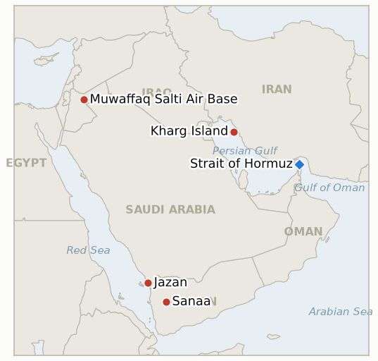

# Middle East Daily Briefing

**September 10, 2026**

- **Reporting window:** ~24 hours, September 9, 09:00 to September 10, 09:00 KST
- **Overall assessment:** The war's center of gravity shifted twice in one window, first back toward direct US Iran contact and then, within hours, away from it again. CENTCOM said it destroyed five Iranian oil tankers after the IRGC tried twice in two days to hit a US Navy warship and failed both times; Iran's answer was not a third attempt on that ship but 20 ballistic missiles at Jordan's Muwaffaq Salti air base, a US partner rather than a US asset, of which Jordanian air defenses intercepted 18, the same escalation logic the Houthis applied against Saudi Arabia a day earlier and Yemen's government continued grinding through overnight, with a Houthi run prison's strike toll climbing to 23 and Riyadh vowing sustained retaliation. Iran also did something rarer than escalate: it produced the evidence it promised, releasing photographs and footage of the captured Anduril Dive LD drone that independent naval analysts say credibly matches the American design, a win for Tehran's narrative that CENTCOM's malfunction account cannot fully unwind. For South Korea, the day supplied process rather than decision: an assessment team already dispatched to the UAE, a prime minister and national security adviser both repeating that nothing has been decided, and a market that shrugged all of it off, with KOSPI reclaiming 7,000 for the first time in 33 sessions even as Brent broke back above 100 dollars and President Trump conceded, unprompted, that the war he has repeatedly said was ending soon will instead run past November's midterms.

---

## 1. What Happened

<figure style="float:right; width:46%; margin:2pt 0 8pt 14pt;">

<figcaption style="font-size:8pt; color:#666; text-align:center; margin-top:3pt; font-style:italic;">Major places of discussion</figcaption>
</figure>

### 1.1 CENTCOM Destroys Five Iranian Tankers, Iran Answers With a Missile Barrage on Jordan's Azraq Base

CENTCOM said US forces destroyed five Iranian government oil tankers overnight Tuesday into Wednesday, M/T Kaviz, M/T Charminar, M/T Horizon 1 and M/T Riesco in the Gulf of Oman, plus M/T Derya near Kharg Island, after the IRGC "sought to target a US warship twice over the past two days," attempts CENTCOM said the vessel "successfully evaded" with no American personnel harmed; crews of the tankers were directed to abandon ship before US forces rendered the vessels inoperable ([Al Jazeera](https://www.aljazeera.com/news/2026/9/9/us-destroys-five-iranian-tankers-iran-retaliates-with-attacks-on-jordan-base)). The IRGC separately claimed ballistic missile strikes caused "significant damage" to US Navy destroyers DDG-119 and DDG-53, a claim CENTCOM called "completely FALSE," stating flatly that "no U.S. Navy warship has been struck" and "all IRGC attempted attacks failed." Iran's retaliation for the tanker strikes landed not on a US Navy target but on Jordan's Muwaffaq Salti (Azraq) air base for the second time this war: the IRGC fired 20 ballistic missiles, which Jordanian air defenses intercepted and destroyed 18 of, with the remaining two falling in unpopulated areas and no casualties reported; the IRGC claimed, unconfirmed, that hangars housing US fighter jets were destroyed ([Al Jazeera](https://www.aljazeera.com/news/2026/9/9/what-is-jordans-al-azraq-base-and-why-is-iran-targeting-it)). Brent crude broke back above 100 dollars a barrel for the first time since May on the news, and President Trump, asked about the war's trajectory, predicted it "is going to end immediately after the election because they can't hold out any longer," adding Tehran is "desperate to try and affect the election" and that elevated gas prices are unlikely to ease before November ([CNN](https://www.cnn.com/2026/09/09/politics/iran-war-end-midterms-trump)). This resolves **IND-20260907-1** confirmed, five days early: Ghalibaf's threatened "faster, heavier, more painful" response materialized as a strike on a third country's air base hosting US assets, qualitatively beyond the existing tanker for tanker pattern, even as the IRGC's claimed destroyer strikes remain disputed and unconfirmed (tracked further by **IND-20260906-1**, still open). **Confidence: High** on the tanker strikes, the failed warship attempts, and the Jordan missile barrage and interception count (Tier 1, CENTCOM and Jordanian Armed Forces statements via Al Jazeera); **Low** on the IRGC's claimed destroyer damage, which CENTCOM explicitly denies.

### 1.2 Yemen's Saudi Houthi War Widens Further as Prison Toll Rises and Riyadh Vows Sustained Strikes

Yemen's renewed war ground on past its Tuesday spillover into Saudi Arabia: four more bodies were recovered Wednesday from the Houthi run prison in al-Hazm hit by an earlier Saudi led coalition strike, raising that single incident's death toll to 23 ([KSAT/AP](https://www.ksat.com/news/world/2026/09/09/yemens-houthi-rebels-say-saudi-backed-forces-launched-airstrikes-and-other-key-mideast-news/)). The Houthis said Saudi backed forces launched dozens of airstrikes overnight across four Yemeni provinces, which they described as retaliation for the Houthis' own Tuesday barrage on Saudi Arabia, while framing their attack on Abha, Khamis Mushait, Jazan and Najran as answering more than 120 Saudi strikes on Yemen over the preceding three days; coalition officials vowed to "take all necessary operational measures to deter" further Houthi attacks. On the ground, government aligned forces pressed toward the al-Labanat mountains and Dhi Na'im district in al-Bayda and captured the town of Yatma in al-Jawf, the same province seen as the main gateway to Sanaa, continuing the advance declared Tuesday ([Al Jazeera](https://www.aljazeera.com/news/2026/9/8/saudi-houthi-fighting-in-yemen-escalates-what-happened-and-whats-next)). Displacement from Taiz alone reached roughly 21,000 people (about 3,000 families) since fighting resumed there, and analysts including Saudi commentator Khaled Batarfi expect the exchange to keep escalating without becoming a prolonged, full scale war. This resolves **IND-20260909-1** confirmed, two weeks early: the Houthis' own account of "dozens of airstrikes" across four provinces overnight is well beyond the initial Taiz and Marib response Saudi Arabia announced Tuesday, meeting the bar for a sustained direct Saudi combat role; **IND-20260907-2** (Yemeni government gains holding) trends further toward confirmed with Yatma's capture, though the mounting toll continues to cut against reading this as a low cost, decisive shift. **Confidence: High** on the prison toll increase and the government's territorial claims (Tier 1-2, Al Jazeera, AP); Medium on the Houthis' "120 Saudi strikes" framing and the overnight "dozens of airstrikes" count, both sourced to the Houthi side rather than independently verified.

### 1.3 Iran Releases Photographic and Video Evidence of Captured US Drone, Corroborated by Independent Analysts

Iranian state media published the photographic and video evidence of the captured Anduril Dive LD underwater drone it had promised, showing the vehicle largely intact aboard a barge, its roughly 5.8 meter hull, nose cone, flood holes, transparent forward mast and X form stern control surfaces visible ([Naval News](https://www.navalnews.com/naval-news/2026/09/underwater-drone-captured-by-iran-matches-american-anduril-model/)). Independent naval analysts assessed the imagery as credibly matching the American built Dive LD design in fine detail, corroborating that the drone in Iran's possession is the genuine article CENTCOM itself confirmed malfunctioned near the Strait of Hormuz, even though the images alone cannot settle whether Iran actively captured it via an operation, as the IRGC claims, or simply recovered a disabled vessel, as CENTCOM maintains ([Newsweek](https://www.newsweek.com/dive-ld-submarine-iran-capture-12419188)). This resolves **IND-20260909-2** confirmed, a week early: the specific bar this indicator set, whether Iran's promised photographic and video evidence would ever surface, is now met, leaving the narrower capture versus malfunction dispute as the only unresolved thread. **Confidence: High** that the imagery depicts a genuine Anduril Dive LD drone (Tier 1-2, Naval News, Newsweek, independent design analysis); Medium on whether Iran's "capture via operation" framing or CENTCOM's "malfunction and recovery" account better describes how it ended up on Iranian hands.

### 1.4 South Korea Dispatches Assessment Team to the UAE as Hormuz Review Advances Without a Decision

South Korea's Defense Ministry confirmed an on-site assessment team departed for the United Arab Emirates over the weekend to evaluate regional security conditions and the Strait of Hormuz's operating environment, with the team expected to report back to the National Security Council as early as this week ([Korea Herald](https://www.koreaherald.com/article/10867867)). National Security Adviser Wi Sung-lac said discussions have focused on how South Korea could contribute to international maritime security efforts rather than troop deployment specifically, adding "we are still in the review stage," while Prime Minister Han Seong-sook stated plainly that "no decisions have been made on any aspect of a potential deployment." A presidential spokesperson said National Assembly consent discussions might begin at next week's National Security Council meeting but cautioned "nothing has been decided at this point, so it is difficult for me to lay out any specific timetable"; the formal sequence, if it proceeds, requires NSC review, Cabinet deliberation, and National Assembly approval in turn. This updates **IND-20260906-2**: still no formal motion filed, but the process has visibly advanced from internal party debate to a dispatched fact finding mission ahead of the ~September 28 deadline tied to President Lee's UN General Assembly trip. **Confidence: High** on the team's dispatch and the officials' quoted statements (Tier 1-2, Korea Herald, Japan Times); Medium on how directly the team's findings will shape the eventual National Assembly motion.

### 1.5 Arab and Muslim States Back UK Settlement Ban as Washington Refuses to Join and Gaza Violence Continues

The foreign ministers of the UAE, Egypt, Qatar, Jordan, Indonesia, Pakistan, Turkey and Saudi Arabia issued a joint statement welcoming the UK's West Bank settlement trade ban, expressing hope it "would encourage other countries to take similar steps in line with international law" and calling for accountability for those involved in settlement activity ([The National](https://www.thenationalnews.com/news/mena/2026/09/09/uae-and-seven-arab-and-muslim-states-welcome-uk-restrictions-on-illegal-israeli-settlement-goods/)). Secretary of State Rubio confirmed Washington will not follow: "Obviously, we're not going to do what the UK did," he said, citing a wish to avoid "anything destabilizing" in the West Bank "with so much going on in the region" ([Times of Israel](https://www.timesofisrael.com/liveblog_entry/rubio-obviously-us-will-not-be-joining-uk-sanctions-on-west-bank-settlements/)); Ambassador Huckabee's suggestion that the US could retaliate against UK businesses drew a White House disavowal, an official saying the remarks "were not coordinated with the White House" or State Department ([Axios](https://www.axios.com/2026/09/09/trump-burnham-uk-sanctions-israel-settlements-west-bank)). Separately, Hamas confirmed the killing of Farah Hamed, a 2011 Shalit exchange releasee it described as a military commander, in an Israeli strike in Gaza City's Sheikh Ijlin neighborhood, continuing a pattern of strikes inside the nominal ceasefire; Foreign Minister Saar said Israel has "no plans to expel or to deport" Palestinians from Gaza while opening an embassy in Slovenia, and separately thanked UK politician Nigel Farage for opposing the settlement measure ([Times of Israel](https://www.timesofisrael.com/liveblog-september-09-2026/)). This updates **IND-20260909-3**: the Arab and Muslim states' statement adds diplomatic weight without itself constituting a new country joining the trade ban or a confirmed UK implementing step, so it stays open against its ~October 9 deadline. **Confidence: High** on the joint statement's text and signatories, Rubio's and Huckabee's remarks (Tier 1, The National, Times of Israel, Axios); Medium on the Sheikh Ijlin strike's target identification, which rests on Hamas's own characterization of Farah Hamed's role.

---

## 2. Deep Dive: Incentives and Motives

### 2.1 Why did Iran retaliate against Jordan rather than attempting a third strike on the US warship that survived two prior attacks?

Because a third failed attempt against a target that has already twice evaded IRGC missiles, likely under close US escort and layered air defense, would advertise Iranian weakness rather than resolve, whereas Jordan's Azraq base, though defended, intercepted only 18 of 20 missiles and offers Tehran a US partner's territory to strike without engaging the US Navy asset that just destroyed five of its tankers directly; this is the same displacement logic the Houthis applied against Saudi Arabia a day earlier, making the cost of continued US pressure fall on a regional intermediary rather than forcing Iran into a fight it is currently losing at sea.

### 2.2 Why does Trump's public concession that the war persists past the midterms carry more strategic risk than continued vague "ending soon" rhetoric?

Because naming a specific date rather than repeating an open ended promise converts a credibility problem into a concrete deadline Tehran can now plan around, and admitting Iran is "desperate to try and affect the election" implicitly concedes that Iranian strategy, prolonging the war through a US domestic political calendar rather than contesting it militarily, has some purchase; the alternative, continuing indefinite "soon" language against a seventh month of war and record low approval ratings, was becoming its own credibility drain, so Trump appears to have traded one political cost (an admission of prolongation) for another (further unfalsifiable promises) as gas prices, now pushed higher again by the tanker and Jordan strikes, become a harder domestic story to manage either way.

### 2.3 Why did eight Arab and Muslim governments choose a joint statement over independent action against Israel's settlement policy?

Because a joint statement amplifying London's measure costs Abu Dhabi, Riyadh, Cairo and the others nothing operationally while each retains distinct reasons to avoid spending its own bilateral leverage, the UAE's Abraham Accords economic ties, Egypt's Camp David anchored relationship, and the Gulf states' general preference for holding trade leverage in reserve rather than deploying it unilaterally; borrowing the UK's action lets these governments register formal disapproval and respond to domestic and regional public pressure without opening a rupture with either Israel or Washington that a unilateral measure of their own would invite.

### 2.4 Why is Seoul routing its Hormuz decision through a UAE fact finding mission and a multi stage NSC process rather than answering Washington's pressure directly?

Because a technical assessment team's findings give President Lee an evidence based recommendation he can point to rather than a decision seen as bowing to Trump's repeated public criticism, while the multi stage sequence, NSC review, Cabinet deliberation, then National Assembly approval, buys time for the ruling coalition's internal opposition (IND-20260906-2) to either cohere behind a position or fracture publicly before a formal vote becomes unavoidable, the same sequencing advantage this ledger has tracked since the deployment plan first surfaced in early September.

---

## 3. Policy Implications for South Korea

**Exposure snapshot:** South Korea's crude imports remain roughly 70% dependent on Strait of Hormuz transit and about 36% of its LNG imports come from the Middle East, with Qatar's Ras Laffan as the single largest LNG supplier exposure (see `instructions/korea-exposure.md`, last updated August 14, 2026). No material update to these baselines surfaced in the window, though today's developments sharpen rather than shift the picture: a concrete process step toward a Hormuz contribution decision, and a fresh reminder that the war's kinetic risk keeps radiating outward, to Jordan, to Saudi Arabia, to prison strikes in Yemen, rather than concentrating solely inside the strait Korea's mitigation planning centers on.

**Implications by development:**

- **CENTCOM's tanker strikes and the Jordan missile barrage (§1.1):** The war's direct US Iran military exchange resumed after a relatively quiet stretch, and Trump's own concession that it will run past November materially extends the planning horizon MOTIE and Korean refiners must budget against; Brent's return above 100 dollars is the clearest near term cost transmission channel.
- **Yemen's widening war (§1.2):** The Jazan refinery and other Saudi Aramco facilities already struck this week sit outside the Hormuz chokepoint Korea's existing mitigation has centered on, and a sustained Saudi combat role, now confirmed by IND-20260909-1, raises the odds of further southern Red Sea corridor disruption relevant to Korea's Yanbu based workaround routing.
- **Iran's corroborated drone evidence (§1.3):** A propaganda win for Tehran that does not itself change Korea's exposure, but sustains the steady drumbeat of Hormuz adjacent incidents feeding the risk premium behind this week's oil price climb.
- **Korea's UAE assessment team (§1.4):** The clearest domestic policy line in today's ledger: the review has moved from internal party argument to an active fact finding phase, though officials are explicit that no timetable exists yet, keeping IND-20260906-2's ~September 28 window as the binding near term test.
- **The settlements and Gaza items (§1.5):** No direct Korean shipping or financial exposure, but Washington's flat refusal to join a G7 and Arab backed measure, paired with a White House disavowal of its own ambassador's retaliation threat, is a data point for MOFA on how contested US Middle East diplomacy has become even among close allies, relevant background as Seoul calibrates how closely to align its own Hormuz posture with Washington's preferences.

**Testable indicators:**

- **IND-20260910-1** (new): Iran's strike on Jordan's Azraq base either escalates into further Iranian strikes on third country bases hosting US forces (UAE, Bahrain, Qatar, Iraq) within the coming two weeks, or the war's kinetic intensity plateaus at tanker and base strikes without a direct US Iran territorial exchange. Deadline ~2026-09-24.
- **IND-20260910-2** (new): Jordan, targeted at Azraq for a second time this war, either takes a formal diplomatic or military response (recalling its ambassador from Tehran, invoking a collective defense mechanism, requesting additional air defense assets) beyond continuing to report successful interception, or Amman's posture stays limited to interception without escalation. Deadline ~2026-09-23.
- **IND-20260910-3** (new): Trump's prediction that the Iran war "will end immediately after the election" either is borne out by a confirmed ceasefire, negotiated settlement, or unilateral US withdrawal within roughly two weeks of the November 3 midterms, or fighting continues past that window unresolved, falsifying it as the latest in a series of unmet "ending soon" claims this ledger has tracked. Deadline ~2026-11-17.
- **IND-20260909-3** (open): Whether the UK's settlement ban advances toward implementation or further accessions; today's Arab and Muslim states' statement adds diplomatic weight without meeting either specific bar. Deadline ~2026-10-09.
- **IND-20260907-2** (open): Whether Yemen's government gains hold and extend; Yatma's capture and continued pressure on Dhi Na'im trend this further toward confirmed. Deadline ~2026-09-20.
- **IND-20260906-1** (open): Whether the IRGC repeats a confirmed direct attack on a crewed US Navy vessel; today's claimed destroyer strikes on DDG-119 and DDG-53 remain disputed and unconfirmed by CENTCOM. Deadline ~2026-09-19.
- **IND-20260906-2** (open): Whether Korea's Hormuz deployment reaches a formal National Assembly motion; the UAE assessment team's dispatch advances the process without yet meeting this bar. Deadline ~2026-09-28.
- **IND-20260908-1** (open): Whether Israel's Sept 7 Kfar Rumman and Ghandour Hospital strikes draw a distinct humanitarian law response; none found this window. Deadline ~2026-09-22.
- **IND-20260908-3** (open): Whether the fatal Hajja raid draws a named arrest or investigation; none found this window. Deadline ~2026-09-21.
- **IND-20260904-2** (open): Whether Ben Gvir's Gaza emigration plan draws a named host country or formal government action; none found this window. Deadline ~2026-09-18.

---

## 4. Watch List

- **Jordan's second Azraq strike:** the base has now been targeted twice this war (late August and today); Amman's response so far has been limited to interception counts rather than a policy shift, tracked by new IND-20260910-2.
- **Trump's midterm framing (IND-20260910-3):** a marquee, longer horizon indicator worth tracking through November 3 given how directly it reframes the war's expected duration.
- **Pickaxe Mountain (IND-20260905-1):** still not struck as of this window; deadline ~09-18.
- **Ben Gvir's Disengagement 710 plan (IND-20260904-2):** still no confirmed host country interest or formal government action.
- **Janggeum Shipping's Hormuz exposure (IND-20260903-3):** deadline ~09-17; no verified change in the Korean linked charterer's Hormuz activity this window.
- **Qatari LNG loadings at Ras Laffan (IND-20260714-4):** still no fresh weekly loading figure; the ledger's longest running unresolved indicator.
- **Israel's October 27 election:** the Haaretz report alleging a pre-October 7 UAE warning drew a Likud demand for a criminal investigation into the newspaper and its journalists, and a Netanyahu lawsuit threat, an added front in the pre-election political fight alongside the Iran war and Gaza handling debates.

---

## 5. Source Quality Summary

| Claim | Sources | Confidence |
|---|---|---|
| CENTCOM destroys five Iranian tankers after failed IRGC attempts on a US warship | Al Jazeera (Tier 1, CENTCOM statement) | High |
| IRGC claims destroyer strikes on DDG-119/DDG-53; CENTCOM calls claim "completely FALSE" | Al Jazeera (Tier 1, CENTCOM statement) | Low on IRGC claim; High that CENTCOM denies it |
| Iran fires 20 missiles at Jordan's Azraq base; 18 intercepted, no casualties | Al Jazeera (Tier 1, Jordanian Armed Forces statement) | High |
| Brent crosses 100 dollars; Trump predicts war ends after midterms | CNN, Washington Times, NBC, Fortune (Tier 1-2) | High on the price move; Medium on how literally to read Trump's prediction |
| Al-Hazm prison strike toll rises to 23 | AP via KSAT (Tier 1-2) | High |
| Houthis claim dozens of overnight Saudi airstrikes across four provinces, framed as retaliation | AP via KSAT, citing Houthi statements (Tier 2-3) | Medium |
| Yemeni government forces capture Yatma, press Dhi Na'im and al-Labanat | Al Jazeera (Tier 1-2) | High |
| Iran releases photographic/video evidence of Dive LD drone, independently matched to Anduril design | Naval News, Newsweek (Tier 1-2, independent design analysis) | High on authenticity; Medium on capture vs malfunction framing |
| South Korea dispatches UAE assessment team; PM and NSA statements on no decision made | Korea Herald, Japan Times (Tier 1-2) | High |
| Eight Arab/Muslim states' joint statement backing UK settlement ban | The National, Arab News (Tier 1-2) | High |
| Rubio refuses to join UK sanctions; Huckabee retaliation threat disavowed by White House | Times of Israel, Axios (Tier 1) | High |
| Hamas confirms Farah Hamed killed in Gaza City strike; Saar says no plans to expel Gazans | Times of Israel liveblog (Tier 1-2) | Medium on target identification; High on Saar's statement |
| KOSPI reclaims 7,000 for first time in 33 sessions, closing 7,051.64 (+1.40%); won strengthens to 1,336.1 | Seoul Economic Daily, SBS (Tier 1-2, Korean financial press) | High |
