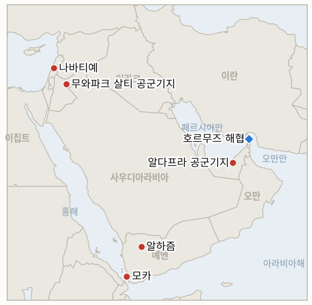

# 중동 일일 브리핑

**2026년 9월 11일**

- **보고 기간:** 약 24시간, 9월 10일 09:00 ~ 9월 11일 09:00 (한국시간)
- **종합 평가:** 예멘 전쟁이 두 해안에서 정반대 양상으로 갈라졌다. 후티 반군은 바브엘만데브로 향하는 발판인 홍해 항구 모카를 점령했는데, 사우디가 지원하는 정부군이 불과 9월 8일까지도 후티의 공세를 막아낸 곳이었다. 같은 시각 그 정부군은 북부에서는 계속 전진해 알야타마를 탈환하고 알라바나트 산악지대를 압박했으며, 파키스탄은 후티의 사우디 공격이 계속되면 이 원장이 이미 한 차례 무산되는 것을 지켜본 상호방위조약인 메카 공동방위협정이 발동될 수 있다고 경고했다. 이스라엘은 압박 작전의 두 번째 전선을 열었다. 남부 레바논 알리 타헤르 능선에서 헤즈볼라의 지휘 거점이라 부른 터널 단지를 파괴하기 위해 1,100톤이 넘는 폭발물을 사용했으며, 그 폭발은 리히터 규모 4.1의 지진으로 기록될 만큼 컸다. 로마에서 열릴 차기 미국 중재 이스라엘-레바논 협상을 며칠 앞둔 시점이었다. 이란과 요르단의 대치는 확대되기보다 가라앉았다. 암만의 두 번째 아즈라크 피격에 대한 유일한 공개 대응은 요격 발표뿐이었고, 한 분석은 이를 워싱턴에 대한 요르단의 깊은 구조적 의존 때문이라고 설명했다. 서울에서는 UAE 점검단이 더 축소된 요구안을 갖고 돌아왔다. 100명이 넘는 승조원이 필요한 군수지원함 대신 P-8A 해상초계기와 폭발물처리반(EOD) 정도였으며, 국무총리는 국회에서 아직 아무것도 결정되지 않았다고 말했다. 시장은 전쟁의 지속성을 계속 가격에 반영했다. 확정된 수요일 유가 정산가는 5월 이후 처음으로 101달러를 넘었고, 코스피는 7,000선 고점에서 다소 밀려났으며, 트럼프 대통령은 댈러스에서 전쟁이 중간선거 "직후" 끝난다고 재차 말했다. 이 원장은 11월까지 이 발언의 이행 여부를 추적할 것이다.

---

## 1. 무슨 일이 있었나

<figure style="float:right; width:46%; margin:2pt 0 8pt 14pt;">

<figcaption style="font-size:8pt; color:#666; text-align:center; margin-top:3pt; font-style:italic;">주요 논의 지점</figcaption>
</figure>

### 1.1 후티, 홍해 항구 모카 점령, 예멘 전쟁 두 전선에서 엇갈린 결과

후티 반군이 바브엘만데브 해협으로 향하는 전략적 발판인 홍해 항구 모카를 점령했다. 사우디가 지원하는 정부군이 불과 9월 8일까지도 후티의 공세를 막아냈던 곳으로, 같은 주 정부 연합군이 알자우프주 알야타마 마을을 탈환하고 알바이다주 알라바나트 산악지대를 압박한 북부 전선과는 정반대의 흐름이다([Al Jazeera](https://www.aljazeera.com/news/2026/9/10/houthis-yemeni-forces-engaged-in-fierce-battles-why-each-front-matters); [Bloomberg](https://www.bloomberg.com/news/articles/2026-09-10/houthi-saudi-fighting-escalates-as-rebels-push-toward-key-strait)). 후티의 미사일·드론 공격은 수요일과 목요일 하미스무샤이트, 아브하, 자잔에 민방위 경보를 발령시켰으나 인명 피해는 없었으며, 후티 측은 사우디군이 12시간 동안 54차례, 이튿날 추가로 40차례 공습했다고 주장했다. 파키스탄은 후티의 사우디 영토 공격이 계속되면 사우디아라비아·튀르키예·파키스탄의 상호방위조약인 메카 공동방위협정이 발동될 수 있다고 경고한 것으로 전해졌는데, 이 협정은 9월 8일 시한에 아무런 이행 조치 없이 무산된 것으로 이 원장이 이미 추적한 바 있다([Al Jazeera](https://www.aljazeera.com/news/2026/9/10/fighting-escalates-in-yemen-houthi-attacks-trigger-alerts-in-saudi-arabia)). 또한 미군 약 100명이 사우디 작전에 정보 공유와 AI 표적 지정 프로그램을 지원하고 있다는 보도도 나왔는데, 이번 전쟁에서 이전에는 확인되지 않았던 미국의 직접적 작전 관여다([Times of Israel 라이브블로그](https://www.timesofisrael.com/liveblog-september-10-2026)). 이는 **IND-20260907-2**를 갱신한다. 하이스·알자우프 전선은 계속 유지·확대되고 있지만, 이틀 전까지 정부가 지키던 전선에서 모카가 함락된 것은 실질적 반전이며, 후티의 해안 획득이 지속될지 추적할 새 지표 **IND-20260911-1**과 메카 협정의 재점화된 발동 여부를 추적할 **IND-20260911-2**를 새로 개설한다. **신뢰도: 높음**, 모카 점령과 알야타마·알라바나트 확보(1~2등급, Al Jazeera, Bloomberg); **중간**, 메카 협정 발동 경고와 미군 자문 역할은 단일 라이브블로그 출처.

### 1.2 이스라엘, 로마 협상 앞두고 알리 타헤르 능선 헤즈볼라 터널 단지 파괴

이스라엘은 남부 레바논 알리 타헤르 능선에서 헤즈볼라 바드르 지역사단의 지휘 거점이라 부른 터널 단지를 파괴하기 위해 1,100톤이 넘는 폭발물을 사용했다고 밝혔다. 이 단지에는 이란산 로켓, 미사일, 드론, 지뢰가 보관돼 있었으며, 폭발은 미국 지질조사국(USGS) 관측망에 리히터 규모 4.1의 지진으로 기록될 만큼 컸다([Times of Israel 라이브블로그](https://www.timesofisrael.com/liveblog-september-10-2026)). 이번 타격은 미국이 중재하는 차기 이스라엘-레바논 협상이 다음 주 로마에서 열리기 며칠 전에 이뤄졌으며, 이라크·레바논·튀르키예의 헤즈볼라 연계 금융망을 겨냥한 재무부의 '이코노믹 아웃캐스트 작전' 추가 제재 조치 직후이기도 하다. 이란 혁명수비대(IRGC)는 별도로 워싱턴이 이란 핵 프로그램에 대한 "간섭"과 위협을 멈추고 이스라엘이 레바논에서 철수하면 전쟁이 끝날 수 있다고 밝혔는데, 이란이 자국의 종전을 호르무즈나 걸프 공격이 아닌 레바논 전선에 명시적으로 연계한 첫 사례다. 이는 로마 협상이 이번 타격에도 불구하고 진행될지, 아니면 그 무게에 짓눌려 멈출지를 추적할 새 지표 **IND-20260911-4**를 개설한다. **신뢰도: 높음**, 터널 타격과 그 규모(1~2등급, 이스라엘 측 발표와는 별개로 지진 관측이 교차 확인); **중간**, 로마 협상 일정과 이란이 밝힌 조건은 라이브블로그 단일 출처.

### 1.3 트럼프, 중간선거 직후 종전 재확인, 유가 확정 정산가 101달러 돌파

트럼프 대통령은 댈러스에서 열린 공화당 중간선거 행사에서 기자들에게 이란 전쟁이 "중간선거 직후 끝날 것"이라며 "그들이 더는 버틸 수 없기 때문"이라고 말했고, 테헤란이 "선거에 영향을 미치려 필사적"이라는 발언도 반복했다. 분석가들은 이 발언이 중간선거가 자신의 이란 정책 계산에 영향을 주지 않는다던 9월 2일 자신의 입장과 정면으로 배치된다고 지적했다. 이번 재확인은 갤런당 4.27달러(전년 대비 약 30% 상승)에 이른 휘발유 가격과 30%대 중반까지 낮아진 자신의 지지율을 배경으로 나왔다([Al Jazeera](https://www.aljazeera.com/news/2026/9/10/trumps-iran-war-now-has-a-midterm-election-problem); [The Hill](https://thehill.com/homenews/administration/6079754-trump-comments-iran-midterms/)). 이 원장의 보도에 하루 늦게 반영된 확정 수요일 정산가는 브렌트유가 배럴당 101.21달러, WTI가 96.05달러로 각각 3.4%, 3.25% 상승해 두 유종 모두 5월 하순 이후 최고치를 기록했으며, 중부사령부의 유조선 타격과 요르단 미사일 공격을 시장이 반영한 결과였다([CNBC](https://www.cnbc.com/2026/09/09/oil-prices-today-wti-brent-us-iran-hormuz-attacks.html); [Business Recorder](https://www.brecorder.com/news/40438774/brent-settles-at-over-usd100)). 목요일 장에서도 후티의 공격으로 사우디 에너지 시설이 일시 가동 중단되고 호르무즈 원유 흐름이 전쟁 재개 전 하루 800만~900만 배럴에서 200만 배럴 아래로 떨어졌다는 보도가 나오며 유가는 계속 올랐으나, 목요일 정산가는 매체마다 엇갈려 단일 수치로 확인되지 않았다. 이는 11월 17일 시한을 앞둔 **IND-20260910-3**을 갱신한다. **신뢰도: 높음**, 트럼프의 발언과 확정된 수요일 유가 정산가(1등급, CNBC, Business Recorder); **중간**, 호르무즈 흐름 수치와 목요일의 지속적 상승은 근거가 상대적으로 얕음.

### 1.4 한국 UAE 점검단, 축소된 파병 패키지 갖고 귀국, 결정 없음 재확인

한국의 합동 점검단이 목요일 UAE 현지 조사를 마치고 귀국했다. 조사에는 알다프라 공군기지 방문이 포함된 것으로 알려졌으며, 검토 중인 파병 패키지는 축소된 것으로 전해졌다. 승조원 100명 이상이 필요한 군수지원함은 제외됐고, P-8A 해상초계기와 폭발물처리반(EOD)만 남은 것으로 알려졌다([Korea Times](https://www.koreatimes.co.kr/southkorea/20260910/korean-team-for-strait-of-hormuz-assessment-returns-from-uae); [Japan Times](https://www.japantimes.co.jp/news/2026/09/09/asia-pacific/south-korea-hormuz-role/)). 한성숙 국무총리는 수요일 국회에서 더불어민주당 곽상운 의원의 질의에 "아직 아무것도 결정된 바 없다"고 답했으며, 정부 관계자는 국내 법적 절차와 사회적 합의 모두 고려해야 한다고 강조했다. 3월 한국갤럽 여론조사에서는 파병 반대가 55%, 찬성이 30%로 나타났다([SBS English](https://news.sbs.co.kr/english/article.do?news_id=N1008745672)). 이는 **IND-20260906-2**를 갱신한다. 절차는 현지 조사 완료와 공식 장관급 발언까지 진행됐지만 국회에 정식 동의안이 제출된 것은 아니며, 이재명 대통령의 유엔 방문과 맞물린 9월 28일 시한은 그대로다. 점검단의 국가안전보장회의(NSC) 보고가 그 이전에 공개 의제로 이어질지 추적할 새 지표 **IND-20260911-3**을 개설한다. **신뢰도: 높음**, 점검단 귀국과 총리 발언(1~2등급, Korea Times, SBS, Korea Herald); **중간**, 축소된 패키지의 구체 내용은 익명 관계자를 인용한 한국 언론 보도.

### 1.5 요르단, 두 번째 아즈라크 피격에도 구조적 대미 의존으로 요격 발표에 그쳐

수요일 이란의 미사일 20발 아즈라크 기지 공격, 이번 전쟁 들어 두 번째 피격에 대한 요르단의 유일한 공개 대응은 요르단군의 요격 발표뿐이었다. 대사 소환, 집단방위 발동, 추가 방공자산 요청 등은 공개되지 않았다. 한 분석은 요르단이 미군 시설 12곳을 두고 있고 연간 약 14억 7천만 달러의 미국 원조, 국가 예산의 최소 8%를 받고 있으며 들어오는 미사일 대부분이 미국 연계 방공체계에 요격되는 점이 암만의 독자 대응 유인을 낮춘다고 지적했다. 여기에 약화되는 국내 경제 사정도 더해진다([Ynetnews](https://www.ynetnews.com/article/r1ji9uf00me)). 아이만 사파디 외무장관은 이란이 "수개월째 요르단과 다른 역내 국가들을 공격하고 있다"고 비판했는데, 정책 전환은 아니어도 종전의 발언보다 어조가 강해진 것으로 인내심이 옅어지고 있다는 신호일 수 있다. 이는 9월 23일 시한을 앞둔 **IND-20260910-2**를 갱신한다. **신뢰도: 중간**, 단일 매체 분석이나 검증 가능한 미국·요르단 예산·기지 수치에 근거; **높음**, 요르단의 확전 조치가 없었다는 점은 검토한 모든 출처에서 일치.

---

## 2. 심층 분석: 동기와 의도

### 2.1 후티는 왜 북부에서 밀리면서도 모카 점령을 택했나?

모카와 바브엘만데브 접근로는 정부군이 수 주째 밀어붙이고 있는 내륙 하이스-자우프 회랑보다 더 큰 전략적·국제적 지렛대를 지니기 때문이다. 홍해 해상 운송을 위협하고 후티의 국제적 위상을 쌓아 올린 해상 카드를 되찾는 효과가 있다. 내륙에서의 전술적 후퇴는 사나 탈환이라는 정부군 자신의 전쟁 목표에 더 큰 타격이지 후티의 협상력에는 상대적으로 덜 중요하다는 점에서, 이는 전반적 약화의 신호라기보다 외부 세력을 가장 직접적으로 압박할 수 있는 지렛대로 힘을 의도적으로 재배치한 것으로 읽힌다.

### 2.2 로마 협상을 앞둔 이스라엘의 알리 타헤르 타격은 왜 성의보다 지렛대로 읽히나?

이런 규모의 일방적이고 사전 합의되지 않은 타격을, 그것도 협상 라운드 며칠 전에 감행했다는 것은 이스라엘이 외교 트랙의 진전 여부와 무관하게 헤즈볼라의 군사 기반을 계속 약화시키겠다는 신호이기 때문이다. 터널 파괴와 이코노믹 아웃캐스트 제재를 함께 묶어 선의가 아닌 입증된 역량을 앞세워 로마 협상장에 들어서려는 것으로, 이 원장이 계속 추적해온 명목상 휴전 속에서도 타격이 이어지는 가자 휴전에 대한 이스라엘의 접근 방식과 일치하는 패턴이다.

### 2.3 트럼프의 반복된 "중간선거 후 종전" 발언은 왜 처음 나왔을 때보다 지금 더 위험한가?

해결 없이 반복될수록 11월 3일이 휴전 없이 지나가는 순간의 신뢰 비용이 누적되기 때문이다. 동시에 이란이 "필사적"으로 미국의 국내 정치 일정을 버텨내려 한다는 주장 자체가, 테헤란의 지구전 전략이 어느 정도 효과를 보고 있다는 것을 암묵적으로 인정하는 셈이다. 막연한 "곧"이 아니라 구체적 날짜를 공개적으로 못 박을수록 나중에 발을 빼기는 더 어려워지는 거래다.

### 2.4 서울은 왜 호르무즈 패키지를 인력 소요가 가장 적은 방안으로 좁히고 있나?

승조원 100명 이상이 필요한 군수지원함을 제외하는 것은 정부가 대규모 인력 파병이 촉발할 국내 정치적 문턱을 넘지 않으면서도 워싱턴에 해상초계기와 폭발물처리반이라는 가시적 기여를 제시할 수 있게 해주기 때문이다. 여론조사에서 55%가 반대하는 상황에서, 이는 완전한 군수지원함 파병이라면 버티지 못했을 수도 있는 축소된 패키지를 여당 내 비판 세력이 수용할 여지를 남긴다.

---

## 3. 한국에 대한 정책적 함의

**노출도 스냅샷:** 한국의 원유 수입은 여전히 약 70%가 호르무즈 해협 통과에 의존하고 있으며, LNG 수입의 약 36%가 중동산으로, 카타르 라스라판이 단일 최대 LNG 공급 노출 지점이다(`instructions/korea-exposure.md`, 2026년 8월 14일 최종 갱신 참조). 이번 window에서 이 기준 수치에 실질적 변화는 없었지만, 전쟁 재개 전 하루 800만~900만 배럴이던 호르무즈 원유 흐름이 200만 배럴 아래로 떨어졌다는 보도는 한국 자체의 용선 데이터에 변화가 없더라도 위험을 더 선명하게 만들며, 예멘 홍해 연안과 레바논으로 확대되는 물리적 위험은 해협 자체를 넘어서는 전이 경로가 계속 늘고 있음을 보여준다.

**개발별 함의:**

- **모카 점령과 예멘의 두 전선 전쟁(§1.1):** 후티의 바브엘만데브 발판 확보는 한국의 홍해·수에즈 연계 항로에 호르무즈 외의 또 다른 초크포인트 위험을 더하지만, 직접적인 한국 선박 피해는 보고되지 않았다. 메카 공동방위협정의 재점화된 발동 여부(IND-20260911-2)는 튀르키예·파키스탄과 서울의 교역 관계를 고려할 때 외교부가 주목할 만하다.
- **알리 타헤르 능선 터널 타격(§1.2):** 직접적인 한국 노출은 없지만, 이 전쟁에서 군사적 압박과 외교가 별개의 트랙으로 진행되고 있다는 또 하나의 신호로, 향후 휴전 체제의 지속가능성에 대한 외교부의 기대치 조정에 참고가 된다.
- **트럼프의 중간선거 발언과 유가 확정 정산가(§1.3):** 5월 하순 이후 최고치인 101달러 돌파는 한국 정유업계와 산업통상자원부의 수입 계획에 가장 뚜렷한 비용 전이 경로다. 11월 17일이라는 구체적 시한이 달린 트럼프의 예측(IND-20260910-3)은 막연한 시간표보다 한국 계획 당국에 구체적 단기 시험대를 제공한다.
- **한국의 축소된 호르무즈 패키지(§1.4):** 오늘 원장에서 가장 뚜렷한 국내 정책 라인이다. 점검단의 귀국과 해상초계기·EOD로의 패키지 축소는 정부가 '결정된 바 없음' 메시지를 유지하면서도 정치적 비용이 가장 적은 기여 방안으로 조율하고 있음을 시사한다. IND-20260911-3의 9월 24일 시험대와 IND-20260906-2의 9월 28일 시한이 지켜볼 단기 일정이다.
- **요르단의 자제(§1.5):** 직접적인 한국 노출은 없지만, 요르단의 구조적 대미 의존과 그 한계는 서울이 호르무즈 논의에서 동맹 의무와 국내 정치적 제약을 저울질하는 데 유용한 비교 사례다.

**검증 가능한 지표:**

- **IND-20260911-1** (신규): 후티의 모카 점령이 유지되며 바브엘만데브 인접 추가 확보로 이어질지, 아니면 정부군·사우디 반격으로 뒤집힐지. 시한 ~2026-09-25.
- **IND-20260911-2** (신규): 파키스탄의 메카 공동방위협정 발동 경고가 실제 조치로 이어질지, 아니면 9월 8일 첫 시험 때처럼 다시 무산될지. 시한 ~2026-10-02.
- **IND-20260911-3** (신규): 한국 UAE 점검단의 NSC 보고가 9월 28일 시한 전에 공개 의제나 일정으로 이어질지, 아니면 검토가 비공개로 머물지. 시한 ~2026-09-24.
- **IND-20260911-4** (신규): 로마 이스라엘-레바논 협상이 알리 타헤르 타격에도 불구하고 진행될지, 아니면 그 무게에 멈출지. 시한 ~2026-09-18.
- **IND-20260910-1** (진행 중): 이란이 제3국 내 미군 주둔 기지를 재차 타격할지; 이번 window에서는 확인되지 않음. 시한 ~2026-09-24.
- **IND-20260910-2** (진행 중): 요르단이 요격 발표를 넘어선 공식 외교·군사 대응에 나설지; 여전히 수사적 대응에 그침. 시한 ~2026-09-23.
- **IND-20260910-3** (진행 중): 트럼프의 "중간선거 후 종전" 예측이 실현될지; 오늘 댈러스 발언에서 재확인됨. 시한 ~2026-11-17.
- **IND-20260907-2** (진행 중): 예멘 정부군의 확보 지역이 유지될지; 하이스·알자우프 전선 자체는 계속 확대되고 있으나 모카 상실로 전체적 판단은 복잡해짐(별도로 IND-20260911-1이 추적). 시한 ~2026-09-20.
- **IND-20260906-2** (진행 중): 한국의 호르무즈 파병이 정식 국회 동의안에 도달할지; 점검단 귀국과 한 총리 발언은 이 기준에 미치지 않으면서 절차를 진전시킴. 시한 ~2026-09-28.
- **IND-20260909-3** (진행 중): 영국의 정착촌 교역 금지가 이행 단계나 추가 동참국으로 확대될지; 이번 window에서는 확인되지 않음. 시한 ~2026-10-09.

---

## 4. 주시 목록

- **모카의 지속성(IND-20260911-1):** 이 원장이 이번 예멘 재개전을 추적한 이래 사우디가 지원하는 정부군 측의 첫 유의미한 해안 반전으로, 바브엘만데브의 이해관계를 감안할 때 면밀히 지켜볼 사안이다.
- **메카 공동방위협정의 두 번째 시험(IND-20260911-2):** 9월 8일 시한에서 이미 한 차례 무산된 바 있으며, 파키스탄의 새로운 경고가 새로운 확전 계기 아래 이 질문을 다시 열었다.
- **한국의 NSC 보고 시한(IND-20260911-3):** 9월 28일 국회 시한 자체보다 더 가까운 시험대로, 정부 방향에 대한 더 즉각적인 신호로서 지켜볼 가치가 있다.
- **로마 이스라엘-레바논 협상(IND-20260911-4):** 알리 타헤르 타격이 외교 트랙을 훼손할지, 단순히 병행될지.
- **픽액스 마운틴(IND-20260905-1):** 이번 window까지 아직 타격되지 않음; 시한 ~09-18.
- **벤그비르의 '디스인게이지먼트 710' 계획(IND-20260904-2):** 여전히 확인된 수용국 관심이나 공식 정부 조치 없음; 시한 ~09-18, 7일 남음.
- **라스라판 카타르 LNG 선적(IND-20260714-4):** 여전히 최신 주간 선적 수치 없음, 이 원장에서 가장 오래 미해결로 남은 지표.
- **이란의 주장되는 핵 재무장, 픽액스 마운틴:** 네타냐후 총리는 트럼프 대통령이 이란이 "핵무기 재무장을 시도하고 있다"고 말했다고 전했으며, IAEA가 손상된 나탄즈 인근에서 건설 활동을 보고했다고 단일 라이브블로그가 전했다. 아직 IAEA의 1차 성명으로 독립 검증되지 않았으며, 확정된 사실로 다루기 전에 추가 확인이 필요하다.

---

## 5. 출처 품질 요약

| 주장 | 출처 | 신뢰도 |
|---|---|---|
| 후티 반군, 홍해 항구 모카 점령 | Al Jazeera, Bloomberg, Times of Israel (1~2등급) | 높음 |
| 정부군, 알야타마·알라바나트 탈환, 알자우프·알바이다 디나임 압박 | Asharq Al-Awsat, Al Jazeera (1~2등급) | 높음 |
| 후티 공격으로 하미스무샤이트·아브하·자잔에 사우디 민방위 경보 발령 | Al Jazeera (1등급) | 높음 |
| 파키스탄, 메카 공동방위협정 발동 위험 경고 | Al Jazeera, 역내 보도 인용 (2등급) | 중간 |
| 미군 약 100명, 사우디 작전에 정보·AI 표적 지정 지원 | Times of Israel 라이브블로그 (2~3등급, 단일 출처) | 중간 |
| 이스라엘, 알리 타헤르 능선 헤즈볼라 터널 단지 파괴, 규모 4.1 지진 관측 | Times of Israel 라이브블로그 (2~3등급); 지진 관측으로 독립 교차 확인 | 높음(타격·규모); 중간(이스라엘 측 설명 전체) |
| 로마에서 차기 이스라엘-레바논 협상 예정 | Times of Israel 라이브블로그 (2~3등급, 단일 출처) | 중간 |
| 이란 IRGC, 레바논 철수와 연계된 종전 조건 제시 | Times of Israel 라이브블로그 (2~3등급, 단일 출처) | 중간 |
| 트럼프, 댈러스에서 "중간선거 후 종전" 발언 재확인 | Al Jazeera, The Hill, Newsweek, Time (1~2등급) | 높음 |
| 브렌트유 101.21달러, WTI 96.05달러 9월 9일 정산가 확정 | CNBC, Business Recorder (1등급) | 높음 |
| 호르무즈 원유 흐름 하루 200만 배럴 미만으로 보도 | 에너지 매체 검색 종합 (2~3등급, 1차 Kpler 수치로 미검증) | 중간 |
| 한국 UAE 점검단 귀국, 파병 패키지 축소 | Korea Times, Japan Times, Seoul Economic Daily (1~2등급) | 높음 |
| 한성숙 총리, 국회에서 "아직 아무것도 결정된 바 없다" 발언 | SBS English, Korea Herald (1~2등급) | 높음 |
| 요르단의 자제된 대응, 구조적 대미 의존에 기인 | Ynetnews 분석 (2등급, 단일 출처) | 중간 |
| 코스피 7,033.92 마감(-0.25%), 원화 1,339.2로 약세 | Asiae, Money Today, Financial News (1~2등급, 한국 경제지) | 높음 |
