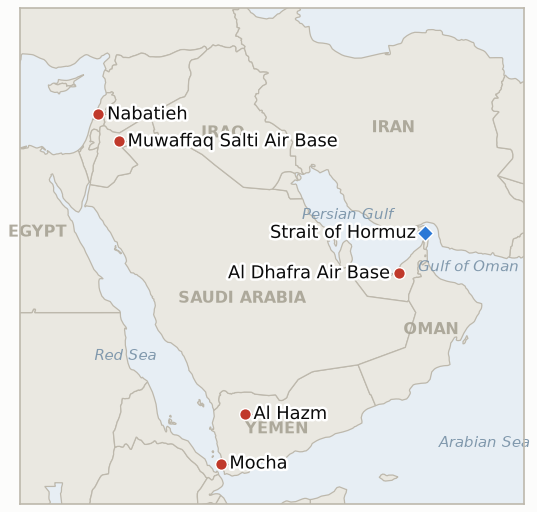

# Middle East Daily Briefing

**September 11, 2026**

- **Reporting window:** ~24 hours, September 10, 09:00 to September 11, 09:00 KST
- **Overall assessment:** Yemen's war split into a mirror image across two coasts: Houthi forces captured the Red Sea port of Mocha, a foothold toward Bab el-Mandeb that Saudi backed government troops had defended against a Houthi assault as recently as September 8, even as those same government forces kept grinding forward in the north, retaking al-Yatama and pressing the al-Labanat mountains, and Pakistan warned that continued Houthi strikes on Saudi Arabia could activate the Mecca Joint Defence Agreement, a mutual defense pact this ledger already watched lapse once. Israel opened a second front in its pressure campaign, detonating more than 1,100 tons of explosives to destroy what it called a Hezbollah tunnel command center on Ali Taher Ridge, a blast large enough to register as a magnitude 4.1 earthquake, days before the next round of Rome brokered Israel Lebanon talks. Iran and Jordan's standoff cooled rather than widened: Amman's only public response to a second Azraq strike remained an interception count, with an analysis attributing the restraint to Jordan's deep structural dependence on Washington. In Seoul, the UAE assessment team came home with a narrower ask, a P-8A patrol aircraft and explosive ordnance teams rather than the logistics ship that would require over a hundred sailors, while the prime minister told the National Assembly nothing has been decided. Markets kept pricing the war's persistence: oil's confirmed Wednesday settle broke 101 dollars for the first time since May, KOSPI eased back from its 7,000 point high, and Trump repeated in Dallas that the war ends "immediately after" the midterms, a claim this ledger will hold him to through November.

---

## 1. What Happened

<figure style="float:right; width:46%; margin:2pt 0 8pt 14pt;">

<figcaption style="font-size:8pt; color:#666; text-align:center; margin-top:3pt; font-style:italic;">Major places of discussion</figcaption>
</figure>

### 1.1 Houthis Capture Red Sea Port of Mocha as Yemen's War Splits Into Two Fronts With Opposite Outcomes

Houthi forces captured the Red Sea port of Mocha, a strategic foothold toward the Bab el-Mandeb Strait that Saudi backed government forces had defended against a Houthi assault as recently as September 8, a reversal running opposite the northern front, where government aligned forces retook the town of al-Yatama and pressed the al-Labanat mountains in al-Bayda governorate the same week ([Al Jazeera](https://www.aljazeera.com/news/2026/9/10/houthis-yemeni-forces-engaged-in-fierce-battles-why-each-front-matters); [Bloomberg](https://www.bloomberg.com/news/articles/2026-09-10/houthi-saudi-fighting-escalates-as-rebels-push-toward-key-strait)). Houthi missile and drone attacks separately triggered civil defense alerts in Khamis Mushait, Abha and Jazan on Wednesday and Thursday with no casualties reported, while the Houthis claimed Saudi forces flew 54 strikes in twelve hours and 40 more the following day; Pakistan has reportedly warned that continued Houthi strikes on Saudi territory could activate the Mecca Joint Defence Agreement, the Saudi Turkish Pakistani mutual defense pact this ledger previously tracked lapsing without an implementing step at its September 8 deadline ([Al Jazeera](https://www.aljazeera.com/news/2026/9/10/fighting-escalates-in-yemen-houthi-attacks-trigger-alerts-in-saudi-arabia)). Reports also describe roughly 100 US military personnel providing intelligence sharing and an AI targeting program to the Saudi campaign, a direct US operational role not previously documented in this war ([Times of Israel liveblog](https://www.timesofisrael.com/liveblog-september-10-2026)). This updates **IND-20260907-2**: the Hays and Al-Jawf fronts continue holding and extending, but Mocha's fall is a genuine reversal on a front the government held two days earlier, opening new **IND-20260911-1** to track whether the Houthi coastal gain proves durable, and **IND-20260911-2** to track the Mecca pact's reopened activation question. **Confidence: High** on Mocha's capture and the al-Yatama and al-Labanat gains (Tier 1-2, Al Jazeera, Bloomberg); **Medium** on the Mecca pact activation warning and the US advisers' role, both single outlet liveblog sourcing.

### 1.2 Israel Destroys Hezbollah Tunnel Complex on Ali Taher Ridge Ahead of Rome Talks

Israel said it detonated more than 1,100 tons of explosives to destroy a tunnel complex on Ali Taher Ridge in south Lebanon that it described as the nerve center of Hezbollah's Badr regional division, housing Iranian made rockets, missiles, drones and mines; the blast was large enough to register as a magnitude 4.1 seismic event on US Geological Survey monitors ([Times of Israel liveblog](https://www.timesofisrael.com/liveblog-september-10-2026)). The strike lands days before the next round of US brokered Israel Lebanon talks, scheduled for Rome next week, and follows a fresh Treasury Department sanctions round under the recurring Operation Economic Outcast campaign targeting Hezbollah linked financial networks in Iraq, Lebanon and Turkey. Iran's IRGC separately said the war could end if Washington halts what it called interference in Iran's nuclear program and threats against Iran, and if Israel withdraws from Lebanon, a first explicit Iranian linkage of its own war termination to the Lebanon front rather than Hormuz or Gulf strikes alone. This opens new **IND-20260911-4** to track whether the Rome round proceeds in parallel with continued strikes or stalls under their weight. **Confidence: High** on the tunnel strike and its scale (Tier 1-2, seismic corroboration independent of Israel's own account); **Medium** on the Rome talks timing and Iran's stated conditions, both single sourced via a live updating blog.

### 1.3 Trump Doubles Down on War Ending Right After Midterms as Oil's Confirmed Settle Breaks 101 Dollars

President Trump told reporters at a Republican midterm event in Dallas that the Iran war will end "immediately after the election because they can't hold out any longer," repeating that Tehran is "desperate to try and affect the election," rhetoric analysts noted directly contradicts his September 2 position that the midterms do not affect his Iran calculus; the reiteration comes against gasoline at 4.27 dollars a gallon, up roughly 30 percent year over year, and his own approval rating in the low to mid 30s ([Al Jazeera](https://www.aljazeera.com/news/2026/9/10/trumps-iran-war-now-has-a-midterm-election-problem); [The Hill](https://thehill.com/homenews/administration/6079754-trump-comments-iran-midterms/)). Oil's confirmed Wednesday settle, landed a day late in this ledger's reporting, closed at 101.21 dollars a barrel for Brent and 96.05 dollars for WTI, up 3.4 and 3.25 percent respectively and the highest close for both benchmarks since late May, as the market absorbed CENTCOM's tanker strikes and the Jordan missile barrage ([CNBC](https://www.cnbc.com/2026/09/09/oil-prices-today-wti-brent-us-iran-hormuz-attacks.html); [Business Recorder](https://www.brecorder.com/news/40438774/brent-settles-at-over-usd100)); crude continued climbing into Thursday's session as Houthi strikes forced temporary shutdowns at Saudi energy facilities and Hormuz crude flows were reported below 2 million barrels a day, down from 8 to 9 million before fighting resumed, though no single confirmed Thursday settle could be corroborated across outlets. This updates **IND-20260910-3**, still open against its November 17 deadline. **Confidence: High** on Trump's quotes and the confirmed Wednesday oil settle (Tier 1, CNBC, Business Recorder); **Medium** on the Hormuz flow figure and Thursday's continued climb, both drawn from thinner sourcing without a clean settle.

### 1.4 South Korea's UAE Assessment Team Returns With a Narrower Deployment Package as No Decision Is Reaffirmed

South Korea's joint assessment team returned from the United Arab Emirates on Thursday after an on site survey believed to include Al Dhafra Air Base, and the deployment package under review has reportedly narrowed: a logistics support ship requiring more than 100 sailors has been ruled out, leaving a P-8A patrol aircraft and explosive ordnance disposal teams as the remaining options ([Korea Times](https://www.koreatimes.co.kr/southkorea/20260910/korean-team-for-strait-of-hormuz-assessment-returns-from-uae); [Japan Times](https://www.japantimes.co.jp/news/2026/09/09/asia-pacific/south-korea-hormuz-role/)). Prime Minister Han Seong-sook told the National Assembly on Wednesday, responding to Democratic Party lawmaker Kwak Sang-un's questioning, that "nothing has been decided yet," and a government official stressed both domestic legal procedure and social consensus must be weighed before any decision; a March Gallup Korea poll found 55 percent of the public opposed to deployment against 30 percent in favor ([SBS English](https://news.sbs.co.kr/english/article.do?news_id=N1008745672)). This updates **IND-20260906-2**: the process has now produced a completed fact finding mission and an on record ministerial statement, but no formal motion has reached the National Assembly, with the ~September 28 deadline tied to President Lee's UN trip unchanged; new **IND-20260911-3** opens to track whether the team's NSC report converts into a public agenda item before that date. **Confidence: High** on the team's return and the PM's statement (Tier 1-2, Korea Times, SBS, Korea Herald); **Medium** on the specific narrowed package details, sourced to Korean press citing unnamed officials.

### 1.5 Jordan's Structural Dependence Keeps Its Response to a Second Azraq Strike Confined to Interception Counts

Jordan's only public response to Wednesday's 20 missile Iranian barrage on its Azraq air base, the second such strike this war, has remained the Jordanian Armed Forces' interception count, with no ambassador recall, collective defense invocation, or additional air defense request disclosed; an analysis noted Jordan hosts twelve US military facilities and receives roughly 1.47 billion dollars a year in US assistance, at least 8 percent of its state budget, while most incoming missiles are intercepted by US linked air defense systems, all of which lower Amman's incentive to respond independently against a weakening domestic economy ([Ynetnews](https://www.ynetnews.com/article/r1ji9uf00me)). Foreign Minister Ayman Safadi did condemn Iran for "attacking Jordan and other regional states for months," a rhetorical hardening from prior statements that may signal fraying patience even without a policy shift. This updates **IND-20260910-2**, still open against its ~September 23 deadline. **Confidence: Medium**, single outlet analysis though grounded in verifiable US Jordan budget and basing figures; **High** on the absence of any disclosed Jordanian escalatory step, consistent across all sources reviewed.

---

## 2. Deep Dive: Incentives and Motives

### 2.1 Why did the Houthis choose to seize Mocha while losing ground in the north?

Because Mocha and the Bab el-Mandeb approach carry more strategic and international leverage than the interior Hays-Jawf corridor the government has spent weeks grinding through, threatening Red Sea shipping and reclaiming the maritime profile that built the Houthis' international standing; trading tactical ground in the interior, where losses matter more to the government's own war aim of retaking Sanaa than to the Houthis' negotiating position, for a coastal chokepoint gain reads as a deliberate reallocation of effort toward the lever that most directly pressures outside powers rather than a sign of general weakness.

### 2.2 Why does Israel's Ali Taher tunnel strike ahead of Rome talks read as leverage rather than a good faith gesture?

Because a unilateral, unagreed strike of this scale, timed days before a negotiating round, signals that Israel intends to keep degrading Hezbollah's military infrastructure regardless of the diplomatic track's progress, pairing the tunnel destruction with the Economic Outcast sanctions round to enter Rome from a position of demonstrated capability rather than goodwill, a pattern consistent with Israel's approach to the Gaza ceasefire, where strikes have continued inside a nominal truce throughout this ledger's run.

### 2.3 Why is Trump's repeated "war ends after midterms" claim riskier now than when the pattern first appeared?

Because each repetition without resolution compounds the credibility cost the moment November 3 passes without a ceasefire, while the claim's underlying logic, that Iran is "desperate" enough to be waiting out the US electoral calendar, implicitly concedes that Tehran's strategy of outlasting Washington's domestic politics has some purchase, a trade that becomes harder to walk back the more publicly and specifically Trump commits to a named date rather than an open ended "soon."

### 2.4 Why is Seoul letting its Hormuz package narrow toward the least manpower intensive option?

Because ruling out the logistics ship's requirement for over 100 sailors lets the government offer Washington a visible contribution, a patrol aircraft and explosive ordnance teams, without crossing the domestic political threshold a large personnel deployment would trigger against 55 percent public opposition, preserving room for the ruling coalition's internal critics to accept a scaled down package that a full destroyer support deployment might not survive intact.

---

## 3. Policy Implications for South Korea

**Exposure snapshot:** South Korea's crude imports remain roughly 70% dependent on Strait of Hormuz transit and about 36% of its LNG imports come from the Middle East, with Qatar's Ras Laffan as the single largest LNG supplier exposure (see `instructions/korea-exposure.md`, last updated August 14, 2026). No material update to these baselines surfaced in the window, but reported Hormuz crude flows below 2 million barrels a day, against 8 to 9 million before fighting resumed, sharpen the picture even where Korea's own charterer level data stays unchanged, and the widening of kinetic risk into Yemen's Red Sea coast and Lebanon underscores that transmission channels beyond the strait itself keep multiplying.

**Implications by development:**

- **Mocha's capture and Yemen's two front war (§1.1):** A Houthi foothold toward Bab el-Mandeb adds a second chokepoint risk alongside Hormuz for Korea's Red Sea and Suez linked trade routes, though no direct Korean shipping incident has been reported; the Mecca Joint Defence Agreement's reopened activation question (IND-20260911-2) is worth MOFA's attention given Turkey's and Pakistan's own trade relationships with Seoul.
- **The Ali Taher Ridge tunnel strike (§1.2):** No direct Korean exposure, but a further sign that military pressure and diplomacy are running on separate tracks in this war, relevant context for MOFA in calibrating expectations about how durable any future ceasefire architecture proves.
- **Trump's midterm framing and oil's confirmed settle (§1.3):** Brent's confirmed break above 101 dollars, the highest since late May, is the clearest near term cost transmission channel for Korean refiners and MOTIE's import planning; Trump's specific November 17 dated prediction (IND-20260910-3) gives Korean planners a concrete near term test rather than an open ended timeline.
- **Korea's narrowed Hormuz package (§1.4):** The clearest domestic policy line in today's ledger: the assessment team's return and the package's narrowing toward a patrol aircraft and EOD teams suggests the government is calibrating toward the least politically costly contribution consistent with continued no-decision messaging; IND-20260911-3's ~September 24 test and IND-20260906-2's ~September 28 deadline are the near term dates to watch.
- **Jordan's restraint (§1.5):** No direct Korean exposure, but Jordan's structural dependence on US backing, and its limits, is a useful comparator as Seoul weighs its own alliance obligations against domestic political constraints in the Hormuz debate.

**Testable indicators:**

- **IND-20260911-1** (new): Whether the Houthis' capture of Mocha holds and extends toward further Bab el-Mandeb-adjacent gains, or is reversed by a government/Saudi counteroffensive. Deadline ~2026-09-25.
- **IND-20260911-2** (new): Whether Pakistan's warning of Mecca Joint Defence Agreement activation produces a formal step, or the pact lapses again as it did at its first Sept 8 test. Deadline ~2026-10-02.
- **IND-20260911-3** (new): Whether Korea's UAE assessment team's NSC report produces a public agenda item or timetable ahead of the Sept 28 deadline, or the review stays internal. Deadline ~2026-09-24.
- **IND-20260911-4** (new): Whether the Rome round of Israel Lebanon talks proceeds in parallel with the Ali Taher strike, or stalls under its weight. Deadline ~2026-09-18.
- **IND-20260910-1** (open): Whether Iran repeats a strike on a third country US hosting base; none found this window. Deadline ~2026-09-24.
- **IND-20260910-2** (open): Whether Jordan takes a formal diplomatic or military response beyond interception counts; still rhetorical only. Deadline ~2026-09-23.
- **IND-20260910-3** (open): Whether Trump's "war ends after midterms" prediction is borne out; reiterated today in Dallas remarks. Deadline ~2026-11-17.
- **IND-20260907-2** (open): Whether Yemen's government gains hold; the Hays/Al-Jawf front itself keeps extending, though Mocha's loss complicates the broader picture (tracked separately by IND-20260911-1). Deadline ~2026-09-20.
- **IND-20260906-2** (open): Whether Korea's Hormuz deployment reaches a formal National Assembly motion; the team's return and PM Han's statement advance the process without meeting this bar. Deadline ~2026-09-28.
- **IND-20260909-3** (open): Whether the UK settlement ban advances toward implementation or further accessions; none found this window. Deadline ~2026-10-09.

---

## 4. Watch List

- **Mocha's durability (IND-20260911-1):** the war's first significant coastal reversal for the Saudi backed government since this ledger began tracking the renewed fighting; worth close attention given the Bab el-Mandeb stakes.
- **The Mecca Joint Defence Agreement's second test (IND-20260911-2):** falsified once already at its Sept 8 deadline; Pakistan's fresh warning reopens the question under a new escalation trigger.
- **Korea's NSC readout window (IND-20260911-3):** a nearer term test than the Sept 28 Assembly deadline itself, worth tracking as the more immediate signal of the government's direction.
- **The Rome Israel Lebanon talks (IND-20260911-4):** whether the Ali Taher strike undermines or merely accompanies the diplomatic track.
- **Pickaxe Mountain (IND-20260905-1):** still not struck as of this window; deadline ~09-18.
- **Ben Gvir's Disengagement 710 plan (IND-20260904-2):** still no confirmed host country interest or formal government action; deadline ~09-18, seven days out.
- **Qatari LNG loadings at Ras Laffan (IND-20260714-4):** still no fresh weekly loading figure; the ledger's longest running unresolved indicator.
- **Iran's claimed nuclear rearmament at Pickaxe Mountain:** Netanyahu said Trump described Iran as "attempting to rearm with nuclear weapons," with IAEA-reported construction activity near the damaged Natanz site, per a single liveblog source; not yet independently corroborated against a primary IAEA statement, worth verifying before treating as confirmed.

---

## 5. Source Quality Summary

| Claim | Sources | Confidence |
|---|---|---|
| Houthi forces capture the Red Sea port of Mocha | Al Jazeera, Bloomberg, Times of Israel (Tier 1-2) | High |
| Government forces retake al-Yatama and al-Labanat, press Dhi Na'im in Al-Jawf/Al-Bayda | Asharq Al-Awsat, Al Jazeera (Tier 1-2) | High |
| Houthi strikes trigger Saudi civil defense alerts in Khamis Mushait, Abha, Jazan | Al Jazeera (Tier 1) | High |
| Pakistan warns of Mecca Joint Defence Agreement activation risk | Al Jazeera, citing regional reporting (Tier 2) | Medium |
| ~100 US military personnel supporting Saudi campaign with intelligence and AI targeting | Times of Israel liveblog (Tier 2-3, single source) | Medium |
| Israel destroys Hezbollah tunnel complex on Ali Taher Ridge, magnitude 4.1 seismic event | Times of Israel liveblog (Tier 2-3); seismic reading independently corroborating | High on the strike and scale; Medium on IDF's full characterization |
| Rome round of Israel Lebanon talks scheduled next week | Times of Israel liveblog (Tier 2-3, single source) | Medium |
| Iran's IRGC states conditions for ending the war tied to Lebanon withdrawal | Times of Israel liveblog (Tier 2-3, single source) | Medium |
| Trump repeats "war ends after midterms" claim in Dallas | Al Jazeera, The Hill, Newsweek, Time (Tier 1-2) | High |
| Brent settles at 101.21 dollars, WTI at 96.05 dollars for Sept 9 session | CNBC, Business Recorder (Tier 1) | High |
| Hormuz crude flows reported below 2 million bpd | Search aggregation of energy press (Tier 2-3, unverified against a primary Kpler print) | Medium |
| Korea's UAE assessment team returns; deployment package narrows | Korea Times, Japan Times, Seoul Economic Daily (Tier 1-2) | High |
| PM Han tells National Assembly "nothing has been decided yet" | SBS English, Korea Herald (Tier 1-2) | High |
| Jordan's restrained response attributed to structural US dependence | Ynetnews analysis (Tier 2, single source) | Medium |
| KOSPI closes 7033.92 (-0.25%); won weakens to 1339.2 | Asiae, Money Today, Financial News (Tier 1-2, Korean financial press) | High |

