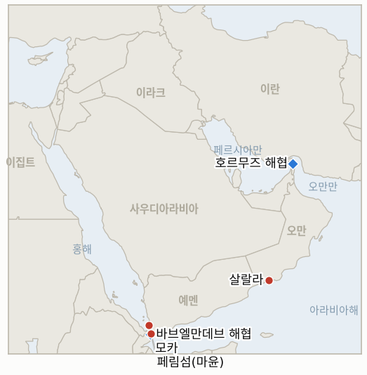

# 중동 일일 브리핑

**2026년 9월 12일**

- **보고 기간:** 약 24시간, 9월 11일 09:00 ~ 9월 12일 09:00 (한국시간)
- **종합 평가:** 예멘 전쟁이 새로운 전환점을 맞았다. 후티 반군이 바브엘만데브 해협을 가로지르는 마윤(페림)섬을 점령하며 예멘 홍해 연안 전체 장악을 완료했다. 모카 항구 점령 하루 만이며, 정부 연합군은 이 섬에서 철수한 것으로 전해졌고 사우디아라비아는 모카 공항을 타격하는 상징적 수준의 대응에 그쳤다. 같은 날 트럼프 대통령과 헤그세스 국방장관은 펜타곤의 9·11 25주년 기념식을 이란 전쟁을 테러와의 전쟁 서사에 편입시키는 자리로 활용했다. 헤그세스는 "우리는 해협을 장악하고 있다"고 선언했는데, 불과 며칠 전 이란이 이번 전쟁 최대 규모의 해상 공격을 감행하고 바레인·쿠웨이트 인근 유조선 승조원들에게 대피를 경고한 직후여서, 이 원장은 이 발언을 액면 그대로 받아들이지 않고 검증 대상으로 남긴다. 유가는 금요일 이번 주 흐름을 탈확전 신호로 받아들였다. 이란 외무부가 오만 중재로 걸프 국가들과 호르무즈 해협 관리 회담에 나서기로 하면서 브렌트유와 WTI 모두 하락했지만, 두 유종 모두 이번 전쟁 최대 주간 상승분을 마감한 뒤였다. 서울은 두 갈래 외교를 계속 병행했다. 외교부 장관이 테헤란과 직접 통화하는 한편 국방부 차관은 국회에서 파병 여부가 여전히 검토 중이라고 밝혔으며, 이 원장은 같은 날 오래 추적해온 지표 두 건을 부정으로 종결했다. 시리아의 아사드 시대 핵 파일은 검증된 실제 반출 없이 외교적으로만 종결됐고, 서부 요르단강 정착민 폭력은 홍보된 IDF에서 경찰로의 집행권 이관에도 사상 최고 속도를 유지했다.

---

## 1. 무슨 일이 있었나

<figure style="float:right; width:46%; margin:2pt 0 8pt 14pt;">

<figcaption style="font-size:8pt; color:#666; text-align:center; margin-top:3pt; font-style:italic;">주요 논의 지점</figcaption>
</figure>

### 1.1 후티, 페림섬 함락으로 예멘 홍해 연안 전체 장악 완료

모카 항구 점령 하루 만에 후티 반군은 바브엘만데브 해협을 가르는 화산섬 마윤(페림)을 점령했다. 정부 연합군은 이 진지에서 철수한 것으로 전해졌고, 후티군은 별도로 해안 마을 두바브로도 진격해 사실상 예멘 홍해 연안 전체를 장악하게 됐다([CNN](https://www.cnn.com/2026/09/10/middleeast/houthis-capture-mocha-red-sea-strait-intl); [NPR](https://www.npr.org/2026/09/11/g-s1-142822/houthis-red-sea-port); [Time](https://time.com/article/2026/09/11/yemen-houthi-red-sea-bab-el-mandeb-shipping-iran-war/)). 사우디아라비아는 모카 공항에 공습으로 대응했으나 피해나 인명 손실 보고는 없었다. 지금까지는 확전보다는 비례적 대응에 가깝다([Washington Times](https://www.washingtontimes.com/news/2026/sep/11/saudi-strikes-hit-yemens-rebel-held-mokha-airport-houthis-take-island/)). 분석가들은 2026년 2분기 기준 이 해협을 하루 약 810만 배럴의 원유가 통과했다고 지적하는데(미국 에너지정보청, CNN 인용), 이는 페림 함락이 상징을 넘어선 구조적 획득임을 의미한다. 후티가 이번 전쟁 들어 처음으로 해협의 가장 좁은 통로 양안을 모두 장악한 것이다. 이는 **IND-20260911-1**을 갱신해 이번 확보가 지속될 가능성 쪽으로 무게를 옮기며, 이 영토 변화가 실제 해상 운항에 미치는 영향을 추적할 새 지표 **IND-20260912-1**을 개설한다. **신뢰도: 높음**, 페림 점령과 홍해 연안 전체 장악(1~2등급, CNN, NPR, Time, CNBC 등 다수 교차 확인); **중간**, 정부군 철수의 범위와 지속성은 양측 관계자 언급에는 있으나 현장에서 독립적으로 검증되지는 않음.

### 1.2 트럼프·헤그세스, 이란 전쟁을 9·11에 결부, 미국의 호르무즈 장악 주장

펜타곤에서 열린 9·11 테러 25주년 기념식에서 트럼프 대통령은 이란을 "세계 제1의 테러 후원국"이라 부르며 "결코 핵무기를 갖지 못할 것"이라고 말했고, 헤그세스 국방장관은 미국이 전쟁 7개월 동안 "이란 군 지휘관들을 사살하고 공군력을 파괴"했으며 방공망을 무력화했다고 밝히면서 "우리는 해협을 장악하고 있다", 미국은 "여전히 테러리스트를 지옥으로, 유조선을 바다 밑으로 보내고 있다"고 선언했다([Bloomberg](https://www.bloomberg.com/news/articles/2026-09-11/trump-marks-9-11-anniversary-at-pentagon-with-iran-war-defense); [The Hill](https://thehill.com/policy/defense/6084687-trump-hegseth-iran-war-september-11/); [Sunday Guardian Live](https://sundayguardianlive.com/world/us-israel-iran-war-latest-live-news-hegseth-vows-to-finish-this-fight-with-iran-in-911-remarks-says-us-controls-strait-of-hormuz-will-block-nuclear-weapon-282579/)). 트럼프는 별도로 전쟁이 자신의 임기 중 남은 기간 지속될 "가능성이 없다"고 말한 것으로 전해져, 중간선거 직후 종전이라는 기존 발언을 되풀이했다. 트럼프는 관례를 깨고 뉴욕 그라운드제로 추모식 대신 펜타곤 행사를 택했으며, 뉴욕 행사에는 밴스 부통령이 생존한 전직 대통령들과 함께 대신 참석했다([Stripes](https://www.stripes.com/theaters/us/2026-09-11/9-11-commemoration-new-york-pentagon-22821057.html)). '장악' 발언은 이번 주 자체 기록과 어색하게 겹친다. 이란은 수요일 이번 전쟁 최대 규모의 해상 공격을 선언했는데 선박 10척, 그중 미 해군 구축함 2척 공격 주장은 중부사령부가 "완전히 거짓"이라고 반박했으며, 혁명수비대는 바레인·쿠웨이트 인근 유조선 승조원들에게 즉시 대피를 경고했다. 이는 헤그세스의 주장을 향후 몇 주간 검증할 새 지표 **IND-20260912-3**을 개설하고, 트럼프의 종전 예측을 추적하는 **IND-20260910-3**을 갱신한다. **신뢰도: 높음**, 발언과 행사 배경(1등급, Bloomberg, The Hill, Stripes); **중간**, '장악' 발언과 같은 주 벌어진 해상 공격이 어떻게 양립하는지는 이 원장이 오늘 결론짓지 않고 계속 검증할 사안.

### 1.3 유가, 이란의 오만 회담 수용으로 이번 전쟁 최대 주간 상승 뒤 하락 반전

브렌트유는 금요일 배럴당 104.61달러로 마감해 전일 대비 2.8% 하락했고, WTI는 100.05달러로 2.4% 하락했다. 이란 외무부가 걸프협력회의(GCC) 회원국, 이라크와 다른 연안 걸프 국가들과 월요일 오만 살랄라에서 호르무즈 해협 관리 방안을 논의하기로 했다고 밝힌 데 따른 것으로, 시장은 이를 탈확전 신호로 읽었으나 회담 개최 자체는 아직 확정되지 않았다([CNBC](https://www.cnbc.com/2026/09/11/oil-price-today-iran-brent-wti-trump.html); [Bloomberg](https://www.bloomberg.com/news/articles/2026-09-11/gulf-states-may-meet-iran-next-week-to-discuss-future-of-hormuz); [Rigzone](https://www.rigzone.com/news/wire/gulf_states_mull_hormuz_talks_with_iran-11-sep-2026-184591-article/)). 금요일 하락에도 불구하고 두 유종 모두 주간 기준으로는 이번 전쟁 최대 상승분을 기록했다. 브렌트유는 주간 8.7%, WTI는 9.4% 상승했는데, 이는 한 주 내내 중부사령부의 유조선 타격과 요르단 미사일 공격, 확대되는 예멘 홍해 전쟁을 시장이 반영한 결과다. 이는 살랄라 회담이 실제로 열려 합의된 틀을 도출할지, 아니면 연기되거나 무산될지를 추적할 새 지표 **IND-20260912-2**를 개설한다. **신뢰도: 높음**, 확정된 정산가와 주간 실적(1등급, CNBC); **중간**, 살랄라 회담의 확정 여부와 범위는 여러 매체가 유동적이라고 지적.

### 1.4 조현 장관, 테헤란과 통화, 국방부 차관은 국회에서 '결정 없음' 재확인

조현 외교부 장관은 아라그치 이란 외무장관의 요청으로 전쟁 발발 이후 여섯 번째 통화를 가졌다. 조 장관은 역내 정세에 우려를 표하고 호르무즈 항행의 자유 보호를 위한 국제적 노력에 한국이 계속 참여하겠다는 뜻을 강조했다([Korea Times](https://www.koreatimes.co.kr/foreignaffairs/20260911/fm-cho-tells-iran-no-decision-made-on-possible-hormuz-deployment-during-ministerial-talks); [Al-Monitor](https://www.al-monitor.com/originals/2026/09/south-korean-iranian-foreign-ministers-discuss-strait-hormuz-seoul-says); [SBS English](https://news.sbs.co.kr/english/article.do?news_id=N1008748906)). 같은 날 이두희 국방부 차관은 국회 대정부질문에서 "아직 아무것도 결정된 바 없다"며 정부가 국민의 안전과 국가 경제적 이익을 종합적으로 고려해 검토 중이라고 밝혀, 앞서 한성숙 국무총리의 발언과 같은 기조를 반복했다. 별도로 9월 17일에라도 호르무즈 파병 요청을 다룰 국가안전보장회의(NSC)가 열릴 수 있다는 보도도 나왔다. 이는 **IND-20260906-2**와 **IND-20260911-3**을 갱신한다. 테헤란과의 직접 채널, 가능한 NSC 일정 등 절차는 계속 진전되고 있으나 두 지표가 요구하는 공개 의제나 정식 국회 동의안에는 아직 이르지 못했다. **신뢰도: 높음**, 조현-아라그치 통화와 차관의 국회 발언(1~2등급, Korea Times, Al-Monitor, SBS); **중간**, 구체적인 9월 17일 NSC 일정은 익명 관계자를 인용한 한국 언론 보도.

### 1.5 시리아 핵 파일 종결과 서부 요르단강 폭력, 두 지표 모두 부정 판정

IAEA 이사회는 9월 9일 만장일치로 시리아의 아사드 시대 핵 안전조치 문제가 해결됐다고 선언하는 결의를 채택해, 은닉 원자로와 신고되지 않은 천연우라늄 약 73톤 발견으로 시작된 파일을 종결했다. 다마스쿠스는 이를 "수년간 열려 있던 장(章)을 닫는 것"이라고 평가했다([NewsCord](https://newscord.org/article/iaea-board-closes-syria-nuclear-file-removes-defiance-of-obligation-from-agenda--Story_20260909_Aftertwodecadeshowdi3029e172); [SANA](https://sana.sy/en/politics/2341588/)). 그러나 이 우라늄은 "이제 IAEA의 관리 아래" 있다고만 표현될 뿐 실제 물리적으로 반출됐다는 확인은 없으며, 한 미국 관리는 8월 반출 작업이 "연내 착수해 연내 완료"되기를 바란다고 말한 바 있다. 이는 **IND-20260812-2를 부정으로 종결**한다. 이 지표는 9월 11일 시한까지 합의 체결과 검증된 물리적 반출을 모두 요구했는데, 그중 절반만 충족됐기 때문이다. 별도로 UN OCHA의 8월 말 상황 보고는 서부 요르단강 정착민 폭력이 하루 약 6건 꼴로, 사상 최고 속도이자 연말까지 2천 건을 넘어설 궤적을 유지하고 있음을 보여준다. 카츠 국방장관이 발표한 IDF에서 경찰로의 민간 집행권 이관 이후 4주가 지났지만 감소 조짐은 보고되지 않았으며, 실제 집행 책임은 국경경찰로 넘어갔지만(IDF 중부사령부 산하) 사건 빈도에는 변화가 없다([HRW](https://www.hrw.org/news/2026/08/20/west-bank-israel-backed-settler-violence-drives-displacement); [Ynetnews](https://www.ynetnews.com/article/hj8zg8sp11x)). 이는 **IND-20260815-2를 부정으로 종결**한다. **신뢰도: 높음**, 두 판정의 근거 사실 모두(1~2등급, IAEA 결의와 UN OCHA 사건 데이터); **중간**, 여전히 높은 사건 빈도를 이관 조치의 실효성 부재 탓으로 단정하는 부분은 다른 교란 요인 가능성도 있음.

---

## 2. 심층 분석: 동기와 의도

### 2.1 후티는 왜 북부 전선을 다지기보다 지금 홍해 연안 완전 장악을 택했나?

페림섬과 바브엘만데브 초크포인트가 정부군과 다투고 있는 내륙 확보보다 외부 세력에 대해 훨씬 큰 지렛대를 지니기 때문이다. 사우디아라비아가 다른 곳에서 미사일·드론 공세를 흡수하고 있는 동안 해협에서 가장 좁은 통로를 장악하는 것은 예멘 내전을 세계적인 해운 이슈로 전환시키는 효과를 낳으며, 이는 이번 분쟁 초기 국면에서 후티가 전장에서의 실제 입지에 비해 과도한 외교적 위상을 반복해서 얻어낸 바로 그 종류의 관심이다.

### 2.2 트럼프·헤그세스의 '해협 장악' 주장과 이란 자체의 사상 최대 해상 공격 주간은 왜 이렇게 어긋나 보이나?

두 발언 모두 각자가 의도하는 좁은 자기중심적 의미에서는 사실일 수 있기 때문이다. 헤그세스는 전쟁 이전 대비 약화된 이란의 군사력을 묘사하고 있고, 이란의 선박 10척 공격 주장은 영토적 장악이 아니라 괴롭힘과 비대칭적 교란을 묘사하고 있어 한쪽이 참이라고 해서 다른 쪽이 거짓이 될 필요는 없다. 이 마찰은 전쟁 중인 해협에 대한 '장악'이라는 표현이 정도의 문제이지 이분법이 아니라는 점을, 즉 이 원장이 어느 쪽 발언도 독립적 검증 없이 그대로 받아들여서는 안 된다는 점을 일깨워준다. 오늘 개설한 새 지표가 바로 이를 검증하기 위한 것이다.

### 2.3 이란의 오만 주최 호르무즈 회담 수용은 왜 진정한 전환이라기보다 전술로 읽히나?

대화에 응하는 데에는 작전상 비용이 전혀 들지 않으면서 시장에는 이득을 안겨주기 때문이다. 실제로 자국의 해상 공격 및 봉쇄 집행이 이번 전쟁 최대 주간 상승분을 이끌어낸 바로 그 시점에, 금요일 브렌트유 2.8% 하락이라는 대가를 얻었다. 교란을 실제로 주도하는 국가는 근본적인 군사적 태세를 바꾸지 않고도 "관리"에 응할 의사가 있다는 신호를 이따금 보낼 유인이 충분하며, 그 신호 자체가 가격에 대한 지렛대이기 때문이다.

### 2.4 서울이 테헤란과의 직접 통화와 파병 관련 '결정 없음' 메시지를 병행하는 것은 왜 모순이 아니라 합리적 헤지인가?

이란과 대화하는 것은 서울에 외교적으로 아무런 비용이 들지 않으면서 결국 호르무즈에 대해 어떤 결정을 내리든 유용할 선의나 정보를 얻을 수 있는 반면, 국내적으로 "아직 결정된 바 없다"는 입장을 유지하는 것은 워싱턴의 기대치와 파병에 반대하는 약 55%의 여론 모두에 맞춰 최종 패키지 규모를 조율할 여지를 남겨두기 때문이다. 두 트랙을 동시에 운영하는 것은 아직 어느 쪽 유권자의 반응을 더 관리해야 할지 결정하지 못한 정부의 표준적인 헤지 방식이다.

---

## 3. 한국에 대한 정책적 함의

**노출도 스냅샷:** 한국의 원유 수입은 여전히 약 70%가 호르무즈 해협 통과에 의존하고 있으며, LNG 수입의 약 36%가 중동산으로, 카타르 라스라판이 단일 최대 LNG 공급 노출 지점이다(`instructions/korea-exposure.md`, 2026년 8월 14일 최종 갱신 참조). 이번 window에서 이 기준 수치에 실질적 변화는 없었지만, 후티가 바브엘만데브를 완전히 장악한 것은 아직 검증된 해상 사건이 발생하기 전이라도 한국의 홍해·수에즈 연계 교역에 호르무즈와 나란한 두 번째 초크포인트 위험이 이제 완전히 굳어졌음을 의미한다.

**개발별 함의:**

- **페림섬 점령과 홍해 연안 완전 장악(§1.1):** 직접적인 한국 선박 피해는 보고되지 않았지만, 수에즈·홍해 항로를 이용하는 한국 국적선·용선 선박은 이제 이번 전쟁 최초로 양안이 모두 무장 비국가 행위자의 통제 아래 놓인 해협을 통과하게 됐다. 산업통상자원부와 한국 선사들은 IND-20260912-1의 9월 26일 시험대를 이것이 영토적 변화를 넘어 실제 운항 위험으로 이어지는지 가늠할 단기 신호로 삼아야 한다.
- **트럼프·헤그세스의 9·11 서사와 '장악' 발언(§1.2):** 직접적인 한국 정책 레버는 없지만, 이 발언의 검증 가능성(IND-20260912-3)은 한국의 호르무즈 위험 평가에 중요하다. '장악' 주장이 이후 실제 사건으로 반박된다면 계속되는 모호함보다 한국 계획 당국에 더 뚜렷한 신호가 될 것이다.
- **살랄라 회담 신호에 따른 유가 하락 반전(§1.3):** 금요일 하락에도 두 유종 모두 100달러를 웃돌았고 주간 상승분은 이번 전쟁 최대치였다는 점에서, 월요일 회담 성사 여부와 무관하게 산업통상자원부의 수입 비용 계획은 높은 기준선을 유지해야 하는 가장 뚜렷한 단기 가격 전이 경로다.
- **서울의 두 갈래 호르무즈 외교(§1.4):** 오늘 원장에서 가장 뚜렷한 국내 정책 라인이다. 조현 장관의 테헤란 직접 채널과 차관의 국회 발언 모두 '결정 없음' 기조를 유지하고 있으며, 가능한 9월 17일 NSC 일정(IND-20260911-3)과 9월 28일 국회 시한(IND-20260906-2)이 지켜볼 구체적 날짜로 남아 있다.
- **시리아·서부 요르단강 지표 판정(§1.5):** 직접적인 한국 노출은 없지만, 두 판정 모두 다음 주간 리뷰를 앞두고 이 원장 자체의 예측 실적을 가늠하는 유용한 데이터이며, 시리아 핵 파일 종결은 한국의 광역 지역 위험 목록에 있던 이스라엘-튀르키예-시리아 간 핵물질 관련 충돌이라는 꼬리 위험을 소폭 낮춘다.

**검증 가능한 지표:**

- **IND-20260912-1** (신규): 후티의 바브엘만데브 완전 장악이 실제 공격, 통행료, 또는 검증된 보험료 급등으로 이어질지, 아니면 통항이 대체로 영향받지 않고 계속될지. 시한 ~2026-09-26.
- **IND-20260912-2** (신규): 오만 살랄라의 이란-GCC 회담이 실제로 열려 합의된 틀을 도출할지, 아니면 연기·취소되거나 무산될지. 시한 ~2026-09-19.
- **IND-20260912-3** (신규): 헤그세스의 미국 호르무즈 '장악' 주장이 이후 검증된 교란에도 유지될지, 아니면 새로운 공격이나 봉쇄 조치로 반박될지. 시한 ~2026-09-26.
- **IND-20260911-1** (진행 중): 후티의 해안 확보(이제 페림 포함)가 유지·확대될지, 아니면 사우디 지원 반격으로 뒤집힐지; 오늘의 추가 진전으로 확정 쪽에 무게가 실림. 시한 ~2026-09-25.
- **IND-20260911-4** (진행 중): 이제 9월 15~16일로 알려진 로마 이스라엘-레바논 협상이 계속되는 타격에도 병행될지. 시한 ~2026-09-18.
- **IND-20260906-2** (진행 중): 한국의 호르무즈 파병이 정식 국회 동의안에 도달할지; 오늘의 장관급 통화와 차관 발언은 이 기준에는 미치지 못하면서 절차를 진전시킴. 시한 ~2026-09-28.
- **IND-20260910-3** (진행 중): 트럼프의 "중간선거 후 종전" 예측이 실현될지; 오늘 펜타곤 행사에서 재차 확인됨. 시한 ~2026-11-17.
- **IND-20260907-2** (진행 중): 예멘 정부군의 확보 지역이 유지될지; 홍해 연안은 이제 완전히 상실됐으나 보도상 북부 전선 확보는 계속되는 것으로 전해져, 판단이 진정으로 엇갈림. 시한 ~2026-09-20.

---

## 4. 주시 목록

- **바브엘만데브 해상 시험대(IND-20260912-1):** 영토적 변화는 이제 완료됐다. 실제 검증된 사건으로 이어지는지가 한국과 세계 해운에 중요한 다음 질문이다.
- **살랄라 호르무즈 회담(IND-20260912-2):** 이란의 걸프 국가 대상 외교적 신호가 하루짜리 유가 변동을 넘어선 무언가로 이어질지 가늠할 가까운 시일의 구체적 시험대다.
- **헤그세스의 '장악' 발언(IND-20260912-3):** 미국 고위 관리의 구체적이고 검증 가능한 주장으로, 이 원장이 전쟁의 실제 전개와 대조해 검증할 것이다.
- **한국의 가능한 9월 17일 NSC 회의(IND-20260911-3):** 9월 28일 국회 시한 자체보다 더 가까운 신호다.
- **픽액스 마운틴(IND-20260905-1):** 이번 window까지 아직 타격되지 않음; 시한 ~09-18.
- **벤그비르의 '디스인게이지먼트 710' 계획(IND-20260904-2):** 여전히 확인된 수용국 관심 없음; 시한 ~09-18.
- **라스라판 카타르 LNG 선적(IND-20260714-4):** 여전히 최신 주간 선적 수치 없음, 이 원장에서 가장 오래 미해결로 남은 지표.
- **메카 공동방위협정의 두 번째 시험(IND-20260911-2):** 수요일 경고 이후 추가 이행 조치 보도 없음.

---

## 5. 출처 품질 요약

| 주장 | 출처 | 신뢰도 |
|---|---|---|
| 후티, 마윤(페림)섬 점령, 홍해 연안 전체 장악 완료 | CNN, NPR, Time, CNBC (1~2등급) | 높음 |
| 사우디, 대응으로 모카 공항 타격 | Washington Times (2등급) | 중간 |
| 정부군, 페림에서 철수한 것으로 전해짐 | CNN, Time (1~2등급, 양측 관계자) | 중간 |
| 트럼프·헤그세스, 펜타곤 9·11 기념식에서 이란 전쟁을 결부 | Bloomberg, The Hill, Stars and Stripes (1등급) | 높음 |
| 헤그세스: "우리는 해협을 장악하고 있다" | Sunday Guardian Live, MEAWW (2~3등급) | 중간 |
| 이란 IRGC, 사상 최대 해상 공격(선박 10척) 주장, 바레인·쿠웨이트 유조선 대피 경고 | Al Jazeera, RT, NBC News (1~3등급, RT는 낮은 등급) | 중간 |
| 중부사령부, 이란의 구축함 피해 주장을 "완전히 거짓"이라고 반박 | NBC News, Al Jazeera (1~2등급) | 높음 |
| 브렌트유 104.61달러(-2.8%), WTI 100.05달러(-2.4%) 9월 11일 마감; 주간 8.7%/9.4% 상승 | CNBC (1등급) | 높음 |
| 이란, GCC·이라크와 오만 주최 호르무즈 회담 수용 | Bloomberg, Rigzone, Arab News (1~2등급) | 중간 |
| 조현 장관, 아라그치와 여섯 번째 통화, 호르무즈 파병 결정 없음 | Korea Times, Al-Monitor, SBS English (1~2등급) | 높음 |
| 이두희 국방부 차관, 국회 대정부질문에서 결정 없음 재확인 | Korea Herald, Korea Times (1~2등급) | 높음 |
| 9월 17일 NSC 회의 가능성 | Seoul Economic Daily (2등급, 익명 관계자 인용) | 중간 |
| IAEA 이사회, 시리아 핵 안전조치 파일 종결(9월 9일) | NewsCord, SANA (2등급) | 높음 |
| 우라늄 물질, "IAEA 관리 아래"에 있을 뿐 물리적 반출은 미검증 | FDD, Axios (2등급) | 중간 |
| 서부 요르단강 정착민 폭력, IDF-경찰 집행권 이관에도 사상 최고 속도 유지 | UN OCHA, HRW, Ynetnews (1~2등급) | 높음 |
| 코스피 6909.91 마감(-1.76%); 원화 1345.9로 약세 | Korea Times, Seoul Economic Daily (1~2등급) | 높음 |
