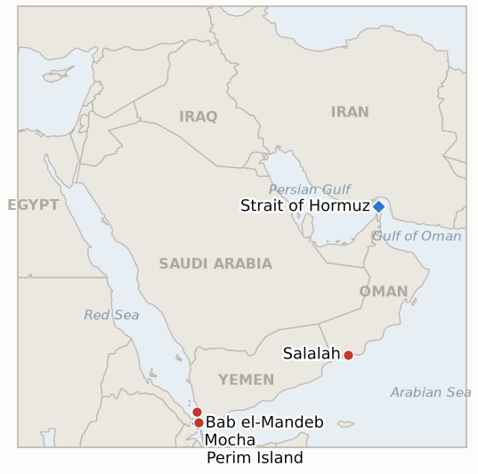

# Middle East Daily Briefing

**September 12, 2026**

- **Reporting window:** ~24 hours, September 11, 09:00 to September 12, 09:00 KST
- **Overall assessment:** Yemen's war reached a new milestone as Houthi forces completed their capture of the entire Red Sea coastline, seizing the strait dividing Perim (Mayun) Island a day after taking the port of Mocha, while government aligned forces reportedly withdrew from the island and Saudi Arabia struck Mocha's airport in a still largely symbolic response. That territorial shift landed the same day President Trump and Defense Secretary Hegseth used the Pentagon's 25th anniversary September 11 commemoration to fold the Iran war into the war on terror narrative, with Hegseth declaring "We control the Strait" of Hormuz even as Iran had days earlier claimed its heaviest wave of shipping attacks of the war and warned tanker crews near Bahrain and Kuwait to evacuate, a juxtaposition this ledger flags for testing rather than takes at face value. Oil read the week's net signal as de escalatory on Friday, Brent and WTI both easing after Iran's foreign ministry agreed to Oman brokered talks with Gulf states on managing the strait, even as both benchmarks still closed out their largest weekly gains of the war. Seoul kept working two tracks in parallel, its foreign minister speaking directly with Tehran while a vice defense minister told the National Assembly the deployment question remains under review, and the ledger closed out two long running indicators on the same day, both resolving falsified: Syria's Assad era nuclear file was declared diplomatically closed without a verified physical removal, and West Bank settler violence kept its record pace despite the touted IDF to police enforcement handover.

---

## 1. What Happened

<figure style="float:right; width:46%; margin:2pt 0 8pt 14pt;">

<figcaption style="font-size:8pt; color:#666; text-align:center; margin-top:3pt; font-style:italic;">Major places of discussion</figcaption>
</figure>

### 1.1 Houthis Complete Capture of Yemen's Red Sea Coast With Fall of Perim Island

A day after seizing the port of Mocha, Houthi forces captured Perim (also known as Mayun), the volcanic island that divides the Bab el-Mandeb Strait, as government aligned troops reportedly withdrew from the position and Houthi forces separately advanced on the coastal town of Dhubab, effectively completing Houthi control of Yemen's entire Red Sea coastline ([CNN](https://www.cnn.com/2026/09/10/middleeast/houthis-capture-mocha-red-sea-strait-intl); [NPR](https://www.npr.org/2026/09/11/g-s1-142822/houthis-red-sea-port); [Time](https://time.com/article/2026/09/11/yemen-houthi-red-sea-bab-el-mandeb-shipping-iran-war/)). Saudi Arabia responded with airstrikes on Mocha's airport, with no immediate report of damage or casualties, a proportionate rather than escalatory reaction so far ([Washington Times](https://www.washingtontimes.com/news/2026/sep/11/saudi-strikes-hit-yemens-rebel-held-mokha-airport-houthis-take-island/)). Analysts note the strait carried roughly 8.1 million barrels of oil a day in the second quarter of 2026 (US Energy Information Administration, via CNN), making Perim's fall a structural rather than merely symbolic gain: the Houthis now hold both shores of the chokepoint's narrowest crossing for the first time in this war. This updates **IND-20260911-1**, trending toward confirmation of the gain's durability, and opens new **IND-20260912-1** to track whether the territorial change converts into a verified shipping side consequence in Bab el-Mandeb. **Confidence: High** on the capture of Perim and completion of the Red Sea coastline (Tier 1-2, CNN, NPR, Time, CNBC, multiple corroborating); **Medium** on the extent and durability of the government's withdrawal, which is described by officials on both sides but not yet independently verified on the ground.

### 1.2 Trump and Hegseth Tie Iran War to the 9/11 Anniversary, Claim US Controls Hormuz

At the Pentagon's ceremony marking the 25th anniversary of the September 11 attacks, President Trump called Iran "the world's number one sponsor of terror" and pledged it "will never ever have a nuclear weapon," while Defense Secretary Hegseth said the US has "killed Iranian military leaders, destroyed the country's air force" and dismantled its defenses over the war's seven months, declaring "We control the Strait" of Hormuz and that the US is "still sending terrorists where they belong, to hell, and tankers to the bottom of the ocean" ([Bloomberg](https://www.bloomberg.com/news/articles/2026-09-11/trump-marks-9-11-anniversary-at-pentagon-with-iran-war-defense); [The Hill](https://thehill.com/policy/defense/6084687-trump-hegseth-iran-war-september-11/); [Sunday Guardian Live](https://sundayguardianlive.com/world/us-israel-iran-war-latest-live-news-hegseth-vows-to-finish-this-fight-with-iran-in-911-remarks-says-us-controls-strait-of-hormuz-will-block-nuclear-weapon-282579/)). Trump reportedly separately said there is "no chance" the war lasts the rest of his term, consistent with his repeated post midterms end date. Trump broke with tradition by marking the day at the Pentagon rather than the ground zero ceremony in New York, where Vice President Vance stood in for him alongside all living former presidents ([Stripes](https://www.stripes.com/theaters/us/2026-09-11/9-11-commemoration-new-york-pentagon-22821057.html)). The "control" claim lands awkwardly next to this week's own record: Iran declared its heaviest wave of shipping attacks of the war on Wednesday, ten vessels including a disputed claim of striking two US Navy destroyers that CENTCOM called "completely FALSE," and the IRGC warned tanker crews near Bahrain and Kuwait to evacuate immediately. This opens new **IND-20260912-3** to test Hegseth's claim against verified disruption in the weeks ahead, and updates **IND-20260910-3** on Trump's war end prediction. **Confidence: High** on the quotes and setting (Tier 1, Bloomberg, The Hill, Stripes); **Medium** on how the "control" claim squares with the same week's shipping attacks, a juxtaposition this ledger is testing rather than resolving today.

### 1.3 Oil Retreats From the War's Sharpest Weekly Rally as Iran Agrees to Oman Hosted Gulf Talks

Brent crude settled Friday at 104.61 dollars a barrel, down 2.8 percent on the day, and WTI settled at 100.05 dollars, down 2.4 percent, as Iran's foreign ministry said it would meet Gulf Cooperation Council states, Iraq and other littoral Gulf states in Salalah, Oman on Monday to discuss managing the Strait of Hormuz, a meeting markets read as a de-escalatory signal even though it is not yet confirmed to proceed ([CNBC](https://www.cnbc.com/2026/09/11/oil-price-today-iran-brent-wti-trump.html); [Bloomberg](https://www.bloomberg.com/news/articles/2026-09-11/gulf-states-may-meet-iran-next-week-to-discuss-future-of-hormuz); [Rigzone](https://www.rigzone.com/news/wire/gulf_states_mull_hormuz_talks_with_iran-11-sep-2026-184591-article/)). Despite Friday's pullback, both benchmarks closed out their largest weekly gains of the war, Brent up 8.7 percent and WTI up 9.4 percent week over week, as the market spent most of the week pricing CENTCOM's tanker strikes, the Jordan missile barrage, and Yemen's widening Red Sea war. This opens new **IND-20260912-2** to track whether the Salalah meeting actually convenes and produces an agreed framework, or is postponed or produces nothing. **Confidence: High** on the confirmed settles and weekly performance (Tier 1, CNBC); **Medium** on the Salalah meeting's confirmation and scope, which multiple outlets flagged as tentative and vulnerable to the worsening Houthi-Saudi fighting.

### 1.4 Seoul Works Two Tracks as Cho Hyun Calls Tehran and a Vice Minister Repeats No Decision Made

Foreign Minister Cho Hyun held a sixth phone call with Iranian Foreign Minister Abbas Araghchi since the war began, at Araghchi's request, in which Cho voiced concern over the regional situation and underscored Seoul's continued participation in international efforts to protect freedom of navigation through Hormuz ([Korea Times](https://www.koreatimes.co.kr/foreignaffairs/20260911/fm-cho-tells-iran-no-decision-made-on-possible-hormuz-deployment-during-ministerial-talks); [Al-Monitor](https://www.al-monitor.com/originals/2026/09/south-korean-iranian-foreign-ministers-discuss-strait-hormuz-seoul-says); [SBS English](https://news.sbs.co.kr/english/article.do?news_id=N1008748906)). The same day, Vice Minister of National Defense Lee Doo-hee told a National Assembly interpellation session that "no decision has been made yet" and that the government is weighing the safety of citizens and the nation's economic interests, echoing Prime Minister Han's message from earlier in the week; reporting separately points to a possible NSC meeting on the Hormuz troop request as early as September 17. This updates **IND-20260906-2** and **IND-20260911-3**: the process keeps advancing procedurally (a direct ministerial channel to Tehran, a possible NSC date) without yet reaching either indicator's bar of a public agenda item or formal Assembly motion. **Confidence: High** on the Cho-Araghchi call and the vice minister's Assembly statement (Tier 1-2, Korea Times, Al-Monitor, SBS); **Medium** on the specific September 17 NSC date, sourced to Korean press citing unnamed officials.

### 1.5 Ledger Resolves Two Long Tracked Indicators as Syria's Nuclear File Closes and West Bank Violence Persists

The IAEA Board of Governors unanimously adopted a resolution on September 9 declaring Syria's Assad-era nuclear safeguards issues resolved, closing the file first opened by the discovery of a clandestine reactor and roughly 73 tonnes of undeclared natural uranium; Damascus called it a chapter "that had remained open for years" ([NewsCord](https://newscord.org/article/iaea-board-closes-syria-nuclear-file-removes-defiance-of-obligation-from-agenda--Story_20260909_Aftertwodecadeshowdi3029e172); [SANA](https://sana.sy/en/politics/2341588/)). But the uranium is described only as "now under IAEA oversight," not physically removed, and a US official said in August the removal itself was hoped to begin and finish "before the end of the year" — this resolves **IND-20260812-2 falsified**, since the indicator required both a concluded agreement and verified physical removal by its September 11 deadline, and only the first half was met. Separately, UN OCHA's late-August situation reporting shows West Bank settler violence running at roughly six incidents a day, the highest pace on record and on track for over 2,000 attacks this year, with no reported decline in the four weeks since Defense Minister Katz's announced transfer of civilian enforcement from the IDF to police, even as operational responsibility has in fact shifted to Border Police under IDF Central Command ([HRW](https://www.hrw.org/news/2026/08/20/west-bank-israel-backed-settler-violence-drives-displacement); [Ynetnews](https://www.ynetnews.com/article/hj8zg8sp11x)) — this resolves **IND-20260815-2 falsified**. **Confidence: High** on both resolutions' underlying facts (Tier 1-2 sourcing on the IAEA resolution and UN OCHA's incident data); **Medium** on attributing the still-elevated incident pace specifically to the enforcement transfer's ineffectiveness versus other confounding factors.

---

## 2. Deep Dive: Incentives and Motives

### 2.1 Why did the Houthis move to complete control of the Red Sea coast now rather than consolidate the northern front first?

Because Perim Island and the Bab el-Mandeb chokepoint carry disproportionate leverage over outside powers compared to the interior gains the government has been contesting; taking the strait's narrowest crossing while Saudi Arabia is absorbing missile and drone barrages elsewhere converts a Yemen-internal civil war into a global shipping story, which is precisely the kind of attention that has repeatedly bought the Houthis outsized diplomatic standing relative to their battlefield footprint in this conflict's earlier phases.

### 2.2 Why do Trump and Hegseth's "we control the strait" claim and Iran's own week of record shipping attacks sit so awkwardly together?

Because both statements can be true in the narrow, self-serving sense each side intends: Hegseth is describing degraded Iranian military capacity relative to before the war, while Iran's ten-vessel claim describes harassment and asymmetric disruption rather than territorial control, and neither claim requires the other to be false; the friction is a reminder that "control" of a strait in an active war is a matter of degree and interpretation, not a binary this ledger should accept from either side without independent verification, which is exactly what the new indicator opened today is built to test.

### 2.3 Why does Iran's agreement to Oman hosted Hormuz talks read as tactical rather than a genuine reversal?

Because agreeing to talk costs Iran nothing operationally while extracting a market benefit, Friday's 2.8 percent Brent pullback, at a moment when its own campaign of shipping attacks and blockade enforcement has driven the week's sharpest price rally of the war; a state actively conducting the disruption has every incentive to occasionally signal willingness to discuss "managing" it, since the signal itself is a lever on price without requiring any change to the underlying military posture.

### 2.4 Why is Seoul's parallel track of a direct ministerial call to Tehran and continued no-decision messaging on deployment a rational hedge rather than a contradiction?

Because talking to Iran costs Seoul nothing diplomatically and may buy goodwill or intelligence useful regardless of what Korea ultimately decides on Hormuz, while maintaining "no decision has been made" domestically preserves room to calibrate the eventual package's size against both Washington's expectations and the roughly 55 percent of the public that opposes any deployment; running both tracks simultaneously is standard hedging for a government that has not yet decided which constituency's reaction it most needs to manage.

---

## 3. Policy Implications for South Korea

**Exposure snapshot:** South Korea's crude imports remain roughly 70% dependent on Strait of Hormuz transit and about 36% of its LNG imports come from the Middle East, with Qatar's Ras Laffan as the single largest LNG supplier exposure (see `instructions/korea-exposure.md`, last updated August 14, 2026). No material update to these baselines surfaced in the window, but the Houthis' completed hold on Bab el-Mandeb adds a second, now fully consolidated chokepoint risk alongside Hormuz for Korea's Red Sea and Suez linked trade, even before any verified shipping incident has occurred there.

**Implications by development:**

- **Perim Island's capture and the completed Red Sea coastline (§1.1):** No direct Korean shipping incident reported, but Korean-flagged and Korean-chartered vessels using the Suez/Red Sea route now transit a strait with both shores under a single armed non-state actor for the first time in this war; MOTIE and Korean shippers should treat IND-20260912-1's ~September 26 test as the near-term signal for whether this becomes an operational rather than only territorial risk.
- **Trump and Hegseth's 9/11 framing and the "control" claim (§1.2):** No direct Korean policy lever, but the claim's testability (IND-20260912-3) matters for Korean risk assessment of Hormuz specifically, since a claim of "control" that is later contradicted by a verified incident would be a sharper signal for Korean planners than continued ambiguity.
- **Oil's pullback on the Salalah talks signal (§1.3):** The clearest near-term price transmission channel for Korean refiners: a settle above 100 dollars for both benchmarks even after Friday's pullback, with the week's cumulative gain the sharpest of the war, keeps MOTIE's import-cost planning on an elevated baseline regardless of whether the Monday talks proceed.
- **Seoul's two-track Hormuz diplomacy (§1.4):** The clearest domestic policy line in today's ledger: Cho Hyun's direct channel to Araghchi and the vice minister's Assembly statement both extend the no-decision posture while a possible September 17 NSC date (feeding IND-20260911-3) and the September 28 Assembly deadline (IND-20260906-2) remain the concrete dates to watch.
- **The Syria and West Bank indicator resolutions (§1.5):** No direct Korean exposure, but both resolutions are useful calibration data for this ledger's own forecasting record ahead of the next weekly review, and the Syria file's closure marginally reduces one tail risk (an Israeli-Turkish-Syrian confrontation over the nuclear material) that had been on Korea's broader regional risk list.

**Testable indicators:**

- **IND-20260912-1** (new): Whether the Houthis' completed control of Bab el-Mandeb converts into a verified attack, toll, or documented insurance premium spike on shipping, or transits continue largely unaffected. Deadline ~2026-09-26.
- **IND-20260912-2** (new): Whether the Oman-hosted Iran-GCC talks in Salalah actually convene and produce an agreed framework, or are postponed, cancelled, or produce nothing. Deadline ~2026-09-19.
- **IND-20260912-3** (new): Whether Hegseth's claim that the US "controls" the Strait of Hormuz holds against further verified disruption, or is contradicted by a fresh attack or blockade action. Deadline ~2026-09-26.
- **IND-20260911-1** (open): Whether the Houthi coastal gain (now including Perim) holds and extends, or is reversed by a Saudi-backed counteroffensive; trending toward confirmation after today's further advance. Deadline ~2026-09-25.
- **IND-20260911-4** (open): Whether the Rome round of Israel-Lebanon talks, now reportedly set for September 15-16, proceeds in parallel with continued strikes. Deadline ~2026-09-18.
- **IND-20260906-2** (open): Whether Korea's Hormuz deployment reaches a formal National Assembly motion; today's ministerial call and interpellation statement advance the process without meeting this bar. Deadline ~2026-09-28.
- **IND-20260910-3** (open): Whether Trump's "war ends after midterms" prediction is borne out; reiterated again today at the Pentagon ceremony. Deadline ~2026-11-17.
- **IND-20260907-2** (open): Whether Yemen's government gains hold; the Red Sea coast is now fully lost even as reported northern gains continue, a genuinely mixed picture. Deadline ~2026-09-20.

---

## 4. Watch List

- **Bab el-Mandeb's shipping-side test (IND-20260912-1):** the territorial change is now complete; whether it produces an actual verified incident is the next question that matters for Korean and global shipping.
- **The Salalah Hormuz talks (IND-20260912-2):** a near-term, concrete test of whether Iran's diplomatic signal to Gulf states converts into anything beyond a one-day oil price move.
- **Hegseth's "control" claim (IND-20260912-3):** a specific, falsifiable claim from a senior US official that this ledger will hold against the war's actual trajectory.
- **Korea's possible September 17 NSC meeting (IND-20260911-3):** a nearer-term signal than the September 28 Assembly deadline itself.
- **Pickaxe Mountain (IND-20260905-1):** still not struck as of this window; deadline ~09-18.
- **Ben Gvir's Disengagement 710 plan (IND-20260904-2):** still no confirmed host country interest; deadline ~09-18.
- **Qatari LNG loadings at Ras Laffan (IND-20260714-4):** still no fresh weekly loading figure; the ledger's longest running unresolved indicator.
- **The Mecca Joint Defence Agreement's second test (IND-20260911-2):** no further reporting on an implementing step since Wednesday's warning.

---

## 5. Source Quality Summary

| Claim | Sources | Confidence |
|---|---|---|
| Houthi forces capture Perim (Mayun) Island, complete Red Sea coastline control | CNN, NPR, Time, CNBC (Tier 1-2) | High |
| Saudi Arabia strikes Mocha's airport in response | Washington Times (Tier 2) | Medium |
| Government forces reportedly withdraw from Perim | CNN, Time (Tier 1-2, officials on both sides) | Medium |
| Trump and Hegseth tie Iran war to 9/11 anniversary at Pentagon ceremony | Bloomberg, The Hill, Stars and Stripes (Tier 1) | High |
| Hegseth: "We control the Strait" of Hormuz | Sunday Guardian Live, MEAWW (Tier 2-3) | Medium |
| Iran's IRGC claims heaviest wave of shipping attacks (10 vessels), warns Bahrain/Kuwait tanker crews | Al Jazeera, RT, NBC News (Tier 1-3, RT lower tier) | Medium |
| CENTCOM calls Iran's claimed destroyer damage "completely FALSE" | NBC News, Al Jazeera (Tier 1-2) | High |
| Brent settles $104.61 (-2.8%), WTI $100.05 (-2.4%) on Sept 11; weekly gains 8.7%/9.4% | CNBC (Tier 1) | High |
| Iran agrees to Oman-hosted Hormuz talks with GCC states, Iraq | Bloomberg, Rigzone, Arab News (Tier 1-2) | Medium |
| Cho Hyun holds sixth call with Araghchi; no Hormuz deployment decision made | Korea Times, Al-Monitor, SBS English (Tier 1-2) | High |
| Vice Minister Lee Doo-hee reiterates no decision at National Assembly interpellation | Korea Herald, Korea Times (Tier 1-2) | High |
| Possible NSC meeting on Hormuz troop request as early as Sept 17 | Seoul Economic Daily (Tier 2, citing unnamed officials) | Medium |
| IAEA Board of Governors closes Syria's nuclear safeguards file (Sept 9) | NewsCord, SANA (Tier 2) | High |
| Uranium material remains "under IAEA oversight," not verified physically removed | FDD, Axios (Tier 2) | Medium |
| West Bank settler violence continues at record pace despite IDF-to-police enforcement transfer | UN OCHA, HRW, Ynetnews (Tier 1-2) | High |
| KOSPI closes 6909.91 (-1.76%); won weakens to 1345.9 | Korea Times, Seoul Economic Daily (Tier 1-2) | High |
