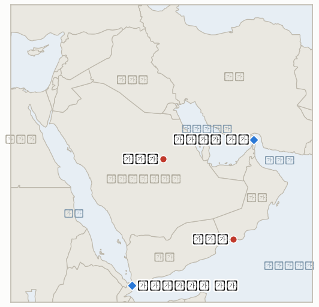

# 중동 일일 브리핑

**2026년 9월 13일**

- **보고 기간:** 약 24시간, 9월 12일 09:00 ~ 9월 13일 09:00 (한국시간)
- **종합 평가:** 금요일 후티 반군이 예멘 홍해 연안 전체 장악을 완료한 이후, 이번 주말은 확전이 아니라 소강과 정리의 국면으로 지나갔다. 트럼프 대통령은 아일랜드 방문 중 전쟁이 "매우 곧, 아마도 중간선거 직후" 끝날 것이며 이후 유가가 급격히 하락할 것이라는 기존 주장을 반복했고, 별도로 어떤 사건인지 특정하지 않은 채 이란이 사우디 송유관 공격의 배후일 "가능성이 높다"고 주장했으나, 이 주장은 이번 보고 기간의 취재로는 특정 사건과 대조 확인할 수 없었다. 이번 주말 가장 주목할 만한 소식은 군사적 사안이 아니라 외교적 사안이었다. 한 전황 추적 매체에 따르면 사우디 왕세자 무함마드 빈 살만이 지난 수요일 트럼프 대통령에게 두 차례 전화를 걸어, 후티 반군이 바브엘만데브 해협 양안을 모두 장악한 지금 미국이 후티에 대해 직접 타격해 달라고 요청했으나 트럼프가 이를 거절하고 정보 및 표적 지원을 제공하기로 했다는 것으로, 걸프 지역의 핵심 우방이 전략적 손실을 입은 상황에서도 미국이 세 번째 전선을 여는 데는 신중함을 보였다는 시사점을 준다. 후티 정치국 인사는 별도로 홍해 항행이 "안전하고 정상적"이라며 선사들을 안심시키려 했고, 이란과 걸프 국가 간 호르무즈 해협 관리 논의를 위한 월요일 오만 주최 회담은 금요일 보도와 마찬가지로 확정도 취소도 되지 않은 상태를 유지했다. 그 외에는 일어나지 않은 일이 두드러진 한 주였다. 헤그세스 국방장관의 호르무즈 통제 주장을 시험할 새로운 사건도, 요르단 아즈라크 기지에 대한 세 번째 타격도, 후티의 연안 장악 완료에 따른 해상 사건도 없었으며, 한국 정부 역시 새로운 입장을 내놓지 않아 호르무즈 파병 관련 일정은 다음 주로 그대로 이월되었다.

---

## 1. 무슨 일이 있었나

<figure style="float:right; width:46%; margin:2pt 0 8pt 14pt;">

<figcaption style="font-size:8pt; color:#666; text-align:center; margin-top:3pt; font-style:italic;">주요 논의 지점</figcaption>
</figure>

### 1.1 트럼프, 아일랜드에서 중간선거 이후 전쟁 종료 재차 주장하며 유가 하락 예측, 사우디 송유관 공격 배후로 이란 지목

트럼프 대통령은 토요일 아일랜드 방문 중 기자들에게 이란 전쟁이 "아마도 중간선거 직후" 끝날 것이라며 익숙해진 예측을 반복했고, 전쟁이 끝나면 유가가 "급격히 하락"할 것이라 내다봤다. 그는 또한 별도로 사우디 송유관에 대한 공격의 배후가 이란일 "가능성이 높다"고 말했으나 구체적으로 어느 사건을 지칭하는지는 밝히지 않았다 ([CNBC](https://www.cnbc.com/2026/09/12/trump-sees-iran-war-ending-very-soon-oil-prices-then-falling.html)). 중간선거 관련 예측은 9월 9일부터 이 지표대장이 추적해 온 **IND-20260910-3**의 재확인으로, 닷새 만에 세 번째 반복이다. 사우디 송유관 관련 주장은 이 지표대장에 새로 등장한 사안으로, 이번 보고 기간의 취재로는 사우디 송유관 인프라에 대한 구체적인 공격 사례와 대조 확인할 수 없었으며, 트럼프가 9월 8일 후티의 아람코 시설 타격을 느슨하게 지칭했을 가능성도 배제할 수 없다. 이에 따라 이 주장이 향후 구체적 사건과 함께 사우디 또는 미국 당국자에 의해 확인되는지, 아니면 검증되지 않은 채 흐지부지되는지를 추적하는 신규 **IND-20260913-1**을 개설한다. **신뢰도: 높음** (발언 자체는 CNBC의 1차 보도로 확인); 사우디 송유관 주장의 사실적 근거에 대해서는 **낮음** (특정 사건, 날짜, 확인 출처를 찾지 못함).

### 1.2 사우디 왕세자, 트럼프에게 후티 직접 타격 두 차례 요청했으나 거절당해

한 전황 추적 매체에 따르면 사우디 왕세자 무함마드 빈 살만은 9월 10일 트럼프 대통령에게 두 차례 전화를 걸어, 후티 반군이 예멘 홍해 연안을 장악한 이후 미국이 후티를 직접 타격해 달라고 요청했으나 트럼프는 이를 거절하고 대신 사우디 자체 작전을 지원할 정보 및 표적 데이터를 제공하기로 했다 ([GlobalSecurity.org](https://www.globalsecurity.org/military/ops/iran-war-oprep.htm)). 워싱턴과 리야드 간의 이른바 "책임 공방"을 다룬 CNN 보도는 이번 브리핑 작성 시점에 접근이 차단되어 직접 확인하지 못했으며, 이에 따라 이 주장은 CNN 보도를 요약한 것으로 보이는 전황 추적 매체 한 곳에만 의존한 단일 출처 정보다. 사실이라면, 미국이 이란을 상대로 자체 공중·해상 작전을 이미 수행 중인 상황에서도 핵심 걸프 우방의 직접 군사 개입 요청을 거절했다는 점에서 주목할 만한 사례다. 사우디아라비아가 미국의 직접 타격 없이 자체 후티 작전을 일방적으로 확대하는지, 아니면 현재의 정보 공유 체제가 유지되는지를 추적하는 신규 **IND-20260913-2**를 개설한다. **신뢰도: 중간**, 단일 출처이며 원출처로 추정되는 CNN 보도와 교차 확인하지 못했다.

### 1.3 후티, 홍해 항행 안전 약속하며 월요일 살랄라 호르무즈 회담은 여전히 미확정

후티 정치국 인사는 이번 주말 "홍해와 바브엘만데브 해협의 항행 자유와 국제 무역은 안전하고 정상적"이라고 말해, 금요일 예멘 홍해 연안 전체 장악 완료 이후 선사와 보험업계를 안심시키려는 모습을 보였다. 다만 이 발언은 이번 취재로는 알자지라의 1차 기사로 추적할 수 없었으며 검증 전까지는 신뢰도를 낮게 평가한다. 한편 9월 14일 월요일 오만 살랄라에서 예정된 이란·걸프협력회의 국가 간 회담은 금요일 보도된 것과 같은 상태를 유지하고 있다. 여러 매체가 이 회담이 계획되어 있으나 아직 확정되지 않았다고 전하고 있으며, 참석 확정이나 의제에 대한 보도도, 연기나 취소에 대한 보도도 없다 ([SBS](https://news.sbs.co.kr/english/article.do?news_id=N1008749523); [TASS](https://tass.com/world/2186065); [Jerusalem Post](https://www.jpost.com/middle-east/iran-news/article-908367); [Bloomberg](https://www.bloomberg.com/news/articles/2026-09-11/gulf-states-may-meet-iran-next-week-to-discuss-future-of-hormuz)). 바브엘만데브 장악 완료가 검증된 해상 사건으로 이어지는지를 보는 **IND-20260912-1**과 살랄라 회담이 실제로 성사되는지를 보는 **IND-20260912-2**는 모두 월요일을 앞두고 진행형이자 미검증 상태로 남는다. **신뢰도**: 후티의 항행 안전 발언은 **낮음** (검증되지 않은 2차 출처); 살랄라 회담의 미확정 상태는 **중간** (5개 이상 매체가 일치, 확정도 취소도 없음).

### 1.4 호르무즈, 요르단, 한국 등 주요 전선에서 주말 소강 국면 지속

헤그세스 국방장관의 9월 11일 "미국이 호르무즈 해협을 통제하고 있다"는 주장을 시험할 새로운 사건은 없었고, 요르단 무와파크 살티(아즈라크) 공군기지에 대한 이번 전쟁 세 번째 이란 타격도, 후티의 예멘 홍해 연안 장악 완료에 따른 해상 사건도 없어 **IND-20260912-3**, **IND-20260910-1**, **IND-20260912-1** 모두 확증도 반증도 되지 않은 채로 남았다. 한국 정부 역시 이번 보고 기간 중 새로운 입장을 내놓지 않았다. 조현 외교부 장관의 아라그치 이란 외무장관과의 여섯 번째 통화와 9월 17일경으로 알려진 국가안전보장회의 검토 일정이 여전히 가장 최근 기록으로, 모두 금요일 보도에 근거하며, 주말 증시 휴장으로 국회 관련 새로운 움직임이나 시장 논평도 나오지 않았다. **신뢰도: 높음**, 예멘·호르무즈·요르단·한국 관련 사안을 체계적으로 취재했으나 이번 보고 기간 동안 어느 전선에서도 새로운 사건을 확인하지 못했다.

---

## 2. 심층 분석: 유인과 동기

### 2.1 트럼프는 왜 같은 중간선거 예측을 반복하면서 검증되지 않은 이란 송유관 공격 주장을 새로 추가했을까?

중간선거 예측은 새로운 증거 없이 무한정 반복할 수 있는 비용이 낮은 수사적 닻이 된 반면, 이란의 사우디 송유관 공격이라는 구체적으로 들리는 새로운 비난을 덧붙이면 실제 사건을 특정할 때 따르는 책임 부담 없이 지속적인 경계와 책임 소재 지정을 신호할 수 있기 때문이다. 모호한 비난은 구체적인 비난보다 사실 확인이 어렵다는 점이 바로 그 목적일 수 있으며, 이는 그의 이란 전쟁 관련 지지율이 30%대 초중반에 머무는 시점에서 특히 그러하다.

### 2.2 트럼프는 왜 사우디 왕세자 본인의 직접 요청을 거절했을까, 리야드가 예멘 홍해 연안 전체를 상실한 직후에?

이란과 후티 자체의 사우디 공격이 이미 미국을 같은 지역 분쟁의 여러 편에서 지원 역할로 끌어들인 상황에서 세 번째 동시 군사 전선을 여는 것은, 국방부 내부적으로 헤그세스에게 현재의 작전 속도가 지속 불가능하다는 경고가 있었다고 알려진 바로 이 시점에 이미 부담이 큰 작전을 더욱 확대하는 위험을 안기 때문이다. 정보 및 표적 지원을 제공하는 것은 워싱턴이 리야드와의 동맹을 유지하고 지속적인 지지를 신호하면서도, 예멘 내전 자체의 네 번째 전장에 미군 조종사나 무기를 투입하지 않을 수 있게 해준다.

### 2.3 후티 관계자는 왜 외부에서 해상 교란을 가장 우려하는 바로 이 시점에 항행 안전을 공개적으로 약속했을까?

후티 입장에서는 바브엘만데브 해협의 초크포인트 가치를 신뢰할 만하지만 아직 실행하지 않은 위협으로 유지하는 것이, 국제 해군의 보복을 부르고 무혈로 얻은 영토적 성과가 가져다준 외교적 지위를 훼손할 실제 공격보다 더 큰 이득이기 때문이다. 공개적인 안전 약속은 "언제든 해상 운항을 교란할 수 있다"는 레버리지를 실제로 소진하지 않은 채 유지하는 것으로, 이는 이 지표대장이 전쟁 내내 관찰해 온 후티의 국제적 위상 관리 방식과 정확히 같은 논리다.

### 2.4 모든 주요 전선에서 조용한 주말이 실제 확전만큼이나 이 지표대장의 추적 규율에 중요한 이유는 무엇일까?

이 지표대장의 누적 검증 기록은 분쟁 지속 예측이 특정 제도적·외교적 조치 예측보다 꾸준히 더 잘 들어맞는다는 것을 보여주는데, 별도로 추적 중인 네 개 지표(호르무즈 통제, 요르단, 바브엘만데브 해상 운항, 한국의 파병 절차)가 모두 어느 방향으로도 결론 나지 않은 채 이번 주말을 지났다는 사실 자체가 의미가 있다. 이는 지난주 가장 날카로웠던 주장들, 즉 헤그세스의 "통제", 후티의 해상 레버리지, 이란이 제3국 기지를 다시 타격할 의지 등이 아직 새로운 증거로 검증되지 않았음을 확인해 주며, 이번 주 가장 중요한 미해결 질문들을 금요일 브리핑이 남긴 지점 그대로 유지시킨다.

---

## 3. 한국에 대한 정책적 함의

**익스포저 현황:** 한국의 원유 수입은 여전히 약 70%가 호르무즈 해협 통항에 의존하고 있으며, LNG 수입의 약 36%가 중동산으로 카타르 라스라판이 단일 최대 LNG 공급 노출원이다 (`instructions/korea-exposure.md`, 2026년 8월 14일 최종 업데이트 참조). 이번 보고 기간 중 이 기준치에 대한 실질적 업데이트는 없었으며, 한국과 미국 증시가 주말 내내 휴장함에 따라 금요일 종가(브렌트유 104.61달러, WTI유 100.05달러, 코스피 6,909.91, 원화 1,345.9원)가 월요일 개장의 가장 최근 기준점으로 남아 있다.

**사안별 함의:**

- **트럼프의 아일랜드 발언 (§1.1):** 한국에 직접적인 정책 수단은 없으나, 중간선거 종전 시점 반복은 한국 계획 담당자들의 전쟁 지속 기간 가정에 있어 IND-20260910-3을 여전히 대표적인 장기 지표로 남긴다. 검증되지 않은 사우디 송유관 주장은, 향후 입증될 경우 산업통상자원부의 비호르무즈 공급 다변화 계획과 관련된 새로운 사우디 인프라 위험 요인이 될 것이다.
- **빈 살만의 거절당한 타격 요청 (§1.2):** 한국과 직접적인 연결고리는 없으나, 미국의 핵심 걸프 우방조차 직접 군사 지원을 거절당했다는 점은 한국 자체의 호르무즈 파병 계산에 유용한 참고 사례다. 워싱턴이 사우디아라비아를 위해서도 자국의 직접 전투 역할 확대를 꺼린다면, 한국의 기여가 미국의 걸프 지역 위험 감수 태도를 실질적으로 바꿀 것이라는 가정은 신중히 접근해야 한다.
- **후티의 안심 발언과 미확정 살랄라 회담 (§1.3):** 한국 해운업계와 정유업계에 가장 가까운 시험대는 월요일 회담이 실제로 성사되는지 여부다. 회담이 확정된 틀로 이어진다면, 탱커 대 탱커 국면이 시작된 이후 호르무즈 관리와 관련해서는 처음으로 나오는 외교적 긴장 완화 신호가 될 것이며, 결과와 무관하게 산업통상자원부가 주목할 만하다.
- **주말 전반의 소강 상태 (§1.4):** 추적 중인 어느 전선에서도 새로운 사건이 없었던 만큼 한국의 대응 태세는 금요일 기준선에서 조정할 필요가 없다. 9월 17일경으로 알려진 국가안전보장회의 검토 일정(IND-20260911-3)과 9월 28일경 국회 시한(IND-20260906-2)이 다음 주까지 지켜볼 구체적인 날짜로 남는다.

**검증 가능한 지표:**

- **IND-20260913-1** (신규): 트럼프의 이란이 사우디 송유관 공격의 배후일 가능성이 높다는 주장이 향후 구체적 사건과 사우디 또는 미국 당국자의 확인으로 뒷받침되는지, 아니면 끝내 입증되지 않거나 조용히 철회되는지 추적. 시한 ~2026-09-27.
- **IND-20260913-2** (신규): 미국의 직접 타격을 거절당한 사우디아라비아가 후티에 대한 자체 작전을 현재 수준 이상으로 일방적으로 확대하는지, 아니면 트럼프가 제안한 정보 공유 체제만으로 작전 속도 변화 없이 충분한지 추적. 시한 ~2026-09-27.
- **IND-20260912-1** (진행): 후티의 바브엘만데브 장악 완료가 검증된 해상 사건으로 이어지는지; 이번 보고 기간 중 확인된 사건 없음. 시한 ~2026-09-26.
- **IND-20260912-2** (진행): 월요일 오만 주최 살랄라 회담이 실제로 성사되는지; 이번 보고 기간 기준 여전히 미확정, 취소되지 않음. 시한 ~2026-09-19.
- **IND-20260912-3** (진행): 헤그세스의 호르무즈 "통제" 주장이 추가 검증된 교란에도 유지되는지; 이번 보고 기간 중 검증되지 않음. 시한 ~2026-09-26.
- **IND-20260910-1** (진행): 이란이 미군 주둔 제3국 기지를 다시 타격하는지; 이번 보고 기간 중 재발 없음. 시한 ~2026-09-24.
- **IND-20260911-3** (진행): 한국의 국가안전보장회의 검토가 9월 28일경 시한 이전에 공개 의제 항목으로 이어지는지; 알려진 9월 17일경 일정에는 변화 없음. 시한 ~2026-09-24.
- **IND-20260906-2** (진행): 한국의 호르무즈 파병이 정식 국회 동의안으로 이어지는지; 이번 보고 기간 중 새로운 움직임 없음. 시한 ~2026-09-28.

---

## 4. 관찰 목록

- **월요일 살랄라 회담 (IND-20260912-2):** 일정상 가장 가까운 구체적 시험대이며, 성사·연기·무산 여부가 관건.
- **사우디 송유관 주장 (IND-20260913-1):** 이번 브리핑 작성 시점에 검증할 수 없었던 트럼프의 구체적이고 반증 가능한 비난.
- **빈 살만의 거절당한 타격 요청 (IND-20260913-2):** 미국의 직접 타격 없이 사우디아라비아 자체의 후티 작전이 강화되는지 여부.
- **한국의 9월 17일경 국가안전보장회의 개최 가능성 (IND-20260911-3):** 9월 28일 국회 시한보다 앞선 근접 신호.
- **픽액스 마운틴 (IND-20260905-1):** 이번 보고 기간까지 타격되지 않음; 시한 ~09-18.
- **벤그비르의 '디스인게이지먼트 710' 계획 (IND-20260904-2):** 여전히 확정된 수용국 관심 없음; 시한 ~09-18.
- **시리아의 헤즈볼라 관련 군사 조치 경고 (IND-20260815-3):** 시한 ~09-15, 이틀 남았으나 양방향 모두 아직 보도 없음.
- **국방 작전 지속가능성에 대한 국방부 내부 경고 (IND-20260831-2):** 시한 ~09-14, 하루 남았고 작전은 오히려 강화되는 추세.
- **라스라판 카타르 LNG 선적량 (IND-20260714-4):** 여전히 최신 주간 선적 수치 없음; 이 지표대장에서 가장 오래 미해결로 남은 지표.

---

## 5. 출처 신뢰도 요약

| 주장 | 출처 | 신뢰도 |
|---|---|---|
| 트럼프, 아일랜드에서 중간선거 이후 종전 재차 주장, 유가 하락 예측 | CNBC (1등급) | 높음 |
| 트럼프, 이란이 사우디 송유관 공격 배후일 가능성 높다고 주장, 사건 미특정 | CNBC (1등급, 발언 자체); 대조 확인 가능한 사건 없음 | 사실적 근거는 낮음 |
| 빈 살만, 트럼프에게 두 차례 전화해 후티 직접 타격 요청; 트럼프 거절, 정보 지원 제안 | GlobalSecurity.org 전황 추적 매체 (2~3등급, 단일 출처; 관련 CNN 보도 접근 불가) | 중간 |
| 후티 관계자, 홍해 항행 안전 약속 | 알자지라를 인용한 2차 종합 출처; 원기사 확인 못함 | 낮음 |
| 월요일 살랄라 이란·GCC 호르무즈 회담, 여전히 계획 상태이나 미확정, 취소되지 않음 | SBS, TASS, 예루살렘포스트, Rigzone, 블룸버그 (1~2등급, 5개 매체) | 중간 |
| 이번 보고 기간 중 헤그세스의 호르무즈 "통제" 주장, 요르단 아즈라크 기지, 바브엘만데브 해상 운항에 새로운 사건 없음 | 1~2등급 지역 및 통신사 매체 전반에 대한 체계적 검색; 부재 확인, 미검색이 아님 | 높음 |
| 이번 보고 기간 중 한국 정부의 새로운 호르무즈 파병 관련 입장 없음 | 한국 언론 전반에 대한 체계적 검색; 부재 확인 | 높음 |
