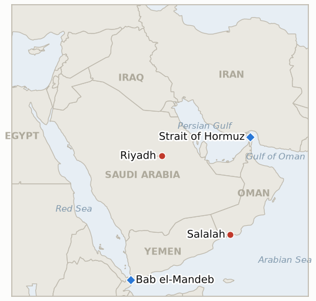

# Middle East Daily Briefing

**September 13, 2026**

- **Reporting window:** ~24 hours, September 12, 09:00 to September 13, 09:00 KST
- **Overall assessment:** After Friday's dramatic completion of the Houthis' Red Sea coastline conquest, the war spent the weekend consolidating rather than escalating. President Trump, on a trip to Ireland, repeated his prediction that the war ends "very soon, probably right after the midterms" and that oil prices will fall sharply once it does, while separately claiming, without naming an incident, that Iran was "probably" behind an attack on a Saudi pipeline, a claim this ledger cannot yet verify against any specific event. The more consequential story to emerge from the weekend was diplomatic rather than kinetic: according to a single war tracker, Saudi Crown Prince Mohammed bin Salman called Trump twice on Wednesday asking Washington to strike the Houthis directly now that they control both shores of Bab el-Mandeb, a request Trump reportedly declined in favor of intelligence and targeting support, a data point on the limits of US appetite for a third military front even as a close Gulf partner absorbs a strategic loss. A Houthi politburo figure separately moved to reassure shippers that Red Sea navigation remains "safe and orderly," while Monday's planned Oman hosted talks between Iran and Gulf states on managing the Strait of Hormuz stayed in the same unconfirmed, not cancelled, state reported Friday. Otherwise the window was notable mainly for what did not happen: no new incident tested Defense Secretary Hegseth's claim that the US controls the Strait of Hormuz, no third strike hit Jordan's Azraq base, no shipping incident followed the Houthis' completed coastal capture, and South Korea's government produced no new statement, leaving its own Hormuz deployment timeline unchanged heading into next week.

---

## 1. What Happened

<figure style="float:right; width:46%; margin:2pt 0 8pt 14pt;">

<figcaption style="font-size:8pt; color:#666; text-align:center; margin-top:3pt; font-style:italic;">Major places of discussion</figcaption>
</figure>

### 1.1 Trump Repeats War Ends After Midterms From Ireland, Predicts Oil Drop, Points to Iran in Saudi Pipeline Attack

President Trump, speaking to reporters during a Saturday visit to Ireland, said the Iran war "will end, probably right after the midterms," repeating his now familiar prediction, and forecast that oil prices will "come down sharply" once it does; he separately said he believes Iran was "probably" responsible for an attack on a Saudi pipeline, without identifying which incident he meant ([CNBC](https://www.cnbc.com/2026/09/12/trump-sees-iran-war-ending-very-soon-oil-prices-then-falling.html)). The midterms prediction restates the claim this ledger has tracked since September 9 under **IND-20260910-3**, now reiterated for a third time in five days; the Saudi pipeline claim is new to this ledger and could not be matched to any specific reported attack on Saudi pipeline infrastructure in this window's research, raising the possibility Trump was referring loosely to the Houthis' September 8 strikes on Aramco facilities rather than a discrete pipeline incident. This opens new **IND-20260913-1** to track whether the claim is ever substantiated with a named incident or corroborated by a Saudi or US official, or goes unaddressed. **Confidence: High** on the quotes themselves (Tier 1, CNBC direct reporting); **Low** on the Saudi pipeline claim's underlying factual basis, since no named incident, date, or corroborating source could be identified.

### 1.2 Saudi Arabia's MBS Twice Asks Trump to Strike the Houthis Directly, Trump Declines

According to a day-by-day tracker of the war, Saudi Crown Prince Mohammed bin Salman telephoned President Trump twice on September 10 asking Washington to strike the Houthis directly following their capture of Yemen's Red Sea coastline, a request Trump declined, offering intelligence and targeting data to support Saudi Arabia's own campaign instead ([GlobalSecurity.org](https://www.globalsecurity.org/military/ops/iran-war-oprep.htm)). A CNN report describing what it characterized as a "blame game" between Washington and Riyadh over the Houthis' gains could not be independently retrieved for this brief (access blocked), leaving the claim single sourced to a war tracker aggregator rather than to CNN's own reporting directly. If accurate, the episode is a notable data point: a close Gulf partner asking for direct US military intervention against the Houthis and being turned down, even as the US maintains an active air and naval campaign against Iran itself. This opens new **IND-20260913-2** to track whether Saudi Arabia escalates its own campaign against the Houthis unilaterally in the absence of direct US strikes, or the current intelligence sharing arrangement holds. **Confidence: Medium**, single outlet sourcing that could not be cross checked against the CNN reporting it appears to summarize.

### 1.3 Houthis Pledge Safe Red Sea Navigation as Monday's Salalah Hormuz Talks Remain Unconfirmed

A Houthi politburo member said over the weekend that "freedom of navigation and international trade in the Red Sea and Bab el-Mandeb are safe and orderly," an apparent attempt to reassure shippers and insurers after Friday's completion of Houthi control over Yemen's entire Red Sea coastline; this claim could not be traced to a primary Al Jazeera article in this window's research and is treated as lower confidence pending verification. Separately, the Oman hosted meeting between Iran and Gulf Cooperation Council states expected Monday, September 14 in Salalah remains in the same state reported Friday: multiple outlets describe it as planned but not yet locked in, with no confirmation of attendance or agenda and no report of postponement or cancellation either ([SBS](https://news.sbs.co.kr/english/article.do?news_id=N1008749523); [TASS](https://tass.com/world/2186065); [Jerusalem Post](https://www.jpost.com/middle-east/iran-news/article-908367); [Bloomberg](https://www.bloomberg.com/news/articles/2026-09-11/gulf-states-may-meet-iran-next-week-to-discuss-future-of-hormuz)). **IND-20260912-1** (whether the completed Bab el-Mandeb capture converts into a verified shipping incident) and **IND-20260912-2** (whether the Salalah talks actually convene) both stay open and untested heading into Monday. **Confidence: Low** on the Houthi navigation quote (unverified secondary sourcing); **Medium** on the Salalah talks' still pending status (5+ outlets consistent, none confirming or cancelling).

### 1.4 War Enters a Weekend Holding Pattern Across Hormuz, Jordan and Korea

No new incident tested Defense Secretary Hegseth's September 11 claim that the US "controls" the Strait of Hormuz, no repeat Iranian strike hit Jordan's Muwaffaq Salti (Azraq) air base for a third time this war, and no shipping incident followed the Houthis' completed capture of Yemen's Red Sea coastline, leaving **IND-20260912-3**, **IND-20260910-1** and **IND-20260912-1** all untested rather than confirmed or falsified. South Korea's government issued no new statement in the window: Foreign Minister Cho Hyun's sixth call with Iran's Araghchi and the reported ~September 17 National Security Council review date remain the most recent points on record, both from Friday's reporting, and no fresh National Assembly development or market commentary surfaced given the weekend market closure. **Confidence: High** on the absence of new incidents across these fronts, based on systematic research across Yemen, Hormuz, Jordan and Korea specific sourcing that turned up no dated development for this window on any of them.

---

## 2. Deep Dive: Incentives and Motives

### 2.1 Why would Trump repeat the same midterms prediction while adding a new, unverified claim about an Iranian pipeline attack?

Because the midterms prediction has become a low cost rhetorical anchor Trump can restate indefinitely without new evidence, while attaching a fresh, specific sounding accusation, an Iranian attack on a Saudi pipeline, lets him signal continued vigilance and blame allocation without the accountability that naming the actual incident would invite; a vague accusation is harder for fact checkers to test than a specific one, which may be exactly the point at a moment when his overall Iran war approval sits in the low to mid 30s.

### 2.2 Why would Trump decline a direct request from Saudi Arabia's own crown prince to strike the Houthis just after Riyadh absorbed the loss of Yemen's entire Red Sea coast?

Because opening a third simultaneous military front, after Iran and the Houthis' own attacks on Saudi Arabia have already drawn the US into supporting roles on multiple sides of the same regional conflict, risks stretching an already strained campaign further at the exact moment internal military leadership has reportedly warned Hegseth the pace is unsustainable; offering intelligence and targeting support lets Washington preserve its alliance with Riyadh and signal continued backing without committing US pilots or ordnance to a fourth theater within Yemen's own civil war.

### 2.3 Why would a Houthi official publicly pledge safe navigation at the exact moment outside observers most expect a shipping disruption?

Because the Houthis have more to gain from Bab el-Mandeb's chokepoint value while it remains a credible but unrealized threat than from an actual attack that would draw international naval retaliation and undercut the diplomatic standing a completed, bloodless territorial gain has bought them; a public safety pledge preserves the leverage of "could disrupt shipping at will" without spending it, precisely the same logic this ledger has observed the Houthis apply to their broader international profile throughout this war.

### 2.4 Why does a quiet weekend across every major front matter as much as an actual escalation for this ledger's own tracking discipline?

Because this ledger's running calibration record shows forecasts of continued conflict outperforming forecasts of specific institutional or diplomatic actions, and a weekend where four separately tracked indicators (Hormuz control, Jordan, Bab el-Mandeb shipping, Korea's deployment process) all stay untested rather than resolving in either direction is itself informative: it confirms none of last week's sharpest claims, Hegseth's "control," the Houthis' shipping leverage, Iran's willingness to hit a third country base again, has yet been tested against new evidence, keeping this week's most consequential open questions exactly where Friday's brief left them.

---

## 3. Policy Implications for South Korea

**Exposure snapshot:** South Korea's crude imports remain roughly 70% dependent on Strait of Hormuz transit and about 36% of its LNG imports come from the Middle East, with Qatar's Ras Laffan as the single largest LNG supplier exposure (see `instructions/korea-exposure.md`, last updated August 14, 2026). No material update to these baselines surfaced in the window, and with Korean and US markets closed all weekend, Friday's closing levels (Brent $104.61, WTI $100.05, KOSPI 6,909.91, won 1,345.9) remain the most current reference points for Monday's reopening.

**Implications by development:**

- **Trump's Ireland remarks (§1.1):** No new Korean policy lever, but a further reiteration of the midterms end date keeps IND-20260910-3 as the marquee long horizon indicator for Korean planners' war duration assumptions; the unverified Saudi pipeline claim, if later substantiated, would be a fresh Saudi infrastructure risk data point relevant to MOTIE's non Hormuz supply diversification planning.
- **MBS's declined strike request (§1.2):** No direct Korean channel, but a close US Gulf ally being turned down on direct military support is a useful data point for Seoul's own Hormuz deployment calculus: if Washington is unwilling to expand its own direct combat role even for Saudi Arabia, that tempers any assumption that a Korean contribution would materially shift US risk tolerance in the Gulf.
- **Houthi reassurance and the pending Salalah talks (§1.3):** The clearest near term test for Korean shipping and refiners is whether Monday's talks convene at all; a confirmed framework would be the first diplomatic de-escalation signal specific to Hormuz management since the war's tanker for tanker phase began, worth MOTIE's attention regardless of outcome.
- **The weekend's overall quiet (§1.4):** With no new incident on any tracked front, Korea's posture requires no adjustment from Friday's baseline; the ~September 17 NSC review date (IND-20260911-3) and ~September 28 National Assembly deadline (IND-20260906-2) remain the concrete near term dates to watch into next week.

**Testable indicators:**

- **IND-20260913-1** (new): Trump's claim that Iran was "probably" behind an attack on a Saudi pipeline either gets corroborated by a named incident and a Saudi or US official confirmation, or is never substantiated or is quietly dropped. Deadline ~2026-09-27.
- **IND-20260913-2** (new): Saudi Arabia, having reportedly been denied direct US strikes on the Houthis, either escalates its own unilateral campaign against them beyond current strike levels, or the intelligence sharing arrangement Trump reportedly offered proves sufficient without a visible change in Saudi operational tempo. Deadline ~2026-09-27.
- **IND-20260912-1** (open): Whether the Houthis' completed Bab el-Mandeb capture converts into a verified shipping incident; none found this window. Deadline ~2026-09-26.
- **IND-20260912-2** (open): Whether Monday's Oman hosted Salalah talks actually convene; still unconfirmed, not cancelled, as of this window. Deadline ~2026-09-19.
- **IND-20260912-3** (open): Whether Hegseth's Hormuz "control" claim holds against further verified disruption; untested this window. Deadline ~2026-09-26.
- **IND-20260910-1** (open): Whether Iran repeats a strike on a third country base hosting US forces; no repeat this window. Deadline ~2026-09-24.
- **IND-20260911-3** (open): Whether Korea's NSC review produces a public agenda item ahead of the ~September 28 deadline; the reported ~September 17 date remains unchanged, no new movement this window. Deadline ~2026-09-24.
- **IND-20260906-2** (open): Whether Korea's Hormuz deployment reaches a formal National Assembly motion; no new movement this window. Deadline ~2026-09-28.

---

## 4. Watch List

- **Monday's Salalah talks (IND-20260912-2):** the nearest concrete test on the calendar; convene, postpone, or produce nothing.
- **The Saudi pipeline claim (IND-20260913-1):** a specific, falsifiable accusation from Trump this ledger could not verify at the time of writing.
- **MBS's declined strike request (IND-20260913-2):** whether Saudi Arabia's own campaign against the Houthis intensifies without direct US strikes.
- **Korea's possible September 17 NSC meeting (IND-20260911-3):** the nearer term signal ahead of the September 28 Assembly deadline.
- **Pickaxe Mountain (IND-20260905-1):** still not struck as of this window; deadline ~09-18.
- **Ben Gvir's Disengagement 710 plan (IND-20260904-2):** still no confirmed host country interest; deadline ~09-18.
- **Syria Hezbollah military move warning (IND-20260815-3):** deadline ~09-15, two days out, still no reported move either way.
- **The internal Pentagon warning on campaign sustainability (IND-20260831-2):** deadline ~09-14, one day out, with operations if anything intensifying.
- **Qatari LNG loadings at Ras Laffan (IND-20260714-4):** still no fresh weekly loading figure; the ledger's longest running unresolved indicator.

---

## 5. Source Quality Summary

| Claim | Sources | Confidence |
|---|---|---|
| Trump repeats war ends after midterms, predicts oil price drop, from Ireland | CNBC (Tier 1) | High |
| Trump claims Iran "probably" behind a Saudi pipeline attack, no incident named | CNBC (Tier 1, on the quote); no corroborating incident identified | Low on factual basis |
| MBS calls Trump twice asking for direct US strikes on the Houthis; Trump declines, offers intelligence support | GlobalSecurity.org war tracker (Tier 2-3, single source; related CNN report inaccessible) | Medium |
| Houthi official pledges safe Red Sea navigation | Secondary synthesis citing Al Jazeera; primary article not retrieved | Low |
| Monday Salalah Iran-GCC Hormuz talks remain planned, unconfirmed, not cancelled | SBS, TASS, Jerusalem Post, Rigzone, Bloomberg (Tier 1-2, 5 outlets) | Medium |
| No new incident tested Hegseth's Hormuz "control" claim, Jordan's Azraq base, or Bab el-Mandeb shipping this window | Systematic search across Tier 1-2 regional and wire outlets; absence confirmed, not merely unsearched | High |
| South Korea's government issued no new Hormuz deployment statement this window | Systematic search of Korean press; absence confirmed | High |
