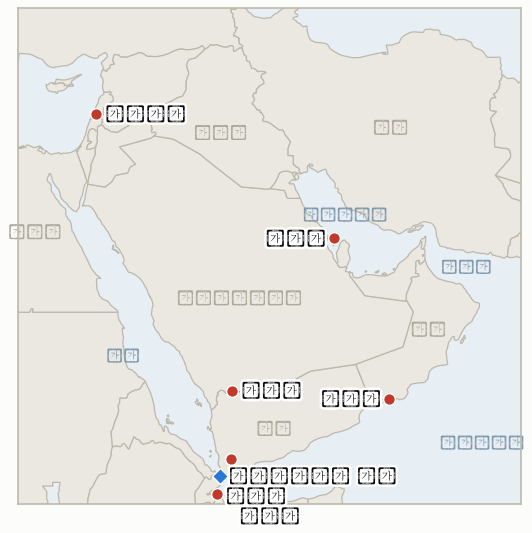

# 중동 일일 브리핑

**2026년 9월 14일**

- **보고 기간:** 약 24시간, 9월 13일 09:00 ~ 9월 14일 09:00 (한국시간)
- **종합 평가:** 월요일은 전쟁의 외교 트랙과 군사 트랙이 동시에 정반대 방향으로 움직이며 시작됐다. 달력상 유일한 구체적 긴장 완화 조치였던 월요일 오만 주최 이란·걸프 호르무즈 회담은 열리기도 전에 무산됐다. 바레인이 이란과의 외교관계 복원 없이는 이란이 포함된 어떤 집단 회담에도 참여하지 않겠다고 밝혔고, 오만 외교장관은 걸프 국가들의 결속 없이 회담을 강행하는 대신 회담 자체를 연기했다. 그 결과 호르무즈 해협 관리 문제는 금요일 브리핑이 남겨둔 상태 그대로 남았다. 한편 전쟁의 군사적 전선은 세 방향으로 동시에 확대됐다. 예멘에서는 후티가 홍해 연안 전체 장악을 완료한 뒤에도 진격을 멈추지 않아 아프리카 최대 미군기지가 있는 지부티로부터 약 32km 이내까지 접근했고, 사우디는 48시간 동안 129회 공습으로 대응했으며 나즈란 지역과의 국경 간 교전도 계속됐다. 레바논에서는 새로 장악한 알리 타헤르 능선 일대 이스라엘 공습으로 한 가족 12명을 포함해 최소 29명이 숨졌고, 그 피해 규모가 워싱턴으로 하여금 9월로 예정됐던 로마 이스라엘·레바논 협상을 10월로 미루게 할 만큼 컸다. 그리고 워싱턴에서는 펜타곤이 감당하기 어려운 작전 속도에 대한 내부 경고에 병력 축소가 아니라 오히려 중동 배치 연장으로 답했다. 미 육군 제82공수사단 일부 병력이 "2027년까지" 잔류할 예정이며, 헤그세스 국방장관은 호르무즈 통항을 유지하기 위한 "주기적 폭격" 방식을 지지하는 것으로 알려졌는데, 한 분석가는 이를 두고 영구적 전쟁 상태를 만드는 접근이라고 평가했다. 이번 창구에서 지표 5건이 해소됐다. 살랄라 회담과 로마 회담이라는 두 외교 트랙은 반증됐고, 나머지 세 건은 예멘의 영토 전쟁과 워싱턴 자체의 작전 모두 종식이 아니라 심화되고 있음을 확증한다. 서울에서는 이번 주 실시된 한국갤럽 조사에서 호르무즈 파병에 반대한다는 응답이 55%, 찬성한다는 응답이 32%로 나타나 이재명 대통령의 9월 18일부터 28일까지의 유엔총회 방문을 앞두고 국회 승인 절차가 진행될 국내 정치 지형이 한층 뚜렷해졌다.

---

## 1. 무슨 일이 있었나

<figure style="float:right; width:46%; margin:2pt 0 8pt 14pt;">

<figcaption style="font-size:8pt; color:#666; text-align:center; margin-top:3pt; font-style:italic;">주요 논의 지점</figcaption>
</figure>

### 1.1 바레인 불참 선언에 오만이 월요일 살랄라 호르무즈 회담 연기

이란과 걸프협력회의(GCC) 국가들은 월요일 오만 살랄라에서 호르무즈 해협 통항 관리를 위한 임시 체제를 논의할 예정이었으나, 바레인 외교부는 토요일 외교관계가 복원되기 전에는 이란이 포함된 어떤 집단 회담에도 참여하지 않겠다고 발표하며 역내 안보는 "유화 정책으로는 지켜질 수 없다"고 밝히고 대신 "차별, 통행료, 허가 없이" 호르무즈가 재개방돼야 한다고 촉구했다([알자지라](https://www.aljazeera.com/news/2026/9/13/iran-gcc-summit-whats-behind-the-meeting-why-is-bahrain-not-attending)). 걸프 국가 전체의 참여 없이 회담을 강행하는 대신, 오만 외교장관 바드르 알부사이디는 일요일 "합의를 위해" 회담 자체를 연기한다고 발표하며 "우리 지역의 안정과 지속적인 협력을 지원하는 대화에 대한 의지는 변함없다"고 덧붙였을 뿐 새 일정이나 다음 단계는 밝히지 않았다([블룸버그](https://www.bloomberg.com/news/articles/2026-09-13/hormuz-meeting-with-iran-and-gulf-nations-postponed-oman-says); [CNN](https://www.cnn.com/2026/09/13/politics/iran-gulf-countries-strait-of-hormuz)). 이는 **IND-20260912-2**(회담이 열리거나 취소되는 것이 아니라 연기됨)를 반증하며, 재조정된 살랄라 회담이 재개돼 합의를 도출할지, 아니면 바레인·이란 갈등으로 절차 자체가 무기한 정체될지를 추적하는 신규 **IND-20260914-1**을 개설한다. **신뢰도: 높음**, 오만 외교장관 본인의 발표와 블룸버그·CNN 보도로 뒷받침된다.

### 1.2 예멘 전쟁이 지부티로 향하는 가운데 사우디는 48시간 129회 공습으로 대응

예멘의 여러 전선에서 교전이 격화됐다. 예멘 공군은 두바브와 모카 지역의 후티 차량을 타격했고, 사우디는 지난 48시간 동안 129회 공습을 실시했으며, 타이즈·마리브·알자우프·달리 지역에서는 지상전이 격렬하게 이어져 9월 초 이후 8만2000명 이상이 실향민이 됐고 하루 만에 2000명 이상이 지부티에 도착했다([알자지라](https://www.aljazeera.com/news/2026/9/13/fighting-continues-between-yemen-govt-forces-houthis-what-is-the-latest); [AP/PBS](https://www.pbs.org/newshour/world/iran-backed-houthis-in-yemen-claim-new-attacks-on-saudi-arabia)). 후티의 서진은 이미 완료한 바브엘만데브 해협 연안 장악의 반대편, 아프리카 최대 미군기지가 있는 지부티로부터 약 32km(20마일) 이내까지 이어졌으며, 후티 측은 별도로 나즈란주 샤루라의 군사기지 공격을 주장했고 사우디 민방위는 알타왈에 발사체가 떨어져 2명이 다치고 모스크 등 여러 건물이 파손됐다고 밝혔다. 예멘 정부군이 두바브·모카에서 지속적인 공군 작전을 이어간 것은 일회성 무력 과시가 아니라 지속적 직접 전투 역할을 확증하며 **IND-20260906-3**을 확정한다. 바브엘만데브를 넘어 지부티 국경 쪽으로 이어진 추가 진격은 모카·페림섬 함락 이후 추적해온 연안 장악이 반전되지 않고 확대되고 있음을 보여주며 **IND-20260911-1**을 확정한다. 이는 후티의 지부티 접경 진격이 국경 간 사건, 미국 또는 지부티 측 대응, 추가 난민 급증으로 이어질지, 아니면 국경 못 미쳐 멈추고 아프리카의 뿔 지역으로 확산되지 않을지를 추적하는 신규 **IND-20260914-2**를 개설한다. **신뢰도: 높음**, 교전·실향민 수치는 1등급 통신사 및 알자지라 보도. 지부티까지의 정확한 32km 거리는 미국 매체들이 재인용한 2차 보도로, 이번 창구에서 1차 통신사 수치로 독립 확인하지는 못해 **신뢰도: 중간**.

### 1.3 알리 타헤르 능선 공습으로 최소 29명 사망, 로마 협상 10월로 연기

당초 9월 초 로마에서 예정됐던 미국 중재 이스라엘·레바논 협상 다음 라운드는 이 원장이 9월 12일 자로 9월 15~16일로 추적하던 상태였으나, 대신 10월로 연기됐다. 한 미국 당국자는 그 대신 레바논과 이스라엘 대사가 이번 주 워싱턴 국무부에서 만나 6월 합의의 "지속적 이행 관련 진행 상황을 논의"할 것이라며, 이 틀을 "레바논의 주권과 이스라엘의 안보를 회복할 유일하게 실효성 있는 메커니즘"이라 평가했다([RTE](https://www.rte.ie/news/middle-east/2026/0912/1591255-lebanon-israel-world/); [타임스 오브 이스라엘](https://www.timesofisrael.com/us-insists-israel-lebanon-talks-moving-in-positive-direction-despite-setback-last-week/)). 이번 연기는 이스라엘이 9월 3일 "작전상 완전 장악"을 선언했던 헤즈볼라 지하 시설이 있는 알리 타헤르 능선 일대 공습이 격화된 이후 나왔으며, 최근 며칠간 이 일대 공습으로 한 가족 12명을 포함해 최소 29명이 숨졌다([알모니터](https://www.al-monitor.com/originals/2026/09/israel-says-it-destroyed-hezbollah-tunnels-ali-al-taher-ridge-what-know)). 이는 능선 작전이 협상과 나란히 진행되는 것이 아니라 협상을 정체시켰음을 보여주며 **IND-20260911-4**를 반증하고, 이 원장의 크파르 루만 선례(**IND-20260908-1**)에 대응해 이번 민간인 피해가 국제인도법 차원의 별도 대응을 이끌어낼지, 아니면 별다른 대응 없이 넘어갈지를 추적하는 신규 **IND-20260914-3**을 개설한다. **신뢰도: 중간**, RTE와 타임스 오브 이스라엘은 연기와 "차질"이라는 표현은 보도했으나 정확한 원인은 명시하지 않았고, 사망자 수치는 알모니터 단일 출처에 의존한다.

### 1.4 펜타곤, 병력 축소 대신 중동 배치를 2027년까지 연장

이 원장이 추적해온 "작전 속도가 지속 불가능하다"는 내부 경고에 대해 펜타곤은 병력 축소가 아니라 중동 배치 연장으로 답했다. 미 육군 제82공수사단 일부 병력이 "2027년까지" 잔류할 수 있으며, 육군 방공부대의 표준 순환 배치 기간이 9개월에서 1년으로 연장됐고, 미군은 항공모함 2척을 포함한 함정 19척과 약 5만 명의 병력을 "대통령에게 다음 조치에 대한 유연성을 주기 위해" 역내에 유지하고 있다([아시아타임스](https://asiatimes.com/2026/09/war-lingering-pentagon-extends-mideast-troop-deployments-into-27/); [i24뉴스](https://www.i24news.tv/en/news/international/americas/artc-pentagon-quietly-extends-troop-deployments-as-iran-war-drags-toward-2027-report)). 헤그세스 국방장관은 별도로 호르무즈 통항을 유지하기 위한 "주기적" 폭격 방식을 지지하는 것으로 알려졌으며, 보도에 인용된 분석가들은 이를 종전 경로가 아니라 영구적 전쟁 상태를 만드는 접근이라고 평가했다. 공개된 배치 연장 자체가 지표의 해소 조건이 명시한 종류의 가시적 전력 태세 변화에 해당하므로, 병력 규모를 줄이기보다 늘리는 방향이라 해도 **IND-20260831-2**를 확증한다. **신뢰도: 중간**, 동일한 것으로 보이는 사안을 두 매체가 각각 보도했으며, 이번 창구에서 펜타곤의 1차 발표는 별도로 확인하지 못했다.

### 1.5 한국갤럽 조사, 호르무즈 파병 반대 55% vs 찬성 32%… 국회 일정은 유엔 방문에 맞춰져

이번 주 실시된 한국갤럽 조사에서 호르무즈 해협에 한국군 병력과 자산을 보내는 데 반대한다는 응답이 55%, 파병해야 한다는 응답이 32%, 모름·무응답이 13%로 나타났다. 더불어민주당 지지층에서는 반대가 69%에 달했고 호남 지역에서도 반대가 65%였던 반면, 국민의힘 지지층은 찬성이 50%로 반대(36%)를 앞섰다([오마이뉴스](https://www.ohmynews.com/NWS_Web/View/at_pg.aspx?CNTN_CD=A0003266510); [CBC뉴스](https://www.cbci.co.kr/news/articleView.html?idxno=605903)). 같은 조사에서 중동 전쟁에 대해 "어느 쪽도 지지하지 않는다"는 응답이 67%로 나타났고, 미국·이스라엘 연합 지지는 25%, 이란 지지는 5%였다. 한국법상 해외 파병에는 국회 동의가 필요하며, 보도들은 여전히 최종 표결이 이재명 대통령의 9월 18일부터 28일까지의 유엔총회 방문 시점에 맞춰질 것으로 전망하는 가운데, 정부 당국자들은 법적 절차와 함께 "사회적 합의"도 선행돼야 한다고 강조하고 있다([코리아헤럴드](https://www.koreaherald.com/article/10869367)). 이번 창구에서 **IND-20260911-3**이 보도해온 9월 17일경 국가안전보장회의 일정이나 **IND-20260906-2**의 9월 28일 국회 시한 관련 새로운 절차적 움직임은 없었다. **신뢰도: 높음**, 여론조사 수치는 한국갤럽을 직접 인용한 1~2등급 한국 매체 보도. 표결 일정은 여전히 보도 수준으로 공식 확정되지 않아 **신뢰도: 중간**.

---

## 2. 심층 분석: 유인과 동기

### 2.1 오만은 왜 바레인 없이 회담을 강행하지 않고 살랄라 회담 전체를 연기했나?

처음부터 걸프 국가 한 곳을 배제한 호르무즈 체제는 만장일치 걸프 입장보다 이란과 선주들에게 정당성이 떨어지기 때문이다. 오만은 GCC를 하나의 블록으로 대변할 수 있다는 이유로 수개월간 신뢰받는 중재자 지위를 구축해왔는데, 첫 실질 회담이 걸프 내부 분열을 노출한 채 열린다면 이 역할이 수년간 훼손될 위험이 있다. "합의를 위해" 연기하는 쪽이 금요일 오일 랠리 완화로 얻은 단기 모멘텀을 잃더라도 소집자로서의 신뢰를 지키는 선택이다.

### 2.2 후티는 바브엘만데브의 초크포인트 가치를 이미 확보하고도 왜 지부티 쪽으로 계속 진격하는가?

기세 그 자체가 특정 목표와 무관한 전략적 자산이 됐기 때문이다. 국제사회의 관심이나 사우디·걸프의 반격이 조직화되기 전에 한 뼘이라도 더 해안을 장악할수록 예멘 홍해 연안 전체에 대한 후티의 항구적 지배 주장이 더 굳어지고, 지부티 쪽으로의 압박은 미국·프랑스·중국·일본이라는 후티를 근접 위협으로 여겨본 적 없는 또 다른 외국군 집단을 끌어들일 가능성을 높여 향후 축출 시도의 비용 자체를 끌어올린다.

### 2.3 이스라엘은 왜 자국의 레바논 외교 트랙을 스스로 복잡하게 만드는 시점에 알리 타헤르 능선 공습을 강화했나?

이스라엘은 이번 작전 내내 군사적 압박과 외교적 압박을 대체재가 아니라 보완재로 다뤄왔기 때문이다. 이미 "작전상 완전 장악"을 선언한 능선이라도 어떤 정전 메커니즘이 현재의 통제선을 고착시키기 전에 잔존 전투원과 터널을 완전히 소탕해두는 편이 더 가치 있다. 지금 비용을 치르며 소탕 작전을 강행하는 것은 로마 협상을 지연시키더라도 협상이 재개될 때 이스라엘에 더 유리한 협상력을 안겨주는 대신, 그 대가로 워싱턴이 "틀이 작동하고 있다"고 내세우던 메시지를 복잡하게 만든다.

### 2.4 펜타곤은 왜 지속가능성에 대한 내부 경고에 병력 축소가 아니라 배치 연장으로 대응했나?

경고의 핵심은 "주둔"이 아니라 "속도"였기 때문이다. 작전 강도를 그대로 둔 채 예정대로 부대를 순환 배치하면 더 적고 더 지친 병력이 같은 임무를 떠맡게 되는 반면, 개별 배치 기간을 연장하면 전력 밀도와 현장의 축적된 노하우를 유지할 수 있다. 이는 다른 방식으로 부대에 부담을 주는 선택이지만, 헤그세스로서는 전쟁이 아직 끝나지 않았고 대통령이 이미 종전 시점을 중간선거와 공개적으로 결부시킨 상황에서 가시적인 병력 축소가 초래할 대비태세·정치적 위험보다는 낫다고 판단한 것으로 보인다.

---

## 3. 한국에 대한 정책적 함의

**익스포저 현황:** 한국의 원유 수입은 여전히 약 70%가 호르무즈 해협 통항에 의존하고 있으며 LNG 수입의 약 36%가 중동산으로, 카타르 라스라판이 최대 LNG 공급 익스포저다(`instructions/korea-exposure.md`, 2026년 8월 14일 최종 업데이트). 이번 창구에서 이 기준선에 실질적 업데이트는 없었으며, 창구가 월요일 코스피 개장 시점에 정확히 종료돼 금요일 종가(브렌트 104.61달러, WTI 100.05달러, 코스피 6909.91, 원화 1345.9원)가 거래 재개 시점의 가장 최근 참고치로 남아 있다.

**사안별 함의:**

- **연기된 살랄라 회담(§1.1):** 한국 해운·정유업계에 가장 뚜렷한 단기 신호였던 호르무즈 관리 체제 논의가 새 일정도 없이 미뤄지면서, 산업통상자원부와 국내 정유사들이 어떤 공식 통항 체제라도 발효되기까지 가정해야 할 계획 수립 기간이 더 길어졌다.
- **지부티를 향한 예멘 전쟁 확대(§1.2):** 아프리카의 뿔 지역까지 번지는 전쟁은 이미 바브엘만데브를 통과하는 한국의 얀부 홍해 우회로에 대한 위험 부담을 높인다. 초크포인트 분쟁이 안정화가 아니라 확대되고 있다는 사실은 `korea-exposure.md`가 이 항로는 후티의 봉쇄에 직접 노출돼 있다고 명시한 대로, 현재의 소강 상태를 지속 가능한 것으로 볼 수 없다는 판단을 뒷받침한다.
- **10월로 미뤄진 로마 협상(§1.3):** 한국과의 직접 연결고리는 없지만, 레바논 트랙과 호르무즈 트랙이 동시에 정체된 것은 이번 주 지역 내 여러 전선에서 외교적 모멘텀이 한국과 가장 직결된 사안에서만이 아니라 전반적으로 정체되고 있다는 이 원장의 판단을 뒷받침한다.
- **펜타곤의 2027년 연장(§1.4):** 임박한 종전이 아니라 무기한 작전 지속을 전제로 한 미국의 태세는 한국 계획 당국의 자체 기간 가정과 직결되며, 트럼프 대통령의 중간선거 시점 종전 예측(**IND-20260910-3**)을 실행 가능한 계획 기준선으로 삼는 데 신중해야 함을 시사한다.
- **한국갤럽 조사(§1.5):** 이재명 대통령의 유엔 방문을 앞두고 반대 55%, 찬성 32%로 나타나면서 파병 결정의 국내 정치적 비용이 이제는 추정이 아니라 수치로 확인됐으며, 향후 국회 표결도 이 수치를 기준으로 평가될 것이다.

**검증 가능한 지표:**

- **IND-20260914-1** (신규): 연기된 살랄라 호르무즈 회담이 새 일정으로 재개돼 합의 체제를 도출하거나, 바레인·이란 갈등으로 절차가 무기한 정체된다. 시한 ~2026-09-28.
- **IND-20260914-2** (신규): 지부티 국경을 향한 후티의 진격이 국경 간 사건, 미국 또는 지부티 측 대응, 추가 난민 급증으로 이어지거나, 국경 못 미쳐 확산 없이 멈춘다. 시한 ~2026-09-28.
- **IND-20260914-3** (신규): 알리 타헤르 능선 민간인 피해(29명 사망, 그중 12명이 한 가족)가 국제인도법 차원의 별도 대응이나 이스라엘의 조사를 이끌어내거나, 별다른 대응 없이 넘어간다. 시한 ~2026-09-28.
- **IND-20260912-1** (진행): 후티의 바브엘만데브 연안 장악 완료가 실제 해상 운항 관련 사건으로 이어지는지 여부. 이번 창구에서는 없었으나 서쪽으로의 진격은 관련되지만 별개의 사안이다. 시한 ~2026-09-26.
- **IND-20260912-3** (진행): 헤그세스 장관의 호르무즈 "통제" 주장이 유지되는지 여부. 이번 창구에서 검증되지 않음. 시한 ~2026-09-26.
- **IND-20260910-1** (진행): 이란이 미군 주둔 제3국 기지에 대한 공격을 반복하는지 여부. 이번 창구에서 반복 없음. 시한 ~2026-09-24.
- **IND-20260911-3** (진행): 한국의 국가안전보장회의 검토가 9월 28일 시한 이전에 공개 의제로 이어지는지 여부. 보도된 9월 17일경 일정에 변동 없음. 시한 ~2026-09-24.
- **IND-20260906-2** (진행): 한국의 호르무즈 파병이 정식 국회 동의안으로 이어지는지 여부. 한국갤럽 조사로 정치적 배경은 뚜렷해졌으나 이번 창구에서 절차적 진전은 없었다. 시한 ~2026-09-28.

---

## 4. 관찰 목록

- **재조정될 살랄라 회담(IND-20260914-1):** 바레인과의 갈등이 관리된 뒤 오만이 걸프 국가들과 이란을 다시 소집할 수 있을지.
- **지부티를 향한 후티의 진격(IND-20260914-2):** 예멘 전쟁이 아프리카의 뿔 지역으로 확산될지를 가늠할 가장 가까운 시험대.
- **알리 타헤르 능선의 민간인 피해(IND-20260914-3):** 한 가족 12명을 포함한 29명의 사망이 국제사회의 별도 대응을 이끌어낼지.
- **한국의 9월 17일경 국가안전보장회의 개최 가능성(IND-20260911-3):** 9월 28일 국회 시한을 앞둔 더 가까운 신호로, 이제 반대 55% 여론조사와 함께 검토된다.
- **픽액스 마운틴(IND-20260905-1):** 이번 창구까지 타격되지 않음, 시한 ~09-18.
- **벤그비르의 디스인게이지먼트 710 계획(IND-20260904-2):** 여전히 확인된 수용국 관심 없음, 시한 ~09-18.
- **시리아의 헤즈볼라 군사행동 경고(IND-20260815-3):** 시한 ~09-15, 하루 앞으로 다가왔으나 여전히 어느 쪽으로도 움직임 보고 없음.
- **라스라판 카타르 LNG 선적량(IND-20260714-4):** 여전히 최신 주간 선적 수치 없음, 이 원장에서 가장 오래 미해결로 남은 지표.

---

## 5. 출처 신뢰도 요약

| 주장 | 출처 | 신뢰도 |
|---|---|---|
| 바레인이 이란과의 관계를 이유로 월요일 살랄라 호르무즈 회담 불참을 선언, 오만이 회담 연기 | 알자지라, 블룸버그, CNN, 오만 외교장관 알부사이디 본인 발표 (1등급) | 높음 |
| 예멘 전쟁 격화(타이즈, 마리브, 알자우프, 달리); 사우디 48시간 129회 공습; 실향민 8만2000명 이상 | 알자지라, AP/PBS (1등급) | 높음 |
| 후티의 진격이 지부티 미군기지로부터 약 32km(20마일) 이내까지 도달 | 통신사 보도를 재인용한 2차 미국 매체, 1차 통신사 수치로 독립 확인되지 않음 | 중간 |
| 후티의 샤루라 공격 주장; 사우디 민방위가 알타왈 피격, 2명 부상 발표 | AP 통신사 보도 (1등급) | 중간~높음 |
| 로마 이스라엘·레바논 협상 10월로 연기; 국무부 회의로 대체 | RTE, 타임스 오브 이스라엘 (1등급) | 연기 자체는 높음; 원인 설명은 중간 |
| 알리 타헤르 능선 공습으로 한 가족 12명 포함 최소 29명 사망 | 알모니터 (2등급, 단일 출처) | 중간 |
| 펜타곤이 중동 배치를 2027년까지 연장; 제82공수사단, 순환 배치 연장, 주기적 폭격 전략 | 아시아타임스, i24뉴스 (2~3등급, 동일 사안을 보도한 두 매체; 펜타곤 1차 발표는 확인되지 않음) | 중간 |
| 한국갤럽 조사: 호르무즈 파병 반대 55%, 찬성 32%, 정당·지역별 편차 존재 | 오마이뉴스, CBC뉴스 (한국갤럽을 직접 인용한 1~2등급 한국 매체) | 높음 |
