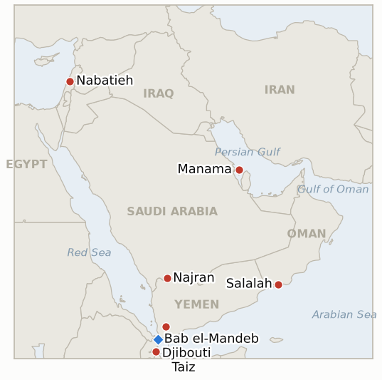

# Middle East Daily Briefing

**September 14, 2026**

- **Reporting window:** ~24 hours, September 13, 09:00 to September 14, 09:00 KST
- **Overall assessment:** Monday opened with the war's diplomatic and military tracks moving in opposite directions at once. The one concrete de-escalation step on the calendar, Monday's Oman hosted Hormuz talks between Iran and Gulf states, collapsed before it could convene: Bahrain refused to sit with Iran absent restored diplomatic relations, and Oman's foreign minister postponed the entire meeting rather than proceed without Gulf unity, leaving the Strait of Hormuz's management exactly where Friday's brief left it. Meanwhile the war's kinetic edges pushed outward on three fronts at once. In Yemen, the Houthis' completed capture of the Red Sea coastline did not mark a pause; their forces have now advanced to within roughly 20 miles of Djibouti, home to the main US base in Africa, even as Saudi Arabia answered with 129 air strikes in 48 hours and cross border fire with Najran continued. In Lebanon, Israeli strikes around the newly seized Ali Taher Ridge killed at least 29 people, including 12 members of one family, a toll steep enough that Washington pushed the next round of Israel Lebanon talks in Rome from September into October. And in Washington, the Pentagon quietly answered its own internal warning about an unsustainable campaign pace not by scaling back but by extending Middle East deployments into 2027, with elements of the 82nd Airborne Division staying "well into 2027" and Defense Secretary Hegseth reportedly backing a "periodic bombing" approach one analyst said would create a permanent state of war. Five indicators resolve in this window, two diplomatic tracks falsified (the Salalah talks, the Rome talks) and three confirming that both Yemen's territorial war and Washington's own campaign are deepening rather than winding down. In Seoul, a Gallup Korea poll taken this week found 55% of respondents oppose sending Korean forces to the Strait of Hormuz against 32% in favor, sharpening the domestic backdrop against which the National Assembly's approval process must play out around President Lee's September 18 to 28 UN General Assembly trip.

---

## 1. What Happened

<figure style="float:right; width:46%; margin:2pt 0 8pt 14pt;">

<figcaption style="font-size:8pt; color:#666; text-align:center; margin-top:3pt; font-style:italic;">Major places of discussion</figcaption>
</figure>

### 1.1 Oman Postpones Monday's Salalah Hormuz Talks After Bahrain Refuses to Attend

Iran and Gulf Cooperation Council states were due to meet Monday in Salalah, Oman, to discuss a temporary framework for managing Strait of Hormuz shipping, but Bahrain's foreign ministry announced Saturday it would not attend any collective meeting including Iran before diplomatic relations are restored, saying regional security "cannot be preserved through a policy of appeasement" and calling instead for Hormuz to reopen without "discrimination, fees or permits" ([Al Jazeera](https://www.aljazeera.com/news/2026/9/13/iran-gcc-summit-whats-behind-the-meeting-why-is-bahrain-not-attending)). Rather than convene without full Gulf attendance, Omani Foreign Minister Badr Albusaidi announced Sunday the meeting itself was postponed "in the interests of consensus," adding "we remain committed to fostering dialogue that supports stability and lasting cooperation in our region," without offering a new date or describing next steps ([Bloomberg](https://www.bloomberg.com/news/articles/2026-09-13/hormuz-meeting-with-iran-and-gulf-nations-postponed-oman-says); [CNN](https://www.cnn.com/2026/09/13/politics/iran-gulf-countries-strait-of-hormuz)). This falsifies **IND-20260912-2** (the talks are postponed rather than convening, cancelling outright, or producing an agreement) and opens new **IND-20260914-1** to track whether a rescheduled Salalah framework meeting reconvenes and produces an agreement, or the process stalls indefinitely on the Bahrain Iran rift. **Confidence: High**, corroborated by Oman's foreign minister's own statement plus Bloomberg and CNN reporting.

### 1.2 Yemen's War Pushes Toward Djibouti as Saudi Arabia Answers With 129 Strikes in 48 Hours

Fighting intensified across Yemen's active fronts: Yemen's air force struck Houthi vehicles in the Dhubab and Mocha areas, Saudi Arabia conducted 129 air strikes in the past 48 hours, and heavy ground fighting continued in Taiz, Marib, al-Jawf and al-Dhalea, with more than 82,000 people displaced since the start of September and over 2,000 reaching Djibouti in the past day alone ([Al Jazeera](https://www.aljazeera.com/news/2026/9/13/fighting-continues-between-yemen-govt-forces-houthis-what-is-the-latest); [AP via PBS](https://www.pbs.org/newshour/world/iran-backed-houthis-in-yemen-claim-new-attacks-on-saudi-arabia)). The Houthis' westward push has now brought them to within roughly 20 miles of Djibouti, the main US base in Africa, on the far side of Bab el-Mandeb from their already completed coastal conquest, while separately claiming an attack on a military base in Sharurah, Najran province, and Saudi civil defense reporting a projectile that hit al-Tawwal, wounding two and damaging a mosque and other buildings. Yemen's government forces committing their own air force to sustained strikes in Dhubab and Mocha, continuing rather than a one time show of force, confirms **IND-20260906-3**; the further Houthi advance beyond Bab el-Mandeb toward Djibouti's border, extending rather than reversing the coastal gains tracked since Mocha and Perim Island fell, confirms **IND-20260911-1**. This opens new **IND-20260914-2** to track whether the advance toward Djibouti converts into a cross border incident, a US or Djiboutian response, or a further refugee surge, or halts short of the border without wider Horn of Africa spillover. **Confidence: High** on the fighting and displacement figures (Tier 1 wire and Al Jazeera reporting); **Medium** on the specific 20 mile Djibouti distance, which circulated through secondary US outlets rather than a primary wire figure this brief could independently confirm.

### 1.3 Rome's Israel Lebanon Talks Slip to October After Ali Taher Ridge Strikes Kill at Least 29

The next round of US brokered Israel Lebanon talks, most recently reported set for September 15 to 16 in this ledger's Sept 12 tracking, has instead been pushed to October, a US official telling reporters the Lebanese and Israeli ambassadors will instead meet at the State Department in Washington this week "to discuss ongoing developments and the continued implementation" of the June framework, which the official called "the only viable mechanism to restore Lebanon's sovereignty and Israel's security" ([RTE](https://www.rte.ie/news/middle-east/2026/0912/1591255-lebanon-israel-world/); [Times of Israel](https://www.timesofisrael.com/us-insists-israel-lebanon-talks-moving-in-positive-direction-despite-setback-last-week/)). The delay follows intensified Israeli strikes around the Ali Taher Ridge, the underground Hezbollah complex Israel declared "operational control" of on September 3, which have killed at least 29 people in recent days, including 12 members of a single family ([Al-Monitor](https://www.al-monitor.com/originals/2026/09/israel-says-it-destroyed-hezbollah-tunnels-ali-al-taher-ridge-what-know)). This falsifies **IND-20260911-4** (the ridge operation coincided with the talks stalling rather than proceeding in parallel) and opens new **IND-20260914-3** to track whether the civilian toll draws a distinct international humanitarian law response, paralleling this ledger's Kfar Rumman precedent (**IND-20260908-1**), or is absorbed without one. **Confidence: Medium**, RTE and Times of Israel report the postponement and the "setback" framing without naming a precise cause, while the casualty figures rest on Al-Monitor's single sourcing.

### 1.4 Pentagon Extends Middle East Deployments Into 2027 Rather Than Scaling Back

Answering this ledger's tracked internal warning that the campaign's pace is unsustainable, the Pentagon has quietly extended Middle East troop deployments into 2027 rather than drawing down: elements of the Army's 82nd Airborne Division could remain "well into 2027," Army air defense units have had standard rotations extended from nine months to a year, and the US maintains roughly 50,000 troops and 19 warships, including two carriers, in the region "in part to give the president flexibility on next steps" ([Asia Times](https://asiatimes.com/2026/09/war-lingering-pentagon-extends-mideast-troop-deployments-into-27/); [i24NEWS](https://www.i24news.tv/en/news/international/americas/artc-pentagon-quietly-extends-troop-deployments-as-iran-war-drags-toward-2027-report)). Defense Secretary Hegseth is reported to have separately backed a "periodic" bombing approach to keep Hormuz shipping moving, which analysts cited in the reporting said amounts to a permanent state of war rather than a path to an end date. Because a disclosed, extended rotation is itself the kind of visible force posture change the indicator's resolution condition names, even though it extends rather than reduces the footprint, this confirms **IND-20260831-2**. **Confidence: Medium**, corroborated across two outlets reporting what reads as the same underlying disclosure, with no primary Pentagon statement independently located this window.

### 1.5 Gallup Korea Poll Finds 55% Oppose Hormuz Deployment as National Assembly Timeline Tracks Lee's UN Trip

A Gallup Korea poll conducted this week found 55% of respondents oppose sending Korean military personnel and assets to the Strait of Hormuz against 32% in favor, with 13% undecided; opposition ran to 69% among Democratic Party of Korea supporters and 65% in the Honam region, while People Power Party supporters favored deployment 50% to 36% ([OhmyNews](https://www.ohmynews.com/NWS_Web/View/at_pg.aspx?CNTN_CD=A0003266510); [CBC News Korea](https://www.cbci.co.kr/news/articleView.html?idxno=605903)). The same poll found 67% of respondents back neither side of the broader Middle East war, versus 25% favoring the US Israel coalition and 5% Iran. Under South Korean law any deployment requires National Assembly approval, and reporting continues to place the final vote around President Lee Jae-myung's September 18 to 28 UN General Assembly visit, with officials stressing both legal procedure and "social consensus" are required first ([Korea Herald](https://www.koreaherald.com/article/10869367)). No new movement surfaced this window on **IND-20260911-3**'s reported ~September 17 NSC date or on **IND-20260906-2**'s ~September 28 Assembly deadline. **Confidence: High** on the poll figures (Tier 1-2 Korean outlets citing Gallup Korea directly); **Medium** on the vote timeline, which remains reported rather than officially confirmed.

---

## 2. Deep Dive: Incentives and Motives

### 2.1 Why did Oman postpone the entire Salalah meeting rather than convene it without Bahrain?

Because a Hormuz framework that excludes one Gulf state from the outset would carry less legitimacy with Iran and with shippers than a unanimous Gulf position, and Oman, which has spent months positioning itself as the trusted intermediary on Hormuz precisely because it can speak for the GCC as a bloc, risked undermining that role for years if its first substantive session opened with a visible Gulf split; postponing "in the interests of consensus" preserves Oman's credibility as convener even at the cost of losing the near term momentum built since Friday's de-escalatory oil rally.

### 2.2 Why do the Houthis keep advancing toward Djibouti after already securing Bab el-Mandeb's chokepoint value?

Because momentum itself has become a strategic asset independent of any single objective: each additional mile of coastline the Houthis take before international attention or a Saudi Gulf counteroffensive can organize further cements their claim to permanent control of Yemen's entire Red Sea frontage, and pressing toward Djibouti raises the cost of any future effort to dislodge them by threatening to draw in a second set of foreign militaries, American, French, Chinese and Japanese, that have never previously had to consider the Houthis as a proximate threat.

### 2.3 Why would Israel intensify strikes around Ali Taher Ridge at the exact moment it complicated its own diplomatic track with Lebanon?

Because Israel has treated military and diplomatic pressure on Hezbollah as complementary rather than substitutable throughout this campaign, and a ridge Israel has already declared "operational control" of is more valuable fully cleared of remaining fighters and tunnels before any ceasefire mechanism locks in the current line of control; a costly clearing operation now, even one that delays Rome, buys Israel a stronger negotiating position whenever the talks do resume, at the price of a toll high enough to complicate Washington's own messaging that the framework is working.

### 2.4 Why would the Pentagon respond to an internal sustainability warning by extending deployments rather than drawing down?

Because the warning was about pace, not presence: rotating units out on schedule while the campaign's operational tempo stays constant would mean fewer, more exhausted troops covering the same mission, whereas extending individual deployments preserves both troop density and institutional knowledge in theater even as it strains the force in a different way, a trade Hegseth appears to have judged preferable to the readiness and political risk of a visible drawdown while the war remains unresolved and the president has publicly tied its end date to the midterms.

---

## 3. Policy Implications for South Korea

**Exposure snapshot:** South Korea's crude imports remain roughly 70% dependent on Strait of Hormuz transit and about 36% of its LNG imports come from the Middle East, with Qatar's Ras Laffan as the single largest LNG supplier exposure (see `instructions/korea-exposure.md`, last updated August 14, 2026). No material update to these baselines surfaced in the window; with the window closing exactly at Monday's KRX open, Friday's closing levels (Brent $104.61, WTI $100.05, KOSPI 6,909.91, won 1,345.9) remain the most current reference points as trading resumes.

**Implications by development:**

- **The postponed Salalah talks (§1.1):** The clearest near term signal for Korean shipping and refiners, a Hormuz management framework, has now slipped with no rescheduled date, extending the planning horizon MOTIE and Korean refiners must assume before any formal transit arrangement could take effect.
- **Yemen's push toward Djibouti (§1.2):** A war reaching toward the Horn of Africa raises the stakes for Korea's own Yanbu Red Sea workaround, which already transits Bab el-Mandeb; a chokepoint conflict widening rather than stabilizing argues against treating the corridor's current calm as durable, per `korea-exposure.md`'s standing note that this route remains directly exposed to a Houthi closure.
- **Rome's delay to October (§1.3):** No direct Korean channel, but a stalled Lebanon track alongside a stalled Hormuz track reinforces this ledger's reading that diplomatic momentum across the region's multiple fronts is stalling in parallel this week rather than only on the file most relevant to Korea.
- **The Pentagon's 2027 extension (§1.4):** A US posture explicitly built around indefinite campaign duration, rather than a near term end date, is directly relevant to Korean planners' own duration assumptions and tempers any read of President Trump's midterms prediction (**IND-20260910-3**) as the operative planning baseline.
- **The Gallup Korea poll (§1.5):** With 55% opposition and only 32% in favor heading into the run up to President Lee's UN trip, the domestic political cost of a deployment decision is now measured rather than assumed, a data point the National Assembly's own eventual vote will be read against.

**Testable indicators:**

- **IND-20260914-1** (new): The postponed Salalah Hormuz talks either reconvene with a new date and produce an agreed framework, or the process stalls indefinitely on the Bahrain Iran rift. Deadline ~2026-09-28.
- **IND-20260914-2** (new): The Houthis' advance toward Djibouti's border either converts into a cross border incident, a US or Djiboutian response, or a further refugee surge, or halts short of the border without wider spillover. Deadline ~2026-09-28.
- **IND-20260914-3** (new): The Ali Taher Ridge civilian toll (29 killed, 12 from one family) either draws a distinct international humanitarian law response or an Israeli investigation, or is absorbed without one. Deadline ~2026-09-28.
- **IND-20260912-1** (open): Whether the Houthis' completed Bab el-Mandeb capture converts into a verified shipping incident; none found this window, though the westward advance is a related but distinct development. Deadline ~2026-09-26.
- **IND-20260912-3** (open): Whether Hegseth's Hormuz "control" claim holds against further verified disruption; untested this window. Deadline ~2026-09-26.
- **IND-20260910-1** (open): Whether Iran repeats a strike on a third country base hosting US forces; no repeat this window. Deadline ~2026-09-24.
- **IND-20260911-3** (open): Whether Korea's NSC review produces a public agenda item ahead of the ~September 28 deadline; the reported ~September 17 date remains unchanged. Deadline ~2026-09-24.
- **IND-20260906-2** (open): Whether Korea's Hormuz deployment reaches a formal National Assembly motion; the Gallup poll sharpens the political backdrop but no procedural movement this window. Deadline ~2026-09-28.

---

## 4. Watch List

- **A rescheduled Salalah meeting (IND-20260914-1):** whether Oman can reconvene Gulf states and Iran once the Bahrain rift is managed.
- **The Houthi advance on Djibouti (IND-20260914-2):** the nearest concrete test of whether Yemen's war spills into the Horn of Africa.
- **Ali Taher Ridge's civilian toll (IND-20260914-3):** whether 29 deaths including 12 from one family draws a distinct international response.
- **South Korea's possible September 17 NSC meeting (IND-20260911-3):** the nearer term signal ahead of the September 28 Assembly deadline, now set against a 55% opposition poll.
- **Pickaxe Mountain (IND-20260905-1):** still not struck as of this window; deadline ~09-18.
- **Ben Gvir's Disengagement 710 plan (IND-20260904-2):** still no confirmed host country interest; deadline ~09-18.
- **Syria Hezbollah military move warning (IND-20260815-3):** deadline ~09-15, one day out, still no reported move either way.
- **Qatari LNG loadings at Ras Laffan (IND-20260714-4):** still no fresh weekly loading figure; the ledger's longest running unresolved indicator.

---

## 5. Source Quality Summary

| Claim | Sources | Confidence |
|---|---|---|
| Bahrain refuses to attend Monday's Salalah Hormuz talks over Iran ties; Oman postpones the meeting | Al Jazeera, Bloomberg, CNN, Omani FM Albusaidi's own statement (Tier 1) | High |
| Yemen fighting intensifies (Taiz, Marib, al-Jawf, al-Dhalea); Saudi conducts 129 strikes in 48 hours; 82,000+ displaced | Al Jazeera, AP via PBS (Tier 1) | High |
| Houthi advance brings them within ~20 miles of Djibouti's US base | Secondary US outlets summarizing wire reporting; not independently confirmed against a primary wire figure | Medium |
| Houthi claim of Sharurah attack; Saudi civil defense reports al-Tawwal hit, two wounded | AP wire reporting (Tier 1) | Medium-High |
| Rome Israel-Lebanon talks postponed to October; State Department meeting substituted | RTE, Times of Israel (Tier 1) | High on postponement; Medium on stated cause |
| Ali Taher Ridge strikes kill at least 29, including 12 from one family | Al-Monitor (Tier 2, single source) | Medium |
| Pentagon extends Middle East deployments into 2027; 82nd Airborne, extended rotations, periodic bombing strategy | Asia Times, i24NEWS (Tier 2-3, two outlets on the same apparent disclosure; no primary Pentagon statement located) | Medium |
| Gallup Korea poll: 55% oppose Hormuz deployment, 32% favor, with party and regional splits | OhmyNews, CBC News Korea (Tier 1-2 Korean outlets citing Gallup Korea) | High |
