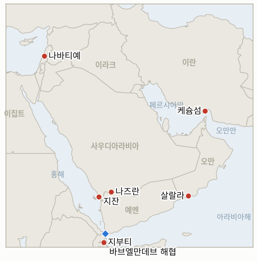

# 중동 일일 브리핑

**2026년 9월 15일**

- **보고 기간:** 약 24시간, 9월 14일 09:00 ~ 9월 15일 09:00 (한국시간)
- **종합 평가:** 월요일의 창구는 호르무즈 해협 자체가, 그 주변의 외교만큼이나 여전히 분쟁의 대상임을 일깨우며 시작됐다. 케슘섬 인근에서 원인 불명의 공격이 이란 상선 승조원 1명을 숨지게 하고 3~4명을 다치게 했으며, 하루 만에 테헤란은 걸프 국가들과 이라크에 임시 해운 체제를 설명할 예정이었던 오만 주최 회담을 연기했다. 이란 외교부는 이후 이번 연기 요청이 실제로는 바레인의 일요일 불참 선언뿐 아니라 사우디아라비아로부터 나왔다고 밝히며, 사우디가 내세운 이유인 예멘 전쟁을 "거짓 구실"이라고 일축했다. 사우디 자체의 행보는 예멘 문제가 어느 쪽이든 사우디에 부담이 되는 이유를 보여줬다. 사우디 연합군은 나즈란·지잔 인근에서 후티의 국경 공세를 격퇴했고 후티의 지부티 진격은 계속됐으며, 파이살 빈 파르한 외교장관은 뉴델리 브릭스 정상회의에서 긴장 완화를 촉구했지만 사우디 자체의 공습 강도는 오히려 유지됐다. 유가는 두 트랙의 차질을 함께 반영해 사우디 송유관 가동 중단이 두 번째 주로 접어들면서 배럴당 108달러를 다시 넘어섰고, 코스피는 이 움직임을 미 금리 인상 우려·AI 투자 불안과 함께 국내에서 이른바 '삼중고'로 불리는 흐름의 한 축으로 받아들이며 3.26% 하락, 3거래일 연속 하락 마감했다. 레바논에서는 워싱턴이 로마 협상의 10월 연기를 주로 일정상의 문제라고 설명했지만, 카츠 국방장관이 헤즈볼라가 레바논 전역에서 무장해제될 때까지 이스라엘이 레바논 내 안보지대에서 철수하지 않겠다고 새롭게 밝힌 것은 능선 자체의 국지적 비무장화 조건보다 더 강경한 노선으로 읽힌다. 이번 창구에서 지표 2건이 해소된다. 헤그세스 장관의 9월 11일 "호르무즈 통제" 주장은 케슘 피격으로 반증되며, 시리아의 헤즈볼라 관련 군사행동 위협 지표는 오늘로 시한이 도래한 가운데 다마스쿠스가 계속 자제하며 반증된다.

---

## 1. 무슨 일이 있었나

<figure style="float:right; width:46%; margin:2pt 0 8pt 14pt;">

<figcaption style="font-size:8pt; color:#666; text-align:center; margin-top:3pt; font-style:italic;">주요 논의 지점</figcaption>
</figure>

### 1.1 호르무즈 해협 치명적 피격에 살랄라 회담 무산… 이란 "사우디 요청, 거짓 구실"

영국 해사무역기구(UKMTO)는 토요일 그리니치 표준시 오후 11시, 호르무즈 해협을 통항 중이던 선박이 정체불명 발사체에 피격돼 화재가 발생하고 승조원이 대피했다고 밝혔다. 이란 국영매체는 일요일 새벽 케슘섬 인근에서 이란 상선이 피격돼 승조원 10명 중 1명이 숨지고 3~4명이 다쳤다고 전하며, 테헤란은 특정하지 않은 "테러 적대세력"을 배후로 지목했다([AP/US뉴스](https://www.usnews.com/news/us/articles/2026-09-13/an-iranian-commercial-ship-is-struck-near-strait-of-hormuz-1-person-killed-irans-state-media-say); [프랑스24](https://www.france24.com/en/middle-east/20260914-iranian-ship-qeshm-island-tehran-hormuz)). 테헤란은 같은 날 걸프 국가와 이라크, 그 외 연안국들에 자국의 해운 체제 구상을 설명할 예정이었던 월요일 살랄라(오만) 브리핑을 연기했고, 월요일 이란 외교부는 이번 연기가 실은 사우디아라비아의 요청에 따른 것이라며, 사우디가 내세운 이유인 예멘 전쟁을 "거짓 구실"이라고 밝혔다. 이란은 후티의 결정에 관여하지 않는다는 입장을 유지하고 있다([워싱턴포스트](https://www.washingtonpost.com/world/2026/09/14/iran-persian-gulf-foreign-ministers-postpone-meeting-talks-stall/); [워싱턴타임스](https://www.washingtontimes.com/news/2026/sep/14/oman-hosted-gulf-nations-meeting-canceled-yemeni-war-heats/); [알자지라](https://www.aljazeera.com/news-analysis/2026/9/14/temporary-hormuz-solution-deferred-as-iran-arab-summit-falls-through)). 이는 일요일 연기 배경의 더 완전한 그림이며(아래 정정 참고), 새 일정은 아직 나오지 않았고, 이란 대변인은 필요하다면 오만과 함께 해운 체제를 양자 차원에서 "어떻게 발표하거나 등록할지" 결정하겠다고 밝혔다. 이는 **IND-20260912-3**(헤그세스 장관의 "통제" 주장이 해협 내 치명적 공격으로 흔들림)을 반증하며, 집단 체제가 재개될지 이란이 양자 차원으로 진행할지를 추적하는 신규 **IND-20260915-1**과 케슘 피격이 배후 규명이나 추가 공격으로 이어질지를 추적하는 신규 **IND-20260915-2**를 개설한다. **신뢰도: 높음**, 피격과 연기 자체는 AP 통신, UKMTO 및 다수의 1등급 매체 보도. **신뢰도: 중간**, 사우디 요청이라는 설명은 이란 외교부 자체 발표에 근거하며 이번 창구에서 사우디 측의 독립적 확인은 확보하지 못했다.

### 1.2 예멘 전쟁 계속 확대… 사우디, 국경 공세 격퇴하며 브릭스에서 긴장 완화 촉구

사우디 주도 연합군의 헬기·전투기가 일요일 나즈란·지잔 국경 인근에서 엿새째 이어진 후티의 사우디 영토 진입 시도를 격퇴했다. 주민들은 후티 사망자를 20명으로, 사우디 국영TV는 50명으로 전했으며, 별도로 후티의 발사체가 알타왈에 떨어져 2명이 다치고 모스크 등 여러 건물이 파손됐다([야후/AP](https://news.yahoo.com/saudi-led-forces-fight-houthi-border-advance-killing-200126443.html); [PBS/AP](https://www.pbs.org/newshour/world/iran-backed-houthis-in-yemen-claim-new-attacks-on-saudi-arabia)). 바브엘만데브를 넘어선 후티의 서진은 지부티 미군기지 쪽으로 계속 이어졌고, 9월 초 이후 실향민이 8만 명을 넘어섰으며 지부티 도착자는 2000명을 넘었다. 파이살 빈 파르한 외교장관은 뉴델리 브릭스 정상회의에서 "계속된 대치는 지속 가능한 해결로 가는 길이 될 수 없다"며 GCC 6개국이 "어떤 구실이나 명분으로도" 자국 영토·시설·핵심 이익에 대한 어떤 표적화도 거부한다고 밝혔는데, 이 같은 긴장 완화 촉구는 사우디 자체의 공습 강도(9월 14일 자로 이미 추적된 48시간 129회)가 완화되지 않고 유지되는 가운데 나왔다([아랍뉴스](https://www.arabnews.com/saudi-arabia/saudi-arabia-uae-call-for-united-gulf-stance-amid-regional-escalation-3001596); [더디거뉴스](https://www.thediggernews.com/2026/09/14/saudi-fm-warns-at-brics-gulf-security-and-resources-non-negotiable-amid-escalating-attacks/)). 이는 파이살 장관의 외교적 촉구가 구체적 이니셔티브로 이어질지, 아니면 군사 트랙이 계속 확대될지를 추적하는 신규 **IND-20260915-3**을 개설한다. **신뢰도: 높음**, 국경 교전과 브릭스 발언은 AP 통신, 아랍뉴스 보도. **신뢰도: 중간**, 정확한 후티 사망자 수는 사우디 측과 독립 취재 간에 차이가 있다.

### 1.3 유가 108달러 재돌파… 코스피, 수개월 만의 최대 낙폭

지난주 드론 공격으로 가동이 중단된 사우디 동서 송유관이 위성 피해 평가에 따라 3~5주간 정지될 것으로 예상되면서 해소되지 않은 호르무즈 대치 상황과 겹쳐 월요일 유가가 급등했다. 매체별 수치는 브렌트 108~110달러, WTI 101~104.5달러 선에 몰려 있었으며, 이번 창구에서 단일한 정산가는 확인되지 않았다([CNBC](https://www.cnbc.com/2026/09/14/iran-war-saudi-arabia-east-west-pipeline-oil.html); [리그존](https://www.rigzone.com/news/brent_oil_passes_108_per_barrel-14-sep-2026-184604-article/); 트레이딩이코노믹스). 코스피는 225.54포인트(3.26%) 내린 6684.37로 마감해 3거래일 연속 하락했다. 국내 금융권은 이번 하락을 유가 급등, 8월 근원 소비자물가지수(CPI)가 예상치를 웃돌며 90%에 가까워진 미 금리 인상 가능성, 앤트로픽·일론 머스크의 AI 안전성 경고와 오픈AI의 상장 철회로 재점화된 AI 개발 속도조절론이 겹친 '삼중고'로 설명했으며, 외국인은 4거래일 연속 순매도했다([파이낸셜뉴스](https://www.fnnews.com/news/202609141427326969); [머니투데이](https://www.mt.co.kr/stock/2026/09/15/2026091419375757625); [아주경제](https://www.ajunews.com/view/20260914161446784)). 원화는 소폭 약세를 보이며 1347.3원에 마감했다. **신뢰도: 높음**, 코스피·원화 종가는 다수의 한국 금융매체 보도. **신뢰도: 중간**, 단일 정산가가 확인되지 않아 유가 수치는 중간 신뢰도로 처리한다.

### 1.4 로마 연기, "일정 문제"로 설명됐지만 카츠 장관은 알리 타헤르 능선 연계 강경화

하레츠의 월요일 라이브 블로그는 로마 라운드의 10월 연기가 "주로 일정상의 문제"였다며 이스라엘의 유대 명절과 유엔총회 준비 일정을 이유로 들었고, 이스라엘과 레바논 대사는 이번 주 워싱턴에서 대신 만나 "현재 진행 상황을 논의"할 예정이나 돌파구는 기대되지 않는다고 전했다([하레츠](https://www.haaretz.com/israel-news/israel-security/2026-09-14/ty-article-live/katz-says-israel-wont-withdraw-from-hezbollah-stronghold-in-southern-lebanon/000001a0-9c95-d9a4-a3a7-9ff71cdb0005); [로리앙투데이](https://today.lorientlejour.com/article/1544277/us-says-new-round-of-israel-lebanon-talks-in-september-in-rome.html)). 같은 보도는 레바논이 알리 타헤르 능선 터널 해체 이후 협상 재개에 소극적이라는 점도 별도로 지적했으며, 이스라엘 카츠 국방장관이 "헤즈볼라가 레바논 전역에서 무장해제될 때까지 레바논 내 안보지대에서 철수하지 않겠다"고 밝혔다고 전했는데, 이는 무기 회수 이후 레바논군에 이양하는 능선 자체의 국지적 순서보다 더 강경한 전국 단위 무장해제 조건이다([나하르넷](https://www.naharnet.com/stories/en/322462-katz-says-israel-won-t-withdraw-until-hezbollah-disarmed-across-lebanon)). 알리 타헤르 능선 피해(**IND-20260914-3**)에 대한 유엔·국제적십자위원회(ICRC)나 이스라엘 조사 등 별도 대응은 이번 창구에서 확인되지 않았다. **신뢰도: 중간**, 하레츠의 "일정 문제" 설명과 지난주(9월 14일 브리핑)의 능선 피해 중심 설명은 서로 배치되기보다 같은 연기 사안을 매체마다 다르게 강조한 것으로 보인다.

**정정 및 업데이트:** 9월 14일 브리핑은 바레인 측 발표에 근거해 월요일 살랄라 회담 연기를 바레인이 이란과의 외교관계 복원 없이는 불참하겠다고 밝힌 데 따른 것으로 보도했다. 이후 워싱턴포스트, 워싱턴타임스, AFP 통신 계열 매체(모두 9월 14일자)의 보다 완전한 보도는 이란 외교부가 사우디아라비아가 실제로 연기를 요청했다고 밝혔으며, 테헤란 대변인이 이를 예멘과 관련된 "거짓 구실"이라고 표현했다고 전한다. 두 요인 모두 실제로 작용했을 가능성이 높다. 위 §1.1은 누가, 왜 연기를 요청했는지에 대한 이란 측의 설명을 더 완전한 그림으로 다루되, 바레인의 불참 선언(9월 13일 알자지라·블룸버그·CNN이 독립적으로 보도) 역시 오만이 재조정된 회담 이전에 여전히 관리해야 할 실질적이지만 부차적인 요인으로 남는다.

---

## 2. 심층 분석: 유인과 동기

### 2.1 사우디아라비아는 왜 참석에 합의했던 것으로 알려진 회담의 연기를 요청하며, 이란이 "거짓 구실"이라 부르는 예멘을 이유로 들었나?

이란과 가까운 세력들, 즉 사우디 남부 국경의 후티와 사우디 동서 송유관을 겨냥한 배후 미상의 드론이 사우디 영토를 실제로 공격하고 있는 상황에서 호르무즈 관리 체제에 서명하는 것은 한쪽 사안에서는 위협이 여전히 살아있는데도 테헤란에 외교적 승리를 안기는 셈이 되기 때문이다. 리야드는 이번 주 이란·오만 해운 체제에 동참하는 것이 확전을 보상하는 모양새로 비칠 수 있다고 판단했을 가능성이 크며, 예멘은 테헤란이 아무리 억지스러운 구실로 여기더라도 사우디에 긴장 완화 자체를 거부하는 것처럼 보이지 않으면서 연기할 그럴듯한 명분을 제공한다.

### 2.2 테헤란이 걸프 이웃국들에 해운 체제를 설명하려던 바로 그 시점에, 왜 호르무즈 해협 내 이란 선박이 치명적이고 배후 미상인 공격을 받았나?

이란이 스스로 영유권을 주장하는 해역 안에서, 오만과 함께 해협 관리에 대한 주도권을 사실상 확보하게 될 체제를 확정 짓기 직전에 일어난 공격은 그 결과를 막고 싶은 어떤 행위자에게도 이롭기 때문이다. 이란·오만 체제에 사실상의 정당성을 넘기는 데 회의적인 외부 세력일 수도 있고, 일방적 통제권을 협상으로 내주는 데 반대하는 이란 내 강경파일 수도 있다. 테헤란의 "테러 적대세력" 프레이밍은 내부가 아니라 외부를 겨냥하고 있으며, 이는 이란 당국이 해명되지 않은 사건을 내부 이견보다 외부의 공작 탓으로 돌려온 이 원장의 기존 패턴과 일치한다.

### 2.3 사우디아라비아는 왜 스스로 지역 외교를 연기시키면서도 후티에 대한 공습은 강화하고 있나?

리야드는 호르무즈 사안과 예멘 사안을 연계된 것이 아니라 분리 가능한 것으로 다루기 때문이다. 호르무즈 회담 연기는 즉각적인 영토 위협이 없는 사안에서 사우디의 협상력과 유연성을 지켜주는 반면, 강화된 공습과 국경 방어는 자국 주권이 실질적 압박을 받는 사안에 대한 대응이다. 나즈란과 지잔이 여전히 예멘 전쟁의 위협 아래 있는 이번 주에 호르무즈 외교에서 양보하는 것은, 리야드가 더 시급하다고 여기는 사안에서 상응하는 안보상의 이익도 얻지 못한 채 그보다 덜 시급하다고 여기는 사안에서 지렛대만 잃는 결과가 될 수 있다.

### 2.4 워싱턴이 로마 연기를 단순한 일정 문제라고 설명하려는 바로 그 시점에, 카츠 장관은 왜 알리 타헤르 능선 철수 조건을 강경화했나?

"일정 문제"라는 프레이밍은 워싱턴이 협상이 중단된 동안 능선의 향후 지위를 둘러싼 실질적 갈등을 인정하지 않을 수 있게 해주며, 그 중단은 이스라엘에게 협상이 재개되기 전 자신에게 유리한 조건을 굳힐 여지를 준다. 철수 조건을 능선 자체의 국지적 순서보다 더 높은 기준인 전국 단위 헤즈볼라 무장해제로 못박는 것은 로마 협상이 재개될 때를 대비한 이스라엘의 협상력을 늘려주는 동시에, 레바논에 대해서는 추가 지연이 결국 이스라엘 철수의 대가를 낮추는 것이 아니라 오히려 높이기만 한다는 신호를 보낸다.

---

## 3. 한국에 대한 정책적 함의

**익스포저 현황:** 한국의 원유 수입은 여전히 약 70%가 호르무즈 해협 통항에 의존하고 있으며 LNG 수입의 약 36%가 중동산으로, 카타르 라스라판이 최대 LNG 공급 익스포저다(`instructions/korea-exposure.md`, 2026년 8월 14일 최종 업데이트). 후티의 진격 전선으로부터 약 32km 떨어진 바브엘만데브를 통과하는 한국의 얀부 홍해 우회로는, 이번 창구의 초점이 별개의 호르무즈 초크포인트에 맞춰져 있는 동안에도 해당 파일이 명시한 대로 직접적인 위험에 계속 노출돼 있다. 월요일 코스피 종가 6684.37(-3.26%)과 원화 1347.3원은 이 원장이 추적해온 것 중 7월 초 이후 가장 큰 하루 국내 시장 변동폭이지만, 국내 금융권은 이를 전쟁 요인만이 아니라 미 금리·AI 자본지출 불안 등 미국 국내 요인이 섞인 결과로 설명한다.

**사안별 함의:**

- **케슘 피격과 회담 무산(§1.1):** 단순한 외교 지연이 아니라 해협 내부에서 벌어진 배후 미상의 치명적 공격이라는 점은, 어떤 호르무즈 관리 체제도 임박했다고 보기 어렵게 만들며, 산업통상자원부와 국내 정유사들은 불확실성 창구가 좁혀지기보다 계속 길어진다는 전제로 계획을 이어가야 한다.
- **예멘 전쟁의 계속된 확대(§1.2):** 사우디 자체 공습 강도가 유지되는 가운데 나온 사우디의 긴장 완화 촉구는, 역내에서 가장 영향력 있는 외교 목소리조차 예멘 트랙이 스스로 냉각될 것으로 기대하지 않는다는 뜻이며, 이는 한국의 얀부·바브엘만데브 우회로를 해소된 위험이 아니라 살아있는 위험으로 다뤄야 한다는 근거를 강화한다.
- **유가 108달러 재돌파와 코스피 급락(§1.3):** 사우디 송유관 가동 중단이 이제 3~5주간 이어질 것으로 예상되는 만큼, 산업통상자원부의 수급 계획에 반영되는 유가 하한선은 빠른 재가동이 아니라 계속된 고유가를 전제해야 한다. 코스피·원화의 움직임은 또한 중동발 충격이 이제 국내 요인(미 통화정책, AI 업종 심리)과 별개가 아니라 겹쳐서 작동한다는 점을 보여준다.
- **로마 회담의 '일정 문제' 설명과 카츠 장관의 강경화(§1.4):** 한국과의 직접적 연결고리는 없지만, 이스라엘의 강경화된 협상 노선과 정체된 호르무즈 트랙이 겹친 것은 이번 주 지역 내 여러 전선의 외교적 모멘텀이 한국과 가장 직결된 사안에서만이 아니라 전반적으로 정체되고 있다는 이 원장의 판단을 뒷받침한다.
- **한국 자체의 파병 절차:** 보도에 따르면 정부는 P-8A 해상초계기와 폭발물처리반(EOD) 위주의 파병동의안을 "이르면 이달 중" 국회에 제출하는 방향으로 문구를 다듬고 있으며, 최종 표결은 여전히 이재명 대통령의 9월 18일부터 28일까지의 유엔 방문 시점에 맞춰질 것으로 전망된다. 월요일의 시장 변동성은 이 논의가 진행될 국내 경제적 배경을 새롭게 조성하고 있다.

**검증 가능한 지표:**

- **IND-20260915-1** (신규): 연기된 살랄라 호르무즈 브리핑이 걸프 국가들과 재개돼 합의 체제를 도출하거나, 이란이 걸프 전체의 동의 없이 오만과 양자 차원으로 진행한다. 시한 ~2026-09-29.
- **IND-20260915-2** (신규): 케슘 호르무즈 해협 치명적 피격이 배후 규명, 보복, 또는 추가 해협 내 공격으로 이어지거나, 고립된 사건으로 흡수된다. 시한 ~2026-09-29.
- **IND-20260915-3** (신규): 파이살 장관의 브릭스 긴장 완화 촉구가 구체적 외교 이니셔티브로 이어지거나, 역내 군사 트랙이 그와 무관하게 계속 확대된다. 시한 ~2026-09-29.
- **IND-20260914-1** (진행): 재조정된 살랄라 회담의 재개 여부. IND-20260915-1의 더 완전한 설명으로 일부 대체됐으나 별도로 계속 추적한다. 시한 ~2026-09-28.
- **IND-20260914-2** (진행): 지부티를 향한 후티의 진격. 계속되고 있으나 이번 창구에서 국경 간 사건은 없었다. 시한 ~2026-09-28.
- **IND-20260914-3** (진행): 알리 타헤르 능선 피해가 국제인도법 차원의 별도 대응을 이끌어내는지 여부. 이번 창구에서는 없었다. 시한 ~2026-09-28.
- **IND-20260913-1** (진행): 트럼프 대통령의 사우디 송유관 공격 이란 배후설이 확인되는지 여부. 여전히 미확인이며 이라크 민병대들은 연루를 부인한다. 시한 ~2026-09-27.
- **IND-20260911-3** (진행): 한국의 국가안전보장회의 검토. 여전히 9월 17일경 개최 가능성이 거론되나 공식 의제로 이어지지는 않았다. 시한 ~2026-09-24.
- **IND-20260906-2** (진행): 한국의 정식 국회 파병동의안 제출 여부. 동의안 문구는 다듬어지고 있는 것으로 보도되나 아직 제출되지 않았다. 시한 ~2026-09-28.

---

## 4. 관찰 목록

- **재조정될 살랄라·오만 체제(IND-20260915-1):** 이란과 걸프 국가들이 재소집될지, 이란이 양자 차원으로 진행할지.
- **케슘 호르무즈 해협 피격(IND-20260915-2):** 해협 내 선박 공격이 하나의 패턴으로 자리잡는지를 가늠할 가장 가까운 시험대.
- **파이살 장관의 브릭스 긴장 완화 촉구(IND-20260915-3):** 구체적 이니셔티브로 이어질지, 수사에 그칠지.
- **지부티를 향한 후티의 진격(IND-20260914-2):** 여전히 아프리카의 뿔 지역 확산 여부를 가늠할 가장 가까운 시험대.
- **한국의 9월 17일경 국가안전보장회의 개최 가능성(IND-20260911-3):** 9월 28일 국회 시한을 앞둔 더 가까운 신호.
- **픽액스 마운틴(IND-20260905-1):** 이번 창구까지 타격되지 않음, 시한 ~09-18.
- **벤그비르의 디스인게이지먼트 710 계획(IND-20260904-2):** 여전히 확인된 수용국 관심 없음, 시한 ~09-18.
- **라스라판 카타르 LNG 선적량(IND-20260714-4):** 여전히 최신 주간 선적 수치 없음, 이 원장에서 가장 오래 미해결로 남은 지표.

---

## 5. 출처 신뢰도 요약

| 주장 | 출처 | 신뢰도 |
|---|---|---|
| 케슘섬 인근 호르무즈 해협에서 원인 불명 공격으로 이란 상선 승조원 1명 사망, 3~4명 부상 | UKMTO, AP 통신(US뉴스·ABC·더힐 경유), 워싱턴포스트, CNN, CNBC (1등급) | 높음 |
| 이란, 살랄라 브리핑 연기; 외교부 "사우디아라비아가 연기 요청, 예멘은 거짓 구실" | 워싱턴포스트, 워싱턴타임스, 알자지라 분석 기사, AFP 통신 계열 매체 (1등급) | 중간~높음 |
| 사우디 연합군, 나즈란·지잔 인근 후티 국경 공세 격퇴; 후티 사망자 수 엇갈림(20명 대 50명) | 야후/AP 통신, PBS (1등급); 사우디 국영TV(2~3등급, 높은 수치 출처) | 교전 자체는 높음; 사망자 수는 중간 |
| 파이살 장관의 브릭스 긴장 완화 및 GCC 영토 관련 발언 | 아랍뉴스, 더디거뉴스 (1~2등급) | 높음 |
| 월요일 유가 브렌트 108~110달러, WTI 101~104.5달러 선; 단일 정산가 미확인 | CNBC, 리그존, 트레이딩이코노믹스, 밴티지마켓 (2~3등급, 수치는 수렴하나 정산가는 아님) | 중간 |
| 코스피 -3.26% 6684.37 마감; 원화 1347.3원 약세; '삼중고' 설명 | 파이낸셜뉴스, 머니투데이, 아주경제, 비즈니스코리아 (1~2등급 한국 금융매체) | 높음 |
| 로마 연기 "주로 일정 문제"; 카츠 장관 알리 타헤르 철수를 전국 단위 헤즈볼라 무장해제와 연계 | 하레츠, 로리앙투데이 (1등급); 나하르넷(2등급, 카츠 인용) | 중간~높음 |
