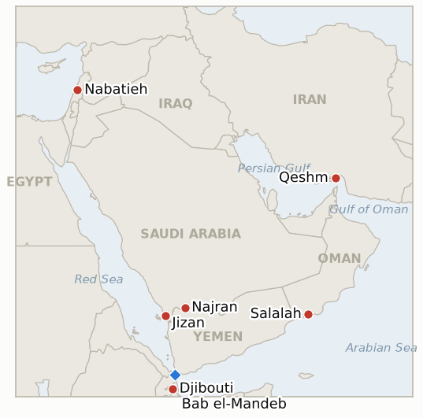

# Middle East Daily Briefing

**September 15, 2026**

- **Reporting window:** ~24 hours, September 14, 09:00 to September 15, 09:00 KST
- **Overall assessment:** Monday's window opened with a reminder that the Strait of Hormuz itself, not just the diplomacy around it, remains contested: a still-unattributed strike killed one crew member and wounded three to four aboard an Iranian commercial vessel off Qeshm Island, and within a day Tehran postponed the Oman-hosted meeting at which Gulf states and Iraq were to be briefed on a temporary shipping framework. Iran's Foreign Ministry then said the postponement request had actually come from Saudi Arabia, not only from Bahrain's Sunday boycott, and dismissed Riyadh's stated reason, the ongoing Yemen war, as a "false pretext." Saudi Arabia's own posture explained why Yemen would weigh on it either way: its coalition repelled a Houthi border assault near Najran and Jizan while the Houthis' advance toward Djibouti continued, and Foreign Minister Faisal bin Farhan used a BRICS appearance in New Delhi to call for de-escalation even as the kingdom's own strike tempo stayed elevated. Oil registered the setbacks on both tracks together, pushing back above $108 a barrel as the Saudi pipeline outage stretched toward a second week, and KOSPI absorbed the move as one leg of a domestically-described "triple threat" alongside US rate-hike anxiety and AI-investment jitters, closing down 3.26% for a third straight losing session. In Lebanon, Washington described the Rome talks' slip to October as chiefly logistical, but Defense Minister Katz's fresh vow that Israel will not leave its Lebanon security zone until Hezbollah disarms nationwide reads as a harder line than the ridge's own local demilitarization terms. Two indicators resolve in this window: Hegseth's Sept 11 claim that the US "controls" the Strait of Hormuz falls to the Qeshm attack, and Syria's threatened move against Hezbollah is falsified as Damascus continues to hold off, its own deadline reached today.

---

## 1. What Happened

<figure style="float:right; width:46%; margin:2pt 0 8pt 14pt;">

<figcaption style="font-size:8pt; color:#666; text-align:center; margin-top:3pt; font-style:italic;">Major places of discussion</figcaption>
</figure>

### 1.1 Fatal Hormuz Vessel Strike Collapses Salalah Talks as Iran Blames Saudi Request on a "False Pretext"

UKMTO reported an unknown projectile struck a vessel transiting the Strait of Hormuz at 2300 GMT Saturday, sparking a fire and prompting a crew evacuation; Iranian state media said an Iranian commercial vessel was hit off Qeshm Island early Sunday, killing one of its ten crew and wounding three to four, with Tehran blaming a "terrorist enemy" without naming one ([AP via US News](https://www.usnews.com/news/us/articles/2026-09-13/an-iranian-commercial-ship-is-struck-near-strait-of-hormuz-1-person-killed-irans-state-media-say); [France 24](https://www.france24.com/en/middle-east/20260914-iranian-ship-qeshm-island-tehran-hormuz)). Tehran postponed Monday's planned Salalah, Oman briefing to Gulf states, Iraq and other littoral states on its emerging shipping framework the same day, and by Monday Iran's Foreign Ministry said the postponement had in fact been requested by Saudi Arabia, calling Riyadh's cited reason, the Yemen war, "a false pretext," since Tehran maintains it does not direct Houthi decisions ([Washington Post](https://www.washingtonpost.com/world/2026/09/14/iran-persian-gulf-foreign-ministers-postpone-meeting-talks-stall/); [Washington Times](https://www.washingtontimes.com/news/2026/sep/14/oman-hosted-gulf-nations-meeting-canceled-yemeni-war-heats/); [Al Jazeera](https://www.aljazeera.com/news-analysis/2026/9/14/temporary-hormuz-solution-deferred-as-iran-arab-summit-falls-through)). This is the fuller picture behind Sunday's postponement (see Corrections below); it falls short of naming a new date, and Iran's spokesperson said Tehran will now decide with Oman "how to announce or register" the shipping arrangement bilaterally if needed. This falsifies **IND-20260912-3** (Hegseth's "control" claim, undercut by a fresh, lethal attack inside the strait) and opens new **IND-20260915-1** (whether the collective framework reconvenes or Iran proceeds bilaterally) and **IND-20260915-2** (whether the Qeshm strike draws attribution or further attacks). **Confidence: High** on the strike and postponement (AP wire, UKMTO, multiple Tier 1 outlets); **Medium** on the Saudi-request framing, sourced to Iran's own foreign ministry without independent Saudi confirmation located this window.

### 1.2 Yemen's War Keeps Widening as Saudi Arabia Repels a Border Assault and Calls for De-escalation at BRICS

A Saudi-led coalition helicopter and fighter-jet response repelled a six-day Houthi offensive to seize Saudi territory near the Najran-Jizan border Sunday, with residents putting Houthi dead at 20 and Saudi state television citing 50, while a separate Houthi projectile hit al-Tawwal, wounding two and damaging a mosque and other buildings ([Yahoo/AP](https://news.yahoo.com/saudi-led-forces-fight-houthi-border-advance-killing-200126443.html); [PBS/AP](https://www.pbs.org/newshour/world/iran-backed-houthis-in-yemen-claim-new-attacks-on-saudi-arabia)). The Houthis' westward advance beyond Bab el-Mandeb continued to press toward Djibouti's US base, with more than 80,000 people displaced since the start of September and over 2,000 reaching Djibouti. Speaking at the BRICS summit in New Delhi, Foreign Minister Faisal bin Farhan said "continued confrontation cannot be the path to a lasting settlement" and that the GCC's six members reject any targeting of their "territories, facilities or vital interests, regardless of the pretexts or labels," a call for de-escalation that came as Saudi Arabia's own strike tempo (129 strikes in 48 hours, already tracked Sept 14) stayed elevated rather than easing ([Arab News](https://www.arabnews.com/saudi-arabia/saudi-arabia-uae-call-for-united-gulf-stance-amid-regional-escalation-3001596); [The Digger News](https://www.thediggernews.com/2026/09/14/saudi-fm-warns-at-brics-gulf-security-and-resources-non-negotiable-amid-escalating-attacks/)). This opens new **IND-20260915-3** to track whether Faisal's diplomatic call converts into a concrete initiative or the military tracks keep widening regardless. **Confidence: High** on the border fighting and BRICS remarks (AP wire, Arab News); **Medium** on the precise Houthi casualty count, which diverges between Saudi and independent sourcing.

### 1.3 Oil Breaks Back Above 108 Dollars as Pipeline Outage Extends; KOSPI Posts Its Steepest Drop in Months

Oil benchmarks climbed sharply Monday as Saudi Arabia's East-West pipeline, shut since last week's drone attack, is now expected to stay offline three to five weeks per satellite damage assessments, compounding the unresolved Hormuz standoff; readings across outlets clustered around $108 to $110 for Brent and $101 to $104.50 for WTI, with no single settle price independently confirmed this window ([CNBC](https://www.cnbc.com/2026/09/14/iran-war-saudi-arabia-east-west-pipeline-oil.html); [Rigzone](https://www.rigzone.com/news/brent_oil_passes_108_per_barrel-14-sep-2026-184604-article/); TradingEconomics). KOSPI fell 225.54 points (3.26%) to 6684.37, its third consecutive losing session, with Korean financial media attributing the drop to a "triple threat" of the oil spike, US rate-hike odds rising toward 90% after August's core CPI beat expectations, and renewed AI-development pace-control concerns following Anthropic and Elon Musk's safety warnings and OpenAI's withdrawn IPO plan; foreign investors sold for a fourth straight session ([Financial News](https://www.fnnews.com/news/202609141427326969); [Money Today](https://www.mt.co.kr/stock/2026/09/15/2026091419375757625); [Ajunews](https://www.ajunews.com/view/20260914161446784)). The won weakened slightly to 1,347.3 per dollar. **Confidence: High** on KOSPI/won closes (multiple Korean financial outlets); **Medium** on the oil figures given the absence of a single confirmed settle.

### 1.4 Rome's October Slip Gets a Fuller Explanation as Katz Hardens the Ali Taher Ridge Linkage

A Haaretz live blog Monday reported the Rome round's postponement to October was "primarily logistical," citing Jewish holidays in Israel and UN General Assembly preparations, with Israeli and Lebanese ambassadors instead meeting in Washington this week "to discuss ongoing developments" without expectation of a breakthrough ([Haaretz](https://www.haaretz.com/israel-news/israel-security/2026-09-14/ty-article-live/katz-says-israel-wont-withdraw-from-hezbollah-stronghold-in-southern-lebanon/000001a0-9c95-d9a4-a3a7-9ff71cdb0005); [L'Orient Today](https://today.lorientlejour.com/article/1544277/us-says-new-round-of-israel-lebanon-talks-in-september-in-rome.html)). The same reporting noted Lebanon has separately signaled reluctance to resume talks following the Ali Taher Ridge tunnel demolition, and cited Defense Minister Israel Katz declaring Israel "will not withdraw from the security zone in Lebanon until Hezbollah is disarmed throughout Lebanon," a nationwide disarmament condition harder than the ridge's own local sequencing of a Lebanese Armed Forces handover after weapons collection ([Naharnet](https://www.naharnet.com/stories/en/322462-katz-says-israel-won-t-withdraw-until-hezbollah-disarmed-across-lebanon)). No new UN, ICRC or Israeli-investigation response to the Ali Taher toll (**IND-20260914-3**) was found this window. **Confidence: Medium**, Haaretz's "logistical" framing and last week's ridge-toll framing (Sept 14 brief) are not mutually exclusive but reflect different emphases across outlets on the same postponement.

**Corrections and updates:** The Sept 14 brief, based on Bahrain's own statement, attributed Monday's Salalah postponement to Bahrain's refusal to attend without restored diplomatic relations with Iran. Fuller reporting since (Washington Post, Washington Times, AFP-wire outlets, all Sept 14) cites Iran's Foreign Ministry saying Saudi Arabia formally requested the postponement, a request Tehran's spokesperson called a "false pretext" tied to Yemen. Both dynamics were apparently in play; §1.1 above treats Iran's account of who requested the delay, and why, as the fuller picture, while Bahrain's stated refusal (independently reported by Al Jazeera, Bloomberg and CNN on Sept 13) remains a real but secondary factor Oman will still have to manage before any rescheduled meeting.

---

## 2. Deep Dive: Incentives and Motives

### 2.1 Why would Saudi Arabia request a postponement of talks it had reportedly agreed to attend, and cite Yemen as the reason Iran calls a "false pretext"?

Because a Hormuz management framework negotiated while Iran-aligned actors, the Houthis on Saudi Arabia's southern border and unclaimed drones on its East-West pipeline, are actively striking Saudi territory would hand Tehran a diplomatic win on one file while the security threat on the other stays live; Riyadh likely calculated that signing on to an Iran-Oman shipping arrangement this week would look like rewarding escalation, and Yemen, however proximate a pretext Tehran considers it, gives Saudi Arabia a plausible public reason to delay without appearing to reject de-escalation outright.

### 2.2 Why did a lethal, unattributed strike hit an Iranian vessel inside the Strait of Hormuz just as Tehran prepared to brief Gulf neighbors on its shipping arrangement?

Because a strike inside Iran's own claimed waters, days before Tehran was to lock in a framework that would have given it primary say over strait management alongside Oman, serves any actor with an interest in preventing that outcome, whether an external power skeptical of ceding de facto legitimacy to an Iran-Oman arrangement, or domestic Iranian hardliners opposed to negotiating away unilateral control; Tehran's "terrorist enemy" framing points outward rather than inward, consistent with this ledger's pattern of Iranian officials attributing unexplained incidents to external sabotage rather than internal dissent.

### 2.3 Why is Saudi Arabia intensifying strikes on Houthi positions even as Riyadh itself pushes to postpone regional diplomacy?

Because Riyadh treats the Hormuz and Yemen files as separable rather than linked: postponing the Hormuz meeting preserves Saudi Arabia's negotiating position and flexibility on a file where it faces no immediate territorial threat, while the intensified strikes and border defense respond to a file where its own sovereignty is under active pressure; conceding on Hormuz diplomacy this week, while Yemen's war still threatens Najran and Jizan, would cost Riyadh leverage on the file it considers more urgent without buying commensurate security gains on the file it considers less so.

### 2.4 Why did Defense Minister Katz harden the Ali Taher Ridge withdrawal condition just as Washington was framing the Rome delay as merely logistical?

Because a "logistical" framing lets Washington avoid acknowledging a substantive rift over the ridge's future status while talks are paused, and that pause gives Israel room to entrench its preferred terms before negotiations resume; conditioning any withdrawal on nationwide Hezbollah disarmament, a higher bar than the ridge's own local sequencing, extends Israel's negotiating leverage for whenever Rome does reconvene and signals to Lebanon that further delay only raises the price of eventual Israeli withdrawal rather than lowering it.

---

## 3. Policy Implications for South Korea

**Exposure snapshot:** South Korea's crude imports remain roughly 70% dependent on Strait of Hormuz transit and about 36% of its LNG imports come from the Middle East, with Qatar's Ras Laffan as the single largest LNG supplier exposure (see `instructions/korea-exposure.md`, last updated August 14, 2026). Korea's Yanbu Red Sea workaround, which transits Bab el-Mandeb roughly 20 miles from the Houthis' advancing front, stays directly exposed per that file's standing note even as attention this window centers on the separate Hormuz chokepoint. Monday's KOSPI close of 6684.37 (-3.26%) and won close of 1,347.3 mark the sharpest one-day domestic market move tracked since early July, though Korean financial media attribute it to a mix of Middle East and US-domestic drivers (Fed-rate odds, AI-capex jitters) rather than the war alone.

**Implications by development:**

- **The Qeshm vessel strike and collapsed talks (§1.1):** A fatal, unattributed attack inside the strait itself, not just a diplomatic delay, argues against reading any near-term Hormuz management framework as imminent; MOTIE and Korean refiners should continue planning around an extended, rather than closing, uncertainty window.
- **Yemen's continued widening (§1.2):** Saudi Arabia's own call for de-escalation, issued while its strike tempo stays elevated, suggests the region's most influential diplomatic voice does not expect the Yemen track to cool on its own terms soon, reinforcing the case for treating Korea's Yanbu/Bab el-Mandeb workaround as a live rather than settled risk.
- **Oil above 108 dollars and KOSPI's plunge (§1.3):** With the Saudi pipeline outage now expected to run three to five weeks, the oil-price floor built into MOTIE's supply planning should assume continued elevated levels rather than a quick pipeline restart; the KOSPI/won move also illustrates how a Middle East shock now compounds with domestic-adjacent factors (Fed policy, AI-sector sentiment) rather than acting in isolation.
- **Rome's logistical framing and Katz's hardened line (§1.4):** No direct Korean channel, but a harder Israeli negotiating position alongside a stalled Hormuz track reinforces this ledger's reading that diplomatic momentum is stalling in parallel across the region's fronts this week, not only on the file most relevant to Korea.
- **Korea's own deployment process:** Reporting continues to describe the government finalizing a National Assembly consent-bill submission "as early as this month" for a P-8A patrol aircraft and EOD-team package, with the final vote still expected around President Lee's Sept 18 to 28 UN trip; Monday's market volatility adds a fresh domestic-economic backdrop against which that debate will proceed.

**Testable indicators:**

- **IND-20260915-1** (new): The postponed Salalah Hormuz briefing either reconvenes with Gulf states and produces an agreed framework, or Iran proceeds bilaterally with Oman without full Gulf sign-off. Deadline ~2026-09-29.
- **IND-20260915-2** (new): The fatal Qeshm Strait of Hormuz vessel strike either draws attribution, retaliation, or further strait attacks, or is absorbed as an isolated event. Deadline ~2026-09-29.
- **IND-20260915-3** (new): Prince Faisal's BRICS call for de-escalation either produces a concrete diplomatic initiative, or the region's military tracks keep widening regardless. Deadline ~2026-09-29.
- **IND-20260914-1** (open): Whether a rescheduled Salalah meeting reconvenes; overtaken in part by IND-20260915-1's fuller framing, but tracked separately as opened. Deadline ~2026-09-28.
- **IND-20260914-2** (open): The Houthi advance toward Djibouti; continues but no cross-border incident yet this window. Deadline ~2026-09-28.
- **IND-20260914-3** (open): Whether the Ali Taher Ridge toll draws a distinct humanitarian-law response; none found this window. Deadline ~2026-09-28.
- **IND-20260913-1** (open): Whether Trump's claim Iran was behind the Saudi pipeline attack gets corroborated; still unconfirmed, Iraqi militias deny involvement. Deadline ~2026-09-27.
- **IND-20260911-3** (open): Korea's NSC review; still points to a possible Sept 17 session, no formal agenda item yet. Deadline ~2026-09-24.
- **IND-20260906-2** (open): Korea's formal National Assembly deployment motion; consent-bill language reportedly being finalized for submission but not yet filed. Deadline ~2026-09-28.

---

## 4. Watch List

- **A rescheduled Salalah/Oman framework (IND-20260915-1):** whether Iran and Gulf states reconvene or Iran proceeds bilaterally.
- **The Qeshm Strait of Hormuz strike (IND-20260915-2):** the nearest test of whether strait shipping attacks are becoming a pattern.
- **Prince Faisal's BRICS de-escalation call (IND-20260915-3):** whether it becomes a concrete initiative or stays rhetorical.
- **The Houthi advance on Djibouti (IND-20260914-2):** still the nearest concrete test of Horn of Africa spillover.
- **South Korea's possible September 17 NSC meeting (IND-20260911-3):** the nearer-term signal ahead of the September 28 Assembly deadline.
- **Pickaxe Mountain (IND-20260905-1):** still not struck as of this window; deadline ~09-18.
- **Ben Gvir's Disengagement 710 plan (IND-20260904-2):** still no confirmed host-country interest; deadline ~09-18.
- **Qatari LNG loadings at Ras Laffan (IND-20260714-4):** still no fresh weekly loading figure; the ledger's longest-running unresolved indicator.

---

## 5. Source Quality Summary

| Claim | Sources | Confidence |
|---|---|---|
| Unattributed strike kills 1, wounds 3-4 aboard Iranian vessel off Qeshm Island in the Strait of Hormuz | UKMTO, AP wire (via US News, ABC, The Hill), Washington Post, CNN, CNBC (Tier 1) | High |
| Iran postpones Salalah briefing; FM says Saudi Arabia requested the delay, calls Yemen reason a "false pretext" | Washington Post, Washington Times, Al Jazeera analysis, AFP-wire outlets (Tier 1) | Medium-High |
| Saudi-led coalition repels Houthi border assault near Najran/Jizan; Houthi casualty estimates diverge (20 vs 50) | AP wire via Yahoo, PBS (Tier 1); Saudi state television (Tier 2-3) on the higher figure | High on the clash; Medium on the toll |
| Prince Faisal's BRICS remarks on de-escalation and GCC territorial red lines | Arab News, The Digger News (Tier 1-2) | High |
| Oil intraday levels near $108-110 (Brent) and $101-104.50 (WTI) Monday; no confirmed settle | CNBC, Rigzone, TradingEconomics, Vantage Markets (Tier 2-3, converging but non-settle figures) | Medium |
| KOSPI closes -3.26% at 6684.37; won weakens to 1,347.3; "triple threat" attribution | Financial News, Money Today, Ajunews, Businesskorea (Tier 1-2 Korean financial press) | High |
| Rome postponement "primarily logistical"; Katz links Ali Taher withdrawal to nationwide Hezbollah disarmament | Haaretz, L'Orient Today (Tier 1); Naharnet (Tier 2) on the Katz quote | Medium-High |
