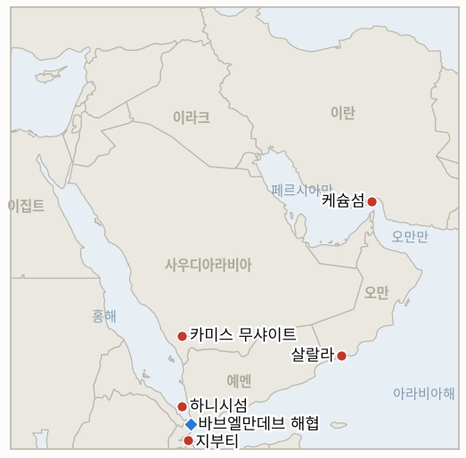

# 중동 일일 브리핑

**2026년 9월 16일**

- **보고 기간:** 약 24시간, 9월 15일 09:00 ~ 9월 16일 09:00 (한국시간)
- **종합 평가:** 화요일 창구에서는 외교가 두 개의 서로 다른 축에서 동시에 균열되는 모습이 나타났다. 바레인에 이어 사우디가 원인으로 지목됐던 살랄라 회담 무산은 이제 더 날카로운 원인이 드러났다. 사우디아라비아는 단순히 회담 시점이 아니라 이란과 오만이 마련한 초안 호르무즈 회랑 합의 자체를 거부한 것이었다. 이란 정부도 같은 날 공개적으로 분열했다. 페제시키안 대통령은 NPT 틀 안에서 핵협상에 열려 있다는 입장을 반복했지만, 레자에이 최고국가안보회의 사무총장은 테헤란의 조건이 충족될 때까지는 어떤 협상도 "끝까지" 거부한다고 못박았으며, 아라그치 외교장관은 트럼프·시진핑 정상회담을 일주일 앞둔 9월 16일 왕이 중국 외교담당 정치국원과의 회담을 위해 베이징으로 향할 예정이었다. 이는 테헤란이 워싱턴이 아닌 자체 강대국 채널로 무게중심을 옮기는 행보로 읽힌다. 예멘 전쟁에서도 나름의 균열이 발생했다. 후티는 하니시섬을 포함해 바브엘만데브 일대에서 추가 영토를 확보했다고 주장했으나 이는 아직 검증되지 않은 주장인 반면, 이들의 진격이 촉발한 난민 급증은 명확해졌다. 지부티는 48시간 동안 3,400명을 받아들였고 9월 초 이후 예멘 내 이재민은 8만 5천 명을 넘어섰으며, 사우디아라비아는 카미스 무샤이트 인근 킹칼리드 공군기지에 대한 후티의 미사일·드론 공격을 격퇴했다고 밝혔다. 유가는 상승세를 유지해 브렌트유가 107~108.5달러대에서 거래됐는데, 사우디 동서 송유관이 계속 멈춰 있고 호르무즈 상업 통항이 한 자릿수로 떨어진 가운데, 분석가들은 재가동이 없으면 사우디의 수출 가능 재고가 수일 내 소진될 수 있다고 경고했다. 코스피는 나흘 연속 하락세를 이어가며 0.85% 내린 6627.26으로 마감했는데, 연준의 FOMC 결정을 앞두고 美 10년물 국채 금리가 5%를 다시 돌파한 영향이며, 원화는 12.1원 약세인 1359.4원을 기록했다. 한국 자체의 호르무즈 파병 트랙도 계속 움직여, 제29차 한미통합국방협의체(KIDD)가 9월 16일부터 18일까지 부산에서 열리고 파병 관련 국가안전보장회의(NSC) 상임위 회의는 9월 17일경으로 예상된다. 이번 창구에서 지표 1건이 해소된다. 지부티를 향한 후티의 진격이 확인되고 가속화되는 난민 급증을 낳으면서 IND-20260914-2의 해소 조건을 충족한다.

---

## 1. 무슨 일이 있었나

<figure style="float:right; width:46%; margin:2pt 0 8pt 14pt;">

<figcaption style="font-size:8pt; color:#666; text-align:center; margin-top:3pt; font-style:italic;">주요 논의 지점</figcaption>
</figure>

### 1.1 외교 트랙의 균열: 살랄라는 사우디가 거부한 초안 탓에 좌초하고, 테헤란 지도부는 워싱턴 협상을 두고 분열하다

월요일 무산된 살랄라 회담에 대한 보다 상세한 보도는 그 원인이 단순한 일정 문제가 아니라 내용에 있었음을 보여준다. 사우디아라비아의 입장은 이란과 오만이 이미 작성한 호르무즈 회랑 및 기뢰 제거 합의 초안을 받아들일 수 없다는 것이었으며, 이는 바레인의 불참 선언과 이란 자체의 "거짓 구실" 프레이밍(사우디가 내세운 예멘 이유에 대한, 브리핑 2026-09-15 §1.1)에 더해진 구체적인 정책상의 이의였다([서울경제](https://en.sedaily.com/international/2026/09/15/gulf-iran-talks-abruptly-postponed-as-houthis-escalate); [더 내셔널](https://www.thenationalnews.com/news/gulf/2026/09/15/iran-dismisses-us-talks-as-hormuz-crisis-deepens/)). 리야드가 초안의 구체적으로 무엇에 반대했는지는 어느 쪽도 밝히지 않았다. 별도로, 이란 정부는 워싱턴과의 대화 여부 자체를 놓고 공개적으로 분열했다. 트럼프 대통령은 "실패한 국가 이란은 빠르고 절박하게 협상을 원한다"고 썼고, 페제시키안 대통령은 월요일 발언에서 미국이 제재를 해제하고 군사적 압박을 중단하면 NPT 틀 안에서 핵 프로그램을 논의할 용의가 있다는 입장을 반복했다. 그러나 몇 시간 뒤 레자에이 최고국가안보회의 사무총장은 "이란의 조건이 충족될 때까지 협상은 없다. 끝!"이라고 게시하며 테헤란에 트럼프의 "엇갈린 신호"를 무시하라고 말했다([디스 이즈 베이루트](https://thisisbeirut.com.lb/news/politics/trump-says-iran-wants-a-deal-quickly-and-badly); [이스라엘 내셔널 뉴스](https://www.israelnationalnews.com/news/433168)). 아라그치 외교장관은 9월 24일 트럼프·시진핑 정상회담을 일주일 앞둔 9월 16일 왕이 중국 측 카운터파트와 회담하기 위해 베이징으로 출국하는데, 이는 전쟁 이후 두 번째 중국 방문이다([블룸버그](https://www.bloomberg.com/news/articles/2026-09-15/iranian-fm-to-visit-china-for-second-time-since-war-started)). 이는 이란이 워싱턴을 향한 일관된 협상 입장을 도출할지, 아니면 강경파의 거부가 우세해 베이징이 실질 채널로 자리잡을지를 추적하는 신규 **IND-20260916-2**를 개설한다. **신뢰도: 중간-높음**, 살랄라 초안 거부 세부 사항과 페제시키안·레자에이 균열 (다수의 1~2급 매체, 직접 인용); **높음**, 아라그치의 중국 방문 (블룸버그, 중국 외교부 확인).

### 1.2 후티, 바브엘만데브 추가 영토 주장…지부티 난민 급증 명확해지고 사우디는 킹칼리드 공군기지 공격 격퇴 발표

후티 세력은 9월 14일 "하니시섬과 남부 홍해의 기타 영토를 장악해 바브엘만데브 해협에 대한 통제를 강화했다"고 주장했으나, 이는 아직 독립적인 해상보안 소식통(UKMTO, 클플러, JMIC)이 확인하지 않은 주장이다([서울경제](https://en.sedaily.com/international/2026/09/15/gulf-iran-talks-abruptly-postponed-as-houthis-escalate)). 이들의 전반적 진격이 낳은 이재민 문제는 더 이상 모호하지 않다. 지부티는 9월 15일까지 48시간 동안 3,400명 이상을 받아들였고, IOM 지부티 담당자 알렉상드르 쿠아사크는 "작은 다우선부터 대형 선박까지 온갖 종류의 선박"이 동원되고 있으며 "이 속도가 계속되면 감당할 수 없을 것"이라고 말했다. 일리아스 다왈레 재무장관은 이 속도를 "우리나라에 점점 더 어려운 상황"이라고 표현했고, 당국은 최대 1만 명의 유입에 대비하고 있다. 9월 초 이후 예멘 내에서 8만 5천 명 이상이 이재민이 됐다([알자지라](https://www.aljazeera.com/news/2026/9/15/thousands-flee-to-djibouti-amid-renewed-yemen-fighting)). 후티 세력은 또한 9월 14일 카미스 무샤이트 인근 사우디아라비아 킹칼리드 공군기지에 대한 "탄도미사일과 드론" 공격을 주장했는데, 이는 사우디 연합군이 자국 남부 국경에서 저지하고 있다고 밝힌 것과 같은 공세의 일환이다(브리핑 2026-09-15 §1.2). 이는 **IND-20260914-2**를 난민 급증 분기에서 확인시키며, 하니시섬 주장이 독립적으로 검증되거나 해상 대응을 촉발할지를 추적하는 신규 **IND-20260916-1**을 개설한다. **신뢰도: 높음**, 지부티 이재민 수치 (알자지라, IOM, 실명 관계자); **낮음**, 하니시섬 주장 (후티 단일 출처, 독립 확인 없음); **중간**, 킹칼리드 공군기지 공격 주장 (후티 발표, 이번 창구에서 독립적인 사우디 피해 평가 없음).

### 1.3 사우디 송유관 가동 중단 지속·호르무즈 통항 한 자릿수 급감 속 유가는 107달러 위에서 유지

화요일 브렌트유는 107~108.5달러대, WTI는 103달러대에서 거래되며 전날 상승세를 이어갔다. 사우디아라비아의 동서 송유관은 재가동 일정 없이 계속 멈춰 있었고, 호르무즈를 통한 상업 통항은 더 줄었다. 더 내셔널은 화요일 상품선박 통항 건수를 전쟁 이전 하루 평균 약 125건 대비 4건으로 집계한 반면, 별도 집계는 이날 전체 통항 건수를 직전 10일 평균의 약 절반인 7건 안팎으로 제시해, 호르무즈 통항 집계 기준이 매체별로 계속 엇갈린다는 이 대장(臺帳)의 기존 지적을 재확인시켰다([HDFC 스카이](https://hdfcsky.com/news/brent-crude-oil-price-today-september-15-2026-brent-crude-rises-to-107-wti-at-103-as-saudi-pipeline-outage-fuels-supply-fears); [CNBC](https://www.cnbc.com/2026/09/15/oil-extends-gains-following-houthi-strikes-on-saudi-arabia.html); [더 내셔널](https://www.thenationalnews.com/news/gulf/2026/09/15/iran-dismisses-us-talks-as-hormuz-crisis-deepens/)). 시장 보도가 인용한 분석가들은 송유관이 재가동되지 않으면 사우디아라비아가 수일 내 수출 가능 원유를 소진하기 시작할 수 있으며, 이것이 현실화되면 세계 원유 공급의 최대 4%가 감소하는 효과라고 설명했다([CNBC](https://www.cnbc.com/2026/09/15/oil-extends-gains-following-houthi-strikes-on-saudi-arabia.html)). 일요일 케슘섬 인근 이란 선박에 대한 원인 불명 피격(**IND-20260915-2**, 여전히 열림)에 대해서는 이번 창구에서 새로운 책임 소재가 나오지 않았다. **신뢰도: 높음**, 송유관 가동 중단 지속과 장중 유가 범위 (CNBC 등 다수 시장 매체, 수렴); **중간**, 구체적 통항 건수 (매체별 집계 기준 상이); **중간**, 수일 내 소진 경고 (사우디 측 공식 발표가 아닌 분석가 전망).

### 1.4 코스피 나흘 연속 하락…한국의 호르무즈 절차는 계속 진행

코스피는 57.11포인트(0.85%) 내린 6627.26으로 마감해 나흘 연속 하락세를 이어갔으며 해당 기간 누적 하락률은 약 6%에 달한다. 연준의 FOMC 결정을 앞두고 美 10년물 국채 금리가 5%를 다시 돌파했고 유가 상승이 겹쳤다. 외국인과 기관은 합계 2조 4천억 원을 순매도했고, 지수는 장중 고점 6715.46까지 올랐다가 오후 차익 실현 매물에 6627.26으로 마감했으며, 코스닥은 사이버보안·바이오 강세로 0.70% 상승하며 디커플링을 보였다([한경](https://www.hankyung.com/article/2026091561476); [핀포인트뉴스](https://www.pinpointnews.co.kr/news/articleView.html?idxno=487298); [파이어뱃](https://firebat.co.kr/stock-blog/20260915-close)). 원화는 12.1원 약세인 1359.4원으로 마감했다. 한편 한국의 호르무즈 파병 절차는 별개 트랙에서 계속 진행됐다. 제29차 한미통합국방협의체(KIDD)가 9월 16일부터 18일까지 부산에서 열려 전작권 전환, 연합방위태세, 조선 협력과 함께 호르무즈 문제를 논의하며, UAE 현지조사단의 결과를 검토할 국가안전보장회의 상임위 회의는 9월 17일경으로 예상된다. 다만 국회 국방위원장 진성준 의원은 파병에 대한 반대 기류가 여당 내부에도 상당히 깊다고 재확인했다([아시아투데이](https://www.asiatoday.co.kr/kn/view.php?key=20260915010005341)). **신뢰도: 높음**, 코스피·원화 마감과 FOMC·금리 요인 (다수 한국 금융 매체); **중간-높음**, KIDD 일정과 NSC 시점 (아시아투데이, 기존 보도와 일치).

---

## 2. 심층 분석: 동기와 유인

### 2.1 테헤란의 안보 기구는 왜 지금 페제시키안 대통령의 핵협상 개방론을 공개적으로 뒤집는가, 일관된 입장을 내놓지 않고?

선출직 대통령실이 아니라 레자에이의 최고국가안보회의가 이란의 권력 구조상 안보와 연계된 협상에 대해 최종 발언권을 쥐고 있고, 공개적인 반박은 강경파에게 거의 비용이 들지 않는 반면 워싱턴에는 명확한 행동 신호를 주지 않기 때문이다. 페제시키안의 NPT 틀 개방론을 이의 없이 놔두면 트럼프가 이를 양보가 아니라 추가 압박으로 시험해볼 만한 틈으로 받아들일 위험이 있다. 그래서 레자에이의 단호한 거부는 대통령 자신의 외교 신호를 같은 날 무력화하면서도 이란의 협상 입장 아래에 최저선을 까는 기능을 한다.

### 2.2 사우디아라비아는 왜 이란과 오만이 이미 마련한 호르무즈 회랑 초안을 이제 와서 거부하는가, 더 일찍 이의를 제기하지 않고?

리야드의 전적인 동의 없이 초안이 확정되면, 오만이 중재했다 하더라도 이란과 오만이 해협 관리의 공동 관리권을 주장할 수 있게 되는 반면, 나즈란·지잔 국경의 실제 교전과 에너지 인프라에 대한 반복적 공격이라는 사우디 자체의 안보 노출은 그 합의로 해결되지 않는다. 더 일찍이 아니라 마지막 단계에서 초안을 거부하는 것은, 일단 서명한 뒤 공개적으로 파기해야 하는 상황을 피하면서 리야드가 틀을 다시 짜거나 지연시킬 수 있는 레버리지를 보존해준다.

### 2.3 후티는 왜 자신들의 진격이 국제적 주목을 받는 난민 위기를 낳는 와중에도 추가적인 바브엘만데브 영토 주장을 밀어붙이는가?

전시(戰時) 영토 주장과 난민 위기는 서로 다른 청중을 겨냥하기 때문이다. 하니시섬과 바브엘만데브 회랑 전반에 대한 주장은 국내외 후원 세력에게 공세의 추진력이 꺾이지 않았음을 입증하려는 것인 반면, 난민 유출은 후티가 자신들의 책임으로 내재화하려는 기색을 거의 보이지 않는 비용이다. 이는 이 대장이 지속적으로 관찰해온 패턴, 즉 후티가 진격이 낳는 인도적 피해보다 영토·해상 레버리지를 우선시하는 패턴과 일치한다.

### 2.4 호르무즈 재개방이 아니라 사우디 송유관 가동 중단이 왜 이번 주 원유 시장에 더 즉각적인 공급 위협으로 보이는가?

동서 송유관은 이란의 봉쇄에 대한 사우디아라비아의 구조적 우회로로, 폐쇄된 해협 대신 걸프 쪽 원유를 홍해 선적으로 돌리는 역할을 해왔기 때문에, 그 자체의 가동 중단은 더 넓은 호르무즈 위기 속에서도 리야드의 수출을 지탱해온 헤지 수단을 제거하는 것이다. 해협과 그 우회로가 동시에 제약을 받으면서 시장은 대체 가능한 위험이 아니라 중첩되는 위험을 가격에 반영하고 있으며, 이것이 분석가들이 호르무즈 단독 국면을 특징지었던 수주 단위 시간표 대신 이제 수일 단위 소진 창구를 언급하는 이유다.

---

## 3. 한국에 대한 정책적 함의

**노출 스냅샷:** 한국의 원유 수입은 여전히 약 70%가 호르무즈 해협 통과에 의존하며, LNG 수입의 약 36%가 중동산으로 카타르 라스라판이 단일 최대 LNG 공급 노출처다(`instructions/korea-exposure.md` 참조, 2026년 8월 14일 최종 업데이트). 후티의 진격 전선에서 약 20마일 떨어진 지점에서 바브엘만데브를 통과하는 한국의 얀부 홍해 우회로는 §1.2에서 다룬 영토 주장에 직접 노출돼 있다. 화요일 코스피 종가 6627.26(-0.85%)은 나흘 연속 하락세를 이어가며 해당 기간 지수가 약 6% 하락했고, 원화 종가 1359.4원은 이 대장의 최근 기록 중 가장 약한 수준이지만, 한국 금융 매체는 이를 전쟁 요인만이 아니라 중동·미 금리·FOMC 시점이 뒤섞인 결과로 설명한다.

**전개별 함의:**

- **두 갈래로 균열된 외교 트랙(§1.1):** 사우디가 거부한 호르무즈 초안과 분열된 이란 지도부 모두 해협 관리 체제의 조기 재개를 임박한 것으로 읽지 말아야 한다는 근거이며, 산업통상자원부와 한국 정유사는 워싱턴 관여 여부를 둘러싼 이란 내부의 이견까지 더해진 만큼 연장된 불확실성 구간을 계속 상정해야 한다.
- **지부티 난민 급증과 하니시섬 주장(§1.2):** 지부티를 향한 확인되고 가속화되는 이재민 흐름은 한국의 얀부/바브엘만데브 우회로를 해소된 위험이 아니라 현재진행형 위험으로 다뤄야 한다는 근거를 강화하며, 아직 검증되지 않은 하니시섬 주장이 확인될 경우 그 위험은 한국행 화물이 통과하는 남부 홍해 항로로 더 확장될 수 있다.
- **사우디 송유관 가동 중단과 호르무즈 통항 급감(§1.3):** 리야드 자체의 우회로마저 제약을 받고 분석가들이 수일 단위 소진 창구를 언급하는 상황에서, 산업통상자원부 공급 계획에 내재된 유가 하한선은 신속한 송유관 재가동으로 완화되기보다 현재의 고유가 범위가 지속된다는 전제를 유지해야 한다.
- **코스피 나흘째 하락과 한국 자체의 파병 절차(§1.4):** 부산 KIDD 회담(9월 16~18일)과 9월 17일경 예상되는 NSC 회의는 국회 파병 동의안을 향한 가장 가까운 구체적 단계이며, 이 절차는 평온한 여건이 아니라 유가·미 금리·FOMC 시점 압력이 중첩되는 국내 시장 배경 속에서 진행되고 있다.

**시험 가능한 지표:**

- **IND-20260916-1** (신규): 후티의 하니시섬 및 바브엘만데브 추가 영토 점령 주장이 독립적으로 검증된 해상 항로 영향과 함께 확인되는지, 아니면 후티 단일 출처의 미확인 주장으로 남는지. 시한 ~2026-09-30.
- **IND-20260916-2** (신규): 미국과의 관여를 둘러싼 이란의 내부 분열(페제시키안의 NPT 틀 개방론 대 레자에이의 전면 거부)이 워싱턴을 향한 일관된 협상 입장이나 채널로 귀결되는지, 아니면 강경파의 거부가 우세해 아라그치의 베이징 우선 외교가 실질 채널로 자리잡고 美-이란 채널이 재개되지 않는지. 시한 ~2026-09-30.
- **IND-20260914-2** (해소, 확인): 지부티를 향한 후티의 진격이 명확한 추가 난민 급증(48시간 3,400명, 9월 1일 이후 8만 5천 명 이상, IOM 기록)을 낳으며 이 지표의 해소 조건을 충족한다.
- **IND-20260915-1** (열림): 무산된 살랄라 브리핑이 걸프 국가들과 재개되는지, 이란이 오만과 양자로 진행하는지; 사우디의 구체적인 초안 거부(§1.1)는 해소가 아니라 추가적인 복잡 요인이다. 시한 ~2026-09-29.
- **IND-20260915-2** (열림): 케슘 호르무즈 해협 치명적 선박 피격; 이번 창구에서 책임 소재, 보복, 추가 공격 모두 확인되지 않음. 시한 ~2026-09-29.
- **IND-20260915-3** (열림): 파이살 왕자의 브릭스 긴장완화 촉구; 이번 창구의 전개(하니시 주장, 킹칼리드 공군기지 공격 주장)는 구체적 외교 이니셔티브보다는 군사적 트랙이 계속 확대되는 쪽을 가리키지만, ~09-29 시한에는 아직 도달하지 않음. 시한 ~2026-09-29.
- **IND-20260914-3** (열림): 알리 타헤르 능선 민간인 피해가 국제인도법 차원의 대응을 이끌어낼지; 이번 창구에서 확인되지 않음. 시한 ~2026-09-28.
- **IND-20260913-1** (열림): 트럼프의 사우디 송유관 공격 이란 배후 주장이 확인될지; 이번 창구에서도 여전히 미확인. 시한 ~2026-09-27.
- **IND-20260911-3** (열림): 한국의 NSC 검토; 부산 KIDD 회담(9월 16~18일)과 9월 17일경 예상 NSC 회의가 지금까지 가장 구체적인 절차적 진전. 시한 ~2026-09-24.
- **IND-20260906-2** (열림): 한국의 정식 국회 파병 동의안; 이번 창구까지 동의안 제출 없음, 여당 내부에서도 파병 반대 기류가 보고됨. 시한 ~2026-09-28.

---

## 4. 주시 목록

- **이란의 내부 외교 분열(IND-20260916-2):** 페제시키안의 개방론과 레자에이의 거부론 중 무엇이 테헤란의 실제 입장을 규정할지.
- **하니시섬 주장(IND-20260916-1):** 후티의 영토 확보가 홍해 항로로 더 확대되는지 가늠할 가장 가까운 시험대.
- **사우디아라비아의 송유관 재가동 일정(§1.3):** 분석가들이 언급하는 수일 단위 소진 창구가 가장 가까운 구체적 원유 공급 시험대.
- **한국의 9월 17일 NSC 회의와 부산 KIDD 회담(IND-20260911-3):** 9월 28일 국회 시한을 앞둔 가장 가까운 절차적 신호.
- **재개될 살랄라/오만 체제(IND-20260915-1):** 이제 사우디의 구체적 초안 거부로 더 복잡해진 상태.
- **피켁스산(IND-20260905-1):** 이번 창구까지도 타격받지 않음; 시한 ~09-18.
- **벤 그비르의 "분리 710" 계획(IND-20260904-2):** 여전히 확인된 수용국 관심 없음; 시한 ~09-18.
- **라스라판 카타르 LNG 선적(IND-20260714-4):** 여전히 최신 주간 선적 수치 없음; 이 대장에서 가장 오래 미해결 상태인 지표.

---

## 5. 출처 품질 요약

| 주장 | 출처 | 신뢰도 |
|---|---|---|
| 살랄라 무산의 보다 완전한 원인: 사우디아라비아가 이란·오만 초안 호르무즈 회랑 합의 자체를 거부 | 서울경제, 더 내셔널 (1~2급) | 중간-높음 |
| 이란 지도부의 공개 분열: 페제시키안의 NPT 틀 개방론 대 레자에이의 "협상 없음" 거부; 트럼프의 "빠르고 절박하게" 발언 | 디스 이즈 베이루트, 이스라엘 내셔널 뉴스, 다수 매체의 트럼프 발언 보도 (1~2급) | 중간-높음 |
| 아라그치, 9월 16일 왕이와의 회담을 위해 베이징 방문, 전쟁 이후 두 번째 중국 방문 | 블룸버그, 중국 외교부 확인 (1급) | 높음 |
| 후티, 하니시섬 및 바브엘만데브 추가 영토 점령 주장 | 서울경제, 후티 군사 성명 인용 (2급, 단일 출처, 미확인) | 낮음 |
| 지부티 난민 급증: 48시간 3,400명 유입, 9월 1일 이후 예멘 내 8만 5천 명 이상 이재민 | 알자지라, IOM 지부티 담당자, 지부티 재무장관 (1급) | 높음 |
| 사우디아라비아, 카미스 무샤이트 인근 킹칼리드 공군기지에 대한 후티 공격 주장 격퇴 | 서울경제, 후티 성명 인용 (2급, 독립적인 사우디 피해 평가 없음) | 중간 |
| 유가 브렌트 107~108.5달러·WTI 약 103달러 유지; 사우디 송유관 가동 중단 지속; 호르무즈 통항 하루 4~7건으로 급감 | CNBC, HDFC 스카이, 더 내셔널 (1~2급, 범위는 수렴하나 통항 집계 기준은 상이) | 중간-높음 |
| 코스피 -0.85% 6627.26 마감, 나흘 연속 하락; 원화 10년물 금리·FOMC 앞두고 1359.4원 약세 | 한경, 핀포인트뉴스, 파이어뱃, 머니투데이 (1~2급 한국 금융 매체) | 높음 |
| 한국의 호르무즈 파병 관련 KIDD 회담(9월 16~18일, 부산)과 NSC 회의(9월 17일경) | 아시아투데이 (2급) | 중간-높음 |
