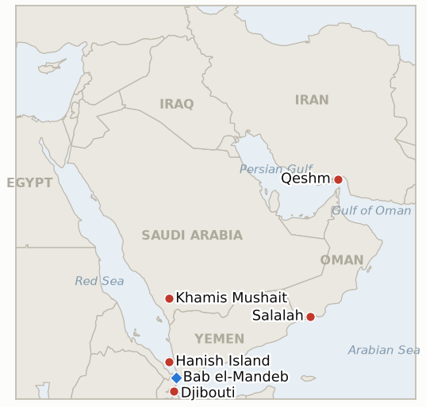

# Middle East Daily Briefing

**September 16, 2026**

- **Reporting window:** ~24 hours, September 15, 09:00 to September 16, 09:00 KST
- **Overall assessment:** Tuesday's window showed diplomacy fracturing on two separate axes at once. The Salalah talks' collapse, already tracked as a Bahrain-then-Saudi-attributed postponement, now has a sharper cause: Saudi Arabia specifically rejected the draft Hormuz corridor arrangement Iran and Oman had prepared, not merely the meeting's timing. Iran's own government split publicly the same day, with President Pezeshkian repeating an NPT-framework openness to nuclear talks while Supreme National Security Council Secretary Mohsen Rezaei flatly rejected any negotiation until Tehran's conditions are met, "period," as Foreign Minister Araghchi prepared to fly to Beijing on September 16 for talks with Wang Yi a week ahead of the Trump-Xi summit, an itinerary that reads as Tehran hedging toward its own great-power channel rather than Washington's. Yemen's war produced its own fracture: the Houthis claimed further Bab el-Mandeb-area territorial gains, including Hanish Island, an unverified claim so far, even as the refugee surge their advance has triggered became unambiguous, with Djibouti receiving 3,400 arrivals in 48 hours atop more than 85,000 people displaced inside Yemen since the start of September, and Saudi Arabia reported repelling a Houthi missile-and-drone attack on King Khalid Air Base near Khamis Mushait. Oil held its gains, Brent trading near $107 to $108.5 as Saudi Arabia's East-West pipeline stayed offline and Hormuz commercial transits fell to single digits, with analysts flagging Riyadh's exportable stock could run out within days without a restart. KOSPI extended its losing streak to a fourth session, closing down 0.85% at 6627.26 as the 10-year US Treasury yield broke back above 5% ahead of the Fed's FOMC decision, and the won weakened 12.1 won to 1359.4; Korea's own Hormuz deployment track kept moving, with the 29th Korea-US Integrated Defense Dialogue set for September 16 to 18 in Busan and a National Security Council session on the deployment expected around September 17. One indicator resolves this window: the Houthi advance toward Djibouti's confirmed, accelerating refugee surge meets IND-20260914-2's resolution condition.

---

## 1. What Happened

<figure style="float:right; width:46%; margin:2pt 0 8pt 14pt;">

<figcaption style="font-size:8pt; color:#666; text-align:center; margin-top:3pt; font-style:italic;">Major places of discussion</figcaption>
</figure>

### 1.1 Diplomatic Tracks Fracture: Salalah Stalls on a Saudi-Rejected Draft as Tehran's Own Leadership Splits Over Washington Talks

Fuller reporting on Monday's postponed Salalah meeting locates the cause in substance rather than only scheduling: Saudi Arabia's position was that it could not accept a draft Hormuz corridor and demining arrangement that Iran and Oman had already drawn up, a specific policy objection layered on top of Bahrain's boycott and Iran's own "false pretext" framing of Riyadh's stated Yemen rationale (§1.1, brief 2026-09-15) ([Seoul Economic Daily](https://en.sedaily.com/international/2026/09/15/gulf-iran-talks-abruptly-postponed-as-houthis-escalate); [The National](https://www.thenationalnews.com/news/gulf/2026/09/15/iran-dismisses-us-talks-as-hormuz-crisis-deepens/)). No party has detailed what in the draft Riyadh objected to. Separately, Iran's own government split publicly on the question of talking to Washington at all: President Trump wrote that "the failing Nation of Iran wants to make a deal, quickly and badly," while President Pezeshkian, speaking Monday, repeated Tehran is willing to discuss its nuclear program within an NPT framework if the US lifts sanctions and ends military pressure; hours later, Supreme National Security Council Secretary Mohsen Rezaei posted "No talks until Iran's conditions are met. Period!", telling Tehran to disregard Trump's "conflicting signals" ([This Is Beirut](https://thisisbeirut.com.lb/news/politics/trump-says-iran-wants-a-deal-quickly-and-badly); [Israel National News](https://www.israelnationalnews.com/news/433168)). Foreign Minister Araghchi departs for Beijing on September 16 to meet Chinese counterpart Wang Yi, his second wartime China visit, a week before the September 24 Trump-Xi summit ([Bloomberg](https://www.bloomberg.com/news/articles/2026-09-15/iranian-fm-to-visit-china-for-second-time-since-war-started)). This opens new **IND-20260916-2** on whether a coherent Iranian negotiating position toward Washington emerges or the hardline rejection prevails with Beijing as the operative channel instead. **Confidence: Medium-High** on the Salalah draft-rejection detail and the Pezeshkian/Rezaei split (multiple Tier 1-2 outlets, direct quotes); **High** on the Araghchi China trip (Bloomberg, Chinese Foreign Ministry confirmation).

### 1.2 Houthis Claim Further Bab el-Mandeb Territory as Djibouti's Refugee Surge Turns Unambiguous and Saudi Arabia Reports Repelling a King Khalid Air Base Attack

Houthi forces claimed on September 14 to have "strengthened control over the Bab el-Mandeb Strait by seizing Hanish Island and other territory in the southern Red Sea," an assertion no independent maritime security source (UKMTO, Kpler, JMIC) has yet corroborated ([Seoul Economic Daily](https://en.sedaily.com/international/2026/09/15/gulf-iran-talks-abruptly-postponed-as-houthis-escalate)). The displacement their broader advance has produced is no longer ambiguous: Djibouti received more than 3,400 arrivals in the 48 hours to September 15, IOM Djibouti director Alexandre Coissac saying "all kinds of sea vessels, from small dhows to larger ships" are being used and "if it continues at this rate, we'll not be able to manage," while Finance Minister Ilyas Dawaleh called the pace "increasingly difficult for our country" and authorities are preparing for up to 10,000 arrivals; more than 85,000 people have been displaced inside Yemen since the start of September ([Al Jazeera](https://www.aljazeera.com/news/2026/9/15/thousands-flee-to-djibouti-amid-renewed-yemen-fighting)). Houthi forces also claimed a "ballistic missiles and drones" attack on Saudi Arabia's King Khalid Air Base near Khamis Mushait on September 14, part of the same offensive Saudi Arabia's coalition says it is containing on its own southern border (§1.2, brief 2026-09-15). This confirms **IND-20260914-2** on its refugee-surge branch, and opens new **IND-20260916-1** to track whether the Hanish Island claim draws independent corroboration or a shipping-lane response. **Confidence: High** on the Djibouti displacement figures (Al Jazeera, IOM, named officials); **Low** on the Hanish Island claim (single Houthi-sourced statement, no independent confirmation); **Medium** on the King Khalid Air Base attack claim (Houthi statement, no independent Saudi damage assessment located this window).

### 1.3 Oil Holds Above 107 Dollars as Saudi Pipeline Stays Offline and Hormuz Transits Crater to Single Digits

Brent traded near $107 to $108.5 and WTI near $103 on Tuesday, extending Monday's gains, as Saudi Arabia's East-West pipeline remained shut with no restart date and commercial shipping through Hormuz fell further: The National put Tuesday's commodity-vessel transit count at four against a pre-war average of roughly 125 a day, while a separate count put the broader daily figure near seven, roughly half the preceding ten-day average, underscoring this ledger's standing note that Hormuz transit counting bases still diverge across outlets ([HDFC Sky](https://hdfcsky.com/news/brent-crude-oil-price-today-september-15-2026-brent-crude-rises-to-107-wti-at-103-as-saudi-pipeline-outage-fuels-supply-fears); [CNBC](https://www.cnbc.com/2026/09/15/oil-extends-gains-following-houthi-strikes-on-saudi-arabia.html); [The National](https://www.thenationalnews.com/news/gulf/2026/09/15/iran-dismisses-us-talks-as-hormuz-crisis-deepens/)). Analysts cited by market reporting said Saudi Arabia could begin exhausting exportable crude within days absent a pipeline restart, a threat framed as removing up to 4% of global oil supply were it to materialize ([CNBC](https://www.cnbc.com/2026/09/15/oil-extends-gains-following-houthi-strikes-on-saudi-arabia.html)). No new attribution emerged this window for Sunday's fatal, unattributed strike on the Iranian vessel off Qeshm Island (**IND-20260915-2**, still open). **Confidence: High** on the pipeline outage's persistence and the intraday oil range (CNBC, multiple market outlets, converging); **Medium** on the specific transit counts given the outlets' diverging bases; **Medium** on the days-to-exhaustion warning, an analyst projection rather than a confirmed Saudi disclosure.

### 1.4 KOSPI's Losing Streak Reaches a Fourth Session as Korea's Own Hormuz Process Advances

KOSPI fell 57.11 points (0.85%) to 6627.26, its fourth consecutive losing session and roughly a 6% cumulative decline over that stretch, as the 10-year US Treasury yield broke back above 5% and oil's climb compounded ahead of the Fed's FOMC decision; foreign and institutional investors sold a combined 2.4 trillion won, and the index swung from an intraday high of 6715.46 down to 6627.26 on afternoon profit-taking, while KOSDAQ decoupled, rising 0.70% on cybersecurity and biotech strength ([Hankyung](https://www.hankyung.com/article/2026091561476); [Pinpoint News](https://www.pinpointnews.co.kr/news/articleView.html?idxno=487298); [Firebat](https://firebat.co.kr/stock-blog/20260915-close)). The won weakened 12.1 won to 1359.4. Separately, South Korea's Hormuz deployment process kept advancing on its own track: the 29th Korea-US Integrated Defense Dialogue (KIDD) convenes September 16 to 18 in Busan, covering wartime OPCON transfer, combined defense posture and shipbuilding cooperation alongside the Hormuz question, and a National Security Council standing committee session is expected around September 17 to weigh the UAE assessment team's findings, though National Assembly Defense Committee chair Jin Sung-joon reiterated that opposition to deployment runs deep within the ruling party itself ([Asia Today](https://www.asiatoday.co.kr/kn/view.php?key=20260915010005341)). **Confidence: High** on the KOSPI/won closes and their FOMC/yield attribution (multiple Korean financial outlets); **Medium-High** on the KIDD schedule and NSC timing (Asia Today, consistent with prior reporting).

---

## 2. Deep Dive: Incentives and Motives

### 2.1 Why is Tehran's security establishment publicly overriding President Pezeshkian's opening to nuclear talks, rather than presenting a unified position?

Because Rezaei's Supreme National Security Council, not the elected presidency, holds the final word on security-linked negotiations in Iran's power structure, and a public rebuke costs the hardline faction little while denying Washington a clean signal to act on; letting Pezeshkian's NPT-framed openness stand unchallenged risks Trump treating it as an opening worth testing with further pressure rather than concessions, so Rezaei's flat rejection functions as a floor under Iran's bargaining position even as it undercuts the president's own diplomatic signal the same day.

### 2.2 Why would Saudi Arabia reject a Hormuz corridor draft that Iran and Oman had already prepared, rather than raising objections earlier in the process?

Because a draft finalized without Riyadh's full sign-off, even one Oman brokered, would let Iran and Oman claim joint custodianship of strait management while Saudi Arabia's own security exposure, active fighting on its Najran-Jizan border and repeated strikes on its energy infrastructure, stays unaddressed by the arrangement; rejecting the draft at the last stage, rather than earlier, preserves Riyadh's leverage to reshape or delay a framework it would otherwise have to publicly disown after signing.

### 2.3 Why are the Houthis pressing a further Bab el-Mandeb territorial claim even as their own advance drives a refugee crisis drawing direct international attention?

Because a wartime territorial claim and a refugee crisis serve different Houthi audiences: Hanish Island and the wider Bab el-Mandeb corridor are being asserted to domestic and regional backers as proof the offensive's momentum has not stalled, while the refugee outflow is a cost the Houthis have shown little sign of internalizing as their own responsibility, consistent with this ledger's pattern of the group prioritizing territorial and shipping-lane leverage over the humanitarian toll of the advance producing it.

### 2.4 Why does the Saudi pipeline outage, not a Hormuz reopening, look like the more immediate supply threat to oil markets this week?

Because the East-West pipeline was Saudi Arabia's structural workaround for the Iranian blockade, redirecting Gulf-side crude to Red Sea loading rather than the closed strait, so its own outage removes the hedge that had been holding Riyadh's exports steady through the broader Hormuz crisis; with both the strait and its bypass constrained at once, the market is pricing a compounding rather than a substitutable risk, which is why analysts are now citing a days-scale exhaustion window rather than the weeks-scale timelines that characterized the Hormuz-only phase of the crisis.

---

## 3. Policy Implications for South Korea

**Exposure snapshot:** South Korea's crude imports remain roughly 70% dependent on Strait of Hormuz transit and about 36% of its LNG imports come from the Middle East, with Qatar's Ras Laffan as the single largest LNG supplier exposure (see `instructions/korea-exposure.md`, last updated August 14, 2026). Korea's Yanbu Red Sea workaround, which transits Bab el-Mandeb roughly 20 miles from the Houthis' advancing front, stays directly exposed to the territorial claims tracked in §1.2. Tuesday's KOSPI close of 6627.26 (-0.85%) extends a fourth straight losing session with the index down roughly 6% over that stretch, and the won's 1359.4 close is its weakest level logged in this ledger's recent run, though Korean financial media attribute the move to a mix of Middle East, US rate and FOMC-timing drivers rather than the war alone.

**Implications by development:**

- **Diplomatic tracks fracturing on two fronts (§1.1):** A Saudi-rejected Hormuz draft and a split Iranian leadership both argue against reading any near-term reopening of the strait's management framework as imminent; MOTIE and Korean refiners should continue planning around an extended uncertainty window, now compounded by Iran's own internal disagreement over whether to engage Washington at all.
- **The Djibouti refugee surge and Hanish Island claim (§1.2):** The confirmed, accelerating displacement toward Djibouti reinforces the case for treating Korea's Yanbu/Bab el-Mandeb workaround as a live rather than settled risk; the unverified Hanish Island claim, if corroborated, would extend that risk further into the southern Red Sea shipping lanes Korean-bound cargo transits.
- **The Saudi pipeline outage and cratering Hormuz transits (§1.3):** With Riyadh's own bypass now constrained and analysts flagging a days-scale exhaustion window, the oil-price floor built into MOTIE's supply planning should assume the current elevated range persists rather than easing on a quick pipeline restart.
- **KOSPI's fourth losing session and Korea's own deployment process (§1.4):** The Busan KIDD talks (September 16 to 18) and an NSC session expected around September 17 mark the nearest concrete steps toward a National Assembly deployment motion, a process now proceeding against a domestic market backdrop of compounding oil, Fed-rate and FOMC-timing pressure rather than calm conditions.

**Testable indicators:**

- **IND-20260916-1** (new): The Houthis' claimed seizure of Hanish Island and further Bab el-Mandeb territory either draws independent corroboration (UKMTO, Kpler, a foreign government) with a verified shipping-lane implication, or stays an uncorroborated Houthi-source-only claim. Deadline ~2026-09-30.
- **IND-20260916-2** (new): Iran's internal split over US engagement (Pezeshkian's NPT-framed openness vs. Rezaei's flat rejection) either resolves into a coherent negotiating position or channel toward Washington, or the hardline rejection prevails with Araghchi's Beijing-first diplomacy standing as the operative track and no US-Iran channel reopening. Deadline ~2026-09-30.
- **IND-20260914-2** (resolved, confirmed): The Houthi advance toward Djibouti has produced a clear further refugee surge (3,400 in 48 hours, 85,000-plus displaced since September 1, IOM-documented), meeting this indicator's resolution condition.
- **IND-20260915-1** (open): The postponed Salalah briefing either reconvenes with Gulf states or Iran proceeds bilaterally with Oman; Saudi Arabia's specific draft rejection (§1.1) is a further complication rather than a resolution. Deadline ~2026-09-29.
- **IND-20260915-2** (open): The fatal Qeshm Strait of Hormuz vessel strike; no attribution, retaliation or further attack found this window. Deadline ~2026-09-29.
- **IND-20260915-3** (open): Prince Faisal's BRICS de-escalation call; the window's developments (Hanish claim, King Khalid Air Base attack claim) point toward the military tracks continuing to widen rather than a concrete diplomatic initiative, though the ~09-29 deadline has not yet been reached. Deadline ~2026-09-29.
- **IND-20260914-3** (open): Whether the Ali Taher Ridge toll draws a distinct humanitarian-law response; none found this window. Deadline ~2026-09-28.
- **IND-20260913-1** (open): Whether Trump's claim Iran was behind the Saudi pipeline attack gets corroborated; still unconfirmed this window. Deadline ~2026-09-27.
- **IND-20260911-3** (open): Korea's NSC review; the Busan KIDD talks (Sept 16-18) and an NSC session expected ~Sept 17 mark the nearest concrete procedural steps yet. Deadline ~2026-09-24.
- **IND-20260906-2** (open): Korea's formal National Assembly deployment motion; still no motion filed as of this window, with deployment opposition reported inside the ruling party itself. Deadline ~2026-09-28.

---

## 4. Watch List

- **Iran's internal diplomatic split (IND-20260916-2):** whether Pezeshkian's opening or Rezaei's rejection defines Tehran's actual posture toward Washington.
- **The Hanish Island claim (IND-20260916-1):** the nearest test of whether Houthi territorial gains are extending further into Red Sea shipping lanes.
- **Saudi Arabia's pipeline restart timeline (§1.3):** the days-scale exhaustion window analysts are now citing makes this the nearest concrete oil-supply test.
- **South Korea's September 17 NSC session and Busan KIDD talks (IND-20260911-3):** the nearest procedural signal ahead of the September 28 Assembly deadline.
- **A rescheduled Salalah/Oman framework (IND-20260915-1):** now complicated by Saudi Arabia's specific draft rejection.
- **Pickaxe Mountain (IND-20260905-1):** still not struck as of this window; deadline ~09-18.
- **Ben Gvir's Disengagement 710 plan (IND-20260904-2):** still no confirmed host-country interest; deadline ~09-18.
- **Qatari LNG loadings at Ras Laffan (IND-20260714-4):** still no fresh weekly loading figure; the ledger's longest-running unresolved indicator.

---

## 5. Source Quality Summary

| Claim | Sources | Confidence |
|---|---|---|
| Salalah postponement's fuller cause: Saudi Arabia rejected the Iran-Oman draft Hormuz corridor deal itself | Seoul Economic Daily, The National (Tier 1-2) | Medium-High |
| Iran's leadership splits publicly: Pezeshkian's NPT-framed openness vs. Rezaei's "no talks" rejection; Trump's "quickly and badly" claim | This Is Beirut, Israel National News, multi-outlet Trump statement coverage (Tier 1-2) | Medium-High |
| Araghchi to visit Beijing September 16 for talks with Wang Yi, second wartime China visit | Bloomberg, Chinese Foreign Ministry confirmation (Tier 1) | High |
| Houthis claim seizure of Hanish Island and further Bab el-Mandeb territory | Seoul Economic Daily, citing Houthi military statement (Tier 2, single-source, uncorroborated) | Low |
| Djibouti refugee surge: 3,400 arrivals in 48 hours, 85,000-plus displaced inside Yemen since September 1 | Al Jazeera, IOM Djibouti director, Djiboutian Finance Minister (Tier 1) | High |
| Saudi Arabia repels Houthi King Khalid Air Base attack claim near Khamis Mushait | Seoul Economic Daily, citing Houthi statement (Tier 2, no independent Saudi damage assessment) | Medium |
| Oil holds $107-108.5 (Brent) and ~$103 (WTI); Saudi pipeline outage persists; Hormuz transits crater to 4-7/day | CNBC, HDFC Sky, The National (Tier 1-2, converging on range, diverging on transit count basis) | Medium-High |
| KOSPI closes -0.85% at 6627.26, fourth straight losing session; won weakens to 1359.4 on 10-year yield and FOMC eve | Hankyung, Pinpoint News, Firebat, Money Today (Tier 1-2 Korean financial press) | High |
| Korea's KIDD talks (Sept 16-18, Busan) and NSC session (~Sept 17) on Hormuz deployment | Asia Today (Tier 2) | Medium-High |

