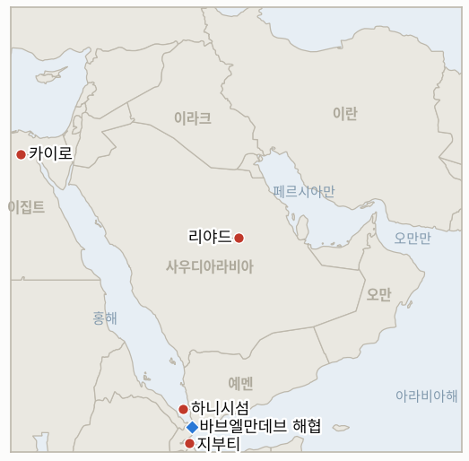

# 중동 일일 브리핑

**2026년 9월 17일**

- **보고 기간:** 약 24시간, 9월 16일 09:00 ~ 9월 17일 09:00 (한국시간)
- **종합 평가:** 화요일 보고 기간 동안 사우디아라비아는 예멘 현지 상황이 자국에 불리하게 굳어지는 가운데서도 성명 단계를 넘어 연대 구축으로 움직였다. 무함마드 빈 살만 왕세자는 카이로를 방문해 엘시시 대통령의 홍해·바브엘만데브 안보 지지를 확보했는데, 이는 워싱턴이 후티에 대한 직접 타격 요청을 거부했다고 알려진 데 대한 리야드의 보완책으로 읽힌다(§2.1). 같은 시점에 복수의 독립 매체가 후티 측 발표뿐 아니라 정부 관계자를 인용해 9월 14일 후티의 대·소 하니시섬 점령을 확증하면서, 지표 IND-20260916-1은 확증 요건 부분에서 해소되었다. 이 공세가 낳은 인도적 피해는 계속 확대되어, 지부티는 지난 목요일 이후 2,500명 이상의 추가 입국을 보고했고 예멘 국내실향민은 UNHCR 집계로 10만 명을 넘어서며 지부티가 밝힌 수용 한계를 압박하고 있다. 유가는 다소 뜻밖의 흐름을 보였다. 예상치 못한 미국 원유 재고 증가가 여전히 미해결인 사우디 송유관 가동 중단보다 크게 작용하며 브렌트유와 WTI 모두 2.5% 넘게 하락했고, 크리스 라이트 미 에너지장관이 공개적으로 예고한 "며칠 내" 복구 시점은 여전히 심각한 펌프장 손상을 보여주는 위성사진과 배치되어, 이 간극은 새 지표 IND-20260917-2로 추적된다. 코스피 역시 반전을 이뤄 연방준비제도의 금리 인상 우려 완화와 삼성전자·SK하이닉스 주도의 반도체 랠리에 힘입어 1.37% 상승, 4거래일 연속 하락세를 마감했으나, 원화는 유가발 압력 속에 계속 약세를 보였고 장금상선의 호르무즈 리스크 성향을 다루는 지표 하나가 마감일에 반증되었다. 이 한국 해운사의 VLCC 용선료는 9월 초 보고 기준 하루 51만 604달러라는 기록적 수준에 도달했고 이를 둔화시킬 조짐이나 이 노출에 대응한 정부 권고는 확인되지 않아, IND-20260903-3이 반증되었다. 한국 자체의 호르무즈 절차는 더 조용한 별도 트랙에서 계속 진행되어, 수요일 국가안전보장회의 상임위원회 회의는 파병 문제를 논의하되 공식 안건으로는 올리지 않을 예정이며, 국내 여론은 61%가 반대하고 있다. 베이징에서는 아라그치 외교장관과 왕이 부장의 면담에서 중국이 워싱턴과 테헤란 양측에 자제와 해협 재개방을 촉구하는 결과가 나와, 이번 보고 기간의 전반적 흐름, 즉 외교적 역량이 미·이란 트랙이 아닌 강대국 채널로 수렴하는 양상을 다시 한번 보여주었다.

---

## 1. 무슨 일이 있었나

<figure style="float:right; width:46%; margin:2pt 0 8pt 14pt;">

<figcaption style="font-size:8pt; color:#666; text-align:center; margin-top:3pt; font-style:italic;">주요 논의 지점</figcaption>
</figure>

### 1.1 사우디아라비아, 하니시섬 점령이 독립적으로 확증되자 이집트로 눈을 돌리다, 지부티 난민 위기는 심화

무함마드 빈 살만 왕세자는 9월 15일 카이로를 방문해 압델 파타 엘시시 대통령과 회동했으며, 양국 정부는 바브엘만데브와 홍해의 자유롭고 안전한 항행 필요성을 강조했다. 엘시시 대통령실은 사우디의 안보가 "이집트 자국 안보와 불가분의 관계"라고 밝혔는데, 복수의 매체는 이번 조율 움직임을 워싱턴이 리야드의 후티에 대한 직접 미군 타격 요청을 앞서 거부한 사실과 직접 연결지었다(§1.2, 2026-09-13 브리핑; [The National](https://www.thenationalnews.com/news/mena/2026/09/15/saudi-arabia-and-egypt-press-for-red-sea-security-as-crown-prince-visits-cairo/); [ABC뉴스/AP](https://abcnews.com/Business/wireStory/saudi-crown-prince-seeks-egypts-backing-houthi-attacks-136469895)). 이번 방문은 9월 14일 후티가 바브엘만데브 북쪽 약 160킬로미터에 위치한 대·소 하니시섬을 점령한 사건에 대한 보다 충실하고 독립적으로 확증된 보도에 뒤이은 것으로, 당시 정부 동맹군 수백 명이 군도에서 철수한 뒤 벌어진 일이다. 이번 보고 기간에는 후티 측 발표에만 의존했던 기존 출처 표기(§1.2, 2026-09-16 브리핑)와 달리, 복수의 1~2등급 매체가 "정부 관계자 두 명과 후티 측 관계자 한 명"을 인용해 한층 강한 출처 기반을 보였다([유로뉴스](https://www.euronews.com/2026/09/14/houthis-capture-more-yemeni-red-sea-islands-tightening-grip-on-bab-el-mandeb); [워싱턴타임스](https://www.washingtontimes.com/news/2026/sep/14/yemens-houthi-rebels-nab-key-islands-red-sea-tighten-grip-shipping/); [FDD](https://www.fdd.org/analysis/2026/09/14/houthis-take-yemens-red-sea-coast-and-key-bab-al-mandeb-islands/)). 이로써 **IND-20260916-1**은 확증 요건 부분에서 해소되었으나, 하니시섬 점령이 구체적으로 검증된 해상 항로 영향을 낳았는지는 아직 입증되지 않아 **IND-20260912-1**로 계속 추적한다. 지부티의 인도적 압박은 동시에 계속 커졌다. 지난 목요일 이후 2,500명 이상이 도강했고, UNHCR과 알자지라는 예멘 국내실향민이 10만 명을 넘어섰다고 보도했으며(The National의 별도 집계는 12만 5천 명 이상), 지부티 당국은 이미 수용 능력을 초과하고 있다고 경고하며 최대 1만 명의 추가 입국에 대비하고 있다([알자지라](https://www.aljazeera.com/news/2026/9/16/djibouti-calls-for-assistance-as-thousands-of-yemenis-flee-to-country); [The National](https://www.thenationalnews.com/news/mena/2026/09/16/families-torn-apart-as-yemen-fighting-forces-more-than-125000-civilians-to-flee/)). 카이로 연대가 구체적인 이집트 측 작전 기여로 이어질지, 아니면 성명 수준에 그칠지를 추적하는 새 지표 **IND-20260917-1**이 열렸다. **신뢰도: 높음**(카이로 방문과 사우디·이집트 성명, 복수의 1등급 매체와 공식 발표 확인); **신뢰도: 중간-높음**(하니시섬 확증, 독립적인 1~2등급 매체 세 곳이 정부 관계자 인용, 다만 개별 관계자 실명은 불명); **신뢰도: 높음**(지부티 실향민 수치, 알자지라·UNHCR·The National이 수렴).

### 1.2 예상치 못한 재고 증가로 유가 하락, 사우디 송유관은 여전히 중단, 라이트 장관은 며칠 내 복구 예고

브렌트유는 9월 16일 105.83달러(-2.7%), WTI는 102.43달러(-3.2%)로 마감해 전일 상승분 일부를 반납했다. 9월 11일까지 주간 미국 원유 재고가 예상 감소 약 160만 배럴과 달리 710만 배럴 증가한 것으로 나타나, 이 재고 신호가 여전히 미해결인 사우디 동서 송유관 가동 중단보다 화요일 가격에 더 크게 작용했다([CNBC](https://www.cnbc.com/2026/09/16/oil-prices-today-brent-wti-hormuz-iran-war.html)). 크리스 라이트 미 에너지장관은 CNBC에 이번 가동 중단이 "며칠 내로 측정될" "일시적이고 짧은 중단"이라고 밝혔는데, 이는 펌프장 화재 손상이 계속 포착되는 위성사진을 근거로 독립 분석기관들이 제시한 수주 단위 전망보다 현저히 낙관적인 시점으로, 이 간극을 새 지표 **IND-20260917-2**로 직접 추적한다. 이번 보고 기간에는 케슘섬 인근에서 발생한 치명적이고 미확인된 선박 피격 사건(**IND-20260915-2**, 계속 진행 중)에 대한 새로운 귀속 발표가 없었으며, 오만도 연기된 살랄라 회담(**IND-20260914-1**/**IND-20260915-1**, 둘 다 계속 진행 중)의 새 일정을 발표하지 않았다. **신뢰도: 높음**(정산가와 재고 증가 관련성, CNBC 등 복수 시장 매체가 수렴); **신뢰도: 중간**(라이트 장관의 복구 시점, 위성 손상 반증 자료가 여전히 존재해 미해결 사안으로 추적).

### 1.3 코스피, 4거래일 연속 하락세 마감, 한국의 호르무즈 절차는 NSC 공식 안건에 오르지 않은 채 진행

코스피는 90.71포인트(1.37%) 오른 6717.97로 마감해 4거래일 연속 하락세를 끝내고 당일 최고가로 장을 마쳤다. 연준의 금리 인상 우려 완화와 반도체 랠리(삼성전자 +2.01%, SK하이닉스 +4.08%)가 반등을 이끌었으며 코스닥은 0.44% 오른 815.98을 기록했다([서울경제신문](https://en.sedaily.com/finance/2026/09/16/kospi-closes-up-137-percent-at-671797)). 그러나 원화는 서울 종가 기준 9.2원 추가 약세를 보인 1368.6원으로 마감해 유가발 압력 속에 주식시장 랠리와 디커플링되었다([머니투데이](https://www.mt.co.kr/economy/2026/09/16/2026091615364097346)). 한국의 호르무즈 파병 절차는 더 조용한 별도 트랙에서 계속 진행되었다. 수요일 국가안전보장회의 상임위원회는 폭발물처리반(EOD)과 무인 장비 등 축소된 대안을 포함한 파병 관련 부처 간 의견을 논의하되 공식 안건으로는 올리지 않을 예정이며, 한 고위 당국자는 정부가 이 사안을 "신중히 검토 중"이라고 밝혔다. 9월 14~15일 실시된 여론조사에서는 파병과 군사 지원 모두에 61%가 반대했으며, 조현 외교부 장관은 9월 18일 마코 루비오 국무장관과 만나 정부 입장을 전달할 예정이다([경향신문](https://www.khan.co.kr/en/article/202609161933007/)). 별도로 한국 해운업계 자체의 호르무즈 리스크 성향을 다루는 지표 하나가 9월 17일 마감일에 반증되었다. 장금상선(시노코)의 VLCC 용선료는 9월 11일 포텐앤파트너스 평가 기준 하루 51만 604달러로, 15년 이상의 통계 중 최고 수준을 기록했고 2026년 확보한 유조선은 70척을 넘어섰으며, 이 노출에 대응하는 한국 정부의 권고는 확인되지 않아 **IND-20260903-3**의 확증 요건이 반증되었다. "고위험 고수익" 전략은 변함없이 이어지고 있다(해양통신; 해사신문; 글로벌이코노믹). **신뢰도: 높음**(코스피·원화 종가와 그 요인, 복수의 한국 금융매체 수렴); **신뢰도: 중간-높음**(NSC 회의 안건 상태, 경향신문, 기존 보도와 일치); **신뢰도: 중간-높음**(장금상선 용선료 수치, 한국 해운 전문매체들이 수렴하나 1등급 매체의 독립 확인은 없음).

### 1.4 아라그치, 베이징에서 왕이 면담, 중국은 미국과 이란 양측에 자제 촉구

아라그치 외교장관은 9월 16일 왕이 중국 외교부장과 면담해 양자 관계, 지역 안보, 미·이란 갈등을 논의했다. 왕이 부장은 테헤란과 워싱턴에 "상호 관심 사안에 대한 실질적 협의"를 촉구하며 모든 당사자가 호르무즈 해협을 "가능한 한 빨리" 재개방할 효과적 조치를 취할 것을 요청했는데, 이는 어느 한쪽 편을 들지 않으면서 양측 모두에 긴장 완화를 압박하는 표현이다([The National](https://www.thenationalnews.com/news/mena/2026/09/16/china-urges-reopening-of-strait-of-hormuz-in-talks-with-irans-araghchi/)). 이번 방문은 아라그치의 전시 두 번째 방중으로, 9월 24일 트럼프·시진핑 정상회담을 일주일 앞두고 이루어졌으며 지난주 뉴델리에서 열린 브릭스 정상회의, 이란과 중국이 개발도상국 간 협력 심화를 지지한 자리에 이어진 것이다. 이번 보고 기간 미·이란 간 채널이나 회동은 확인되지 않아, 테헤란의 외교적 역량이 워싱턴이 아닌 베이징으로 뚜렷이 향하고 있음이 드러났으며, 이는 **IND-20260916-2**(계속 진행 중, 마감일 ~2026-09-30)의 반증 방향과 일치한다. **신뢰도: 높음**(아라그치·왕이 면담과 중국 측 공개 발언, 복수의 1등급 매체와 중국 외교부 발표); **신뢰도: 중간**(이를 일시적 외교가 아닌 지속적인 베이징 우선 패턴으로 해석하는 부분, IND-20260916-2의 자체 마감일까지 계속 검증할 추론).

---

## 2. 심층 분석: 유인과 동기

### 2.1 사우디아라비아는 왜 미국 지원에 계속 의존하는 대신 지금 이집트 연대를 구축하는가?

워싱턴이 리야드의 후티에 대한 직접 미군 타격 요청을 거부했다고 알려진 사실(더 좁은 문제로 IND-20260913-2로 계속 추적 중)로 리야드가 처음 원했던 선택지가 사라진 가운데, 홍해와 수에즈 운항에 직접적인 전략·경제적 이해를 공유하는 카이로가 새로운 미국의 개입 없이도 해군력이나 외교적 무게를 더할 수 있는 가장 즉각적으로 가용한 파트너이기 때문이다. 카이로-리야드 축은 또한 이번 대응을 미국 의존적 사안이 아닌 지역 아랍 안보 사안으로 규정할 수 있게 해주며, 이는 단기적으로 군사적 역량이 줄더라도 단일 미국 타격 패키지보다 더 지속적인 가치를 지닐 수 있다.

### 2.2 라이트 장관은 왜 위성상 심각한 펌프장 손상이 계속 확인되는데도 며칠 내 복구를 공개적으로 예고했는가?

미 정부 대변인에게는 시장 안정화 유인과 사우디 아람코 자체 복구 일정에 대한 제한된 기술적 파악이라는 두 요인이 동시에 작용하기 때문이다. "며칠, 몇 주가 아니다"라는 공개적 프레이밍은 실제 복구 현실과 무관하게 유가 리스크 프리미엄을 억제하고 시장과 동맹에 자신감을 전달하는 데 도움이 되는 반면, 실제 복구 시점은 워싱턴이 통제할 수 없는 사우디아라비아 자체의 운영상 결정이다. 이 때문에 이 원장은 이제 가동 중단 자체가 아니라 라이트 장관의 구체적 주장을 약 일주일이라는 기준(IND-20260917-2)으로 독자적으로 반증 가능하게 추적하며, 어느 한쪽 주장도 그대로 받아들이지 않는다.

### 2.3 한국의 NSC는 왜 절차적 진전이 계속되는 와중에도 호르무즈 파병 문제를 공식 안건에서 배제하는가?

공식 안건 상정은 61%의 여론 반대와 분열된 여당이라는 상황에서 내용과 무관하게 정치적으로 부담스러운 시점에 기록된 정부 입장을 강제하는 반면, 비공식적인 부처 간 조율은 정부가 국회가 나중에 책임을 물을 일정에 얽매이지 않으면서도 파병 패키지(물류지원함 대신 EOD와 무인 장비)를 계속 좁혀갈 수 있게 해주기 때문이다. 이는 각 단계의 국내 정치적 부담을 최소화하면서도 이 원장이 추적하는 9월 28일 국회 마감일(IND-20260906-2)을 향한 절차를 계속 진전시키는 방식이다.

### 2.4 중국은 왜 이란 편을 명확히 들지 않고 미국과 이란 양측 모두에 자제를 촉구하는가?

9월 24일 트럼프·시진핑 정상회담을 앞두고 무조건적인 친이란 성명을 내는 것은 베이징이 다른 어떤 당사자보다도 자국의 실질적인 에너지 안보 이익과 직결되는, 실제로 재개방된 호르무즈 해협에서 얻을 것이 더 많은 시점에 워싱턴과의 자체 양자 의제를 복잡하게 만들기 때문이다. 양측 모두에게 대화를 촉구하는 중재자로 자리매김하는 것은 베이징이 정상회담이 관리하려는 더 넓은 대미 관계를 저해하지 않으면서도, 다른 강대국 선택지가 거의 없는 테헤란으로부터 호감을 얻을 수 있게 해준다.

---

## 3. 한국에 대한 정책적 함의

**익스포저 현황:** 한국의 원유 수입은 여전히 약 70%가 호르무즈 해협 통항에 의존하고 있으며, LNG 수입의 약 36%가 중동산으로 라스라판을 통한 카타르가 최대 LNG 공급 노출처다(`instructions/korea-exposure.md`, 2026년 8월 14일 최종 업데이트, 이번 보고 기간 갱신 불필요 참조). 한국의 얀부 홍해 우회로는 이제 확증된 하니시섬 점령 지점에 인접한 바브엘만데브를 통과하고 있어 §1.1에서 다룬 영역 변화에 직접 노출되어 있다. 화요일 코스피 종가 6717.97(+1.37%)은 4거래일 연속 하락세를 마감했지만, 원화가 1368.6원으로 계속 약세를 보인 것은 기초적인 유가·금리 압력이 주식시장이 읽어낸 만큼 빠르게 완화되지 않았음을 보여준다.

**사안별 함의:**

- **사우디아라비아의 카이로 접근과 확증된 하니시섬 점령(§1.1):** 이집트의 홍해 안보 역할 확대가 실질적 역량으로 이어진다면 한국의 얀부 우회로를 뒷받침하는 안보 구조에 순기능이지만(IND-20260917-1), 그렇게 되기 전까지는 확증된 영역 변화 자체가 카이로의 외교적 자세와 무관하게 바브엘만데브 구간을 여전히 해소되지 않은 위험으로 취급해야 한다는 근거가 된다.
- **지부티 난민 위기(§1.1):** 국내실향민이 10만 명을 넘어서고 지부티의 수용 능력이 압박받는 지금, 이는 주로 한국 해운에 대한 직접 신호라기보다 인도적 사안이지만, 근저의 예멘 분쟁과 그로 인한 바브엘만데브 리스크가 얼마나 더 이어질지를 보여주는 선행지표다.
- **재고발 유가 하락 대 미해결 송유관 가동 중단(§1.2):** 산업통상자원부와 국내 정유사는 화요일의 가격 완화를 공급 리스크 완화가 아닌 시장 메커니즘상의 사건으로 취급해야 한다. 사우디 송유관은 여전히 중단 상태이며, 라이트 장관의 며칠 내 복구 주장은 이제 고유가 계획 전제를 수정할 근거가 아니라 추적 대상 미해결 지표(IND-20260917-2)다.
- **코스피 반등, 원화의 지속적 약세, 한국 자체 파병 절차(§1.3):** 9월 17일 NSC 회의와 9월 18일 조현·루비오 회동은 9월 28일 국회 마감일(IND-20260906-2)을 향한 가장 근접한 구체적 단계다. 별도로 장금상선의 반증된 리스크 성향 지표(IND-20260903-3)는 정부의 파병 심의가 계속되는 와중에도 한국 민간 해운의 호르무즈 노출이 줄지 않았음을 상기시킨다.
- **이란의 베이징 우선 외교(§1.4):** 이번 보고 기간 미·이란 채널이 확인되지 않은 만큼, 한국 측 계획은 앞선 브리핑들의 기존 지침과 마찬가지로 호르무즈 재개방 관련 틀이 단기간에 마련되기 어렵다는 장기 불확실성 전제를 계속 유지해야 한다.

**검증 가능한 지표:**

- **IND-20260917-1** (신규): 사우디아라비아의 카이로 연대가 구체적인 공동 작전 조치(해군·공군·기지 제공 또는 다국적 해상방위동맹 참여)로 이어지는지, 아니면 성명 수준의 외교적 정렬에 그치는지. 마감일 ~2026-10-01.
- **IND-20260917-2** (신규): 라이트 미 에너지장관의 "몇 주가 아닌 며칠" 송유관 복구 주장이 실제로 유지되는지(~2026-09-23까지 복구 확인 시 확증), 아니면 그 이후로도 가동 중단이 이어져 분석기관의 수주 단위 위성 손상 평가에 부합하는 방향으로 반증되는지. 마감일 ~2026-09-23.
- **IND-20260903-3** (해소, 반증): 장금상선의 호르무즈 VLCC 용선 활동은 감소하지 않았고 한국 정부 권고도 확인되지 않았다. 9월 11일 보고 기준 기록적 용선료(하루 51만 604달러)는 고위험 전략이 변함없이 이어지고 있음을 확증한다.
- **IND-20260916-1** (해소, 확증 요건 해소): 하니시섬 점령은 복수의 1~2등급 매체로부터 정부 소스에 기반한 독립적 확증을 얻었다. 구체적인 해상 항로 영향 여부는 IND-20260912-1로 계속 검증한다.
- **IND-20260911-3** (진행 중, 확증 쪽으로 기움): 한국의 NSC 검토는 9월 17일 회의와 9월 18일 조현·루비오 회동으로 예정대로 진행되고 있으나, 호르무즈 파병은 NSC 공식 안건에서는 여전히 빠져 있다. 마감일 ~2026-09-24.
- **IND-20260906-2** (진행 중): 한국의 국회 정식 파병 동의안; 이번 보고 기간에도 발의된 동의안은 없다. 마감일 ~2026-09-28.
- **IND-20260913-2** (진행 중): 워싱턴의 타격 요청 거부에 대한 사우디아라비아 자체의 대응; 이번 보고 기간에는 군사적 확전이 아닌 외교적 확전(카이로 방문)이 나타났으며, 후티에 대한 확인된 직접 미군 타격은 없었다. 마감일 ~2026-09-27.
- **IND-20260915-1** (진행 중): 연기된 살랄라 회담; 이번 보고 기간에도 새 일정 발표는 없었다. 마감일 ~2026-09-29.
- **IND-20260915-2** (진행 중): 케슘섬 인근 호르무즈 해협의 치명적 선박 피격 사건; 이번 보고 기간에 귀속 주체나 추가 사건은 확인되지 않았다. 마감일 ~2026-09-29.
- **IND-20260915-3** (진행 중): 파이살 왕자의 브릭스 긴장 완화 촉구; 이번 보고 기간의 카이로 외교는 외교 트랙 쪽 근거가 되지만, 사우디·GCC가 주도하는 다자 구상은 확인되지 않았고 하니시 확증은 반대 방향을 가리킨다. 마감일 ~2026-09-29.

---

## 4. 관찰 목록

- **사우디아라비아의 카이로 연대(IND-20260917-1):** 이집트와의 정렬이 실질적인 홍해 안보 작전 기여로 이어지는지 여부.
- **라이트 장관의 송유관 복구 시점(IND-20260917-2):** "며칠" 프레이밍과 분석기관의 수주 단위 손상 평가 중 어느 쪽이 맞는지를 가릴 가장 근접한 시험, 9월 23일 무렵.
- **하니시섬의 해상 항로 영향(IND-20260912-1):** 이제 확증된 점령이 문서화된 공격, 사상자, 또는 보험료 급등으로 이어지는지 여부.
- **한국 NSC의 후속 조치와 조현·루비오 회동(IND-20260911-3):** 9월 28일 국회 마감일을 앞둔 가장 근접한 절차적 신호.
- **이란의 베이징 대 워싱턴 채널(IND-20260916-2):** 미·이란 간 채널이 열리는지, 아니면 테헤란의 외교적 역량이 계속 중국·러시아로 향하는지.
- **픽액스 마운틴(IND-20260905-1)과 벤그비르의 디스인게이지먼트 710 계획(IND-20260904-2):** 두 지표 모두 내일 ~09-18 마감일을 맞이하며, 각각 타격 없음과 확인된 수용국 없음 상태다.
- **재조정된 살랄라·오만 프레임워크(IND-20260915-1):** 여전히 새 일정 없음.
- **라스라판 카타르 LNG 선적(IND-20260714-4):** 여전히 새로운 주간 선적 수치 없음, 이 원장에서 가장 오래 미해결로 남은 지표.

---

## 5. 출처 신뢰도 요약

| 주장 | 출처 | 신뢰도 |
|---|---|---|
| 무함마드 빈 살만 왕세자 카이로 방문, 사우디·이집트 홍해·바브엘만데브 안보 정렬 | The National, ABC뉴스/AP, 복수 통신사 전재 (1등급) | 높음 |
| 하니시섬 점령(9월 14일)이 정부 관계자 소스 기반 독립적 확증을 얻음 | 유로뉴스, 워싱턴타임스, FDD 분석 (1~2등급, "정부 관계자"로 수렴) | 중간-높음 |
| 지부티 난민 위기 심화, 국내실향민 10만 명 돌파, 지난 목요일 이후 2,500명 이상 신규 입국 | 알자지라, UNHCR, The National (1등급) | 높음 |
| 브렌트유 105.83달러(-2.7%), WTI 102.43달러(-3.2%), 예상치 못한 미국 재고 증가 원인 | CNBC (1등급) | 높음 |
| 라이트 에너지장관, 사우디 송유관 "며칠" 내 복구 예고, 분석기관의 수주 단위 위성 손상 평가와 배치 | CNBC, American Partisan/Gulf Insider 통신 전재 (1~2등급) | 중간 |
| 코스피 +1.37% 6717.97, 원화 1368.6원으로 약세 | 서울경제신문, 머니투데이, 파이낸셜뉴스 (1~2등급) | 높음 |
| 한국 9월 17일 NSC 회의, 호르무즈 파병 논의하되 공식 안건 미상정, 61% 파병·지원 반대 | 경향신문 (1~2등급) | 중간-높음 |
| 장금상선 VLCC 용선료 기록적 하루 51만 604달러(9월 11일 보고), 감소 조짐이나 권고 확인 안 됨 | 해양통신, 해사신문, 글로벌이코노믹 (2등급, 한국 해운 전문매체) | 중간-높음 |
| 아라그치, 베이징에서 왕이 면담, 중국이 미·이란 자제 및 신속한 호르무즈 재개방 촉구 | The National, 복수 통신사 전재, 중국 외교부 발표 (1등급) | 높음 |
