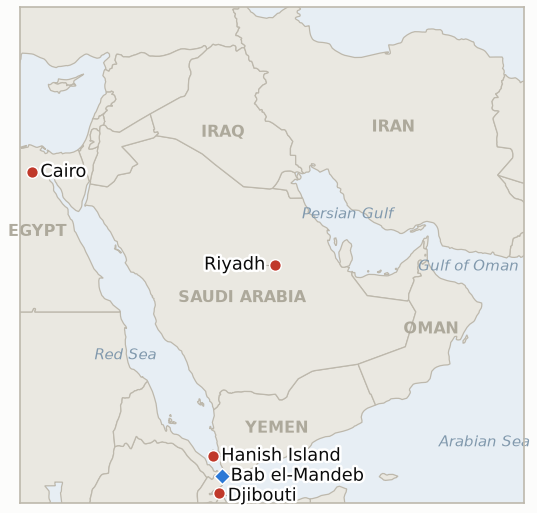

# Middle East Daily Briefing

**September 17, 2026**

- **Reporting window:** ~24 hours, September 16, 09:00 to September 17, 09:00 KST
- **Overall assessment:** Tuesday's window showed Saudi Arabia moving from statements to coalition building even as the ground truth in Yemen hardened against it: Crown Prince Mohammed bin Salman traveled to Cairo to secure President Sisi's backing on Red Sea and Bab el-Mandeb security, a visit that reads as Riyadh compensating for Washington's reported refusal of direct strikes on the Houthis (§2.1) at the same moment multiple independent outlets, citing government rather than only Houthi sourcing, corroborated the September 14 Houthi capture of the Greater and Lesser Hanish Islands, resolving IND-20260916-1 on its corroboration branch. The humanitarian toll of that advance kept widening in parallel, with Djibouti reporting more than 2,500 further arrivals since last Thursday and internal Yemeni displacement now put above 100,000 by UNHCR, a scale straining the country's stated capacity. Oil told an unexpectedly calm story: Brent and WTI both fell more than 2.5% as a surprise US crude inventory build outweighed the still-unresolved Saudi pipeline outage, even as US Energy Secretary Chris Wright's public prediction of a days-scale restart continued to sit awkwardly against satellite imagery showing serious pumping-station damage, a gap now tracked as new IND-20260917-2. KOSPI staged its own reversal, rising 1.37% to snap a four-session losing streak on easing Federal Reserve rate-hike concerns and a Samsung Electronics/SK hynix-led chip rally, even as the won kept weakening on oil-driven pressure and a ledger indicator on Janggeum Shipping's Hormuz risk appetite fell at its own deadline: the Korean carrier's VLCC charter rates hit a record $510,604 a day in an early-September report with no sign of pulling back and no government advisory addressing the exposure, falsifying IND-20260903-3. South Korea's own Hormuz process kept advancing on a parallel, quieter track, with Wednesday's NSC Standing Committee session set to discuss the deployment without placing it on the formal agenda, against a domestic backdrop of 61% public opposition. In Beijing, Foreign Minister Araghchi's meeting with Wang Yi produced a Chinese call for both Washington and Tehran to show restraint and reopen the strait, reinforcing this window's broader pattern of diplomatic energy converging on great-power channels rather than a US-Iran track.

---

## 1. What Happened

<figure style="float:right; width:46%; margin:2pt 0 8pt 14pt;">

<figcaption style="font-size:8pt; color:#666; text-align:center; margin-top:3pt; font-style:italic;">Major places of discussion</figcaption>
</figure>

### 1.1 Saudi Arabia Turns to Egypt as the Hanish Islands Capture Draws Independent Corroboration and Djibouti's Refugee Crisis Deepens

Crown Prince Mohammed bin Salman traveled to Cairo on September 15 to meet President Abdel Fattah el-Sisi, with both governments stressing the need for free and secure navigation through Bab el-Mandeb and the Red Sea; Sisi's office called Saudi security "inseparable from Egypt's own national security," a coordination push that multiple outlets tied directly to Washington's reported decision not to grant Riyadh's earlier request for direct US strikes on the Houthis (§1.2, brief 2026-09-13; [The National](https://www.thenationalnews.com/news/mena/2026/09/15/saudi-arabia-and-egypt-press-for-red-sea-security-as-crown-prince-visits-cairo/); [ABC News/AP](https://abcnews.com/Business/wireStory/saudi-crown-prince-seeks-egypts-backing-houthi-attacks-136469895)). The visit followed fuller, independently corroborated reporting on the Houthis' September 14 capture of the Greater and Lesser Hanish Islands, roughly 160 kilometers north of Bab el-Mandeb, after hundreds of government-allied forces withdrew from the archipelago: unlike the Houthi-statement-only sourcing this ledger flagged at the time (§1.2, brief 2026-09-16), multiple Tier 1-2 outlets this window cited "two government officials and a Houthi official," a materially stronger sourcing basis ([Euronews](https://www.euronews.com/2026/09/14/houthis-capture-more-yemeni-red-sea-islands-tightening-grip-on-bab-el-mandeb); [Washington Times](https://www.washingtontimes.com/news/2026/sep/14/yemens-houthi-rebels-nab-key-islands-red-sea-tighten-grip-shipping/); [FDD](https://www.fdd.org/analysis/2026/09/14/houthis-take-yemens-red-sea-coast-and-key-bab-al-mandeb-islands/)). This resolves **IND-20260916-1** on its corroboration branch, though a distinct, verified shipping-lane impact from the Hanish capture specifically remains undocumented and stays open under **IND-20260912-1**. Djibouti's humanitarian strain kept building in parallel: more than 2,500 people have crossed since last Thursday alone, UNHCR and Al Jazeera reporting internal Yemeni displacement above 100,000 (a separate tally from The National put it above 125,000), with Djiboutian authorities warning the pace already exceeds national capacity and bracing for up to 10,000 total arrivals ([Al Jazeera](https://www.aljazeera.com/news/2026/9/16/djibouti-calls-for-assistance-as-thousands-of-yemenis-flee-to-country); [The National](https://www.thenationalnews.com/news/mena/2026/09/16/families-torn-apart-as-yemen-fighting-forces-more-than-125000-civilians-to-flee/)). New **IND-20260917-1** opens to track whether the Cairo alignment converts into a concrete Egyptian operational contribution or remains statement-only. **Confidence: High** on the Cairo visit and its Saudi/Egyptian statements (multiple Tier 1 outlets, official readouts); **Medium-High** on the Hanish Islands corroboration (three independent Tier 1-2 outlets, named government-official sourcing, though the individual officials are unnamed); **High** on the Djibouti displacement figures (Al Jazeera, UNHCR, The National, converging).

### 1.2 Oil Falls on a Surprise Inventory Build Even as the Saudi Pipeline Stays Down and Wright Predicts a Days-Scale Restart

Brent settled $105.83 (-2.7%) and WTI $102.43 (-3.2%) on September 16, giving back part of the prior session's gains, after US crude inventories rose 7.1 million barrels in the week to September 11 against an expected draw of roughly 1.6 million barrels, an inventory signal that outweighed the still-unresolved Saudi East-West pipeline outage in Tuesday's pricing ([CNBC](https://www.cnbc.com/2026/09/16/oil-prices-today-brent-wti-hormuz-iran-war.html)). US Energy Secretary Chris Wright told CNBC the outage is a "brief and temporary interruption" that "will be measured in days," a notably more optimistic timeline than the multi-week window independent analysts have cited based on satellite imagery of continued fire damage to the pipeline's pumping station, a gap this ledger now tracks directly as new **IND-20260917-2**. No new attribution emerged this window for the fatal, unattributed Qeshm Island vessel strike (**IND-20260915-2**, still open), and Oman announced no new date for the postponed Salalah talks (**IND-20260914-1**/**IND-20260915-1**, both still open). **Confidence: High** on the settle prices and their inventory-build attribution (CNBC, multiple market outlets, converging); **Medium** on Wright's restart timeline given the standing satellite-damage counter-evidence, tracked as an open question rather than resolved fact.

### 1.3 KOSPI Snaps a Four-Session Losing Streak as Korea's Hormuz Process Advances Without Reaching the NSC's Formal Agenda

KOSPI rose 90.71 points (1.37%) to 6717.97, ending its four-session losing streak and closing at the day's high, as easing US Federal Reserve rate-hike concerns and a chip-sector rally (Samsung Electronics +2.01%, SK hynix +4.08%) drove the rebound; KOSDAQ rose 0.44% to 815.98 ([Seoul Economic Daily](https://en.sedaily.com/finance/2026/09/16/kospi-closes-up-137-percent-at-671797)). The won nonetheless weakened a further 9.2 won to 1368.6, decoupling from the equity rally on continued oil-driven pressure ([Money Today](https://www.mt.co.kr/economy/2026/09/16/2026091615364097346)). South Korea's Hormuz deployment process kept moving on its own, quieter track: Wednesday's National Security Council Standing Committee session will discuss inter-ministerial views on the deployment, including scaled-down alternatives such as explosive-ordnance-disposal teams and unmanned equipment, but will not place the question on its formal agenda, a senior official saying the administration is "carefully reviewing" the matter; a September 14-15 survey found 61% opposed to both deployment and military support, and Foreign Minister Cho Hyun is due to meet Secretary of State Rubio on September 18 to convey Seoul's position ([Khan](https://www.khan.co.kr/en/article/202609161933007/)). Separately, a ledger indicator on Korean shipping's own Hormuz risk appetite fell at its own September 17 deadline: Janggeum Shipping (Sinokor)'s VLCC charter rates hit a reported $510,604 a day in a September 11 Poten & Partners assessment, the highest in more than 15 years of data, with the group's 2026 tanker acquisitions exceeding 70 vessels and no Korean government advisory found addressing the company's Hormuz exposure, falsifying **IND-20260903-3**'s confirmation branch: the "high risk, high return" strategy continues unchanged (Ocean Press; Haesa Shinmun; Global Economic). **Confidence: High** on the KOSPI/won closes and their attribution (multiple Korean financial outlets, converging); **Medium-High** on the NSC session's agenda status (Khan, consistent with prior reporting); **Medium-High** on the Janggeum Shipping rate figures (Korean shipping-trade press, converging, though no single Tier 1 outlet confirmed independently).

### 1.4 Araghchi Meets Wang Yi in Beijing as China Presses Both Washington and Tehran Toward Restraint

Foreign Minister Araghchi's September 16 meeting with Chinese Foreign Minister Wang Yi covered bilateral ties, regional security and the US-Iran conflict; Wang urged Tehran and Washington to "engage in substantive consultations on issues of mutual concern," calling on all parties to take effective measures to reopen the Strait of Hormuz "as soon as possible," a formulation that presses both sides toward de-escalation without endorsing either's position outright ([The National](https://www.thenationalnews.com/news/mena/2026/09/16/china-urges-reopening-of-strait-of-hormuz-in-talks-with-irans-araghchi/)). The visit, Araghchi's second wartime trip to China, comes a week ahead of the September 24 Trump-Xi summit and follows last week's BRICS summit in New Delhi, where Iran and China backed deeper developing-world cooperation; no disclosed US-Iran channel or meeting emerged this window, leaving Tehran's diplomatic energy visibly directed at Beijing rather than Washington, consistent with the falsification branch of **IND-20260916-2** (still open, deadline ~2026-09-30). **Confidence: High** on the Araghchi-Wang Yi meeting and China's public statement (multiple Tier 1 outlets, Chinese Foreign Ministry readout); **Medium** on reading this as a durable Beijing-first pattern rather than routine diplomacy, an inference this ledger will keep testing against IND-20260916-2's own deadline.

---

## 2. Deep Dive: Incentives and Motives

### 2.1 Why is Saudi Arabia building an Egyptian coalition now rather than continuing to lean on US backing?

Because Washington's reported decision to decline Riyadh's direct request for US strikes on the Houthis (tracked under IND-20260913-2, still open on that narrower question) removed the option Saudi Arabia had first sought, leaving Cairo, which shares direct strategic and economic exposure to Red Sea and Suez traffic, as the most immediately available partner able to add naval or diplomatic weight without requiring a new US commitment; a Cairo-Riyadh axis also lets Saudi Arabia frame the response as a regional Arab security matter rather than a US-dependent one, which may carry more durable value than any single American strike package even if it converts to less military capability in the near term.

### 2.2 Why did Wright publicly predict a days-scale pipeline restart while satellite evidence still shows serious pumping-station damage?

Because a US government spokesperson has both a market-stabilizing incentive and limited technical visibility into Saudi Aramco's own repair timeline: a public "days, not weeks" framing helps cap the oil-price risk premium and signals confidence to markets and allies regardless of the underlying repair reality, while the actual restart timeline is Saudi Arabia's own operational decision that Washington does not control; this is why this ledger is now tracking Wright's specific claim, rather than the outage generally, as its own falsifiable test (IND-20260917-2) against a roughly one-week benchmark rather than accepting either side's framing at face value.

### 2.3 Why is Korea's NSC keeping the Hormuz deployment question off its formal agenda even as procedural steps keep advancing?

Because a formal agenda item would force a recorded government position at a moment when 61% public opposition and a divided ruling party make any stated position politically costly regardless of its content, while informal inter-ministerial coordination lets the government continue narrowing the deployment package, EOD teams and unmanned equipment rather than a logistics ship, without committing to a timeline the National Assembly could then hold it to; this keeps the process moving toward the September 28 Assembly deadline this ledger tracks (IND-20260906-2) while minimizing the domestic political exposure of each individual step along the way.

### 2.4 Why is China pressing both Washington and Tehran toward restraint rather than taking Iran's side outright?

Because an unqualified pro-Iran statement ahead of the September 24 Trump-Xi summit would complicate Beijing's own bilateral agenda with Washington at a moment it has more to gain from being seen as a stabilizing broker than as a partisan actor, while a genuinely reopened Strait of Hormuz serves China's own energy-security interests as directly as anyone else's; positioning itself as the venue urging both sides toward talks lets Beijing bank goodwill with Tehran, which has few other great-power options, without foreclosing the broader relationship with Washington the summit is meant to manage.

---

## 3. Policy Implications for South Korea

**Exposure snapshot:** South Korea's crude imports remain roughly 70% dependent on Strait of Hormuz transit and about 36% of its LNG imports come from the Middle East, with Qatar's Ras Laffan as the single largest LNG supplier exposure (see `instructions/korea-exposure.md`, last updated August 14, 2026, no update needed this window). Korea's Yanbu Red Sea workaround, which transits Bab el-Mandeb close to the now-corroborated Hanish Islands capture, stays directly exposed to the territorial shifts tracked in §1.1. Tuesday's KOSPI close of 6717.97 (+1.37%) ends a four-session losing streak, though the won's continued weakening to 1368.6 shows the underlying oil and rate pressures have not eased at the same pace as the equity market's read of them.

**Implications by development:**

- **Saudi Arabia's Cairo outreach and the corroborated Hanish Islands capture (§1.1):** A widening Egyptian role in Red Sea security is a net positive for the security architecture underpinning Korea's Yanbu workaround if it converts into real capability (IND-20260917-1); until then, the corroborated territorial shift itself argues for continuing to treat the Bab el-Mandeb leg of that workaround as a live rather than settled risk, regardless of Cairo's diplomatic posture.
- **The Djibouti refugee crisis (§1.1):** Now past 100,000 internally displaced with Djiboutian capacity strained, this is primarily a humanitarian rather than a direct Korea-shipping signal, but it is a leading indicator of how much further the underlying Yemen conflict, and the Bab el-Mandeb risk it carries, still has to run.
- **Oil's inventory-driven pullback against an unresolved pipeline outage (§1.2):** MOTIE and Korean refiners should treat Tuesday's price relief as a market-mechanics story, not a supply-risk one; the Saudi pipeline itself remains down, and Wright's days-scale restart claim is now a tracked, unresolved indicator (IND-20260917-2) rather than a basis for revising the elevated-price planning assumption.
- **KOSPI's rebound, the won's continued weakness, and Korea's own deployment process (§1.3):** The NSC's September 17 session and the Cho Hyun-Rubio meeting on September 18 are the nearest concrete steps toward the September 28 Assembly deadline (IND-20260906-2); separately, Janggeum Shipping's falsified risk-appetite indicator (IND-20260903-3) is a reminder that Korean commercial shipping's own Hormuz exposure has not diminished even as the government's deployment deliberations continue.
- **Iran's Beijing-first diplomacy (§1.4):** With no US-Iran channel visible this window, Korean planning should continue to assume an extended uncertainty window on any near-term Hormuz reopening framework, consistent with the standing guidance in prior briefs.

**Testable indicators:**

- **IND-20260917-1** (new): Saudi Arabia's Cairo alignment with Egypt either produces a concrete joint operational step (naval, air, basing, or Multinational Maritime Defense Alliance participation), or remains statement-only diplomatic alignment. Deadline ~2026-10-01.
- **IND-20260917-2** (new): US Energy Secretary Wright's "days, not weeks" pipeline-restart claim either holds (a confirmed restart by ~2026-09-23) or is falsified by the pipeline remaining offline past that date, consistent with analysts' weeks-scale satellite damage assessment. Deadline ~2026-09-23.
- **IND-20260903-3** (resolved, falsified): Janggeum Shipping's Hormuz VLCC chartering shows no reduction and no Korean government advisory was found; record day rates ($510,604, Sept 11 report) confirm the high-risk strategy continues unchanged.
- **IND-20260916-1** (resolved, confirmed on its corroboration branch): The Hanish Islands capture drew independent, government-sourced corroboration from multiple Tier 1-2 outlets; a distinct shipping-lane impact remains untested under IND-20260912-1.
- **IND-20260911-3** (open, trending toward confirmed): Korea's NSC review is advancing on schedule, with a September 17 session and a September 18 Cho Hyun-Rubio meeting, though Hormuz deployment stays off the formal NSC agenda. Deadline ~2026-09-24.
- **IND-20260906-2** (open): Korea's formal National Assembly deployment motion; still no motion filed as of this window. Deadline ~2026-09-28.
- **IND-20260913-2** (open): Saudi Arabia's own response to Washington's declined strike request; this window shows a diplomatic rather than military escalation (the Cairo visit), with no confirmed direct US strikes on the Houthis. Deadline ~2026-09-27.
- **IND-20260915-1** (open): The postponed Salalah talks; still no new date announced this window. Deadline ~2026-09-29.
- **IND-20260915-2** (open): The fatal Qeshm Strait of Hormuz vessel strike; no attribution or further incident found this window. Deadline ~2026-09-29.
- **IND-20260915-3** (open): Prince Faisal's BRICS de-escalation call; this window's Cairo diplomacy is a data point toward the diplomatic-track branch, though no Saudi/GCC-convened multilateral initiative was found and the Hanish corroboration cuts the other way. Deadline ~2026-09-29.

---

## 4. Watch List

- **Saudi Arabia's Cairo coalition (IND-20260917-1):** whether Egyptian alignment converts into a real operational contribution to Red Sea security.
- **Wright's pipeline-restart timeline (IND-20260917-2):** the nearest concrete test of whether the "days" framing or the analysts' weeks-scale damage assessment is right, by ~September 23.
- **The Hanish Islands' shipping-lane impact (IND-20260912-1):** whether the now-corroborated capture translates into a documented attack, toll, or premium spike.
- **South Korea's NSC follow-through and the Cho Hyun-Rubio meeting (IND-20260911-3):** the nearest procedural signal ahead of the September 28 Assembly deadline.
- **Iran's Beijing-versus-Washington channel (IND-20260916-2):** whether any US-Iran opening emerges or Tehran's diplomatic energy stays directed at China and Russia.
- **Pickaxe Mountain (IND-20260905-1) and Ben Gvir's Disengagement 710 plan (IND-20260904-2):** both reach their ~09-18 deadlines tomorrow with no strike and no confirmed host country respectively.
- **A rescheduled Salalah/Oman framework (IND-20260915-1):** still no new date given.
- **Qatari LNG loadings at Ras Laffan (IND-20260714-4):** still no fresh weekly loading figure, the ledger's longest-running unresolved indicator.

---

## 5. Source Quality Summary

| Claim | Sources | Confidence |
|---|---|---|
| Crown Prince Mohammed bin Salman visits Cairo, Saudi Arabia and Egypt align on Red Sea/Bab el-Mandeb security | The National, ABC News/AP, multiple wire-service pickups (Tier 1) | High |
| Hanish Islands capture (Sept 14) draws independent, government-official-sourced corroboration | Euronews, Washington Times, FDD analysis (Tier 1-2, converging, named as "government officials") | Medium-High |
| Djibouti refugee crisis deepens past 100,000 internally displaced, 2,500-plus new arrivals since last Thursday | Al Jazeera, UNHCR, The National (Tier 1) | High |
| Brent settles $105.83 (-2.7%), WTI $102.43 (-3.2%) on a surprise US inventory build | CNBC (Tier 1) | High |
| Energy Secretary Wright predicts a "days"-scale Saudi pipeline restart, against analysts' weeks-scale satellite damage assessment | CNBC, American Partisan/Gulf Insider wire pickups (Tier 1-2) | Medium |
| KOSPI +1.37% to 6717.97, won weakens to 1368.6 | Seoul Economic Daily, Money Today, Financial News (Tier 1-2) | High |
| Korea's Sept 17 NSC session discusses but does not formally agenda the Hormuz deployment; 61% oppose deployment/support | Khan (Tier 1-2) | Medium-High |
| Janggeum Shipping's VLCC day rates hit a record $510,604 (Sept 11 report), no reduction or advisory found | Ocean Press, Haesa Shinmun, Global Economic (Tier 2, Korean shipping trade press) | Medium-High |
| Araghchi meets Wang Yi in Beijing; China urges US-Iran restraint and a swift Hormuz reopening | The National, multiple wire-service pickups, Chinese Foreign Ministry readout (Tier 1) | High |
