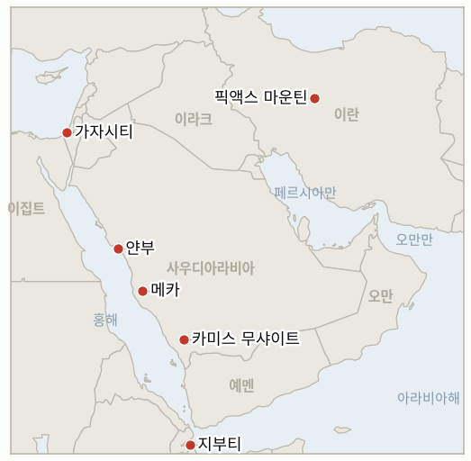

# 중동 일일 브리핑

**2026년 9월 18일**

- **보고 기간:** 약 24시간, 9월 17일 09:00 ~ 9월 18일 09:00 (한국시간)
- **종합 평가:** 목요일 보고 기간에는 예멘 전쟁의 인도적·군사적 비용이 외교보다 계속 앞서 나가는 모습이 확인됐다. 사우디아라비아는 후티에 대한 자체 공세를 이번 주 약 450회 공습으로 강화했고, 메카 남부에서는 후티 드론 한 대가 격추됐으며, 유엔 세계식량계획(WFP)은 예멘 분쟁 실향민 추정치를 12만 5천 명으로 상향하면서 전투가 더 확산될 경우 최대 150만 명에게 식량을 지원할 준비를 하고 있다고 경고했다(§1.1). 유가는 연방준비제도가 2023년 이후 첫 금리 인상을 단행했음에도 소폭 더 밀렸는데, 이는 가격 흐름을 명확히 하기보다 오히려 복잡하게 만든 매파적 조치였다. 동시에 사우디아라비아의 송유관 복구 주장은 더욱 엇갈렸다. 라이트 에너지장관의 공개적인 "며칠" 프레이밍은 CNBC가 전한 동서 송유관 전체 용량 복구까지 약 6주가 걸릴 수 있다는 보도와 배치된다(§1.2). 외교 면에서는 트럼프 대통령이 테헤란과 "직접" 접촉했다고 주장하고 전쟁이 "종식에 가까워지고 있다"고 밝혔으나 이란은 이를 확인하지 않았으며, 아라그치 외교장관은 베이징에서 별도로 이란과 오만이 호르무즈 해협 재개방 계획에 이미 합의했다고 주장했는데, 이는 여전히 일정이 잡히지 않은 채 교착 상태인 살랄라 걸프 회담과 어색하게 어긋난다(§1.3). 이 원장에서 가장 오래 추적돼 온, 가장 구체적인 억지 위협 두 건은 이번 보고 기간 각자의 마감일에 어느 쪽도 실현되지 않은 채 소멸했다. 이란의 픽액스 마운틴 터널 단지에 대한 미군 타격은 이루어지지 않았고, 벤그비르 국가안보장관이 제시한 팔레스타인인 186만 명 이주 계획에 나서겠다는 수용국도 나타나지 않아, 두 지표 모두 단순히 잠잠한 상태가 아니라 반증으로 기록됐다(§1.4). 한국 시장은 연준의 매파적 전환을 거의 보합세로 흡수했는데, 방산·조선주 랠리가 하락 압력을 상쇄했고 원화는 다시 약세를 보였다. 한국 자체의 호르무즈 절차는 절차적으로 계속 진전되어, 조현 외교부 장관과 루비오 국무장관이 금요일 워싱턴 회동을 앞두고 공동의 호르무즈 우선순위에 관한 사전 통화를 가졌으나, 정부는 파병 결정이 아직 내려지지 않았다는 입장을 유지하고 있으며 한층 축소된 비전투 옵션을 검토 중인 것으로 알려졌다(§1.5).

---

## 1. 무슨 일이 있었나

<figure style="float:right; width:46%; margin:2pt 0 8pt 14pt;">

<figcaption style="font-size:8pt; color:#666; text-align:center; margin-top:3pt; font-style:italic;">주요 논의 지점</figcaption>
</figure>

### 1.1 사우디아라비아, 메카 인근 후티 드론 격추 속 예멘 공습 강화, WFP는 실향민 수치를 12만 5천 명으로 상향

사우디 공군은 이번 주 예멘에 대한 공습을 강화해 주말 이후 약 450회의 공습을 실시한 것으로 통신사 보도가 전했으며, 후티 세력은 얀부와 카미스 무샤이트 인근 칼리드 국왕 공군기지를 포함한 사우디 도시들에 드론과 미사일 공격을 계속했다. 9월 15일에는 메카 남부에서 후티 드론 한 대가 격추됐다([ABC뉴스 오스트레일리아/AP 통신](https://www.abc.net.au/news/2026-09-17/saudi-yemen-houthi-iran/107162054)). 유엔 세계식량계획은 예멘 홍해 연안의 전투로 현재 약 12만 5천 명이 실향한 것으로 추정된다고 밝혔는데, 이는 지난 9월 17일 브리핑의 10만 명 초과 수치보다 상향된 것이며, 분쟁이 더 격화될 경우 최대 150만 명에게 식량을 지원할 준비를 하고 있다고 덧붙였다. 모카에 있던 WFP 시설이 전투로 훼손됐고 최소 49곳의 식량 배급소가 현재 접근 불가 상태다([The National](https://www.thenationalnews.com/news/mena/2026/09/16/families-torn-apart-as-yemen-fighting-forces-more-than-125000-civilians-to-flee/)). 이 가파른 증가세가 더 높은 임계치를 향해 계속되는지, 아니면 현 수준에서 정체되는지를 추적하는 새 지표 **IND-20260918-1**이 열렸다. **신뢰도: 중간-높음**(사우디 공습 강화와 메카 인근 드론 격추, AP 계열 통신, 이번 보고 기간에는 단일 주요 출처); **신뢰도: 높음**(WFP 실향민·지원 준비 수치, WFP 자체 발표, 지역 매체들이 광범위하게 재보도).

### 1.2 연준의 2023년 이후 첫 금리 인상 속 유가 재차 하락, 사우디 송유관 복구 주장은 엇갈려

브렌트유는 9월 17일 104.82달러(-1.01달러), WTI는 101.91달러(-52센트)로 마감해 이틀 연속 소폭 하락했다. 같은 날 연방준비제도는 기준금리를 25베이시스포인트 인상해 3.75~4.00% 범위로 올렸는데, 이는 2023년 이후 첫 인상으로, 장기화된 고유가에 따른 인플레이션 압력을 이유로 12대 0 표결로 결정됐다([CNBC](https://www.cnbc.com/2026/09/17/oil-prices-today-wti-brent-hormuz-iran-war.html); [CNBC](https://www.cnbc.com/2026/09/16/fed-rate-decision-september-2026.html)). 사우디아라비아는 대체 수출 경로를 통해 동서 송유관 용량의 약 절반을 며칠 내 복구하려 하고 있으나, 사정에 정통한 한 인사는 CNBC에 아람코가 손상된 구간을 우회하면서 전체 용량 복구까지는 약 6주가 걸릴 수 있다고 전했으며, 이는 라이트 에너지장관의 공개적인 "며칠" 프레이밍을 직접적으로 완화시키는 시점으로 **IND-20260917-2**로 추적된다. 별도로 윈드워드 해상정보 분석업체 자료에 따르면 9월 16일 호르무즈 해협 상업 선박 통항이 12척으로 전날의 두 배로 늘었으나, 이는 전쟁 이전 기준선인 하루 50~80척 이상에 여전히 크게 못 미치는 수준이다([CNBC](https://www.cnbc.com/2026/09/15/oil-prices-saudi-arabia-east-west-pipeline-iran.html); 윈드워드 데일리 인텔리전스). **신뢰도: 높음**(정산가와 연준 결정, CNBC 등 복수 시장 매체 수렴); **신뢰도: 중간**(6주 송유관 복구 시점, 익명의 CNBC 단일 출처로 라이트 장관의 기록상 발언이지만 더 낙관적인 주장과 배치).

### 1.3 트럼프, 테헤란과 직접 접촉했다고 주장, 아라그치는 이란·오만 재개방 합의를 주장

트럼프 대통령은 "우리가 전쟁 종식에 가까워지고 있기를 바란다"고 말하며 테헤란과의 접촉을 "직접적"이라고 표현했고, "그들은 거래를 원하고 있으며, 어떻게 진행되는지 지켜보겠다"고 덧붙였으나 시기나 수준에 대한 구체적 내용은 밝히지 않았고 이란은 이 표현을 확인하지 않았다. 이란의 한 고위 당국자는 별도로 이란의 조건이 충족되지 않는 한 협상을 계속 거부하고 있다([알자지라](https://www.aljazeera.com/news/2026/9/17/trump-claims-direct-talks-with-iran-is-diplomacy-picking-up-again); [뉴아랍](https://www.newarab.com/news/trump-claims-us-nears-end-iran-war-holding-direct-talks)). 베이징에서 아라그치 외교장관은 자국 정부의 기존 공개 입장보다 한발 더 나아가, 이란이 이미 오만과 호르무즈 해협 재개방 계획에 합의했으며 "미국은 스스로 약속한 모든 사항을 성실히 이행해야 한다"고 기자들에게 말했는데, 이는 여전히 연기되고 새 일정도 없는 살랄라 걸프 회담(**IND-20260914-1**, **IND-20260915-1**로 추적 중)과 어색하게 어긋나는 주장이다([The National](https://www.thenationalnews.com/news/mena/2026/09/16/china-urges-reopening-of-strait-of-hormuz-in-talks-with-irans-araghchi/)). 새 지표 **IND-20260918-2**는 트럼프의 직접 접촉 주장이 이란 측 확인을 얻는지를, 새 지표 **IND-20260918-3**은 아라그치의 이란·오만 "합의" 주장이 오만·GCC의 확인을 얻는지를 추적한다. **신뢰도: 낮음-중간**(트럼프의 직접 대화 주장, 본인 발언에만 의존하고 이란 측 확인 없음); **신뢰도: 중간**(아라그치의 이란·오만 주장, 이란 측 소스에만 의존하며 여전히 교착된 다자 트랙과 불일치).

### 1.4 오랫동안 추적된 두 억지 위협 미실행 소멸: 픽액스 마운틴과 디스인게이지먼트 710

이 원장에서 가장 오래 추적되고 가장 구체적이었던 억지 위협 두 건이 이번 보고 기간 각자의 9월 18일 마감일을 맞이했으나 어느 쪽 조건도 촉발되지 않았다. 트럼프 대통령이 9월 5일 "매우 곧" 타격하겠다고 위협했던 이란 픽액스 마운틴 터널 단지에 대해 확인된 미군 타격은 없었다. CSIS 위성 분석은 해당 지역의 건설 활동이 계속되고 있음을 보여줄 뿐 타격은 확인되지 않아, **IND-20260905-1**은 실행된 작전이 아닌 억지용 수사로 반증됐으며, 이는 오만 폭격 위협, 하르그섬 주장 등 이 원장이 기록해온 미실행 트럼프 타격 위협의 패턴과 일치한다. 벤그비르 국가안보장관이 제시한, 7년에 걸쳐 팔레스타인인 186만 명을 이주시키는 비용 산정까지 마친 "디스인게이지먼트 710" 계획 역시 이번 보고 기간 명시된 수용국이 나타나지 않았고 이스라엘 정부의 공식 채택이나 거부도 없어 **IND-20260904-2**가 반증됐으며, 계획은 10월 27일 총선을 앞둔 선거 공약 수준에 머물렀다([타임스오브이스라엘](https://www.timesofisrael.com/ben-gvir-unveils-voluntary-emigration-plan-to-remove-most-palestinians-from-gaza/); [데일리뉴스이집트](https://www.dailynewsegypt.com/2026/09/15/opinion-plan-710-can-bengvir-succeed-in-emptying-gaza/)). **신뢰도: 높음**(두 지표 해소 모두, 이번 보고 기간 여러 차례 검색에서 확인된 타격이나 수용국 확인이 전혀 발견되지 않았고 각 지표 고유의 반증 조건에 부합함).

### 1.5 코스피는 연준의 매파적 전환에도 거의 보합, 조현·루비오는 워싱턴 회동 앞두고 사전 통화

코스피는 2.56포인트(-0.04%) 내린 6715.41로 거의 보합세로 마감했다. 연준의 매파적 금리 결정이 투자심리를 눌렀고 외국인은 7거래일 연속 순매도(2조 4,600억 원)를 이어갔으나, 방산·조선주(한화시스템, 한화에어로스페이스, HD현대중공업)는 호르무즈 파병 관련 수요 기대에 랠리했다. 코스닥은 0.76% 오른 822.18을 기록했고 원화는 13.6원 추가 약세를 보인 1382.2원으로 마감했다([뉴스핌](https://www.newspim.com/news/view/20260917000942); [서울경제신문](https://en.sedaily.com/politics/2026/09/17/seoul-washington-face-super-weekend-on-investment-hormuz)). 조현 외교부 장관과 루비오 국무장관은 호르무즈 해협이 "세계 경제에 핵심적"이라는 데 뜻을 같이하는 사전 통화를 가졌으며, 예정대로 9월 18일 진행되는 워싱턴 대면 회동을 앞두고 있다. 박윤주 외교부 제1차관은 구체적인 파병 결정이 내려지지 않았다고 밝히며 어떤 파병이든 "미국의 압박이 아닌 국익에 기반한" 한국의 "자주적 선택"이 될 것이라고 강조했고, 당국은 한층 축소된 대안으로 비전투·기술지원 옵션을 검토 중인 것으로 알려졌으며, 국방부는 미국으로부터 공식 파병 요청을 받은 바 없다고 밝혔다([야후뉴스/로이터 통신](https://www.yahoo.com/news/articles/rubio-south-korea-foreign-minister-223049732.html); [서울경제신문](https://en.sedaily.com/politics/2026/09/17/korea-weighs-hormuz-role-says-it-will-join-international)). **신뢰도: 높음**(코스피·코스닥·원화 종가, 복수의 한국 금융매체 수렴); **신뢰도: 중간-높음**(조현·루비오 통화와 박윤주 차관 발언, 로이터 계열 통신과 코리아타임스·코리아헤럴드·재팬타임스가 뒷받침).

---

## 2. 심층 분석: 유인과 동기

### 2.1 사우디아라비아는 왜 워싱턴이나 카이로의 행동을 기다리는 대신 자체 예멘 공세를 강화하는가?

리야드가 가진 다른 두 지렛대가 모두 더디게 작동하고 있기 때문이다. 워싱턴은 후티에 대한 직접 타격을 거부한 것으로 알려졌고, 카이로 연대(§1.1, 2026-09-17 브리핑) 역시 이번 보고 기간의 자체 재평가(IND-20260917-1)에 따르면 구체적 작전 조치 없이 성명 수준에 머물러 있다. 자체 공습 빈도를 높이는 것은 리야드가 완전히 통제할 수 있는 유일한 지렛대로, 파트너의 정치적 일정을 기다리지 않고도 국내와 걸프 청중에게 결의를 보여줄 수 있게 해준다. 다만 공습 강화만으로는 후티의 사우디 도시에 대한 드론·미사일 대응 공격을 막지 못하고 있다.

### 2.2 연준이 매파적 결정을 내린 바로 그날 유가는 왜 하락했으며, 송유관 복구 시점은 왜 이렇게 엇갈리는가?

두 사안은 느슨하게만 연결돼 있기 때문이다. 연준의 조치는 유가발 압력이 지난 한 달간 이미 물가 지표에 반영된 데 대한 통화정책 대응이지, 향후 유가 공급에 대한 신호가 아니다. 반면 수요일과 목요일의 완만한 유가 하락은 사우디아라비아가 실제로 구축 중인 대체 경로 우회책을 반영한다. 라이트 장관은 미 정부 대변인으로서 가용한 가장 안심시키는 방식으로 가동 중단을 표현할 유인이 있어 리스크 프리미엄을 억제하려 하는 반면, 익명으로 전달된 아람코 자체의 기술적 평가는 미 내각 각료의 발언을 공개적으로 반박하지 않으면서도 화재로 손상된 인프라를 우회해야 하는 물리적 현실을 반영한다.

### 2.3 트럼프는 왜 이란이 확인하지 않은 "직접 접촉"을 주장하는가?

트럼프는 적어도 9월 중순 이후 반복해온 국내 정치적 유인, 즉 근본적인 외교 상태와 무관하게 전쟁이 종식에 가까워지고 있다고 규정하려는 동기를 가지고 있으며, 확인되지 않은 "직접 대화" 주장은 이란이 끝내 확인하지 않더라도 그에게 정치적 비용이 들지 않는다. 반면 이란은 미국이 규정한 직접 접촉 서사를 확인해줄 유인이 전혀 없는데, 9월 24일 트럼프·시진핑 정상회담을 앞두고 이를 확인하는 것은 국내적으로 워싱턴에 굴복하는 것으로 읽힐 수 있으며, 마침 레자이 강경파(IND-20260916-2)가 내부적으로 이 프레이밍에 맞서고 있는 시점이자 테헤란의 외교적 역량이 워싱턴이 아닌 베이징을 주요 채널로 내세우는 데 뚜렷이 투입되고 있는 시점이기 때문이다.

### 2.4 트럼프와 벤그비르의 가장 구체적인 특정 위협들은 왜 더 넓은 작전은 계속되는 와중에도 계속 미실행으로 소멸하는가?

픽액스 마운틴처럼 명확한 표적을 특정한 위협은 값비싼 공약의 함정을 만든다. 핵과 인접한, 깊이 매설된 터널 단지를 타격하는 것은 전쟁의 다른 전선들이 아직 해결되지 않은 상황에서 워싱턴이 떠안고 싶지 않을 확전 위험을 수반하므로, 위협 자체의 억지 가치가 실제 실행의 가치를 능가할 수 있다. 벤그비르의 디스인게이지먼트 710은 다른 그러나 유사한 제약에 직면해 있는데, 그 실행은 이스라엘 정부의 통제 밖에 있는 변수, 즉 가자 실향민 수용에 따른 정치적·인도적 부담을 떠안을 제3국의 존재에 달려 있는 반면, 계획을 공개하는 것 자체는 벤그비르에게 아무런 비용도 들지 않았고 어느 국가가 응답하든 상관없이 10월 27일 총선을 앞둔 자신의 지지층에 봉사했다.

### 2.5 한국 정부는 왜 입장 표명은 계속 미루면서도 절차적으로는 계속 진전하는가?

공식 파병 발표는 여론 다수의 반대와 계속되는 여당 내 분열이라는 상황에서 정치적으로 부담스러운 시점에 기록된 입장을 강제하는 반면, 통화·KIDD 협의·NSC 조율과 같은 조용한 절차적 조치들은 정부가 (이제 비전투 옵션까지 포함하는 것으로 알려진) 실제 패키지를 계속 좁혀가면서도 국회가 나중에 책임을 물을 수 있는 일정에 얽매이지 않은 채 워싱턴에 대한 호응을 보여줄 수 있게 해주기 때문이다. 이는 9월 28일 마감일(IND-20260906-2)을 앞두고 각 단계의 국내 정치적 부담을 최소화하는 방식이다.

---

## 3. 한국에 대한 정책적 함의

**익스포저 현황:** 한국의 원유 수입은 여전히 약 70%가 호르무즈 해협 통항에 의존하고 있으며, LNG 수입의 약 36%가 중동산으로 라스라판을 통한 카타르가 최대 LNG 공급 노출처다(`instructions/korea-exposure.md`, 2026년 8월 14일 최종 업데이트, 이번 보고 기간 갱신 불필요). 한국의 얀부 홍해 우회로는 §1.1에서 다룬 사우디·후티 간 격화된 교전에 직접 노출돼 있다. 목요일 코스피 종가 6715.41(-0.04%)은 수요일 반등이 뒤집힌 것이 아니라 거의 보합에 그친 수준이었으며, 원화가 1382.2원으로 계속 약세를 보여 최근 두 거래일 동안 약 23원 밀린 것은 연준의 매파적 전환이 유가와 나란히 한국 자산시장의 두 번째 주요 변수로 자리 잡았음을 보여준다.

**사안별 함의:**

- **사우디아라비아의 예멘 공세 강화와 메카 인근 드론 격추(§1.1):** 한국의 얀부 홍해 우회로 주변 안보 환경이 완화되기보다 계속 유동적인 상태를 유지하고 있다. WFP가 경고한 최대 150만 명 실향 가능성은 군사 동향과 함께 추적할 가치가 있는 선행 인도적 지표다(IND-20260918-1).
- **연준의 매파적 결정 속 이틀 연속 완만한 유가 하락과 엇갈린 송유관 복구 시점(§1.2):** 산업통상자원부와 국내 정유사는 이번 주의 완만한 가격 하락을 공급 리스크 완화가 아닌 시장 메커니즘상의 사건으로 취급해야 한다. 사우디 송유관은 잘해야 부분 복구에 그친 상태이며, CNBC가 전한 6주 시나리오가 사실로 확인된다면 이는 최소 10월 중하순까지 고유가 계획 전제를 유지해야 할 근거가 된다.
- **트럼프의 미확인 직접 대화 주장과 아라그치의 미확인 이란·오만 주장(§1.3):** 둘 다 사실이라면 현재 가용한 호르무즈 관련 소식 중 가장 중대한 것이지만, 아직 어느 것도 독립적으로 확인되지 않았다. 한국 측 계획은 IND-20260918-2나 IND-20260918-3이 해소될 때까지 외교적 상황을 변화가 없는 것으로 취급해야 한다.
- **픽액스 마운틴과 디스인게이지먼트 710의 지표 해소(§1.4):** 둘 다 주로 가자·이란 핵 파일 관련 사안으로 호르무즈와의 직접적 관련성은 제한적이지만, 이 반증은 전쟁 중 가장 극적으로 들리는 구체적 위협들이 일관되게 실현되지 않아 왔다는 이 원장의 기존 패턴을 다시 확인시켜주며, 향후 유사하게 구체적인 위협에 얼마만큼의 비중을 둘지 가늠하는 유용한 기준점이 된다.
- **코스피의 보합 마감, 원화의 지속적 약세, 조현·루비오 트랙(§1.5):** 9월 18일 조현·루비오 회동과 여전히 미결정이며 축소될 가능성이 있는 파병 패키지는 9월 28일 국회 마감일(IND-20260906-2)을 향한 가장 근접한 구체적 단계다. 연준의 매파적 전환은 이제 유가와 같은 인과 서사에 묶지 말고 원화에 대한 독립적 압력 요인으로 별도 추적해야 한다.

**검증 가능한 지표:**

- **IND-20260918-1** (신규): 유엔 세계식량계획이 상향한 예멘 실향민 수치(12만 5천 명, 최대 150만 명 경고)가 더 높은 임계치(20만 명 돌파)를 향해 계속 가파르게 상승하는지, 아니면 현 수준에서 정체되는지. 마감일 ~2026-10-09.
- **IND-20260918-2** (신규): 트럼프 대통령의 테헤란과의 "직접" 접촉 주장이 이란 정부의 확인을 얻는지, 아니면 미국 측만의 미확인 규정으로 남는지. 마감일 ~2026-09-25.
- **IND-20260918-3** (신규): 아라그치 외교장관의 이란·오만이 "이미 합의"했다는 호르무즈 재개방 계획 주장이 오만·GCC의 확인과 재조정된 살랄라 회담으로 이어지는지, 아니면 이란 측 단독 프레이밍으로 남는지. 마감일 ~2026-10-02.
- **IND-20260905-1** (해소, 반증): 이란 픽액스 마운틴에 대한 확인된 미군 타격은 자체 9월 18일 마감일까지 일어나지 않았다. 위협은 억지용 수사로 기록됐다.
- **IND-20260904-2** (해소, 반증): 벤그비르의 디스인게이지먼트 710 계획에 대한 명시된 수용국이나 이스라엘 정부의 공식 조치는 자체 9월 18일 마감일까지 없었다. 계획은 선거 공약 수준에 머물렀다.
- **IND-20260917-2** (진행 중): 라이트 장관의 "며칠" 송유관 복구 주장은 이제 CNBC가 전한 전체 용량 복구까지 6주가 걸릴 수 있다는 추정으로 더욱 복잡해졌다. 마감일 ~2026-09-23, 5일 남음.
- **IND-20260917-1** (진행 중, 반증 쪽으로 기움): 사우디아라비아의 카이로 이집트 연대는 알자지라 분석에 따르면 구체적 작전 조치 없이 성명 수준에 머물러 있다. 마감일 ~2026-10-01.
- **IND-20260911-3** (진행 중, 확증 쪽으로 기움): 한국의 NSC 검토는 조현·루비오 사전 통화와 예정된 9월 18일 회동으로 절차적으로 계속 진전되고 있다. 마감일 ~2026-09-24.
- **IND-20260906-2** (진행 중): 한국의 호르무즈 파병에 대한 정식 국회 동의안이나 표결은 이번 보고 기간에도 확인되지 않았다. 마감일 ~2026-09-28.
- **IND-20260916-2** (진행 중): 미국과의 관계를 둘러싼 이란의 내부 분열은 여전히 해소되지 않았다. 이번 보고 기간 통일된 이란 입장이나 공개된 미·이란 채널은 확인되지 않았으며, 트럼프와 아라그치의 각기 다른 주장이 새롭고 미확인된 데이터포인트를 더했을 뿐이다. 마감일 ~2026-09-30.

---

## 4. 관찰 목록

- **트럼프의 "직접 대화" 주장(IND-20260918-2)과 아라그치의 이란·오만 주장(IND-20260918-3):** 향후 1~2주 안에 어느 쪽이든 독립적 확인을 얻는지 여부.
- **WFP의 예멘 실향민 추세(IND-20260918-1):** 12만 5천 명 수치가 WFP 자체의 150만 명 계획 상한을 향해 계속 상승하는지 여부.
- **라이트 장관의 송유관 복구 시점 대 CNBC의 6주 추정(IND-20260917-2):** 9월 23일 무렵 가장 근접한 실질적 시험.
- **사우디아라비아의 카이로 연대(IND-20260917-1):** 이집트와의 정렬이 10월 1일 전에 실질적 작전 기여로 이어지는지 여부.
- **한국의 조현·루비오 회동 결과와 NSC 후속 조치(IND-20260911-3, IND-20260906-2):** 9월 24일과 9월 28일을 앞둔 가장 근접한 절차적 신호.
- **하니시섬의 해상 항로 영향(IND-20260912-1):** 점령 자체와 구체적으로 연결된 문서화된 피해, 봉쇄, 보험료 급등은 여전히 없음.
- **재조정된 살랄라·오만 프레임워크(IND-20260914-1, IND-20260915-1):** 여전히 새 일정 없음, 아라그치의 미확인 "합의" 주장으로 상황이 한층 복잡해짐.
- **라스라판 카타르 LNG 선적(IND-20260714-4):** 여전히 새로운 주간 선적 수치 없음, 이 원장에서 가장 오래 미해결로 남은 지표.

---

## 5. 출처 신뢰도 요약

| 주장 | 출처 | 신뢰도 |
|---|---|---|
| 사우디, 이번 주 공습 약 450회로 강화; 메카 남부에서 후티 드론 격추 | ABC뉴스 오스트레일리아/AP 통신 (1등급) | 중간-높음 |
| WFP, 예멘 분쟁 실향민을 12만 5천 명으로 상향, 격화 시 최대 150만 명 경고 | The National, WFP 자체 발표, 광범위하게 재보도 (1~2등급) | 높음 |
| 브렌트유 104.82달러, WTI 101.91달러 마감(9월 17일); 연준 25bp 인상해 3.75~4.00%, 2023년 이후 첫 인상 | CNBC (1등급) | 높음 |
| 사우디 송유관: 라이트 장관의 "며칠" 주장 대 CNBC 보도의 전체 용량 복구 6주 추정 | CNBC (1등급, 6주 수치는 익명 출처) | 중간 |
| 호르무즈 해협 통항 9월 16일 하루 12척으로 두 배 증가 | 윈드워드 데일리 인텔리전스 (전문 해상정보) | 중간-높음 |
| 트럼프, 테헤란과 "직접" 접촉했다고 주장하며 전쟁 종식이 가까워지고 있다고 밝힘 | 알자지라, 뉴아랍, 폭스뉴스 라이브 블로그 (1~2등급, 이란 측 미확인) | 낮음-중간 |
| 아라그치, 이란과 오만이 호르무즈 재개방 계획에 "이미 합의"했다고 주장 | The National, 브레이트바트 (1~2등급, 이란 측 소스만) | 중간 |
| 픽액스 마운틴 미군 타격 없음; 디스인게이지먼트 710 수용국 없음, 각각 9월 18일 마감일까지 | CSIS 위성 분석(배경), 다수 검색에서 관련 보도 부재 확인 | 높음 |
| 코스피 6715.41(-0.04%), 코스닥 822.18(+0.76%), 원화 1382.2원으로 약세 | 뉴스핌, 서울경제신문, SBS비즈 (1~2등급, 수렴) | 높음 |
| 조현·루비오 사전 통화; 비전투·기술지원 옵션 검토 중 | 야후뉴스/로이터 통신, 서울경제신문, 코리아타임스, 코리아헤럴드 (1~2등급, 수렴) | 중간-높음 |
