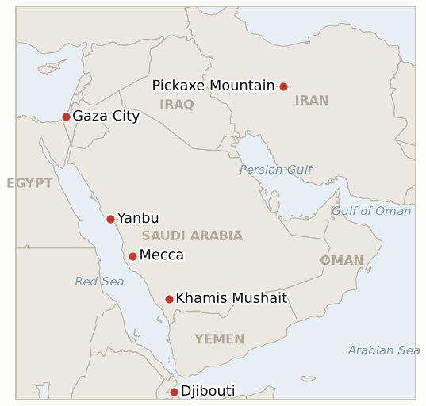

# Middle East Daily Briefing

**September 18, 2026**

- **Reporting window:** ~24 hours, September 17, 09:00 to September 18, 09:00 KST
- **Overall assessment:** Thursday's window showed the Yemen war's human and military costs continuing to outrun its diplomacy: Saudi Arabia intensified its own campaign against the Houthis to roughly 450 strikes this week, a Houthi drone was shot down south of Mecca, and the UN World Food Programme raised its Yemen conflict displacement estimate to 125,000, warning it is preparing to feed up to 1.5 million people should the fighting widen further (§1.1). Oil gave back a little more ground even as the Federal Reserve delivered its first rate hike since 2023, a hawkish surprise that complicated rather than clarified the pricing picture, while Saudi Arabia's own pipeline restart claims fractured further: Energy Secretary Wright's public "days" framing sits against a CNBC report that full East-West pipeline capacity could take roughly six weeks (§1.2). Diplomatically, President Trump's claim of "direct" contact with Tehran and his hope the war is "nearing the end" went uncorroborated by Iran, even as Foreign Minister Araghchi separately asserted in Beijing that Iran and Oman have already agreed a plan to reopen the Strait of Hormuz, a characterization that sits awkwardly against the still undated, stalled Salalah Gulf talks (§1.3). Two of the ledger's longest tracked, most specific deterrence threats reached their own deadlines unexecuted this window: no US strike materialized on Iran's Pickaxe Mountain tunnel complex, and no destination country came forward for National Security Minister Ben Gvir's costed plan to relocate 1.86 million Palestinians from Gaza, both now recorded falsified rather than merely quiet (§1.4). South Korea's markets absorbed the Fed's hawkish turn with KOSPI essentially flat, even as a defense and shipbuilding rally offset the drag and the won weakened again; Seoul's own Hormuz process advanced procedurally, with Foreign Minister Cho Hyun and Secretary Rubio holding a precursor phone call on shared Hormuz priorities ahead of Friday's Washington meeting, though the government continues to describe the deployment decision as undecided and is reportedly weighing a further scaled-down, non-combat option (§1.5).

---

## 1. What Happened

<figure style="float:right; width:46%; margin:2pt 0 8pt 14pt;">

<figcaption style="font-size:8pt; color:#666; text-align:center; margin-top:3pt; font-style:italic;">Major places of discussion</figcaption>
</figure>

### 1.1 Saudi Arabia Intensifies Yemen Strikes as WFP Raises Displacement to 125,000 and Warns of Up to 1.5 Million

Saudi warplanes intensified strikes on Yemen this week, with wire reporting citing roughly 450 airstrikes since the weekend even as Houthi forces kept firing drones and missiles at Saudi cities, including Yanbu and the King Khalid Air Base near Khamis Mushait; a Houthi drone was shot down south of Mecca on September 15 ([ABC News Australia/AP wire](https://www.abc.net.au/news/2026-09-17/saudi-yemen-houthi-iran/107162054)). The UN World Food Programme said fighting along Yemen's Red Sea coast has now displaced an estimated 125,000 people, up from the more than 100,000 figure in this ledger's September 17 brief, and is preparing to feed as many as 1.5 million people should the conflict intensify further; WFP premises in Mocha were breached in the fighting and at least 49 food distribution points are now inaccessible ([The National](https://www.thenationalnews.com/news/mena/2026/09/16/families-torn-apart-as-yemen-fighting-forces-more-than-125000-civilians-to-flee/)). New **IND-20260918-1** opens to track whether this rapid rise continues toward a materially higher threshold or plateaus near the current level. **Confidence: Medium-High** on the intensified Saudi strike tempo and Mecca-area drone shootdown (AP-style wire, a single primary source this window); **High** on the WFP displacement and capacity figures (WFP's own statement, widely re-reported by regional outlets).

### 1.2 Oil Slips Again as the Fed Delivers Its First Hike Since 2023 and Saudi Pipeline Restart Claims Diverge

Brent settled $104.82 (-$1.01) and WTI $101.91 (-52 cents) on September 17, a second straight session of modest declines, as the Federal Reserve raised its benchmark rate 25 basis points to a 3.75% to 4.00% range, its first increase since 2023, in a 12-0 vote citing inflation pressure from persistently elevated oil prices ([CNBC](https://www.cnbc.com/2026/09/17/oil-prices-today-wti-brent-hormuz-iran-war.html); [CNBC](https://www.cnbc.com/2026/09/16/fed-rate-decision-september-2026.html)). Saudi Arabia is working to restore roughly half the East-West pipeline's capacity within days using alternative export routes, but a person familiar with the matter told CNBC that full capacity could take about six weeks as Aramco bypasses a damaged section, a timeline that directly tempers Energy Secretary Wright's public "days" framing now tracked under **IND-20260917-2**; separately, Strait of Hormuz commercial transits roughly doubled to 12 vessels on September 16 per Windward maritime-intelligence data, still far below the pre-war baseline of 50 to 80-plus per day ([CNBC](https://www.cnbc.com/2026/09/15/oil-prices-saudi-arabia-east-west-pipeline-iran.html); Windward Daily Intelligence). **Confidence: High** on the settle prices and the Fed decision (CNBC, multiple converging market outlets); **Medium** on the six-week pipeline timeline, sourced to a single unnamed CNBC source against Wright's on-record but more optimistic claim.

### 1.3 Trump Claims Direct Contact with Tehran as Araghchi Asserts an Agreed Iran Oman Reopening Plan

President Trump said he hopes "we're nearing the end of the war" and described contact with Tehran as "direct," adding "they want to make a deal, and we'll see how it plays out," though he gave no detail on timing or level and Iran has not corroborated the characterization; a senior Iranian official has separately continued to reject talks absent Iran's own conditions being met ([Al Jazeera](https://www.aljazeera.com/news/2026/9/17/trump-claims-direct-talks-with-iran-is-diplomacy-picking-up-again); [The New Arab](https://www.newarab.com/news/trump-claims-us-nears-end-iran-war-holding-direct-talks)). In Beijing, Foreign Minister Araghchi went further than his own government's public position to date, telling reporters Iran has already agreed with Oman on a plan to reopen the Strait of Hormuz and that "the US must faithfully fulfill all the commitments it has undertaken," a claim that sits awkwardly against the still postponed, no-new-date Salalah Gulf talks tracked by **IND-20260914-1** and **IND-20260915-1** ([The National](https://www.thenationalnews.com/news/mena/2026/09/16/china-urges-reopening-of-strait-of-hormuz-in-talks-with-irans-araghchi/)). New **IND-20260918-2** tracks whether Trump's direct-contact claim draws Iranian corroboration, and new **IND-20260918-3** tracks whether Araghchi's Iran-Oman "agreed" claim draws Omani or GCC corroboration. **Confidence: Low-Medium** on Trump's direct-talks claim, single-sourced to his own remarks with no Iranian confirmation; **Medium** on Araghchi's Iran-Oman claim, Iran-sourced only and inconsistent with the still-stalled multilateral track.

### 1.4 Two Long Running Deterrence Threats Expire Unexecuted: Pickaxe Mountain and Disengagement 710

Two of this ledger's longest tracked, most specific deterrence threats reached their own September 18 deadlines this window with neither branch triggered. President Trump's September 5 threat to strike Iran's Pickaxe Mountain tunnel complex "very soon" produced no verified US strike; CSIS satellite analysis continues to show construction activity at the site but no attack, falsifying **IND-20260905-1** as deterrent rhetoric rather than an executed operation, consistent with this ledger's record of unexecuted Trump strike threats (the Oman bombing threat, the Kharg Island claim). National Security Minister Ben Gvir's costed "Disengagement 710" plan to relocate 1.86 million Palestinians from Gaza over seven years likewise drew no named destination country and no formal Israeli government adoption or rejection within the window, falsifying **IND-20260904-2** and stalling the plan as a campaign proposal ahead of the October 27 election ([Times of Israel](https://www.timesofisrael.com/ben-gvir-unveils-voluntary-emigration-plan-to-remove-most-palestinians-from-gaza/); [Daily News Egypt](https://www.dailynewsegypt.com/2026/09/15/opinion-plan-710-can-bengvir-succeed-in-emptying-gaza/)). **Confidence: High** on both resolutions, based on the absence of any verified strike or host-country confirmation across multiple searches this window, consistent with each indicator's own explicit falsification condition.

### 1.5 KOSPI Holds Nearly Flat on a Hawkish Fed as Cho Hyun and Rubio Hold a Precursor Call Ahead of Their Washington Meeting

KOSPI eased 2.56 points (-0.04%) to 6715.41, essentially flat, as the Fed's hawkish rate decision weighed on sentiment and foreign investors extended a seventh straight net-selling streak (2.46 trillion won), even as defense and shipbuilding stocks (Hanwha Systems, Hanwha Aerospace, HD Hyundai Heavy Industries) rallied on Hormuz-deployment-linked demand; KOSDAQ rose 0.76% to 822.18 and the won weakened a further 13.6 won to 1382.2 ([Newspim](https://www.newspim.com/news/view/20260917000942); [Seoul Economic Daily](https://en.sedaily.com/politics/2026/09/17/seoul-washington-face-super-weekend-on-investment-hormuz)). Foreign Minister Cho Hyun and Secretary of State Rubio held a precursor phone call agreeing the Strait of Hormuz is "key to the global economy," ahead of their in-person Washington meeting proceeding as scheduled September 18; First Vice Foreign Minister Park Yoon-joo said no specific deployment decision has been made and stressed it would be Korea's "autonomous choice based on national interests, not U.S. pressure," while officials are reportedly weighing a non-combat or technical-support option as a further scaled-down alternative, and Seoul's Defense Ministry says it has not received a formal deployment request from Washington ([Yahoo News/Reuters wire](https://www.yahoo.com/news/articles/rubio-south-korea-foreign-minister-223049732.html); [Seoul Economic Daily](https://en.sedaily.com/politics/2026/09/17/korea-weighs-hormuz-role-says-it-will-join-international)). **Confidence: High** on the KOSPI/KOSDAQ/won closes (multiple Korean financial outlets converging); **Medium-High** on the Cho-Rubio call and Park's remarks (Reuters-style wire, Korea Times, Korea Herald, Japan Times corroborating).

---

## 2. Deep Dive: Incentives and Motives

### 2.1 Why is Saudi Arabia escalating its own Yemen campaign rather than waiting for Washington or Cairo to act?

Because both of Riyadh's other levers are running slowly: Washington reportedly declined direct strikes on the Houthis, and the Cairo alignment (§1.1, brief 2026-09-17) remains, per this window's own reassessment (IND-20260917-1), statement-only with no disclosed operational step; a unilateral strike tempo increase is the one lever fully within Saudi Arabia's own control, letting Riyadh demonstrate resolve to a domestic and Gulf audience without waiting on a partner's political timeline, even though intensified strikes alone have not stopped the Houthis' continued drone and missile fire back at Saudi cities.

### 2.2 Why did oil fall on the same day the Fed delivered a hawkish surprise, and why do the pipeline-restart timelines diverge so sharply?

Because the two stories are only loosely coupled: the Fed's move was a monetary response to inflation that oil-driven price pressure has already fed into the data over the past month, not a signal about future oil supply, while Wednesday's and Thursday's modest oil declines instead track the alternative-route workaround Saudi Arabia is actively building; Wright, as a US government spokesperson, has every incentive to frame the outage in the most reassuring available terms to cap the risk premium, while Aramco's own technical assessment, relayed anonymously to avoid publicly contradicting a US cabinet official, reflects the physical reality of bypassing fire-damaged infrastructure rather than a market-management goal.

### 2.3 Why would Trump claim direct contact with Iran that Tehran has not confirmed?

Because Trump has a standing domestic incentive, repeated since at least mid-September, to frame the war as nearing its end regardless of the underlying diplomatic state, and an unconfirmed "direct talks" claim costs him nothing politically even if Iran never corroborates it; Iran, in turn, has every incentive not to confirm a US-framed direct-contact narrative, since doing so ahead of the September 24 Trump-Xi summit could read domestically as capitulation to Washington precisely when Rezaei's hardline faction (IND-20260916-2) is contesting that framing internally, and when Tehran's diplomatic energy is visibly invested in presenting Beijing, not Washington, as its primary channel.

### 2.4 Why do Trump's and Ben Gvir's most specific, named threats keep expiring unexecuted while broader campaigns continue?

Because a highly specific, named-target threat like Pickaxe Mountain creates a costly commitment trap: striking a deeply buried, nuclear-adjacent tunnel complex risks an escalation Washington may not want to own while the war's other fronts remain unresolved, so the deterrent value of the threat itself may exceed the value of executing it. Ben Gvir's Disengagement 710 faces a different but analogous constraint: its implementation depends on a third country accepting the political and humanitarian liability of receiving displaced Gaza residents, a variable entirely outside the Israeli government's control, whereas unveiling the plan cost Ben Gvir nothing and served his own electoral audience ahead of the October 27 vote regardless of whether any state ever responds.

### 2.5 Why is Korea's government advancing procedurally on Hormuz while still declining to state a position?

Because a formal deployment announcement would force a recorded position at a moment when majority public opposition and continued ruling-bloc division make any stated position politically costly, while quiet procedural steps, phone calls, KIDD talks, NSC coordination, let the government keep narrowing the actual package (now reportedly including a non-combat option) and demonstrate responsiveness to Washington without committing to a timeline the National Assembly could hold it to before the September 28 deadline (IND-20260906-2).

---

## 3. Policy Implications for South Korea

**Exposure snapshot:** South Korea's crude imports remain roughly 70% dependent on Strait of Hormuz transit and about 36% of its LNG imports come from the Middle East, with Qatar's Ras Laffan as the single largest LNG supplier exposure (see `instructions/korea-exposure.md`, last updated August 14, 2026, no update needed this window). Korea's Yanbu Red Sea workaround stays directly exposed to the intensified Saudi-Houthi exchanges tracked in §1.1. Thursday's KOSPI close of 6715.41 (-0.04%) was essentially flat, a pause rather than a reversal of Wednesday's rebound, while the won's continued weakening to 1382.2, now down roughly 23 won over the past two sessions, shows the Fed's hawkish pivot has become a second major cross-current alongside oil for Korean asset markets.

**Implications by development:**

- **Saudi Arabia's intensified Yemen campaign and the Mecca-area drone shootdown (§1.1):** keeps the security environment around Korea's Yanbu Red Sea workaround live rather than easing; WFP's warning of up to 1.5 million displaced if the conflict widens further is a leading humanitarian indicator worth tracking alongside the military file (IND-20260918-1).
- **Oil's second straight modest pullback against a hawkish Fed and diverging pipeline timelines (§1.2):** MOTIE and Korean refiners should not read this week's mild declines as durable relief; the Saudi pipeline remains only partially restored at best, and the CNBC-sourced six-week timeline, if it holds, argues for maintaining the elevated-price planning assumption through at least mid-to-late October rather than reverting to pre-outage assumptions.
- **Trump's unconfirmed direct-talks claim and Araghchi's unconfirmed Iran-Oman claim (§1.3):** both, if real, would be the most consequential Hormuz-relevant development currently available, but neither is yet independently corroborated; Korean planning should treat the diplomatic picture as unchanged until IND-20260918-2 or IND-20260918-3 resolves.
- **The Pickaxe Mountain and Disengagement 710 resolutions (§1.4):** both are primarily Gaza- and Iran-nuclear-file developments with limited direct Hormuz relevance, but their falsification reinforces this ledger's standing pattern that the war's most dramatic-sounding specific threats have consistently not materialized, a useful calibration point for weighing future similarly specific threats.
- **KOSPI's flat close, the won's continued weakness, and the Cho Hyun-Rubio track (§1.5):** the September 18 Cho-Rubio meeting and the still-undecided, possibly scaled-down deployment package are the nearest concrete steps toward the September 28 Assembly deadline (IND-20260906-2); the Fed's hawkish pivot should now be tracked as an independent pressure on the won alongside oil, not folded into the same causal story.

**Testable indicators:**

- **IND-20260918-1** (new): The UN World Food Programme's raised Yemen displacement figure (125,000, warning of up to 1.5 million) either continues rising rapidly toward a materially higher threshold (crossing 200,000) or plateaus near the current level. Deadline ~2026-10-09.
- **IND-20260918-2** (new): President Trump's claim of "direct" contact with Tehran either draws Iranian government corroboration or remains an unconfirmed US-only characterization. Deadline ~2026-09-25.
- **IND-20260918-3** (new): Foreign Minister Araghchi's claim that Iran and Oman have "already agreed" a Hormuz reopening plan either draws Omani/GCC corroboration and a rescheduled Salalah session, or remains unilateral Iranian framing. Deadline ~2026-10-02.
- **IND-20260905-1** (resolved, falsified): No verified US strike on Iran's Pickaxe Mountain occurred by its own September 18 deadline; the threat is recorded as deterrent rhetoric.
- **IND-20260904-2** (resolved, falsified): No named destination country or formal Israeli government action on Ben Gvir's Disengagement 710 plan by its own September 18 deadline; the plan stalls as a campaign proposal.
- **IND-20260917-2** (open): Wright's "days" pipeline-restart claim is now further complicated by a CNBC-sourced six-week estimate for full capacity. Deadline ~2026-09-23, five days out.
- **IND-20260917-1** (open, trending toward falsified): Saudi Arabia's Cairo coalition with Egypt remains statement-only per an Al Jazeera analysis, with no disclosed operational step. Deadline ~2026-10-01.
- **IND-20260911-3** (open, trending toward confirmed): South Korea's NSC review continues advancing procedurally, with the Cho Hyun-Rubio precursor call and their scheduled September 18 meeting. Deadline ~2026-09-24.
- **IND-20260906-2** (open): No formal National Assembly motion or floor vote on Korea's Hormuz deployment found this window. Deadline ~2026-09-28.
- **IND-20260916-2** (open): Iran's internal split over US engagement remains unresolved; no unified Iranian position or disclosed US-Iran channel found this window, even as Trump's and Araghchi's separate claims add new, uncorroborated data points. Deadline ~2026-09-30.

---

## 4. Watch List

- **Trump's "direct talks" claim (IND-20260918-2) and Araghchi's Iran-Oman claim (IND-20260918-3):** whether either draws independent corroboration in the coming one to two weeks.
- **WFP's Yemen displacement trajectory (IND-20260918-1):** whether the 125,000 figure keeps climbing toward WFP's own 1.5 million planning ceiling.
- **Wright's pipeline-restart timeline versus the CNBC-sourced six-week estimate (IND-20260917-2):** the nearest concrete test, around September 23.
- **Saudi Arabia's Cairo coalition (IND-20260917-1):** whether Egyptian alignment converts into a real operational contribution before October 1.
- **South Korea's Cho Hyun-Rubio meeting outcome and any NSC follow-through (IND-20260911-3, IND-20260906-2):** the nearest procedural signals ahead of September 24 and September 28.
- **The Hanish Islands' shipping-lane impact (IND-20260912-1):** still no documented toll, blockade, or premium spike tied specifically to the capture.
- **A rescheduled Salalah/Oman framework (IND-20260914-1, IND-20260915-1):** still no new date, now further complicated by Araghchi's unconfirmed "agreed" claim.
- **Qatari LNG loadings at Ras Laffan (IND-20260714-4):** still no fresh weekly loading figure, the ledger's longest-running unresolved indicator.

---

## 5. Source Quality Summary

| Claim | Sources | Confidence |
|---|---|---|
| Saudi strikes intensify to roughly 450 this week; Houthi drone shot down south of Mecca | ABC News Australia/AP wire (Tier 1) | Medium-High |
| WFP raises Yemen conflict displacement to 125,000, warns of up to 1.5 million if fighting intensifies | The National, WFP statement, widely re-reported (Tier 1-2) | High |
| Brent settles $104.82, WTI $101.91 (Sept 17); Fed hikes 25bp to 3.75-4.00%, first since 2023 | CNBC (Tier 1) | High |
| Saudi pipeline: Wright's "days" claim versus a CNBC-sourced six-week full-capacity estimate | CNBC (Tier 1, unnamed source on the six-week figure) | Medium |
| Strait of Hormuz transits double to 12 vessels/day on Sept 16 | Windward Daily Intelligence (specialist maritime data) | Medium-High |
| Trump claims "direct" contact with Tehran, says he hopes the war is nearing its end | Al Jazeera, The New Arab, Fox News live blog (Tier 1-2; Iran uncorroborated) | Low-Medium |
| Araghchi claims Iran and Oman have "already agreed" a Hormuz reopening plan | The National, Breitbart (Tier 1-2, Iran-sourced only) | Medium |
| No US strike on Pickaxe Mountain; no host country for Disengagement 710 by their Sept 18 deadlines | CSIS satellite analysis (background), absence of reporting across multiple searches | High |
| KOSPI 6715.41 (-0.04%), KOSDAQ 822.18 (+0.76%), won weakens to 1382.2 | Newspim, Seoul Economic Daily, SBS Biz (Tier 1-2, converging) | High |
| Cho Hyun-Rubio precursor phone call; non-combat/technical-support option floated | Yahoo News/Reuters wire, Seoul Economic Daily, Korea Times, Korea Herald (Tier 1-2, converging) | Medium-High |
