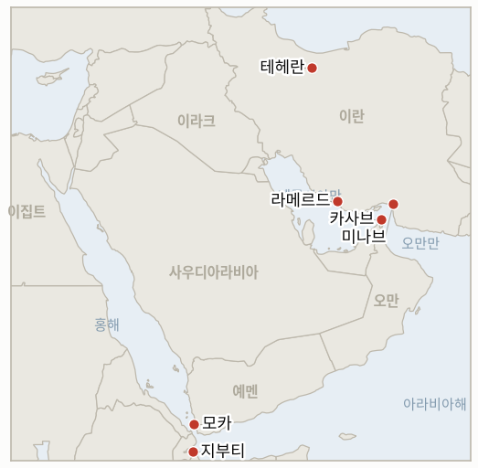

# 중동 일일 브리핑

**2026년 9월 19일**

- **보고 기간:** 약 24시간, 9월 18일 09:00 ~ 9월 19일 09:00 (한국시간)
- **종합 평가:** 금요일 보고 기간은 전쟁의 물리적 전선보다 법적·수사적 전선이 더 뚜렷하게 부각된 시간이었다. 유엔 진상조사단은 2월 28일 미나브 학교와 라메르드 스포츠센터에 대한 미국의 공습(합산 사망자 최소 178명)에 전쟁범죄에 해당할 "합리적 근거"가 있다고 판단했고, 백악관은 이를 전면 거부했다(§1.1). 이란은 두 갈래로 응수했다: 혁명수비대는 오만 카사브 인근 호르무즈 해협에서 토고 국적 유조선 트렌드호를 타격했다고 주장했고, 같은 날 테헤란에서는 정부가 전쟁 발발 이후 최대 규모라고 표현한 수십만 명 규모 집회가 열려 강경파 결집을 과시했다. 이는 아직 이란 측 확인이 없는 트럼프의 "직접 대화" 주장과 어색하게 대비된다(§1.2). 시장은 전황보다 완화적으로 반응했다: 유가는 사우디의 오만 우회 경로 대응을 새로운 호르무즈 사건보다 더 크게 반영하며 3거래일 연속 하락했고, 케빈 워시 연준 의장의 짧고 매파적인 기자회견과 국채 금리 하락이 전반적 위험선호 심리를 끌어올렸다(§1.3). 예멘의 인도주의 상황은 자체 궤적대로 계속 악화됐지만, 유엔 산하 기구 간에도 규모를 두고 의견이 엇갈렸다: IOM의 실향민 11만 2천명 집계는 이틀 전 WFP가 발표한 12만 5천명보다 낮았고, 그 사이 수천 명이 추가로 지부티로 피난했다(§1.4). 한국은 글로벌 위험선호 분위기를 코스피의 수 주 만에 가장 큰 상승폭으로 흡수했으며, 이재명 대통령은 워싱턴에서 루비오 장관의 카운터파트인 조현 외교장관을 만나 한국을 전쟁에 "끌어들이는" 어떠한 호르무즈 파병도 배제한다고 공개적으로 밝히는 한편 청해부대 역할 확대 방안을 검토 중이라고 밝혔고, 서울은 국회 보고 지연을 이유로 3500억 달러 규모 대미 투자 발표를 한 주 뒤로 미뤘다(§1.5).

---

## 1. 무슨 일이 있었나

<figure style="float:right; width:46%; margin:2pt 0 8pt 14pt;">

<figcaption style="font-size:8pt; color:#666; text-align:center; margin-top:3pt; font-style:italic;">주요 논의 지점</figcaption>
</figure>

### 1.1 유엔 진상조사단, 미나브·라메르드 공습에 미국 전쟁범죄 "합리적 근거" 인정

유엔 인권이사회에 보고하는 유엔 이란 독립국제진상조사단은 2월 28일 있었던 두 건의 공습, 즉 호르모즈간주 미나브의 한 초등학교(현지 시각 오전 10시 30분 피격, 현지 및 독립적으로 확인된 사망자 156~157명, 이 중 어린이 120명·교사 26명 포함, 일부 희생자는 6세)와 같은 날 오후 파르스주 라메르드의 스포츠센터(사망자 22명, 어린이 4명 포함, 부상자 100명 이상)에 대해 미국이 "무모하게" 행동해 전쟁범죄를 저질렀을 "합리적 근거"가 있다고 판단했다. 조사단이 인용한 무기 전문가들은 미나브 현장에서 미국제 토마호크 지상공격 순항미사일을, 라메르드 현장에서 미국제 정밀타격미사일(PrSM)을 식별해 두 곳 모두 이란산 무기 가능성을 배제했다([Al Jazeera](https://www.aljazeera.com/news/2026/9/18/united-nations-says-us-may-have-committed-war-crimes-in-iran-what-it-means); [NPR](https://www.npr.org/2026/09/17/nx-s1-5972934/us-iran-war-un-report-alleged-war-crimes)). 백악관은 조사 결과를 전면 거부했으며, 대변인은 인권이사회가 "수십 년간 인권을 위해 이룬 것이 없고 비전문적인 헛소리만 늘어놓고 있다"고 말했고, 당국자들은 학교 공습을 오래된 정보에 따른 것이라고 설명했다. 이 보고서는 자동적인 법적 효력은 없다: 미국은 국제사법재판소(ICJ) 관할권에서 탈퇴했고 이란은 국제형사재판소(ICC) 회원국이 아니므로, 후속 조치가 있다면 사법절차보다 외교 채널이나 안전보장이사회를 통할 가능성이 크다. 신규 **IND-20260919-1**은 이번 판단이 공식적인 후속 조치로 이어지는지를 추적한다. **신뢰도: 높음** (조사단 판단 및 사망자 수, 유엔 보고서와 다수 1등급 매체 수렴); 백악관의 거부 입장은 **높음** (공식 발언).

### 1.2 이란, 카사브 인근 유조선 타격 주장 속 테헤란서 수십만 명 집회

이란 혁명수비대는 9월 18일 호르무즈 해협에서 토고 국적 유조선 트렌드호를 타격했다고 밝히며 해당 선박의 통항 시도를 "불법 시도"로 규정했다. 이와 별도로 UKMTO(영국해사무역작전기구)는 오만 카사브 북동쪽 16해리 지점에서 "보안 사건"이 발생했다고 보고했으며, 선원은 안전하고 환경 피해는 없다고 전했다. AP는 이란 측 주장을 독립적으로 확인하지 못했다([AP via Spectrum News](https://spectrumlocalnews.com/us/snplus/international/2026/09/18/u-s--iran-war-oil-tanker-strait-of-hormuz-rally)). 같은 날 테헤란에서는 국영 매체가 2월 28일 전쟁 발발 이후 최대 규모라고 밝힌 수십만 명 규모 집회가 열려 반미·반이스라엘 구호를 외치고 성조기와 이스라엘 국기를 밟는 장면이 연출됐다. 새로운 호르무즈 사건과 전쟁 발발 이후 최대 규모 집회가 같은 날 겹친 것은 강경파 결집으로 읽히며, 아직 이란 측 확인이 없는 트럼프의 "직접 대화" 주장(**IND-20260918-2**) 및 아라그치 외교장관의 별도 이란-오만 "합의" 주장(**IND-20260918-3**)과 어색하게 대비된다. 이번 보고 기간 두 주장 모두 뒷받침하는 증거는 나오지 않았고, **IND-20260916-2**(이란 내부 노선 분화)는 강경파 쪽으로 한층 더 기울었다. **신뢰도: 중간** (유조선 타격 자체는 이란 측 단독 소식통, UKMTO는 사건 발생만 확인하고 귀책은 미확인); 테헤란 집회 규모는 **높음** (AP 통신, 국영 매체, 독립적으로 전쟁 최대 규모로 묘사).

### 1.3 짧고 매파적인 연준 기자회견에 위험선호 심리 회복, 유가 3거래일 연속 하락

9월 18일 브렌트유는 103.87달러(-0.9%), WTI는 100.30달러(-1.6%)로 마감해 3거래일 연속 하락했다. 시장은 이날 새로 발생한 호르무즈 유조선 사건이나 계속되는 사우디-후티 교전보다 사우디아라비아의 오만 우회 수출 경로 대응을 더 크게 반영했다. 일부 매체의 같은 날 집계치는 낮게는 102.41달러까지 내려가 있어, 통신사별 정산가 보도가 일관되지 않다는 본 원장의 기존 지적과 부합한다([Sunday Guardian Live/로이터 전신](https://sundayguardianlive.com/business/oil-price-today-september-18-brent-crude-falls-1-to-around-104-wti-near-101-as-oil-extends-3-day-losses-why-is-oil-falling-despite-saudi-houthi-strikes-287412/); [Vantage Markets](https://www.vantagemarkets.com/market-analysis/why-crude-oil-prices-fell-saudi-pipeline-repair-september-18-2026/)). 케빈 워시 연준 의장은 현직 의장으로는 기록적으로 짧은(약 30분) 정례 기자회견을 열어, 수요일 25bp 인상 결정이 단일 지표가 아니라 지속되는 인플레이션 압력에 따른 것이라고 재확인했다. 미국 증시는 목요일 연준 발표 이후 안도 랠리를 이어갔고(S&P500 +1.1%, 나스닥 +1.7%, 목요일 기준) 10년물 국채 금리는 4.94%로 하락했으며, 이런 흐름은 금요일 유가와 아시아 증시 전반의 위험선호 분위기로 이어졌다. **신뢰도: 높음** (정산가 및 워시 의장 기자회견 내용, 다수 1등급 매체 및 연준 회의록); 호르무즈 사건과 파이프라인 우회 경로의 상대적 비중에 대한 해석은 **중간** (트레이더의 직접 인용이 아닌 해석적 판단).

### 1.4 예멘 실향민 집계, 유엔 기구 간 불일치 속 지부티 피난민 계속 증가

국제이주기구(IOM)는 지난 2주간 예멘 분쟁으로 국내에서 최소 11만 2천명이 실향했으며, 추가로 거의 3천명이 과적된 소형 선박을 타고 아덴만을 건너 지부티로 피신했다고 밝혔다. 지부티 정부는 최대 1만명의 난민 유입에 대비하고 있으며, 이는 보건·교육 서비스에 상당한 부담을 가중시킬 전망이다. IOM은 소수의 에티오피아 출신 이주민도 같은 방향으로 이동하는 조짐이 나타나고 있다고 전했다([AP via Detroit News](https://www.detroitnews.com/story/news/world/2026/09/18/barefoot-terrified-yemenis-flee-houthi-advance/91826003007/); [Business Recorder](https://www.brecorder.com/news/40440155/yemen-conflict-displaces-112000-people-inside-country-thousands-flee-to-djibouti-un-migration-agency-says)). IOM의 11만 2천명 집계는 이틀 전 세계식량계획(WFP)이 발표한 12만 5천명보다 낮은 수치로, 약 1만 3천명의 기구 간 격차는 실제 감소라기보다 집계 방식과 기준 시점의 차이를 반영할 가능성이 크다. **IND-20260918-1**은 어느 한쪽으로 결론짓지 않고 수치 조정을 기다리며 계속 진행 중으로 유지한다. **신뢰도: 높음** (IOM 수치 및 지부티 대비 상황, IOM 성명 및 다수 통신사 수렴); IOM·WFP 수치 조정 가능성은 **중간** (양 기구 모두 서로의 수치를 직접 언급하지 않음).

### 1.5 코스피 2.66% 급등, 이재명 대통령 전투 파병 배제 선언과 대미 투자 발표 연기

코스피는 178.82포인트(+2.66%) 오른 6894.23으로 마감해 장중 한때 6,900선을 돌파했으며, 이는 최근 수 주간 최고의 상승폭이다. 월가 랠리와 미국 국채 금리 하락, 유가 안정이 위험선호 심리를 되살렸고, 외국인 투자자는 9월 8일 이후 처음으로 순매수(4388억원)로 돌아섰다. 반도체주가 상승을 주도해 삼성전자가 3.4%, SK하이닉스가 6.4% 올랐으며, 코스닥은 4거래일 연속 상승해 827.12(+0.60%)를 기록했다. 원화는 1.1원 추가 약세로 1383.3원을 기록해 목요일의 13.6원 급락에 비해 낙폭이 크게 줄었다([Korea Times](https://www.koreatimes.co.kr/economy/others/20260918/kospi-surges-266-on-wall-street-rally-foreign-buying)). 같은 날 워싱턴에서 열린 조현 외교장관과 루비오 국무장관 회담에서 이재명 대통령은 "전쟁에 관여하거나 개입하는 파병은 없다"고 공개적으로 밝히며 전투 파병이나 외국군 지휘 하 배치를 배제했다. 다만 "우리 선박과 원유 수송로, 국민의 생명과 안전을 보호"할 책임이 있다고 인정하며, 새로운 전투 기여가 아니라 기존 청해부대의 역할 확대 방안을 검토 중이라고 확인했다([Korea Herald](https://www.koreaherald.com/article/10878676); [Korea JoongAng Daily](https://www.koreajoongangdaily.com/korea/lee-rules-out-combat-deployment-to-strait-of-hormuz-but-leaves-options-open/12882749)). 조현 장관과 루비오 장관은 별도로 호르무즈 해협의 항행의 자유가 양국 경제에 핵심적이라는 데 뜻을 같이하고 지속적 협의를 약속했으며, 조 장관은 국회의 질의에도 워싱턴의 공식 파병 요청 여부 확인은 하지 않았다([Yahoo News/AP 전신](https://www.yahoo.com/news/articles/rubio-south-korea-foreign-minister-223049732.html)). 한편 이날 회담과 맞춰 발표될 것으로 예상됐던 3500억 달러 대미 투자 중 첫 프로젝트 발표는 자금 조건에 대한 국회 보고 지연으로 다음 주로 미뤄졌다. 이는 **IND-20260911-3**을 상당히 진전시키며, 아래에서 확증으로 종결한다. **신뢰도: 높음** (코스피·코스닥·원화 수치, 다수 한국 금융 매체 수렴); 이재명 대통령 발언은 **높음** (Korea Herald, Korea JoongAng Daily, 연합뉴스발 한국 언론 수렴); 투자 발표 연기는 **중간·높음** (한국 언론 수렴이나 정부의 독립적 확인은 아직 없음).

---

## 2. 심층 분석: 유인과 동기

### 2.1 자동적 법적 효력이 없는데도 유엔 전쟁범죄 판단이 지금 중요한 이유는?

이번 판단의 가치는 사법적이라기보다 평판과 외교 차원에 있기 때문이다. 미국은 ICJ 관할권 밖에, 이란은 ICC 밖에 있어 조사단의 "합리적 근거"라는 표현 자체가 기소를 강제할 수는 없지만, 테헤란이 전쟁 최대 규모 집회를 여는 바로 그 시점에 이란 정부에 유엔이 뒷받침하는 명분을 제공하며, 워싱턴이 전쟁이 협상을 통한 종전으로 향하고 있다는 프레이밍에 맞서 추가 물적 지원을 저울질하는 미국 동맹국들, 그중에서도 한국에게 더 무거운 판단 근거를 제공한다.

### 2.2 이란이 유조선 타격과 최대 규모 집회를 같은 날 함께 벌인 이유는?

두 신호가 서로 다른 대상을 겨냥하기 때문이다. 유조선 타격은 트럼프의 "직접 대화" 주장에도 불구하고 호르무즈 해협이 여전히 분쟁 지대임을 워싱턴과 선사들에 알리는 메시지인 반면, 대규모 집회는 국내 결집용으로 레자에이(IND-20260916-2)의 강경파가 실제 정책 전환 없이도 페제시키안의 온건한 NPT 프레이밍보다 더 강한 결의를 과시할 수 있게 한다. 두 사건을 같은 날 벌이면 어느 한쪽 노선에 대한 실질적 비용을 늘리지 않으면서 통합된 결의라는 인상을 극대화할 수 있다.

### 2.3 새로운 호르무즈 사건과 예멘 교전 지속에도 시장이 랠리를 이어간 이유는?

현재 시장은 해협 자체보다 사우디의 파이프라인 우회 경로를 통해 공급 리스크를 가격에 반영하고 있기 때문이다. 리야드의 오만 우회 경로가 시장의 관심을 흡수하고, 워시 연준 의장이 신뢰를 회복시키는 짧은 기자회견으로 국채 금리를 낮춘 상황에서, 유조선 통항 사건 한 건이나 예멘 실향민 수치 한 건이 더 나온다고 해서 7~8월처럼 위험 프리미엄을 즉시 끌어올리지는 않는다.

### 2.4 WFP와 IOM이 비슷한 기간에 대해 서로 다른 예멘 실향민 수치를 내놓는 이유는?

두 기구가 아직 본 원장이 조정하지 않은 서로 다른 집계 기준과 시점을 쓰기 때문이다. 이틀 전 WFP의 12만 5천명 수치는 최대 150만명이라는 전향적 계획 상한을 명시한 광범위한 분쟁 실향민 수치였던 반면, IOM의 11만 2천명은 더 좁은 지리·시간 범위의 2주간 이동 집계로 규정된다. 두 기구의 공동 성명이 없는 상황에서 가장 타당한 해석은 두 수치 모두 방향성은 맞지만 직접 비교는 어렵다는 것으로, 이는 본 원장이 해협 통항량 집계 기준 논란에서 이미 본 바 있는 패턴이다.

### 2.5 이재명 대통령이 모호한 입장 대신 워싱턴 회담을 앞두고 한국의 호르무즈 입장을 공개적으로 밝힌 이유는?

모호함이 명확함보다 더 큰 비용을 치르는 상황이 됐기 때문이다. 조현-루비오 회담 자체가 답을 요구하는 시점이 됐고 9월 24일·28일 원장 기한이 다가오는 가운데, "아직 결정된 바 없다"는 입장만 계속 유지하는 것은 워싱턴에서 숙고가 아니라 회피로 읽힐 위험이 있었다. 반면 "전투는 없지만 청해부대 역할은 확대"라는 공개적 프레이밍은 동맹에 대한 호응과 확고한 국내 레드라인을 동시에 주장할 수 있게 해주지만, 대통령 스스로 인정했듯 "보호" 활동과 "전쟁 인접" 활동의 경계가 실제로 흐려질 경우 이제 그 구분을 공개적으로 책임져야 하는 대가가 따른다.

---

## 3. 한국에 대한 정책적 함의

**익스포저 현황:** 한국의 원유 수입은 여전히 약 70%가 호르무즈 해협 통항에 의존하고 있으며, LNG 수입의 약 36%가 중동산으로 카타르 라스라판이 최대 LNG 공급 익스포저다(`instructions/korea-exposure.md` 참조, 2026년 8월 14일 최종 업데이트, 이번 보고 기간 업데이트 불필요). 금요일 코스피가 6894.23(+2.66%)까지 오른 것은 본 원장이 기록한 7월 랠리 시기 이후 가장 큰 하루 상승폭으로, 중동 관련 요인이 아니라 글로벌 위험선호 로테이션에 따른 것이다. 원화의 1.1원이라는 상대적으로 작은 약세폭(목요일의 13.6원 하락 대비)은 외환시장이 코스피 랠리를 기존 추세의 반전이 아니라 유가·연준발 압력에 대한 부분적 상쇄로 받아들이고 있음을 시사한다.

**사안별 함의:**

- **미나브·라메르드 공습에 대한 유엔 전쟁범죄 판단(§1.1):** 한국에 직접적인 호르무즈 또는 무역 익스포저는 없지만, 미국 주도 작전에 대한 한국의 물적 기여를 둘러싼 평판 비용 계산을 한층 예리하게 만들며, 외교부가 지금까지 순수 안보 프레이밍으로 다뤄온 사안과 함께 고려할 가치가 있다.
- **카사브 인근 이란의 유조선 타격과 테헤란 대규모 집회(§1.2):** 이번 보고 기간 통항량 헤드라인 수치가 보고되지 않았음에도 호르무즈 해협이 여전히 활성 위험 지대임을 재확인시킨다. 한국 선사와 보험업계는 오늘의 유가 안정을 해협 자체의 안정으로 해석해서는 안 된다.
- **짧은 매파적 연준 기자회견 속 유가 3거래일 연속 하락(§1.3):** 산업통상자원부와 한국 정유사들은 이번 주 하락을 파이프라인 우회 논지에 따른 점진적 완화로 볼 수 있지만, 해협 자체의 위험(§1.2)을 고려하면 아웃티지 이전 계획 가정으로 되돌아가는 것은 시기상조다. 9월 23일 IND-20260917-2 검증이 지속성을 판단할 더 가까운 시험대다.
- **WFP-IOM 예멘 실향민 수치 불일치(§1.4):** 정책 신호라기보다 데이터 품질에 대한 경고다. 예멘 실향민 수치를 인용하는 한국의 인도주의·해운 리스크 평가는 현재 약 1만 3천명의 격차를 감안해 출처 기구를 명시해야 한다.
- **코스피 2.66% 급등과 이재명 대통령의 호르무즈 발언(§1.5):** 가장 뚜렷한 단기 신호는 한국의 기여가 있다면 새로운 전투 파병이 아니라 청해부대 역할 확대가 될 것이라는 점으로, 9월 24일·28일 기한(IND-20260911-3, IND-20260906-2)에 대해 시장 참여자들이 가격에 반영해야 할 결과 범위를 의미 있게 좁힌다. 연기된 3500억 달러 투자 발표는 이제 다음 주라는 구체적인 관찰 시점이 생겼다.

**검증 가능한 지표:**

- **IND-20260919-1** (신규): 미나브·라메르드 공습에 대한 유엔 진상조사단의 "합리적 근거" 판단이 2주 내에 공식 후속 조치(안보리 회부 시도, 공동 동맹 성명, 거부를 넘어선 미국의 정책 대응)로 이어지는지, 아니면 외교적으로 실효성 없이 남는지 추적한다. 기한 ~2026-10-03.
- **IND-20260919-2** (신규): 카사브 인근 이란의 유조선 타격 주장과 테헤란 대규모 집회가 1주일 내 추가 호르무즈 사건이나 혁명수비대의 확대된 행동으로 이어지며 강경화를 보여주는지, 아니면 후속 작전 없는 일회성 신호 행사로 그치는지 추적한다. 기한 ~2026-09-26.
- **IND-20260919-3** (신규): 국회 보고 지연으로 9월 18일에서 "다음 주"로 미뤄진 한국의 3500억 달러 대미 투자 발표가 해당 기간 내에 이뤄지는지, 아니면 더 지연되는지를 추적하며, 이는 연기가 절차적인지 아니면 이재명 대통령이 언급한 자금 회수·손실 분담 조건에 대한 실질적 이견을 반영하는지 시험한다. 기한 ~2026-09-26.
- **IND-20260911-3** (종결, 확증): 이재명 대통령이 9월 18일 전투 파병을 배제하면서 청해부대 역할 확대 검토를 확인한 공개 발언은, 본 지표의 ~9월 24일 기한이 시험하던 공개된 공식 권고에 해당하며 엿새 앞서 충족됐다.
- **IND-20260918-1** (진행 중): IOM의 예멘 실향민 수치(11만 2천명)가 이틀 전 WFP 수치(12만 5천명)보다 낮다. 어느 쪽으로도 결론짓지 않고 수치 조정을 기다리며 진행 중으로 유지한다. 기한 ~2026-10-09.
- **IND-20260918-2** (진행 중): 트럼프의 "직접 접촉" 주장은 여전히 이란 측 확인이 없다. 오늘의 유조선 타격과 대규모 집회는 이란의 임박한 확인과는 배치되는 신호로 읽힌다. 기한 ~2026-09-25, 엿새 남음.
- **IND-20260918-3** (진행 중): 아라그치 외교장관의 이란-오만 "합의" 재개방 주장은 이번 보고 기간 오만이나 GCC의 확인을 얻지 못했다. 기한 ~2026-10-02.
- **IND-20260917-2** (진행 중): 라이트 장관의 "며칠" 파이프라인 복구 프레이밍과 CNBC가 인용한 6주 추정치가 대립 중이며, 이번 보고 기간 확정 복구는 없었다. 기한 ~2026-09-23, 나흘 남음.
- **IND-20260917-1** (진행 중, 반증 쪽으로 기울어짐): 사우디아라비아의 카이로 연대는 여전히 성명 수준에 그치며, 이번 보고 기간 새로운 진전은 없었다. 기한 ~2026-10-01.
- **IND-20260906-2** (진행 중): 이번 보고 기간 한국의 호르무즈 파병에 대한 공식 국회 동의안이나 본회의 표결은 없었으나, 이재명 대통령의 공개 발언이 향후 동의안의 범위를 좁혔다. 기한 ~2026-09-28, 9일 남음.
- **IND-20260916-2** (진행 중): 페제시키안의 유화적 프레이밍과 레자에이의 강경 노선 사이의 이란 내부 분화는 오늘의 집회와 유조선 타격으로 강경 쪽으로 한층 더 기울었으나, 이를 어느 쪽으로도 결론짓는 이란의 통일된 입장은 아직 없다. 기한 ~2026-09-30.

---

## 4. 관찰 목록

- **유엔 전쟁범죄 판단의 후속 조치(IND-20260919-1):** 거부를 넘어선 안보리, 동맹, 미국 정책 대응으로 이어지는지 여부.
- **이란의 유조선 타격과 테헤란 집회가 강경화 추세를 보여주는지(IND-20260919-2):** 1주일 내 추가 호르무즈 사건 여부가 가장 가까운 시험대.
- **한국의 연기된 3500억 달러 투자 발표(IND-20260919-3):** 약속대로 다음 주에 이뤄지는지, 아니면 더 지연되는지, 이는 연기의 절차적·실질적 성격을 가늠하는 대리 지표다.
- **라이트 장관의 파이프라인 복구 시한과 CNBC의 6주 추정치(IND-20260917-2):** 9월 23일경이 가장 가까운 구체적 시험대.
- **WFP-IOM 예멘 실향민 수치 격차(IND-20260918-1):** 어느 한쪽이 상대 수치 쪽으로 조정하는지 여부.
- **한국 국회의 파병 동의안(IND-20260906-2):** 9월 28일을 앞둔 가장 가까운 절차적 시험대로, 이재명 대통령의 공개적인 비전투 프레이밍으로 범위가 좁혀짐.
- **사우디아라비아의 카이로 연대(IND-20260917-1):** 10월 1일 이전에 이집트와의 공조가 실제 작전 기여로 전환되는지 여부.
- **카타르 라스라판 LNG 선적(IND-20260714-4):** 여전히 최신 주간 선적 수치 없음, 본 원장에서 가장 오래 미해결로 남아 있는 지표.

---

## 5. 출처 신뢰도 요약

| 주장 | 출처 | 신뢰도 |
|---|---|---|
| 유엔 조사단, 미나브(156~157명 사망)·라메르드(22명 사망) 공습에 미국 전쟁범죄 합리적 근거 인정; 백악관은 결과 거부 | Al Jazeera, NPR (1등급, 유엔 조사단 보고서) | 높음 |
| 이란, 혁명수비대가 카사브 인근에서 유조선 트렌드호 타격 주장; UKMTO는 사건 확인, 귀책은 미확인 | AP 전신 via Spectrum News (1등급) | 중간 |
| 테헤란에서 수십만 명 규모 집회, 전쟁 최대 규모 | AP 전신, 국영 매체 (1~2등급) | 높음 |
| 9월 18일 브렌트유 103.87달러(-0.9%), WTI 100.30달러(-1.6%) 마감, 3거래일 연속 하락 | 로이터 전신 via Sunday Guardian Live, HDFC Sky, Vantage Markets (1~2등급, 일부 정산가 불일치) | 높음 |
| 워시 연준 의장의 짧은 매파적 기자회견; 국채 금리 4.94%로 하락 | CNBC, 연준 회의록 (1등급) | 높음 |
| IOM: 예멘 2주간 11만 2천명 실향; 약 3천명 추가로 지부티 피난 | AP 전신, Detroit News, Business Recorder, Arab News (1~2등급, 수렴) | 높음 |
| 코스피 +2.66% 6894.23; 코스닥 +0.60% 827.12; 원화 1383.3원으로 약세 | Korea Times, SBS (1~2등급, 수렴) | 높음 |
| 이재명 대통령, 전투 파병 배제·청해부대 역할 확대 검토 발언 | Korea Herald, Korea JoongAng Daily, 한국 통신사 보도 (1~2등급, 수렴) | 높음 |
| 서울의 3500억 달러 투자 발표, 국회 보고 지연으로 다음 주로 연기 | 한국 언론(서울경제, 경향신문) 수렴, 정부 공식 확인은 아직 없음 | 중간·높음 |
