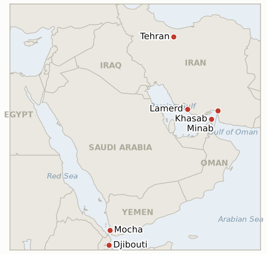

# Middle East Daily Briefing

**September 19, 2026**

- **Reporting window:** ~24 hours, September 18, 09:00 to September 19, 09:00 KST
- **Overall assessment:** Friday's window carried the war's legal and rhetorical fronts further than its physical one: a UN fact-finding mission found "reasonable grounds" that the United States committed war crimes in its February 28 strikes on a Minab school and a Lamerd sports complex that together killed at least 178 people, a finding the White House flatly rejected (§1.1). Iran answered in kind on two tracks, its Revolutionary Guard claiming a strike on the Togo-flagged tanker *Trend* inside the Strait of Hormuz near Khasab, Oman, even as hundreds of thousands rallied in Tehran in what the government called the war's largest demonstration to date, a display of hardline consolidation that sits uneasily against Trump's still-uncorroborated "direct talks" claim (§1.2). Markets read the day as more reassuring than the war news implied: oil fell a third straight session as traders weighted Saudi Arabia's Oman-route pipeline workaround over the fresh Hormuz incident, while Fed Chair Kevin Warsh's brief, hawkish press conference and retreating Treasury yields helped lift broader risk appetite (§1.3). Yemen's humanitarian picture kept worsening on its own track, though the UN's own agencies now disagree on the scale, IOM's 112,000 displaced running below WFP's 125,000 figure from two days earlier as thousands more Yemenis crossed to Djibouti (§1.4). South Korea absorbed the global risk-on mood with KOSPI's sharpest single-day gain in weeks, even as President Lee Jae-myung, meeting Secretary Rubio's counterpart Foreign Minister Cho Hyun in Washington, publicly ruled out any Hormuz deployment that would draw Korea "into" the war while floating an expanded Cheonghae Unit role instead, and Seoul pushed its planned $350 billion US investment announcement back a week over delayed National Assembly reporting (§1.5).

---

## 1. What Happened

<figure style="float:right; width:46%; margin:2pt 0 8pt 14pt;">

<figcaption style="font-size:8pt; color:#666; text-align:center; margin-top:3pt; font-style:italic;">Major places of discussion</figcaption>
</figure>

### 1.1 UN Fact Finding Mission Finds Reasonable Grounds for US War Crimes at Minab and Lamerd

The Independent International Fact-Finding Mission on the Islamic Republic of Iran, reporting to the UN Human Rights Council, found "reasonable grounds" that the United States acted "recklessly" and may have committed war crimes in two February 28 strikes: a primary school in Minab, Hormozgan province, hit at 10:30am local time (156 to 157 dead per local and independently documented sources, including 120 schoolchildren and 26 teachers, with some victims as young as six), and a sports complex in Lamerd, Fars province, hit the same afternoon (22 dead including four children, more than 100 injured). Weapons experts cited by the mission identified a US Tomahawk Land Attack Missile at Minab and a US Precision Strike Missile at Lamerd, ruling out Iranian-made munitions at both sites ([Al Jazeera](https://www.aljazeera.com/news/2026/9/18/united-nations-says-us-may-have-committed-war-crimes-in-iran-what-it-means); [NPR](https://www.npr.org/2026/09/17/nx-s1-5972934/us-iran-war-un-report-alleged-war-crimes)). The White House rejected the findings outright, a spokesperson saying the Human Rights Council "has accomplished nothing for human rights, spouting unserious nonsense for decades," and officials attributed the school strike to outdated intelligence. The report carries no automatic legal consequence: the US withdrew from ICJ jurisdiction and Iran is not an ICC member, so any follow-through would likely run through diplomatic or Security Council channels rather than a court. New **IND-20260919-1** tracks whether the finding draws any formal follow-up. **Confidence: High** on the mission's findings and casualty figures (UN mission report, multiple Tier 1 outlets converging); **High** on the White House's rejection (on-record statement).

### 1.2 Iran Claims Tanker Strike Near Khasab as Hundreds of Thousands Rally in Tehran

Iran's Revolutionary Guard Corps said it struck the Togo-flagged oil tanker *Trend* in the Strait of Hormuz on September 18, calling the vessel's transit an "illegal attempt"; UKMTO separately reported a "security incident" 16 nautical miles northeast of Khasab, Oman, with the crew reported safe and no environmental damage, and the Associated Press could not independently verify Iran's attribution ([AP via Spectrum News](https://spectrumlocalnews.com/us/snplus/international/2026/09/18/u-s--iran-war-oil-tanker-strait-of-hormuz-rally)). The same day, hundreds of thousands of Iranians rallied in Tehran in what state media called the largest demonstration since the war began February 28, chanting anti-American and anti-Israeli slogans and trampling US and Israeli flags. The pairing of a fresh Hormuz incident with the war's largest domestic rally reads as hardline consolidation rather than openness, sitting uneasily against both President Trump's still-uncorroborated "direct talks" claim (**IND-20260918-2**) and Araghchi's separate "agreed" Iran-Oman reopening claim (**IND-20260918-3**); neither claim gained supporting evidence this window, and **IND-20260916-2** (Iran's internal split) now leans further toward the hardline pole. **Confidence: Medium** on the tanker strike itself, Iran-sourced only with UKMTO confirming an incident but not attribution; **High** on the Tehran rally's scale (AP wire, state media, independently described as the war's largest).

### 1.3 Oil Falls a Third Straight Session as a Brief Hawkish Fed Presser Lifts Risk Appetite

Brent settled $103.87 (-0.9%) and WTI $100.30 (-1.6%) on September 18, a third consecutive declining session, as traders weighted Saudi Arabia's Oman-route export workaround more heavily than the day's fresh Hormuz tanker incident or continuing Saudi-Houthi strikes; other outlets' same-day reads ranged as low as $102.41, a divergence consistent with this ledger's standing note on inconsistent settle reporting across wire services ([Sunday Guardian Live/Reuters wire](https://sundayguardianlive.com/business/oil-price-today-september-18-brent-crude-falls-1-to-around-104-wti-near-101-as-oil-extends-3-day-losses-why-is-oil-falling-despite-saudi-houthi-strikes-287412/); [Vantage Markets](https://www.vantagemarkets.com/market-analysis/why-crude-oil-prices-fell-saudi-pipeline-repair-september-18-2026/)). Fed Chair Kevin Warsh held the shortest post-meeting press conference on record for a sitting chair (roughly 30 minutes), reiterating that persistent inflation, not any single data point, drove Wednesday's 25 basis point hike; US stocks extended Thursday's post-Fed relief rally (S&P 500 +1.1%, Nasdaq +1.7% Thursday) as the 10-year Treasury yield eased to 4.94%, a combination that carried through into Friday's broader risk-on tone across oil and Asian equities alike. **Confidence: High** on the settle prices and Warsh's press conference framing (multiple Tier 1 outlets, Federal Reserve transcript); **Medium** on the precise causal weighting between the Hormuz incident and the pipeline workaround, an interpretive read rather than a quoted trader rationale.

### 1.4 UN Agencies Diverge on Yemen's Displacement Count as Djibouti's Refugee Total Keeps Climbing

The International Organization for Migration said Yemen's conflict has displaced at least 112,000 people inside the country over the past two weeks, with nearly 3,000 more Yemenis crossing the Gulf of Aden to Djibouti in overcrowded boats; Djibouti's government is preparing for the arrival of up to 10,000 refugees, adding acute pressure on the country's health and education services, and IOM said it is beginning to see a small number of Ethiopian migrants moving the same direction ([AP via Detroit News](https://www.detroitnews.com/story/news/world/2026/09/18/barefoot-terrified-yemenis-flee-houthi-advance/91826003007/); [Business Recorder](https://www.brecorder.com/news/40440155/yemen-conflict-displaces-112000-people-inside-country-thousands-flee-to-djibouti-un-migration-agency-says)). IOM's 112,000 figure sits below the World Food Programme's 125,000 conflict-displacement estimate reported two days earlier (brief 2026-09-18, §1.1), an agency-to-agency gap of roughly 13,000 that likely reflects differing methodologies and cutoff dates rather than a genuine decline, and **IND-20260918-1** is carried open pending a reconciled figure rather than treated as a falsification. **Confidence: High** on the IOM figures and Djibouti's preparations (IOM statement, multiple wire outlets converging); **Medium** on reconciling the IOM and WFP totals, since neither agency has addressed the other's number directly.

### 1.5 KOSPI Surges 2.66 Percent as Lee Rules Out Combat Deployment and Seoul Delays Its Investment Announcement

KOSPI jumped 178.82 points (+2.66%) to 6894.23, briefly topping 6,900, its best session in weeks, as a Wall Street rally, retreating US Treasury yields and stabilizing oil revived risk appetite; foreign investors returned as net buyers (438.8 billion won) for the first time since September 8, chip stocks led (Samsung Electronics +3.4%, SK hynix +6.4%), and KOSDAQ extended a fourth straight gain to 827.12 (+0.60%), even as the won weakened a further 1.1 won to 1383.3, a far smaller move than Thursday's 13.6-won drop ([Korea Times](https://www.koreatimes.co.kr/economy/others/20260918/kospi-surges-266-on-wall-street-rally-foreign-buying)). At the Washington meeting between Foreign Minister Cho Hyun and Secretary Rubio, held the same day, President Lee Jae-myung stated publicly that "there will be no deployment of troops or military assets that involves us in or draws us into wars," ruling out combat deployment or placing Korean forces under foreign command, while acknowledging Seoul must "protect Korean ships, oil routes and nationals" and confirming the government is reviewing an expanded role for the existing Cheonghae anti-piracy unit rather than a new combat contribution ([Korea Herald](https://www.koreaherald.com/article/10878676); [Korea JoongAng Daily](https://www.koreajoongangdaily.com/korea/lee-rules-out-combat-deployment-to-strait-of-hormuz-but-leaves-options-open/12882749)). Cho and Rubio separately agreed that Hormuz freedom of navigation is critical to both economies and pledged continued consultations, while Cho declined to confirm under National Assembly questioning whether Washington has formally requested a deployment ([Yahoo News/AP wire](https://www.yahoo.com/news/articles/rubio-south-korea-foreign-minister-223049732.html)); separately, Seoul's planned announcement of the first project under its $350 billion US investment commitment, expected to coincide with the meeting, was pushed back to next week after delayed National Assembly reporting on the fund's terms. This substantially advances **IND-20260911-3**, resolved confirmed below. **Confidence: High** on the KOSPI, KOSDAQ and won figures (multiple Korean financial outlets converging); High on Lee's quoted statement (Korea Herald, Korea JoongAng Daily, Yonhap-sourced Korean press converging); **Medium-High** on the investment announcement's delay (Korean press converging on the National Assembly reporting cause, not yet independently confirmed by a government readout).

---

## 2. Deep Dive: Incentives and Motives

### 2.1 Why does a UN war crimes finding matter now, when it carries no automatic legal consequence?

Because the finding's value is reputational and diplomatic rather than juridical: with the US outside ICJ jurisdiction and Iran outside the ICC, the mission's "reasonable grounds" language cannot itself compel prosecution, but it gives Iran's government a UN-endorsed talking point precisely as Tehran stages its largest wartime rally, and it gives US allies weighing further material support, Korea among them, a harder data point to weigh against Washington's framing that the war is winding down toward a negotiated end.

### 2.2 Why would Iran pair a tanker strike with its largest rally on the same day, rather than either alone?

Because the two signal different audiences simultaneously: the tanker strike is a message to Washington and shippers that Hormuz remains contested despite Trump's "direct talks" claim, while the mass rally is a domestic consolidation move that lets Rezaei's hardline faction (IND-20260916-2) visibly out-signal Pezeshkian's more conciliatory NPT framing without requiring an actual policy reversal; running both the same day maximizes the appearance of unified resolve at minimal marginal cost to either track.

### 2.3 Why did markets shrug off a fresh Hormuz incident and continuing Yemen fighting to keep rallying?

Because traders are pricing the war's supply risk through the Saudi pipeline workaround rather than through the strait itself at this point: with Riyadh's Oman-route alternative absorbing the market's attention and the Fed's Warsh delivering a short, credibility-restoring press conference that eased bond yields, the marginal news of one more contested tanker transit or one more Yemen displacement figure no longer moves the day's price action the way it did in July and August, when each new incident reliably spiked the risk premium.

### 2.4 Why do WFP and IOM report different Yemen displacement totals for roughly the same period?

Because the two agencies count on different bases and timelines that this ledger has not yet reconciled: WFP's 125,000 figure two days ago described broader conflict displacement with an explicit forward-looking planning ceiling (up to 1.5 million), while IOM's 112,000 figure is framed as a two-week rolling count with a narrower geographic and temporal scope; absent a joint statement, the honest read is that both numbers are probably directionally correct but not directly comparable, a pattern this ledger has seen before with competing transit-count bases in the strait itself.

### 2.5 Why did Lee choose to state Korea's Hormuz position publicly now rather than staying ambiguous through the Washington meeting?

Because ambiguity was becoming costlier than clarity: with the Cho-Rubio meeting itself forcing the question and the September 24 and 28 ledger deadlines approaching, continuing to say only "nothing has been decided" risked reading in Washington as evasion rather than deliberation, while a public "no combat, but an expanded Cheonghae role" framing lets Lee claim both alliance responsiveness and a firm domestic red line simultaneously, at the cost of now owning that distinction publicly if the line between "protective" and "war-adjacent" activity blurs in practice, a tension Lee himself acknowledged.

---

## 3. Policy Implications for South Korea

**Exposure snapshot:** South Korea's crude imports remain roughly 70% dependent on Strait of Hormuz transit and about 36% of its LNG imports come from the Middle East, with Qatar's Ras Laffan as the single largest LNG supplier exposure (see `instructions/korea-exposure.md`, last updated August 14, 2026, no update needed this window). Friday's KOSPI surge to 6894.23 (+2.66%) is the sharpest single-day gain logged in this ledger since the July rally era, driven by a global, not Middle East specific, risk-on rotation; the won's much smaller 1.1-won weakening (versus Thursday's 13.6-won move) suggests FX markets read the KOSPI rally as a partial offset to oil and Fed-driven pressure rather than a reversal of the underlying trend.

**Implications by development:**

- **The UN war crimes finding on the Minab and Lamerd strikes (§1.1):** carries no direct Hormuz or trade exposure for Korea, but it sharpens the reputational cost calculus for any Korean material contribution to the US-led campaign, worth weighing alongside the purely security-based framing MOFA has used to date.
- **Iran's tanker strike near Khasab and Tehran's mass rally (§1.2):** reinforces that Hormuz remains an active risk zone even as headline transit counts stay unreported this window; Korean shippers and insurers should not read the day's calmer oil price as evidence the strait itself has stabilized.
- **Oil's third straight decline against a brief hawkish Fed presser (§1.3):** MOTIE and Korean refiners can treat this week's declines as incremental relief on the pipeline-workaround thesis, but the underlying strait risk (§1.2) argues against reverting to pre-outage planning assumptions; the IND-20260917-2 test on September 23 remains the nearer read on durability.
- **The WFP-IOM Yemen displacement discrepancy (§1.4):** a data-quality caution rather than a policy signal; Korean humanitarian and shipping-risk assessments citing Yemen displacement figures should flag the source agency given the current ~13,000-person gap.
- **KOSPI's 2.66% surge and Lee's Hormuz statement (§1.5):** the clearest near-term signal is that Korea's contribution, if any, will be a Cheonghae Unit expansion rather than a new combat deployment, meaningfully narrowing the range of outcomes market participants should price for the September 24 and 28 deadlines (IND-20260911-3, IND-20260906-2); the delayed $350 billion investment announcement is now a concrete date to watch next week.

**Testable indicators:**

- **IND-20260919-1** (new): The UN fact-finding mission's "reasonable grounds" finding on US war crimes at Minab and Lamerd either draws a formal follow-up (a Security Council referral attempt, a coordinated allied statement, or a US policy response beyond rejection) within two weeks, or the finding remains diplomatically inert. Deadline ~2026-10-03.
- **IND-20260919-2** (new): Iran's tanker strike claim near Khasab and its mass Tehran rally either mark a hardening that produces further Hormuz incidents or expanded IRGC action within a week, or the episode stays a one-off signaling event with no operational follow-through. Deadline ~2026-09-26.
- **IND-20260919-3** (new): South Korea's $350 billion US investment announcement, postponed from September 18 "to next week" over delayed National Assembly reporting, either lands within that window or slips further, testing whether the delay was procedural or reflects the substantive disagreement Lee flagged over fund recovery and loss-sharing terms. Deadline ~2026-09-26.
- **IND-20260911-3** (resolved, confirmed): President Lee's September 18 public statement ruling out combat deployment while confirming an expanded Cheonghae Unit role under review constitutes the disclosed formal recommendation this indicator's ~September 24 deadline was testing, six days early.
- **IND-20260918-1** (open): IOM's lower 112,000 Yemen displacement figure sits below WFP's 125,000 count from two days earlier; carried open pending a reconciled figure rather than resolved either way. Deadline ~2026-10-09.
- **IND-20260918-2** (open): Trump's "direct contact" claim remains uncorroborated by Iran; today's tanker strike and mass rally read as inconsistent with an imminent Iranian confirmation. Deadline ~2026-09-25, six days out.
- **IND-20260918-3** (open): Araghchi's Iran-Oman "agreed" reopening claim drew no Omani or GCC corroboration this window. Deadline ~2026-10-02.
- **IND-20260917-2** (open): Wright's "days" pipeline-restart framing against the CNBC-sourced six-week estimate; no confirmed restart this window. Deadline ~2026-09-23, four days out.
- **IND-20260917-1** (open, trending toward falsified): Saudi Arabia's Cairo coalition with Egypt remains statement-only; no new development this window. Deadline ~2026-10-01.
- **IND-20260906-2** (open): No formal National Assembly motion or floor vote on Korea's Hormuz deployment found this window, though Lee's public statement narrows the range of any eventual motion. Deadline ~2026-09-28, nine days out.
- **IND-20260916-2** (open): Iran's internal split between Pezeshkian's conciliatory framing and Rezaei's hardline pole now leans further toward the hardline pole given today's rally and tanker strike, though no unified Iranian statement resolves it either way. Deadline ~2026-09-30.

---

## 4. Watch List

- **The UN war crimes finding's follow-through (IND-20260919-1):** whether it draws any Security Council, allied, or US policy response beyond rejection.
- **Whether Iran's tanker strike and Tehran rally mark a hardening trend (IND-20260919-2):** the nearest test is any further Hormuz incident within the week.
- **South Korea's delayed $350 billion investment announcement (IND-20260919-3):** whether it lands next week as promised or slips further, a proxy for whether the delay was procedural or substantive.
- **Wright's pipeline-restart timeline versus the CNBC-sourced six-week estimate (IND-20260917-2):** the nearest concrete test, around September 23.
- **The WFP-IOM Yemen displacement gap (IND-20260918-1):** whether either agency revises its figure toward the other's.
- **South Korea's National Assembly deployment motion (IND-20260906-2):** the nearest procedural test ahead of September 28, now narrowed by Lee's public no-combat framing.
- **Saudi Arabia's Cairo coalition (IND-20260917-1):** whether Egyptian alignment converts into a real operational contribution before October 1.
- **Qatari LNG loadings at Ras Laffan (IND-20260714-4):** still no fresh weekly loading figure, the ledger's longest-running unresolved indicator.

---

## 5. Source Quality Summary

| Claim | Sources | Confidence |
|---|---|---|
| UN mission finds reasonable grounds for US war crimes at Minab (156-157 dead) and Lamerd (22 dead); White House rejects findings | Al Jazeera, NPR (Tier 1, UN mission report) | High |
| Iran claims IRGC struck tanker Trend near Khasab; UKMTO confirms incident, no attribution verified | AP wire via Spectrum News (Tier 1) | Medium |
| Hundreds of thousands rally in Tehran, largest wartime demonstration | AP wire, state media (Tier 1-2) | High |
| Brent settles $103.87 (-0.9%), WTI $100.30 (-1.6%) on Sept 18, third straight decline | Reuters wire via Sunday Guardian Live, HDFC Sky, Vantage Markets (Tier 1-2, some settle divergence) | High |
| Fed Chair Warsh's short hawkish press conference; Treasury yields ease to 4.94% | CNBC, Federal Reserve transcript (Tier 1) | High |
| IOM: 112,000 displaced in Yemen over two weeks; ~3,000 more flee to Djibouti | AP wire, Detroit News, Business Recorder, Arab News (Tier 1-2, converging) | High |
| KOSPI +2.66% to 6894.23; KOSDAQ +0.60% to 827.12; won weakens to 1383.3 | Korea Times, SBS (Tier 1-2, converging) | High |
| Lee rules out combat Hormuz deployment; floats expanded Cheonghae Unit role | Korea Herald, Korea JoongAng Daily, Korean wire press (Tier 1-2, converging) | High |
| Seoul's $350bn investment announcement delayed to next week over National Assembly reporting | Korean press (Seoul Economic Daily, khan.co.kr) converging, not yet government-confirmed | Medium-High |
