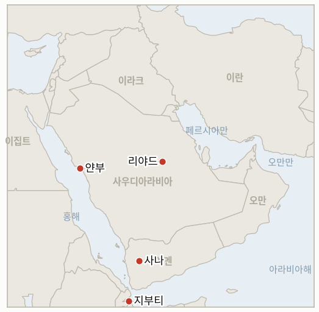

# 중동 일일 브리핑

**2026년 9월 20일**

- **보고 기간:** 약 24시간, 9월 19일 09:00 ~ 9월 20일 09:00 (한국시간)
- **종합 평가:** 이번 주말은 예멘 전쟁이 예멘 국경을 넘어 가장 뚜렷하게 확대된 순간을 보여줬다: 후티 반군이 처음으로 사우디 수도를 직접 타격해 리야드 킹칼리드 국제공항 인근 연료 저장 구역에서 화재가 발생했고 얀부의 아람코 수출 거점에 대한 2차 공격도 주장했으며, 사우디아라비아는 리야드와 지잔을 향한 탄도미사일 2발 요격만을 확인하고 실제 피격 여부는 확인하지 않았다(§1.1). 지난 금요일 유엔 진상조사단 보고서로 촉발된 전쟁범죄 공방에서는, 이란 외교부 부차관이 미국의 책임 회피 시도를 거부했고, 워싱턴 측 대응은 여러 매체가 뒤섞어 보도한 한 가지 뉘앙스에 근거한 것으로 드러났다: 미 국무부 성명은 새로운 징벌적 조치가 아니라 이미 2025년부터 이어진 유엔 인권이사회 탈퇴 상태를 근거로 들었으며, 본 원장은 이 구분을 "공식 후속 조치" 질문의 실제 무게를 판단하는 데 중요한 요소로 다룬다(§1.2). 한 걸음 더 나아가, 트럼프 대통령의 9월 22일 뉴욕 걸프협력회의(GCC) 정상 회동 계획은 전후 전략 관련 논의가 절차적으로는 진전되고 있음을 보여주지만, 문서 자체는 여전히 완성까지 수 주가 남아 있다(§1.3). 한국의 자체 절차적 궤적도 비슷한 근접 시점에서 진전됐다: 조현 외교장관은 3500억 달러 투자 발표 지연이 국내 국회 절차의 문제라는 설명을 재차 강조했고, 재조정된 국회 보고 일정으로 9월 22일이라는 구체적인, 다만 아직 잠정적인 날짜가 제시됐다(§1.4).

---

## 1. 무슨 일이 있었나

<figure style="float:right; width:46%; margin:2pt 0 8pt 14pt;">

<figcaption style="font-size:8pt; color:#666; text-align:center; margin-top:3pt; font-style:italic;">주요 논의 지점</figcaption>
</figure>

### 1.1 후티, 전쟁 발발 후 처음으로 리야드 직접 타격, 사우디 방공망은 미사일 요격

사우디 당국은 예멘 전쟁 재개 이후 처음으로 수도 리야드에 공습경보를 발령했으며, 주민들은 토요일 현지 시각 오전 3시 직전 폭발음을 들었다고 전했다. 몇 시간 뒤 후티 군사 대변인 야히아 사리는 "대량의 탄도·순항미사일과 드론을 사용한 두 건의 성공적 군사작전"을 리야드의 "민감한 지점"과 얀부의 아람코 시설에 대해 수행했다고 밝히며, 이는 사나 공습에 대한 보복이라고 설명했다([Washington Post](https://www.washingtonpost.com/world/2026/09/19/houthis-claim-attacks-sensitive-sites-saudi-arabian-capital/); [Times of Israel](https://www.timesofisrael.com/saudi-capital-issues-first-air-raid-alert-since-renewed-fighting-in-yemen/)). 킹칼리드 국제공항 터미널 뒤편 연료 저장 구역에서 검은 연기 기둥이 크게 치솟았고, AFP 기자는 소방대원들이 불타는 아람코 연료 탱크의 불길을 진화하는 모습을 전했으며, 플라이트레이더24는 공항을 최고 등급인 혼란도 5.0으로 평가했다. 사우디 당국은 당시 피격 성공 여부를 즉각 확인하지 않았다. 일요일 보도에 따르면, 사우디 주도 연합군 대변인은 국영 SPA통신을 통해 토요일 야간 리야드와 지잔을 향해 발사된 탄도미사일 2발을 사우디 방공망이 요격했다고 밝혔는데, 이는 리야드를 향한 공격 시도는 확인하되 공항 화재가 방공망을 뚫은 미사일 때문인지 요격 잔해 때문인지는 확인하지 않은 발표였다([Deccan Herald](https://www.deccanherald.com/world/saudi-arabia-intercepts-two-missiles-fired-by-yemens-houthis-818827.html)). 양측 모두 사상자는 보고하지 않았다. 한편 유엔난민기구(UNHCR)는 일주일이 채 안 되는 기간 동안 거의 3천 명의 예멘인이 해상으로 지부티에 도착했으며 그중 60% 이상이 여성·아동·고령자라고 밝혔다. 오복, 코르 앙가르, 물훌레, 고도리아를 통해 입국이 이뤄지고 있으며, 이는 지난 금요일 IOM 집계와 상충하기보다 부합하는 수치다(2026-09-19 브리핑 §1.4). 신규 **IND-20260920-1**은 이번 공격이 리야드를 향한 지속적 공격 전환을 의미하는지를 추적한다. **신뢰도: 높음** (공습경보, 후티 측 주장, 공항 화재, AFP 및 다수 1등급 매체 수렴); 화재가 미사일 피격에 의한 것인지 요격 잔해에 의한 것인지는 **중간** (사우디 당국은 요격만 확인, 화재 원인 미확인); 지부티 도착 수치는 **높음** (UNHCR 성명).

### 1.2 이란, 미국의 전쟁범죄 책임 회피 거부, 미국 대응의 근거는 새로운 조치 아닌 기존 유엔 인권이사회 탈퇴

이란 외교부 법률·국제업무 담당 부차관 카젬 가리브아바디는 미국의 미나브·라메르드 공습이 "명백한 전쟁범죄"이며 워싱턴이 이에 대한 책임을 "피할 수 없다"고 말하며, 두 공습을 작전상 오류로 규정하는 것을 거부했다([Tehran Times](https://www.tehrantimes.com/news/530152/Dep-FM-US-cannot-escape-war-crimes-responsibility-by-leaving)). 미국 측에서는 국무부 당국자가 유엔 조사단의 판단에 신뢰성을 부여하지 않는다는 입장을 재확인하며 인권이사회가 "반미 수사(修辭)와 반유대주의를 조장"하고 "억압적 정권에 지나치게 관대한 태도를 보인다"고 말했고, 백악관 대변인 애나 켈리는 "이번 분쟁에서 전쟁범죄를 저지른 유일한 당사자는 이란 정권"이라고 밝혔다([CNBC](https://www.cnbc.com/2026/09/18/us-iran-war-trump-hormuz.html)). 다수 매체가 이를 보고서에 대한 대응으로 미국이 인권이사회에서 "탈퇴"한 것으로 보도했지만, CNBC 자체 보도에 따르면 탈퇴 자체는 2025년 2월 트럼프 대통령의 행정명령에서 비롯된 것으로, 이번 보고 기간의 뉴스는 새로운 징벌적 조치가 아니라 워싱턴이 이미 존재하는 탈퇴 상태를 재확인하고 근거로 인용한 것에 가깝다. 본 원장은 이 구분을 중요하게 다루는데, **IND-20260919-1**이 구체적으로 "거부를 넘어서는 미국의 정책 대응"을 시험하는 지표이기 때문이다. 이번 보고 기간 안전보장이사회 회부 시도나 동맹국 공동 성명은 확인되지 않았다. **신뢰도: 높음** (이란·백악관·국무부 인용 발언, Tehran Times·CNBC 등 1~2등급 매체); 탈퇴 시점에 관한 정정은 **중간·높음** (CNBC라는 단일 1등급 소식통에 근거하며, 다수 매체의 느슨한 보도와 대비).

### 1.3 트럼프, 9월 22일 뉴욕서 걸프 정상들과 회동, 완성까지 수 주 남은 이란 전후 전략 논의

트럼프 대통령은 9월 22일 유엔총회 계기 뉴욕에서 걸프협력회의(GCC) 정상 또는 외교장관들을 만나 이란 전쟁의 다음 단계와, 행정부가 여전히 초안을 작성 중인 전후 전략을 논의할 예정이다. 해당 전략에는 이란에 대한 미국 보장 지역 연대, 가자 관련 조치, 아브라함 협정을 사우디-이스라엘 관계 정상화로까지 확대하는 방안이 포함될 수 있다고 보도되며, 당국자들은 문서 완성까지 "몇 주가 더" 필요하다고 밝혔다([Axios](https://www.axios.com/2026/09/16/trump-iran-talks-gulf-leaders-un); [Jerusalem Post](https://www.jpost.com/international/article-908842)). 이번 회동은 본 원장의 두 이란 외교 관련 지표, 즉 아직 확인되지 않은 트럼프의 "직접 대화" 주장(**IND-20260918-2**)과 아라그치 외교장관의 확인되지 않은 이란-오만 "합의" 주장(**IND-20260918-3**)을 해소하기보다 병행하는 성격이며, 걸프국 단독 회동 자체는 두 주장 어느 쪽에 대해서도 증거가 되지 않는다. 이번 보고 기간 이란 측의 확인은 나오지 않았다. **신뢰도: 높음** (회동 일정 및 전후 전략 초점, 다수 1등급 매체 수렴); 보도된 구체적 정책 요소는 **중간** (익명 당국자 소식통, 공식 문서 아님).

### 1.4 서울 투자 브리핑, 9월 22일로 잠정 재조정, 조현 장관 "절차적 문제" 재차 강조

조현 외교장관은 3500억 달러 규모 대미 투자 중 첫 프로젝트 발표 지연이 서울과 워싱턴 간 이견이 아니라 "국내 절차상 걸림돌" 때문이라는 입장을 재차 밝혔으며, 앞서 연기됐던 자금 조건 관련 국회 보고는 9월 22일로 잠정 재조정됐다. 국회는 이를 조건 확정 전 마지막 단계 중 하나로 보고 있다([Korea JoongAng Daily](https://www.koreajoongangdaily.com/korea/foreign-minister-says-350-billion-us-investment-delay-is-procedural/12880646)). 이번 잠정 일정은 9월 26일 마감 시한 훨씬 전에 **IND-20260919-3**에 대한 구체적인 단기 시험대를 제공한다. 한편 한국 외교부는 호르무즈 파병 문제를 "여전히 검토 중"이라고 밝혔으며, 예정됐던 국가안전보장회의(NSC) 회의는 대면 개최 대신 서면 회의로 전환됐다. 이는 청해부대 확대 발표보다는 낮은 수준의 절차적 조치이나, **IND-20260906-2** 하에서 국회에 아직 안건이 상정되지 않은 상황과 일치한다([경향신문](https://www.khan.co.kr/en/article/202609171729047/)). **신뢰도: 높음** (조현 장관 발언 및 9월 22일 잠정 일정, Korea JoongAng Daily 및 한국 언론 수렴); NSC 서면 회의 전환은 **중간·높음** (한국 언론 단일 소식통, 타사 미확인).

---

## 2. 심층 분석: 동기와 유인

### 2.1 후티는 왜 수개월간 국경 지역과 에너지 시설로 한정했던 공격을 지금 리야드로 직접 확대하려 하는가?

방공망을 실제로 뚫었는지 여부와 무관하게, 수도까지 닿는 공격은 전장 효과보다는 사우디아라비아 자체의 위험 계산을 겨냥한 전략적 신호이기 때문이다. 후티는 예멘 정부군에 대한 지속적 압박이 예멘 남부 접경뿐 아니라 리야드의 영공에서도 대가를 치를 수 있음을 과시하고 있으며, 이는 사우디가 자체 반격 강도를 어느 수준까지 끌어올릴지 저울질하고 카이로 연합 협상(**IND-20260917-1**)이 이집트의 공감을 실제 역량으로 전환할지를 시험하는 바로 이 시점에 이뤄졌다.

### 2.2 미국의 유엔 인권이사회 탈퇴가 새로운 조치인지 기존 상태의 재확인인지가 왜 중요한가?

이 구분이 유엔 조사 결과가 실제로 워싱턴에 어떤 대가를 치르게 했는지를 좌우하기 때문이다. 새로운 징벌적 탈퇴라면 미나브·라메르드 조사 결과가 직접 촉발한 미국-유엔 갈등의 구체적이면서도 상당 부분 상징적인 확대로 읽히지만, 기존 2025년 정책을 재확인하는 것은 수사적 강화에 더 가까우며 **IND-20260919-1**이 시험하려 했던 "공식 후속 조치"보다 실제로는 훨씬 약한 대응이다. 이는 빠르게 흘러가는 뉴스 사이클 속에서 여러 매체가 오래된 정책을 새로운 결과인 것처럼 전달할 수 있음을 보여주는 사례이기도 하다.

### 2.3 전쟁이 계속되고 전략 문서도 완성되지 않은 상태에서 왜 걸프국만 별도로 회동하는가?

문서가 완성되기 전에 관계 구축을 먼저 배치하면 워싱턴은 전략에 포함될 것으로 보이는 요소들, 즉 이란에 대한 지역 연대, 가자 관련 조치, 아브라함 협정의 사우디-이스라엘 관계 정상화로의 확대에 대한 걸프국의 반응을 미리 시험하면서도 문서화 전까지는 수정 여지를 유지할 수 있기 때문이다. 이는 구체적인 시한(중간선거 이후 종전 프레이밍 등)을 반복적으로 제시하고도 어느 쪽도 붙잡을 수 있는 실제 문서는 아직 내놓지 않은 행정부의 반복된 패턴과 일치한다.

### 2.4 서울은 왜 투자 발표와 호르무즈 파병 문제 모두에서 신속하고 결정적인 서사보다 느리고 절차적인 서사를 선호하는가?

절차적 프레이밍은 이재명 정부가 정치적으로 부담스러운 두 결정을 동시에 미루면서도 어느 쪽에서도 지연되는 것처럼 보이지 않게 해주기 때문이다. 투자 발표 지연을 실질적 이견이 아닌 국회 절차의 문제로 규정하면 발표 자체를 실패가 아닌 미래의 성과물로 남겨둘 수 있고, NSC의 서면 회의 전환은 여당 내부 반대(**IND-20260906-2**)가 정리될 시간을 더 벌면서 구체적 사항을 확정하거나 배제해야 하는 고위급 회의 노출을 피하게 해준다.

---

## 3. 한국에 대한 정책적 함의

**노출도 스냅샷:** 한국의 원유 수입은 여전히 약 70%가 호르무즈 해협 통항에 의존하며, LNG 수입의 약 36%가 중동산으로 카타르 라스라판이 최대 LNG 공급 노출처다(`instructions/korea-exposure.md` 참조, 최종 갱신 2026년 8월 14일, 이번 보고 기간 갱신 불필요). 시장은 주말 내내 휴장했으며, 금요일 코스피 종가 6894.23과 원화 1383.3원이 월요일 재개장 전까지 가장 최근 확인된 수치로 남는다.

**전개별 함의:**

- **후티의 첫 리야드 직접 타격(§1.1):** 호르무즈 통항 사건이라기보다 예멘 전선의 확대이지만, 후티의 타격 가능 범위에 들어가는 사우디 자산의 범위를 넓히는 것으로, 산업통상자원부와 사우디 홍해 회랑(`korea-exposure.md`에 명시된, 한국행 화물이 이미 통과하는 얀부 경로)에서 원유를 조달하는 한국 정유사들이 해협 리스크와 함께 고려해야 할 요소다.
- **미-이란 전쟁범죄 공방과 유엔 인권이사회 탈퇴 관련 정정(§1.2):** 한국에 직접적인 무역 노출은 없으나, "탈퇴" 관련 보도의 정정된 해석 자체가 유용하다: 미국 주도 작전에 대한 실질적 기여의 평판 리스크를 저울질하는 한국 정책 당국자들은 재확인된 2025년 정책을 미국의 새로운 고립 증거로 과대평가해서는 안 된다.
- **트럼프의 9월 22일 걸프 정상 회동(§1.3):** 한국 정책 당국이 주시할 더 가까운 구체적 일정은 전후 전략 문서 자체가 아니라 회동 자체이며, 당국자들은 문서 완성이 여전히 수 주 남았다고 밝힌 만큼 목요일 이후 나올 어떤 발표든 완성된 틀이 아닌 방향성에 대한 초기 신호로 읽어야 한다.
- **서울의 투자 브리핑 잠정 재조정 및 호르무즈 NSC 서면 회의(§1.4):** 9월 22일 투자 브리핑 일정은 조 장관의 "절차적" 설명이 유지되는지를 판단할 가장 가까운 구체적 시험대이며, NSC의 서면 회의 전환은 그 이전에 고위급 호르무즈 관련 발표가 임박하지 않았음을 시사한다.

**검증 가능한 지표:**

- **IND-20260920-1** (신규): 후티의 첫 리야드 직접 타격이 사우디 수도를 겨냥한 지속적 공격 전환으로 이어지는지, 아니면 일회성 신호 공격에 그치는지를 시험한다. 시한 ~2026-09-27.
- **IND-20260920-2** (신규): 트럼프의 9월 22일 걸프협력회의(GCC) 정상 회동이 회동 후 일주일 내 전후 전략의 구체적 요소를 도출하는지, 아니면 회동 사실 외에 아무것도 공개되지 않는 탐색적 성격에 그치는지를 시험한다. 시한 ~2026-09-29.
- **IND-20260919-1** (진행 중): 이번 보고 기간 워싱턴의 대응은 새로운 정책이 아니라 재확인된 2025년 유엔 인권이사회 탈퇴에 근거한 것으로 드러났고, 안전보장이사회 회부 시도나 동맹국 공동 성명은 확인되지 않았다. 진행 중, 시한 ~2026-10-03, 당초 보도보다 약한 "공식 후속 조치" 사례.
- **IND-20260919-2** (진행 중): 이번 보고 기간 추가 호르무즈 사건이나 혁명수비대의 공개된 작전상 조치는 확인되지 않았으며, 이번 확전(§1.1)은 호르무즈 해협이 아닌 예멘 전선에서 발생했다. 진행 중, 시한 ~2026-09-26.
- **IND-20260919-3** (진행 중, 확증 쪽으로 기움): 서울의 3500억 달러 투자 관련 국회 보고가 9월 22일로 잠정 확정돼 "다음 주" 범위 안에 있다. 진행 중, 시한 ~2026-09-26.
- **IND-20260918-1** (진행 중): UNHCR의 지부티 도착 거의 3천명 수치는 지난 금요일 IOM 집계와 상충하기보다 부합하며, WFP·IOM·UNHCR 간 조정된 수치는 아직 없다. 진행 중, 시한 ~2026-10-09.
- **IND-20260918-2** (진행 중): 이번 보고 기간 트럼프의 "직접 접촉" 주장에 대한 이란 정부의 확인은 없었다. 진행 중, 시한 ~2026-09-25, 5일 남음.
- **IND-20260918-3** (진행 중): 이번 보고 기간 아라그치 장관의 이란-오만 "합의" 주장에 대한 오만이나 GCC의 확인은 없었다. 진행 중, 시한 ~2026-10-02.
- **IND-20260917-2** (진행 중): 이번 보고 기간 사우디 동서 파이프라인 복구 확인은 없었으며, 라이트 장관의 "며칠" 프레이밍 시한이 이제 3일 남았다. 진행 중, 시한 ~2026-09-23, 3일 남음.
- **IND-20260917-1** (진행 중): 이번 보고 기간 카이로 연합 관련 새로운 진전은 없었다. 진행 중, 시한 ~2026-10-01.
- **IND-20260916-2** (진행 중): 이번 보고 기간 통일된 이란 정부 입장이나 미-이란 채널 공개는 확인되지 않았으며, 리야드 타격(§1.1)은 이란 성명이 아닌 예멘 전선의 사안이다. 진행 중, 시한 ~2026-09-30.
- **IND-20260906-2** (진행 중): 한국 외교부는 호르무즈 파병 문제를 "여전히 검토 중"이라고 밝혔고, NSC 회의는 서면 회의로 전환됐으며, 공식 국회 동의안은 아직 확인되지 않았다. 진행 중, 시한 ~2026-09-28, 8일 남음.

---

## 4. 주시 목록

- **후티의 리야드 타격이 지속적 수도 공격 전환을 의미하는지(IND-20260920-1):** 가장 가까운 시험은 일주일 내 리야드 인근 추가 사건 여부다.
- **트럼프의 9월 22일 걸프 정상 회동(IND-20260920-2):** 전후 전략의 구체적 요소가 공개되는지 여부.
- **서울의 잠정 재조정된 9월 22일 투자 브리핑(IND-20260919-3):** 실제로 해당 일정대로 열리는지 여부.
- **라이트 장관의 파이프라인 복구 "며칠" 프레이밍(IND-20260917-2):** 가장 가까운 구체적 시험대인 9월 23일까지 3일 남음.
- **한국 국회의 호르무즈 파병 동의안(IND-20260906-2):** 9월 28일 시한까지 8일 남았으며, NSC의 서면 회의 전환은 임박한 고위급 조치가 없음을 시사.
- **WFP·IOM·UNHCR의 예멘 실향민 수치(IND-20260918-1):** 세 유엔 기구 간 수치가 여전히 조정되지 않음.
- **사우디의 카이로 연합(IND-20260917-1):** 이집트와의 공감대가 10월 1일 전에 실제 작전 기여로 전환되는지 여부.
- **카타르 라스라판 LNG 선적량(IND-20260714-4):** 여전히 최신 주간 선적 수치가 없는, 본 원장에서 가장 오래 미해결 상태인 지표.

---

## 5. 출처 품질 요약

| 주장 | 출처 | 신뢰도 |
|---|---|---|
| 후티, 리야드·얀부 첫 직접 타격; 킹칼리드 공항 연료고 화재; 사우디 연합군 탄도미사일 2발 요격 확인 | Washington Post, Times of Israel, AFP, Deccan Herald (1~2등급, 수렴) | 주장·화재는 높음, 미사일 관통 여부는 중간 |
| UNHCR: 일주일 내 예멘인 거의 3천명 지부티 도착, 60% 이상 여성·아동·고령자 | UNHCR 보도자료 (1등급) | 높음 |
| 이란 가리브아바디 부차관: 미국이 미나브·라메르드 책임 "피할 수 없다" | Tehran Times (2등급, 이란 국영 연계이나 공식 발언과 부합) | 발언 자체는 높음, 프레이밍은 중간 |
| 미 국무부·백악관 거부 입장 재확인; 유엔 인권이사회 탈퇴는 2025년 2월 행정명령에서 비롯, 신규 조치 아님 | CNBC (1등급) | 높음 |
| 트럼프, 9월 22일 뉴욕서 GCC 정상들과 회동, 전후 전략 완성까지 수 주 남음 | Axios, Jerusalem Post (1~2등급, 수렴) | 회동은 높음, 보도된 정책 요소는 중간 |
| 조현 장관: 3500억 달러 투자 지연은 절차적 문제; 국회 보고 9월 22일로 잠정 재조정 | Korea JoongAng Daily (1~2등급) | 높음 |
| 한국 외교부: 호르무즈 파병 "여전히 검토 중"; NSC 회의 서면 전환 | 경향신문 (2등급, 단일 소식통) | 중간·높음 |
