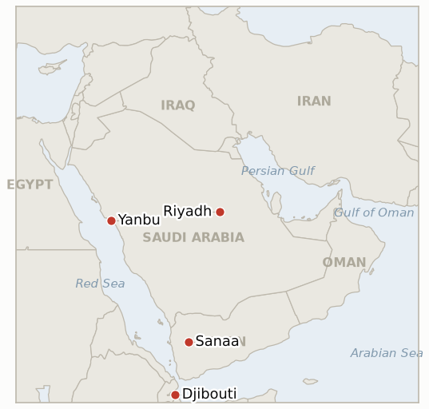

# Middle East Daily Briefing

**September 20, 2026**

- **Reporting window:** ~24 hours, September 19, 09:00 to September 20, 09:00 KST
- **Overall assessment:** The weekend delivered this war's clearest single escalation of Yemen's fighting beyond Yemen's own borders: Houthi forces struck the Saudi capital directly for the first time, hitting a fuel storage area near Riyadh's King Khalid International Airport and claiming a second strike on Aramco's Yanbu export hub, with Saudi Arabia confirming only that it intercepted two ballistic missiles toward Riyadh and Jizan rather than any successful hit (§1.1). On the war crimes track opened by Friday's UN fact-finding mission report, Iran's deputy foreign minister rejected any US evasion of responsibility while Washington's own response turned out to rest on a nuance several outlets blurred together, a State Department statement citing the country's already-standing 2025 withdrawal from the Human Rights Council rather than any new punitive step, a distinction this ledger treats as material to how much weight the "formal follow up" question actually carries (§1.2). Looking a step further out, President Trump's planned September 22 New York meeting with Gulf Cooperation Council leaders signals the postwar strategy conversation is advancing procedurally even as the document itself remains weeks from completion (§1.3). South Korea's own procedural track advanced on the same near horizon, with Foreign Minister Cho Hyun again describing the $350 billion investment announcement's delay as a matter of domestic parliamentary process, now with a concrete, if tentative, September 22 date for the rescheduled National Assembly briefing (§1.4).

---

## 1. What Happened

<figure style="float:right; width:46%; margin:2pt 0 8pt 14pt;">

<figcaption style="font-size:8pt; color:#666; text-align:center; margin-top:3pt; font-style:italic;">Major places of discussion</figcaption>
</figure>

### 1.1 Houthis Strike Riyadh Directly for the First Time as Saudi Air Defences Intercept Missiles

Saudi authorities issued the capital's first air raid alert since Yemen's fighting resumed, with residents reporting explosions shortly before 3am local time Saturday; hours later, Houthi military spokesman Yahya Saree said the movement had carried out "two successful military operations using a large number of ballistic and cruise missiles and drones" against "sensitive sites" in Riyadh and an Aramco facility in Yanbu, describing it as retaliation for a Saudi strike on Sanaa ([Washington Post](https://www.washingtonpost.com/world/2026/09/19/houthis-claim-attacks-sensitive-sites-saudi-arabian-capital/); [Times of Israel](https://www.timesofisrael.com/saudi-capital-issues-first-air-raid-alert-since-renewed-fighting-in-yemen/)). A large plume of black smoke rose from the fuel storage area behind King Khalid International Airport's terminal, with an AFP journalist describing firefighters working to extinguish a burnt out Aramco fuel tank and FlightRadar24 rating the airport at its maximum disruption level; Saudi authorities offered no immediate confirmation of a successful hit. Reporting Sunday, the Saudi led coalition's spokesman said via state news agency SPA that Saudi air defences intercepted two ballistic missiles fired toward Riyadh and the city of Jizan overnight Saturday, a statement that confirms an attempted strike on the capital without confirming whether the visible airport fire came from a missile that penetrated air defenses or from interception debris ([Deccan Herald](https://www.deccanherald.com/world/saudi-arabia-intercepts-two-missiles-fired-by-yemens-houthis-818827.html)). No casualties have been reported by either side. Separately, UNHCR said nearly 3,000 Yemenis have now reached Djibouti by sea in under a week, over 60% women, children and the elderly, arriving via Obock, Khor Angar, Moulhoule and Godoria, a figure consistent with rather than additive to the IOM count reported Friday (brief 2026-09-19, §1.4). New **IND-20260920-1** tracks whether this marks a sustained shift to direct strikes on the Saudi capital. **Confidence: High** on the air raid alert, Houthi claim and airport fire (AFP, multiple Tier 1 outlets converging); **Medium** on whether the fire resulted from a successful missile impact versus interception debris, since Saudi authorities have confirmed only the interceptions, not the fire's cause; **High** on the Djibouti arrivals figure (UNHCR statement).

### 1.2 Iran Rejects Any US Evasion of War Crimes Responsibility as Washington's Own Response Rests on a Dated, Not New, UN Council Withdrawal

Iran's deputy foreign minister for legal and international affairs, Kazem Gharibabadi, said the US strikes on Minab and Lamerd were "blatant war crimes" and that Washington "cannot evade responsibility" for them, rejecting the characterization of either strike as an operational error ([Tehran Times](https://www.tehrantimes.com/news/530152/Dep-FM-US-cannot-escape-war-crimes-responsibility-by-leaving)). On the US side, a State Department official reiterated Washington gives no credibility to the UN mission's findings and that the Human Rights Council "pushes anti-American rhetoric and antisemitism" and "appeases repressive regimes," while White House spokesperson Anna Kelly said "the only party in this conflict that has committed war crimes is the Iranian regime" ([CNBC](https://www.cnbc.com/2026/09/18/us-iran-war-trump-hormuz.html)). Multiple outlets framed this as the US "withdrawing" from the Human Rights Council in response to the report; CNBC's own reporting clarifies the withdrawal itself dates to a February 2025 Trump executive order, so this window's news is Washington citing and reaffirming an already-standing withdrawal rather than taking a new punitive step, a distinction this ledger treats as material given **IND-20260919-1** specifically tests for "a US policy response beyond rejection." No Security Council referral attempt or coordinated allied statement was found this window. **Confidence: High** on Iran's and the White House's/State Department's quoted statements (Tehran Times, CNBC, Tier 1-2 sources); **Medium-High** on the withdrawal-timing clarification, resting on a single Tier 1 source (CNBC) against several outlets' looser framing.

### 1.3 Trump to Meet Gulf Leaders in New York September 22 on a Postwar Iran Strategy Still Weeks From Completion

President Trump is expected to meet Gulf Cooperation Council leaders or foreign ministers on the sidelines of the UN General Assembly in New York on September 22, with discussions focused on next steps in the Iran war and a US postwar strategy the administration is still drafting; officials say the document, which reportedly could include a US guaranteed regional alignment against Iran, Gaza related arrangements, and a possible expansion of the Abraham Accords toward Saudi-Israeli normalization, is still "another few weeks" from completion ([Axios](https://www.axios.com/2026/09/16/trump-iran-talks-gulf-leaders-un); [Jerusalem Post](https://www.jpost.com/international/article-908842)). The meeting sits alongside, rather than resolves, this ledger's two live Iran-diplomacy indicators: Trump's still-uncorroborated "direct talks" claim (**IND-20260918-2**) and Araghchi's still-uncorroborated Iran-Oman "agreed" reopening claim (**IND-20260918-3**); a Gulf-only meeting on postwar architecture is not itself evidence for or against either claim, and no Iranian corroboration of either was found this window. **Confidence: High** on the meeting's scheduling and stated postwar-strategy focus (multiple Tier 1 outlets converging); **Medium** on the specific policy elements reportedly under discussion, sourced to unnamed officials rather than an on-record document.

### 1.4 Seoul's Investment Briefing Tentatively Reset to September 22 as Cho Calls the Delay Procedural

Foreign Minister Cho Hyun repeated his framing that the delay in announcing the first project under South Korea's $350 billion US investment pledge reflects "domestic procedural hurdles" rather than a disagreement between Seoul and Washington, as the government's previously postponed National Assembly briefing on the fund's terms was tentatively rescheduled to September 22, one of the final steps lawmakers say is needed before terms are set ([Korea JoongAng Daily](https://www.koreajoongangdaily.com/korea/foreign-minister-says-350-billion-us-investment-delay-is-procedural/12880646)). The tentative date gives **IND-20260919-3** a concrete near-term test point well inside its September 26 deadline; separately, South Korea's Ministry of Foreign Affairs described the Hormuz deployment question as "still under review," with the National Security Council switching a scheduled session to a written format rather than convening in person, a lower-visibility process step than a Cheonghae Unit announcement would represent but consistent with no motion yet reaching the National Assembly under **IND-20260906-2** ([Kyunghyang Shinmun](https://www.khan.co.kr/en/article/202609171729047/)). **Confidence: High** on Cho's quoted framing and the tentative September 22 date (Korea JoongAng Daily, Korean press converging); **Medium-High** on the NSC's written-session format, a single Korean-press source not yet corroborated elsewhere.

---

## 2. Deep Dive: Incentives and Motives

### 2.1 Why would the Houthis risk striking Riyadh directly now, after months of confining attacks to Saudi border regions and energy infrastructure?

Because a strike that visibly reaches the capital, whether or not it actually penetrated Saudi air defenses, is a strategic signal aimed less at battlefield effect than at Saudi Arabia's own risk calculus: the Houthis are demonstrating that continued pressure on Yemen's government forces carries a cost measured in Riyadh's own airspace, not only in Yemen's contested south, precisely as Saudi Arabia weighs how hard to press its own counteroffensive and as the Cairo coalition talks (**IND-20260917-1**) test whether Egypt will convert sympathy into real capability.

### 2.2 Why does it matter whether the US withdrawal from the Human Rights Council is new or merely restated?

Because the distinction changes what the UN finding has actually cost Washington: a fresh punitive withdrawal would read as a concrete, if largely symbolic, escalation of the US-UN rift specifically caused by the Minab and Lamerd findings, while restating a standing 2025 policy is closer to rhetorical reinforcement of an existing position, a genuinely weaker "formal follow-up" than **IND-20260919-1** was written to test, and a useful reminder that a fast-moving news cycle can let several outlets convert old policy into apparently new consequence.

### 2.3 Why hold a Gulf-only meeting on postwar strategy while the war itself continues and the strategy document is not ready?

Because sequencing the relationship-building before the document exists lets Washington test Gulf states' reactions to the strategy's likely elements, regional alignment against Iran, Gaza arrangements, an Abraham Accords expansion toward Saudi-Israeli normalization, while retaining the flexibility to revise before committing anything to writing, a pattern consistent with an administration that has repeatedly floated specific postwar and ceasefire timelines (the midterms framing chief among them) without yet delivering a document any party can hold it to.

### 2.4 Why would Seoul favor a slower, more procedural narrative over a faster, more decisive one on both the investment announcement and the Hormuz deployment question?

Because a procedural framing lets Lee's government buy time on two politically costly decisions simultaneously without appearing to stall on either: casting the investment delay as parliamentary process rather than substantive disagreement preserves the announcement as a future deliverable rather than a failure, while the NSC's shift to a written session on Hormuz avoids a high-visibility meeting that would force the government to either commit to or rule out specifics before the ruling party's own internal opposition (**IND-20260906-2**) has had more time to settle.

---

## 3. Policy Implications for South Korea

**Exposure snapshot:** South Korea's crude imports remain roughly 70% dependent on Strait of Hormuz transit and about 36% of its LNG imports come from the Middle East, with Qatar's Ras Laffan as the single largest LNG supplier exposure (see `instructions/korea-exposure.md`, last updated August 14, 2026, no update needed this window). Markets were closed all weekend; Friday's KOSPI close of 6894.23 and the won's 1383.3 level remain the most recent confirmed figures pending Monday's reopening.

**Implications by development:**

- **The Houthis' first direct strike on Riyadh (§1.1):** a Yemen-front escalation rather than a Hormuz-transit event, but it broadens the set of Saudi assets now understood to be within Houthi reach, a data point MOTIE and Korean refiners sourcing from Saudi Arabia's Red Sea corridor (the Yanbu route Korean-bound Yanbu cargoes already transit, per `korea-exposure.md`) should weigh alongside the strait itself.
- **The US-Iran war crimes dispute and the UN Council withdrawal nuance (§1.2):** carries no direct trade exposure for Korea, but the clarified, non-escalatory reading of the "withdrawal" news is itself useful: Korean policymakers weighing the reputational dimension of any material contribution to the US-led campaign should not overweight a restated 2025 policy as fresh evidence of US isolation on the issue.
- **Trump's September 22 Gulf leaders meeting (§1.3):** the nearer, more concrete date for Korean planners to watch is the meeting itself, not the postwar document, which officials say remains weeks away; any readout Thursday should be read as an early signal of the strategy's direction rather than a finished framework.
- **Seoul's tentatively rescheduled investment briefing and the Hormuz NSC written session (§1.4):** the September 22 investment briefing date is now the nearest concrete test of whether Cho's "procedural" framing holds, while the NSC's written-session format suggests no imminent high-visibility Hormuz announcement is likely before that date.

**Testable indicators:**

- **IND-20260920-1** (new): The Houthis' first direct strike on Riyadh either marks a sustained shift to targeting the Saudi capital, with a further Riyadh-area incident within a week, or stays a one-off signaling strike with Houthi operations reverting to border regions and energy infrastructure. Deadline ~2026-09-27.
- **IND-20260920-2** (new): President Trump's September 22 meeting with Gulf Cooperation Council leaders either produces a disclosed element of the postwar Iran strategy (a document, a specific commitment, or a named framework) within a week of the meeting, or the meeting remains exploratory with nothing disclosed beyond the fact that it occurred. Deadline ~2026-09-29.
- **IND-20260919-1** (open): Washington's response to the UN finding this window turned out to rest on a restated 2025 Human Rights Council withdrawal rather than a new policy step; no Security Council referral attempt or coordinated allied statement found. Open, deadline ~2026-10-03, a weaker "formal follow-up" case than initially reported.
- **IND-20260919-2** (open): No further Hormuz incident or disclosed IRGC operational step found this window; the window's escalation (§1.1) was on the Yemen front rather than in the strait itself. Open, deadline ~2026-09-26.
- **IND-20260919-3** (open, trending toward confirmed): Seoul's parliamentary briefing on the $350 billion investment is now tentatively dated September 22, inside the original one-week "next week" framing. Open, deadline ~2026-09-26.
- **IND-20260918-1** (open): UNHCR's nearly-3,000 Djibouti arrivals figure is consistent with, not additive to, Friday's IOM count; no reconciled WFP-IOM-UNHCR figure found. Open, deadline ~2026-10-09.
- **IND-20260918-2** (open): No Iranian government corroboration of Trump's "direct contact" claim found this window. Open, deadline ~2026-09-25, five days out.
- **IND-20260918-3** (open): No Omani or GCC corroboration of Araghchi's Iran-Oman "agreed" claim found this window. Open, deadline ~2026-10-02.
- **IND-20260917-2** (open): No confirmed Saudi East-West pipeline restart found this window; Wright's "days" framing now three days from its own deadline. Open, deadline ~2026-09-23, three days out.
- **IND-20260917-1** (open): No new development on the Cairo coalition this window. Open, deadline ~2026-10-01.
- **IND-20260916-2** (open): No unified Iranian government statement or disclosed US-Iran channel found this window; the Riyadh strike (§1.1) is a Yemen-front, not an Iran-statement, data point. Open, deadline ~2026-09-30.
- **IND-20260906-2** (open): South Korea's MOFA describes the Hormuz deployment question as "still under review," with the NSC switching a session to written format rather than an in-person meeting; no formal National Assembly motion found. Open, deadline ~2026-09-28, eight days out.

---

## 4. Watch List

- **Whether the Houthis' Riyadh strike marks a sustained capital-targeting shift (IND-20260920-1):** the nearest test is any further Riyadh-area incident within the week.
- **Trump's September 22 Gulf leaders meeting (IND-20260920-2):** whether it produces any disclosed element of the postwar Iran strategy.
- **Seoul's tentatively rescheduled September 22 investment briefing (IND-20260919-3):** whether it actually convenes on that date.
- **Wright's pipeline-restart "days" framing (IND-20260917-2):** the nearest concrete test, September 23, three days out.
- **South Korea's National Assembly Hormuz deployment motion (IND-20260906-2):** now eight days from its September 28 deadline, with the NSC's written-session format suggesting no imminent high-visibility step.
- **The WFP-IOM-UNHCR Yemen displacement figures (IND-20260918-1):** still unreconciled across three UN agencies.
- **Saudi Arabia's Cairo coalition (IND-20260917-1):** whether Egyptian alignment converts into a real operational contribution before October 1.
- **Qatari LNG loadings at Ras Laffan (IND-20260714-4):** still no fresh weekly loading figure, the ledger's longest-running unresolved indicator.

---

## 5. Source Quality Summary

| Claim | Sources | Confidence |
|---|---|---|
| Houthis strike Riyadh area and Yanbu for the first time; fire at King Khalid Airport fuel depot; Saudi coalition confirms intercepting two ballistic missiles | Washington Post, Times of Israel, AFP, Deccan Herald (Tier 1-2, converging) | High on the claim and fire, Medium on whether a missile penetrated versus was fully intercepted |
| UNHCR: nearly 3,000 Yemenis reach Djibouti in under a week, over 60% women/children/elderly | UNHCR press release (Tier 1) | High |
| Iran's deputy FM Gharibabadi: US "cannot evade responsibility" for Minab/Lamerd | Tehran Times (Tier 2, Iranian state-linked, consistent with on-record quote) | High on the quote, Medium on framing |
| US State Department/White House reiterate rejection; withdrawal from UN Human Rights Council dates to a Feb 2025 executive order, not a new step | CNBC (Tier 1) | High |
| Trump to meet Gulf Cooperation Council leaders in New York Sept 22 on postwar Iran strategy, still weeks from a finished document | Axios, Jerusalem Post (Tier 1-2, converging) | High on the meeting, Medium on reported policy elements |
| Cho Hyun: $350bn investment delay is procedural; National Assembly briefing tentatively reset to Sept 22 | Korea JoongAng Daily (Tier 1-2) | High |
| South Korea's MOFA: Hormuz deployment "still under review"; NSC session switched to written format | Kyunghyang Shinmun (Tier 2, single source) | Medium-High |
