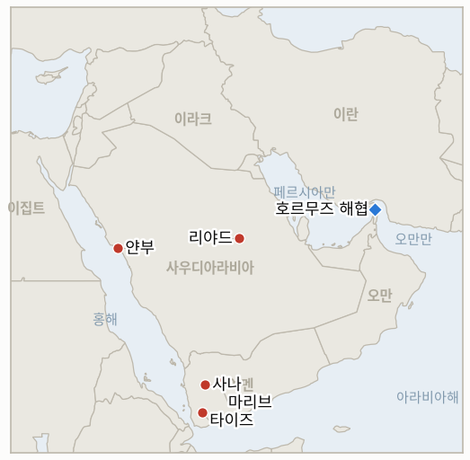

# 중동 일일 브리핑

**2026년 9월 21일**

- **보고 기간:** 약 24시간, 9월 20일 09:00 ~ 9월 21일 09:00 (한국시간)
- **종합 평가:** 이번 보고 기간을 규정한 것은 새로운 공격이 아니라 리야드 공격의 여진이었다: 트럼프 대통령은 캠프 데이비드 주말 일정을 단축하고 후티 반군에 대한 미국의 직접 군사 옵션을 검토했으며, 이는 그동안 정보 지원에 그쳤던 워싱턴의 태도가 바뀔 수 있음을 보여주는 가장 뚜렷한 신호였고, 동시에 튀르키예와 파키스탄은 메카 공동방위협정에 따라 사우디아라비아를 도울 준비가 되어 있다고 공개적으로 밝혔지만 아직 발동 단계에는 이르지 않았다(§1.1). 외교 전선에서는 이란 국회의장 갈리바프가 테헤란의 호르무즈 재개방 조건을 이번 전쟁 들어 가장 강경하게 재확인했는데, 이는 살랄라 협상의 교착을 좁히기보다 오히려 그 간극을 더 넓히는 신호다(§1.2). 사우디아라비아는 후티 예멘 지역에 대한 기존의 높은 공습 강도를 유지했고, 한때 "수일 내"로 언급됐던 동서 송유관 재가동은 그 시한을 사흘 앞두고도 아직 그 주장을 입증하지 못하고 있다(§1.3). 한국의 두 가지 평행 트랙 모두 어느 한쪽도 매듭짓지 못한 채 한 걸음씩 나아갔다: 조현 외교장관은 서울의 호르무즈 역할을 군사가 아닌 "실질적 기여"로 규정했고, 정부는 투자 계획의 첫 공개 프로젝트에 관한 국회 보고 일정을 앞당겼다(§1.4).

---

## 1. 무슨 일이 있었나

<figure style="float:right; width:46%; margin:2pt 0 8pt 14pt;">

<figcaption style="font-size:8pt; color:#666; text-align:center; margin-top:3pt; font-style:italic;">주요 논의 지점</figcaption>
</figure>

### 1.1 트럼프, 캠프 데이비드 일정 단축하고 후티 직접 타격 검토, 튀르키예·파키스탄은 메카 협정 발동 준비 표명

트럼프 대통령은 토요일 리야드에 대한 공격 시도 이후 후티·사우디 간 위기가 심화되자 캠프 데이비드에서의 주말 일정을 단축하고 백악관으로 복귀했으며, 헤그세스 국방장관도 개인 일정을 단축하고 워싱턴으로 돌아왔다([The National](https://www.thenationalnews.com/news/gulf/2026/09/20/is-the-us-poised-to-hit-the-houthis/); [The Statesman](https://www.thestatesman.com/world/trump-cuts-short-camp-david-stay-as-us-weighs-yemen-strikes-after-houthi-missile-targets-riyadh-1503640707.html)). CNN 국가안보 분석가 알렉스 플리차스는 이번 캠프 데이비드 회동이 "예멘 타격 옵션을 숙의하고 검토"하기 위해 소집됐다는 이야기를 들었다고 밝혔으나, 백악관은 이를 공식적으로 확인하지 않았다. 국무부는 별도로 이번 분쟁이 "급속히 확대"될 수 있다고 경고하며 역내 미국인들에게 항공편 취소와 영공 혼란에 대비하라고 당부했다. 이는 지난 9월 10일 사우디 왕세자 무함마드 빈 살만의 두 차례 직접 전화 요청에도 불구하고 트럼프 대통령이 미국의 직접 타격 요청을 거절하고 정보·표적 지원만 제공하기로 했던 결정(**IND-20260913-2**)에서 방향이 바뀔 수 있음을 시사하는 대목이며, 이번 보고 기간 중 후티 목표물에 대한 미국의 확인된 타격은 아직 없었다. 한편 하칸 피단 튀르키예 외무장관은 사우디아라비아가 군사적 필요가 있을 수 있다며, 지난 8월 사우디아라비아·파키스탄과 체결한 메카 공동방위협정에 따라 튀르키예가 도울 준비가 되어 있다고 밝혔고, 사르다르 무함마드 유수프 파키스탄 종교부 장관은 메카 인근에서 후티 드론이 요격된 뒤 파키스탄이 협정상 의무를 이행할 "준비가 이미 되어 있다"고 말했다([Al Jazeera](https://www.aljazeera.com/news/2026/9/19/turkiye-backs-saudi-arabias-security-amid-escalating-houthi-attacks-fm); [The Nation](https://www.nation.com.pk/20-Sep-2026/pakistan-vows-support-saudi-arabia-houthi-attack)). 다만 두 발언 모두 공식 발동이나 공동 지휘 체계, 병력 파견 등 구체적 조치는 밝히지 않아 **IND-20260911-2**는 여전히 열려 있다. **신뢰도: 높음** (트럼프·헤그세스의 워싱턴 복귀 및 국무부 경고, 다수 1등급 매체 수렴); 캠프 데이비드 회동이 실제로 타격 옵션 검토를 위한 것이었다는 대목은 **중간** (백악관 공식 확인이 아닌 단일 분석가의 전언에 근거); 튀르키예·파키스탄 발언 자체는 **높음**, 그 실질적 의미는 구체적 조치가 없는 만큼 **중간**.

### 1.2 이란 갈리바프, "이란의 모든 조건 충족 전까지 호르무즈 재개방 없다"

이란 국회의장이자 대미 협상 수석대표인 모하마드 바게르 갈리바프는 일요일, 레바논을 포함한 모든 전선에서의 완전한 휴전, 이란 동결자금 해제, 원유 수출 제재 해제, 이란의 해협 통제권 인정, 해상 봉쇄 해제 등 전쟁 종식을 위한 이란의 조건이 충족되기 전까지 호르무즈 해협의 "재개방은 없다"고 밝혔다([Al Arabiya English](https://english.alarabiya.net/News/middle-east/2026/09/20/iran-s-ghalibaf-says-strait-of-hormuz-will-remain-closed-until-conditions-are-met); [ANI](https://aninews.in/news/world/middle-east/irans-ghalibaf-says-there-will-be-no-opening-of-strait-of-hormuz-until-conditions-are-met20260920140026/)). 이는 본 원장이 기록한 테헤란의 조건에 대한 가장 포괄적인 단일 공개 발표로, 아라그치 외교장관이 주장했지만 오만 측 확인은 아직 없는 "이란·오만 합의" 주장(**IND-20260918-3**)과는 긴장 관계에 있다: 갈리바프의 발언은 설령 이란·오만 간 별도 약정이 성사되더라도 그것이 이란이 내건 조건에 따른 해협 재개방을 의미하지는 않는다는 점을 분명히 한다. 이번 보고 기간 중 새로운 살랄라 회담 일정, 공동성명, GCC 측 반응은 확인되지 않아 **IND-20260915-1**과 **IND-20260919-1**이 보여준 외교적 정체 흐름은 그대로 이어졌다. **신뢰도: 높음** (SBS, Al Arabiya, ANI 등이 동일 발언을 수렴 보도); 이것이 이미 알려진 이란의 기본 입장 재확인을 넘어 실질적 협상 지위 변화를 의미하는지는 **중간**.

### 1.3 사우디아라비아, 예멘 공습 강도 유지, 동서 송유관 재가동은 자체 시한 앞두고도 미확인

후티 측 매체(안사르 알라 무장군 대변인 야히아 사리)는 사우디아라비아가 일요일까지 24시간 동안 타이즈, 알자우프, 마리브, 호데이다 등지에서 28~32회의 공습을 감행했다고 밝혔는데, 이는 이미 확인된 주당 약 450회 수준의 공습 강도가 이어진 것으로, **IND-20260913-2**가 설정한 "기존 수준을 넘어서는 확대" 기준에는 아직 명확히 도달하지 않은 것으로 보인다([Antiwar.com](https://news.antiwar.com/2026/09/20/saudi-airstrikes-hit-yemen-after-ansar-allah-attack-on-riyadh/)). 지난 9월 11일 폐쇄된 사우디 동서 송유관의 재가동은 이번 보고 기간 중 확인되지 않았다. 크리스 라이트 에너지장관이 9월 16일 이번 사태를 "수일 내" 해결될 사안이라고 규정한 발언은 9월 23일이라는 자체 시한(**IND-20260917-2**)을 사흘 앞두고도 재가동이 이뤄지지 않아 시험대에 올라 있으며, 앞서 CNBC에 정통한 소식통은 완전 복구까지 약 6주가 걸릴 수 있다고 전한 바 있어 이런 관측을 뒷받침한다. **신뢰도: 높음** (예멘 공습 횟수는 후티 측 매체 단독 보도로, 독립적으로 검증된 수치가 아닌 일방의 집계); 송유관 재가동 미확인은 **높음** (이번 보고 기간 조사 전반에서 일관되게 확인된 부정적 결과).

### 1.4 서울, 호르무즈 역할을 "실질적 기여"로 규정, 투자 관련 국회 보고 일정도 앞당겨져

조현 외교장관은 지난 9월 18일 루비오 국무장관과의 회담에서 일요일 밝힌 바에 따르면, 한국 정부가 호르무즈 해협의 자유로운 통항 회복을 위해 미국 및 국제사회와 함께 "실질적 기여"를 하겠다는 뜻을 밝혔으며, 미국 측은 이것이 군사 파병을 배제한다는 이재명 대통령의 입장을 이해하고 있으며 이에 이의를 제기하지 않았다고 확인했다([서울신문](https://www.seoul.co.kr/news/politics/diplomacy/2026/09/21/20260921005003)). 이는 이미 확인된 **IND-20260911-3**과 여전히 열려 있는 **IND-20260906-2**의 내용을 진전시키기보다 재확인하는 성격이지만, "실질적 기여"라는 표현이 이제까지 가장 직접적인 공식 언급으로 제시됐다는 의미가 있다. 별도로 정부는 3500억 달러 대미 투자 계획의 첫 프로젝트에 관한 국회 보고 일정을 9월 21일 또는 22일로 앞당겼는데, 이는 국회 기획재정위원회와 산업통상자원중소벤처기업위원회를 대상으로 한 비공개 보고다. 한국 언론에 따르면 첫 프로젝트는 텍사스에 위치한 223억 달러 규모, 6.4GW급 가스복합화력발전소(앤시널)이며, 한미 공동특수목적법인(SPV) 구성, 전력구매계약(PPA) 조건, 한국 기업의 벤더 참여 등을 두고 협상이 계속되고 있다([Financial News](https://www.fnnews.com/news/202609201050442964); [서울신문](https://www.seoul.co.kr/news/politics/2026/09/20/20260920500073)). 이번 보고가 공개 발표가 아닌 비공개 회의인 만큼, **IND-20260919-3**이 요구하는 "공개된 정부 발표"라는 기준은 절차가 눈에 띄게 진전됐음에도 아직 명확히 충족되지 않았으며, 9월 26일 시한은 그대로 유효하다. **신뢰도: 높음** (조 장관의 발언 및 미국 측 반응, 서울신문 보도로 9월 18일 회담 내용과 일치); 9월 21~22일 보고 일정과 앤시널 프로젝트 수치는 **중간·높음** (여러 한국 매체가 수렴 보도하지만 아직 공개되지 않은 비공개 절차를 다룬 내용).

---

## 2. 심층 분석: 동기와 의도

### 2.1 열흘 전 리야드의 직접 타격 요청을 거절했던 트럼프 대통령이 지금 다시 직접 타격을 진지하게 검토하는 이유는 무엇인가?

목표물의 성격 자체가 정도가 아니라 종류에서 바뀌었기 때문이다: 9월 10일 무함마드 빈 살만 왕세자의 요청은 후티의 홍해 해안 점령이라는, 워싱턴이 정보 지원만으로도 대응할 수 있는 영토·해상로 문제에서 비롯된 것이었지만, 토요일 사우디 수도 자체에 대한 공격 시도는 워싱턴이 계속 자제할 경우 감수해야 할 정치적 비용을 끌어올린다. 이는 정상화를 위해 공을 들여온 미·사우디 관계와, 그동안 전쟁의 조속한 종식을 반복적으로, 그러나 지금까지는 계속 빗나가게 예측해온 대통령(**IND-20260910-3**) 모두에게 해당되는 이야기다.

### 2.2 튀르키예와 파키스탄이 메카 공동방위협정을 아직 공식 발동하지 않은 채 준비 태세만 공개적으로 밝히는 이유는 무엇인가?

준비 태세를 공개적으로 밝히는 것만으로도 병력 투입이나 협정의 아직 규정되지 않은 발동 절차를 촉발하지 않으면서 연대를 과시하고 추가 확전을 억제하는 효과를 얻을 수 있기 때문이다. 이는 공동 지휘 체계나 상비군이 없는 협정 자체의 구조, 그리고 9월 초 첫 시험대에서부터 본 원장이 추적해온 대로 양국이 실질적 조치보다 수사적 강화를 선호해온 패턴과도 일치한다.

### 2.3 갈리바프가 하필 지금 이란의 호르무즈 조건 관련 수사를 강경하게 재확인한 이유는 무엇인가?

포괄적이고 타협 없는 조건 목록을 공개적으로 재확인함으로써, 아라그치의 더 좁은 범위인 이란·오만 "합의" 주장이 테헤란이 단계적으로 입장을 완화하고 있다는 신호로 해석되는 것을 원천 차단할 수 있기 때문이다. 이를 통해 이란은 양자간·비공개적·오만 중재의 협상 트랙을 병행하면서도, 국내와 IRGC 강경파를 향해서는 일방적 양보가 진행되고 있지 않다는 강경한 공개 입장을 유지할 수 있다.

### 2.4 서울이 한편으로 호르무즈 역할을 "실질적 기여"로 규정하면서 동시에 구체적이고 확실한 투자 프로젝트를 진전시키는 이유는 무엇인가?

수사적으로는 강하지만 군사적으로는 공허한 호르무즈 공약과, 실제 달러 액수로 표시된 구체적인 투자 성과물을 함께 제시함으로써, 이재명 정부가 정치적으로 부담이 큰 호르무즈 문제에서는 동맹으로서의 호응 의지를 신호로 보내는 동시에, 정치적으로 상대적으로 부담이 적은 투자 트랙에서 실질적 성과를 축적할 수 있기 때문이다. 이는 9월 초 이래 본 원장이 이미 짚어온 서울의 두 사안 처리 방식과 정확히 일치하는 배열이다.

---

## 3. 한국에 대한 정책적 함의

**노출도 스냅샷:** 한국의 원유 수입은 여전히 약 70%가 호르무즈 해협 통항에 의존하고 있으며, LNG 수입의 약 36%가 중동산으로 카타르 라스라판이 가장 큰 LNG 공급 노출 지점이다(`instructions/korea-exposure.md` 참조, 2026년 8월 14일 최종 갱신, 이번 보고 기간 갱신 불필요). 시장은 본 브리핑 작성 시점까지 거래 중이었다: 코스피는 오전 시세 기준 6960.50(+0.96%), 원화는 1387.3원으로 모두 금요일 확정 종가(코스피 6894.23, 원화 1383.3원)에서 소폭 벗어난 수준이며, 월요일 뉴욕 원유 정산가는 아직 나오지 않아 아시아 장중 시세(브렌트유 약 104.10달러, WTI 약 96.76달러)만 확인됐다(각각 금요일 확정 정산가 103.87달러, 100.30달러 대비).

**사안별 함의:**

- **트럼프의 캠프 데이비드 타격 검토와 메카 협정 관련 발언(§1.1):** 미국이 후티에 대한 정보 지원에서 실제 타격으로 전환한다면, 이는 예멘 전선에서 한국의 해운·정유 부문 계획에 지금까지 가장 중대한 변화가 될 수 있다. 한국행 화물이 이미 이용 중인 홍해·얀부 우회로에 대한 공중전 확대 위험을 끌어올리기 때문으로, 산업통상자원부와 국내 정유사들은 이를 해협 자체보다 이 우회로에 대한 가장 근접한 구체적 확전 위험으로 다뤄야 한다.
- **갈리바프의 호르무즈 조건 재확인(§1.2):** 다전선 완전 휴전, 제재 해제, 동결자금 해제 등 나열된 조건들이 단기간에 해소될 조짐을 보이지 않는 만큼, 한국 정책 담당자들은 해협을 수 주가 아닌 수개월 단위로 계속 폐쇄된 것으로 전제해야 한다는 판단을 뒷받침한다.
- **사우디아라비아의 지속된 예멘 공습 강도와 미확인된 송유관 재가동(§1.3):** 송유관 정지가 라이트 장관 스스로 제시한 "수일 내" 시한을 넘길 위기에 처하며 사우디의 수출 능력 제약이 이어지고 있는 것은, 대부분 영향받지 않은 홍해·얀부 경로를 통해 들어오는 한국의 자체 사우디산 물량보다 국제 벤치마크 유가에 더 크게 작용하는 요인이다.
- **조현 장관의 "실질적 기여" 표현과 투자 보고 일정 진전(§1.4):** 9월 21~22일 국회 보고는 서울의 투자 트랙이 예정대로 진행되는지를 가늠할 가장 가까운 구체적 시험대이며, 비공개 형식인 만큼 앤시널 프로젝트 세부 내용처럼 공식 발표 이전에 부분적 유출과 단편적 공개가 이어질 것으로 예상해야 한다.

**검증 가능한 지표:**

- **IND-20260920-1** (열림): 이번 보고 기간 중 리야드 인근에서의 추가 후티 공격은 확인되지 않았으며, 이번 기간 사우디아라비아의 공습은 리야드 재타격이 아니라 예멘의 타이즈, 알자우프, 마리브, 호데이다를 대상으로 이뤄졌다. 열림, 시한 ~2026-09-27, 일회성 신호 쪽으로 기울고 있음.
- **IND-20260920-2** (열림): 트럼프 대통령의 걸프협력회의(GCC) 정상 회동은 아직 이뤄지지 않았다(9월 22일 예정). 열림, 시한 ~2026-09-29.
- **IND-20260919-3** (열림, 확인 쪽으로 기우는 중): 한국의 투자 계획 첫 프로젝트(223억 달러 규모 텍사스 가스발전소)에 관한 국회 보고가 9월 21~22일로 잡혔지만, 공개 발표가 아닌 비공개 상임위 회의인 만큼 지표의 "공개" 기준은 아직 명확히 충족되지 않았다. 열림, 시한 ~2026-09-26.
- **IND-20260919-2** (열림): 이번 보고 기간 중 추가 호르무즈 사건이나 IRGC의 공개된 작전 조치는 확인되지 않았다. 열림, 시한 ~2026-09-26, 5일 남음.
- **IND-20260919-1** (열림): 유엔 전쟁범죄 조사 결과에 대한 안전보장이사회 회부 시도, 동맹국 공동성명, 그 밖의 공식 후속 조치는 이번 보고 기간 중 확인되지 않았다. 열림, 시한 ~2026-10-03.
- **IND-20260918-3** (열림): 아라그치의 이란·오만 "합의" 주장에 대한 오만이나 GCC 측 확인은 이번 보고 기간 중에도 없었으며, 갈리바프의 조건 재확인(§1.2)은 오히려 양자간 약정을 진정한 해협 재개방으로 해석하는 데 불리하게 작용한다. 열림, 시한 ~2026-10-02.
- **IND-20260918-2** (열림): 트럼프 대통령의 "직접 접촉" 주장에 대한 이란 정부의 확인은 이번 보고 기간 중에도 없었다. 열림, 시한 ~2026-09-25, 4일 남음.
- **IND-20260917-2** (열림): 이번 보고 기간 중 사우디 동서 송유관의 재가동은 확인되지 않았으며, 라이트 장관의 "수일 내" 발언은 자체 시한을 사흘 앞두고 있다. 열림, 시한 ~2026-09-23, 3일 남음.
- **IND-20260917-1** (열림): 이번 보고 기간 중 카이로 연합 관련 새로운 진전은 확인되지 않았다. 열림, 시한 ~2026-10-01.
- **IND-20260916-2** (열림): 이번 보고 기간 중 통일된 이란 정부 입장이나 공개된 미·이란 채널은 확인되지 않았다. 열림, 시한 ~2026-09-30.
- **IND-20260913-2** (열림, 확전 쪽으로 기우는 중): 트럼프 대통령의 캠프 데이비드 직접 타격 옵션 검토(§1.1)는 지난 9월 10일 리야드의 요청을 거절했던 워싱턴의 결정이 유지되지 않을 수 있다는 지금까지 가장 뚜렷한 신호다. 다만 미국의 확인된 타격은 아직 없었고, 사우디아라비아 자체 공습 강도(24시간 28~32회)도 눈에 띄게 확대되기보다는 이미 높은 수준을 유지하는 데 그쳤다. 열림, 시한 ~2026-09-27, 6일 남음.
- **IND-20260911-2** (열림, 지금까지 가장 구체적인 시험대): 튀르키예와 파키스탄이 메카 공동방위협정에 따라 사우디아라비아를 도울 준비가 되어 있다고 공개적으로 밝힌 것(§1.1)은 이 협정을 현재 사태와 가장 직접적으로 연결한 사례이지만, 두 나라 모두 공식 발동이나 공동 작전 조치는 밝히지 않았다. 열림, 시한 ~2026-10-02.
- **IND-20260906-2** (열림): 이번 보고 기간 중 한국의 호르무즈 태도는 군사 파병이나 공식 국회 동의안 없이 "실질적 기여"라는 수사에 머물렀다(§1.4). 열림, 시한 ~2026-09-28, 7일 남음.

---

## 4. 주시할 사안

- **트럼프의 캠프 데이비드 검토가 실제 미국의 후티 타격으로 이어질지 여부(IND-20260913-2):** 현재 원장에서 가장 가까우면서도 가장 파급력이 큰 시험대로, 자체 시한까지 6일 남았다.
- **메카 공동방위협정이 준비 태세 표명을 넘어 공식 발동으로 이어질지 여부(IND-20260911-2):** 튀르키예와 파키스탄의 발언은 협정에 대한 지금까지 가장 구체적인 시험대다.
- **라이트 장관의 송유관 재가동 "수일 내" 발언(IND-20260917-2):** 9월 23일 자체 시한을 사흘 앞두고도 재가동 미확인.
- **후티가 사우디 수도에 대한 공격을 반복할지 여부(IND-20260920-1):** 토요일 공격이 일회성이었는지를 가늠할 가장 가까운 시험대.
- **한국 국회의 호르무즈 파병 동의안(IND-20260906-2):** 9월 28일 시한까지 7일 남음.
- **서울의 9월 21~22일 투자 관련 국회 보고(IND-20260919-3):** 비공개 상임위 회의를 넘어 공개 발표로 이어질지 여부.
- **트럼프의 9월 22일 걸프 정상 회동(IND-20260920-2):** 전후 이란 전략의 구체적 요소가 공개될지 여부.
- **카타르 라스라판의 LNG 선적량(IND-20260714-4):** 여전히 최신 주간 선적 수치가 없는, 원장에서 가장 오래 미해결 상태인 지표.

---

## 5. 출처 품질 요약

| 주장 | 출처 | 신뢰도 |
|---|---|---|
| 트럼프, 캠프 데이비드 일정 단축하고 백악관 복귀; 헤그세스도 복귀; 국무부는 급속한 확전 가능성 경고 | The National, The Statesman, Gulf News (1~2등급, 수렴) | 높음 |
| 캠프 데이비드 회동이 "예멘 타격 옵션 숙의·검토"를 위해 소집됐다는 보도 | CNN 분석가 알렉스 플리차스 발언 인용 (The Week/Tribune India, 2등급, 단일 인용원으로 백악관 공식 확인 아님) | 중간 |
| 튀르키예 피단 장관·파키스탄 유수프 장관, 메카 공동방위협정에 따른 사우디 지원 준비 표명 | Al Jazeera, The Nation (1~2등급) | 발언 자체는 높음, 실질적 의미는 중간 |
| 갈리바프: 이란의 모든 조건 충족 전까지 호르무즈 재개방 없다 | SBS, Al Arabiya English, ANI (1~2등급, 수렴) | 높음 |
| 사우디아라비아, 24시간 동안 타이즈·알자우프·마리브·호데이다에 28~32회 공습 | Antiwar.com, 후티 계열 예멘군 대변인 인용 (3등급, 일방적 집계) | 발언 자체는 높음, 수치의 독립적 정확성은 중간 |
| 이번 보고 기간 중 동서 송유관 재가동 미확인 | CNBC·Bloomberg·Al-Monitor 등 기존 보도 전반에 대한 체계적 확인; 새로운 재가동 보도 부재 | 높음 |
| 조현 장관: 한국은 파병 없이 호르무즈 통항 회복에 "실질적 기여"; 투자 관련 국회 보고 9월 21~22일, 앤시널 프로젝트 세부 공개 | 서울신문, Financial News (1~2등급, 한국 매체) | 발언 인용은 높음, 프로젝트 수치는 공식 확인 전이라 중간·높음 |
