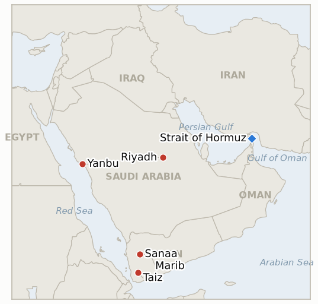

# Middle East Daily Briefing

**September 21, 2026**

- **Reporting window:** ~24 hours, September 20, 09:00 to September 21, 09:00 KST
- **Overall assessment:** The Riyadh strike's aftershock, not a new strike, defined this window: President Trump cut short a Camp David weekend to review direct US military options against the Houthis, the clearest sign yet that Washington's decade-old posture of intelligence support only may be shifting, while Turkey and Pakistan both publicly affirmed readiness to help Saudi Arabia under the Mecca Joint Defence Agreement without yet invoking it (§1.1). On the diplomatic track, Iran's parliament speaker Ghalibaf delivered the war's starkest restatement of Tehran's Hormuz reopening conditions, a signal that hardens rather than narrows the gap the stalled Salalah process was meant to close (§1.2). Saudi Arabia's own campaign kept its already-elevated tempo against Houthi-held Yemen even as the East-West pipeline's restart, once framed as a matter of days, sits three days from testing that claim against its own deadline (§1.3). South Korea's two parallel tracks both moved a step forward without resolving either: Foreign Minister Cho Hyun cast Seoul's Hormuz role as a non-military "substantive contribution," and the government advanced its National Assembly briefing on the investment package's first disclosed project (§1.4).

---

## 1. What Happened

<figure style="float:right; width:46%; margin:2pt 0 8pt 14pt;">

<figcaption style="font-size:8pt; color:#666; text-align:center; margin-top:3pt; font-style:italic;">Major places of discussion</figcaption>
</figure>

### 1.1 Trump Cuts Short Camp David to Weigh Direct Strikes on the Houthis as Turkey and Pakistan Affirm Mecca Pact Readiness

President Trump cut short a weekend stay at Camp David and returned to the White House as the Houthi-Saudi crisis deepened following Saturday's attempted strike on Riyadh, with Defense Secretary Pete Hegseth also cutting short a personal trip to return to Washington ([The National](https://www.thenationalnews.com/news/gulf/2026/09/20/is-the-us-poised-to-hit-the-houthis/); [The Statesman](https://www.thestatesman.com/world/trump-cuts-short-camp-david-stay-as-us-weighs-yemen-strikes-after-houthi-missile-targets-riyadh-1503640707.html)). CNN national security analyst Alex Plitsas said he had been told the Camp David meeting was convened to "deliberate and review Yemen strike options," a characterization the White House has not confirmed on the record; the State Department separately warned the conflict could "escalate rapidly" and told Americans across the region to prepare for flight cancellations and airspace disruptions. This marks a potential reversal from Trump's early-September decision, after two direct calls from Crown Prince Mohammed bin Salman, to decline Riyadh's request for US strikes and offer intelligence and targeting support instead (**IND-20260913-2**); no confirmed US strike on Houthi targets has yet occurred this window. Separately, Turkish Foreign Minister Hakan Fidan said Saudi Arabia may have military needs from the escalation and that Turkey stood ready to help under the Mecca Joint Defence Agreement, the trilateral pact with Saudi Arabia and Pakistan signed in August, while Pakistan's Religious Affairs Minister Sardar Muhammad Yousuf said Islamabad was "already prepared" to fulfil its commitments under the pact after a Houthi drone was intercepted near Mecca ([Al Jazeera](https://www.aljazeera.com/news/2026/9/19/turkiye-backs-saudi-arabias-security-amid-escalating-houthi-attacks-fm); [The Nation](https://www.nation.com.pk/20-Sep-2026/pakistan-vows-support-saudi-arabia-houthi-attack)); neither statement disclosed a formal invocation, joint command step, or force commitment, so **IND-20260911-2** stays open. **Confidence: High** on Trump's and Hegseth's return to Washington and the State Department warning (multiple Tier 1 outlets converging); **Medium** on the Camp David meeting's specific strike-options framing, resting on a single named analyst's account rather than an on-record administration statement; **High** on the Turkish and Pakistani statements themselves, **Medium** on their practical significance absent any disclosed operational step.

### 1.2 Iran's Ghalibaf Says Hormuz Stays Closed Until All of Tehran's Conditions Are Met

Parliament speaker and chief US negotiator Mohammad Bagher Ghalibaf said Sunday there will be "no opening" of the Strait of Hormuz until Iran's conditions for ending the war are fulfilled, listing a full ceasefire across every front including Lebanon, release of Iran's frozen funds, the lifting of oil-export sanctions, recognition of Iran's control over the strait, and the lifting of the naval blockade ([Al Arabiya English](https://english.alarabiya.net/News/middle-east/2026/09/20/iran-s-ghalibaf-says-strait-of-hormuz-will-remain-closed-until-conditions-are-met); [ANI](https://aninews.in/news/world/middle-east/irans-ghalibaf-says-there-will-be-no-opening-of-strait-of-hormuz-until-conditions-are-met20260920140026/)). This is the fullest single public listing of Tehran's conditions this ledger has recorded, and it sits in tension with FM Araghchi's own claim, still uncorroborated by Oman, that Iran and Oman have "already agreed" a narrower bilateral reopening plan (**IND-20260918-3**); Ghalibaf's remarks make clear that any Iran-Oman arrangement would not amount to reopening the strait on Iran's own terms. No new Salalah date, joint statement, or GCC response was found this window, so **IND-20260915-1** and **IND-20260919-1**'s underlying diplomatic-inertia trend continues unchanged. **Confidence: High** on the quoted remarks and their content (SBS, Al Arabiya, ANI converging on the same statement); **Medium** on how much this changes the practical negotiating position versus restating an already-known Iranian baseline.

### 1.3 Saudi Arabia Sustains a High Tempo in Yemen as the East-West Pipeline's Restart Nears Its Own Deadline Unconfirmed

Houthi media (Yahya Saree, Ansar Allah armed forces spokesman) said Saudi Arabia carried out 28 to 32 airstrikes in the 24 hours to Sunday across Taiz, Al-Jawf, Marib and Hodeidah, a continuation of the roughly 450-strikes-a-week tempo already tracked and consistent with an unchanged, not further escalated, campaign under **IND-20260913-2**'s "beyond current levels" threshold ([Antiwar.com](https://news.antiwar.com/2026/09/20/saudi-airstrikes-hit-yemen-after-ansar-allah-attack-on-riyadh/)). No confirmed restart of the Saudi East-West pipeline, shut since September 11, was found this window; Energy Secretary Chris Wright's September 16 characterization of the outage as "measured in days" is now three days from its own **IND-20260917-2** deadline of September 23 with no restart disclosed, tempered further by a person familiar with the matter telling CNBC full capacity could take about six weeks. **Confidence: High** on the Yemen strike count, sourced to Houthi-aligned media only and thus a one-sided tally rather than an independently verified figure; **High** on the absence of a confirmed pipeline restart, a negative finding consistent across this window's research.

### 1.4 Seoul Casts Its Hormuz Role as a Substantive Non-Military Contribution as the Investment Briefing Advances

Foreign Minister Cho Hyun, in his September 18 meeting with Secretary Rubio, told reporters Sunday that South Korea's government "will make a substantive contribution" alongside the US and international community toward restoring free navigation through the Strait of Hormuz, while US officials confirmed they understand and have not challenged President Lee's position that this excludes military deployment ([Seoul Sinmun](https://www.seoul.co.kr/news/politics/diplomacy/2026/09/21/20260921005003)); this restates rather than advances **IND-20260906-2** and the confirmed **IND-20260911-3**, but gives the "substantive contribution" framing its most direct on-record wording yet. Separately, the government moved its National Assembly briefing on the first project under its $350 billion US investment pledge to September 21 or 22, a closed-door session to the Assembly's finance and industry committees; Korean press reported the first project is a $22.3 billion, 6.4GW gas-fired power plant (Ensinal, Texas), with negotiations continuing over a joint special-purpose investment vehicle, power-purchase-agreement terms, and Korean vendor participation ([Financial News](https://www.fnnews.com/news/202609201050442964); [Seoul Sinmun](https://www.seoul.co.kr/news/politics/2026/09/20/20260920500073)). Because the briefing is closed-door rather than a public announcement, **IND-20260919-3**'s "disclosed government announcement" bar is not yet clearly met even as the process visibly advances inside its September 26 deadline. **Confidence: High** on Cho's quoted framing and the US response (Seoul Sinmun, consistent with the Sept 18 meeting already reported); **Medium-High** on the Sept 21-22 briefing date and Ensinal project figures, sourced to converging Korean outlets but describing a still-unpublished, closed-door process.

---

## 2. Deep Dive: Incentives and Motives

### 2.1 Why would Trump seriously consider direct US strikes on the Houthis now, having declined Riyadh's request ten days ago?

Because the target has changed in kind, not just degree: MBS's September 10 request came after the Houthis' Red Sea coastline seizure, a territorial and shipping-lane concern Washington could address with intelligence support alone, while Saturday's attempted strike on the Saudi capital itself raises the political cost of continued restraint, both for a US-Saudi relationship Washington has invested in normalizing and for a president who has repeatedly, and so far incorrectly, predicted the war's imminent end (**IND-20260910-3**).

### 2.2 Why would Turkey and Pakistan publicize Mecca pact readiness without yet invoking it formally?

Because a public statement of readiness lets both signatories demonstrate solidarity and deter further escalation without committing forces or triggering the pact's own undefined mechanics, a hedge consistent with the agreement's lack of a joint command or standing force and with both countries' evident preference, so far, for rhetorical reinforcement over the operational step this ledger has tracked as unmet since the pact's first test in early September.

### 2.3 Why would Ghalibaf harden Iran's Hormuz conditions rhetoric at this exact moment?

Because restating an uncompromising, comprehensive list of conditions publicly forecloses any reading of Araghchi's narrower Iran-Oman "agreed" framing as a sign Tehran is softening its position piecemeal, letting Iran's negotiating track (bilateral, deniable, Oman-mediated) run in parallel with a hardline public position that keeps domestic and IRGC audiences reassured no unilateral concession is underway.

### 2.4 Why would Seoul frame its Hormuz role as a "substantive contribution" while simultaneously advancing a concrete, disclosed investment project?

Because pairing a rhetorically strong but militarily empty Hormuz commitment with a genuinely concrete, dollar-denominated investment deliverable lets Lee's government signal alliance responsiveness on the politically costly Hormuz question through the politically cheaper investment track, exactly the sequencing this ledger has already flagged in Seoul's handling of both issues since early September.

---

## 3. Policy Implications for South Korea

**Exposure snapshot:** South Korea's crude imports remain roughly 70% dependent on Strait of Hormuz transit and about 36% of its LNG imports come from the Middle East, with Qatar's Ras Laffan as the single largest LNG supplier exposure (see `instructions/korea-exposure.md`, last updated August 14, 2026, no update needed this window). Markets were still trading at run time: KOSPI's morning quote of 6960.50 (+0.96%) and the won's 1387.3 quote both sit off Friday's confirmed close (6894.23, 1383.3), and Monday's NY oil settle had not landed (Asia intraday: Brent ~104.10, WTI ~96.76, both off Friday's confirmed settles of 103.87/100.30).

**Implications by development:**

- **Trump's Camp David strike deliberations and the Mecca pact statements (§1.1):** a shift from US intelligence support to actual US strikes on the Houthis would be the most consequential change yet to the war's Yemen front for Korean shipping and refining planners, since it raises the odds of a wider air campaign disrupting the Red Sea/Yanbu workaround Korean-bound cargoes already use; MOTIE and Korean refiners should treat this as the nearest concrete escalation risk to that corridor, ahead of the strait itself.
- **Ghalibaf's Hormuz conditions restatement (§1.2):** confirms Korean planners should continue to treat the strait as closed on a multi-month rather than weeks-scale horizon, since the listed conditions (a full multi-front ceasefire, sanctions relief, unfrozen funds) show no sign of near-term resolution.
- **Saudi Arabia's sustained Yemen tempo and the unconfirmed pipeline restart (§1.3):** the pipeline's continued outage, now closing in on Wright's own "days" deadline unmet, keeps Saudi export capacity constrained in a way that matters more for global benchmark prices than for Korea's own Saudi-sourced volumes, which move mainly through the unaffected Red Sea/Yanbu route.
- **Cho Hyun's "substantive contribution" framing and the investment briefing's advance (§1.4):** the September 21-22 National Assembly briefing is now the nearest concrete test of whether Seoul's investment track lands on schedule; the closed-door format means Korean observers should expect leaks and partial disclosure (as with the Ensinal project details) before any formal public announcement.

**Testable indicators:**

- **IND-20260920-1** (open): No further Riyadh-area Houthi incident found this window; Saudi Arabia's own strikes this window targeted Yemen's Taiz, Al-Jawf, Marib and Hodeidah rather than a repeat capital strike. Open, deadline ~2026-09-27, trending toward the one-off-signaling branch.
- **IND-20260920-2** (open): Trump's Gulf Cooperation Council leaders meeting has not yet occurred (scheduled September 22). Open, deadline ~2026-09-29.
- **IND-20260919-3** (open, trending toward confirmed): Korea's National Assembly briefing on the investment package's first project (a $22.3 billion Texas gas plant) is now scheduled for September 21 to 22, but as a closed-door committee session rather than a public announcement, the indicator's disclosure bar is not yet clearly met. Open, deadline ~2026-09-26.
- **IND-20260919-2** (open): No further verified Hormuz incident or disclosed IRGC operational step found this window. Open, deadline ~2026-09-26, five days out.
- **IND-20260919-1** (open): No Security Council referral attempt, coordinated allied statement, or other formal follow-up to the UN war crimes finding found this window. Open, deadline ~2026-10-03.
- **IND-20260918-3** (open): No Omani or GCC corroboration of Araghchi's Iran-Oman "agreed" claim found this window; Ghalibaf's conditions restatement (§1.2) if anything cuts against reading any bilateral arrangement as a genuine strait reopening. Open, deadline ~2026-10-02.
- **IND-20260918-2** (open): No Iranian government corroboration of Trump's "direct contact" claim found this window. Open, deadline ~2026-09-25, four days out.
- **IND-20260917-2** (open): No confirmed Saudi East-West pipeline restart found this window; Wright's "days" framing now three days from its own deadline. Open, deadline ~2026-09-23, three days out.
- **IND-20260917-1** (open): No new development on the Cairo coalition this window. Open, deadline ~2026-10-01.
- **IND-20260916-2** (open): No unified Iranian government statement or disclosed US-Iran channel found this window. Open, deadline ~2026-09-30.
- **IND-20260913-2** (open, trending toward the escalation branch): Trump's Camp David review of direct strike options against the Houthis (§1.1) is the clearest signal yet that Washington's September 10 decision to decline Riyadh's request may not hold; no confirmed US strike has occurred and Saudi Arabia's own tempo (28-32 strikes/24h) stayed at an already-elevated level rather than visibly escalating further. Open, deadline ~2026-09-27, six days out.
- **IND-20260911-2** (open, trending toward its most concrete test yet): Turkey and Pakistan both publicly affirmed readiness to help Saudi Arabia under the Mecca Joint Defence Agreement (§1.1), the most direct public linkage of the pact to the current crisis so far, but neither disclosed a formal invocation or joint operational step. Open, deadline ~2026-10-02.
- **IND-20260906-2** (open): South Korea's Hormuz posture stayed at "substantive contribution" rhetoric without a military deployment or formal National Assembly motion this window (§1.4). Open, deadline ~2026-09-28, seven days out.

---

## 4. Watch List

- **Whether Trump's Camp David deliberations produce an actual US strike on Houthi targets (IND-20260913-2):** the nearest, highest-consequence test in the ledger right now, six days from its own deadline.
- **Whether the Mecca Joint Defence Agreement moves from statements of readiness to a formal invocation (IND-20260911-2):** Turkey and Pakistan's statements are the pact's most concrete test yet.
- **Wright's pipeline-restart "days" framing (IND-20260917-2):** three days from its own September 23 deadline with no restart confirmed.
- **Whether the Houthis repeat a strike on the Saudi capital (IND-20260920-1):** the nearest test of whether Saturday's strike was a one-off.
- **South Korea's National Assembly Hormuz deployment motion (IND-20260906-2):** seven days from its September 28 deadline.
- **Seoul's September 21-22 investment briefing (IND-20260919-3):** whether it produces a public disclosure beyond the closed-door committee session.
- **Trump's September 22 Gulf leaders meeting (IND-20260920-2):** whether it produces any disclosed element of the postwar Iran strategy.
- **Qatari LNG loadings at Ras Laffan (IND-20260714-4):** still no fresh weekly loading figure, the ledger's longest-running unresolved indicator.

---

## 5. Source Quality Summary

| Claim | Sources | Confidence |
|---|---|---|
| Trump cuts short Camp David, returns to White House; Hegseth also returns; State Dept warns of rapid escalation | The National, The Statesman, Gulf News (Tier 1-2, converging) | High |
| Camp David meeting convened to "deliberate and review Yemen strike options" | CNN analyst Alex Plitsas, cited by The Week/Tribune India (Tier 2, single named source, not White House on-record) | Medium |
| Turkey's FM Fidan and Pakistan's Religious Affairs Minister Yousuf affirm readiness to help Saudi Arabia under the Mecca Joint Defence Agreement | Al Jazeera, The Nation (Tier 1-2) | High on statements, Medium on practical significance |
| Ghalibaf: Strait of Hormuz stays closed until all of Iran's conditions are met | SBS, Al Arabiya English, ANI (Tier 1-2, converging) | High |
| Saudi Arabia conducts 28 to 32 airstrikes in 24 hours on Taiz, Al-Jawf, Marib, Hodeidah | Antiwar.com, citing Houthi-aligned Yemeni Armed Forces spokesman (Tier 3, one-sided tally) | High on the claim being made, Medium on the figure's independent accuracy |
| No confirmed East-West pipeline restart this window | Systematic research across CNBC, Bloomberg, Al-Monitor archives; absence of any new restart report | High |
| Cho Hyun: Korea will make a "substantive contribution" to Hormuz navigation without deployment; investment briefing set for Sept 21-22 with Ensinal project details | Seoul Sinmun, Financial News (Tier 1-2, Korean press) | High on quotes, Medium-High on project figures pending public confirmation |
