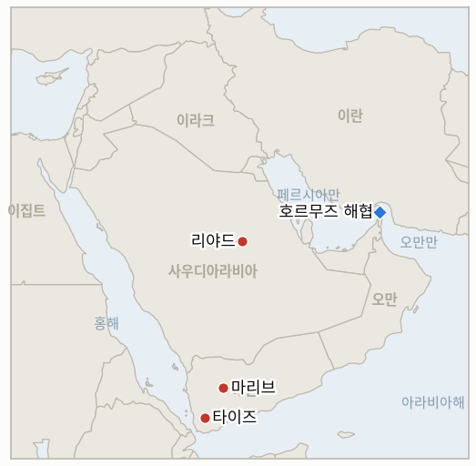

# 중동 일일 브리핑

**2026년 9월 22일**

- **보고 기간:** 약 24시간, 9월 21일 09:00 ~ 9월 22일 09:00 (한국시간)
- **종합 평가:** 워싱턴의 후티 대응 방침은 사흘 만에 크게 흔들렸다: 트럼프 대통령은 무함마드 빈 살만 왕세자의 두 번째 요청을 받은 뒤 후티 반군에 대한 직접 타격을 준비하도록 국방부에 지시했지만, 폭탄이 적재되던 일요일 막판에 작전을 취소했다. 이는 지난 9월 10일 리야드의 요청이 실제로 수용될지를 가늠하는 지금까지 가장 확실한 시험대였고, 현재로서는 수용되지 않는다는 가장 명확한 답이기도 하다(§1.1). 이란 트랙에서는 트럼프 대통령이 합의가 없으면 이란의 경제나 지도부를 "전멸"시키겠다고 위협하면서도 동시에 이번 주 유엔총회에서 페제시키안 대통령을 만날 의향이 있다는 뜻을 내비쳤는데, 이 외교적 제스처가 나온 바로 그날 이란 군 지휘부는 워싱턴이 이란 본토에 대한 공격 재개를 결정했다는 정보를 입수했다며 역내 모든 미군 기지에 대한 지속적 보복을 경고했다(§1.2). 예멘에서는 전쟁의 무게 중심이 정부의 마지막 북부 거점인 마리브 인근 고지대로 옮겨갔으며, 동서 송유관 재가동은 사실상 마지막 시험대였던 자체 시한을 넘길 처지에 놓였다(§1.3). 한국 증시는 순수한 국내 호재인 반도체 수출 기록에 힘입어 랠리를 펼쳤고, 이재명 대통령은 뉴욕으로 출국했으며 투자 계획의 첫 공개 시험대인 국회 보고는 이번 보고 기간 종료 직후로 예정돼 있다(§1.4).

---

## 1. 무슨 일이 있었나

<figure style="float:right; width:46%; margin:2pt 0 8pt 14pt;">

<figcaption style="font-size:8pt; color:#666; text-align:center; margin-top:3pt; font-style:italic;">주요 논의 지점</figcaption>
</figure>

### 1.1 트럼프, 후티 직접 타격 지시했다가 폭탄 적재 단계에서 취소

트럼프 대통령은 수요일 참모진 회의에서는 후티 타격에 부정적이었으나, 목요일 무함마드 빈 살만 왕세자가 후티의 급속한 영토 확대를 이유로 재차 개입을 요청하는 전화를 걸어오자 국방부에 군사행동 준비를 지시했다. 뉴욕타임스가 인용한 미 행정부 관계자들에 따르면 일요일까지 군 지휘부가 표적 목록을 승인하고 병력이 지정된 항공기에 폭탄을 적재하는 단계에 이르렀으나, 트럼프 대통령은 그날 정오 무렵 방침을 바꿔 작전을 취소했다([Haaretz](https://www.haaretz.com/middle-east-news/2026-09-21/ty-article/.premium/report-trump-backtracked-after-ordering-strikes-on-houthis-at-saudis-request/000001a0-c376-d286-adff-d7f670840000); [Gulf News](https://gulfnews.com/world/americas/bombs-loaded-targets-picked-why-trump-pulled-back-from-striking-houthis-1.500682246); [Middle East Monitor](https://www.middleeastmonitor.com/20260921-trump-called-off-planned-us-strikes-on-houthis-at-last-minute-report/)). 보도는 이번 번복의 배경으로 참모진 사이의 광범위한 회의론, 후티가 미국 선박을 공격하지 않기로 한 기존 합의(트럼프 본인도 "후티는 미국과 싸우지 않기로 합의했다"고 언급), 1000개 넘는 표적을 타격하고도 후티의 역량을 제거하지 못한 2025년 공습 작전의 실패, 그리고 진행 중인 이란 전쟁과 별개로 제2의 실질적 전선을 열어 호르무즈와 바브엘만데브 두 곳을 동시에 불안정하게 만들 위험을 꼽는다. 이는 사우디아라비아의 9월 10일 직접 타격 요청을 추적해 온 **IND-20260913-2**에 대한 지금까지 가장 확실한 시험대다: 워싱턴은 그 어느 때보다 원래의 거절 결정을 뒤집는 데 가까이 다가갔다가 다시 그 결정으로 되돌아갔으며, 이는 확고한 확전이 아니라 완전한 왕복에 가깝다. 후티 목표물에 대한 미국의 확인된 타격은 없었다. **신뢰도: 높음** (지시와 취소로 이어지는 경과 자체는 행정부 관계자를 인용한 뉴욕타임스 보도에 근거하며 다수의 1~2등급 매체가 수렴 보도); 번복의 구체적 이유는 백악관의 공식 확인이 아닌 관계자들의 해석에 의존하는 만큼 **중간**.

### 1.2 트럼프, 유엔서 페제시키안 면담 가능성 시사, 이란은 미군 기지 보복 경고

폭스뉴스 트레이 잉스트 수석 해외특파원이 이번 주 유엔총회 계기에 이란 마수드 페제시키안 대통령을 만날 의향이 있는지 묻자, 트럼프 대통령은 "아마 그럴 의향이 있다"고 답했다. 그는 스스로를 "결정 중인 상태"라고 표현하며 이란에게 남은 선택지는 이란을 "전멸"시키거나, 경제를 "썩게" 내버려 두거나, 합의에 이르는 것뿐이라고 경고했다([Arynews](https://arynews.tv/trump-says-he-is-probably-open-to-meeting-irans-president-at-un); [The Week](https://www.theweek.in/news/middle-east/2026/09/20/trump-pezeshkian-meet-on-the-cards-us-president-in-deciding-mode-over-west-asia-deadlock.html)). 미국 비자를 발급받은 6인 대표단의 일원인 페제시키안 대통령과 아라그치 외교장관은 9월 22일부터 29일까지 진행되는 유엔총회 고위급 주간을 맞아 뉴욕을 방문할 예정이다. 이란 관계자들은 별도로 카타르를 통해 사우디·후티 간 대립 종식, 이란 동결자산 해제, 미 해군의 이란 항구 봉쇄 해제 등을 포함한 요구 사항을 워싱턴에 전달했다([CNBC Africa](https://www.cnbcafrica.com/2026/iranian-president-pezeshkian-to-head-to-new-york-for-un-meeting-as-trump-warns-of-no-deal-consequences)). 같은 날, IRGC 합동군을 관장하는 이란의 하탐 알안비야 중앙사령부는 일요일 미국이 이란 본토에 대한 공격 재개를 결정했다는 정보를 입수했다고 밝히며, 역내 모든 미군 기지와 거점에 대해 "지속적이고 효과적이며 고통스러운" 보복을 가하겠다고 다짐했고, 공격을 지원하거나 방조하는 국가는 "공범으로 간주될 것"이라고 경고했다([Al Jazeera](https://www.aljazeera.com/news/2026/9/21/irans-military-says-us-preparing-to-resume-strikes); [Haaretz](https://www.haaretz.com/middle-east-news/iran/2026-09-20/ty-article/iran-warns-of-new-u-s-attack-threatens-sustained-retaliation-across-region/000001a0-bf3c-d9a4-adf9-bffd64c50000)). 이번 보고 기간 중 이란 본토에 대한 공격 재개 결정을 확인하는 미국 정부의 발표는 없었으며, 이 경고는 이미 철회된 후티 타격 계획(§1.1)과는 별개다. 이는 이란 내부의 관여파와 강경파 간 대립을 추적하는 **IND-20260916-2**, 그리고 트럼프의 아직 확인되지 않은 "직접 접촉" 주장을 추적하는 **IND-20260918-2**와 관련이 있으나 이번 보고 기간 중 둘 다 해소되지 않았으며, 면담 성사 가능성과 보복 위협을 각각 추적하는 새 지표 두 개(**IND-20260922-1**, **IND-20260922-2**)를 별도로 열었다. **신뢰도: 높음** (트럼프의 발언은 폭스뉴스와의 직접 대화에 근거); 이란 하탐 알안비야 사령부의 발표도 **높음** (알자지라와 하레츠 등이 수렴 보도); 다만 이란의 "공격 재개 결정" 표현을 문자 그대로 받아들일지는 **중간** (독립적으로 확인된 미국의 결정이 아니라 테헤란 측의 자체 프레이밍이기 때문).

### 1.3 후티, 마리브 고지대 장악 시도, 송유관 재가동 시한은 미충족인 채 임박

후티 반군은 월요일 예멘 홍해 연안을 정부군이 여전히 장악한 내륙 지역과 단절시키려는 목적으로 전략적 고지대 장악을 시도했으며, 이는 정부군이 타이즈주 서부에서 라스느, 자르다드, 알카다, 알와지이야 등 고지대를 둘러싼 격전 끝에 마운트 누만을 탈환한 다음 날 벌어졌다. 이 고지대는 타이즈시에서 알투르바를 거쳐 라흐즈, 아덴으로 이어지는 마지막 육로를 통제하는 지점이다([Asharq Al Awsat](https://english.aawsat.com/arab-world/5320712-yemeni-army-repels-houthi-attempts-advance-west-taiz); [US News](https://www.usnews.com/news/world/articles/2026-09-21/houthis-push-for-control-of-yemen-highlands-as-trump-reported-to-have-called-off-airstrikes)). 이번 보고 기간 보도를 인용한 분석가들은 전투의 초점이 예멘 정부의 마지막 북부 거점이자 주요 석유·가스 거점인 마리브로 옮겨가고 있으며, 후티가 이곳을 장악할 경우 전쟁의 흐름을 결정적으로 후티 쪽으로 기울게 할 수 있다고 본다. 사우디 동서 송유관의 재가동은 이번 보고 기간 중 확인되지 않았다. 크리스 라이트 에너지장관이 9월 16일 "수일 내" 해결될 것이라고 규정한 발언은 9월 23일이라는 자체 시한(**IND-20260917-2**)을 하루 앞두고도 재가동이 이뤄지지 않아 시험대에 놓여 있다. 유가는 월요일 큰 폭으로 하락해 브렌트유는 100.34달러(-3.4%), WTI는 95.78달러(-4.5%)로 4거래일 연속 약세를 기록했는데, 이는 트럼프 대통령의 후티 타격 보류와 이란과의 대화 가능성 시사, 그리고 송유관 정지 사태가 당초 우려보다 덜 파괴적이라는 시장의 재평가가 맞물린 결과다([CNBC](https://www.cnbc.com/2026/09/21/iran-us-oil-prices-crude-saudi-arabia-.html)). 마리브 전선을 별도로 추적하는 새 지표(**IND-20260922-3**)를 열었다. **신뢰도: 높음** (타이즈 전투와 마운트 누만 탈환은 아랍·서방 매체 수렴 보도); 마리브가 전쟁의 다음 결정적 전선이라는 관측은 확인된 대규모 교전이 아닌 분석가의 해석에 근거해 **중간**; 송유관 재가동 미확인과 월요일 유가 정산치는 **높음**.

### 1.4 코스피 반도체 수출 기록에 7000선 회복, 이재명 유엔 출국하며 투자 계획 첫 시험대 앞둬

한국 코스피는 113.49포인트(+1.65%) 오른 7007.72에 마감하며 7거래일 만에 7000선을 회복했다. 관세청이 9월 첫 20일간 반도체 수출액이 341억2000만 달러로 전년 동기 대비 259.4% 급증한 기록치이며 반도체 비중이 전체 수출의 47.8%에 달한다고 발표하면서 삼성전자 주가가 5% 가까이 급등했고, 기관 투자자들은 1조4900억 원을 순매수했으며 원화는 2.3원 강세인 1381.00원을 기록했다([Korea Times](https://www.koreatimes.co.kr/economy/20260921/kospi-regains-7000-as-samsung-electronics-shares-surge-on-record-chip-exports); [Seoul Economic Daily](https://en.sedaily.com/finance/2026/09/21/kospi-reclaims-7000-as-chip-exports-hit-record-high)). 이재명 대통령은 9월 21일 일주일 일정의 방미 길에 올라 유엔총회에서 9월 22일 유엔 개혁과 한반도 평화를 주제로 연설할 예정이며, 정부 관계자들은 트럼프 대통령과의 접촉이 공식 양자 정상회담이 확정되지 않은 채 9월 22일 리셉션 등 "다양한 형식으로" 이뤄질 수 있다고 밝혔다([경향신문](https://www.khan.co.kr/en/article/202609211807067/)). 별도로 국회 기획재정위원회와 산업통상자원중소벤처기업위원회는 9월 22일 오전 9시 30분, 이번 보고 기간 종료 직후 3500억 달러 투자 계획의 첫 공개 프로젝트에 관한 비공개 정부 보고를 받을 예정이며, 이형일 경제부총리 겸 기획재정부 장관 후보자와 김정관 산업통상자원부 장관이 참석할 것으로 예상된다([SBS](https://news.sbs.co.kr/english/article.do?news_id=N1008764801); [Korea Herald](https://www.koreaherald.com/article/10879720)); 이 보고의 결과는 9월 26일 시한을 앞둔 **IND-20260919-3**에 대한 첫 구체적 시험대가 될 것이다. **신뢰도: 높음** (시장 지표와 수출 기록치는 관세청 자료 및 한국 언론 수렴 보도); 유엔에서의 트럼프-이재명 접촉 형식과 성사 가능성은 정부 관계자들 스스로도 미확정·비공식이라고 밝힌 만큼 **중간**.

---

## 2. 심층 분석: 동기와 의도

### 2.1 트럼프 대통령이 후티 타격을 지시했다가 사흘 만에 작전을 취소한 이유는 무엇인가?

무함마드 빈 살만 왕세자의 두 번째 직접 요청은 가시적인 무대응에 따르는 정치적 비용을 지시를 내리기에 충분할 만큼 끌어올렸지만, 실제 타격 실행에는 서면 지시에는 없던 실질적 비용이 따랐기 때문이다. 미국 선박을 무사히 지켜온 후티와의 별도 해상 휴전을 위태롭게 할 위험, 아직 해결되지 않은 이란 전쟁과 나란히 제2의 실질적 전선을 여는 문제, 그리고 1000개 넘는 표적을 타격하고도 후티의 역량을 제거하지 못했던 2025년 작전의 반복이 그것이다. 실제로 항공기에 폭탄이 적재되는 시험대에 오르자, 참모진의 회의론과 신뢰할 만한 지상군 파트너의 부재가 결정을 9월 10일 이미 한 차례 선택했던 자제 쪽으로 되돌려 놓았다.

### 2.2 트럼프 대통령이 같은 호흡으로 이란의 경제나 지도부를 "전멸"시키겠다고 위협하면서도 페제시키안과의 면담 가능성을 내비친 이유는 무엇인가?

최대주의적 수사와, 성사를 위해 어떤 양보도 필요치 않은 저비용 외교적 제스처인 계기 면담을 동시에 제시함으로써 트럼프는 어느 쪽으로 결과가 나오든 유리한 입장을 취할 수 있기 때문이다: 면담이 성사되면 이란을 협상 테이블로 끌어낸 것으로 포장할 수 있고, 성사되지 않으면 "전멸 아니면 붕괴"라는 위협이 실질적인 공개 메시지로 남는다. 이는 페제시키안 대통령의 NPT 틀 내 대화 개방론과 최고국가안보회의(SNSC) 라제이 사무총장의 단호한 대화 거부가 공개적으로 충돌한 이래 본 원장이 추적해 온 것과 동일한 이중 트랙 태도다.

### 2.3 이란 군 지휘부가 트럼프 대통령의 후티 타격 보류 며칠 뒤에 공격 재개 경고를 공개적으로 내놓은 이유는 무엇인가?

테헤란의 경고가 겨냥하는 것은 대리세력에 대한 미국 지원 작전이라는 후티 사례보다 더 근본적인 공포, 즉 이란 본토에 대한 직접적인 미국의 타격이기 때문이다. 이를 위협이 아닌 입수된 정보로 규정함으로써 이란은 향후 어떤 보복도 방어적이고 정당한 것으로 미리 자리매김할 수 있으며, 공범이 될 수 있는 국가를 거명함으로써 재개될 작전을 지원하는 제3국을 억지하려는 목적도 함께 지닌다. 이는 워싱턴만큼이나 대외를 향한 메시지다.

### 2.4 서울이 트럼프와의 비공식 접촉, 비공개 투자 보고라는 가장 까다로운 사안들을 하필 이란·걸프 외교가 몰린 유엔총회 주간에 맞춰 배치한 이유는 무엇인가?

유엔총회 주간은 비공식적이고 부담이 적은 접촉에 적합한 환경 속에 서울의 사안들을 함께 담을 수 있게 해주기 때문이다. 이재명 대통령은 공식 정상회담이 수반하는 기대치 없이 트럼프 대통령과의 만남을 추진할 수 있고, 비공개 상임위 보고는 걸프 정상들과 이란 대통령, 트럼프 대통령이 모두 같은 도시에 모이는 바로 이 주간에 호르무즈 파병 논란을 다시 불러일으킬 수 있는 공개 발표 없이도 국회에 투자 계획의 실질적 진전을 보여줄 수 있게 한다.

---

## 3. 한국에 대한 정책적 함의

**노출도 스냅샷:** 한국의 원유 수입은 여전히 약 70%가 호르무즈 해협 통항에 의존하고 있으며, LNG 수입의 약 36%가 중동산으로 카타르 라스라판이 가장 큰 LNG 공급 노출 지점이다(`instructions/korea-exposure.md` 참조, 2026년 8월 14일 최종 갱신, 이번 보고 기간 갱신 불필요). 월요일 확정 마감치: 브렌트유 100.34달러(-3.4%), WTI 95.78달러(-4.5%), 코스피 7007.72(+1.65%), 원화 1381.00원(2.3원 강세).

**사안별 함의:**

- **트럼프의 후티 타격 지시 및 취소(§1.1):** 이번 번복으로 한국행 화물이 이용하는 홍해·얀부 우회로를 위협할 대규모 공중전 확대 위험은 당장은 줄었지만, 사흘 만에 이 위험이 실제로 눈앞까지 다가왔었다는 사실 자체가 경고 신호다. 산업통상자원부와 국내 정유사들은 사우디의 근본적인 요청 자체는 해소된 것이 아니라 여전히 살아있는 것으로 간주해야 하며, 후티의 추가 도발이 있으면 동일한 절차가 재가동될 수 있다.
- **트럼프의 유엔 개방 신호와 이란의 보복 경고(§1.2):** 트럼프-페제시키안 간 실질적 만남이 성사된다면 이는 최근 몇 달간 한국 에너지 담당자들에게 가장 의미 있는 호재가 되어 호르무즈 정상화를 앞당길 수 있다. 반면 미군 기지에 대한 이란의 보복 경고는 외교와 군사 두 트랙이 동시에 살아있다는 것을 일깨워 주며, 한국의 해운·보험 담당자들은 유엔총회 주간의 외교적 제스처가 구체적 성과로 이어지기 전까지는 단기 위험이 줄었다고 판단해서는 안 된다.
- **마리브 전선과 미확인 송유관 재가동(§1.3):** 후티의 마리브 진격은 예멘 전쟁의 판도를 좌우할 사건이지만, 대부분 영향받지 않은 홍해·얀부 경로로 들어오는 한국행 원유와는 직접적 관련이 제한적이다. 송유관이 사실상 마지막 시험대였던 자체 시한을 넘겨 계속 정지되는 것은 한국의 개별 사우디산 물량보다 국제 벤치마크 유가에 더 크게 작용하는 요인이다.
- **코스피의 수출 기록 랠리와 다가오는 투자 보고(§1.4):** 월요일의 랠리는 강력한 국내 호재(반도체 수출 기록)가 지배적일 때 한국 증시가 중동발 뉴스와 얼마든지 디커플링될 수 있음을 보여준다. 9월 22일 국회 보고는 투자 트랙 첫 프로젝트가 공개 기준을 충족하는지 가늠할 가장 가까운 구체적 시험대이며, 그 결과는 이 브리핑의 보고 기간 종료 후 몇 시간 내에 나올 것으로 예상된다.

**검증 가능한 지표:**

- **IND-20260922-1** (열림, 신규): 트럼프 대통령이 유엔총회에서 페제시키안 대통령을 만날 의향을 밝혔으나 아직 실제 면담이나 접촉이 확인되지 않았다. 열림, 시한 ~2026-09-29.
- **IND-20260922-2** (열림, 신규): 이란 하탐 알안비야 사령부의 공격 재개 경고는 아직 이란 본토에 대한 실제 미국의 타격으로 확인되지 않았다. 열림, 시한 ~2026-10-06.
- **IND-20260922-3** (열림, 신규): 후티 반군이 마리브를 내려다보는 고지대로 진격 중이지만, 아직 정부군에 대한 포위, 대규모 교전, 영토 상실 등은 확인되지 않았다. 열림, 시한 ~2026-10-13.
- **IND-20260920-2** (열림): 트럼프 대통령의 걸프협력회의(GCC) 정상 회동은 이번 보고 기간 종료 이후인 9월 22일 늦게 예정돼 있어 아직 결과가 없다. 열림, 시한 ~2026-09-29.
- **IND-20260919-3** (열림, 가장 가까운 시험대로 전환): 한국의 투자 계획 첫 프로젝트에 관한 국회 보고가 이번 보고 기간 종료 직후인 9월 22일 오전 9시 30분으로 예정돼 있으나, 여전히 공개 발표가 아닌 비공개 회의다. 열림, 시한 ~2026-09-26.
- **IND-20260919-2** (열림): 이번 보고 기간 중 추가 호르무즈 사건이나 IRGC의 공개된 작전 조치는 확인되지 않았다. 열림, 시한 ~2026-09-26.
- **IND-20260919-1** (열림): 유엔 전쟁범죄 조사 결과에 대한 안전보장이사회 회부 시도, 동맹국 공동성명, 그 밖의 공식 후속 조치는 이번 보고 기간 중 확인되지 않았다. 열림, 시한 ~2026-10-03.
- **IND-20260918-3** (열림): 아라그치의 이란·오만 "합의" 주장에 대한 오만이나 GCC 측 확인은 이번 보고 기간 중에도 없었다. 열림, 시한 ~2026-10-02.
- **IND-20260918-2** (열림): 트럼프 대통령의 "직접 접촉" 주장에 대한 이란 정부의 확인은 이번 보고 기간 중에도 없었으며, 트럼프의 유엔 제스처(§1.2)는 관련은 있으나 별개의 신호다. 열림, 시한 ~2026-09-25, 3일 남음.
- **IND-20260917-2** (열림, 하루 남지 않은 시험대): 이번 보고 기간 중 사우디 동서 송유관의 재가동은 확인되지 않았으며, 라이트 장관의 "수일 내" 발언은 9월 23일 자체 시한을 하루 앞두고 있다. 열림, 시한 ~2026-09-23.
- **IND-20260916-2** (열림): 이번 보고 기간 중 통일된 이란 정부 입장이나 공개된 미·이란 채널은 확인되지 않았으며, 하탐 알안비야의 경고(§1.2)는 이란 내부 강경파 흐름과 일치한다. 열림, 시한 ~2026-09-30.
- **IND-20260913-2** (열림, 확전을 향했다가 되돌아온 완전한 왕복): 후티에 대한 직접 타격 지시와 취소(§1.1)는 워싱턴이 9월 10일 결정을 뒤집는 데 가장 가까이 다가갔던, 그리고 다시 그 결정으로 가장 가까이 되돌아온 사례다. 미국의 확인된 타격은 없었고 사우디아라비아 자체 공습 강도의 추가 확대도 이번 보고 기간 중 확인되지 않았다. 열림, 시한 ~2026-09-27, 5일 남음.
- **IND-20260911-2** (열림): 이번 보고 기간 중 메카 공동방위협정의 추가 발동이나 공동 작전 조치는 확인되지 않았다. 열림, 시한 ~2026-10-02.
- **IND-20260906-2** (열림): 이번 보고 기간 중 한국의 호르무즈 태도는 군사 파병이나 공식 국회 동의안 없이 수사에 머물렀다. 열림, 시한 ~2026-09-28, 6일 남음.

---

## 4. 주시할 사안

- **한국의 9월 22일 국회 보고가 공개 발표로 이어질지 여부(IND-20260919-3):** 원장 전체에서 가장 가까운 시험대로, 이 브리핑의 보고 기간 종료 몇 시간 내에 결과가 나올 것으로 예상됨.
- **라이트 장관의 송유관 재가동 "수일 내" 발언(IND-20260917-2):** 9월 23일 자체 시한을 하루 앞두고도 재가동 미확인.
- **트럼프와 페제시키안이 유엔총회에서 실제로 만날지 여부(IND-20260922-1):** 이번 주 가장 의미 있는 잠재적 외교적 돌파구.
- **이란이 경고한 미국의 공격 재개가 실제로 벌어질지 여부(IND-20260922-2):** 현재 원장에서 가장 날카로운 단기 군사 확전 위험.
- **후티의 마리브 진격이 대규모 교전이나 영토 변화로 이어질지 여부(IND-20260922-3):** 분석가들은 마리브가 예멘 전쟁 전체에 결정적일 수 있다고 본다.
- **트럼프의 9월 22일 걸프 정상 회동(IND-20260920-2):** 전후 이란 전략의 구체적 요소가 공개될지 여부.
- **한국 국회의 호르무즈 파병 동의안(IND-20260906-2):** 9월 28일 시한까지 6일 남음.
- **카타르 라스라판의 LNG 선적량(IND-20260714-4):** 여전히 최신 주간 선적 수치가 없는, 원장에서 가장 오래 미해결 상태인 지표.

---

## 5. 출처 품질 요약

| 주장 | 출처 | 신뢰도 |
|---|---|---|
| 트럼프, 후티 타격을 준비하도록 지시했다가 일요일 폭탄 적재 단계에서 작전 취소 | 뉴욕타임스 (Haaretz, Gulf News, Middle East Monitor, Yahoo/AP 경유; 1~2등급, 단일 NYT 보도에 수렴) | 경과 자체는 높음, 이유는 중간 |
| 트럼프, 유엔총회에서 페제시키안 면담 의향 "아마 있음" 밝혀; 이란에 합의, 경제 붕괴, 전멸 중 택일 경고 | Fox News(트레이 잉스트), The Week, Arynews (1~2등급, 직접 인용) | 높음 |
| 이란 하탐 알안비야 사령부, 공격 재개 결정 정보 입수 주장하며 미군 기지에 "지속적이고 고통스러운" 보복 경고 | Al Jazeera, Haaretz, NBC News, easternherald (1~3등급, 수렴) | 발표 자체는 높음, 근거 주장의 정확성은 중간 |
| 후티, 마리브 고지대 진격; 정부군은 타이즈에서 마운트 누만 탈환 | Asharq Al Awsat, US News, Al Jazeera (1~2등급, 수렴) | 전투 상황은 높음, 마리브의 "결정적" 성격은 중간 |
| 이번 보고 기간 중 동서 송유관 재가동 미확인; 월요일 브렌트유 100.34달러, WTI 95.78달러 정산 | CNBC (1등급) | 높음 |
| 호르무즈 해협 주말 선박 통항이 크게 줄었으나 정확한 수치는 출처마다 상이(The National 인용 Kpler 데이터는 14척 대 전주 36척, Baird Maritime 인용 Kpler 데이터는 17척 대 전주 37척) | The National, Baird Maritime (1~2등급, 동일 제공사 자료의 상이한 집계) | 급감 방향성은 높음, 정확한 수치는 낮음 |
| 코스피 7000선 회복(+1.65%), 9월 반도체 수출 기록; 원화 1381.00원으로 강세 | Korea Times, Seoul Economic Daily, 관세청 자료 (1~2등급, 한국 매체) | 높음 |
| 이재명 대통령 유엔총회 참석 위해 출국; 국회 투자 관련 보고 9월 22일 오전 9시 30분 예정 | 경향신문, SBS, Korea Herald (1~2등급, 한국 매체) | 출국 및 보고 일정은 높음, 결과는 미확정 |
