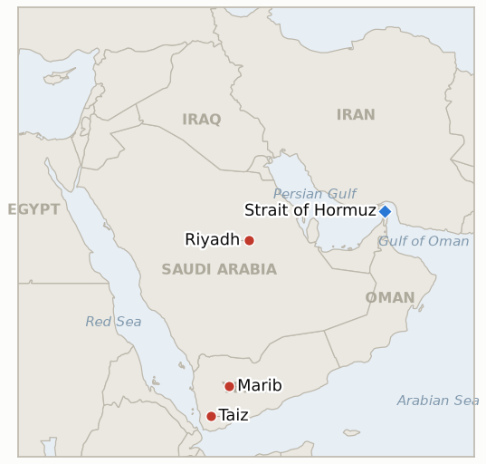

# Middle East Daily Briefing

**September 22, 2026**

- **Reporting window:** ~24 hours, September 21, 09:00 to September 22, 09:00 KST
- **Overall assessment:** Washington's Houthi policy whipsawed within three days: President Trump ordered the Pentagon to prepare direct strikes on the Houthis after a second appeal from Crown Prince Mohammed bin Salman, only to call the operation off at the last minute Sunday as bombs were being loaded, the clearest test yet of whether Riyadh's September 10 request would be met and the clearest answer, for now, that it will not (§1.1). On the Iran track, Trump signaled openness to meeting President Pezeshkian at the UN General Assembly this week even while threatening to "wipe out" Iran's economy or leadership absent a deal, a diplomatic overture that landed the same day Iran's military command warned it has information Washington has decided to resume strikes on Iran itself and threatened sustained retaliation against every US base in the region (§1.2). In Yemen, the war's center of gravity shifted toward the highlands around Marib, the government's last northern stronghold, even as the East-West pipeline's restart missed its own near-final test window (§1.3). South Korea's markets rallied on a genuinely domestic catalyst, record chip exports, as President Lee departed for New York with the investment plan's first public test, a National Assembly briefing, scheduled just after this window closes (§1.4).

---

## 1. What Happened

<figure style="float:right; width:46%; margin:2pt 0 8pt 14pt;">

<figcaption style="font-size:8pt; color:#666; text-align:center; margin-top:3pt; font-style:italic;">Major places of discussion</figcaption>
</figure>

### 1.1 Trump Orders Then Cancels Direct Strikes on the Houthis as Bombs Are Being Loaded

President Trump resisted launching strikes on the Houthis in Wednesday meetings with advisers, then ordered the Pentagon to prepare military action after a Thursday phone call in which Crown Prince Mohammed bin Salman again pressed him to intervene as the Houthis made rapid territorial gains; by Sunday, military commanders had approved target lists and personnel were loading munitions onto designated aircraft when Trump changed course at midday and called the operation off, according to US officials cited by The New York Times ([Haaretz](https://www.haaretz.com/middle-east-news/2026-09-21/ty-article/.premium/report-trump-backtracked-after-ordering-strikes-on-houthis-at-saudis-request/000001a0-c376-d286-adff-d7f670840000); [Gulf News](https://gulfnews.com/world/americas/bombs-loaded-targets-picked-why-trump-pulled-back-from-striking-houthis-1.500682246); [Middle East Monitor](https://www.middleeastmonitor.com/20260921-trump-called-off-planned-us-strikes-on-houthis-at-last-minute-report/)). Reporting attributes the reversal to widespread skepticism among Trump's advisers, the Houthis' standing agreement not to attack American vessels (Trump himself said "the Houthis had agreed not to fight the US"), the 2025 US bombing campaign's failure to eliminate Houthi capability despite striking over 1,000 targets, and the risk of opening a second active military front alongside the ongoing Iran war while destabilizing both Hormuz and Bab el Mandeb simultaneously. This is the fullest test yet of **IND-20260913-2**, Saudi Arabia's September 10 request for direct US strikes: Washington came closer to reversing its original decline than at any point since, then reverted to it, a full round trip rather than a settled escalation. No confirmed US strike on Houthi targets has occurred. **Confidence: High** on the order-and-cancellation sequence itself, sourced to a New York Times report citing administration officials and corroborated by multiple Tier 1 to 2 outlets; **Medium** on the specific stated reasons for the reversal, which rest on officials' characterizations rather than an on-record White House statement.

### 1.2 Trump Signals Openness to Meeting Pezeshkian at the UN as Iran Warns of Retaliation Against US Bases

Asked by Fox News chief foreign correspondent Trey Yingst whether he would meet Iranian President Masoud Pezeshkian on the sidelines of the UN General Assembly this week, Trump said he would "probably be open to it," while separately describing himself as in "deciding mode" and warning that Iran's only options were "wiping Iran out," letting its economy "rot," or reaching a deal ([Arynews](https://arynews.tv/trump-says-he-is-probably-open-to-meeting-irans-president-at-un); [The Week](https://www.theweek.in/news/middle-east/2026/09/20/trump-pezeshkian-meet-on-the-cards-us-president-in-deciding-mode-over-west-asia-deadlock.html)). Pezeshkian and Foreign Minister Araghchi, part of a six member delegation granted US visas, are due in New York for the General Assembly's September 22 to 29 high level week; Iranian officials separately relayed a list of demands to Washington via Qatar that includes an end to the Saudi-Houthi confrontation, release of Iran's frozen assets, and an end to the US Navy's blockade of Iranian ports ([CNBC Africa](https://www.cnbcafrica.com/2026/iranian-president-pezeshkian-to-head-to-new-york-for-un-meeting-as-trump-warns-of-no-deal-consequences)). The same day, Iran's Khatam al Anbiya central command, which oversees the IRGC's joint forces, said Sunday it has information the United States has decided to resume strikes on Iran, pledging "continuous, effective, and painful" retaliation against every American base and position in the region and warning that countries hosting or facilitating a US attack would be "considered complicit" ([Al Jazeera](https://www.aljazeera.com/news/2026/9/21/irans-military-says-us-preparing-to-resume-strikes); [Haaretz](https://www.haaretz.com/middle-east-news/iran/2026-09-20/ty-article/iran-warns-of-new-u-s-attack-threatens-sustained-retaliation-across-region/000001a0-bf3c-d9a4-adf9-bffd64c50000)). No US government statement confirming a decision to resume strikes on Iran itself was found this window, and the warning is distinct from the now-abandoned Houthi strike plan (§1.1). This bears on **IND-20260916-2** (Iran's internal engagement-versus-hardline split) and **IND-20260918-2** (Trump's uncorroborated "direct contact" claim); neither resolves this window, and two new indicators track the meeting prospect and the retaliation threat specifically (**IND-20260922-1**, **IND-20260922-2**). **Confidence: High** on Trump's quoted remarks, sourced directly to the Fox News exchange; **High** on Iran's Khatam al Anbiya statement, reported convergently by Al Jazeera and Haaretz; **Medium** on how literally to read Iran's "decided to resume strikes" characterization, which is Tehran's own framing rather than an independently confirmed US decision.

### 1.3 Houthis Push Toward Marib's Highlands as Yemen's Pipeline Deadline Nears Unmet

Houthi fighters moved Monday to seize strategic highland positions aimed at cutting Yemen's Red Sea coast off from the remaining government held interior, a day after government forces recaptured Mount Numan in western Taiz province following fierce fighting for a chain of highlands (Rasn, Jardad, Al Kadha, Al Wazi'iyah) that control the last overland route linking Taiz city to Aden via Al Turbah and Lahj ([Asharq Al Awsat](https://english.aawsat.com/arab-world/5320712-yemeni-army-repels-houthi-attempts-advance-west-taiz); [US News](https://www.usnews.com/news/world/articles/2026-09-21/houthis-push-for-control-of-yemen-highlands-as-trump-reported-to-have-called-off-airstrikes)). Analysts cited in this window's reporting say the fighting's focus is shifting to Marib, the government's last remaining stronghold in northern Yemen and a major oil and gas hub, with Houthi control there seen as capable of decisively turning the war in the group's favor. No confirmed restart of the Saudi East West pipeline was found this window; Energy Secretary Chris Wright's September 16 "measured in days" characterization is now one day from its own September 23 deadline (**IND-20260917-2**) with no restart disclosed. Oil settled sharply lower Monday, Brent at $100.34 (-3.4%) and WTI at $95.78 (-4.5%), a fourth straight losing session, as traders weighed Trump's stand-down on Houthi strikes and his openness to Iran talks against a pipeline outage increasingly read as less disruptive than initially feared ([CNBC](https://www.cnbc.com/2026/09/21/iran-us-oil-prices-crude-saudi-arabia-.html)). A new indicator tracks the Marib front specifically (**IND-20260922-3**). **Confidence: High** on the Taiz fighting and Mount Numan recapture, converging Arab and Western reporting; **Medium** on Marib as the war's next decisive front, resting on analyst framing rather than a confirmed major engagement; **High** on the absence of a confirmed pipeline restart and on Monday's oil settle figures.

### 1.4 KOSPI Tops 7,000 on Record Chip Exports as Lee Departs for the UN With the Investment Plan's First Public Test Ahead

South Korea's KOSPI rose 113.49 points (+1.65%) to close at 7,007.72, reclaiming the 7,000 level for the first time in seven sessions, as Samsung Electronics surged nearly 5% after the Korea Customs Service reported semiconductor exports of $34.12 billion in the first 20 days of September, up 259.4% year on year and a record, with chips now 47.8% of total exports; institutional investors bought a net 1.49 trillion won and the won firmed 2.3 won to 1,381.00 ([Korea Times](https://www.koreatimes.co.kr/economy/20260921/kospi-regains-7000-as-samsung-electronics-shares-surge-on-record-chip-exports); [Seoul Economic Daily](https://en.sedaily.com/finance/2026/09/21/kospi-reclaims-7000-as-chip-exports-hit-record-high)). President Lee Jae-myung departed Seoul Sept 21 for a weeklong US trip, due to address the UN General Assembly September 22 on UN reform and Korean Peninsula peace, with officials saying contact with Trump could occur "in various formats," including a possible September 22 reception, without a formal bilateral summit confirmed ([Kyunghyang Shinmun](https://www.khan.co.kr/en/article/202609211807067/)). Separately, the National Assembly's Finance and Industry committees are set to receive a closed-door government briefing on the $350 billion investment plan's first disclosed project at 9:30am September 22, just after this window closes, with Deputy Prime Minister nominee Lee Hyoung-il and Trade Minister Kim Jung-kwan expected to attend ([SBS](https://news.sbs.co.kr/english/article.do?news_id=N1008764801); [Korea Herald](https://www.koreaherald.com/article/10879720)); the briefing's outcome will be the first concrete test of **IND-20260919-3** since its own September 26 deadline. **Confidence: High** on the market data and record export figures (Korea Customs Service, converging Korean press); **Medium** on the format and likelihood of any Trump-Lee contact at the UN, which officials themselves describe as unconfirmed and informal.

---

## 2. Deep Dive: Incentives and Motives

### 2.1 Why would Trump order the Pentagon to prepare Houthi strikes and then cancel the operation within three days?

Because a second direct appeal from Mohammed bin Salman raised the political cost of visible inaction enough to justify ordering preparations, but executing the strikes carried real costs that a written order did not: risking the separate Houthi-US shipping truce that has kept American vessels unmolested, opening a second active front alongside the still-unresolved Iran war, and repeating a 2025 campaign that struck over 1,000 targets without eliminating Houthi capability; put to the actual test of loaded aircraft, advisers' skepticism and the absence of a credible ground-force partner tipped the decision back toward the restraint Trump had already chosen once on September 10.

### 2.2 Why would Trump float meeting Pezeshkian while in the same breath threatening to "wipe out" Iran's economy or leadership?

Because pairing maximalist rhetoric with a low-cost diplomatic gesture, a sidelines meeting that requires no concession to arrange, lets Trump claim advantage either way: a meeting would be framed as bringing Iran to the table, while its absence leaves the "wipe out or rot" threat as the operative public message, the same dual-track posture this ledger has tracked since Pezeshkian's own NPT-framed openness collided publicly with SNSC Secretary Rezaei's flat rejection of talks.

### 2.3 Why would Iran's military command publicize a warning about resumed US strikes days after Trump stood down from striking the Houthis?

Because Tehran's warning targets a more central fear than the Houthi episode, a direct US strike on Iran itself rather than a US-backed campaign against a proxy, and framing it as intelligence received rather than a threat issued lets Iran pre-position any future retaliation as defensive and justified; naming host countries as potentially complicit also serves to deter third states from supporting a resumed campaign, a message aimed outward as much as at Washington.

### 2.4 Why would Seoul schedule its most awkward asks, an informal Trump contact and a low-profile investment briefing, for the same UN General Assembly week as the Iran and Gulf diplomacy?

Because a General Assembly week bundles Seoul's asks into a setting built for informal, low-commitment contact: Lee can pursue a Trump meeting without the expectations a formal summit would carry, while a closed-door committee briefing lets the government show the National Assembly tangible progress on the investment package without the public announcement that would invite comparison to the Hormuz-deployment question during exactly the week Gulf leaders, Iran's president, and Trump are all in the same city.

---

## 3. Policy Implications for South Korea

**Exposure snapshot:** South Korea's crude imports remain roughly 70% dependent on Strait of Hormuz transit and about 36% of its LNG imports come from the Middle East, with Qatar's Ras Laffan as the single largest LNG supplier exposure (see `instructions/korea-exposure.md`, last updated August 14, 2026, no update needed this window). Monday's confirmed closes: Brent $100.34 (-3.4%), WTI $95.78 (-4.5%), KOSPI 7,007.72 (+1.65%), won 1,381.00 (+2.3 won stronger).

**Implications by development:**

- **Trump's order-and-cancellation of Houthi strikes (§1.1):** the reversal removes, for now, the nearest-term risk of a wider air campaign disrupting the Red Sea/Yanbu workaround Korean-bound cargoes use, but the episode shows how close that risk came to materializing on a three-day cycle; MOTIE and Korean refiners should treat the underlying Saudi request as live rather than resolved, since a further Houthi provocation could restart the same sequence.
- **Trump's UN openness and Iran's retaliation warning (§1.2):** a genuine Trump-Pezeshkian opening would be the most consequential positive development for Korean energy planners in months, potentially accelerating any Hormuz normalization; Iran's counter-warning of strikes on US bases is the reminder that the diplomatic and military tracks remain live simultaneously, and Korean shipping and insurance planners should not treat the UNGA week's diplomacy as reducing near-term risk until it produces a concrete outcome.
- **The Marib front and the unconfirmed pipeline restart (§1.3):** a Houthi move on Marib would be a Yemen-war-defining event but has limited direct bearing on Korean-bound crude, which moves mainly via the unaffected Red Sea/Yanbu route; the pipeline's continued outage past its own near-final test date matters more for global benchmark prices than for Korea's specific Saudi-sourced volumes.
- **KOSPI's record-export rally and the investment briefing's approach (§1.4):** Monday's rally shows Korean markets can decouple from Middle East headlines when a strong domestic catalyst (record chip exports) dominates; the September 22 National Assembly briefing is now the nearest concrete test of whether the investment track's first project clears its disclosure bar, with outcome expected within hours of this brief's window closing.

**Testable indicators:**

- **IND-20260922-1** (open, new): Trump's stated openness to meeting Pezeshkian at the UN General Assembly has not yet produced a confirmed meeting or contact. Open, deadline ~2026-09-29.
- **IND-20260922-2** (open, new): Iran's Khatam al Anbiya command's warning of a resumed US attack has not yet been borne out by any confirmed US strike on Iran itself. Open, deadline ~2026-10-06.
- **IND-20260922-3** (open, new): Houthi forces are pushing toward highland positions overlooking Marib but no siege, major battle, or territorial loss for government forces has been documented yet. Open, deadline ~2026-10-13.
- **IND-20260920-2** (open): Trump's Gulf Cooperation Council leaders meeting is scheduled for later September 22, after this window's close; no outcome to report yet. Open, deadline ~2026-09-29.
- **IND-20260919-3** (open, trending toward its nearest test): Korea's National Assembly briefing on the investment package's first project is scheduled for 9:30am September 22, just after this window closes; still a closed-door session rather than a confirmed public announcement. Open, deadline ~2026-09-26.
- **IND-20260919-2** (open): No further verified Hormuz incident or disclosed IRGC operational step found this window. Open, deadline ~2026-09-26.
- **IND-20260919-1** (open): No Security Council referral attempt, coordinated allied statement, or other formal follow-up to the UN war crimes finding found this window. Open, deadline ~2026-10-03.
- **IND-20260918-3** (open): No Omani or GCC corroboration of Araghchi's Iran-Oman "agreed" claim found this window. Open, deadline ~2026-10-02.
- **IND-20260918-2** (open): No Iranian government corroboration of Trump's "direct contact" claim found this window; Trump's UNGA overture (§1.2) is a related but distinct signal. Open, deadline ~2026-09-25, three days out.
- **IND-20260917-2** (open, one day from resolution): No confirmed Saudi East-West pipeline restart found this window; Wright's "days" framing is now one day from its own September 23 deadline. Open, deadline ~2026-09-23.
- **IND-20260916-2** (open): No unified Iranian government statement or disclosed US-Iran channel found this window; the Khatam al Anbiya warning (§1.2) reads consistent with the hardline pole of Iran's internal split. Open, deadline ~2026-09-30.
- **IND-20260913-2** (open, completed a full round trip toward and back from escalation): Trump's order to prepare, then cancellation of, direct strikes on the Houthis (§1.1) is the closest Washington has come to reversing its September 10 decision, and its closest return to it; no confirmed US strike occurred and Saudi Arabia's own tempo showed no disclosed further escalation this window. Open, deadline ~2026-09-27, five days out.
- **IND-20260911-2** (open): No further Mecca Joint Defence Agreement invocation or joint operational step found this window. Open, deadline ~2026-10-02.
- **IND-20260906-2** (open): South Korea's Hormuz posture stayed at rhetoric without a military deployment or formal National Assembly motion this window. Open, deadline ~2026-09-28, six days out.

---

## 4. Watch List

- **Whether Korea's September 22 National Assembly briefing produces a public disclosure (IND-20260919-3):** the nearest test in the entire ledger, expected within hours of this brief's window closing.
- **Wright's pipeline-restart "days" framing (IND-20260917-2):** one day from its own September 23 deadline with no restart confirmed.
- **Whether Trump and Pezeshkian actually meet at the UN General Assembly (IND-20260922-1):** the week's most consequential potential diplomatic opening.
- **Whether Iran's warned US strike resumption materializes (IND-20260922-2):** the sharpest near-term military-escalation risk on the board.
- **Whether the Houthis' Marib push produces a major battle or territorial change (IND-20260922-3):** analysts flag Marib as potentially decisive for the wider Yemen war.
- **Trump's September 22 Gulf leaders meeting (IND-20260920-2):** whether it produces any disclosed element of the postwar Iran strategy.
- **South Korea's National Assembly Hormuz deployment motion (IND-20260906-2):** six days from its September 28 deadline.
- **Qatari LNG loadings at Ras Laffan (IND-20260714-4):** still no fresh weekly loading figure, the ledger's longest-running unresolved indicator.

---

## 5. Source Quality Summary

| Claim | Sources | Confidence |
|---|---|---|
| Trump ordered Pentagon to prepare Houthi strikes, then cancelled the operation Sunday as munitions were being loaded | New York Times (via Haaretz, Gulf News, Middle East Monitor, Yahoo/AP; Tier 1-2, converging on a single NYT-sourced report) | High on the sequence, Medium on stated reasons |
| Trump "probably open" to meeting Pezeshkian at UN General Assembly; warns Iran faces a deal, economic rot, or being wiped out | Fox News (Trey Yingst), The Week, Arynews (Tier 1-2, direct quotes) | High |
| Iran's Khatam al Anbiya command warns of "continuous, effective, painful" retaliation against US bases over a claimed resumed-strikes decision | Al Jazeera, Haaretz, NBC News, easternherald (Tier 1-3, converging) | High on the statement, Medium on the underlying claim's accuracy |
| Houthi forces push toward Marib highlands; government forces recapture Mount Numan in Taiz | Asharq Al Awsat, US News, Al Jazeera (Tier 1-2, converging) | High on the fighting, Medium on Marib's "decisive" framing |
| No confirmed East-West pipeline restart this window; Brent $100.34, WTI $95.78 Monday settles | CNBC (Tier 1) | High |
| Strait of Hormuz weekend vessel traffic fell sharply but exact figures conflict (14 vs 36 per The National citing Kpler; 17 vs 37 per Baird Maritime citing Kpler) | The National, Baird Maritime (Tier 1-2, same underlying provider, divergent aggregation) | Medium, direction (sharp weekend decline) high, precise count low |
| KOSPI closes above 7,000 (+1.65%) on record September chip exports; won strengthens to 1,381.00 | Korea Times, Seoul Economic Daily, Korea Customs Service data (Tier 1-2, Korean press) | High |
| Lee Jae-myung departs for UN General Assembly; National Assembly investment briefing set for 9:30am September 22 | Kyunghyang Shinmun, SBS, Korea Herald (Tier 1-2, Korean press) | High on departure and briefing schedule, pending on outcome |
