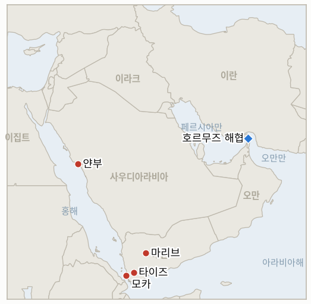

# 중동 일일 브리핑

**2026년 9월 23일**

- **보고 기간:** 약 24시간, 9월 22일 09:00 ~ 9월 23일 09:00 (한국시간)
- **종합 평가:** 전쟁의 외교 트랙이 7월 잠정 합의 결렬 이후 가장 구체적인 진전을 보였다: 트럼프 대통령이 유엔총회 연설에서 이란과 합의하거나 아니면 "전멸"시키겠다고 밝힌 지 몇 시간 뒤, 스티브 위트코프 특사와 아라그치 외교장관이 뉴욕에서 3시간 동안 회동했다. 이는 7월 이후 처음으로 확인된 미·이란 직접 접촉이며, 이란은 별도로 워싱턴이 군사적 압박을 완화하면 7일 내 호르무즈 해협을 재개방하겠다고 제안했으나, 이 제안은 같은 날 갈리바프 국회의장이 재확인한 강경 조건과 어색하게 공존한다(§1.1). 공급 측면도 못지않게 빠르게 움직였다: 사우디아라비아가 드론 공격으로 멈춰 섰던 동서 송유관을 9일 만에 낮은 속도로 재가동하면서 브렌트유가 수 주 만에 처음으로 100달러 아래로 떨어졌으나, 완전 가동까지는 여전히 수 주가 남았다(§1.2). 예멘 전쟁은 냉각되기는커녕 격화됐다: 사우디아라비아의 자체 공습 횟수가 24시간 동안 157회 이상으로 급증했고, 후티 반군은 마리브 고지대 장악 시도를 이어갔으며, 유엔의 8월 6일 이후 사망자 집계는 674명을 넘어섰다(§1.3). 한국은 실질적인 절차적 성과를 거뒀다: 3500억 달러 투자 계획의 첫 프로젝트인 232억 달러 규모 텍사스 가스발전소를 공식 공개했고, 증시는 달러 약세 속에서도 버텨냈다(§1.4). 이번 보고 기간에 지표 7개가 해소됐으며, 이는 전쟁 초기 이후 이 추적 기록에서 가장 많은 하루 해소 건수다.

**정정 및 갱신:** 9월 21일 브리핑(§1.4)과 용어집은 3500억 달러 투자 계획 첫 프로젝트의 부지명을 "엔시날(Ensinal)"로 표기했다. 오늘 보다 상세한 보도로 정확한 명칭이 텍사스주 "엔시널(Encinal)"임이 확인돼, 이번 보고 기간에 용어집 항목을 정정한다(`instructions/glossary-ko.md`).

---

## 1. 무슨 일이 있었나

<figure style="float:right; width:46%; margin:2pt 0 8pt 14pt;">

<figcaption style="font-size:8pt; color:#666; text-align:center; margin-top:3pt; font-style:italic;">주요 논의 지점</figcaption>
</figure>

### 1.1 위트코프·아라그치, 7월 이후 첫 미·이란 직접 회동, 이란은 7일 내 호르무즈 재개방 제안, 트럼프는 "전멸" 위협

트럼프 대통령은 유엔총회 연설에서 이란과 합의를 이루거나 아니면 이란을 "전멸"시켜 "지옥으로" 몰아넣는 것 중 하나를 택해야 하는 상황이라며, 합의가 이뤄지더라도 11월 중간선거 이후에나 가능할 것이라고 예측했다([NBC News](https://www.nbcnews.com/politics/trump-administration/trump-address-united-nations-general-assembly-iran-war-rcna599085)). 몇 시간 뒤 트럼프 대통령은 기자들에게 미국 관계자들이 이란 대표단과 "매우 좋은" 3시간 회동을 가졌다고 밝혔고, 이란 국영매체도 위트코프 특사가 뉴욕에서 아라그치 외교장관을 만났다고 확인했다. 이는 7월 트럼프·페제시키안이 서명한 잠정 합의가 몇 주 만에 결렬된 이후 처음으로 확인된 미·이란 직접 접촉이다([Al Jazeera](https://www.aljazeera.com/news/liveblog/2026/9/22/iran-war-live-irgc-says-us-israel-must-accept-withdrawal-from-region); [Local10/AP](https://www.local10.com/news/politics/2026/09/22/the-latest-trump-says-us-and-iran-met-for-3-hours-after-his-threat-during-united-nations-speech/)). 별도로 이란은 익명의 중재자들을 통해, 워싱턴이 군사적 압박을 완화하고 이란 항구에 대한 해군 봉쇄를 해제하면 7일 내 호르무즈 해협을 재개방하겠다는 제안을 전달했다. 아라그치 장관은 이란이 여전히 "전쟁 상태"에 있으며 첫 조치는 워싱턴이 취해야 한다고 말했다([The National](https://www.thenationalnews.com/news/mena/2026/09/22/iranian-president-heads-to-new-york-for-diplomatic-push-at-un-general-assembly/); [CNBC](https://www.cnbc.com/2026/09/22/us-iran-war-trump-hormuz.html)). 이란 고위 관계자는 트럼프·페제시키안 간 직접 면담 가능성을 배제했으며, 루비오 국무장관은 트럼프가 여전히 면담에 열려 있다고 밝혔으나 이번 보고 기간에 그런 면담은 성사되지 않아 **IND-20260922-1**은 계속 열려 있다. 이 접촉 트랙은 갈리바프 국회의장과 뚜렷한 긴장 관계에 있다: 그는 화요일 이란이 결코 항복하지 않을 것이며 트럼프가 "이란 국민과 군대에 자신의 힘을 강요할 수 없다는 것을 이해해야 한다"고 말했는데, 이는 이란 외교장관이 트럼프의 특사를 만난 바로 그날 나온 발언이다([Times of Israel](https://www.timesofisrael.com/seeking-talks-iran-offers-to-open-hormuz-if-us-ends-blockade-curtails-military-threat/)). 이란 정부 스스로가 위트코프·아라그치 접촉을 확인한 것은 **IND-20260918-2**의 확증 기준을 정확히 충족해 이번 보고 기간에 **확증**으로 해소됐다. 아라그치의 관여와 갈리바프의 강경 메시지 간 내부 균열은 **IND-20260916-2**로 계속 추적되며 열려 있다. 회동의 후속 여부와 워싱턴이 이란의 7일 제안에 응답할지를 각각 추적하는 새 지표 두 개(**IND-20260923-2**, **IND-20260923-3**)를 새로 열었다. **신뢰도: 높음** (유엔 연설, 회동 성사, 이란 측 자체 확인 모두 1등급 매체가 수렴 보도); 3시간 동안 실질적으로 어떤 내용이 오갔는지는 트럼프 본인의 설명에만 의존해 **중간**; 이란의 7일 호르무즈 제안이 진정한 전환인지 협상용 카드인지는 갈리바프의 같은 날 강경 재확인을 고려하면 **중간**.

### 1.2 사우디, 동서 송유관 저속 재가동, 유가는 수 주 만에 처음 100달러 아래로

사우디아라비아는 9월 13일 드론 공격으로 인한 가동 중단 이후 9일 만에 동서 송유관을 낮은 속도로 재가동했으며, 같은 날 홍해 얀부항을 통한 원유 선적도 재개될 수 있다고 밝혔다. 아람코는 하루 약 400만 배럴의 설계 용량을 향해 복구 작업을 진행 중이며, 사정에 정통한 한 관계자는 CNBC에 완전 가동까지 여전히 수 주가 걸릴 수 있다고 전했다([US News](https://www.usnews.com/news/world/articles/2026-09-22/saudi-arabia-restarts-east-west-oil-pipeline-to-resume-exports-from-yanbu-sources-say); [The National](https://www.thenationalnews.com/business/energy/2026/09/22/saudi-arabia-restarts-east-west-pipeline-for-crude-exports/)). 브렌트유는 99.25달러(-1%), WTI는 94.59달러(-1.2%)로 마감해 5거래일 연속 하락했으며, 브렌트유가 수 주 만에 처음으로 100달러를 밑돌았다. 송유관 재가동에 위트코프·아라그치 회동과 이란의 호르무즈 제안(§1.1)까지 겹치면서, 여전히 높은 예멘 공습 강도(§1.3)를 압도한 것으로 보인다. 다른 매체들의 같은 날 시세는 약 98달러에서 102달러까지 엇갈려, 5절에서 짚은 매체 간 상시적 정산가 격차를 다시 보여준다([CNBC](https://www.cnbc.com/2026/09/22/oil-iran-us-bessent-un-crude.html)). 부분 재가동이라도 라이트 에너지장관의 "며칠 내" 시한에 대한 **IND-20260917-2**의 확증 기준을 충족해, 그의 9월 16일 발언으로부터 정확히 일주일 뒤이자 지표 자체의 9월 23일 시한에 맞춰 이번 보고 기간에 **확증**으로 해소됐다. 완전 400만 배럴 가동 도달 여부라는 잔여 질문은 새 지표 **IND-20260923-1**로 이월된다. **신뢰도: 높음** (재가동 자체와 100달러 이하 브렌트유 마감 모두 1등급 통신사·경제매체가 수렴 보도); 정확한 마감가는 이달 내내 추적해 온 매체 간 상시적 격차로 인해 **중간**; 완전 가동 도달 시점은 아람코의 공식 발표가 아닌 단일 소식통 추정에 근거해 **중간**.

### 1.3 사우디 공습, 24시간 157회로 급증, 후티는 마리브 압박 지속, 유엔 사망자 674명 넘어

후티 매체는 사우디아라비아가 월요일 24시간 동안 타이즈, 알자우프, 사다, 마리브 전역에서 최소 157회의 공습을 감행했다고 밝혔으며, 이는 앞선 주말 추적된 하루 28~32회 수준에서 크게 뛴 수치다. 별도로 모카에 대한 공습으로 어린이 2명을 포함해 민간인 6명이 숨졌다([Al Jazeera](https://www.aljazeera.com/news/2026/9/22/houthis-battle-for-strategic-heights-in-yemen-as-thousands-more-flee-homes)). 후티 반군은 예멘 정부의 마지막 북부 거점이자 주요 석유·가스 거점인 마리브를 내려다보는 전략 고지 장악 전투를 이어갔다. 세계보건기구(WHO)는 8월 6일 이후 사망자 674명, 부상자 거의 3000명에 이른다고 밝혔으며, 9월 13~18일 한 주에만 사망 164명, 부상 516명이 발생했고, 이번 달에만 15만8000명 이상이 피란했다고 집계했다([NPR](https://www.npr.org/2026/09/22/g-s1-144261/yemen-houthis-saudi-iran-humanitarian-crisis)). 이번 공습 강도 급증은 사우디아라비아 자체 작전의 명백한 확전으로, **IND-20260913-2**의 확증 기준을 충족해 시한을 나흘 앞두고 이번 보고 기간에 **확증**으로 해소됐다. 후티 목표물에 대한 미국의 확인된 타격은 없었다. 마리브는 아직 함락되지 않았고 대규모 전투가 문서로 확인되지 않아 **IND-20260922-3**은 계속 열려 있다. **신뢰도: 높음** (공습 횟수와 사망자 수치 모두; 공습 횟수는 후티 계열 매체 발표로 일방적 집계이고, 사망자 수치는 독립적인 유엔 기구인 WHO 발표); 강도 급증이 사우디의 의도적 확전 결정을 반영하는지, 단순히 하루치 격화인지는 사우디 정부의 공식 설명이 없어 **중간**.

### 1.4 한국, 3500억 달러 투자 계획 첫 프로젝트 공식 공개, 코스피 7000선 지켜, 원화 강세

한국 정부는 국회 기획재정·산업통상 위원회에, 이어 국내외 언론에 3500억 달러 대미 투자 계획의 첫 프로젝트가 텍사스주 엔시널의 232억 달러 규모 가스복합화력발전소임을 밝혔다. 이 발전소는 인근 AI 데이터센터와 반도체 공장에 전력을 공급할 예정이며, 20년간 최대 450억 달러의 회수가 기대된다고 밝혔다. 당국자들은 한국형 원자로를 활용하는 두 번째 트랙도 논의 중이라고 밝혔다([Korea Herald](https://www.koreaherald.com/article/10882182); [Nikkei Asia](https://asia.nikkei.com/economy/trade-war/trump-tariffs/south-korea-picks-texas-power-plant-for-first-us-investment-pact-project); [Seoul Economic Daily](https://en.sedaily.com/politics/2026/09/22/korea-to-invest-232-billion-in-texas-gas-plant-first-us)). 코스피는 월가 랠리에 힘입어 장 초반 2% 넘게 급등했으나 상승폭 대부분을 반납하며 7017.91(+10.19, +0.15%)로 마감했고, 원화는 광범위한 달러 약세 속에 22.8원 강세를 보이며 1358.2원으로 마감했다([Businesskorea](https://www.businesskorea.co.kr/news/articleView.html?idxno=277569); [Money Today](https://www.mt.co.kr/economy/2026/09/22/2026092215353529240)). 비공개 위원회 회의를 넘어 프로젝트명, 구조, 회수 전망까지 공개된 것은 **IND-20260919-3**의 "정부의 공개 발표" 기준을 충족해, 시한을 사흘 앞두고 이번 보고 기간에 **확증**으로 해소됐다. 이는 9월 연기가 손실 분담 조건을 둘러싼 더 깊은 이견의 신호가 아니라 절차적 문제였음을 확인해준다. 아래 정정 사항 참고: 이 프로젝트의 정확한 지명은 "엔시날"이 아니라 "엔시널"이며, 9월 21일 브리핑과 용어집의 표기를 오늘 정정한다. **신뢰도: 높음** (프로젝트 공개 내용과 시장 데이터 모두 한국·국제 언론이 수렴 보도); 20년간 450억 달러 회수 전망은 독립적으로 검증된 수치가 아니라 정부 추산이어서 **중간**.

---

## 2. 심층 분석: 동기와 이해관계

### 2.1 트럼프는 왜 유엔 연설에서 이란을 "전멸"시키겠다고 위협한 당일에 특사를 3시간 회동에 보냈을까?

두 조치는 모순이 아니라 상호 보완적이기 때문이다. 최대치 공개 위협은 트럼프가 우위를 주장하고 그가 어떤 합의든 결부시킨 중간선거를 앞둔 국내 지지층을 만족시킬 수 있게 해주며, 동시에 위트코프를 통한 조용하고 부인 가능한 회동은 트럼프 스스로 먼저 양보하는 모습을 보이지 않고도 이란이 움직일지를 시험할 수 있게 해준다. 두 조치를 병행하면 선언된 입장을 공개적으로 완화하지 않으면서도 돌파구를 탐색할 수 있다.

### 2.2 이란은 왜 자국 국회의장이 강경 조건을 재확인하고 항복을 배제한 바로 그날 7일 호르무즈 재개방을 제안했을까?

이란의 협상 트랙과 억지 트랙은 서로 다른 청중을 상대하는 서로 다른 기관이 운영하기 때문이다. 아라그치의 외교부는 워싱턴과 국제 여론을 겨냥한 구체적이고 중재자 경유 제안을 내놓을 수 있는데, 이는 정확히 이란 내부의 강경 지지층과 전장 행위자들을 겨냥한 갈리바프의 국회 메시지가 항복으로 비치는 것의 국내적 비용을 낮춰주기 때문이다. 이런 순서 배치는 테헤란이 제안이 무산되더라도 정권 전체를 단일한 공개 입장에 묶지 않으면서 워싱턴의 완화 의지를 시험할 수 있게 해준다.

### 2.3 사우디아라비아는 왜 송유관이 재가동되고 역내 외교가 훈풍을 타는 바로 그 24시간 동안 예멘 공습을 급격히 늘렸을까?

송유관 재가동과 훈풍이 도는 미·이란 외교가 후티 반군에 맞선 사우디아라비아의 별개 미완의 전쟁을 해결해주지는 않기 때문이며, 국제적 관심이 사나가 아닌 뉴욕에 쏠려 있는 지금이야말로 리야드가 마리브 전선에서의 전과를 밀어붙일 최적의 시점이다. 공습 강도 증가는 또한 리야드의 지난 9월 10일 미국 직접 타격 요청이 여전히 거절된 상태인 바로 이 시점에(§1.1, IND-20260913-2), 워싱턴에 사우디의 지속적인 결의를 과시하는 효과도 있다.

### 2.4 서울은 왜 걸프와 이란 외교가 뉴욕에 집중되는 바로 이번 주를 첫 구체적 투자 공개 시점으로 선택했을까?

트럼프, 페제시키안, 걸프 정상들이 모두 같은 도시에 모이는 유엔총회 주간은 서울 자체 발표가 단독 공개 때보다 상대적으로 덜 주목받게 해주기 때문이다. 텍사스 일자리와 AI 관련 전력 수요를 주된 대상으로 하는, 호르무즈와는 무관한 프로젝트를 공개함으로써 정부는 가장 까다로운 외교 공약에서 국회에 진전을 보여주면서도, 수 주째 결론을 미뤄온 파병 문제와의 비교를 피할 수 있다.

---

## 3. 한국에 대한 정책 함의

**노출도 스냅샷:** 한국의 원유 수입은 여전히 약 70%가 호르무즈 해협 통항에 의존하고 있으며, LNG 수입의 약 36%가 중동산으로 카타르 라스라판이 최대 LNG 공급 노출처다(`instructions/korea-exposure.md`, 2026년 8월 14일 최종 갱신, 이번 보고 기간 갱신 불필요). 화요일 확정 마감: 브렌트유 99.25달러(-1%), WTI 94.59달러(-1.2%), 코스피 7017.91(+0.15%), 원화 1358.2원(22.8원 강세).

**사안별 함의:**

- **위트코프·아라그치 회동과 이란의 호르무즈 제안(§1.1):** 7월 이후 첫 미·이란 직접 접촉은 최근 수 주 사이 한국 에너지 당국자들에게 가장 중요한 긍정적 신호다. 상호 응답이 이뤄질 경우 진정한 7일 호르무즈 재개방은 이 추적 기록이 다룬 것 중 가장 큰 규모의 긴장 완화 사건이 될 수 있으나, 갈리바프의 같은 날 강경 재확인을 감안하면 산업통상자원부와 한국 정유사들은 이를 취약하지만 실질적인 돌파구로 다뤄야 하며 이미 확정된 결과로 취급해서는 안 된다.
- **송유관 재가동과 100달러 이하 브렌트유(§1.2):** 부분적 재가동만으로도 한국 정유사들이 이달 직면한 가장 긴박한 단기 공급 신호가 완화됐으나, 하루 400만 배럴 완전 가동까지는 여전히 수 주가 남았다. 한국의 얀부산 물량은 홍해·얀부 경로 정상화의 직접적인 수혜를 받는다.
- **예멘 공습 강도 급증과 마리브 전선(§1.3):** 이번 확전은 예멘 내륙이 아닌 홍해·얀부의 우회 경로를 이용하는 한국행 원유에는 직접적인 영향이 제한적이나, 후티의 마리브 돌파는 예멘 전선에서 구조적으로 가장 중대한 사건이 될 것이며 홍해 해상 운송 위험으로의 파급 여부를 계속 주시해야 한다.
- **한국의 투자 공개와 안정적인 증시(§1.4):** 엔시널 프로젝트의 공개는 남아 있던 절차적 불확실성을 해소하고, 서울에 국회와 미국 양쪽에 보여줄 구체적인 성과를 안겨줬다. 유엔총회 주간 내내 중동 관련 뉴스가 쏟아지는 가운데서도 한국 증시가 변동성 있는 하루를 방향성 붕괴 없이 소화해낸 것은 시장의 내구력을 보여준다.

**검증 가능한 지표:**

- **IND-20260923-1** (열림, 신규): 사우디 동서 송유관의 저속 재가동은 아직 하루 약 400만 배럴 설계 용량에 도달하지 못했다. 열림, 시한 ~2026-11-03.
- **IND-20260923-2** (열림, 신규): 워싱턴이 군사적 압박을 완화하면 7일 내 호르무즈를 재개방하겠다는 이란의 제안에 아직 미국의 공개적 상응 조치가 나오지 않았다. 열림, 시한 ~2026-09-29.
- **IND-20260923-3** (열림, 신규): 위트코프·아라그치 회동은 아직 후속 회동이나 문서화된 틀로 이어지지 않았다. 열림, 시한 ~2026-09-30.
- **IND-20260922-1** (열림): 이번 보고 기간 중 트럼프·페제시키안 간 확인된 면담, 통화, 구조화된 접촉은 없었다. 위트코프·아라그치 회동(§1.1)은 별개의 하위급 접촉이다. 열림, 시한 ~2026-09-29.
- **IND-20260922-2** (열림): 이번 보고 기간 중 이란 본토에 대한 미국의 확인된 타격은 없었다. 열림, 시한 ~2026-10-06.
- **IND-20260919-2** (열림): 이번 보고 기간 중 추가로 확인된 호르무즈 사건이나 공개된 IRGC 작전 조치는 없었다. 열림, 시한 ~2026-09-26, 사흘 남음.
- **IND-20260919-1** (열림): 이번 보고 기간 중 유엔 전쟁범죄 조사 결과에 대한 안보리 회부 시도나 동맹국 공동성명은 없었다. 열림, 시한 ~2026-10-03.
- **IND-20260918-3** (열림): 이번 보고 기간 중 아라그치의 이란·오만 "합의" 주장에 대한 오만이나 GCC 측 확인은 없었다. 오늘의 호르무즈 제안은 명명되지 않은 중재자를 통해 워싱턴에 직접 전달된 별개 트랙이다. 열림, 시한 ~2026-10-02.
- **IND-20260916-2** (열림, 가장 뚜렷한 시험대): 갈리바프의 강경 재확인과 같은 날 이뤄진 위트코프·아라그치 회동(§1.1, §2.2)은 이 지표가 추적해 온 이란 내 관여파와 강경파 간 균열 중 지금까지 가장 뚜렷한 사례다. 여전히 통일된 이란 정부 성명은 없다. 열림, 시한 ~2026-09-30.
- **IND-20260910-1** (열림, 시한 하루 남음): 이번 보고 기간 중 제3국 소재 미군 기지에 대한 추가 확인된 이란의 타격은 없었다. 열림, 시한 ~2026-09-24.
- **IND-20260906-2** (열림): 한국의 호르무즈 대응은 이번 보고 기간에도 군 파병이나 정식 국회 동의안 없이 수사적 표현에 머물렀다. 열림, 시한 ~2026-09-28, 닷새 남음.
- **IND-20260819-3** (열림, 시한 이틀 남음): 케인 상원의원의 오만 전쟁권한 결의안에 대한 본회의 표결은 이번 보고 기간에 확인되지 않았다. 열림, 시한 ~2026-09-25.

---

## 4. 주시 목록

- **이란의 7일 호르무즈 재개방 제안이 미국의 상응 조치를 이끌어낼지 (IND-20260923-2):** 이란 스스로 제시한 시한을 기준으로 검증 가능한, 향후 가장 중대한 긴장 완화 가능 사건이다.
- **위트코프·아라그치 채널이 후속 회동으로 이어질지 (IND-20260923-3):** 7월 합의 결렬 이후 처음으로 확인된 미·이란 직접 접촉이다.
- **유엔총회 고위급 주간이 끝나기 전 트럼프·페제시키안이 직접 만날지 (IND-20260922-1):** 오늘의 특사급 회동과는 구별되는 더 높은 기준이다.
- **사우디 송유관의 하루 400만 배럴 완전 가동 도달 여부 (IND-20260923-1):** 저속 재가동은 확인됐으나 완전 가동은 아직이다.
- **후티의 마리브 압박이 대규모 전투나 영토 변화로 이어질지 (IND-20260922-3):** 분석가들은 여전히 마리브를 예멘 전쟁 전체의 향방을 가를 수 있는 곳으로 본다.
- **케인 상원의원의 오만 전쟁권한 결의안 (IND-20260819-3):** 9월 25일 시한을 이틀 앞두고도 본회의 표결이 확인되지 않았다.
- **한국 국회의 호르무즈 파병 동의안 (IND-20260906-2):** 9월 28일 시한을 닷새 앞두고 있다.
- **카타르 라스라판 LNG 선적량 (IND-20260714-4):** 여전히 최신 주간 선적 수치가 없는, 이 추적 기록에서 가장 오래 미해결 상태인 지표다.

---

## 5. 출처 품질 요약

| 주장 | 출처 | 신뢰도 |
|---|---|---|
| 트럼프, 유엔서 이란과 합의하거나 "전멸"시키겠다고 발언, 합의는 중간선거 이후에나 가능하다고 예측 | NBC News, Fox News, CNN 실시간 보도 (1등급, 직접 인용) | 높음 |
| 위트코프·아라그치, 뉴욕서 3시간 미·이란 회동, 양측 모두 확인 | Al Jazeera, AP/Local10, 알자지라 경유 이란 국영매체 (1~2등급, 수렴 보도, 양측 확인) | 높음 |
| 이란, 미국이 군사적 압박 완화 시 7일 내 호르무즈 재개방 제안 | The National, CNBC, Gulf News (1~2등급, 중재자 경유 제안에 대해 수렴 보도) | 제안 자체는 높음, 갈리바프의 같은 날 강경 발언을 감안하면 진정성은 중간 |
| 갈리바프, 이란은 결코 항복하지 않을 것이라며 위트코프 회동 당일 강경 입장 재확인 | Times of Israel, Al Jazeera (1~2등급) | 높음 |
| 사우디, 동서 송유관 저속 재가동, 하루 400만 배럴 완전 가동은 여전히 수 주 남음 | US News, The National, CNBC (1~2등급, 수렴 보도) | 재가동 자체는 높음, 완전 가동 시점은 중간 |
| 화요일 브렌트·WTI 큰 폭 하락 마감, 다른 매체 같은 날 시세는 약 98달러에서 102달러로 엇갈림 | CNBC (1등급, 채택한 마감가 기준); FinanceFeeds, Cornerstone Futures (3등급, 엇갈리는 시세) | 중간, 방향성(급락, 브렌트유 100달러 이하)은 높음이나 정확한 마감가는 상시적 매체 간 격차의 영향을 받음 |
| 사우디, 24시간 동안 타이즈·알자우프·사다·마리브 전역에서 최소 157회 공습 | Al Jazeera, 후티 매체 집계 인용 (1등급 매체, 집계 자체는 3등급 일방적 출처) | 교전 강도는 높음, 정확한 횟수는 중간 |
| WHO: 8월 6일 이후 예멘 사망 674명, 부상 거의 3000명; 이번 달 피란민 15만8000명 이상 | NPR, WHO 및 예멘 실향민캠프관리집행단 인용 (1등급 매체, 1등급 유엔 기구 출처) | 높음 |
| 한국, 3500억 달러 투자 계획 첫 프로젝트 공개: 텍사스 엔시널 232억 달러 가스발전소 | Korea Herald, Nikkei Asia, Seoul Economic Daily, UPI (1~2등급, 한국·국제 언론 수렴 보도) | 높음 |
| 코스피 7017.91(+0.15%) 마감, 원화 1358.2원으로 강세 | Businesskorea, Money Today (1~2등급, 한국 언론) | 높음 |
