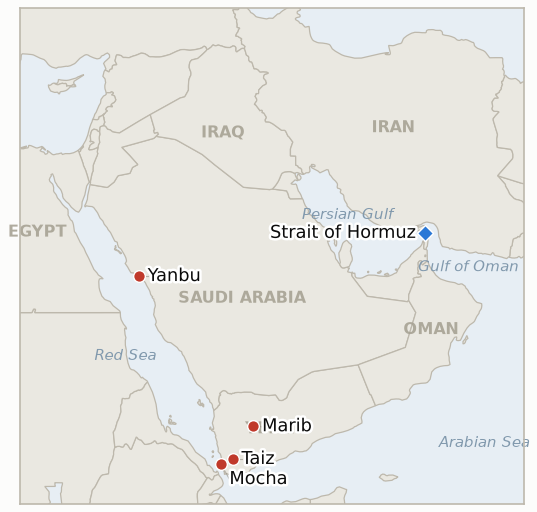

# Middle East Daily Briefing

**September 23, 2026**

- **Reporting window:** ~24 hours, September 22, 09:00 to September 23, 09:00 KST
- **Overall assessment:** The war's diplomatic track produced its most concrete movement since July's collapsed interim deal: hours after President Trump told the UN General Assembly he would either reach a deal with Iran or "annihilate" the country, US envoy Steve Witkoff and Iranian Foreign Minister Araghchi held a three hour meeting in New York, the first confirmed direct US-Iran session in more than two months, while Iran separately offered to reopen the Strait of Hormuz within seven days if Washington eases military pressure, an offer that sits awkwardly beside parliament speaker Ghalibaf's own hardline restatement the same day (§1.1). The supply side moved just as fast: Saudi Arabia restarted its East-West pipeline at a low rate nine days after the drone attack that shut it, pushing Brent below $100 for the first time in weeks even as full capacity stays weeks off (§1.2). Yemen's war intensified rather than cooled, with Saudi Arabia's own strike tempo jumping to at least 157 raids in 24 hours as Houthi forces kept pressing the Marib highlands and the UN's casualty count since August 6 passed 674 dead (§1.3). South Korea notched a genuine procedural win, publicly disclosing the first $350 billion investment package project, a $23.2 billion Texas gas plant, while its markets held their ground on a softer dollar (§1.4). Seven ledger indicators resolve this window, the busiest single day for the tracking record since the war's early weeks.

**Corrections and updates:** The September 21 brief (§1.4) and the glossary rendered the first $350 billion investment project's site as "Ensinal, Texas." Today's fuller reporting confirms the correct name is Encinal, Texas; the glossary entry is corrected this window (`instructions/glossary-ko.md`).

---

## 1. What Happened

<figure style="float:right; width:46%; margin:2pt 0 8pt 14pt;">

<figcaption style="font-size:8pt; color:#666; text-align:center; margin-top:3pt; font-style:italic;">Major places of discussion</figcaption>
</figure>

### 1.1 Witkoff and Araghchi Hold First Direct US Iran Meeting Since July as Iran Offers a Seven Day Hormuz Reopening and Trump Threatens to "Annihilate" Iran

In his address to the UN General Assembly, President Trump said he faced a choice between striking a deal with Iran or moving to "annihilate" the country and drive it "into hell," predicting any deal would come only after November's midterm elections ([NBC News](https://www.nbcnews.com/politics/trump-administration/trump-address-united-nations-general-assembly-iran-war-rcna599085)). Hours later, Trump told reporters US officials had a "very good" three hour meeting with Iran's delegation, and Iranian state media confirmed envoy Steve Witkoff met Foreign Minister Abbas Araghchi in New York, the first confirmed direct US-Iran session since the interim deal Trump and Pezeshkian signed in July collapsed within weeks ([Al Jazeera](https://www.aljazeera.com/news/liveblog/2026/9/22/iran-war-live-irgc-says-us-israel-must-accept-withdrawal-from-region); [Local10/AP](https://www.local10.com/news/politics/2026/09/22/the-latest-trump-says-us-and-iran-met-for-3-hours-after-his-threat-during-united-nations-speech/)). Separately, Iran conveyed an offer through mediators to reopen the Strait of Hormuz within seven days if Washington eases military pressure and lifts its naval blockade of Iranian ports, with Araghchi saying Iran remains in a "state of war" and that the first move must come from Washington ([The National](https://www.thenationalnews.com/news/mena/2026/09/22/iranian-president-heads-to-new-york-for-diplomatic-push-at-un-general-assembly/); [CNBC](https://www.cnbc.com/2026/09/22/us-iran-war-trump-hormuz.html)). A senior Iranian official ruled out a direct Trump-Pezeshkian meeting even as Secretary of State Rubio said Trump remained open to one; no such meeting occurred this window, so **IND-20260922-1** stays open. The engagement track sits in visible tension with parliament speaker Ghalibaf, who said Tuesday that Iran would never surrender and that Trump "cannot impose his power on the Iranian people and its armed forces," the same day Iran's own foreign minister was meeting Trump's envoy ([Times of Israel](https://www.timesofisrael.com/seeking-talks-iran-offers-to-open-hormuz-if-us-ends-blockade-curtails-military-threat/)). The Iranian government's own confirmation of the Witkoff-Araghchi channel meets **IND-20260918-2**'s confirmation bar directly, resolved **Confirmed** this window; the internal split between Araghchi's engagement and Ghalibaf's hardline messaging continues to test **IND-20260916-2**, which stays open. Two new indicators track whether the meeting produces a follow-on session and whether Washington answers Iran's seven day offer (**IND-20260923-2**, **IND-20260923-3**). **Confidence: High** on the UN speech, the meeting's occurrence, and Iran's own state-media confirmation of it, all converging across Tier 1 outlets; **Medium** on how substantively the three hours were spent, which rests on Trump's own characterization rather than a joint readout; **Medium** on whether Iran's seven day Hormuz offer is a genuine shift or a negotiating opener, given Ghalibaf's same-day hardline restatement.

### 1.2 Saudi Arabia Restarts the East West Pipeline at Low Rate as Oil Drops Below $100 for the First Time in Weeks

Saudi Arabia restarted its East-West pipeline at a low pumping rate and could resume crude loadings from the Red Sea port of Yanbu later the same day, nine days after a drone attack forced the September 13 shutdown, with Aramco working to restore the line toward its roughly 4 million barrel a day design capacity while a person familiar with the matter told CNBC full capacity could still take weeks ([US News](https://www.usnews.com/news/world/articles/2026-09-22/saudi-arabia-restarts-east-west-oil-pipeline-to-resume-exports-from-yanbu-sources-say); [The National](https://www.thenationalnews.com/business/energy/2026/09/22/saudi-arabia-restarts-east-west-pipeline-for-crude-exports/)). Brent settled $99.25 (-1%) and WTI $94.59 (-1.2%), oil's fifth straight losing session and the first sub-$100 Brent print in weeks, as the pipeline restart combined with the Witkoff-Araghchi meeting and Iran's Hormuz offer (§1.1) to outweigh the still-elevated Yemen strike tempo (§1.3); other outlets' same-day reads diverged as usual, from roughly $98 to $102, underscoring the standing cross-outlet settle divergence noted in Section 5 ([CNBC](https://www.cnbc.com/2026/09/22/oil-iran-us-bessent-un-crude.html)). The restart, even partial, meets **IND-20260917-2**'s confirmation bar for Energy Secretary Wright's "measured in days" timeline, which is resolved **Confirmed** this window, seven days after his September 16 remark and exactly at the indicator's own September 23 deadline; the residual question, whether the line reaches full 4 million bpd capacity within the analysts' weeks-scale estimate, is carried forward as a new indicator, **IND-20260923-1**. **Confidence: High** on the restart itself and the sub-$100 Brent settle, converging across Tier 1 wire and business outlets; **Medium** on the exact settle figures given the same cross-outlet divergence this ledger has tracked all month; **Medium** on the timeline to full capacity, which rests on a single sourced estimate rather than an Aramco disclosure.

### 1.3 Saudi Strike Tempo Jumps to 157 Raids in 24 Hours as Houthis Keep Pressing Marib and the UN Toll Passes 674 Dead

Houthi media said Saudi Arabia carried out at least 157 air attacks across Taiz, Al-Jawf, Saada and Marib in the 24 hours to Monday, a sharp jump from the roughly 28 to 32 strikes a day tracked over the preceding weekend, while a separate strike on Mocha killed six civilians including two children ([Al Jazeera](https://www.aljazeera.com/news/2026/9/22/houthis-battle-for-strategic-heights-in-yemen-as-thousands-more-flee-homes)). Houthi forces continued battling for strategic heights overlooking Marib, the government's last northern stronghold and a major oil and gas hub, as the World Health Organization said 674 people have been killed and almost 3,000 injured since August 6, including 164 deaths and 516 injuries in the single week of September 13 to 18, with more than 158,000 people displaced this month alone ([NPR](https://www.npr.org/2026/09/22/g-s1-144261/yemen-houthis-saudi-iran-humanitarian-crisis)). The tempo jump, a clear disclosed escalation in Saudi Arabia's own campaign, meets **IND-20260913-2**'s confirmation bar for a disclosed increase in Saudi strike tempo, resolved **Confirmed** this window, four days ahead of its deadline; no confirmed US strike on Houthi targets occurred. Marib itself has not yet fallen or seen a documented major battle, so **IND-20260922-3** stays open. **Confidence: High** on the strike count and casualty figures, sourced to Houthi-aligned media for the tempo (a one-sided tally) and WHO for the toll (an independent UN agency); **Medium** on whether the tempo jump reflects a deliberate Saudi escalation decision versus a single heavy day, since no Saudi government statement characterized the shift.

### 1.4 Korea Publicly Discloses First $350 Billion Investment Project as KOSPI Holds Above 7,000 on a Softer Dollar

South Korea's government told National Assembly finance and industry committees, and then Korean and international press, that the first project under its $350 billion US investment pledge is a $23.2 billion combined-cycle gas power plant in Encinal, Texas, expected to supply power to nearby AI data centers and semiconductor plants and to return up to $45 billion over 20 years; officials said a second track involving Korean-designed nuclear reactors is also under discussion ([Korea Herald](https://www.koreaherald.com/article/10882182); [Nikkei Asia](https://asia.nikkei.com/economy/trade-war/trump-tariffs/south-korea-picks-texas-power-plant-for-first-us-investment-pact-project); [Seoul Economic Daily](https://en.sedaily.com/politics/2026/09/22/korea-to-invest-232-billion-in-texas-gas-plant-first-us)). KOSPI opened more than 2% higher on a Wall Street rally, gave back most of the gain, and closed at 7,017.91 (+10.19, +0.15%), while the won strengthened 22.8 won to 1,358.2 on broad dollar softness ([Businesskorea](https://www.businesskorea.co.kr/news/articleView.html?idxno=277569); [Money Today](https://www.mt.co.kr/economy/2026/09/22/2026092215353529240)). The public disclosure of the project's name, structure and return projections, beyond the closed-door committee session itself, meets **IND-20260919-3**'s bar for a disclosed government announcement, resolved **Confirmed** this window, three days ahead of its deadline and confirming the September postponement was procedural rather than a sign of deeper discord over loss-sharing terms. Note a standing correction below: this project's name is Encinal, not Ensinal as rendered in the September 21 brief and the glossary. **Confidence: High** on the project's disclosure, figures and market data, converging across Korean and international press; **Medium** on the $45 billion, 20 year return projection, which is a government estimate rather than an independently modeled figure.

---

## 2. Deep Dive: Incentives and Motives

### 2.1 Why would Trump threaten to "annihilate" Iran in a UN speech and then send his envoy into a three hour meeting the same day?

Because the two moves are complementary rather than contradictory: a maximalist public threat lets Trump claim leverage and satisfy a domestic audience ahead of the midterms he explicitly tied any deal to, while a quiet, deniable session through Witkoff tests whether Iran will move without requiring Trump to be seen making the first concession himself; pairing them lets Washington probe for an opening without publicly softening its declared position.

### 2.2 Why would Iran offer a seven day Hormuz reopening the same day its own parliament speaker restates hardline conditions and rules out surrender?

Because Iran's negotiating and deterrence tracks are run by different institutions with different audiences: Araghchi's foreign ministry can float a concrete, mediator-relayed offer aimed at Washington and international opinion precisely because Ghalibaf's parliamentary messaging, aimed at Iran's own hardline base and battlefield actors, keeps the domestic cost of appearing to capitulate low; the sequencing lets Tehran test US appetite for de-escalation without committing the regime to a single public position if the overture goes nowhere.

### 2.3 Why would Saudi Arabia sharply increase its own Yemen strike tempo in the same 24 hours its pipeline restarts and regional diplomacy warms?

Because a pipeline restart and warming US-Iran diplomacy do not resolve Saudi Arabia's separate, unfinished war against the Houthis, and Riyadh has every incentive to press its battlefield advantage on the Marib front while international attention is on New York rather than Sanaa; a tempo increase now also demonstrates continued Saudi resolve to Washington at the same moment Riyadh's own September 10 request for direct US strikes remains declined (§1.1, IND-20260913-2).

### 2.4 Why would Seoul choose this exact week, with Gulf and Iranian diplomacy converging on New York, to make its first concrete investment disclosure?

Because a UN General Assembly week that already has Trump, Pezeshkian and Gulf leaders in the same city gives Seoul's own announcement less relative scrutiny than a standalone rollout would, and disclosing a project whose primary audience is Texas jobs and AI-adjacent power demand, rather than anything Hormuz-related, lets the government show National Assembly progress on its hardest diplomatic commitment without inviting comparison to the deployment question it has spent weeks declining to resolve.

---

## 3. Policy Implications for South Korea

**Exposure snapshot:** South Korea's crude imports remain roughly 70% dependent on Strait of Hormuz transit and about 36% of its LNG imports come from the Middle East, with Qatar's Ras Laffan as the single largest LNG supplier exposure (see `instructions/korea-exposure.md`, last updated August 14, 2026, no update needed this window). Tuesday's confirmed closes: Brent $99.25 (-1%), WTI $94.59 (-1.2%), KOSPI 7,017.91 (+0.15%), won 1,358.2 (+22.8 won stronger).

**Implications by development:**

- **The Witkoff-Araghchi meeting and Iran's Hormuz offer (§1.1):** the first confirmed direct US-Iran session since July is the most consequential positive signal for Korean energy planners in weeks; a genuine seven day Hormuz reopening, if reciprocated, would be the single largest de-escalation event this ledger has tracked, but Ghalibaf's same-day hardline restatement means MOTIE and Korean refiners should treat this as a real but fragile opening rather than a resolved outcome.
- **The pipeline restart and sub-$100 Brent (§1.2):** even a partial East-West restart eases the tightest near-term supply signal Korean refiners have faced this month, though full 4 million bpd capacity remains weeks away; Korea's Yanbu-sourced cargoes benefit directly from any Red Sea/Yanbu-route normalization.
- **The Yemen tempo jump and Marib front (§1.3):** the escalation has limited direct bearing on Korean-bound crude, which moves via the unaffected Red Sea/Yanbu route rather than through Yemen's contested interior, but a Houthi breakthrough at Marib would be the war's most structurally significant Yemen-theater event and bears watching for any spillover into Red Sea shipping risk.
- **Korea's investment disclosure and steady markets (§1.4):** the Encinal project's public disclosure removes a lingering procedural uncertainty and gives Seoul a concrete deliverable to show National Assembly and US counterparts alike; markets absorbing a volatile session without a directional break shows Korean equities can hold ground through a UN General Assembly week thick with Middle East headlines.

**Testable indicators:**

- **IND-20260923-1** (open, new): the Saudi East West pipeline's low-rate restart has not yet reached its roughly 4 million bpd design capacity. Open, deadline ~2026-11-03.
- **IND-20260923-2** (open, new): Iran's offer to reopen the Strait of Hormuz within seven days if the US eases military pressure has not yet drawn a disclosed US reciprocal step. Open, deadline ~2026-09-29.
- **IND-20260923-3** (open, new): the Witkoff-Araghchi meeting has not yet produced a confirmed follow-on session or written framework. Open, deadline ~2026-09-30.
- **IND-20260922-1** (open): no confirmed Trump-Pezeshkian meeting, call, or structured encounter occurred this window; the Witkoff-Araghchi session (§1.1) is a distinct, lower-level contact. Open, deadline ~2026-09-29.
- **IND-20260922-2** (open): no confirmed US strike on Iran itself occurred this window. Open, deadline ~2026-10-06.
- **IND-20260919-2** (open): no further verified Hormuz incident or disclosed IRGC operational step found this window. Open, deadline ~2026-09-26, three days out.
- **IND-20260919-1** (open): no Security Council referral attempt or coordinated allied statement on the UN war crimes finding found this window. Open, deadline ~2026-10-03.
- **IND-20260918-3** (open): no Omani or GCC corroboration of Araghchi's Iran-Oman "agreed" claim found this window; today's Hormuz offer runs through unnamed mediators to Washington directly, a distinct track from the Iran-Oman claim. Open, deadline ~2026-10-02.
- **IND-20260916-2** (open, sharpest test yet): Ghalibaf's hardline restatement alongside the same-day Witkoff-Araghchi meeting (§1.1, §2.2) is this indicator's clearest split yet between Iran's engagement and hardline poles; still no unified Iranian government statement. Open, deadline ~2026-09-30.
- **IND-20260910-1** (open, one day from deadline): no further verified Iranian strike on a third-country US-hosting base found this window. Open, deadline ~2026-09-24.
- **IND-20260906-2** (open): South Korea's Hormuz posture stayed at rhetoric without a military deployment or formal National Assembly motion this window. Open, deadline ~2026-09-28, five days out.
- **IND-20260819-3** (open, two days from deadline): no Senate floor vote on Sen. Kaine's Oman war powers resolution confirmed this window. Open, deadline ~2026-09-25.

---

## 4. Watch List

- **Whether Iran's seven day Hormuz reopening offer draws a US reciprocal step (IND-20260923-2):** the most consequential potential de-escalation event on the board, testable against Iran's own proposed timeframe.
- **Whether the Witkoff-Araghchi channel produces a follow-on session (IND-20260923-3):** the first confirmed direct US-Iran contact since July's collapsed deal.
- **Whether Trump and Pezeshkian meet directly before UNGA's high-level week closes (IND-20260922-1):** distinct from and a higher bar than today's envoy-level meeting.
- **The Saudi pipeline's climb toward full 4 million bpd capacity (IND-20260923-1):** the low-rate restart is confirmed, full capacity is not.
- **Whether the Houthis' Marib push produces a major battle or territorial change (IND-20260922-3):** analysts still flag Marib as potentially decisive for the wider Yemen war.
- **Sen. Kaine's Oman war powers resolution (IND-20260819-3):** two days from its September 25 deadline with no confirmed floor vote.
- **South Korea's National Assembly Hormuz deployment motion (IND-20260906-2):** five days from its September 28 deadline.
- **Qatari LNG loadings at Ras Laffan (IND-20260714-4):** still no fresh weekly loading figure, the ledger's longest-running unresolved indicator.

---

## 5. Source Quality Summary

| Claim | Sources | Confidence |
|---|---|---|
| Trump tells UN he will strike a deal with Iran or "annihilate" it; predicts any deal comes after the midterms | NBC News, Fox News, CNN live coverage (Tier 1, direct quotes) | High |
| Witkoff and Araghchi hold a three hour US-Iran meeting in New York, confirmed by both sides | Al Jazeera, AP/Local10, Iranian state media via Al Jazeera (Tier 1-2, converging, both-sided confirmation) | High |
| Iran offers to reopen the Strait of Hormuz within seven days if the US eases military pressure | The National, CNBC, Gulf News (Tier 1-2, converging on mediator-relayed offer) | High on the offer, Medium on its sincerity given Ghalibaf's same-day hardline remarks |
| Ghalibaf says Iran will never surrender, restates hardline posture the same day as the Witkoff meeting | Times of Israel, Al Jazeera (Tier 1-2) | High |
| Saudi Arabia restarts the East-West pipeline at a low rate; full 4 million bpd capacity still weeks away | US News, The National, CNBC (Tier 1-2, converging) | High on the restart, Medium on the capacity timeline |
| Brent and WTI settle sharply lower Tuesday; other outlets' same-day reads diverge from roughly $98 to $102 | CNBC (Tier 1) for the settle figures used; FinanceFeeds, Cornerstone Futures (Tier 3) for the divergent reads | Medium, direction (sharp decline, sub-$100 Brent) high, precise settle figure subject to the standing cross-outlet divergence |
| Saudi Arabia carries out at least 157 strikes in 24 hours across Taiz, Al-Jawf, Saada and Marib | Al Jazeera, citing Houthi media for the count (Tier 1 outlet, Tier 3 one-sided source for the tally itself) | High on the fighting's intensity, Medium on the precise count |
| WHO: 674 killed and nearly 3,000 injured in Yemen's conflict since August 6; 158,000+ displaced this month | NPR, citing WHO and Yemen's Executive Unit for the Management of Displaced Persons Camps (Tier 1 outlet, Tier 1 UN agency source) | High |
| Korea discloses first $350 billion investment project: $23.2 billion Encinal, Texas gas plant | Korea Herald, Nikkei Asia, Seoul Economic Daily, UPI (Tier 1-2, converging Korean and international press) | High |
| KOSPI closes 7,017.91 (+0.15%); won strengthens to 1,358.2 | Businesskorea, Money Today (Tier 1-2, Korean press) | High |
