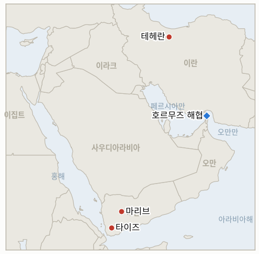

# 중동 일일 브리핑

**2026년 9월 24일**

- **보고 기간:** 약 24시간, 9월 23일 09:00 ~ 9월 24일 09:00 (한국시간)
- **종합 평가:** 어제의 위트코프·아라그치 접촉 채널이 같은 24시간 안에 내용 면에서 심화되는 동시에 국내 정치적 격랑에 부딪혔다: 이란은 위트코프·쿠슈너 특사에게 최대 60일간의 역내 휴전, 단계적 호르무즈 해협 재개방, 해상 봉쇄 해제를 담은 로드맵을 제시했는데, 이는 월요일의 좁은 범위인 7일 시한 호르무즈 단독 제안보다 넓은 것이었다. 같은 날 페제시키안 대통령은 유엔총회에서 이란은 항복하지 않을 것이라고 밝혔고, 혁명수비대 계열 매체와 국회 국가안보위원회는 아라그치 외교장관에게 "침략국 대표"를 만난 권한의 근거를 해명하라고 요구했으며, 소셜미디어의 강경파들은 그와 페제시키안 대통령 본인의 탄핵을 요구했다(§1.1). 시장은 페제시키안의 항전 발언을 가장 지배적인 신호로 받아들였다: 유가는 5거래일 연속 하락세를 끊고 브렌트유가 3.9% 오른 103.08달러, WTI가 1.8% 오른 92.16달러로 마감해, 화요일 수 주 만에 처음이었던 브렌트유 100달러 이하 마감을 급격히 되돌렸다(§1.2). 예멘 전쟁은 월요일의 급증세에서 냉각됐다. 사우디아라비아의 공습 횟수가 24시간 19회로 되돌아갔고, 9월 중순 타이즈에서의 정부군 탈환지는 도전받지 않고 유지되고 있다(§1.3). 한국 증시는 추석 연휴를 앞두고도 상승세를 이어갔으나, 정부 자체의 호르무즈 파병 문제는 여전히 검토 단계에 머물렀다(§1.4). 이번 보고 기간에 지표 1개(IND-20260910-1)가 기각으로 해소됐고, 이란의 광범위한 로드맵, 아라그치에 대한 반발, 유가의 100달러 돌파 지속 여부를 각각 추적하는 새 지표 3개가 열렸다.

**정정 및 갱신:** 9월 23일 브리핑(§1.1)은 위트코프·아라그치 회동을 이란 국영매체와 트럼프 대통령 본인의 설명에 근거해 "확인된" 3시간 직접 회동으로 서술했다. 오늘의 보다 상세한 보도(RFE/RL)는 이 서술에 단서를 단다: 이란 외교부는 접촉이 카타르 중재자를 통해 이뤄졌다고 설명했고, 위트코프 본인도 대표단 사이를 오간 "중재자들"을 언급했으며, 양국 정부 모두 문자 그대로의 대면 회동을 공식 확인하지 않았다. 이 브리핑은 어제의 서술을 철회하기보다 §1.1과 IND-20260916-2를 통해 이 단서를 이어간다. 알자지라, AP/Local10, Axios 등 복수의 1등급 매체가 여전히 실질적인 접촉이 있었다고 보도하고 있어, 쟁점은 접촉 여부가 아니라 그 정확한 형식이다.

---

## 1. 무슨 일이 있었나

<figure style="float:right; width:46%; margin:2pt 0 8pt 14pt;">

<figcaption style="font-size:8pt; color:#666; text-align:center; margin-top:3pt; font-style:italic;">주요 논의 지점</figcaption>
</figure>

### 1.1 이란, 60일 휴전 로드맵 제시, 페제시키안은 항복 없다 선언, 강경파는 아라그치에 등 돌려

이란 외교장관 아바스 아라그치와 미국 특사 스티브 위트코프, 재러드 쿠슈너는 유엔총회를 계기로 중재자를 통해 회동했으며, 이 자리에서 이란은 최대 60일간의 역내 휴전, 호르무즈 해협의 단계적 재개방, 미국의 이란 항구 해상 봉쇄 해제를 요구하는 상세한 로드맵을 제시했다. 이는 전날 제기된 좁은 범위의 7일 시한 호르무즈 단독 제안보다 넓은 것이다([The National](https://www.thenationalnews.com/news/mena/2026/09/23/iran-us-meeting-new-york/); [Axios](https://www.axios.com/2026/09/22/unga-iran-us-trump-war)). 위트코프와 함께 쿠슈너가 자리했다는 사실이 새롭게 확인됐으며, 트럼프 대통령은 이 회동을 "매우 생산적"이었다고 부르며 합의를 향한 "많은 모멘텀"이 있다고 말했고, 다음 회동이 "매우 가까운 시일 내"에 있을 것으로 예상된다고 밝혔다([Israel Hayom](https://www.israelhayom.com/2026/09/23/witkoff-kushner-attended-us-iran-meeting-another-expected-soon/)). 몇 시간 뒤 페제시키안 대통령은, 자국이 유엔 주최국과 전쟁 중인 상태에서 유엔총회에 참석한 첫 정부 수반으로서, 미국과 이스라엘의 폭격으로 숨졌다고 밝힌 어린이들의 사진과 최고지도자 하메네이의 초상을 들어 보이며 이란인이야말로 진정한 "테러의 피해자"라고 선언했고, 이란은 "무력의 언어를 받아들이지 않으면서 대화와 외교에 나설 준비가 돼 있다"고 말했다([CNBC](https://www.cnbc.com/2026/09/23/iran-united-nations-trump-israel.html); [Washington Times](https://www.washingtontimes.com/news/2026/sep/23/defiant-pezeshkian-rails-trump-us-israel-fiery-un-speech/)). 이란군은 별도로 트럼프의 유엔 "전멸" 위협을 미국의 "전략적 절박함"의 신호라고 규정하며 공격을 받을 경우 더욱 "타격적인" 반격에 나서겠다고 경고했다([CNBC](https://www.cnbc.com/2026/09/23/us-iran-war-trump-hormuz.html)). 이 접촉 트랙은 즉각적인 국내 반발에 부딪혔다: 혁명수비대 계열 매체 타스님과 파르스는 회동의 목적에 의문을 제기하며 이것이 워싱턴에 대한 유가 압박을 완화시킬 위험이 있다고 경고했고, 국회 국가안보위원회 소속 에브라힘 레자에이 의원은 아라그치 장관에게 어떤 권한으로 "침략국 대표"를 만났는지 해명하라고 요구했으며, 익명의 소셜미디어 강경파들은 아라그치 또는 페제시키안의 탄핵을 요구했다. 평론가 모흐센 마그수디는 이란이 여전히 위협 아래 있는 상황에서 협상은 "순전한 어리석음"이라고 비판했다([RFE/RL](https://www.rferl.org/a/iran-us-meeting-araqchi-witkoff-hardliners/33862712.html)). 같은 RFE/RL 보도는 양국 정부 모두 회동이 문자 그대로 대면으로 이뤄졌는지를 공식 확인하지 않았으며, 이란 외교부는 접촉이 카타르 중재자를 통했다고 설명했다는 점도 지적한다. 위 정정 사항 참고. 로드맵 제시는 IND-20260923-2의 좁은 제안과 구별되는, 더 넓은 범위의 공개된 조치로서 **IND-20260924-1**을 새로 연다. 아라그치에 대한 반발은 **IND-20260924-2**를 새로 열어 공식적인 제도적 결과로 이어지는지를 추적한다. 이란의 관여파·강경파 균열이 해소되는지를 추적하는 **IND-20260916-2**는 오늘 사태로 해소되기는커녕 더 날카로워진 채 계속 열려 있다. **신뢰도: 높음** (페제시키안의 유엔 발언과 국내 반발의 발생 자체는 CNBC, Washington Times, RFE/RL, IranWire 등 1등급 및 전문 매체가 수렴 보도); 로드맵의 정확한 조건은 The National 위주 보도에 Axios가 회동 성사만을 뒷받침하고 있어 **중간**; 위트코프·아라그치 접촉이 문자 그대로 대면이었는지는 오늘의 형식 관련 모호함으로 인해 **중간, 이전의 높음에서 하향**.

### 1.2 페제시키안의 항전 발언에 유가 5거래일 하락세 끊고 100달러 위로 복귀

브렌트유는 3.9% 오른 103.08달러, WTI는 1.8% 오른 92.16달러로 마감해 5거래일 연속 하락세를 끝냈고, 화요일 수 주 만에 처음이었던 브렌트유 100달러 이하 마감을 되돌렸다. 페제시키안의 "항복하지 않겠다"는 유엔 발언이 사우디 송유관 재가동과 위트코프·쿠슈너 채널이 끌어내리고 있던 유가에 전쟁 위험 프리미엄을 다시 불어넣은 것으로 풀이된다([CNBC](https://www.cnbc.com/2026/09/23/iran-us-talks-crude-oil-un-wti.html)). 이번 반전은 시장이 그동안 쌓인 완화적 뉴스의 총량이 아니라 한계적 신호를 가격에 반영한다는 점을 보여준다. 이란이 자국 외교장관을 워싱턴과 접촉했다는 이유로 공개적으로 공격한 바로 그날, 이란의 국가원수가 내놓은 단호한 발언 하나가 단기적으로는 송유관 재가동에 따른 실물 공급 완화 효과를 압도한 것이다. 이번 상승은 **IND-20260924-3**을 새로 열어, 브렌트유가 향후 한 주간 100달러 이상을 유지할지 아니면 외교 채널이 다시 힘을 받으며 되돌아갈지를 시험한다. **신뢰도: 높음** (마감가와 방향성 모두 CNBC 보도에 근거하며 그날의 전반적인 항전 서사와 일치); 이번 움직임이 페제시키안 발언 자체에 얼마나 기인하는지, 아니면 유엔 주간 전반의 불확실성에 기인하는지는 **중간**.

### 1.3 예멘 공습 강도 평시 수준으로 되돌아가는 가운데 타이즈 정부군 탈환지는 유지

후티 반군 대변인 야히아 사레는 사우디 전투기가 화요일까지 24시간 동안 타이즈, 알자우프, 마리브 전역에서 19회의 공습을 감행했다고 밝혔는데, 이는 이 추적 기록이 명백한 확전으로 간주했던 월요일의 157회 급증에서 크게 꺾인 수치다. 후티 반군은 타이즈 시내 주거 지역에 포격을 가했고 모카 상공에서는 정찰 드론 한 대를 격추했다고 밝혔다([Al Jazeera](https://www.aljazeera.com/news/2026/9/23/yemen-government-forces-claim-control-of-mount-qarfan-in-taiz)). 오늘 게재됐지만 실제로는 9월 17일 예멘군 미디어센터가 확인한 작전을 다룬 같은 보도는, 타이즈 서부 카르판산에 대한 정부군의 탈환이 후티 측의 반박 주장 없이 유지되고 있다고 전한다. 이는 이번 보고 기간의 새로운 전장 사건이 아니라 유지되고 있다고 확인된 배경 정보이며, 예멘 관련 보도가 실제 사건보다 얼마나 지연되는 경우가 많은지를 보여주는 대목이라 명시해 둘 가치가 있다. WHO의 8월 6일 이후 누적 사망자 집계는 674명, 부상자 거의 3000명으로 어제 수치와 변동이 없다([NPR](https://www.npr.org/2026/09/22/g-s1-144261/yemen-houthis-saudi-iran-humanitarian-crisis)). 공습 강도의 후퇴와 타이즈 전선의 유지는 후티의 마리브 진격이 결정적 국면 전환을 만들어내는지를 추적하는 **IND-20260922-3**을 이번 보고 기간 별다른 움직임 없이 계속 열어둔다. **신뢰도: 높음** (공습 횟수는 후티군 대변인이라는 일방적이지만 구체적인 출처를 1등급 매체가 보도); 카르판산 유지 여부는 후티 측 반박 주장의 부재에 근거할 뿐 독립적으로 검증되지 않아 **중간**; 변동 없는 WHO 사망자 수치는 **높음**.

### 1.4 한국 증시, 추석 연휴 앞두고 상승세 이어가는 가운데 호르무즈 파병 문제는 정체

코스피는 63.01포인트(0.90%) 오른 7080.92로 마감해 추석 연휴 휴장을 앞두고 4거래일 연속 상승을 이어갔다. 반도체 강세가 지속되며 삼성전자(3%대 이상 상승)와 SK하이닉스가 상승을 주도했으나, 개인과 외국인 투자자들의 막판 차익 실현으로 장 초반 1.94% 급등분의 상당 부분이 반납됐다(기관 순매수 3170억 원, 외국인 순매도 5101억 원)([서울신문](https://www.seoul.co.kr/news/economy/securities/2026/09/23/20260923500251); [SBS Biz](https://biz.sbs.co.kr/article/20000336548)). 원화는 0.2원 약세를 보이며 1358.4원으로 거의 보합 마감했다([머니투데이](https://www.mt.co.kr/economy/2026/09/23/2026092315301712830)). 한국 자체의 호르무즈 파병 문제는 이렇다 할 진전을 보이지 못했다: 이재명 대통령이 "전쟁에 관여하거나 개입하는" 파병은 없다고 선을 그으면서도, 실전 지역인 호르무즈 해협으로 작전 범위를 넓히려면 국회 동의가 필요한 비전투 목적의 청해부대 활동 강화를 검토 중이라는 9월 18일자 입장에서 변화가 없었으며, 시민사회 연대는 서울역 1번 출구 앞에서 파병 반대 집회와 서명 운동을 벌였다([참여연대](https://peoplepower21.org/peace/2029856)). 파병 문제가 국회 표결이나 정식 동의안 제출로 이어지는지를 추적하는 **IND-20260906-2**는 시한을 닷새 앞두고 계속 열려 있다. **신뢰도: 높음** (시장 수치는 한국 경제매체들이 수렴 보도); 파병 관련 진전이 없다는 점도 정부가 9월 중순 이후 반복해 온 "검토 중" 입장과 일치해 **높음**.

---

## 2. 심층 분석: 동기와 이해관계

### 2.1 이란은 왜 강경파가 자국 외교장관을 "침략국 대표"를 만났다고 비난하는 바로 그날 중재자를 통해 상세한 휴전 로드맵을 제시했을까?

테헤란이 서로 다른 청중을 겨냥해 서로 다른 기관을 통해 두 개의 트랙을 동시에 운영하고 있기 때문이다. 중재를 거친, 부인 가능한 채널은 이란 정부가 압박 속에서 협상하고 있음을 공식적으로 인정하지 않으면서도 워싱턴의 실제 조건을 시험할 수 있게 해주며, 그 관여가 가시화되는 데 따른 국내 정치적 비용은 정권의 "강압 속 협상 불가" 원칙이 아니라 아라그치 개인에게 돌아간다. 로드맵 제시를 명목상 간접적인 형태(이란 외교부 스스로 밝힌 카타르 중재자 경유)로 유지하는 것은, 오늘의 강경파 반발이 보여주듯 테헤란이 필요로 하는 바로 그 부인 가능성을 지켜준다.

### 2.2 송유관 재가동과 위트코프·쿠슈너 채널이라는 이번 주의 지배적 신호가 여전히 완화적이었음에도, 왜 단 한 번의 항전 발언에 유가가 4%가량 뛰었을까?

시장은 쌓인 호재의 총량이 아니라 한계적 정보를 가격에 반영하기 때문이다. 이란 정부가 미국과의 접촉에 나선 자국 최고 협상 책임자를 공개적으로 공격하는 바로 그날, 이란의 국가원수가 세계에서 가장 이목이 집중된 무대에서 내놓은 공개적이고 단호한 "항복하지 않겠다"는 발언은, 이란의 지배적 정치 세력이 아직 호르무즈 접근권을 제재 완화와 맞바꿀 준비가 되지 않았다는 새로운 증거로 읽혔다. 이 단일한 신호가 수요일 장에서는 송유관 재가동과 로드맵의 존재 자체가 이미 가격에 반영해 놓았던 실물 공급 완화 효과를 압도했다.

### 2.3 사우디아라비아는 왜 자국의 외교적·시장 여건이 개선되는 바로 이 시점에 예멘 공습 강도를 월요일 수준의 일부로 낮췄을까?

월요일의 157회 급증은 지속적인 확전 결정이라기보다는 후티의 마리브 고지대에 대한 특정한 시한부 진격에 대응한 것일 가능성이 높으며, 능력과 결의를 모두 입증한 상황에서 즉각적인 영토 위협이 완화되자 리야드가 공습 출격 횟수를 아낄 유인이 충분하기 때문이다. 특히 자국의 송유관 복구와 워싱턴과의 관계 개선이라는 요인은, 뉴욕에서 벌어지는 더 큰 외교적 국면을 복잡하게 만들 수 있는 가시적인 확전보다는 예멘 문제를 낮은 수위로 관리하는 쪽을 뒷받침한다.

### 2.4 한국 정부 자체의 호르무즈 파병 문제가 여전히 검토 단계에 머물러 있는데도, 한국 증시는 왜 연휴를 앞두고 4거래일 연속 상승세를 이어갔을까?

코스피의 상승세는 한국의 중동 관련 노출이 해소된 데 따른 것이 아니라 반도체 펀더멘털과 글로벌 위험 선호 심리에 압도적으로 좌우되고 있기 때문이다. 따라서 파병 문제가 계속 답보 상태에 있고 이제는 거리 시위로까지 번진 것은 시장이 전혀 가격에 반영하지 않고 있는 국내 정치적 비용이다. 투자자들은 실제 군사적 또는 외교적 결정이 나와 측정 가능한 경제적 결과를 낳기 전까지는 한국의 호르무즈 관련 입장을 배경 소음 정도로 취급하는 것으로 보인다.

---

## 3. 한국에 대한 정책적 함의

**노출 스냅샷:** 한국의 원유 수입은 여전히 약 70%가 호르무즈 해협 통과에 의존하고 있으며, LNG 수입의 약 36%가 중동산으로, 카타르 라스라판이 단일 최대 LNG 공급 노출처다(`instructions/korea-exposure.md` 참조, 2026년 8월 14일 최종 갱신, 이번 보고 기간 갱신 불필요). 수요일 확정 마감가: 브렌트유 103.08달러(+3.9%), WTI 92.16달러(+1.8%), 코스피 7080.92(+0.90%), 원화 1358.4원(거의 보합).

**개발별 함의:**

- **이란의 광범위한 로드맵과 아라그치에 대한 반발(§1.1):** 역내 휴전과 단계적 호르무즈 재개방을 담은 로드맵의 내용은 7월 잠정 합의 이후 테이블에 오른 가장 중대한 외교적 제안이지만, 같은 날의 강경파 반발은 산업통상자원부와 한국 정유업계에 이란의 협상 트랙이 여전히 제도적으로 취약하다는 점을 상기시킨다. 위 정정 사항에서 짚은 형식상의 모호함 역시 이 채널의 지속성을 과대평가하지 말라는 경고다.
- **100달러 위로의 유가 반전(§1.2):** 수 주 만에 가장 급격한 하루 유가 변동은 실물 공급의 실제 변화 없이도 한국 정유업계의 단기 비용 전망이 정치적 수사만으로 얼마나 빠르게 뒤집힐 수 있는지를 보여준다. 이번 변동을 견뎌낸 코스피 자체의 견조함(§1.4)은 한국 증시가 아직 이번 유가 상승을 지속적인 재평가로 가격에 반영하지 않았음을 시사한다.
- **예멘 공습 강도 냉각(§1.3):** 홍해·얀부 항로를 통해 이동하는 한국행 원유에 미치는 직접적 영향은 여전히 제한적이며, 타이즈 전선이 변동 없이 유지되는 것은 당분간 마리브 관련 해상 운송 위험 우려를 낮춘다.
- **한국의 정체된 파병 문제와 견조한 증시(§1.4):** 한국 자체의 호르무즈 관련 입장에 무심한 시장과, 여전히 "검토 중" 단계에 머물러 있는 데다 이제는 거리에서 가시적으로 이의가 제기되고 있는 국내 정치 과정 사이의 괴리는, 파병 문제가 결국 국회 표결로 이어질 경우 향후 변동성의 잠재적 원천이 될 수 있어(IND-20260906-2) 외교부와 대통령실이 주시할 가치가 있다.

**검증 가능한 지표:**

- **IND-20260924-1** (열림, 신규): 이란의 광범위한 휴전 및 단계적 호르무즈 재개방 로드맵에 아직 7일 시한 제안과 구별되는 미국 측 공개 대응이 나오지 않았다. 열림, 시한 ~2026-09-30.
- **IND-20260924-2** (열림, 신규): 아라그치에 대한 혁명수비대 계열 매체·국회의 반발이 아직 공식적인 제도적 결과로 이어지지 않았다. 열림, 시한 ~2026-10-07.
- **IND-20260924-3** (열림, 신규): 100달러 위로의 브렌트유 반등이 이후 일주일간의 연속 마감가로 아직 검증되지 않았다. 열림, 시한 ~2026-09-30.
- **IND-20260923-2** (열림): 이란의 7일 시한 호르무즈 재개방 제안에 아직 미국 측의 공개 상응 조치가 나오지 않았다. 오늘의 더 넓은 로드맵으로 범위가 확장됐을 뿐 해소된 것은 아니다. 열림, 시한 ~2026-09-29, 5일 남음.
- **IND-20260923-3** (열림): 이번 보고 기간 추가 위트코프·아라그치 회동은 열리지 않았으나, 트럼프는 "매우 가까운 시일 내" 회동을 예상한다고 밝혔다. 열림, 시한 ~2026-09-30.
- **IND-20260919-2** (열림, 시한 이틀 앞): 이번 보고 기간 추가 호르무즈 사건이나 공개된 혁명수비대 작전은 발견되지 않았다. 열림, 시한 ~2026-09-26.
- **IND-20260916-2** (열림, 가장 날카로운 시험): 오늘의 아라그치 반발은 이란의 관여파·강경파 균열을 해소하기는커녕 더 심화시켰다. 열림, 시한 ~2026-09-30.
- **IND-20260922-1** (열림): 양측 모두 유엔총회 참석을 위해 뉴욕에 있었으나 이번 보고 기간 트럼프·페제시키안 간 확인된 면담이나 접촉은 없었다. 열림, 시한 ~2026-09-29.
- **IND-20260906-2** (열림, 5일 남음): 한국의 호르무즈 입장은 국회 동의안이나 표결 없이 검토 단계에 머물렀으며, 시민사회 연대가 파병 반대 집회를 열었다. 열림, 시한 ~2026-09-28.
- **IND-20260819-3** (열림, 시한 하루 앞): 이번 보고 기간 케인 상원의원의 오만 전쟁권한 결의안에 대한 상원 표결은 확인되지 않았다. 열림, 시한 ~2026-09-25.
- **IND-20260922-3** (열림): 후티의 마리브 진격은 이번 보고 기간 별다른 움직임이 없었으며, 정부군의 타이즈 탈환지(카르판산)는 도전받지 않고 유지되고 있다. 열림, 시한 ~2026-10-13.
- **IND-20260714-4** (열림, 시한 없음): 여전히 카타르 라스라판의 최신 주간 선적 수치가 없으며, 이 추적 기록에서 가장 오래 미해소 상태인 지표다.

---

## 4. 주시 목록

- **이란의 광범위한 휴전 로드맵에 미국이 대응할지 여부(IND-20260924-1):** 7월 이후 가장 실질적인 외교적 제안이지만 국내에서 자체적인 강경파 반발에 직면해 있다.
- **아라그치 반발이 공식적인 결과로 이어질지 여부(IND-20260924-2):** 탄핵 요구는 아직 비공식적이고 소셜미디어 위주지만, 국회 국가안보위원회는 공식적으로 해명을 요구했다.
- **브렌트유가 100달러 위를 유지할지 여부(IND-20260924-3):** 수요일의 반등이 5거래일 하락세를 끊었으나, 이후 며칠간의 마감가가 그 지속성을 보여줄 것이다.
- **케인 상원의원의 오만 전쟁권한 결의안(IND-20260819-3):** 9월 25일 시한을 하루 앞두고 확인된 표결이 없다.
- **한국 국회의 호르무즈 파병 동의안(IND-20260906-2):** 9월 28일 시한을 닷새 앞두고 있으며, 이제는 가시적인 거리 반대에 직면했다.
- **위트코프·아라그치 채널의 정확한 형식:** 오늘의 보도는 어제의 "확인된 직접 회동" 서술을 복잡하게 만든다. 양국 정부 중 한쪽이 명확히 할지 주시할 필요가 있다.
- **카타르 라스라판의 LNG 선적(IND-20260714-4):** 여전히 최신 주간 선적 수치가 없으며, 이 추적 기록에서 가장 오래 미해소 상태인 지표다.

---

## 5. 출처 품질 요약

| 주장 | 출처 | 신뢰도 |
|---|---|---|
| 이란이 위트코프·쿠슈너에게 60일 역내 휴전, 단계적 호르무즈 재개방, 봉쇄 해제를 담은 로드맵 제시 | The National, Axios (1~2등급, The National이 상세 조건 제공, Axios가 회동 성사 뒷받침) | 정확한 조건은 중간, 실질적 회동 성사는 높음 |
| 쿠슈너가 위트코프와 함께 참석, 트럼프에 따르면 다음 회동 곧 예상 | Israel Hayom, US News (2등급, 수렴) | 높음 |
| 페제시키안, 유엔에서 항복 없다 선언, 미국·이스라엘 폭격 피해 어린이 사진 공개 | CNBC, Washington Times, UN News (1등급, 수렴, 직접 인용) | 높음 |
| 이란군, 트럼프의 "전멸" 위협을 "전략적 절박함"으로 규정 | CNBC | 높음 |
| 혁명수비대 계열 매체와 국회가 아라그치에게 권한 해명 요구, 소셜미디어에서 탄핵 요구 | RFE/RL, IranWire (2등급, 이란 전문 매체, 수렴) | 반발 발생 자체는 높음, 정치적 파급력은 중간 |
| 양국 정부 모두 위트코프·아라그치의 문자 그대로 대면 회동을 공식 확인하지 않음, 접촉은 카타르 중재자 경유로 설명 | RFE/RL | 중간, 단일 매체의 단서로 다른 곳에서 아직 뒷받침되거나 부인되지 않음 |
| 브렌트유 103.08달러(+3.9%), WTI 92.16달러(+1.8%) 마감, 5거래일 하락세 종료 | CNBC | 높음 |
| 사우디, 24시간 타이즈·알자우프·마리브 전역에서 19회 공습, 월요일 157회에서 감소 | Al Jazeera, 후티군 대변인 야히아 사레 인용 (1등급 매체, 3등급 일방적 출처의 수치) | 감소 방향은 높음, 정확한 횟수는 중간 |
| 정부군의 타이즈 카르판산 탈환(9월 17일 확인)이 후티 측 반박 없이 유지 | Al Jazeera, 예멘군 미디어센터 인용 | 중간, 후티 측 주장의 부재는 독립적 검증이 아님 |
| WHO: 8월 6일 이후 예멘 사망자 674명, 부상자 거의 3000명, 어제와 변동 없음 | NPR, WHO 인용 | 높음 |
| 코스피 7080.92(+0.90%) 마감, 4거래일 연속 상승, 추석 연휴 앞둠 | 서울신문, SBS Biz, 아시아경제 (1~2등급, 한국 언론 수렴) | 높음 |
| 원화 1358.4원으로 거의 보합 | 머니투데이 (1~2등급, 한국 언론) | 높음 |
| 한국의 호르무즈 파병 문제 검토 단계 유지, 서울역 파병 반대 집회 개최 | 참여연대, 이재명 대통령 9월 18일 발언 배경(news1.kr) | 높음 |
