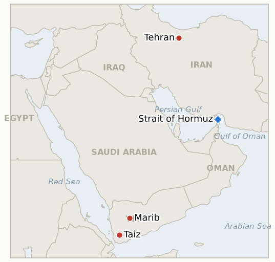

# Middle East Daily Briefing

**September 24, 2026**

- **Reporting window:** ~24 hours, September 23, 09:00 to September 24, 09:00 KST
- **Overall assessment:** Yesterday's Witkoff-Araghchi channel deepened into substance and hit domestic turbulence in the same 24 hours: Iran presented US envoys Steve Witkoff and Jared Kushner a road map for a regionwide ceasefire of up to 60 days, a phased Strait of Hormuz reopening, and an end to the naval blockade, broader than Monday's narrower seven day Hormuz offer, while President Pezeshkian told the UN General Assembly Iran will not surrender and IRGC aligned media and parliament's national security committee demanded Foreign Minister Araghchi explain his authorization for meeting "the representative of an aggressor enemy," with social media hardliners calling for his or Pezeshkian's own impeachment (§1.1). Markets read Pezeshkian's defiance as the dominant signal: oil snapped a five session losing streak, Brent settling 3.9% higher at $103.08 and WTI 1.8% higher at $92.16, a sharp reversal of Tuesday's first sub-$100 Brent print in weeks (§1.2). Yemen's war cooled from Monday's spike, Saudi Arabia's strike tempo falling back to 19 raids in 24 hours as a mid-September government recapture in Taiz held uncontested (§1.3). South Korea's markets extended their rally into a Chuseok-holiday close even as the government's own Hormuz deployment question remained stuck at the review stage (§1.4). One ledger indicator resolves falsified this window (IND-20260910-1), and three new indicators open on Iran's broader road map, the Araghchi backlash, and whether oil's jump above $100 holds.

**Corrections and updates:** The September 23 brief (§1.1) described the Witkoff-Araghchi session as a "confirmed" direct three hour meeting based on Iranian state media and Trump's own account. Fuller reporting today (RFE/RL) qualifies that characterization: Iran's Foreign Ministry has described the contacts as conducted through Qatari intermediaries, Witkoff himself described "mediators" moving between delegations, and neither government has officially confirmed a literal face to face encounter. This brief carries the qualification forward in §1.1 and via IND-20260916-2 rather than retracting yesterday's account, since multiple Tier 1 outlets (Al Jazeera, AP/Local10, Axios) still describe a substantive session; the open question is the precise format, not whether contact occurred.

---

## 1. What Happened

<figure style="float:right; width:46%; margin:2pt 0 8pt 14pt;">

<figcaption style="font-size:8pt; color:#666; text-align:center; margin-top:3pt; font-style:italic;">Major places of discussion</figcaption>
</figure>

### 1.1 Iran Presents a Sixty Day Ceasefire Road Map as Pezeshkian Vows No Surrender and Hardliners Turn on Araghchi

Iranian Foreign Minister Abbas Araghchi and US envoys Steve Witkoff and Jared Kushner, meeting through mediators on the sidelines of the UN General Assembly, saw Iran present a detailed road map calling for a regionwide ceasefire of up to 60 days, a phased reopening of the Strait of Hormuz, and an end to the US naval blockade of Iranian ports, broader in scope than the narrower seven day Hormuz offer floated the day before ([The National](https://www.thenationalnews.com/news/mena/2026/09/23/iran-us-meeting-new-york/); [Axios](https://www.axios.com/2026/09/22/unga-iran-us-trump-war)). Kushner's attendance alongside Witkoff was newly confirmed, and Trump called the session "very productive," saying there was "a lot of momentum" toward a deal and that another round was expected "in the very near future" ([Israel Hayom](https://www.israelhayom.com/2026/09/23/witkoff-kushner-attended-us-iran-meeting-another-expected-soon/)). Hours later President Pezeshkian, the first head of government to address the UN General Assembly while his country is in an active war with the host nation, held up photos of children he said were killed by US and Israeli bombs and a portrait of Supreme Leader Khamenei, declared Iranians the true "victims of terrorism," and said Iran is "ready for dialog and diplomacy... without accepting the language of force" ([CNBC](https://www.cnbc.com/2026/09/23/iran-united-nations-trump-israel.html); [Washington Times](https://www.washingtontimes.com/news/2026/sep/23/defiant-pezeshkian-rails-trump-us-israel-fiery-un-speech/)). Iran's military separately called Trump's UN "annihilate" threat a sign of US "strategic desperation" and warned of further "damaging strikes" if attacked ([CNBC](https://www.cnbc.com/2026/09/23/us-iran-war-trump-hormuz.html)). The engagement track drew an immediate domestic backlash: IRGC aligned outlets Tasnim and Fars questioned the meeting's purpose and warned it risked easing the oil-price pressure on Washington, parliament's national security committee member Ebrahim Rezaei demanded Araghchi clarify under whose authorization he met "the representative of an aggressor enemy," and unnamed social media hardliners called for the impeachment of either Araghchi or Pezeshkian; commentator Mohsen Maqsudi called the talks "sheer stupidity" while Iran remains under threat ([RFE/RL](https://www.rferl.org/a/iran-us-meeting-araqchi-witkoff-hardliners/33862712.html)). That same RFE/RL reporting notes neither Tehran nor Washington has officially confirmed the meeting was literally face to face, with Iran's Foreign Ministry describing contact through Qatari intermediaries; see the corrections block above. The road map's presentation, a disclosed step distinct from and broader than IND-20260923-2's narrower offer, opens **IND-20260924-1**; the backlash against Araghchi opens **IND-20260924-2**, tracking whether it produces a formal institutional consequence. **IND-20260916-2**, tracking whether Iran's engagement/hardline split resolves, stays open, sharpened rather than settled by today's events. **Confidence: High** on Pezeshkian's UN remarks and the domestic backlash's occurrence, converging across Tier 1 and specialist outlets (CNBC, Washington Times, RFE/RL, IranWire); **Medium** on the road map's precise terms, resting mainly on The National with Axios corroborating only that a meeting occurred; **Medium, downgraded from High**, on whether the Witkoff-Araghchi contact was literally face to face given today's format ambiguity.

### 1.2 Oil Snaps Its Losing Streak as Brent Jumps Back Above $100 on Pezeshkian's Defiance

Brent crude settled $103.08, up 3.9%, and WTI settled $92.16, up 1.8%, ending five consecutive losing sessions and reversing Tuesday's first sub-$100 Brent print in weeks, as Pezeshkian's "will not surrender" UN remarks reasserted the war's risk premium over the Saudi pipeline restart and the Witkoff-Kushner channel that had been pulling prices down ([CNBC](https://www.cnbc.com/2026/09/23/iran-us-talks-crude-oil-un-wti.html)). The reversal is a reminder that markets are pricing the marginal signal, not the accumulated stock of de-escalatory news: a single defiant head-of-state speech, delivered the same day hardliners publicly attacked Iran's own foreign minister for engaging Washington, outweighed in the short run the physical supply relief from the pipeline's restart. The jump opens **IND-20260924-3**, testing whether Brent holds at or above $100 through the coming week or reverts as the diplomatic channel reasserts itself. **Confidence: High** on the settle figures and the direction of the move, sourced to CNBC and consistent with the day's broader defiance narrative; **Medium** on how much of the move is attributable to Pezeshkian's speech specifically versus broader UN-week uncertainty.

### 1.3 Yemen's Strike Tempo Falls Back to Baseline as a Government Held Taiz Gain Stands

Houthi military spokesman Yahya Saree said Saudi warplanes carried out 19 air strikes in the 24 hours to Tuesday across Taiz, al-Jawf and Marib, a sharp pullback from Monday's 157-raid spike this ledger tracked as a clear escalation, while Houthi forces shelled residential areas of central Taiz city and downed a reconnaissance drone over Mocha ([Al Jazeera](https://www.aljazeera.com/news/2026/9/23/yemen-government-forces-claim-control-of-mount-qarfan-in-taiz)). The same reporting, published today but describing an operation confirmed by the Yemeni Armed Forces Media Center on September 17, notes government forces' recapture of Mount Qarfan in western Taiz has drawn no Houthi counter-claim and appears to be holding; this is background confirmed to be holding, not a fresh battlefield event this window, a distinction worth flagging given how often Yemen reporting lags the underlying events. The WHO's cumulative toll since August 6 remains 674 killed and nearly 3,000 injured, unchanged from yesterday's figure ([NPR](https://www.npr.org/2026/09/22/g-s1-144261/yemen-houthis-saudi-iran-humanitarian-crisis)). The tempo pullback and the holding Taiz line leave **IND-20260922-3**, tracking whether the Houthi push toward Marib produces a decisive shift, open with no fresh movement this window. **Confidence: High** on the strike-tempo figure, sourced to a Houthi military spokesman (a one-sided but specific count) reported by a Tier 1 outlet; **Medium** on the Mount Qarfan hold, since it rests on the absence of a Houthi counter-claim rather than independent verification; **High** on the unchanged WHO toll.

### 1.4 South Korea's Markets Extend Their Rally Into the Chuseok Close as the Hormuz Deployment Question Stays Stuck

KOSPI rose 63.01 points, or 0.90%, to 7,080.92, its fourth consecutive winning session heading into the Chuseok holiday closure, led by Samsung Electronics (+3%+) and SK Hynix on continued chip strength, even as individual and foreign investors booked late profit-taking that pared a 1.94% opening surge (institutional investors bought a net 317 billion won; foreigners sold a net 510.1 billion won) ([Seoul Sinmun](https://www.seoul.co.kr/news/economy/securities/2026/09/23/20260923500251); [SBS Biz](https://biz.sbs.co.kr/article/20000336548)). The won held essentially flat, weakening 0.2 won to 1,358.4 ([Money Today](https://www.mt.co.kr/economy/2026/09/23/2026092315301712830)). Korea's own Hormuz deployment question showed no forward movement: President Lee's standing position, ruling out any deployment that "involves or intervenes in war" while reviewing an enhanced, non-combat Cheonghae Unit role requiring National Assembly consent to operate in the active war zone, remained unchanged from his September 18 remarks, and a civil society coalition held an anti-deployment rally and signature drive at Seoul Station's Exit 1 ([People Power 21](https://peoplepower21.org/peace/2029856)). **IND-20260906-2**, tracking whether the deployment question reaches a formal National Assembly vote or motion, stays open with five days to its deadline. **Confidence: High** on the market figures, converging across Korean financial press; **High** on the absence of deployment movement, consistent with the government's own repeated "under review" framing since mid-September.

---

## 2. Deep Dive: Incentives and Motives

### 2.1 Why would Iran present a detailed ceasefire road map through mediators the same day hardliners accuse its foreign minister of meeting "the representative of an aggressor enemy"?

Because Tehran is running two tracks through different institutions for different audiences: a mediated, deniable channel lets Araghchi test Washington's actual terms without Iran's government formally conceding it is negotiating under pressure, while the domestic political cost of that engagement being visible falls on Araghchi personally rather than on the regime's declared "no negotiation under duress" line; keeping the road map's presentation nominally indirect (through Qatari intermediaries, per Iran's own Foreign Ministry) preserves exactly the deniability the hardline backlash shows Tehran needs.

### 2.2 Why would oil jump nearly 4% on a single defiant speech when the week's dominant signals, the pipeline restart and the Witkoff Kushner channel, were both still intact and still easing tensions?

Because markets price the marginal information rather than the accumulated stock of good news: a public, defiant "we will not surrender" statement from Iran's own head of state, delivered on the world's most visible stage the same day hardliners were openly attacking his government's chief negotiator for engaging the US, reads as fresh evidence that Iran's dominant political faction is not yet ready to trade Hormuz access for sanctions relief, and that single data point outweighed in Wednesday's session the physical supply relief the pipeline restart and the road map's mere existence had already priced in.

### 2.3 Why would Saudi Arabia's Yemen strike tempo fall back to a fraction of Monday's spike right as its own diplomatic and market position is improving?

Because Monday's 157-raid spike most plausibly answered a specific, time-limited Houthi push toward the Marib highlands rather than reflecting a sustained escalation decision, and having demonstrated both capacity and resolve, Riyadh has every incentive to conserve strike sorties once the immediate territorial threat eases, particularly while its own pipeline recovery and improving standing with Washington argue for lower-profile management of the Yemen file rather than a visible intensification that could complicate the broader diplomatic moment in New York.

### 2.4 Why would Korean markets extend a four session rally into a holiday close even as the government's own Hormuz deployment question remains stuck at the review stage?

Because KOSPI's rally is being driven overwhelmingly by semiconductor fundamentals and global risk appetite rather than by any resolution of Korea's own Middle East exposure, so the deployment question's continued limbo, now compounded by street level protest, is a domestic political cost the market is simply not pricing; investors appear to be treating Korea's Hormuz posture as background noise unless and until it produces an actual military or diplomatic commitment with a measurable economic consequence.

---

## 3. Policy Implications for South Korea

**Exposure snapshot:** South Korea's crude imports remain roughly 70% dependent on Strait of Hormuz transit and about 36% of its LNG imports come from the Middle East, with Qatar's Ras Laffan as the single largest LNG supplier exposure (see `instructions/korea-exposure.md`, last updated August 14, 2026, no update needed this window). Wednesday's confirmed closes: Brent $103.08 (+3.9%), WTI $92.16 (+1.8%), KOSPI 7,080.92 (+0.90%), won 1,358.4 (essentially flat).

**Implications by development:**

- **Iran's broader road map and the Araghchi backlash (§1.1):** the road map's substance, a regionwide ceasefire and phased Hormuz reopening, is the most consequential diplomatic proposal on the table since the July interim deal, but the same-day hardline backlash against Araghchi is a reminder to MOTIE and Korean refiners that Iran's negotiating track remains institutionally fragile; the format ambiguity flagged in the corrections block also counsels against over-reading the channel's durability.
- **Oil's reversal above $100 (§1.2):** the sharpest single-day price swing in weeks underscores how quickly Korean refiners' near-term cost picture can flip on political rhetoric alone, independent of any actual change in physical supply; KOSPI's own resilience through the swing (§1.4) suggests Korean equities are not yet pricing a durable repricing.
- **Yemen's cooling tempo (§1.3):** continues to have limited direct bearing on Korean-bound crude, which moves via the unaffected Red Sea/Yanbu route; the Taiz line holding rather than shifting reduces near-term Marib-related shipping-risk concern for now.
- **Korea's stalled deployment question and steady markets (§1.4):** the disconnect between a market untroubled by Korea's own Hormuz posture and a domestic political process still stuck at "under review," now visibly contested in the streets, is worth MOFA and the Blue House tracking as a potential future source of volatility if the deployment question is ultimately forced to a National Assembly vote (IND-20260906-2).

**Testable indicators:**

- **IND-20260924-1** (open, new): Iran's broader ceasefire and phased Hormuz reopening road map has not yet drawn a disclosed US response distinct from the narrower seven day offer. Open, deadline ~2026-09-30.
- **IND-20260924-2** (open, new): the IRGC-media and parliamentary backlash against Araghchi has not yet produced a formal institutional consequence. Open, deadline ~2026-10-07.
- **IND-20260924-3** (open, new): Brent's jump back above $100 has not yet been tested by a full week of subsequent settles. Open, deadline ~2026-09-30.
- **IND-20260923-2** (open): Iran's seven day Hormuz reopening offer has not yet drawn a disclosed US reciprocal step; superseded in scope, not resolved, by today's broader road map. Open, deadline ~2026-09-29, five days out.
- **IND-20260923-3** (open): no further disclosed Witkoff-Araghchi session was held this window, though Trump said one is expected "in the very near future." Open, deadline ~2026-09-30.
- **IND-20260919-2** (open, two days from deadline): no further dated Hormuz incident or disclosed IRGC operational step found this window. Open, deadline ~2026-09-26.
- **IND-20260916-2** (open, sharpest test yet): today's Araghchi backlash deepens rather than resolves Iran's engagement/hardline split. Open, deadline ~2026-09-30.
- **IND-20260922-1** (open): no confirmed Trump-Pezeshkian meeting or encounter occurred this window despite both being in New York for UNGA. Open, deadline ~2026-09-29.
- **IND-20260906-2** (open, five days out): South Korea's Hormuz posture stayed at review, with no National Assembly motion or vote, even as a civil society coalition rallied against deployment. Open, deadline ~2026-09-28.
- **IND-20260819-3** (open, one day from deadline): no Senate floor vote on Sen. Kaine's Oman war powers resolution confirmed this window. Open, deadline ~2026-09-25.
- **IND-20260922-3** (open): the Houthi push toward Marib shows no fresh movement this window; the government's Taiz gain (Mount Qarfan) holds uncontested. Open, deadline ~2026-10-13.
- **IND-20260714-4** (open, no deadline): still no fresh weekly Qatari Ras Laffan loading figure, the ledger's longest-running unresolved indicator.

---

## 4. Watch List

- **Whether Iran's broader ceasefire road map draws a US response (IND-20260924-1):** the most substantive diplomatic proposal since July, now facing its own hardline backlash at home.
- **Whether the Araghchi backlash produces a formal consequence (IND-20260924-2):** impeachment calls remain informal and social-media-driven for now, but parliament's national security committee has formally sought answers.
- **Whether Brent holds above $100 (IND-20260924-3):** Wednesday's jump interrupted a five-session slide; the next several settles will show whether it is durable.
- **Sen. Kaine's Oman war powers resolution (IND-20260819-3):** one day from its September 25 deadline with no confirmed floor vote.
- **South Korea's National Assembly Hormuz deployment motion (IND-20260906-2):** five days from its September 28 deadline, now with visible street-level opposition.
- **The precise format of the Witkoff-Araghchi channel:** today's reporting complicates yesterday's "confirmed direct meeting" characterization; watch for either government to clarify.
- **Qatari LNG loadings at Ras Laffan (IND-20260714-4):** still no fresh weekly loading figure, the ledger's longest-running unresolved indicator.

---

## 5. Source Quality Summary

| Claim | Sources | Confidence |
|---|---|---|
| Iran presents Witkoff and Kushner a road map for a 60 day regional ceasefire, phased Hormuz reopening, and blockade end | The National, Axios (Tier 1-2, The National providing the detailed terms, Axios corroborating the meeting) | Medium on precise terms, High on a substantive session occurring |
| Kushner attended alongside Witkoff; another meeting expected soon per Trump | Israel Hayom, US News (Tier 2, converging) | High |
| Pezeshkian tells UN Iran will not surrender, displays photos of children killed by US/Israeli strikes | CNBC, Washington Times, UN News (Tier 1, converging, direct quotes) | High |
| Iran's military calls Trump's "annihilate" threat "strategic desperation" | CNBC | High |
| IRGC aligned media and parliament demand Araghchi clarify his authorization; social media calls for impeachment | RFE/RL, IranWire (Tier 2, specialist Iran coverage, converging) | High on the backlash's occurrence, Medium on its ultimate political weight |
| Neither government has officially confirmed a literal face to face Araghchi-Witkoff meeting; contacts described as through Qatari intermediaries | RFE/RL | Medium, a single-outlet qualification not yet corroborated or denied elsewhere |
| Brent settles $103.08 (+3.9%), WTI $92.16 (+1.8%), snapping a five session losing streak | CNBC | High |
| Saudi Arabia carries out 19 strikes in 24 hours across Taiz, al-Jawf and Marib, down from Monday's 157 | Al Jazeera, citing Houthi military spokesman Yahya Saree (Tier 1 outlet, Tier 3 one-sided source for the count) | High on the pullback's direction, Medium on the precise count |
| Government forces' Mount Qarfan recapture in Taiz (confirmed Sept 17) holds with no Houthi counter-claim | Al Jazeera, citing the Yemeni Armed Forces Media Center | Medium, absence of a Houthi claim is not independent verification |
| WHO: 674 killed and nearly 3,000 injured in Yemen's conflict since August 6, unchanged from yesterday | NPR, citing WHO | High |
| KOSPI closes 7,080.92 (+0.90%), a fourth straight session, ahead of the Chuseok holiday | Seoul Sinmun, SBS Biz, Asia Economy (Tier 1-2, converging Korean press) | High |
| Won holds flat at 1,358.4 | Money Today (Tier 1-2, Korean press) | High |
| Korea's Hormuz deployment question stays at review; anti-deployment rally held at Seoul Station | People Power 21, background from Lee's Sept 18 remarks (news1.kr) | High |
