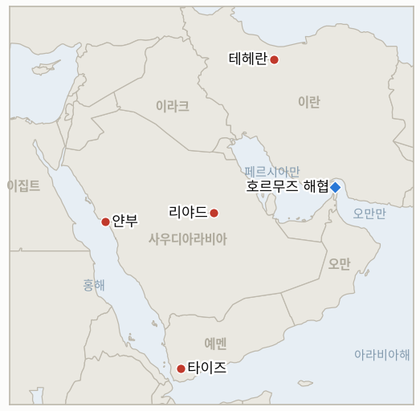

# 중동 일일 브리핑

**2026년 9월 25일**

- **보고 기간:** 약 24시간, 9월 24일 09:00 ~ 9월 25일 09:00 (한국시간)
- **종합 평가:** 이란은 동시에 운영 중인 두 트랙을 모두 강경하게 밀어붙였다. 최고국가안보회의 사무총장 모흐센 레자에이는 호르무즈 해협 재개방을 위한 이란의 7가지 선결 조건에 4~5일 시한을 못박았고, 동시에 국내에서는 테헤란 국회의원 아미르호세인 사베티가 아라그치 외교장관의 위트코프·쿠슈너 특사 무단 접촉을 문제 삼아 탄핵소추안을 정식 등록했으며, 하메네이 자문관 야흐야 라힘 사파비는 미국이나 이스라엘이 다시 공격할 경우 전쟁이 인도양까지 확전될 수 있다고 경고했다(§1.1). 유가는 이날을 순매수 신호로 받아들였다. 후티 반군의 사우디아라비아 타이프와, 동서 파이프라인의 얀부 종점을 겨냥한 탄도미사일·드론 공격으로 브렌트유가 장중 108.23달러까지 치솟았으나, 미국과 이란이 호르무즈 재개방과 봉쇄 해제를 맞바꾸는 단계적 협상을 진행 중이라는 로이터 보도가 나오며 상승폭이 줄어 106.60달러로 마감했다(§1.2). 예멘 전쟁은 남쪽으로 무대를 옮겼다. 후티 반군이 타이즈·아덴·라흐지 회랑에서 협공을 감행했고 정부군은 이를 격퇴했다고 밝혔는데, 이는 이 원장이 최근 며칠간 추적해 온 마리브 고지대 공세와는 다른 전선이다(§1.3). 한국 시장은 새로운 시세 없이 추석 연휴에 들어갔고, 정부는 통행료 면제와 유류비 할인으로 유가 급등에 대비해 연휴 여행객을 지원했다(§1.4). 이번 보고 기간에 지표 1개(IND-20260924-2, 아라그치 반발의 공식 국회 결과)가 확인으로 해소됐고, 지표 1개(IND-20260819-3, 케인 상원의원의 오만 전쟁권한 결의안, 본회의 표결 확인되지 않음)가 시한 도래로 기각됐으며, 레자에이의 시한과 인도양 위협, 얀부·리야드 미사일 공격을 각각 추적하는 새 지표 3개가 열렸다.

---

## 1. 무슨 일이 있었나

<figure style="float:right; width:46%; margin:2pt 0 8pt 14pt;">

<figcaption style="font-size:8pt; color:#666; text-align:center; margin-top:3pt; font-style:italic;">주요 논의 지점</figcaption>
</figure>

### 1.1 이란, 워싱턴에 시한 못박고 국회는 아라그치 탄핵 추진, 자문관은 인도양 확전 경고

최고국가안보회의 사무총장 모흐센 레자에이는 이란이 카타르 중재자를 통해 워싱턴에 7가지 선결 조건을 전달했다고 밝혔다. 조건에는 미국 제재의 전면 해제, 동결된 이란 자금 반환, 모든 전선에서의 군사작전 즉각 중단 등이 포함되며, 워싱턴이 이를 수용하지 않으면 호르무즈 해협 재개방 논의 자체를 하지 않겠다는 엄격한 4~5일 시한을 못박았다([걸프뉴스](https://gulfnews.com/world/mena/iran-presents-roadmap-that-includes-60-day-regionwide-ceasefire-report-1.500685732)). 이 최후통첩은 화요일 위트코프·쿠슈너 특사에게 제시된 로드맵(IND-20260924-1)이 국내에서 첫 제도적 결과를 낳은 것과 같은 날 나왔다. 테헤란 국회의원 아미르호세인 사베티가 아라그치 외교장관에 대한 탄핵소추안을 국회 시스템에 정식 등록했고, 국가안보외교정책위원회 소속 알리 헤즈리안 위원은 "미국 측과의 이 대화가 어떤 근거로 이뤄졌는지" 해명하라고 요구했으며, 이 소추안은 아라그치가 뉴욕에서 귀국하는 대로 국가안보외교정책위원회의 심사에 회부됐다([걸프뉴스](https://gulfnews.com/world/mena/iran-fm-abbas-araghchi-faces-impeachment-over-us-talks-so-who-speaks-for-tehran-1.500686247)). 세 번째로 별개의 확전 신호가 하메네이 자문관 야흐야 라힘 사파비에게서 나왔다. 그는 파르스통신이 공개한 영상에서 "분쟁이 페르시아만과 호르무즈 해협에서 홍해로 확산된 만큼, 추가 전쟁에 대한 대응으로 전선이 인도양, 그리고 그 너머까지 확대될 가능성이 있다"고 말했는데, 이는 최고지도자 자문관이 미·영 합동기지가 있는 디에고가르시아를 품은 인도양을 잠재적 전장으로 명시적으로 언급한 첫 사례다([타임스오브이스라엘](https://www.timesofisrael.com/liveblog_entry/khamenei-adviser-says-iran-may-take-war-to-indian-ocean-if-israel-or-us-strikes-again/)). 한편 로이터는 뉴욕에서 미국과 이란 협상단이 전쟁을 끝내기 위한 단계적 경로를 모색하고 있다고 보도했다. 한 이란 고위 관계자는 가장 현실적인 경로가 이란이 호르무즈 항행을 허용하는 대신 미국이 해상 봉쇄를 해제하는 것이라고 말했으나, 양측 모두 먼저 지렛대를 포기하려 하지 않는다([로이터/US뉴스](https://www.usnews.com/news/world/articles/2026-09-24/us-and-iran-discuss-phased-deal-to-reopen-hormuz-and-end-us-blockade-sources-say)). 탄핵소추안의 정식 등록과 위원회 회부는 이 원장이 정한 "공식적인 제도적 결과"의 기준을 충족해 **IND-20260924-2**를 확인으로 해소한다. 레자에이의 시한은 **IND-20260925-1**을, 사파비의 경고는 **IND-20260925-2**를 새로 연다. **신뢰도: 높음** (탄핵소추안 등록과 레자에이의 시한 발언은 복수 매체가 수렴 보도); 7가지 선결 조건의 정확한 전체 내용은 어느 매체도 완전한 목록을 공개하지 않아 **중간**; 사파비의 인도양 발언은 파르스통신 공개 영상의 직접 인용이며 복수의 1~2등급 매체가 뒷받침해 **높음**; 미·이란 단계적 협상 보도가 실제로 얼마나 진전됐는지는 익명 소식통에 의존해 **중간**.

### 1.2 사우디 파이프라인 거점 겨냥한 후티 미사일 공격 속 유가 이틀 연속 상승 마감

브렌트유는 3.4% 오른 106.60달러, WTI는 2.7% 오른 94.61달러로 마감해 수요일 반등에 이어 이틀 연속 상승했다. 이는 이번 주 초의 완화 신호를 넘어 전쟁 위험 프리미엄이 다시 강화됐음을 보여준다([CNBC](https://www.cnbc.com/2026/09/24/oil-iran-crude-kepler-trump-us-un-.html)). 브렌트유는 장중 108.23달러까지, 거의 5% 급등하며 세션 고점을 찍었는데, 이는 후티 반군이 사우디아라비아의 타이프와 동서 파이프라인의 홍해 종점인 얀부, 즉 사우디아라비아가 불과 이틀 전 재가동한 시설을 겨냥해 탄도미사일과 드론을 퍼부은 데 따른 것이다. 후티 측은 별도로 리야드의 "민감한 표적"을 타격했다고 주장했다. 사우디 주도 연합군은 미사일 6발 전부가 인구 밀집지나 산업지대에 도달하기 전에 요격됐으며 사상자나 재산 피해는 없었다고 밝혔다([워싱턴포스트](https://www.washingtonpost.com/world/2026/09/24/yemen-saudi-arabia-houthis-missiles/49285208-b815-11f1-94cb-d3d8f22a8c8b_story.html)). 유가는 로이터의 미·이란 단계적 협상 보도가 퍼지자 고점에서 되돌아섰는데, 이는 시장이 한계적 신호를 가격에 반영하는 익숙한 패턴이다. 이번에는 실질적 피해가 없었음에도 파이프라인 자체의 하역 터미널에 대한 공격이 가격에 반영된 셈이다. 이 사건은 파이프라인이 재가동됐다고 해서 얀부의 위험 노출이 끝난 것이 아니라, 후티 반군이 장거리 타격 능력을 유지하는 한 여전히 살아 있는 표적이라는 점을 일깨운다. 이는 파이프라인의 전면 가동 복귀 경로를 추적하는 **IND-20260923-1**에 재가동 이후 가장 날카로운 시험대이며, 후티 반군이 얀부의 하역 시설에 실제 피해를 입히는 후속 공격을 가하는지, 아니면 이번 공격이 요격으로 끝난 일회성 사건으로 남는지를 추적하는 **IND-20260925-3**을 새로 연다. **신뢰도: 높음** (마감가와 장중 고점은 CNBC 보도에 근거); 미사일 공격의 발생, 표적, 요격 여부는 워싱턴포스트, 알자지라, 블룸버그가 수렴 보도해 **높음**; 목요일 가격 흐름에서 미사일 공격이 차지하는 정확한 인과적 비중은 **중간**.

### 1.3 예멘 지상전, 타이즈 아덴 라흐지 회랑으로 무대 이동

예멘 정부군은 수요일 밤 시작된 후티 반군의 협공을 격퇴했다고 밝혔다. 공격 목표는 아덴·라흐지·타이즈 3개 주를 잇는 전략 도로의 거점 확보였다. 사우디 지원 정부군 대변인 마지드 알누자일리 대령은 타이즈 와디 알마카티라 지역에서의 공격이 "인명과 장비 손실"을 입고 격퇴됐으며, 타이즈 알아흐쿰 지역에서도 별도의 교전으로 후티 전투원 "수십 명"이 사상됐다고 말했다([알자지라](https://www.aljazeera.com/news/2026/9/24/yemeni-forces-claim-repelling-houthi-attacks-in-taiz-as-fighting-rages-on)). 같은 보도는 후티 측이 사우디 전투기와 미사일이 24시간 동안 호데이다·타이즈·바이다·마리브·사다 5개 주를 52차례 타격했다고 주장했다고 전했는데, 이는 이 원장이 월요일 급증세의 반락으로 추적한 수요일의 19회 기록의 두 배가 넘는다. 이번 회랑 전투는 이 원장이 추적해 온 마리브 고지대 공세(**IND-20260922-3**)에서 남쪽의 아덴·라흐지 접근로로 전쟁의 지리적 초점이 옮겨간 것을 보여주지만, 어느 매체도 마리브 전선 자체가 잠잠해졌다고 보도하지는 않았다. 한편 이번 주 초 발표된 국제이주기구(IOM) 집계에 따르면 예멘의 분쟁 실향민 수가 7개 주에서 거의 13만 명에 달하며, 약 3,100명이 홍해를 건너 지부티로 피신했다. 이는 20만 명 확인 문턱에는 아직 미치지 못하지만 **IND-20260918-1**의 추이를 보여주는 자료다. **신뢰도: 중간** (타이즈·아덴·라흐지 전투의 결과는 정부 대변인 한 사람의 설명에 의존하며 독립 검증은 없음); 52회 타격 집계는 후티 측 출처를 1등급 매체가 보도한 것으로 **중간**; IOM 실향민 수치는 이번 주 초 발표됐고 WFP의 별도 집계와 아직 조율되지 않아 **중간**.

### 1.4 한국 시장 추석 휴장 돌입, 정부는 유가 상승 부담 완화에 나서

한국거래소와 서울 외환시장은 목요일 추석 연휴로 휴장했고 금요일까지 휴장이 이어진다. 수요일 코스피 종가 7,080.92와 원화 종가 1,358.4원이 최신 시세로 남으며, 두 시장 모두 9월 28일 월요일 재개된다([위키트리](https://www.wikitree.co.kr/articles/1161642)). 목요일 유가 급등에 대한 새로운 시장 반응이 없는 가운데, 정부의 대응은 재정 정책을 통해 이뤄졌다. 국토교통부는 9월 24일부터 27일까지 나흘간 전국 고속도로 통행료를 전면 면제했고, 한국도로공사는 고속도로 주유소 226곳에서 리터당 기름값을 100원 인하해 9월 17일 기준가 대비 휘발유는 1,744원, 경유는 1,734원에 판매하도록 했다([노컷뉴스](https://nocutnews.co.kr/news/6583089)). 통행료 면제와 유류비 할인은 매년 되풀이되는 추석 연휴 대책이지 중동 정세에 대응한 조치는 아니지만, 올해는 브렌트유의 이틀 연속 상승과 겹쳐 예년보다 체감 효과가 크다. 한국의 호르무즈 파병 문제는 이번 보고 기간에 별다른 움직임이 없었는데, 이는 국회 자체가 자체 연휴 휴회 중인 상황과 일치한다. **IND-20260906-2**는 9월 28일 시한을 사흘 앞두고 여전히 열려 있다. **신뢰도: 높음** (시장 휴장 일정과 수요일 마지막 시세는 한국 거래소 관련 출처들이 수렴 보도); 통행료 면제와 유류비 할인은 복수의 한국 언론이 수렴 보도해 **높음**; 정부의 이번 시기 선택이 유가 우려를 얼마나 반영한 것인지, 아니면 단순히 연례 조치인지는 **중간**.

---

## 2. 심층 분석: 동기와 이해관계

### 2.1 이란은 왜 자국 외교장관 탄핵을 추진하는 바로 그날 호르무즈 선결 조건에 엄격한 4~5일 시한을 못박았나?

레자에이의 최후통첩과 사베티의 탄핵소추안은 서로 모순되는 신호가 아니라, 최고국가안보회의와 국회 국가안보 강경파라는 두 개의 강경 기구가 각자 독립적으로 이란의 지렛대는 아라그치가 진행해 온 중재 외교가 아니라 압박과 시한에 있다고 주장하는 것이다. 조건에 짧고 공개적인 시한을 못박음으로써 최고국가안보회의는 이란의 조건대로 협상을 주도하고 있다고 내세울 수 있는 동시에, 같은 국내 강경 연합은 실제로 미국 특사들과 마주 앉은 당사자를 규율하거나 제거하는 작업을 병행할 수 있다.

### 2.2 사상자도 피해도 없었던 후티 공격에 브렌트유가 왜 거의 5% 급등했다가 같은 세션 안에 대부분을 반납했나?

시장은 결과가 아니라 능력과 의도를 가격에 반영하기 때문이다. 사우디아라비아가 호르무즈를 우회하기 위해 막 재가동한 바로 그 터미널인 얀부에 도달한 공격은, 개별 타격이 명중하든 안 하든 파이프라인 우회로 자체가 여전히 후티 반군의 사정권 안에 있다는 점을 입증한다. 다만 같은 날 나온 미·이란의 실질적인 협상 보도, 즉 근본적인 분쟁이 확대되기보다 축소될 수 있다는 신호만으로도 장중 고점에서 위험 프리미엄을 되돌리기에 충분했다.

### 2.3 후티 반군은 왜 이 원장이 일주일 넘게 추적해 온 마리브 고지대 공세 대신 아덴 라흐지 회랑이라는 새로운 공격축을 열었나?

3개 주를 잇는 정부 통제 도로는 이미 요새화된 마리브 북부 방어선에 대한 계속된 소모전보다 더 가치 있고 결정적인 표적이며, 두 번째 전선을 시험함으로써 사우디 지원 정부군이 광범위한 외교 트랙이 유동적인 바로 이 시점에 관심과 자원을 분산시키도록 강제한다. 이는 향후 휴전 협상이 실제로 성사될 경우 후티 반군이 지상전에서 행사할 수 있는 지렛대를 극대화하는 전략이다.

### 2.4 서울은 유가 상승 주간과 시기가 겹치는 고속도로 통행료 면제와 유류비 할인을, 그것이 매년 되풀이되는 추석 정책임에도 왜 이렇게 활용하나?

호르무즈 파병 문제가 여전히 미해결이고 공개적으로 논란이 되는 상황에서, 정부는 전쟁의 경제적 파급 효과로부터 국민을 적극적으로 보호하는 것으로 비치는 것이 유리하다. 이미 예정된 연휴 지원책의 규모와 프레이밍에 힘을 싣는 데는 큰 비용이 들지 않으면서도, 정치적으로 더 부담스러운 파병 논쟁에 대한 가시적인 대안 서사를 제공한다. 실제 재정 조치는 그 주의 유가 흐름과 무관하게 비슷한 일정으로 시행됐을 것이더라도 말이다.

---

## 3. 한국에 대한 정책 함의

**노출도 스냅샷:** 한국의 원유 수입은 여전히 약 70%가 호르무즈 해협 통과에 의존하며, LNG 수입의 약 36%가 중동산이다. 카타르 라스라판이 단일 최대 LNG 공급 노출처다 (`instructions/korea-exposure.md`, 2026년 8월 14일 최종 갱신, 이번 보고 기간 갱신 불필요). 목요일 확정 마감가: 브렌트유 106.60달러(+3.4%), WTI 94.61달러(+2.7%); 코스피와 원화는 추석 휴장으로 수요일 종가인 7,080.92와 1,358.4원에 멈춰 있다.

**사안별 함의:**

- **레자에이의 시한, 아라그치 탄핵소추안, 인도양 경고 (§1.1):** 이란의 서로 다른 기구들에서 동시에 나온 세 가지 강경 신호는 외교부와 한국 정유사들이 화요일의 로드맵이나 보도된 단계적 협상을 완결된 긴장 완화로 읽지 않도록 경계할 것을 시사한다. 9월 28~29일경으로 예상되는 시한의 도래 자체가 한국의 국회 시한과 같은 주에 놓인 구체적인 추적 대상이 됐다.
- **유가의 이틀 연속 상승과 얀부 미사일 공격 (§1.2):** 사우디아라비아가 호르무즈 우회를 위해 의존하고 있는 바로 그 파이프라인 터미널에 대한 후티 반군의 입증된 타격 능력은, 파이프라인이 향후 수 주에 걸쳐 전면 가동으로 복귀하는 동안 한국 정유사들이 의지해 온 비호르무즈 우회로에 대한 직접적 위협이다.
- **타이즈 아덴 라흐지 회랑 전투 (§1.3):** 한국행 원유는 다투어지는 타이즈·아덴 회랑이 아니라 영향을 받지 않는 얀부·홍해 경로로 운송되므로 직접적 영향은 여전히 제한적이지만, 지상전이 확대되면 남쪽에서 같은 경로에 대한 상시적 위험이 커진다.
- **한국의 시장 휴장과 유류비 완화 조치 (§1.4):** 코스피와 원화가 연휴 동안 멈춰 있는 가운데, 산업통상자원부의 통행료·유류비 조치가 이번 주 유가 움직임에 대한 유일한 가시적 정부 대응이다. 국회가 휴회를 마치고 복귀하는 시점이 IND-20260906-2의 9월 28일 시한과 겹치는 만큼, 시장이 재개되는 바로 그 주에 파병 문제가 다시 부상할 가능성이 있다.

**검증 가능한 지표:**

- **IND-20260925-1** (열림, 신규): 워싱턴은 이란의 7가지 선결 조건에 대한 4~5일 시한을 충족하는 대응을 아직 공개하지 않았다. 열림, 시한 ~2026-09-29.
- **IND-20260925-2** (열림, 신규): 이란이 인도양 방향으로 분쟁의 지리적 범위를 확대하는 공개된 작전적 조치는 아직 없다. 열림, 시한 ~2026-10-08.
- **IND-20260925-3** (열림, 신규): 얀부·리야드에 대한 후티 미사일·드론 공격은 이번 보고 기간 확인된 피해를 내지 못했다. 후속 공격 여부는 아직 시험되지 않았다. 열림, 시한 ~2026-10-15.
- **IND-20260924-1** (열림): 이란의 광범위한 로드맵은 보도된 단계적 협상 모색과 구별되는 명시적인 미국의 공개 대응을 아직 이끌어내지 못했다. 열림, 시한 ~2026-09-30.
- **IND-20260924-2** (확인): 아라그치에 대한 반발이 공식적인 제도적 결과, 즉 국회 탄핵소추안 등록과 위원회 회부로 이어졌다. 2026-09-25 확인.
- **IND-20260924-3** (열림, 시험 심화): 브렌트유의 100달러 돌파가 이틀째 이어졌다(106.60달러). 한 주 내내 유지되는지에 대한 시험은 계속된다. 열림, 시한 ~2026-09-30.
- **IND-20260923-1** (열림, 이번 주 더 날카로운 시험): 얀부 미사일 공격은 동서 파이프라인 재가동에 피해를 입히지 않았지만, 용량이 6~8주의 전면 복구 일정을 향해 증가하는 동안 터미널이 여전히 살아 있는 표적임을 보여줬다. 열림.
- **IND-20260923-2** (열림): 광범위한 로드맵과 레자에이가 재확인한 선결 조건에 범위 면에서 대체됐다. 좁은 7일 시한 제안에 대한 별도의 공개된 미국 조치는 이번 보고 기간 없었다. 열림, 시한 ~2026-09-29.
- **IND-20260923-3** (열림): 이번 보고 기간 추가로 확인된 위트코프·아라그치 회동은 없었다. 열림, 시한 ~2026-09-30.
- **IND-20260919-2** (열림, 시한 하루 전): 이번 보고 기간 추가로 날짜가 확인된 호르무즈 사건이나 공개된 IRGC 작전적 조치는 없었다. 열림, 시한 ~2026-09-26.
- **IND-20260918-1** (열림): 이번 주 초 발표된 IOM 집계상 예멘 분쟁 실향민이 거의 13만 명에 달해, 추이는 20만 명 확인 문턱 아래에 머물러 있다. 열림, 시한 ~2026-10-09.
- **IND-20260906-2** (열림, 사흘 앞): 한국의 호르무즈 태세는 검토 단계에 머물렀고, 국회는 자체 연휴 휴회 중이다. 열림, 시한 ~2026-09-28.
- **IND-20260819-3** (시한 도래로 기각): 케인 상원의원의 오만 전쟁권한 결의안에 대한 상원 본회의 표결은 9월 25일 시한까지 확인되지 않았다. 2026-09-25 기각.
- **IND-20260922-3** (열림): 마리브 고지대 공세는 이번 보고 기간 새로운 움직임이 보도되지 않았으며, 후티 반군의 관심이 아덴 라흐지 회랑으로 옮겨갔다. 열림, 시한 ~2026-10-13.
- **IND-20260714-4** (열림, 시한 없음): 카타르 라스라판의 주간 선적 최신 수치가 여전히 없다. 이 원장에서 가장 오래 미해결로 남아 있는 지표다.

---

## 4. 주시 목록

- **이란의 4~5일 시한 (IND-20260925-1):** 워싱턴의 대응이 테헤란의 7가지 선결 조건을 충족하는지 무시하는지를 가를 구체적인 날짜, 대략 9월 28~29일.
- **아라그치 탄핵 절차:** 공식적인 국회 조치로 확인됐다. 아라그치가 뉴욕에서 귀국하는 대로 이뤄질 국가안보외교정책위원회의 심사를 주시해야 한다.
- **사파비의 인도양 경고 (IND-20260925-2):** 현재로서는 수사적 발언에 그치지만, 하메네이 자문관이 걸프·호르무즈·홍해를 넘어선 전장을 명시적으로 언급한 첫 사례다.
- **얀부 터미널에 대한 후속 공격 여부 (IND-20260925-3):** 목요일의 공격은 요격됐고 피해는 없었지만, 파이프라인의 홍해 쪽 끝단이 여전히 후티 반군의 사정권 안에 있음을 보여줬다.
- **타이즈 아덴 라흐지 회랑:** 마리브 고지대 공세와 나란히 새롭게 활성화된 전선이다. 후티 반군이 두 전선 모두에 동시에 압박을 지속하는지 주시해야 한다.
- **한국 국회의 호르무즈 파병 동의안 (IND-20260906-2):** 9월 28일 시한을 사흘 앞두고 있으며, 같은 날 시장도 추석 휴장에서 재개된다.
- **카타르 라스라판의 LNG 선적량 (IND-20260714-4):** 여전히 새로운 주간 선적 수치가 없는, 이 원장에서 가장 오래 미해결로 남은 지표다.

---

## 5. 출처 신뢰도 요약

| 주장 | 출처 | 신뢰도 |
|---|---|---|
| 레자에이가 카타르 중재자를 통해 미국에 7가지 선결 조건을 전달하고 4~5일 시한을 못박음 | 걸프뉴스 (1~2등급) | 시한 발언은 높음, 선결 조건 전체 목록은 중간 |
| 국회의원 아미르호세인 사베티가 아라그치 탄핵소추안을 정식 등록, 국가안보외교정책위원회에 회부 | 걸프뉴스 (1~2등급) | 높음 |
| 하메네이 자문관 야흐야 라힘 사파비가 전쟁이 인도양까지 확전될 수 있다고 경고 | 타임스오브이스라엘, 던, SBS (1~2등급, 수렴 보도, 영상 직접 인용) | 높음 |
| 미·이란 협상단이 뉴욕에서 호르무즈·봉쇄 맞교환 단계적 합의를 모색 | 로이터/US뉴스 (1등급) | 중간, 익명 소식통에 의존 |
| 브렌트유 106.60달러(+3.4%), WTI 94.61달러(+2.7%) 마감, 장중 108.23달러까지 오른 뒤 이틀 연속 상승 | CNBC (1등급) | 높음 |
| 후티 반군의 미사일·드론 공격이 사우디아라비아 타이프와 얀부를 겨냥, 리야드 타격도 주장; 미사일 6발 전부 요격, 사상자 없음 | 워싱턴포스트, 알자지라, 블룸버그 (1등급, 수렴 보도) | 높음 |
| 예멘 정부군이 타이즈 아덴 라흐지 회랑에서 후티 반군의 협공을 격퇴 | 알자지라, 정부 대변인 마지드 알누자일리 대령 인용 | 중간, 단일 출처 군 발표 |
| 후티 측이 예멘 5개 주에서 사우디군의 공습 52건을 주장 | 알자지라, 후티 측 출처 인용 | 중간, 일방적 집계 |
| IOM: 예멘 분쟁 실향민 7개 주에서 거의 13만 명, 약 3,100명 지부티로 피신 | SBS (IOM 인용), 이번 주 초 보도 | 중간, WFP의 별도 수치와 아직 조율되지 않음 |
| 한국거래소와 서울 외환시장이 추석 연휴로 9월 24~25일 휴장, 9월 28일 재개; 수요일 코스피 7,080.92와 원화 1,358.4원이 최신 시세 | 위키트리 등 복수 한국 거래소 관련 출처 (1~2등급, 수렴 보도) | 높음 |
| 정부가 추석 연휴(9월 24~27일) 고속도로 통행료 면제, 주유소 기름값 리터당 100원 인하 | 노컷뉴스, MBC (1~2등급, 수렴하는 한국 언론) | 높음 |
| 케인 상원의원의 오만 전쟁권한 결의안에 대한 상원 본회의 표결이 9월 25일 시한까지 확인되지 않음 | 미국 정치 매체 검색 결과에서 보도 부재 | 중간, 부재에 근거한 판단으로 확정된 비발생 사실은 아님 |
