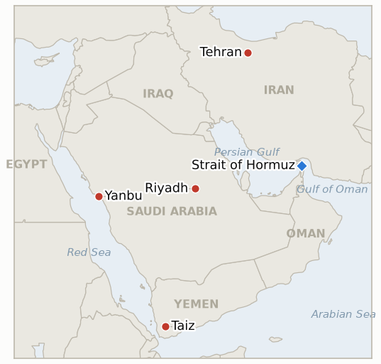

# Middle East Daily Briefing

**September 25, 2026**

- **Reporting window:** ~24 hours, September 24, 09:00 to September 25, 09:00 KST
- **Overall assessment:** Iran hardened both tracks it is running at once: SNSC secretary Mohsen Rezaei attached a four to five day deadline to Tehran's seven preconditions for reopening the Strait of Hormuz, while at home Tehran MP Amirhossein Sabeti formally registered an impeachment motion against Foreign Minister Araghchi over his unauthorized meeting with US envoys Witkoff and Kushner, and Khamenei adviser Yahya Rahim Safavi separately warned the war could expand to the Indian Ocean if the US or Israel strikes again (§1.1). Oil read the day as net-bullish: Brent and WTI settled higher for a second consecutive session after a Houthi ballistic missile and drone barrage on Saudi Arabia's Taif and the East-West pipeline's Yanbu terminus sent Brent to a $108.23 intraday high, before a Reuters report of US-Iran talks on a phased Hormuz-for-blockade swap pared the gain to a $106.60 close (§1.2). Yemen's war shifted south: Houthi forces pressed a coordinated night assault on the Taiz-Aden-Lahj corridor that government forces say they repelled, a different front from the Marib push this ledger has tracked in recent days (§1.3). South Korea's markets entered the Chuseok holiday closure with no new print, while the government moved to cushion holiday travelers against the oil-price jump with toll waivers and a fuel discount (§1.4). One ledger indicator resolves confirmed this window (IND-20260924-2, the Araghchi backlash's formal parliamentary consequence) and one resolves falsified at its deadline (IND-20260819-3, the Kaine Oman war powers resolution, with no floor vote found); three new indicators open on Rezaei's deadline, the Indian Ocean threat, and the Yanbu/Riyadh missile barrage.

---

## 1. What Happened

<figure style="float:right; width:46%; margin:2pt 0 8pt 14pt;">

<figcaption style="font-size:8pt; color:#666; text-align:center; margin-top:3pt; font-style:italic;">Major places of discussion</figcaption>
</figure>

### 1.1 Iran Sets a Deadline on Washington as Parliament Moves to Impeach Araghchi and an Adviser Threatens the Indian Ocean

Supreme National Security Council secretary Mohsen Rezaei said Iran had conveyed seven preconditions to Washington through Qatari mediators, among them a full lifting of US sanctions, release of frozen Iranian funds, and an immediate halt to military operations on every front, and attached a hard four to five day clock for Washington to accept them before Tehran will discuss reopening the Strait of Hormuz ([Gulf News](https://gulfnews.com/world/mena/iran-presents-roadmap-that-includes-60-day-regionwide-ceasefire-report-1.500685732)). The ultimatum landed the same day Tuesday's road map presentation to envoys Witkoff and Kushner (IND-20260924-1) produced its first domestic institutional consequence: Tehran MP Amirhossein Sabeti formally registered an impeachment motion against Foreign Minister Araghchi in parliament's system, with commission member Ali Khezrian demanding Araghchi explain "on what basis this conversation with the American side took place," and the motion referred to parliament's National Security and Foreign Policy Commission for examination when Araghchi returns from New York ([Gulf News](https://gulfnews.com/world/mena/iran-fm-abbas-araghchi-faces-impeachment-over-us-talks-so-who-speaks-for-tehran-1.500686247)). A third, distinct escalation came from Khamenei adviser Yahya Rahim Safavi, who said in a video released by Fars News that "since the conflict has spread from the Persian Gulf and Strait of Hormuz to the Red Sea, it is possible that, in response to more war, the front will expand even further, reaching the Indian Ocean and perhaps beyond," the first time an adviser to the Supreme Leader has explicitly named the Indian Ocean, home to the US-British base at Diego Garcia, as a potential theater ([Times of Israel](https://www.timesofisrael.com/liveblog_entry/khamenei-adviser-says-iran-may-take-war-to-indian-ocean-if-israel-or-us-strikes-again/)). Separately, Reuters reported US and Iranian negotiators in New York are exploring a phased path out of the war, with a senior Iranian official saying the most plausible route is Iran allowing Hormuz navigation in exchange for the US lifting its naval blockade, though neither side wants to surrender its leverage first ([Reuters via U.S. News](https://www.usnews.com/news/world/articles/2026-09-24/us-and-iran-discuss-phased-deal-to-reopen-hormuz-and-end-us-blockade-sources-say)). The impeachment motion's formal registration and committee referral meets the bar this ledger set for a "formal institutional consequence," confirming **IND-20260924-2**; Rezaei's deadline opens **IND-20260925-1** and Safavi's warning opens **IND-20260925-2**. **Confidence: High** on the impeachment motion's registration and Rezaei's deadline statement, each converging across multiple outlets; **Medium** on the precise content of all seven preconditions, since no outlet has published Iran's complete list; **High** on Safavi's Indian Ocean remarks, a direct quote from Fars-released video corroborated by several Tier 1-2 outlets; **Medium** on how far the reported US-Iran phased-deal exploration has actually progressed, resting on unnamed sources.

### 1.2 Oil Settles Higher for a Second Session After a Houthi Missile Barrage on Saudi Arabia's Pipeline Hub

Brent crude settled $106.60, up 3.4%, and WTI settled $94.61, up 2.7%, a second consecutive gain after Wednesday's reversal, extending the war-risk premium's reassertion over the week's earlier de-escalatory signals ([CNBC](https://www.cnbc.com/2026/09/24/oil-iran-crude-kepler-trump-us-un-.html)). Brent touched an intraday session high of $108.23, a nearly 5% spike, after Houthi forces fired a barrage of ballistic missiles and drones at Saudi Arabia's Taif and at Yanbu, the Red Sea terminus of the East-West pipeline Saudi Arabia restarted only two days earlier, with the Houthis separately claiming a strike on "a sensitive target" in Riyadh; the Saudi-led coalition said all six missiles were intercepted before reaching populated or industrial areas, with no casualties or property damage reported ([Washington Post](https://www.washingtonpost.com/world/2026/09/24/yemen-saudi-arabia-houthis-missiles/49285208-b815-11f1-94cb-d3d8f22a8c8b_story.html)). Prices pulled back from that high once Reuters' report of US-Iran phased-deal talks circulated, a now-familiar pattern of the market pricing the marginal signal, in this case pricing an attack on the pipeline's own loading terminal even though the attack itself did no physical damage. The episode is a reminder that Yanbu's exposure did not end when the pipeline restarted; it is a live target as long as the Houthis retain long-range strike capability. This is a distinct, sharper test for **IND-20260923-1** (the pipeline's path to full capacity) than any development since the restart, and opens **IND-20260925-3**, tracking whether the Houthis follow with a strike that actually damages Yanbu's loading infrastructure or the barrage remains a contained, intercepted one-off. **Confidence: High** on the settle figures and the intraday high, sourced to CNBC; **High** on the missile barrage's occurrence, targets, and interception, converging across Washington Post, Al Jazeera, and Bloomberg; **Medium** on the precise causal weight of the missile barrage versus other Middle East headlines in Thursday's price action.

### 1.3 Yemen's Ground War Shifts South as Houthi Forces Press the Taiz Aden Lahj Corridor

Yemeni government forces said they repelled coordinated Houthi attacks launched overnight Wednesday aimed at reaching positions on the strategic road linking the Aden, Lahj, and Taiz governorates, with Colonel Majid al-Nuzaili, spokesman for the Saudi-backed government forces, saying the attacks in Taiz's Wadi al-Maqatirah area were pushed back with "losses in lives and equipment," and separate clashes in Taiz's Al Ahkum area killing and wounding "dozens" of Houthi fighters ([Al Jazeera](https://www.aljazeera.com/news/2026/9/24/yemeni-forces-claim-repelling-houthi-attacks-in-taiz-as-fighting-rages-on)). The same reporting cites Houthi claims that Saudi warplanes and missiles struck Hodeidah, Taiz, al-Bayda, Marib, and Saada 52 times over 24 hours, more than double Wednesday's 19-raid count this ledger tracked as a pullback from Monday's spike. The corridor fighting marks a shift in the war's geographic focus from the Marib highlands push **IND-20260922-3** has tracked toward the Aden-Lahj approach further south, though no outlet reports the Marib front itself going quiet. Separately, an IOM count reported earlier this week put Yemen's conflict-displacement figure at nearly 130,000 across seven provinces, with about 3,100 people having crossed the Red Sea to Djibouti, a data point feeding **IND-20260918-1**'s trajectory test without yet approaching its 200,000 confirmation threshold. **Confidence: Medium** on the Taiz-Aden-Lahj fighting's outcome, resting on a single government spokesman's account with no independent verification; **Medium** on the 52-strike count, a Houthi-sourced figure reported by a Tier 1 outlet; **Medium** on the IOM displacement figure, dated earlier in the week and not yet reconciled with WFP's separate count.

### 1.4 South Korea's Markets Enter the Chuseok Closure as the Government Moves to Cushion Rising Fuel Costs

KRX and the Seoul foreign exchange market closed Thursday for the Chuseok holiday and stay closed through Friday, leaving Wednesday's KOSPI close of 7,080.92 and won close of 1,358.4 as the last available prints; both markets reopen Monday, September 28 ([WiKitree](https://www.wikitree.co.kr/articles/1161642)). With no fresh market read on Thursday's oil jump, the government's own response ran through fiscal policy instead: the Ministry of Land, Infrastructure and Transport waived tolls on all national expressways for the four day Chuseok period (September 24 to 27), and the state highway operator cut fuel prices 100 won per liter at 226 expressway service stations, to 1,744 won for gasoline and 1,734 won for diesel, versus September 17 baseline prices ([Nocut News](https://nocutnews.co.kr/news/6583089)). The toll waiver and fuel discount are a standing annual Chuseok travel-season measure rather than a Middle East-specific response, but they land this year against a backdrop of Brent's back-to-back gains, giving the relief more bite than in a calmer week. Korea's Hormuz deployment question itself showed no movement this window, consistent with the National Assembly remaining on its own holiday recess; **IND-20260906-2** stays open with three days to its September 28 deadline. **Confidence: High** on the market closure dates and Wednesday's last prints, converging across Korean exchange sources; **High** on the toll waiver and fuel-price cut, converging across multiple Korean outlets; **Medium** on how much of the government's timing reflects oil-price concern specifically versus the routine annual measure.

---

## 2. Deep Dive: Incentives and Motives

### 2.1 Why would Iran attach a hard four to five day deadline to its Hormuz preconditions the same day parliament moves to impeach its own foreign minister for engaging Washington?

Because Rezaei's ultimatum and Sabeti's impeachment motion are not contradictory signals but two hardline institutions, the Supreme National Security Council and parliament's national security bloc, independently asserting that Iran's leverage lies in pressure and deadlines rather than in the mediated diplomacy Araghchi has been conducting; attaching a short, public clock to the preconditions lets the SNSC claim it is driving the process on Iran's terms even as the same domestic coalition works to discipline or remove the official actually sitting across the table from US envoys.

### 2.2 Why would Brent spike nearly 5% on a Houthi attack that caused no casualties or damage, then give most of that gain back within the same session?

Because markets price capability and intent, not just outcomes: a barrage that reached Yanbu, the very terminal Saudi Arabia just brought back online to bypass Hormuz, demonstrates that the pipeline workaround itself remains within Houthi range regardless of whether any individual strike lands, and only the same-day report of substantive US-Iran talks on a phased Hormuz-for-blockade swap, a data point suggesting the underlying conflict might narrow rather than widen, was enough to talk the risk premium back down from its intraday peak.

### 2.3 Why would Houthi forces open a new axis of attack toward the Aden-Lahj corridor rather than continuing to press the Marib highlands this ledger has tracked for over a week?

Because a government-held road linking three governorates is a higher-value, more decisive target than continued attrition against Marib's already-fortified northern defenses, and probing a second front forces Saudi-backed government forces to split their attention and resources at the same moment the war's broader diplomatic track is in flux, maximizing the ground-war leverage the Houthis can bring to bear if and when a ceasefire negotiation actually convenes.

### 2.4 Why would Seoul time a highway toll waiver and fuel discount to coincide with a week of rising oil prices even though the measure is a routine annual Chuseok policy?

Because a government facing an unresolved, publicly contested Hormuz deployment question benefits from being seen to actively cushion citizens against the war's economic spillover, so leaning into the scale and framing of an already-scheduled holiday relief measure costs little and offers a visible counterpoint to the deployment debate's more politically costly optics, even if the underlying fiscal mechanism would have been deployed on a similar schedule regardless of what oil was doing this particular week.

---

## 3. Policy Implications for South Korea

**Exposure snapshot:** South Korea's crude imports remain roughly 70% dependent on Strait of Hormuz transit and about 36% of its LNG imports come from the Middle East, with Qatar's Ras Laffan as the single largest LNG supplier exposure (see `instructions/korea-exposure.md`, last updated August 14, 2026, no update needed this window). Thursday's confirmed closes: Brent $106.60 (+3.4%), WTI $94.61 (+2.7%); KOSPI and the won are frozen at Wednesday's 7,080.92 and 1,358.4 through the Chuseok closure.

**Implications by development:**

- **Rezaei's deadline, the Araghchi impeachment motion, and the Indian Ocean warning (§1.1):** three simultaneous hardline signals from different Iranian institutions counsel MOFA and Korean refiners against reading Tuesday's road map or the reported phased-deal talks as a settled de-escalation; the deadline's own passage around September 28-29 is now a concrete near-term date worth tracking alongside Korea's own National Assembly deadline the same week.
- **Oil's second consecutive gain and the Yanbu missile barrage (§1.2):** a demonstrated Houthi reach against the specific pipeline terminal Saudi Arabia is relying on to bypass Hormuz is a direct threat to the non-Hormuz workaround Korean refiners have been counting on as the pipeline ramps toward full capacity over the coming weeks.
- **The Taiz Aden Lahj corridor fighting (§1.3):** continues to have limited direct bearing on Korean-bound crude, which moves via the unaffected Yanbu/Red Sea route rather than through the contested Taiz-Aden corridor itself, though a widening ground war raises the standing risk to that same route from the south.
- **Korea's market closure and fuel-cost cushioning (§1.4):** with KOSPI and the won frozen through the holiday, MOTIE's toll and fuel-price measures are the only visible government response to this week's oil move; the National Assembly's own return from recess alongside IND-20260906-2's September 28 deadline makes the same week markets reopen a plausible point for the deployment question to resurface.

**Testable indicators:**

- **IND-20260925-1** (open, new): Washington has not yet disclosed a response meeting Iran's four to five day deadline on its seven preconditions. Open, deadline ~2026-09-29.
- **IND-20260925-2** (open, new): no disclosed Iranian operational step has yet extended the conflict's geographic scope toward the Indian Ocean. Open, deadline ~2026-10-08.
- **IND-20260925-3** (open, new): the Houthi missile and drone barrage on Yanbu and Riyadh caused no confirmed damage this window; not yet tested against a follow-up strike. Open, deadline ~2026-10-15.
- **IND-20260924-1** (open): Iran's broader road map has not yet drawn a disclosed, explicit US response distinct from the reported phased-deal exploration. Open, deadline ~2026-09-30.
- **IND-20260924-2** (confirmed): the Araghchi backlash produced a formal institutional consequence, a parliamentary impeachment motion registered and referred to committee. Confirmed 2026-09-25.
- **IND-20260924-3** (open, sharpened): Brent's move above $100 extended to a second session ($106.60); the test of whether it holds through the week continues. Open, deadline ~2026-09-30.
- **IND-20260923-1** (open, sharper test this window): the Yanbu missile barrage did not damage the East-West pipeline's restart, but demonstrates the terminal remains a live target as capacity ramps toward the six to eight week full-recovery timeline. Open.
- **IND-20260923-2** (open): superseded in scope by the broader road map and Rezaei's restated preconditions; no separate disclosed US step to the narrower seven day offer this window. Open, deadline ~2026-09-29.
- **IND-20260923-3** (open): no further disclosed Witkoff-Araghchi session confirmed this window. Open, deadline ~2026-09-30.
- **IND-20260919-2** (open, one day from deadline): no further dated Hormuz incident or disclosed IRGC operational step found this window. Open, deadline ~2026-09-26.
- **IND-20260918-1** (open): an IOM count of nearly 130,000 Yemen conflict-displaced, reported earlier this week, keeps the trajectory below the 200,000 confirmation threshold. Open, deadline ~2026-10-09.
- **IND-20260906-2** (open, three days out): South Korea's Hormuz posture stayed at review with the National Assembly on its own holiday recess. Open, deadline ~2026-09-28.
- **IND-20260819-3** (falsified at deadline): no Senate floor vote on Sen. Kaine's Oman war powers resolution was found by its September 25 deadline. Falsified 2026-09-25.
- **IND-20260922-3** (open): the Marib highlands push shows no fresh reported movement this window as Houthi attention shifted toward the Aden Lahj corridor. Open, deadline ~2026-10-13.
- **IND-20260714-4** (open, no deadline): still no fresh weekly Qatari Ras Laffan loading figure, the ledger's longest-running unresolved indicator.

---

## 4. Watch List

- **Iran's four to five day deadline (IND-20260925-1):** a concrete date, roughly September 28 to 29, for whether Washington's response satisfies or ignores Tehran's seven preconditions.
- **The Araghchi impeachment process:** confirmed as a formal parliamentary step; watch for the National Security and Foreign Policy Commission's examination once Araghchi returns from New York.
- **Safavi's Indian Ocean warning (IND-20260925-2):** rhetorical for now, but the first explicit naming of a theater beyond the Gulf, Hormuz, and Red Sea by a Khamenei adviser.
- **Whether the Yanbu terminal draws a follow-up strike (IND-20260925-3):** Thursday's barrage was intercepted with no damage, but demonstrates the pipeline's Red Sea end remains within Houthi range.
- **The Taiz Aden Lahj corridor:** a newly active axis alongside the Marib highlands push; watch for whether Houthi forces sustain pressure on both fronts simultaneously.
- **South Korea's National Assembly Hormuz deployment motion (IND-20260906-2):** three days from its September 28 deadline, the same day markets reopen from Chuseok.
- **Qatari LNG loadings at Ras Laffan (IND-20260714-4):** still no fresh weekly loading figure, the ledger's longest-running unresolved indicator.

---

## 5. Source Quality Summary

| Claim | Sources | Confidence |
|---|---|---|
| Rezaei conveys seven preconditions to the US via Qatari mediators, sets a four to five day deadline | Gulf News (Tier 1-2) | High on the deadline statement, Medium on the complete precondition list |
| MP Amirhossein Sabeti formally registers an impeachment motion against Araghchi, referred to parliament's National Security and Foreign Policy Commission | Gulf News (Tier 1-2) | High |
| Khamenei adviser Yahya Rahim Safavi warns the war could expand to the Indian Ocean | Times of Israel, Dawn, SBS (Tier 1-2, converging, direct video quote) | High |
| US and Iranian negotiators explore a phased Hormuz-for-blockade deal in New York | Reuters via U.S. News (Tier 1) | Medium, resting on unnamed sources |
| Brent settles $106.60 (+3.4%), WTI $94.61 (+2.7%), a second straight gain after touching a $108.23 intraday high | CNBC (Tier 1) | High |
| Houthi missile and drone barrage targets Saudi Arabia's Taif and Yanbu, claims a Riyadh strike; all six missiles intercepted, no casualties | Washington Post, Al Jazeera, Bloomberg (Tier 1, converging) | High |
| Yemeni government forces repel coordinated Houthi attacks on the Taiz Aden Lahj corridor | Al Jazeera, citing government spokesman Col. Majid al-Nuzaili | Medium, single-source military account |
| Houthis claim 52 Saudi strikes across five Yemeni provinces in 24 hours | Al Jazeera, citing Houthi sources | Medium, one-sided count |
| IOM: nearly 130,000 Yemen conflict-displaced across seven provinces, about 3,100 crossed to Djibouti | SBS (citing IOM), reported earlier this week | Medium, not yet reconciled with WFP's separate figure |
| KRX and Seoul FX market closed for Chuseok, Sept 24 to 25, reopening Sept 28; Wednesday's KOSPI 7,080.92 and won 1,358.4 stand as last prints | WiKitree, multiple Korean exchange sources (Tier 1-2, converging) | High |
| Government waives expressway tolls and cuts highway fuel prices 100 won/liter for Chuseok, Sept 24 to 27 | Nocut News, MBC (Tier 1-2, converging Korean press) | High |
| No Senate floor vote confirmed on Sen. Kaine's Oman war powers resolution by its Sept 25 deadline | Absence of reporting across searched US political press | Medium, an absence-based finding rather than a confirmed non-event |
