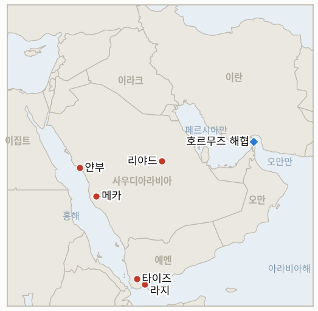

# 중동 일일 브리핑

**2026년 9월 26일**

- **보고 기간:** 약 24시간, 9월 25일 09:00 ~ 9월 26일 09:00 (한국시간)
- **종합 평가:** 걸프 안보가 두 방향으로 동시에 다자화됐지만, 어느 쪽도 아직 추가 병력을 실제로 배치하지는 않았다. 사우디·튀르키예·파키스탄의 메카 공동방위협정은 8월 서명 이후 처음으로 구체적인 조치를 내놓아 외무장관들이 리야드에서 긴급 합참의장 회의를 마련했고(§1.1), 마크롱 대통령은 이 협정과는 별개로 프랑스가 병력과 레이더, 방공 장비를 얀부 보호를 위해 파견하겠다고 발표했다(§1.2). 두 움직임 모두 목요일 타이프·얀부에 대한 요격된 미사일·드론 공격이라는 같은 계기에서 나왔지만, 어느 쪽도 아직 전투 병력을 투입하지는 않아 동서 파이프라인의 홍해 종점은 방어보다 논의가 앞서고 있다. 유가는 이날을 완화 신호로 받아들였다. 미국·이란이 호르무즈 재개방과 봉쇄 해제를 맞바꾸는 단계적 협상을 진행 중이라는 보도가 후티의 공격 위험을 상쇄하며 브렌트유와 WTI 모두 목요일 급등분의 일부를 반납했지만, 브렌트유는 여전히 주간 상승세를 유지했다(§1.3). 이란의 레자에이 시한은 둘째 날에 접어들었으나 워싱턴은 공식 대응을 내놓지 않았고, 트럼프의 발언도 모호했다(§1.4). 한국 시장은 추석 연휴 사흘째 휴장을 이어갔고, 호르무즈 파병 검토는 이번 보고 기간 별다른 움직임을 보이지 않았다(§1.5). 이번 보고 기간 지표 2개가 해소됐다: IND-20260911-2는 메카 협정의 첫 공개된 공동 조치로 확인됐고, IND-20260919-2는 트렌드호 사건 이후 추가로 확인된 호르무즈 사건이 없어 시한 도래로 기각됐다. 프랑스의 파병, 협정의 다음 시험대, 예멘 타이즈 아덴 라지 회랑이 지속적인 전선이 될지를 각각 추적하는 새 지표 3개가 열렸다.

---

## 1. 무슨 일이 있었나

<figure style="float:right; width:46%; margin:2pt 0 8pt 14pt;">

<figcaption style="font-size:8pt; color:#666; text-align:center; margin-top:3pt; font-style:italic;">주요 논의 지점</figcaption>
</figure>

### 1.1 메카 공동방위협정, 서명 이후 첫 구체적 조치에 나서다

사우디 외무장관 파이살 빈 파르한, 파키스탄 부총리 겸 외무장관 이샤크 다르, 튀르키예 외무장관 하칸 피단이 9월 24일 유엔총회 계기에 뉴욕에서 8월 7일 세 나라가 서명한 상호방위협정인 메카 공동방위협정의 틀 안에서 회동해, 사우디아라비아 지원 방안을 논의할 긴급 합참의장 회의를 리야드에서 열기로 했다([알자지라](https://www.aljazeera.com/news/2026/9/25/saudi-turkish-pakistani-chiefs-plan-urgent-talks-amid-yemen-fighting)). 튀르키예군 참모총장 셀추크 바이락타로을루가 사우디·파키스탄 측 대표를 만나기 위해 출국할 예정이며, 이에 앞서 파키스탄은 예비역 중장 나우만 마흐무드를 협정의 초대 사무총장으로 임명했고(9월 23일), 튀르키예 의회는 휴회를 마치고 복귀하는 10월 1일 협정을 비준할 것으로 예상된다([알자지라](https://www.aljazeera.com/news/2026/9/25/pakistan-turkiye-edge-closer-towards-joining-saudi-war-against-houthis); [데일리사바흐](https://www.dailysabah.com/politics/mecca-defense-pact-brings-military-chiefs-together-in-saudi-arabia/news)). 다만 외무장관들의 공동 성명은 합참의장 회의의 시기나 지원 형태를 구체적으로 밝히지 않았고, 다르 부총리의 발언에는 이번 회동의 계기가 된 후티 공격에 대한 언급조차 없었으며, 피단 장관은 튀르키예의 기여가 "특정 기술 분야"에 국한될 수 있다고 말했는데, 이는 두 나라 각자의 제약, 파키스탄은 아프간 국경 긴장과 인도와의 관계로, 튀르키예는 나토 의무와 시리아 국경 문제로 여력이 제한된 상황을 반영한다. 뉴욕 회동과 리야드 회의 마련은 이 원장이 정한 "공개된 공동 조치"의 기준을 충족해 **IND-20260911-2**를 확인으로 해소하며, 합참의장 회의가 실제로 무엇을 내놓을지는 **IND-20260926-2**를 새로 연다. **신뢰도: 높음** (회동의 발생과 목적은 알자지라, 데일리사바흐, 걸프비즈니스가 수렴 보도); 사무총장 임명과 비준 일정 등 구체적 날짜는 단일 매체 보도에 의존해 **중간**.

### 1.2 프랑스, 얀부 보호를 위한 직접 군사 파병 발표

마크롱 대통령은 프랑스가 동서 파이프라인의 홍해 출구인 사우디아라비아 얀부 터미널을 보호하기 위해 "병력, 레이더, 방공 체계를 포함한 군사 자산을 파견할 것"이라고 밝혔으며, 이는 리야드와 합의된 조치라고 설명했다([타임스오브이스라엘](https://www.timesofisrael.com/liveblog_entry/france-to-send-troops-to-protect-saudi-arabia-on-red-sea-oil-route-macron-says/)). 마크롱은 이번 파병이 "어떤 분쟁에도 개입하려는 것이 아니라 시설을 보호하기 위한 것"이라고 강조했으며, 파견 시기나 라팔 전투기 포함 여부는 밝히지 않았다. 이번 발표는 사우디아라비아가 목요일 타이프와 얀부를 겨냥한 탄도미사일 6발을 요격한 데 이어 나왔으며, 같은 날 리야드는 메카·제다·타이프·타부크에 대한 공습 경보를 새로 발령했다([유로뉴스](https://www.euronews.com/2026/09/25/saudi-arabia-reports-fresh-houthi-attacks-as-france-offers-military-support-to-protect-yan)). 이는 이번 전쟁에서 사우디아라비아 내 서유럽의 첫 직접 군사 개입이며, 메카 협정의 합참의장 트랙(§1.1)과는 별개로 독자적으로 발표됐다. 이는 파이프라인의 전면 가동 복귀를 추적하는 **IND-20260923-1**에 더 날카로운 시험대이며, 프랑스의 움직임이 일회성 조치로 남을지 다른 비걸프·비미국 국가의 추가 파병으로 이어질지를 추적하는 **IND-20260926-1**을 새로 연다. **신뢰도: 높음** (마크롱 본인의 발언이며 복수 매체가 수렴 보도); 파병 규모와 시기 등 구체적 사항은 미확정으로 **중간**.

### 1.3 유가, 휴전 기대감에 목요일 급등분 반납

브렌트유는 금요일 그리니치표준시 12시 15분 기준 105.26달러(-1.3%), WTI는 92.78달러(-1.9%)에 거래돼 목요일 세션 고점(브렌트유 장중 108.23달러)에서 모두 내려왔다. 뉴욕에서 미국과 이란 협상단이 테헤란의 호르무즈 재개방과 워싱턴의 해상 봉쇄 해제를 맞바꾸는 단계적 방안을 모색하고 있다는 보도가 목요일 타이프·얀부 공격에 따른 위험 프리미엄을 상쇄했다([로이터/더내셔널](https://www.thenationalnews.com/business/energy/2026/09/25/oil-prices-waver-in-face-of-iran-war-truce-and-houthi-attacks/); [로이터/글로브앤드메일](https://www.theglobeandmail.com/investing/article-oil-slides-as-us-iran-truce-hopes-outweigh-houthi-attacks-on-saudi/)). 브렌트유는 여전히 주간 약 1.5% 상승을 유지하고 있으나 WTI는 주간 약 7.4% 하락했으며, 브렌트-WTI 스프레드는 5월 이후 최대인 12.83달러까지 벌어졌는데, 복수 매체는 이를 중동 공급 위험보다는 미국의 경유 수출 금지 우려와 연결짓고 있다. 뉴욕 정규 마감가는 작성 시점까지 확인되지 않아, 오늘 자 전면부 자료와 차트 종점은 확정 마감가 대신 그리니치표준시 12시 15분 기준 장중 시세를 사용했다. **신뢰도: 높음** (가격 수준과 스프레드는 로이터 통신 및 복수 매체의 수렴 보도); 스프레드 확대의 주된 요인이 경유 수출 금지라는 해석은 **중간**.

### 1.4 이란의 호르무즈 시한, 첫날이 지나도록 무응답

최고국가안보회의 사무총장 모흐센 레자에이가 못박은 4~5일 시한(**IND-20260925-1**)이 둘째 날에 접어들었지만 이번 보고 기간 워싱턴의 공개 대응은 확인되지 않았다. 트럼프 대통령은 이란 당국자들과의 대화에 대해 "아주 잘 됐다"고만 말했는데, 이는 실질적 내용이 아닌 어조에 대한 언급으로 레자에이의 조건이나 시한을 직접 다루지 않았다([걸프뉴스](https://gulfnews.com/uae/us-iran-war-tehran-sets-hormuz-deadline-as-truce-hopes-grow-what-uae-residents-need-to-know-tonight-1.500687971)). 이란 당국자들은 시한이 지난 뒤에야 "다음 조치"를 결정하겠다고 말했으며, 한 분석은 양측이 여전히 참조하는 이슬라마바드 합의의 틀을 중재한 파키스탄이 워싱턴의 침묵보다 더 주목할 만한 채널이라고 주장했다. 파키스탄은 "대화 채널을 유지할 수는 있지만, 이미 한 번 파기한 합의를 워싱턴이 지키도록 강제할 수는 없다"는 것이다([미들이스트모니터](https://www.middleeastmonitor.com/20260925-iran-just-gave-washington-a-deadline-watch-islamabad-not-the-white-house/)). 한편 이번 보고 기간 추가로 확인된 호르무즈 해협 사건이나 공개된 IRGC 작전적 조치는 없어, **IND-20260919-2**가 9월 26일 자체 시한에 기각으로 해소됐다: 9월 18일 카사브 인근 트렌드호 공격과 뒤이은 테헤란 집회는 일주일 안에 추가 사건으로 이어지는 강경화 흐름을 만들어내지 못했다. **신뢰도: 높음** (미국의 공개 대응 부재와 추가 호르무즈 사건 부재 모두); 이슬라마바드 채널 분석은 단일 매체의 해석적 주장으로 **중간**.

### 1.5 한국 시장 휴장 지속, 호르무즈 검토는 진전 없음

한국거래소와 서울 외환시장은 추석 연휴 사흘째인 이날도 휴장했으며, 거래는 9월 28일 재개될 예정이다. 이번 보고 기간 호르무즈 파병 검토에 대한 별다른 진전은 확인되지 않았으며, 가장 최근 확인된 정부 입장은 9월 18일 이재명 대통령의 "전쟁에 관여하거나 개입하는 파병은 없다"는 발언과, 이를 대신해 청해부대의 역할을 확대해 한국 상선을 보호하는 방안을 검토 중이라는 점, 그리고 9월 16일 33.8%의 대통령 지지율과 약 55%의 국민 반대 여론 속에 국가안전보장회의 상임위원회 안건에서 파병 논의를 제외하기로 한 결정이다([코리아헤럴드](https://www.koreaherald.com/article/10878676); [코리아중앙데일리](https://www.koreajoongangdaily.com/korea/blue-house-pulls-hormuz-deployment-from-nsc-agenda-as-political-pressure-mounts/12877110)). **신뢰도: 높음** (휴장 여부와 새 보도 부재는 확인이 용이); 지지율·여론조사 수치는 각각 단일 매체 보도에 의존해 **중간**.

---

## 2. 심층 분석: 동기와 이해관계

### 2.1 프랑스는 왜 메카 협정이나 워싱턴에 걸프 안보를 맡기지 않고 얀부를 직접 방어하려 하나?

프랑스의 독자 파병은 메카 협정의 더딘 제도적 경로(§2.2)와 외교를 우선하는 워싱턴의 자세를 모두 건너뛰어, 마크롱이 전투 병력이 아닌 방어 장비와 기술 인력으로 가시적이면서도 위험이 적은 안정화 역할을 자처할 수 있게 해준다. 동시에 사우디 에너지 시설에 대한 프랑스의 상업적 이해관계를 보호하고, 파리가 다른 제약에 얽매인 리야드의 다른 동맹들을 기다리지 않고 스스로 정한 일정에 따라 독자적으로 행동할 수 있게 한다.

### 2.2 메카 협정의 첫 구체적 조치는 왜 여전히 병력 배치가 아닌 회의 준비에 머물러 있나?

파키스탄과 튀르키예 각자 협정의 상호방위 조항보다 실제로 더 큰 제약을 안고 있기 때문이다. 파키스탄군은 아프간 국경 긴장과 인도와의 관계로 여력이 분산돼 있고, 튀르키예는 나토 의무와 자국 시리아 국경 문제 사이에서 균형을 잡아야 한다. 두 나라 모두 사무총장 임명, 비준 일정 등 제도적 제스처는 취했지만 아직 병력을 투입하지는 않았는데, 이는 사우디아라비아를 수사적·제도적으로 지지하면서도 스스로 통제할 수 없는 전쟁에 얽매이는 것은 피하려는 패턴과 일치한다.

### 2.3 이란은 왜 트럼프가 공개적으로 긴박함을 낮추는 와중에도 호르무즈에 강경한 시한을 고수하나?

레자에이의 시한은 협상 수단인 동시에 국내용 목적을 지닌다. 아라그치 외교장관이 미국 특사들과의 직접 접촉을 이유로 탄핵소추안에 직면한 상황에서(**IND-20260924-2**, 9월 25일 확인), 이 시한은 테헤란의 강경 안보 기구가 외교 트랙에 단순히 반응하는 것이 아니라 주도하고 있다고 주장할 수 있게 해준다. 반면 트럼프의 모호한 "아주 잘 됐다"는 표현은 워싱턴이 공개적으로 최후통첩을 인정하지 않으면서도 위트코프·쿠슈너 채널을 계속 열어둘 수 있게 하며, 양측 모두 실질적 협상을 막지 않으면서도 각자의 국내 지지층에는 강경한 모습을 보일 수 있게 한다.

---

## 3. 한국에 대한 정책 함의

**노출도 스냅샷:** 한국의 원유 수입은 2026년 7월 기준 여전히 약 70%가 호르무즈 해협 통과에 의존하지만, 2026년 5~7월 한국석유공사 자료에 따르면 한국 전체 원유 수입에서 비중동산 비중이 51.5%(전년 동기 31.9%에서 상승)로 확대되며 다변화가 계속되고 있다(`instructions/korea-exposure.md`, 8월 12일 갱신, 이번 보고 기간 갱신 불필요). 금요일 장중 유가: 브렌트유 105.26달러(-1.3%), WTI 92.78달러(-1.9%); 코스피와 원화는 추석 휴장으로 수요일 종가인 7,080.92와 1,358.4원에 멈춰 있다.

**사안별 함의:**

- **메카 협정과 프랑스의 병행하는, 아직 부분적인 얀부 대응 (§1.1, §1.2):** 걸프 안보가 다자화되는 양상은 다른 동맹국들이 가시적으로 나서는 모습으로 서울에 대한 군사적 기여 압박을 완화시킬 수도, 반대로 워싱턴이 프랑스의 조치를 다른 동맹이 따라야 할 기준으로 제시하며 압박을 강화할 수도 있다. 9월 중순부터 멈춰 있는 서울 자체의 검토는 어느 쪽 논리에도 정면으로 걸려 있다.
- **목요일 급등분에서 일부 되돌린 유가 (§1.3):** 한국의 수입 비용에 단기적으로는 완만한 안도이지만, 브렌트유의 지속적인 주간 상승세와 한국의 홍해 원유 우회로의 유일한 출구인 얀부에 대한 여전한 후티 위협을 고려하면 이 완화는 구조적이라기보다 잠정적이다.
- **미해결 상태인 레자에이 시한 (§1.4):** 최소 9월 29일까지 호르무즈 재개방 시기의 불확실성을 유지시키며, 이는 시장 재개 전 한국 정유사와 한국석유공사가 원하는 가시성 확보 기간과 맞물린다.
- **한국 시장의 계속된 휴장 (§1.5):** 코스피와 원화가 연휴 동안 멈춰 있는 가운데, 이번 주 메카 협정과 프랑스 관련 소식이 반영될 9월 28일 재개일은 두 지표 모두에 촉매가 몰린 재개 시점으로 주목할 만하다.

**검증 가능한 지표:**

- **IND-20260911-2** (확인): 메카 협정의 뉴욕 외무장관 회동과 리야드 합참의장 회의 마련이 "공개된 공동 조치" 기준을 충족했다. 2026-09-26 확인.
- **IND-20260919-2** (시한 도래로 기각): 9월 18일 트렌드호 공격 이후 일주일 안에 추가로 확인된 호르무즈 사건이나 공개된 IRGC 작전적 조치가 없었다. 2026-09-26 기각.
- **IND-20260926-1** (열림, 신규): 프랑스의 얀부 파병에 이어 다른 비걸프·비미국 국가의 사우디 에너지 시설 보호 파병 발표는 아직 없다. 열림, 시한 ~2026-10-17.
- **IND-20260926-2** (열림, 신규): 메카 협정의 합참의장 회의는 아직 열리지 않았거나 공개된 병력 공약을 내놓지 못했다. 열림, 시한 ~2026-10-17.
- **IND-20260926-3** (열림, 신규): 타이즈 아덴 라지 회랑에서 이미 격퇴된 것으로 추적된 야간 공격 외에 추가 공격은 이번 보고 기간 확인되지 않았다. 열림, 시한 ~2026-10-10.
- **IND-20260925-1** (열림): 워싱턴은 레자에이의 4~5일 시한에 대한 대응을 둘째 날까지도 공개하지 않았다. 열림, 시한 ~2026-09-29.
- **IND-20260925-3** (열림): 이번 보고 기간 얀부에 대한 추가 후티 공격은 없었지만, 프랑스의 파병 발표는 터미널의 계속된 취약성을 부각시켰다. 열림, 시한 ~2026-10-15.
- **IND-20260924-1** (열림): 이란의 광범위한 로드맵에 대한 명시적인 미국의 공개 대응은 이번 보고 기간 없었으며, 단계적 호르무즈·봉쇄 맞교환 트랙은 계속 논의 중인 것으로 보도되고 있다. 열림, 시한 ~2026-09-30.
- **IND-20260923-1** (열림, 이번 주 더 날카로운 시험): 프랑스의 파병은 이 지표가 추적하는 노출 위험에 직접 대응한 것이며, 파이프라인의 전면 가동 복귀는 확인된 처리량 수치로 아직 검증되지 않았다. 열림, 시한 ~2026-11-03.
- **IND-20260922-3** (열림): 마리브 고지대 공세는 이번 보고 기간 새로운 움직임이 보도되지 않았다. 열림, 시한 ~2026-10-13.
- **IND-20260906-2** (열림): 한국의 호르무즈 태세는 추석 휴장 동안 검토 단계에 머물렀다. 열림, 시한 ~2026-09-28.
- **IND-20260714-4** (열림, 시한 없음): 카타르 라스라판의 주간 선적 최신 수치가 여전히 없다. 이 원장에서 가장 오래 미해결로 남아 있는 지표다.

---

## 4. 주시 목록

- **메카 협정 합참의장 회의의 실제 개최 여부와 시기 (IND-20260926-2):** 외무장관들의 성명이나 후속 보도 모두 시기를 특정하지 않았다.
- **프랑스의 얀부 파병에 대한 이란·후티 반군의 대응 여부 (IND-20260926-1):** 테헤란은 그간 외국군의 참여가 "심각한 결과"를 낳을 것이라고 경고해왔다.
- **예멘 타이즈·마리브·알자우프 전선의 상황 (IND-20260922-3, IND-20260926-3):** 이번 보고 기간 결정적인 변화 없이 고강도 전투가 계속됐다.
- **이란의 IAEA 대치:** 9월 9일 이사회 결의와 폭격당한 핵시설에 대한 사찰단 접근 부재가 계속되는 가운데, 호르무즈 협상과는 별개의 압박 축이다.
- **한국의 호르무즈 파병 검토 (IND-20260906-2):** 9월 28일 코스피와 정부 활동이 재개된 뒤의 상황.

---

## 5. 출처 신뢰도 요약

| 주장 | 출처 | 신뢰도 |
|---|---|---|
| 메카 협정 외무장관 회동과 합참의장 회의 마련 | 알자지라(2건), 데일리사바흐, 걸프비즈니스, 예루살렘포스트 | 높음 |
| 파키스탄 사무총장 임명과 튀르키예 비준 일정 | 알자지라 | 중간 (단일 매체의 구체적 날짜) |
| 프랑스의 얀부 병력·레이더·방공 파병 | 타임스오브이스라엘, 유로뉴스, RT, 디펜스뉴스 | 높음 |
| 유가 수준과 브렌트-WTI 스프레드 | 로이터(더내셔널, 글로브앤드메일, 야후파이낸스 경유) | 높음 |
| 레자에이 시한에 대한 미국의 공개 대응 부재 | 걸프뉴스, RFE/RL, 내셔널시큐리티저널 | 높음 |
| 이슬라마바드 채널 분석 | 미들이스트모니터 | 중간 (단일 매체의 해석적 주장) |
| 한국 추석 시장 휴장과 호르무즈 검토 상태 | 코리아헤럴드, 코리아중앙데일리 | 높음 |
