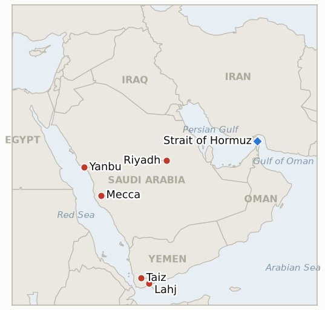

# Middle East Daily Briefing

**September 26, 2026**

- **Reporting window:** ~24 hours, September 25, 09:00 to September 26, 09:00 KST
- **Overall assessment:** Gulf security multilateralized in two directions at once without either yet putting a single additional soldier on the ground: the Saudi Turkish Pakistani Mecca Joint Defence Agreement produced its first concrete disclosed step since its August signing, foreign ministers arranging an urgent chiefs of staff meeting in Riyadh (§1.1), while President Macron separately announced France will send troops, radars and air defense systems to protect Saudi Arabia's Yanbu terminal outside that pact altogether (§1.2). Both moves respond to the same driver, Thursday's intercepted missile and drone barrage on Taif and Yanbu, but neither commits combat forces yet, leaving the East-West pipeline's Red Sea terminus more discussed than defended. Oil read the day as net calming: Brent and WTI gave back part of Thursday's spike as reports of US-Iran talks on a phased Hormuz-for-blockade swap outweighed the Houthi attack risk, though Brent still holds a weekly gain (§1.3). Iran's Rezaei deadline entered its second day with Washington disclosing no formal response, and Trump's own comments stayed noncommittal (§1.4). South Korea's markets remained closed for Chuseok's third day, and the Hormuz deployment review shows no material movement this window (§1.5). Two ledger indicators resolve this window: IND-20260911-2 confirms on the Mecca pact's first disclosed joint step, and IND-20260919-2 falsifies at its own deadline with no further verified Hormuz incident since the Trend tanker strike. Three new indicators open on France's deployment, the pact's next test, and whether Yemen's Taiz Aden Lahj corridor becomes a sustained front.

---

## 1. What Happened

<figure style="float:right; width:46%; margin:2pt 0 8pt 14pt;">

<figcaption style="font-size:8pt; color:#666; text-align:center; margin-top:3pt; font-style:italic;">Major places of discussion</figcaption>
</figure>

### 1.1 The Mecca Joint Defence Agreement takes its first concrete step since signing

Saudi Foreign Minister Faisal bin Farhan, Pakistan's Deputy Prime Minister and Foreign Minister Ishaq Dar, and Turkish Foreign Minister Hakan Fidan met on the sidelines of the UN General Assembly in New York on September 24 within the framework of the Mecca Joint Defence Agreement, the mutual defense pact the three countries signed August 7, and arranged an urgent meeting of their chiefs of staff in Riyadh to discuss support for Saudi Arabia ([Al Jazeera](https://www.aljazeera.com/news/2026/9/25/saudi-turkish-pakistani-chiefs-plan-urgent-talks-amid-yemen-fighting)). Turkey's Chief of General Staff Selcuk Bayraktaroglu is due to travel to meet his Saudi and Pakistani counterparts, days after Pakistan named retired Lieutenant General Nauman Mahmood the pact's first secretary general (Sept 23) and with Turkey's parliament expected to ratify the agreement when it returns from recess October 1 ([Al Jazeera](https://www.aljazeera.com/news/2026/9/25/pakistan-turkiye-edge-closer-towards-joining-saudi-war-against-houthis); [Daily Sabah](https://www.dailysabah.com/politics/mecca-defense-pact-brings-military-chiefs-together-in-saudi-arabia/news)). The ministers' own statement did not specify when the chiefs would meet or what form of support might follow, and Dar's remarks notably omitted any mention of the Houthi attacks that prompted the meeting, while Fidan said Turkey's contribution "could particularly be in certain technical areas," language reflecting both countries' own constraints, Pakistan's military stretched by Afghan border tensions and its relationship with India, Turkey balancing NATO commitments and its Syrian border. The New York meeting and arranged Riyadh session meet the ledger's bar for a disclosed joint step, confirming **IND-20260911-2**; what the chiefs of staff meeting actually produces once convened opens **IND-20260926-2**. **Confidence: High** on the meeting's occurrence and stated purpose, converging across Al Jazeera, Daily Sabah, and Gulf Business; **Medium** on the specific institutional dates (secretary general appointment, ratification timeline), resting on single-outlet reporting.

### 1.2 France announces a direct military deployment to protect Yanbu

President Emmanuel Macron said France will "send military assets, meaning soldiers, radars and defence systems" to protect Saudi Arabia's Yanbu terminal, the East-West pipeline's Red Sea outlet, in an arrangement agreed with Riyadh ([Times of Israel](https://www.timesofisrael.com/liveblog_entry/france-to-send-troops-to-protect-saudi-arabia-on-red-sea-oil-route-macron-says/)). Macron stressed the deployment is "not to involve ourselves in any conflict, but to protect the site," declining to specify a timeline or confirm whether Rafale jets would be included. The announcement followed Saudi Arabia's interception of six ballistic missiles aimed at Taif and Yanbu on Thursday and came the same day Riyadh issued fresh air raid alerts for Mecca, Jeddah, Taif and Tabuk ([Euronews](https://www.euronews.com/2026/09/25/saudi-arabia-reports-fresh-houthi-attacks-as-france-offers-military-support-to-protect-yan)). It is the war's first direct Western European military commitment inside Saudi Arabia, distinct from and announced independently of the Mecca pact's own chiefs of staff track (§1.1); this is a distinct, sharper test for **IND-20260923-1** (the pipeline's path to full capacity) and opens **IND-20260926-1**, tracking whether France's move stays a one-off national gesture or draws further non-Gulf, non-US deployments. **Confidence: High** on Macron's own statement, corroborated across multiple outlets; **Medium** on operational details, since deployment timing and force size remain unconfirmed.

### 1.3 Oil eases from Thursday's spike as truce hopes offset Houthi risk

Brent traded at $105.26 (-1.3%) and WTI at $92.78 (-1.9%) at 1215 GMT Friday, both down from Thursday's session high (Brent touched $108.23) as reports that US and Iranian negotiators in New York are exploring a phased arrangement, Tehran reopening Hormuz in exchange for Washington lifting its naval blockade, offset the risk premium from Thursday's Yanbu and Taif barrage ([Reuters via The National](https://www.thenationalnews.com/business/energy/2026/09/25/oil-prices-waver-in-face-of-iran-war-truce-and-houthi-attacks/); [Reuters via Globe and Mail](https://www.theglobeandmail.com/investing/article-oil-slides-as-us-iran-truce-hopes-outweigh-houthi-attacks-on-saudi/)). Brent still holds a roughly 1.5% weekly gain while WTI is down about 7.4% on the week; the Brent-WTI spread widened to $12.83, its widest since May, which multiple outlets tie to fears of a prospective US diesel export ban rather than to Middle East supply risk directly. NY settle figures were not yet available at run time, so today's front matter and chart endpoint use the 1215 GMT intraday read rather than a confirmed close. **Confidence: High** on the price levels and spread, sourced to Reuters wire and corroborated across multiple outlets; **Medium** on the diesel-ban linkage as the spread's primary driver, an interpretive read.

### 1.4 Iran's Hormuz deadline passes its first full day unanswered

SNSC secretary Mohsen Rezaei's four to five day deadline for Washington to meet Iran's seven preconditions (**IND-20260925-1**) reached its second day with no disclosed US response found this window. Trump, asked about talks with Iranian officials, called them "very well," a comment on tone rather than substance that did not address Rezaei's conditions or timeline ([Gulf News](https://gulfnews.com/uae/us-iran-war-tehran-sets-hormuz-deadline-as-truce-hopes-grow-what-uae-residents-need-to-know-tonight-1.500687971)). Iranian officials said Tehran would decide its "next step" only once the deadline lapses, and one analysis argued Pakistan, which brokered the underlying Islamabad framework both sides still reference, is a more consequential channel to watch than Washington's own public silence, since Islamabad "can keep a channel open" but "cannot force Washington to honor an agreement it already walked away from once" ([Middle East Monitor](https://www.middleeastmonitor.com/20260925-iran-just-gave-washington-a-deadline-watch-islamabad-not-the-white-house/)). Separately, no further verified Strait of Hormuz incident or disclosed IRGC operational step was found this window, falsifying **IND-20260919-2** at its own September 26 deadline: the Sept 18 Trend tanker strike near Khasab and the Tehran rally that followed did not produce a hardening trend of further incidents within the week. **Confidence: High** on the absence of a disclosed US response and of a further Hormuz incident; **Medium** on the Islamabad-channel analysis, a single-outlet interpretive argument.

### 1.5 South Korea's markets stay closed as the Hormuz review shows no movement

KOSPI and Seoul's FX market remained closed for Chuseok's third consecutive day, with trading set to resume September 28. No material update to the Hormuz deployment review was found this window; the most recent confirmed government positions remain President Lee's September 18 statement that "there will be no deployment that involves or intervenes in the war," with Seoul instead weighing an expanded Cheonghae Unit role to protect Korean merchant vessels, and the government's September 16 decision to drop the deployment question from the National Security Council's standing committee agenda amid a 33.8% presidential approval rating and roughly 55% public opposition ([Korea Herald](https://www.koreaherald.com/article/10878676); [Korea JoongAng Daily](https://www.koreajoongangdaily.com/korea/blue-house-pulls-hormuz-deployment-from-nsc-agenda-as-political-pressure-mounts/12877110)). **Confidence: High** (holiday closure and absence of new reporting both straightforward to confirm; underlying approval and polling figures sourced to a single outlet each, so treated as **Medium**).

---

## 2. Deep Dive: Incentives and Motives

### 2.1 Why is France moving to defend Yanbu directly rather than leaving Gulf security to the Mecca pact or Washington?

Because France's own deployment sidesteps both the Mecca pact's slow institutional track (§2.2) and Washington's diplomacy-first posture, letting Macron claim a visible, low-risk stabilizing role, defensive equipment and technicians rather than combat forces, while protecting French commercial exposure to Saudi energy infrastructure and letting Paris act unilaterally on a timeline of its own choosing rather than waiting on Riyadh's other, more encumbered allies.

### 2.2 Why does the Mecca pact's first concrete step still stop at a planning meeting rather than deployed forces?

Because Pakistan and Turkey each have binding constraints that outweigh the pact's mutual defense clause in practice: Pakistan's military is stretched by Afghan border tensions and its relationship with India, while Turkey must balance NATO commitments and its own Syrian border security, so both countries have made institutional gestures, a secretary general, a ratification timeline, without yet committing forces, consistent with a pattern of supporting Saudi Arabia rhetorically and institutionally while avoiding entanglement in a war neither fully controls.

### 2.3 Why is Iran holding a hard deadline on Hormuz while Trump downplays urgency in public?

Because Rezaei's deadline serves a domestic purpose as much as a negotiating one: it lets Tehran's hardline security establishment claim it is driving, not just responding to, the diplomatic track even as Foreign Minister Araghchi faces an impeachment motion over his own direct contacts with US envoys (**IND-20260924-2**, confirmed Sept 25), while Trump's noncommittal "very well" framing lets Washington avoid publicly validating an ultimatum while keeping the parallel Witkoff-Kushner channel open, letting both sides appear tough to their own domestic audiences without foreclosing the substantive negotiation.

---

## 3. Policy Implications for South Korea

**Exposure snapshot:** South Korea's crude imports remain roughly 70% dependent on Strait of Hormuz transit as of July 2026, though KNOC data for May to July 2026 shows the non-Middle East share of Korea's total crude mix has since risen to 51.5% (from 31.9% a year earlier) as diversification continues (`instructions/korea-exposure.md`, Aug 12 addition, no update needed this window). Friday's intraday oil read: Brent $105.26 (-1.3%), WTI $92.78 (-1.9%); KOSPI and the won are frozen at Wednesday's 7,080.92 and 1,358.4 through the Chuseok closure.

**Implications by development:**

- **The Mecca pact's and France's parallel, still-partial responses to the Yanbu threat (§1.1, §1.2):** Gulf security is multilateralizing in ways that could either dilute US pressure on Seoul to contribute militarily, other allies visibly stepping up, or sharpen it, Washington citing France's move as a benchmark other partners should match; Seoul's own review, frozen since mid-September, sits squarely in the path of that argument either way.
- **Oil's partial retreat from Thursday's spike (§1.3):** a mild near-term relief for Korea's import bill, but the persistent weekly gain in Brent and the still-active Houthi threat to Yanbu, the sole outlet for Korea's Red Sea crude workaround, mean the relief is provisional rather than structural.
- **The unresolved Rezaei deadline (§1.4):** keeps Hormuz reopening timing uncertain through at least September 29, the visibility window Korean refiners and KNOC would want before markets reopen.
- **Korea's continued market closure (§1.5):** with KOSPI and the won frozen through the holiday, September 28, the first trading day after this week's Mecca pact and France developments land, is a catalyst-heavy reopen worth flagging for both indices.

**Testable indicators:**

- **IND-20260911-2** (confirmed): the Mecca pact's New York foreign ministers' meeting and arranged Riyadh chiefs of staff session meet the "disclosed joint step" bar. Confirmed 2026-09-26.
- **IND-20260919-2** (falsified at deadline): no further verified Hormuz incident or disclosed IRGC operational step followed the Sept 18 Trend tanker strike within the week. Falsified 2026-09-26.
- **IND-20260926-1** (open, new): France's Yanbu deployment has not yet drawn a further non-Gulf, non-US country's own military deployment to protect Saudi energy infrastructure. Open, deadline ~2026-10-17.
- **IND-20260926-2** (open, new): the Mecca pact's arranged chiefs of staff meeting has not yet occurred or produced a disclosed force commitment. Open, deadline ~2026-10-17.
- **IND-20260926-3** (open, new): the Taiz Aden Lahj corridor shows no further reported attack this window beyond the repelled night assault already tracked. Open, deadline ~2026-10-10.
- **IND-20260925-1** (open): Washington has not yet disclosed a response to Rezaei's four to five day deadline, now on its second day. Open, deadline ~2026-09-29.
- **IND-20260925-3** (open): no further Houthi strike on Yanbu found this window, but France's deployment announcement underscores the terminal's continued exposure. Open, deadline ~2026-10-15.
- **IND-20260924-1** (open): no disclosed explicit US response to Iran's broader road map found this window; the phased Hormuz-for-blockade track continues to be reported as under discussion. Open, deadline ~2026-09-30.
- **IND-20260923-1** (open, sharper test this window): France's deployment responds directly to the exposure this indicator tracks; the pipeline's path to full capacity remains untested by a confirmed throughput figure. Open, deadline ~2026-11-03.
- **IND-20260922-3** (open): no fresh reported movement on the Marib highlands push this window. Open, deadline ~2026-10-13.
- **IND-20260906-2** (open): South Korea's Hormuz posture stayed at review through the Chuseok closure. Open, deadline ~2026-09-28.
- **IND-20260714-4** (open, no deadline): still no fresh weekly Qatari Ras Laffan loading figure, the ledger's longest-running unresolved indicator.

---

## 4. Watch List

- **Whether the Mecca pact chiefs of staff meeting actually convenes and on what date (IND-20260926-2):** neither the ministers' statement nor subsequent reporting specified timing.
- **Whether France's Yanbu deployment draws a response from Iran or the Houthis (IND-20260926-1):** Tehran has previously warned that foreign military participation "would have serious consequences."
- **The state of Yemen's Taiz, Marib and al-Jawf fronts (IND-20260922-3, IND-20260926-3):** fighting continues at high tempo without a single decisive shift this window.
- **Iran's IAEA standoff:** following the Board of Governors' September 9 resolution and continuing lack of inspector access to bombed nuclear sites, a separate pressure track from the Hormuz negotiations.
- **South Korea's Hormuz deployment review (IND-20260906-2):** status once KOSPI and government activity resume September 28.

---

## 5. Source Quality Summary

| Claim | Sources | Confidence |
|---|---|---|
| Mecca pact foreign ministers' meeting and arranged chiefs of staff session | Al Jazeera (x2), Daily Sabah, Gulf Business, Jerusalem Post | High |
| Pakistan's secretary general appointment and Turkey's ratification timeline | Al Jazeera | Medium (single-outlet for specific dates) |
| France's Yanbu troop, radar and air defense deployment | Times of Israel, Euronews, RT, Defense News | High |
| Oil price levels and Brent-WTI spread | Reuters (via The National, Globe and Mail, Yahoo Finance) | High |
| No disclosed US response to Rezaei's deadline | Gulf News, RFE/RL, National Security Journal | High |
| Islamabad channel analysis | Middle East Monitor | Medium (single-outlet interpretive analysis) |
| Korea Chuseok market closure and Hormuz review status | Korea Herald, Korea JoongAng Daily | High |
