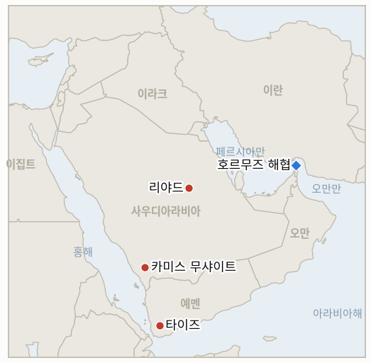

# 중동 일일 브리핑

**2026년 9월 27일**

- **보고 기간:** 약 24시간, 9월 26일 09:00 ~ 9월 27일 09:00 (한국시간)
- **종합 평가:** 금요일 시장을 잠시 진정시켰던 외교 트랙이 토요일 공개적으로 깨졌다. 트럼프 대통령은 이란의 7일 호르무즈-봉쇄 맞교환 제안을 "완패해서" 나온 신호라며 거부하고, 해협을 "트럼프 해협"으로 표기한 지도를 게시했다. 아라그치 외무장관은 이제 선택은 워싱턴에 달렸다고 답했고, 페제시키안 대통령은 알자지라에 협상을 여전히 선호하지만 그 과정을 신뢰하지 않는다고 말했다(§1.1). 이번 거부로 원장 지표 3개가 동시에 해소된다. 둘은 워싱턴이 (비록 거부일지라도) 침묵이 아니라 실제로 대응했음을 확인하는 지표이고, 하나는 7일 제안 자체가 워싱턴이 지킬 의도가 있던 실질적 시한이었는지를 기각한다. 하루 앞서 마련된 메카 협정의 첫 합참의장 회의는 이 원장이 추적해온 대로 협력 문구에 그치는 결과를 내놓았고(§1.2), 후티 공격은 리야드 재발이 아니라 새로운 도시(카미스 무샤이트)로 계속 다변화돼 관련 지표도 마감됐다(§1.3). 금요일 유가 정규 마감가는 한 주가 시작보다는 진정된 채 끝났음을 보여주는 두 번째, 더 확정적인 근거다(§1.4). 한국 증시와 국회는 주말까지 휴장을 이어가며 자체 호르무즈 파병 시한을 하루 앞두고 있다(§1.5). 이번 보고 기간 지표 5개가 해소됐다(확인 2건, 기각 3건). 새 지표 3개는 트럼프의 거부 이후 전개, 메카 협정의 다음 단계, 후티의 확장되는 목표 도시를 각각 추적한다.

---

## 1. 무슨 일이 있었나

<figure style="float:right; width:46%; margin:2pt 0 8pt 14pt;">

<figcaption style="font-size:8pt; color:#666; text-align:center; margin-top:3pt; font-style:italic;">주요 논의 지점</figcaption>
</figure>

### 1.1 트럼프, 이란의 호르무즈 제안 거부하고 해협 이름 바꾼 지도 게시

트럼프 대통령은 토요일 테네시로 출국하며 기자들에게 "그들의 거래를 거부한다... 그 거래는 수용할 수 없다"고 말했고, 이란이 빨리 해결하려는 이유는 "완패하고 있기 때문"이라며, 자신의 봉쇄는 "군사 역사상 가장 위대한 봉쇄"라고 주장하고 최근 29척의 선박이 미군의 호위 아래 해협을 통과했다고 밝혔다([CBS뉴스](https://www.cbsnews.com/live-updates/iran-war-us-trump-strait-of-hormuz-7-day-proposal/); [NBC뉴스](https://www.nbcnews.com/world/iran/iran-says-choice-reopening-hormuz-rests-united-states-offer-rcna599956)). 아바스 아라그치 외무장관이 금요일 밝힌 이란의 제안은 이 원장이 각각 추적해온 두 트랙, 즉 미국의 해상 봉쇄 해제, 이란산 원유 판매에 대한 제재 유예, 레바논을 포함한 휴전을 조건으로 7일 안에 해협을 재개방하고 핵 협상을 재개한다는 내용을 하나로 결합한 것으로, 무산된 6월 양해각서와 이란-오만 통항로 합의 주장과도 연결된다는 보도가 나왔다. 트럼프는 별도로 트루스 소셜에 호르무즈 해협을 "트럼프 해협"으로 표기한 지도를 게시했는데, 이는 해협을 미국 영토로 선포하겠다던 과거 발언에 이은 수사적 확전이다([더스타](https://www.thestar.com.my/aseanplus/aseanplus-news/2026/09/26/trump-publishes-map-of-hormuz-strait-calling-it-now-039trump-strait039); [오픈매거진](https://openthemagazine.com/world/trump-renames-strait-of-hormuz-trump-strait-after-rejecting-irans-ceasefire-plan)). 아라그치는 이제 결정은 워싱턴에 달렸다고 답했고, 페제시키안 대통령은 토요일 알자지라 인터뷰에서 호르무즈 문제 해결이 "무력이 아니라 협상을 통해 가능하다"면서도 미국과의 대화를 "신뢰"하지는 않는다고 말했다(NBC뉴스). 이번 거부는 **IND-20260923-2**(7일 제안 자체의 기준: 거부는 진정한 협상 기회를 확인하는 것이 아니라 기각하는 조건으로 명시돼 있다)를 기각으로 해소하는 동시에, **IND-20260924-1**과 **IND-20260925-1**(두 지표 모두 워싱턴이 침묵이 아니라 실제로 관여했다는 증거로 명시적 거부를 포함한 공개 대응을 기준으로 삼는다)을 확인으로 해소한다. 거부 이후 전개를 추적하는 새 지표 **IND-20260927-1**이 열린다. **신뢰도: 높음** (트럼프의 발언과 이란 제안 내용은 CBS·NBC 등 복수 매체가 수렴 보도); 29척 호위 통과 주장은 미국 당국자의 발언으로 이번 보고 기간 선박 추적 데이터로 독립적으로 확인되지 않아 **중간**.

### 1.2 메카 협정 첫 합참의장 회의, 재확인에 그치고 구체적 공약은 없어

사우디아라비아·튀르키예·파키스탄의 합참의장들이 하루 앞서 마련된 대로 리야드에서 회동해 왕국이 처한 위협을 점검하고 메카 공동방위협정의 "집단방위 공약과 즉각적인 이행"을 재확인했다. 회의 성명은 정보 공유와 군사 조율, "역량 통합" 논의를 다뤘다고 밝혔고, "협정의 조항을 현장의 작전 계획으로 즉시 전환할 필요성", 합동 군사훈련을 포함해, 그리고 향후 정기 회의를 이어가기로 합의하며 마무리됐다([알자지라](https://www.aljazeera.com/video/newsfeed/2026/9/26/26-09-sv-saudi-turkiye-pakistan-chiefs-riy-ks); [알아라비야](https://english.alarabiya.net/News/saudi-arabia/2026/09/25/mecca-defense-alliance-holds-urgent-meeting-reaffirms-commitment-to-defend-saudi-arabia); [걸프뉴스](https://gulfnews.com/world/gulf/saudi/saudi-arabia-pakistan-and-turkey-reaffirm-joint-defence-pact-under-mecca-agreement-1.500688388); [예루살렘포스트](https://www.jpost.com/middle-east/article-909745)). 이 결과, 즉 병력이나 자산 공약 없이 조율·계획 문구에 그친 것은 이번 첫 회의에 대한 **IND-20260926-2**의 기각 기준을 그대로 충족하며, 협정이 약속한 향후 "정기 회의"는 새 지표 **IND-20260927-2**가 추적한다. 이번 회의는 §1.3에서 다루는 최근 후티 공격이 조기 소집의 직접적 계기였다고 회의 성명 자체가 밝혔다. **신뢰도: 높음** (회의 개최와 성명 문구는 매체 네 곳이 수렴 보도); "작전 계획" 문구가 실질적 진전을 반영하는지 통상적인 동맹 수사에 그치는지는 해석의 영역으로 **중간**이며, 이 원장은 계속 추적할 것이다.

### 1.3 후티 공격 다변화 지속, GCC "중대한 확전" 규탄

사우디 주도 연합군은 토요일 새벽 남서부 도시 카미스 무샤이트를 겨냥한 탄도미사일을 요격했다고 밝혔는데, 이는 기존의 리야드·얀부·타이프 축과는 구별되는 목표다. 연합군은 또한 별도로 탄도미사일 2발과 드론 2대를 요격하고 대응으로 타이즈를 타격했다([news4jax/AP](https://www.news4jax.com/news/world/2026/09/26/saudi-arabia-says-it-intercepts-another-houthi-launched-missile-and-other-mideast-developments/); [clickondetroit/AP](https://www.clickondetroit.com/news/world/2026/09/26/saudi-arabia-says-it-intercepts-another-houthi-launched-missile-and-other-mideast-developments/)). 걸프협력회의(GCC)는 이번 공격을 "중대한 확전이자 지역 안보에 대한 위협"이라고 규탄하며 국제사회의 대응을 촉구했다. 마리브·타이즈 일대 전투는 미사일 공세와는 별개로 여전히 높은 강도로 이어지고 있으며, 구호단체들은 지난 2주간 타이즈, 서부 해안, 알자우프, 마리브, 달리 일대에서 최소 194명이 사망하고 880명이 부상했다고 집계했고, 정부군은 마리브 인근 알아이라프 전선에서 진전을 보고했다. 이번 보고 기간 추가 리야드 지역 사건은 확인되지 않아 **IND-20260920-1**이 자체 시한에 기각으로 해소된다. 9월 19일 리야드 공격 시도는 수도를 겨냥한 지속적 전환이 아니라 일회성 신호로 결론나며, 후티의 관심은 대신 새로운 2차 도시로 다변화되고 있다. 이 다변화가 세 번째 도시로 이어질지를 추적하는 새 지표 **IND-20260927-3**이 열린다. **신뢰도: 높음** (요격된 미사일, GCC 성명, 추가 리야드 사건 부재는 통신사 보도로 교차 확인); 마리브 사상자·전선 수치는 **중간** (구호단체 추산으로 이 전쟁에서 이전에도 수치가 엇갈린 바 있음).

### 1.4 금요일 유가 정규 마감가 확정, 진정됐지만 여전히 높은 한 주 마무리

브렌트유는 금요일 104.30달러(-2.14%), WTI는 92.41달러(-2.33%)로 정규 마감했으며, 이는 직전 브리핑에 기록된 그리니치표준시 12시 15분 기준 장중 시세를 대체하는 확정 마감가다([CNBC](https://www.cnbc.com/2026/09/24/oil-iran-crude-kepler-trump-us-un-.html); [더내셔널](https://www.thenationalnews.com/business/energy/2026/09/25/oil-prices-waver-in-face-of-iran-war-truce-and-houthi-attacks/)). 브렌트유는 목요일 장중 고점 108.23달러에서 물러났음에도 주간으로는 여전히 0.43% 상승했고, WTI는 주간 약 8% 하락했다. 브렌트-WTI 스프레드는 5월 이후 최대인 12.68달러까지 벌어졌는데, 보도는 이를 여전히 중동 공급 위험보다는 미국의 경유 수출 금지 가능성과 주로 연결짓고 있다. 토요일은 미국 시장이 휴장이어서 트럼프의 거부(§1.1)는 아직 가격에 반영되지 않았으며, 월요일 재개장의 첫 촉매가 될 전망이다. 이는 한국 시장 재개(§1.5)와도 겹친다. **신뢰도: 높음** (마감가와 스프레드는 CNBC·로이터 계열 매체가 일치 보도); 경유 금지 연결은 복수 매체가 반복 인용하나 독립적으로 검증되지는 않아 **중간**.

### 1.5 한국, 주말까지 휴장 지속, 자체 호르무즈 시한 하루 앞둬

코스피와 서울 외환시장은 추석 연휴가 주말로 이어지며 나흘째 휴장했고, 증시와 국회 모두 9월 28일 월요일 재개될 예정이다. 이번 보고 기간 한국의 호르무즈 파병안(해군 지원함, P-8A 해상초계기, 병력 약 150명)에 대한 공식 국회 동의안 제출이나 본회의 표결은 확인되지 않아, **IND-20260906-2**는 국회가 여전히 휴회 중인 가운데 자체 시한인 9월 28일을 하루 앞두고 있다. 가장 최근 확인된 정부 입장은 조현 외교부 장관이 밝힌, 군사적 파병 없이 호르무즈 항행에 "실질적으로 기여"하겠다는 표현이다. **신뢰도: 높음** (시장·국회 휴장); 파병안의 구체적 구성은 연휴 이전 보도 이후 갱신되지 않아 **중간**으로 처리한다.

---

## 2. 심층 분석: 동기와 유인

### 2.1 트럼프는 왜 해협이 이미 호위 아래 기능하고 있다면서도 이란의 제안을 거부했나?

트럼프가 이를 "군사 역사상 가장 위대한 봉쇄"라고 부르며 29척이 미국의 보호 아래 이동한다고 스스로 규정한 상황에서, 이를 받아들이면 봉쇄의 전제 자체를 양보하고 통항에 대한 이란의 지렛대를 되살리는 거래를 하는 셈이 되기 때문이다. 원유 공급이 어차피 흐르고 있다면 거부는 워싱턴에 별다른 비용이 들지 않으며, 공개적인 "거부"는 트럼프가 중간선거를 앞둔 국내 청중에게 이란의 제안을 협상의 시작점이 아니라 "완패"의 증거로 규정할 수 있게 해준다.

### 2.2 메카 협정의 첫 합참의장 회의는 왜 구체적 공약이 아닌 재확인에 그쳤나?

이번 회의가 서로 다른 방향을 향하는 두 청중을 동시에 만족시켜야 했기 때문이다. 새로운 도시(§1.3)까지 공격이 확대된 뒤 협정이 종잇장에 그치지 않는다는 가시적 증거를 원하는 사우디 대중과 지도부, 그리고 9월 26일 자 원장이 지적했듯 여전히 아프간 국경·인도 관계, 시리아 문제로 제약받는 파키스탄과 튀르키예 군부가 그것이다. "작전 계획"과 향후 "정기 회의" 문구는 세 정부 모두 협정이 진전되고 있다고 주장할 수 있게 해주면서도, 어느 쪽도 스스로 통제하지 못하는 전쟁에 병력을 실제로 노출시키지 않아도 되게 해준다.

### 2.3 후티 공격은 왜 리야드에 집중하지 않고 새로운 도시로 다변화하나?

카미스 무샤이트가 리야드·얀부·타이프에 새로 추가되며 목표가 확대된 것은, 사우디 방공망이 동시에 더 넓은 지역을 방어하게 만들고 리야드 자체 방어망을 반복적으로 뚫어야 하는 더 어렵고 도발적인 과제 없이도 수도를 넘어서는 도달 범위를 보여주는 방법이기 때문이다. 이는 이 전쟁이 수도 첫 공격 시도 이후 의존해온 "어떤 도시도 안전하지 않다"는 신호를 낮은 비용으로 이어가는 방식이며, 얀부 터미널 같은 고가치 시설에 실제 피해를 입히는 더 어려운 시험(**IND-20260925-3**)은 아직 촉발되지 않았다.

---

## 3. 한국에 대한 정책적 함의

**노출도 스냅샷:** 2026년 7월 기준 한국 원유 수입의 약 70%가 호르무즈 해협 통항에 의존하고 있으나, 5~7월 한국석유공사(KNOC) 자료에 따르면 한국 원유 수입 구성 중 비중동산 비중이 1년 전 31.9%에서 51.5%로 상승했다(`instructions/korea-exposure.md`, 이번 보고 기간 갱신 없음). 금요일 확정 마감가: 브렌트유 104.30달러(-2.14%), WTI 92.41달러(-2.33%); 코스피와 원화는 연장된 휴장 기간 수요일 종가인 7,080.92와 1,358.4에 그대로 머물러 있다.

**사안별 함의:**

- **트럼프의 이란 호르무즈 제안 거부(§1.1):** 한국 정유업계와 석유공사가 계획을 세울 수 있었던, 가장 가까운 협상을 통한 재개방 시간표를 당분간 사라지게 한다. "해협이 이미 호위 아래 기능하고 있다"는 트럼프의 표현은 워싱턴이 현 위치를 바꿀 긴급성을 느끼지 않는다는 뜻이기도 해, 목요·금요일 유가 움직임에 반영됐던 휴전 기대보다 현 상태와 한국 자체의 우회 노선이 더 오래 지속될 가능성을 시사한다.
- **메카 협정의 협력에 그친 결과와 지속되는 후티 다변화(§1.2, §1.3):** 이번 보고 기간 다자 안보 구도를 특별히 개선하거나 악화시키지는 않지만, 협정 스스로 병력이 아직 투입되지 않았다고 인정한 점과 후티의 목표 확대는, 이 동맹을 워싱턴이 서울에 요구해온 종류의 기여를 당장 대체할 수 있는 수단으로 보기 어렵게 한다.
- **금요일 유가 정규 마감가 확정(§1.4):** 목요일 급등이 시사했던 것보다 다소 진정된 결과지만, 토요일의 거부는 아직 어떤 마감가에도 반영되지 않았다. 월요일 재개장은 유가 시장, 코스피, 원화 모두에 촉매가 몰린 세션이 될 것으로 보인다.
- **IND-20260906-2 시한을 앞둔 한국의 지속적 휴장(§1.5):** 호르무즈 파병 문제 자체의 9월 28일 시한이 시장, 국회, 이 원장의 추적 재개일과 정확히 겹치면서, 여러 갈래의 흐름이 하루의 재개장일에 집중되고 있다.

**검증 가능한 지표:**

- **IND-20260920-1** (시한 도래 기각): 추가 리야드 지역 후티 사건 없음; 9월 19일 시도는 일회성 신호로 결론. 2026-09-27 기각.
- **IND-20260923-2** (기각): 트럼프의 명시적 거부는 이 지표 자체의 기각 조건에 정확히 해당. 2026-09-27 기각.
- **IND-20260924-1** (확인): 거부는 더 넓은 로드맵에 대응한 공개된 미국 대응으로, 부정적 응답이라도 관여 기준을 충족. 2026-09-27 확인.
- **IND-20260925-1** (확인, 9월 29일 시한 이전): 명시적 거부는 이 지표의 확인 조건 중 하나. 2026-09-27 확인.
- **IND-20260926-2** (기각): 메카 협정 첫 합참의장 회의가 조율·계획 문구에만 그침. 2026-09-27 기각.
- **IND-20260927-1** (신규, 열림): 거부 이후 이란이나 미국의 추가 공개 조치 여부를 추적. 시한 2026-10-11.
- **IND-20260927-2** (신규, 열림): 메카 협정이 약속한 향후 정기 회의가 구체적 조치를 내놓을지 추적. 시한 2026-10-24.
- **IND-20260927-3** (신규, 열림): 후티 공격이 기존 목표 도시 이외의 세 번째 도시로 확대되는지 추적. 시한 2026-10-11.
- **IND-20260906-2** (열림, 시한 하루 전): 이번 보고 기간 공식 국회 동의안 제출 없음; 국회는 주말 내내 휴회. 시한 2026-09-28.
- **IND-20260925-3** (열림): 이번 보고 기간 얀부 시설에 대한 추가 후티 공격으로 인한 피해 확인 없음. 시한 2026-10-15.
- **IND-20260926-1** (열림): 프랑스에 이어 다른 비걸프·비미국 국가의 파병 발표 없음. 시한 2026-10-17.
- **IND-20260926-3** (열림): 이번 보고 기간 타이즈-아덴-라지 회랑에 대한 추가 공격 보도 없음. 시한 2026-10-10.
- **IND-20260922-3** (열림): 이번 보고 기간 마리브 일대 전투는 포위나 주요 영토 변화 없이 지속. 시한 2026-10-13.
- **IND-20260714-4** (열림, 시한 없음): 카타르 라스라판 주간 선적 수치는 여전히 확인되지 않은, 원장에서 가장 오래 열려 있는 지표.

---

## 4. 주시 목록

- **트럼프의 거부 이후 전개(IND-20260927-1):** 이란이 새로운 제안이나 레자에이 조건의 강경화로 대응할지, 아니면 원래 9월 29일 시한까지 침묵이 이어질지.
- **메카 협정의 다음 공개 조치(IND-20260927-2):** "합동 군사훈련"이나 "호환 방어체계" 문구가 실제 예정된 공개 행사로 이어질지.
- **후티 목표 다변화(IND-20260927-3)와 예멘 전선(IND-20260922-3, IND-20260926-3):** 마리브와 타이즈 전투는 이번 보고 기간에도 결정적 전환 없이 높은 강도로 지속.
- **이라크의 이란 항공사 대상 미국 제재 예외 요청:** 바그다드는 의료 치료, 교육, 성지순례 등 인도적 목적의 이란 항공편 재개를 위해 워싱턴과 직접 협상 중이며, 이번 주 시행된 제한 조치로 나자프를 중심으로 약 1만2천~1만3천 명의 이동이 차질을 빚었다([더내셔널](https://www.thenationalnews.com/news/mena/2026/09/26/iraq-seeks-us-sanctions-exemption-for-iranian-flights/); [알자지라](https://www.aljazeera.com/news/2026/9/26/iraq-seeks-us-exemption-from-ban-on-iranian-flights)).
- **별도의 서안지구 흐름:** 이번 보고 기간 통신사 보도에 따르면 이스라엘 정착민들이 서안지구의 샘물을 다른 곳으로 돌리고 이스라엘 정부가 유적지 점거를 지원하고 있으며, 유엔 인도주의업무조정국(OCHA)은 2026년 한 해 팔레스타인 지역사회의 물·위생 시설 약 160곳이 훼손되거나 탈취됐다고 밝혔다([US뉴스/AP](https://www.usnews.com/news/world/articles/2026-09-26/far-right-settlers-divert-west-bank-spring-water-as-israel-backs-heritage-site-takeovers)). 이는 이 원장이 통상 추적하는 호르무즈·걸프, 예멘 트랙과는 구분되는 별도의 흐름으로 기록한다.
- **한국의 호르무즈 파병 검토(IND-20260906-2):** 월요일 9월 28일 국회와 시장이 재개되면 어느 방향으로든 해소될 전망.

---

## 5. 출처 신뢰도 요약

| 주장 | 출처 | 신뢰도 |
|---|---|---|
| 트럼프의 이란 호르무즈 제안 거부 및 인용 발언 | CBS뉴스, NBC뉴스, 폭스뉴스 | 높음 |
| 이란의 제안 조건 및 아라그치·페제시키안의 대응 | NBC뉴스 (아라그치, 페제시키안/알자지라 인용) | 높음 |
| "트럼프 해협" 트루스 소셜 게시물 | 더스타, 오픈매거진 | 중간 (단일 주제 통신 인용) |
| 메카 협정 합참의장 회의 및 성명 문구 | 알자지라, 알아라비야, 걸프뉴스, 예루살렘포스트 | 높음 |
| 카미스 무샤이트 요격, 타이즈 공습, GCC 규탄 | news4jax/AP, clickondetroit/AP | 높음 |
| 마리브·타이즈 사상자 및 전선 세부 사항 | 예멘 모니터, 통신 보도 인용 구호단체 추산 | 중간 (단일 매체 또는 이전에 엇갈린 구호단체 추산) |
| 유가 마감가 및 스프레드 | CNBC, 더내셔널 (로이터 소스) | 높음 |
| 한국 시장·국회 휴장 | 코리아헤럴드, 코리아중앙데일리 (기존 보도, 이번 보고 기간 갱신 없음) | 높음 |
| 이라크 제재 예외 요청 | 더내셔널, 알자지라 | 높음 |
| 서안지구 정착민 물 전용 및 유적지 점거 | AP (US뉴스, WTOP, 보스턴글로브 경유) | 높음 |
