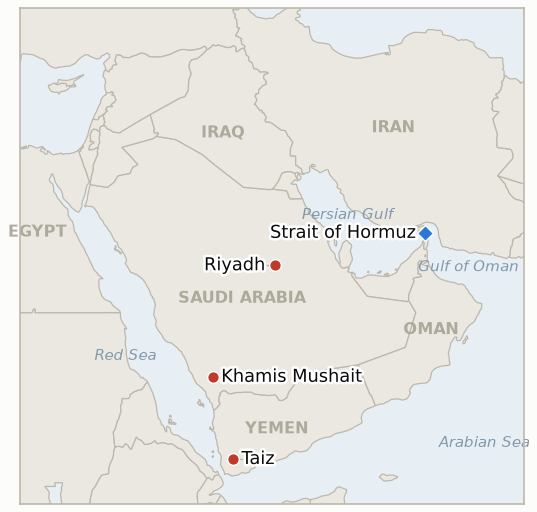

# Middle East Daily Briefing

**September 27, 2026**

- **Reporting window:** ~24 hours, September 26, 09:00 to September 27, 09:00 KST
- **Overall assessment:** The diplomatic track that briefly calmed markets on Friday breaks in the open on Saturday: Trump flatly rejects Iran's seven day Hormuz-for-blockade offer as a sign Tehran is "losing so badly," then posts a map relabeling the strait "Trump Strait," while Araghchi says the choice now sits with Washington and Pezeshkian tells Al Jazeera he still favors negotiation over force but does not trust the process (§1.1). That rejection resolves three ledger indicators at once, two of them confirming that Washington is actively engaging (if only to say no) rather than staying silent, one falsifying the narrower seven day offer as a real deadline Washington ever intended to honor. The Mecca pact's first chiefs of staff meeting, arranged a day earlier, delivers the coordination-only outcome this ledger has been tracking rather than a disclosed force commitment (§1.2), while Houthi attacks keep spreading geographically (Khamis Mushait joins the target list) rather than repeating on Riyadh, closing that indicator too (§1.3). Oil's confirmed Friday settle is a second, harder data point on a week that ends net calmer than it started despite Saturday's rhetoric (§1.4), and South Korea's markets and legislature stay closed into the weekend, one day from the deadline on Seoul's own Hormuz deployment question (§1.5). Five indicators resolve this window (two confirmed, three falsified); three new ones open on what comes after Trump's rejection, the Mecca pact's next step, and the Houthis' widening target set.

---

## 1. What Happened

<figure style="float:right; width:46%; margin:2pt 0 8pt 14pt;">

<figcaption style="font-size:8pt; color:#666; text-align:center; margin-top:3pt; font-style:italic;">Major places of discussion</figcaption>
</figure>

### 1.1 Trump rejects Iran's Hormuz offer, then posts a map renaming the strait

President Trump told reporters departing the White House for Tennessee on Saturday, "I'm rejecting their deal... that deal would not be acceptable," adding Iran wants a quick resolution because "they're losing so badly" and that his blockade is "the greatest blockade ever in military history," citing 29 vessels he said have recently transited the strait under US military escort ([CBS News](https://www.cbsnews.com/live-updates/iran-war-us-trump-strait-of-hormuz-7-day-proposal/); [NBC News](https://www.nbcnews.com/world/iran/iran-says-choice-reopening-hormuz-rests-united-states-offer-rcna599956)). Iran's proposal, detailed by Foreign Minister Abbas Araghchi on Friday, combined elements of both tracks this ledger has tracked separately, a US naval blockade lift, a sanctions waiver on Iranian oil sales, and a ceasefire including Lebanon, in exchange for reopening the strait and resuming nuclear talks within seven days, with reporting linking it to the collapsed June memorandum of understanding and Iran's separate Iran-Oman transit-route claim. Trump separately posted a map on Truth Social relabeling the Strait of Hormuz "Trump Strait," a rhetorical escalation following his earlier suggestions of declaring the waterway US territory ([The Star](https://www.thestar.com.my/aseanplus/aseanplus-news/2026/09/26/trump-publishes-map-of-hormuz-strait-calling-it-now-039trump-strait039); [Open magazine](https://openthemagazine.com/world/trump-renames-strait-of-hormuz-trump-strait-after-rejecting-irans-ceasefire-plan)). Araghchi responded that the decision now rests with Washington, and President Pezeshkian told Al Jazeera on Saturday that resolving Hormuz "is possible through negotiations, not the use of force," while cautioning Iran does not "trust" talks with the US (NBC News). The rejection meets the falsification bar for **IND-20260923-2** (the narrower seven day offer's own test: rejection is explicitly listed as falsifying, not confirming, a genuine actionable opening) while simultaneously confirming **IND-20260924-1** and **IND-20260925-1** (both indicators' bar is any disclosed US response, including explicit rejection, as evidence Washington is engaging with and treating the deadlines as consequential, distinct from silence). New indicator **IND-20260927-1** opens on what, if anything, follows the rejection. **Confidence: High** on Trump's own quotes and Iran's stated proposal, converging across CBS, NBC and multiple wire-syndicated outlets; **Medium** on the 29-vessel escort claim, a US-official assertion not independently corroborated by shipping-tracker data this window.

### 1.2 The Mecca pact's first chiefs of staff meeting reaffirms, but commits nothing concrete

Defense chiefs from Saudi Arabia, Turkey and Pakistan met in Riyadh as arranged a day earlier, reviewing threats facing the kingdom and reaffirming "commitment to collective defence and the immediate implementation" of the Mecca Joint Defence Agreement; the meeting's own communique described discussion of intelligence sharing, military coordination and "capability integration," concluding with the "necessity of immediately translating the provisions... into operational plans on the ground, including joint military exercises," and agreement to hold further periodic meetings ([Al Jazeera](https://www.aljazeera.com/video/newsfeed/2026/9/26/26-09-sv-saudi-turkiye-pakistan-chiefs-riy-ks); [Al Arabiya](https://english.alarabiya.net/News/saudi-arabia/2026/09/25/mecca-defense-alliance-holds-urgent-meeting-reaffirms-commitment-to-defend-saudi-arabia); [Gulf News](https://gulfnews.com/world/gulf/saudi/saudi-arabia-pakistan-and-turkey-reaffirm-joint-defence-pact-under-mecca-agreement-1.500688388); [Jerusalem Post](https://www.jpost.com/middle-east/article-909745)). That outcome, coordination and planning language rather than any disclosed force or asset commitment, meets **IND-20260926-2**'s own falsification bar for this first meeting; the pact's promised "periodic meetings" going forward are tracked by new **IND-20260927-2**. The meeting followed fresh Houthi attacks (§1.3) that the chiefs' own statement cited as the proximate trigger for convening early. **Confidence: High** on the meeting's occurrence and communique language, corroborated across four outlets; **Medium** on whether "operational plans" language reflects genuine momentum or standard alliance boilerplate, an interpretive read this ledger will keep testing.

### 1.3 Houthi attacks diversify further as GCC condemns a "grave escalation"

The Saudi-led coalition said it intercepted a ballistic missile fired toward the southwestern city of Khamis Mushait early Saturday, a target distinct from the established Riyadh, Yanbu and Taif axis, while separately intercepting two ballistic missiles and two drones and striking Taiz in response ([news4jax/AP](https://www.news4jax.com/news/world/2026/09/26/saudi-arabia-says-it-intercepts-another-houthi-launched-missile-and-other-mideast-developments/); [clickondetroit/AP](https://www.clickondetroit.com/news/world/2026/09/26/saudi-arabia-says-it-intercepts-another-houthi-launched-missile-and-other-mideast-developments/)). The Gulf Cooperation Council condemned the attacks as a "grave escalation and threat to regional security" and urged an international response. Fighting around Marib and Taiz continues at high tempo separately from the missile campaign; aid agencies cite at least 194 killed and 880 wounded over the prior two weeks across Taiz, the western coast, al-Jawf, Marib and Dhalea, with government forces reporting gains on the Al-Ayraf front near Marib. No further Riyadh-area incident was found this window, meeting **IND-20260920-1**'s falsification bar at its own deadline: the September 19 Riyadh strike attempt resolves as one-off signaling rather than a sustained capital-targeting shift, with Houthi attention instead diversifying to new secondary cities. New indicator **IND-20260927-3** opens to track whether that diversification continues to a third distinct city. **Confidence: High** on the intercepted missile, the GCC statement and the absence of a further Riyadh incident, wire-sourced and cross-outlet; **Medium** on the Marib casualty and front-line figures, aid-agency estimates that have diverged before in this conflict.

### 1.4 Oil's Friday settle confirms a calmer, though still elevated, week

Brent settled $104.30 (-2.14%) and WTI $92.41 (-2.33%) on Friday, the confirmed NY close superseding the 1215 GMT intraday read logged in the prior brief ([CNBC](https://www.cnbc.com/2026/09/24/oil-iran-crude-kepler-trump-us-un-.html); [The National](https://www.thenationalnews.com/business/energy/2026/09/25/oil-prices-waver-in-face-of-iran-war-truce-and-houthi-attacks/)). Brent still edges out a 0.43% weekly gain despite the retreat from Thursday's $108.23 intraday spike, while WTI is down nearly 8% on the week; the Brent-WTI spread widened to $12.68, the largest since May, which reporting continues to tie primarily to a potential US diesel export ban rather than Middle East supply risk directly. Saturday's US market close means Trump's rejection (§1.1) has not yet been priced; it lands as the first catalyst for Monday's reopen, alongside South Korea's own reopening (§1.5). **Confidence: High** on the settle levels and spread, sourced to CNBC and Reuters-wire outlets in agreement; **Medium** on the diesel-ban attribution, an interpretive read repeated across outlets rather than independently verified.

### 1.5 South Korea stays closed into the weekend, one day from its own Hormuz deadline

KOSPI and Seoul's FX market remained closed for a fourth consecutive non-trading day (the Chuseok holiday running into the weekend), with trading and the National Assembly both set to resume Monday, September 28. No formal National Assembly motion or floor vote on South Korea's Hormuz deployment package (naval support ship, P-8A patrol aircraft, roughly 150 personnel) was filed this window, leaving **IND-20260906-2** one day from its own September 28 deadline with the Assembly itself still on recess; the most recent confirmed government position remains Foreign Minister Cho Hyun's framing of a "substantive contribution" to Hormuz navigation without military deployment. **Confidence: High** on the market and legislative closure; the deployment package's exact composition rests on reporting that has not been updated since before the holiday, so treated as **Medium**.

---

## 2. Deep Dive: Incentives and Motives

### 2.1 Why did Trump reject Iran's offer now, even while claiming the strait already functions under escort?

Because accepting would mean trading a position Trump is actively describing as a US win, "the greatest blockade ever," 29 vessels supposedly moving under American protection, for a deal that concedes the blockade's premise and reopens Iran's own leverage over transit; rejecting costs Washington little in the retelling if oil supply is genuinely flowing regardless, while a public "no" also lets Trump frame Iran's offer as proof of weakness ("losing so badly") for a domestic and midterm-facing audience, rather than as a negotiating opener requiring a considered US counter.

### 2.2 Why did the Mecca pact's first chiefs of staff meeting produce reaffirmation rather than a concrete commitment?

Because the meeting had to satisfy two audiences that pull in different directions: a Saudi public and leadership wanting visible proof the pact is more than paper after fresh strikes reached a new city (§1.3), and Pakistani and Turkish militaries still constrained by their own Afghan-border, India and Syria commitments (as this ledger noted September 26); "operational plans" and further "periodic meetings" language lets all three governments claim the pact is moving without either partner actually exposing forces to a war whose trajectory neither fully controls.

### 2.3 Why are Houthi strikes diversifying to new cities rather than concentrating pressure on Riyadh?

Because a widening target set, Khamis Mushait now joining Riyadh, Yanbu and Taif, forces Saudi Arabia's air defense network to cover more ground simultaneously and demonstrates reach beyond the capital without requiring the harder, more provocative task of repeatedly penetrating Riyadh's own defenses; it is a lower-cost way to sustain the "no city is safe" signaling this campaign has relied on since its first capital strike attempt, while the harder test, actual damage to a high-value site like Yanbu's terminal, remains untriggered (**IND-20260925-3**).

---

## 3. Policy Implications for South Korea

**Exposure snapshot:** South Korea's crude imports remain roughly 70% dependent on Strait of Hormuz transit as of July 2026, though KNOC data for May to July 2026 shows the non-Middle East share of Korea's total crude mix has since risen to 51.5% (from 31.9% a year earlier) as diversification continues (`instructions/korea-exposure.md`, no update needed this window). Friday's confirmed settle: Brent $104.30 (-2.14%), WTI $92.41 (-2.33%); KOSPI and the won remain frozen at Wednesday's 7,080.92 and 1,358.4 through the extended closure.

**Implications by development:**

- **Trump's rejection of Iran's Hormuz offer (§1.1):** removes, for now, the nearest-term path to a negotiated reopening timeline Korean refiners and KNOC could plan around; the "strait already functions under escort" framing also suggests Washington sees no urgency to trade its current position, implying the status quo, and Korea's own workaround routing, persists longer than the truce hopes priced into Thursday and Friday's oil moves suggested.
- **The Mecca pact's coordination-only outcome and continued Houthi diversification (§1.2, §1.3):** neither resolves nor worsens the multilateral security picture this window, but the pact's own admission that forces are not yet committed, alongside a widening Houthi target list, argues against reading the alliance as an near-term substitute for the kind of contribution Washington has pressed Seoul on.
- **Oil's confirmed Friday settle (§1.4):** a marginally calmer read than Thursday's spike implied, but Saturday's rejection has not yet been priced into any settle; Monday's reopen, for oil markets and for KOSPI and the won alike, is a catalyst-heavy session worth flagging.
- **Korea's continued closure into IND-20260906-2's deadline (§1.5):** the Hormuz deployment question's own September 28 deadline now coincides exactly with the day markets, the Assembly and this ledger's own tracking all resume simultaneously, concentrating several separate threads into a single reopening day.

**Testable indicators:**

- **IND-20260920-1** (falsified at deadline): no further Riyadh-area Houthi incident occurred; the September 19 attempt resolves as one-off signaling. Falsified 2026-09-27.
- **IND-20260923-2** (falsified): Trump's explicit rejection of Iran's seven day offer falls squarely within this indicator's own falsification condition. Falsified 2026-09-27.
- **IND-20260924-1** (confirmed): the rejection is a disclosed US response engaging with the broader roadmap, meeting this indicator's engagement bar even though the response is negative. Confirmed 2026-09-27.
- **IND-20260925-1** (confirmed, ahead of its ~09-29 deadline): an explicit rejection is one of this indicator's own listed confirming conditions. Confirmed 2026-09-27.
- **IND-20260926-2** (falsified): the Mecca pact's first chiefs of staff meeting concluded with coordination and planning language only. Falsified 2026-09-27.
- **IND-20260927-1** (open, new): tracks whether Iran or the US takes any further disclosed step following the rejection. Open, deadline ~2026-10-11.
- **IND-20260927-2** (open, new): tracks whether the Mecca pact's promised further periodic meetings and joint exercises produce a disclosed concrete step. Open, deadline ~2026-10-24.
- **IND-20260927-3** (open, new): tracks whether Houthi strikes reach a third distinct Saudi city beyond the established target set. Open, deadline ~2026-10-11.
- **IND-20260906-2** (open, one day from deadline): no formal National Assembly motion filed this window; the Assembly remains on recess through the weekend. Open, deadline ~2026-09-28.
- **IND-20260925-3** (open): no further Houthi strike damaging Yanbu's loading infrastructure found this window. Open, deadline ~2026-10-15.
- **IND-20260926-1** (open): no further non-Gulf, non-US country has announced its own Saudi-protection deployment following France's. Open, deadline ~2026-10-17.
- **IND-20260926-3** (open): no further reported attack on the Taiz Aden Lahj corridor this window. Open, deadline ~2026-10-10.
- **IND-20260922-3** (open): Marib-area fighting continues without a documented siege or major territorial shift this window. Open, deadline ~2026-10-13.
- **IND-20260714-4** (open, no deadline): still no fresh weekly Qatari Ras Laffan loading figure, the ledger's longest-running unresolved indicator.

---

## 4. Watch List

- **What follows Trump's rejection (IND-20260927-1):** whether Iran responds with a further offer, a hardening of Rezaei's own conditions, or silence through the original ~09-29 deadline window.
- **The Mecca pact's next disclosed step (IND-20260927-2):** whether "joint military exercises" or "compatible defense systems" move from communique language to a scheduled, disclosed event.
- **Houthi target diversification (IND-20260927-3) and the Yemen fronts (IND-20260922-3, IND-20260926-3):** Marib and Taiz fighting continues at high tempo without a single decisive shift this window.
- **Iraq's request for a US sanctions exemption for Iranian airlines:** Baghdad is in direct talks with Washington to allow Iranian flights to resume on humanitarian grounds (medical treatment, education, pilgrimage), after this week's ban disrupted travel for an estimated 12,000 to 13,000 people, mostly through Najaf ([The National](https://www.thenationalnews.com/news/mena/2026/09/26/iraq-seeks-us-sanctions-exemption-for-iranian-flights/); [Al Jazeera](https://www.aljazeera.com/news/2026/9/26/iraq-seeks-us-exemption-from-ban-on-iranian-flights)).
- **A separate West Bank track:** wire reporting this window describes Israeli settlers diverting West Bank spring water and Israel backing heritage-site takeovers, part of a pattern UN OCHA says has damaged or seized roughly 160 water and sanitation structures in Palestinian communities in 2026 ([US News/AP](https://www.usnews.com/news/world/articles/2026-09-26/far-right-settlers-divert-west-bank-spring-water-as-israel-backs-heritage-site-takeovers)); tracked here as a distinct axis from the Hormuz/Gulf and Yemen tracks this ledger otherwise follows.
- **South Korea's Hormuz deployment review (IND-20260906-2):** resolves one way or another once the Assembly and markets reopen Monday, September 28.

---

## 5. Source Quality Summary

| Claim | Sources | Confidence |
|---|---|---|
| Trump's rejection of Iran's Hormuz offer and quoted remarks | CBS News, NBC News, Fox News | High |
| Iran's proposal terms and Araghchi/Pezeshkian responses | NBC News (Araghchi, Pezeshkian/Al Jazeera quotes) | High |
| "Trump Strait" Truth Social post | The Star, Open magazine | Medium (single-topic wire pickups) |
| Mecca pact chiefs of staff meeting and communique language | Al Jazeera, Al Arabiya, Gulf News, Jerusalem Post | High |
| Khamis Mushait interception, Taiz strike, GCC condemnation | news4jax/AP, clickondetroit/AP | High |
| Marib/Taiz casualty and front-line detail | Yemen Monitor, aid-agency figures cited in wire reporting | Medium (single-outlet or agency estimates that have diverged before) |
| Oil settle levels and spread | CNBC, The National (Reuters-sourced) | High |
| South Korea market and Assembly closure | Korea Herald, Korea JoongAng Daily (prior reporting, no update this window) | High |
| Iraq sanctions exemption request | The National, Al Jazeera | High |
| West Bank settler water diversion and heritage-site takeovers | AP (via US News, WTOP, Boston Globe) | High |
