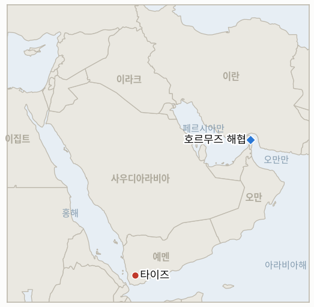

# 중동 일일 브리핑

**2026년 9월 28일**

- **보고 기간:** 약 24시간, 9월 27일 09:00 ~ 9월 28일 09:00 (한국시간)
- **종합 평가:** 결정적 사건 하나 없이도 작은 문들이 조용히 닫힌 하루였다. 이란은 입장을 진전시키기보다 재확인했다. 아라그치 장관은 트럼프의 공개 거부에도 불구하고 중재자를 통한 "최종" 답변을 여전히 기다린다고 말했고, 하타미 육군참모총장은 수사를 더 강경하게 다듬었으며, IRGC의 두 번째 미군 무인잠수정 나포 주장은 중부사령부의 단호한 부인을 낳았다(§1.1). 예멘 타이즈 축은 서로 다른 두 갈래로 격화돼, 시장에 대한 치명적 사우디 공습과 확대되는 정부군 지상 공세가 각각 자체 사상자 수치와 경고를 낳았다(§1.2). 원장 지표 두 개가 몇 시간 간격으로 시한에 도달해 기각으로 해소됐다. 9월 초부터 추적해온 한국의 호르무즈 파병 문제는 국회 표결 한 번 없이 마무리됐고(§1.3), 사우디 동서 송유관 공격의 배후를 둘러싼 다섯 달 묵은 주장도 미확인으로 닫혔다(§1.3, §3). 시장은 이번 보고 기간 내내 휴장해 유가·코스피·원화 모두 오래된 수치에 머물러 있으며, 한 주치 미반영 뉴스를 안은 채 월요일 재개장을 앞두고 있다(§1.4).

---

## 1. 무슨 일이 있었나

<figure style="float:right; width:46%; margin:2pt 0 8pt 14pt;">

<figcaption style="font-size:8pt; color:#666; text-align:center; margin-top:3pt; font-style:italic;">주요 논의 지점</figcaption>
</figure>

### 1.1 이란, 호르무즈 조건 재확인 속 무인잠수정 나포 공방까지 겹쳐

아바스 아라그치 외무장관은 이란이 여전히 "중재자들이 최종 입장을 전달해 주기를 기다리고 있으며, 그에 따라 결정을 내릴 것"이라고 말하며 "미국 대통령의 첫 반응은 봤지만, 공식 채널을 통해서는 아직 아무것도 전달받지 못했다"고 덧붙였다. 트럼프는 이미 토요일 기자들에게 이란의 7일 로드맵을 거부한다고 밝힌 바 있다([NBC뉴스](https://www.nbcnews.com/world/iran/iran-says-choice-reopening-hormuz-rests-united-states-offer-rcna599956)). 이란 육군참모총장 아미르 하타미는 별도로 기존 입장을 더 강경하게 다듬었다. "호르무즈 해협은 우리의 명예의 해협이며, 우리는 이 나라의 적들이 이 거대한 물류 병목을 이용하도록 두지 않을 것"이라며 봉쇄를 미국의 제재와 직접 연결짓고("이란이 거래하지 못하고 살지 못한다면, 그 누구도 거래하고 살 수 없다"), "이 지역의 안보는 미국과 시온주의 정권의 제거 없이는 이뤄지지 않을 것이며, 그날은 멀지 않았다"고 말했다([선데이가디언라이브](https://sundayguardianlive.com/world/us-israel-iran-war-latest-live-news-not-far-away-iran-army-chief-amir-hatami-says-us-removal-from-middle-east-is-near-warns-over-strait-of-hormuz-293920/)). 한편 이란 IRGC 해군은 "정보 감시와 전자전이 결합된 조율된 복합 작전"을 통해 해협에서 "첩보 목적"으로 활동하던 미군의 "첨단" 무인잠수정, 레무스 600을 나포했다고 밝혔다([아랍뉴스](https://www.arabnews.com/middle-east/iran-guards-say-seized-us-underwater-drone-in-hormuz-3003391)). 중부사령부(CENTCOM) 대변인 팀 호킨스 대위는 이 주장을 부인하며 미국이 "모든 작전용 드론 자산에 대한 완전한 통제"를 유지하고 있다고 말하고, 이란의 주장을 "명백히 자포자기적"이라고 일축했으며, 해당 기체는 "하루 이상 전에 고장 난" 구형 모델로 "민감한 데이터를 수집하지도, 기밀 소나·레이더 장비를 탑재하지도 않았다"고 반박했다([유로뉴스](https://www.euronews.com/2026/09/27/irans-revolutionary-guards-claim-seizure-of-second-us-underwater-drone-in-strait-of-hormuz)). 이는 최근 며칠 사이 이란이 주장한 두 번째 무인잠수정 나포로, 앞서 이번 주 초 다이브-LD로 알려진 기종의 나포 주장에는 워싱턴이 아직 공개 대응하지 않은 상태였다. 이번 재확인과 드론 공방 모두 트럼프의 거부에 대응한 새로운 제안, 강경화된 조건, 또는 맞제안이라는 **IND-20260927-1**의 확인 기준에는 미치지 못해 해당 지표는 계속 열려 있으며, 양측 주장 중 어느 쪽이든 독립적으로 검증되는지를 추적하는 새 지표 **IND-20260928-3**이 열린다. **신뢰도: 높음** (발언 자체는 각각 실명 인용되고 매체 간 교차 확인됨); 드론 사건 자체의 사실관계는 독립 확인이 없는 주장 대 부인 상황이라 **낮음**.

### 1.2 예멘 타이즈 축, 두 전선에서 동시에 격화

사우디 전투기가 일요일 정오 무렵 타이즈시 외곽 마위야 시장을 두 차례 타격해 최소 7명이 숨지고 어린이를 포함해 약 40명이 다쳤다고 안사르 알라(후티) 관계자와 예멘 보건 당국이 밝혔다. 후티 군 대변인 야히아 사리는 이 공습이 사우디 F-15 전투기가 카미스 무샤이트 공군기지에서 출격해 지난 24시간 동안 타이즈·알자우프·마리브·다마르·사다 5개 주를 대상으로 벌인 26회 공습의 일부라고 말하며, 시장 공습이 "중대한 결과를 부를 것"이라고 경고했다([CP24](https://www.cp24.com/news/world/2026/09/27/houthis-say-saudi-strikes-on-yemens-taiz-leave-dozens-of-casualties/); [예루살렘포스트](https://www.jpost.com/middle-east/article-909875)). 같은 주(州)의 다른 전선에서는 예멘 정부군이 24시간 동안 타이즈 내 후티 거점 5곳을 겨냥한 공중·지상 작전을 수행했다고 밝혔다. 알와지야 지구 공습, 마프라크 마위야·알두크라 무기고 타격, 하이판 지구 집결지, 구랍 인근 차량 등이며, "수십 명"의 후티 전투원과 현장 지휘관이 사살되거나 부상했다고 주장했으나 알자지라는 이를 독립적으로 확인하지 못했다고 밝혔다. 정부군 대변인 마제드 알나질리 준장은 별도로 후티의 무기가 "국제 항공로에 심각한 위협"이 된다고 말했다([알자지라](https://www.aljazeera.com/news/2026/9/27/yemen-government-forces-widen-attacks-against-houthis-what-we-know)). 유니세프 예멘 대표 아킬 아이어는 이번 분쟁으로 지난 3주간 14만6천 명이 피란했고 9월 초 이후 어린이 15명이 숨지고 14명이 다친 것으로 확인됐다고 밝혔다. 마위야 공습과 사리의 경고로 새 지표 **IND-20260928-1**이 열려 2주 안에 별도의 보복 공격이 뒤따르는지를 추적하며, 타이즈 전반의 활동은 **IND-20260926-3**(타이즈-아덴-라지 회랑 지표)을 지속적 교전이라는 기준 쪽으로 움직이게 하지만 아직 그 기준을 충족하지는 않는다. **신뢰도: 높음** (마위야 공습과 유니세프 수치는 복수 기관·매체 교차 확인); 정부군이 주장한 후티 측 사상자 수치는 알자지라가 미확인이라고 명시한 일방 군 매체 주장이라 **중간**.

### 1.3 원장 지표 두 건, 시한 도달해 기각으로 해소

한국의 자체 호르무즈 파병 문제는 지난 9월 6일부터 이 원장이 추적해온 사안으로, 정부가 P-8A 해상초계기와 병력 약 150명을 공식 통보한 이후 9월 28일 시한에 도달했으나 국회 동의안 제출이나 본회의 표결이 없었다. 국회와 한국거래소는 이번 보고 기간이 끝난 뒤에야 재개되며, 국내 보도는 여전히 정부의 검토 과정이 마무리되지 않고 연장되고 있다고 전하는데, 박윤주 외교부 제1차관의 "사회적 합의" 발언이 가장 최근의 공식 입장으로 남아 있다([코리아헤럴드](https://www.koreaherald.com/article/10869367)). 이로써 **IND-20260906-2**는 자체 시한에 **기각**으로 해소된다. 동의안이나 표결 없이 내부 이견이 계속되는 상황은 이 지표가 애초에 정의한 기각 조건 그대로다. 별도로 다섯 달 묵은 주장 하나도 마침내 마무리됐다. 트럼프 대통령이 9월 중순 사우디 동서 송유관을 마비시킨 드론 공격의 배후로 이란이 "아마도" 관여했다고 주장했으나, 사우디나 미국 당국의 공식 확인은 끝내 나오지 않았고, 배후는 대신 이라크 내 친이란 민병대 쪽으로 귀결됐으며 이라크 정부는 이를 공개적으로 수습해 왔다. 이란 외무부 대변인 에스마일 바카에이는 이란의 개입을 명시적으로 부인했다([CNN](https://www.cnn.com/2026/09/12/middleeast/trump-iran-saudi-pipeline-intl); [PBS뉴스](https://www.pbs.org/newshour/world/attack-on-key-saudi-pipeline-is-blamed-on-iran-backed-militias-in-iraq)). **IND-20260913-1**은 자체 시한을 하루 넘겨 **기각**으로 해소되며, 공식 배후 지목이 아니라 근거 없는 여담으로 마무리됐다. 새 지표 **IND-20260928-2**가 열려, 첫 시한이 지난 지금 한국의 파병 문제가 3주 안에 추가로 공개될 조치를 내놓는지 추적한다. **신뢰도: 높음** (두 해소 모두 이 원장이 수 주에 걸쳐 직접 추적해 확인 조건의 지속적 부재를 근거로 함).

### 1.4 시장은 이번 보고 기간 내내 휴장, 미반영 뉴스만 쌓여

브렌트유와 WTI의 가장 최근 확정 마감가는 여전히 금요일의 104.30달러와 92.41달러이며, 코스피와 원화는 수요일 종가인 7,080.92와 1,358.4에 그대로 머물러 있다. 미국 유가 선물시장과 한국 거래소·외환시장 모두 이번 보고 기간이 끝난 뒤에야 재개돼, 토요일 트럼프의 거부나 오늘 하타미의 발언과 드론 공방, 타이즈 확전(§1.1, §1.2) 중 어느 것도 아직 어떤 가격에도 반영되지 않았다. 이번 보고 기간 독립적으로 날짜가 확인된 새로운 호르무즈 통항 수치는 발견되지 않았으며, 가장 신뢰할 수 있는 최근 수치는 여전히 윈드워드(Windward)의 9월 23일 집계인 11척이다. **신뢰도: 높음** (휴장과 구舊 가격 자체에 대해); 새로운 자료의 부재 자체는 해당 없음.

---

## 2. 심층 분석: 동기와 유인

### 2.1 이란은 왜 외교적 맞제안 대신 군과 IRGC 채널을 통해 입장을 계속 재확인하나?

트럼프의 공개 거부 직후 곧바로 맞제안을 내놓는 것은 하타미 자신의 발언("명예의 해협")이 겨냥하는 국내 대중에게 굴복으로 비칠 수 있는 반면, 무인잠수정 나포 주장은 워싱턴이 같은 48시간 동안 해협에 대한 "완전한 통제"를 공개적으로 자랑하던 상황에서 미국에 일방적인 정보 우위를 내주지 않으면서도 계속되는 군사적 주도권을 낮은 비용으로 과시하는 방법이기 때문이다. 아라그치를 통한 조건 재확인은 테헤란이 먼저 구체적으로 움직이지 않고도 외교적 문을 형식상 열어 두게 해준다.

### 2.2 사우디아라비아와 예멘 정부는 왜 트럼프의 거부로 호르무즈 맞교환의 단기적 여지가 사라진 바로 그날 타이즈 작전을 오히려 강화했나?

타이즈 전선은 호르무즈 외교 트랙과는 거의 무관한 자체 군사 논리로 움직이기 때문이다. 목표 도시를 계속 다변화하는 후티 세력(카미스 무샤이트, IND-20260927-3이 추적)에 맞서 작전 성과를 보여줘야 한다는 압박을 받는 사우디 연합군과 예멘 정부군 모두, 워싱턴과 테헤란 사이에 무슨 일이 벌어지든 그보다 앞서 시작됐고 그 이후에도 계속될 지상·공중 작전을 멈출 유인이 거의 없다.

### 2.3 한국은 왜 자체 9월 28일 시한을 표결 없이 그냥 넘겼나?

본회의 표결은 어느 방향이든 실제 정치적 비용을 수반하기 때문이다. 여권이 "찬성"으로 갈 경우 이미 나타난 더불어민주당·진보 진영 의원들의 이탈이 심화될 위험이 있고, "반대" 또는 표결 무산은 워싱턴과의 추가 마찰 위험이 있다. 어느 정부도 지연 자체를 결과로 취급하지 않는 한, 표결을 강제하기보다 검토를 시한 이후로 연장하는 쪽이 서울로서는 두 비용을 동시에 피할 수 있는 선택이다.

---

## 3. 한국에 대한 정책적 함의

**노출도 스냅샷:** 2026년 7월 기준 한국 원유 수입의 약 70%가 호르무즈 해협 통항에 의존하고 있으나, 5~7월 한국석유공사(KNOC) 자료에 따르면 한국 원유 수입 구성 중 비중동산 비중이 1년 전 31.9%에서 51.5%로 상승했다(`instructions/korea-exposure.md`, 이번 보고 기간 갱신 없음). 시장은 이번 보고 기간 내내 휴장했다. 브렌트유·WTI의 최근 확정 마감가는 금요일의 104.30달러/92.41달러, 코스피와 원화는 수요일 종가인 7,080.92/1,358.4에 그대로 머물러 있다.

**사안별 함의:**

- **이란의 강경 수사와 드론 공방(§1.1):** 한국 정유업계가 계획을 세울 수 있는 단기 재개방 전망을 개선하지도 더 악화시키지도 않는다. 하타미가 봉쇄를 제재 완화와 명시적으로 연결한 것은 테헤란의 조건이 실질적으로 바뀌지 않았음을 확인해 주며, 한국의 우회 노선과 높아진 운임 부담은 더 뚜렷한 종료 시점 없이 지속된다.
- **예멘 타이즈 두 전선 확전(§1.2):** 호르무즈 문제가 설사 돌파구를 찾더라도 이 원장이 별도로 추적하는 홍해·바브엘만데브 위험이 곧바로 해소되지는 않는다는 점을 상기시킨다. 한국 선사·용선 항로 모두에 두 항로가 함께 중요하다.
- **한국 자체 파병 시한 도래(§1.3):** 이 원장이 추적해온 강제력이 일단 사라졌다. 새로 열린 IND-20260928-2가 추적하는 추가 공개 조치가 없다면, 서울의 입장은 9월 초 이후 이어온 것과 같은 무기한 검토로 되돌아가, 계획 담당자들의 불확실성을 해소하기보다 연장하게 된다.
- **송유관 배후 주장의 조용한 종결(§1.3):** 이 전쟁의 모든 고위급 발언이 공식 결론으로 이어지지는 않는다는 점을 보여준다. 이란-송유관 연관성을 이미 반영한 한국 측 위험 평가가 있다면 이를 미확인으로 재분류해야 한다.
- **얼어붙은 시장(§1.4):** 월요일 재개장은 유가 선물과 코스피·외환시장 모두에 한 주치 미반영 촉매를 한 세션에 집중시켜, 그 자체로 하나의 데이터 포인트라기보다 변동성 위험으로 주목할 필요가 있다.

**검증 가능한 지표:**

- **IND-20260906-2** (시한 도래 기각): 9월 28일까지 한국의 호르무즈 파병에 대한 국회 동의안이나 본회의 표결 없음. 2026-09-28 기각.
- **IND-20260913-1** (기각): 9월 10~11일 송유관 공격의 배후가 이라크 내 민병대로 귀결돼 트럼프의 "아마도 이란" 주장이 끝내 사우디·미국 공식 확인을 얻지 못함. 2026-09-28 기각.
- **IND-20260928-1** (신규, 열림): 마위야 시장 공습에 대한 보복으로 명시된 후티 공격이 뒤따르는지 추적. 시한 2026-10-12.
- **IND-20260928-2** (신규, 열림): 첫 시한이 지난 뒤 한국의 파병 문제가 추가로 공개될 조치를 내놓는지 추적. 시한 2026-10-19.
- **IND-20260928-3** (신규, 열림): 이란 또는 CENTCOM 어느 쪽 주장이든 독립적으로 검증되는지 추적. 시한 2026-10-12.
- **IND-20260927-1** (열림): 이란이 새로운 제안이나 맞제안 대신 아라그치·하타미를 통해 기존 조건을 재확인. 시한 2026-10-11.
- **IND-20260926-3** (열림, 확인 쪽으로 이동 중): 이번 보고 기간 타이즈 일대 추가 활동이 있었으나 아직 지속적 다일간 교전 기준에는 미달. 시한 2026-10-10.
- **IND-20260927-3** (열림): 이번 보고 기간 세 번째 사우디 도시에 대한 추가 후티 공격 없음. 시한 2026-10-11.
- **IND-20260927-2** (열림): 메카 협정이 약속한 향후 정기 회의가 아직 구체적 조치를 내놓지 않음. 시한 2026-10-24.
- **IND-20260925-3** (열림): 이번 보고 기간 얀부 시설에 대한 추가 피해 확인 없음. 시한 2026-10-15.
- **IND-20260926-1** (열림): 프랑스에 이어 다른 비걸프·비미국 국가의 파병 발표 없음. 시한 2026-10-17.
- **IND-20260922-3** (열림): 이번 보고 기간 마리브 일대 전투가 포위나 주요 영토 변화 없이 지속. 시한 2026-10-13.
- **IND-20260714-4** (열림, 시한 없음): 카타르 라스라판 주간 선적 수치는 여전히 확인되지 않은, 원장에서 가장 오래 열려 있는 지표.

---

## 4. 주시 목록

- **야히아 사리의 "중대한 결과" 경고가 실제 공격으로 이어지는지(IND-20260928-1).**
- **첫 시한이 지난 뒤 한국의 호르무즈 파병 문제에 추가 공개 조치가 있는지(IND-20260928-2).**
- **레무스 600 나포 또는 CENTCOM의 고장 설명 중 어느 쪽이든 독립적으로 검증되는지(IND-20260928-3).**
- **타이즈-아덴-라지 회랑(IND-20260926-3)과 마리브(IND-20260922-3)의 궤적:** 두 전선 모두 활동이 늘고 있으나 이 원장의 지속적 교전 또는 주요 영토 변화 기준에는 아직 미달.
- **이라크의 이란 항공사 대상 미국 제재 예외 요청:** 이번 보고 기간에도 여전히 미해결로, 나자프행 성지순례·의료·유학 목적 이동에 계속 차질을 빚고 있다.
- **메카 협정의 다음 공개 조치(IND-20260927-2):** "정기 회의" 문구가 예정된 합동훈련이나 공개된 공약으로 이어질지.
- **월요일 시장 재개장:** 호르무즈·예멘·한국 관련 한 주치 미반영 뉴스가 유가·코스피·원화 모두에 한 세션으로 집중된다.

---

## 5. 출처 신뢰도 요약

| 주장 | 출처 | 신뢰도 |
|---|---|---|
| 아라그치의 "중재자 대기" 발언 | NBC뉴스 | 높음 |
| 아미르 하타미의 호르무즈·제재·미군 철수 관련 발언 | 선데이가디언라이브 | 높음 (직접 인용, 단일 원문 보도) |
| IRGC의 레무스 600 나포 주장 | 아랍뉴스, 유로뉴스 | 주장 존재 자체는 높음; 사실관계는 검증 불가 |
| CENTCOM/팀 호킨스 대위의 부인 및 고장 설명 | 유로뉴스 | 발언 자체는 높음; 사실관계는 검증 불가 |
| 마위야 시장 공습 및 후티 측 사상자 수치 | CP24, 예루살렘포스트 | 높음 (안사르 알라·보건 당국 출처, 매체 교차 확인) |
| 예멘 정부군의 타이즈 공세 및 유니세프 피란·사상자 수치 | 알자지라 (유니세프 아킬 아이어 인용) | 유니세프 수치는 높음; 정부군 자체 주장 사상자 수치는 중간 (알자지라 미확인 명시) |
| 한국의 호르무즈 파병 절차 현황 | 코리아헤럴드 | 높음 |
| 송유관 공격 배후의 이라크 민병대 귀결 | CNN, PBS뉴스 | 높음 |

---
