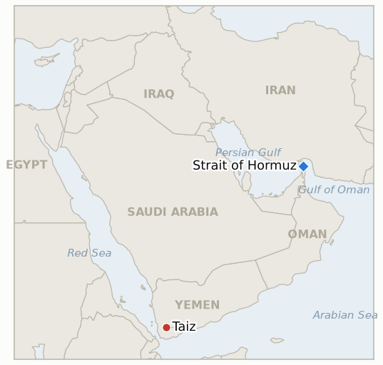

# Middle East Daily Briefing

**September 28, 2026**

- **Reporting window:** ~24 hours, September 27, 09:00 to September 28, 09:00 KST
- **Overall assessment:** A day with no single decisive event but several small doors quietly closing. Iran restates its position rather than advancing it: Araghchi says Tehran still awaits a "definitive" answer through mediators despite Trump's public rejection, while Army chief Amir Hatami hardens the rhetoric and the IRGC's claimed capture of a second US underwater drone draws a blunt CENTCOM denial (§1.1). Yemen's Taiz axis intensifies on two separate tracks, a lethal Saudi strike on a market and a widening government ground offensive, each producing its own casualty count and its own warning (§1.2). Two ledger indicators reach their deadlines and resolve falsified within hours of each other: South Korea's own Hormuz deployment question, tracked since early September, closes without ever reaching a National Assembly vote (§1.3), and a five month old claim about who attacked Saudi Arabia's East-West pipeline closes unsubstantiated (§1.3, §3). Markets stay shut through the whole window, oil, KOSPI and the won all sitting on stale prints as Monday's reopening approaches with a full week of unpriced news waiting (§1.4).

---

## 1. What Happened

<figure style="float:right; width:46%; margin:2pt 0 8pt 14pt;">

<figcaption style="font-size:8pt; color:#666; text-align:center; margin-top:3pt; font-style:italic;">Major places of discussion</figcaption>
</figure>

### 1.1 Iran restates its Hormuz conditions as a drone dispute adds friction

Foreign Minister Abbas Araghchi said Tehran is still "waiting for the mediators to convey the definitive views to us and we will make a decision based on that," adding "we saw the first reaction from the President of America, but nothing has yet been conveyed to us from the mediators" through official channels, even as Trump had already told reporters Saturday he was rejecting Iran's seven day roadmap outright ([NBC News](https://www.nbcnews.com/world/iran/iran-says-choice-reopening-hormuz-rests-united-states-offer-rcna599956)). Iran's Army Commander in Chief, Amir Hatami, separately hardened the underlying position: "The Strait of Hormuz is the strait of our honour, and we will not allow the enemies of the country to use this great logistical bottleneck," linking the closure directly to US sanctions ("if Iran can't do business and if Iran can't live, no one can trade and live") and adding that "security in the region will not happen except with the removal of the United States and the Zionist regime, and this is not far away" ([Sunday Guardian Live](https://sundayguardianlive.com/world/us-israel-iran-war-latest-live-news-not-far-away-iran-army-chief-amir-hatami-says-us-removal-from-middle-east-is-near-warns-over-strait-of-hormuz-293920/)). Separately, Iran's IRGC Navy said it had "through a coordinated, complex operation involving intelligence oversight and electronic warfare" captured an "advanced" US unmanned underwater vehicle, a Remus 600, operating in the strait "for espionage purposes" ([Arab News](https://www.arabnews.com/middle-east/iran-guards-say-seized-us-underwater-drone-in-hormuz-3003391)). CENTCOM spokesman Capt. Tim Hawkins rejected the claim, saying the US retains "positive control of all of our operational drone assets," calling the Iranian claim "clearly desperate," and countering that the vehicle was an older model that had "malfunctioned more than a day ago" and "neither collected sensitive data nor carried any classified sonar or radar equipment" ([Euronews](https://www.euronews.com/2026/09/27/irans-revolutionary-guards-claim-seizure-of-second-us-underwater-drone-in-strait-of-hormuz)). It is Iran's second claimed underwater-drone capture within days, after an undisclosed-model Dive-LD claim earlier in the week that Washington had not yet publicly addressed. None of this meets **IND-20260927-1**'s bar of a further disclosed offer, hardened condition, or counteroffer specifically responding to Trump's rejection, restated positions and a drone dispute are not a new step, so that indicator stays open; new **IND-20260928-3** opens to track whether independent sources ever corroborate either the capture or the malfunction account. **Confidence: High** on the quotes themselves, each sourced to a named official and corroborated across outlets; **Low** on either side's factual claim about the drone incident itself, an unverified assertion-versus-denial with no independent confirmation.

### 1.2 Yemen's Taiz axis escalates on two fronts at once

Saudi warplanes struck the Mawiyah market on Taiz city's outskirts twice around midday Sunday, killing at least 7 and wounding about 40 people, including children, according to Ansar Allah officials and Yemeni health reports; Houthi military spokesman Yahya Saree said the strikes were part of 26 airstrikes Saudi F-15s flew from Khamis Mushait air base across Taiz, Al-Jawf, Marib, Dhamar and Saada provinces in the prior 24 hours, and warned the market strike "will have severe consequences" ([CP24](https://www.cp24.com/news/world/2026/09/27/houthis-say-saudi-strikes-on-yemens-taiz-leave-dozens-of-casualties/); [Jerusalem Post](https://www.jpost.com/middle-east/article-909875)). Separately, and on the other side of the same province's fighting, Yemeni government forces said they conducted air and ground operations against five Houthi positions in Taiz within 24 hours, air raids in Al-Waziiya district, weapons sites at Mafraq Mawiya and al-Dhukrah, a gathering in Hayfan district, and military vehicles near Gurab, claiming "dozens" of Houthi fighters and field commanders killed or wounded, a figure Al Jazeera could not independently verify; government spokesman Brig. Gen. Majed al-Nazili separately said Houthi weapons "pose a serious threat to international flight paths" ([Al Jazeera](https://www.aljazeera.com/news/2026/9/27/yemen-government-forces-widen-attacks-against-houthis-what-we-know)). UNICEF's Yemen representative, Akhil Iyer, said the wider conflict has displaced 146,000 people over the past three weeks and verified 15 children killed and 14 injured since early September. The Mawiyah strike and Saree's warning open new **IND-20260928-1**, testing whether a distinct retaliatory strike follows within two weeks; the broader Taiz activity updates **IND-20260926-3** (the Taiz-Aden-Lahj corridor indicator), trending toward but not yet meeting its sustained-engagement bar. **Confidence: High** on the Mawiyah strike and the UNICEF figures, cross-sourced and agency-verified; **Medium** on the government offensive's own claimed Houthi casualties, a single-side military-media claim Al Jazeera flagged as unverified.

### 1.3 Two ledger indicators reach their deadlines and resolve falsified

South Korea's own Hormuz deployment question, tracked on this ledger since September 6 through a formal government notification of a P-8A patrol aircraft and roughly 150 personnel, reached its September 28 deadline with no National Assembly motion filed and no floor vote held; the National Assembly and Korea Exchange remain closed through this window's close, reopening only afterward, and Korean reporting continues to describe the government's process as extended rather than concluded, with First Vice Foreign Minister Park Yoon-joo's "social consensus" framing still the most recent on-record government position ([Korea Herald](https://www.koreaherald.com/article/10869367)). That leaves **IND-20260906-2** resolved **falsified** at its own deadline: continued internal coalition debate without a motion or vote, precisely the falsification condition it was defined against. Separately, a five month old claim finally closes: President Trump's mid-September assertion that Iran was "probably" behind the drone attack that shut Saudi Arabia's East-West pipeline on September 10-11 never gained Saudi or US official corroboration; attribution instead settled on Iran-backed militias operating from Iraqi soil, which Iraq's government has publicly worked to contain, while Iran's foreign ministry spokesman Esmaeil Baqaei explicitly denied any Iranian role ([CNN](https://www.cnn.com/2026/09/12/middleeast/trump-iran-saudi-pipeline-intl); [PBS News](https://www.pbs.org/newshour/world/attack-on-key-saudi-pipeline-is-blamed-on-iran-backed-militias-in-iraq)). **IND-20260913-1** resolves **falsified**, one day past its own deadline, as an unsubstantiated aside rather than an official attribution. New **IND-20260928-2** opens to track whether Seoul's deployment question produces any further disclosed step within three weeks now that its first deadline has passed. **Confidence: High** on both resolutions, each resting on a sustained absence of the confirming condition documented across this ledger's own multi-week tracking.

### 1.4 Markets stay shut through the whole window, unpriced news stacking up for Monday

Brent and WTI's most recent confirmed settle remains Friday's $104.30 and $92.41; KOSPI and the won remain frozen at Wednesday's 7,080.92 and 1,358.4. Both the US oil futures market and Korea's KRX and FX markets reopen only after this reporting window closes, so none of Saturday's Trump rejection, today's Hatami remarks and drone dispute, or the Taiz escalation (§1.1, §1.2) has been priced anywhere yet. No independently dated Hormuz transit count was found this window; the most recent reliable figure remains Windward's September 23 count of 11 vessels. **Confidence: High** on the closure and stale-price facts themselves; not applicable to the absence of new data.

---

## 2. Deep Dive: Incentives and Motives

### 2.1 Why does Iran keep restating its position through military and IRGC channels rather than a diplomatic counteroffer?

Because a direct counteroffer this soon after Trump's public rejection would look like capitulation to a domestic audience Hatami's own remarks are aimed at ("the strait of our honour"), while a claimed drone capture is a low-cost way to project continued military initiative and deny Washington an uncontested information advantage in the same 48 hours the US was publicly gloating about "total control" of the strait; restating conditions through Araghchi keeps the diplomatic door technically open without Tehran having to make the first concrete move.

### 2.2 Why did Saudi Arabia and the Yemeni government intensify Taiz operations on the same day rather than easing after Trump's rejection eliminated any near term Hormuz-for-blockade tradeoff?

Because the Taiz front runs on its own military logic largely independent of the Hormuz diplomatic track, a Saudi coalition and Yemeni government both under pressure to show operational momentum against a Houthi movement that keeps diversifying its own target set (Khamis Mushait, tracked by IND-20260927-3) have little incentive to pause a ground and air campaign that predates and will likely outlast whatever happens between Washington and Tehran.

### 2.3 Why did South Korea let its own September 28 deadline pass without forcing a vote either way?

Because a floor vote carries real political cost in either direction, for the ruling coalition, a "yes" vote risks the visible defections already seen from Democratic Party and progressive lawmakers, while a "no" vote or continued non-vote risks further friction with Washington; extending the review past the deadline, rather than forcing a decision, lets Seoul avoid both costs simultaneously for as long as neither government treats the delay itself as consequential.

---

## 3. Policy Implications for South Korea

**Exposure snapshot:** South Korea's crude imports remain roughly 70% dependent on Strait of Hormuz transit as of July 2026, though KNOC data for May to July 2026 shows the non-Middle East share of Korea's total crude mix has since risen to 51.5% (from 31.9% a year earlier) as diversification continues (`instructions/korea-exposure.md`, no update needed this window). Markets remain closed through this window: Brent/WTI's last confirmed settle stays Friday's $104.30/$92.41; KOSPI and the won stay frozen at Wednesday's 7,080.92/1,358.4.

**Implications by development:**

- **Iran's hardened rhetoric and the drone dispute (§1.1):** neither improves nor further damages the near-term reopening outlook Korean refiners might plan around; Hatami's explicit linkage of the closure to sanctions relief confirms Tehran's conditions remain unchanged in substance, so Korea's own workaround routing and elevated freight costs persist without a clearer end date.
- **Yemen's two-track Taiz escalation (§1.2):** a reminder that even a Hormuz breakthrough would not immediately resolve the Red Sea and Bab el-Mandeb risk this ledger tracks separately, both routes matter for Korean-flagged and Korean-chartered shipping alternatives.
- **South Korea's own deployment deadline lapsing (§1.3):** removes, for now, the forcing function this ledger had been tracking toward; without a fresh disclosed step (tracked by new IND-20260928-2), Seoul's posture reverts to the same open-ended review it has held since early September, extending uncertainty for planners rather than resolving it either way.
- **The pipeline-attribution claim's quiet close (§1.3):** a reminder that not every high-profile presidential claim this war converts into an official finding; Korean risk assessments that had priced in a confirmed Iran-pipeline link should treat that link as unconfirmed.
- **The frozen market window (§1.4):** Monday's reopening for both oil futures and KOSPI/FX concentrates a full week of unpriced catalysts into a single session, worth flagging as a volatility risk rather than a data point in itself.

**Testable indicators:**

- **IND-20260906-2** (falsified at deadline): no National Assembly motion or floor vote on Korea's Hormuz deployment by September 28. Falsified 2026-09-28.
- **IND-20260913-1** (falsified): the Sept 10-11 pipeline attack's attribution lands on Iraq-based militias, never gaining Saudi or US official corroboration of Trump's "probably Iran" claim. Falsified 2026-09-28.
- **IND-20260928-1** (open, new): tracks whether a disclosed Houthi strike follows as retaliation for the Mawiyah market strike. Open, deadline ~2026-10-12.
- **IND-20260928-2** (open, new): tracks whether Korea's deployment question produces any further disclosed step now that its first deadline has passed. Open, deadline ~2026-10-19.
- **IND-20260928-3** (open, new): tracks whether independent sources corroborate either Iran's or CENTCOM's account of the drone incident. Open, deadline ~2026-10-12.
- **IND-20260927-1** (open): Iran restates conditions through Araghchi and Hatami rather than disclosing a new offer or counteroffer this window. Open, deadline ~2026-10-11.
- **IND-20260926-3** (open, trending toward confirm): further Taiz-area activity this window, not yet a confirmed sustained multi-day engagement. Open, deadline ~2026-10-10.
- **IND-20260927-3** (open): no further Houthi strike on a third distinct Saudi city found this window. Open, deadline ~2026-10-11.
- **IND-20260927-2** (open): the Mecca pact's promised further periodic meetings have not yet produced a disclosed concrete step. Open, deadline ~2026-10-24.
- **IND-20260925-3** (open): no further Houthi strike damaging Yanbu's loading infrastructure found this window. Open, deadline ~2026-10-15.
- **IND-20260926-1** (open): no further non-Gulf, non-US country has announced its own Saudi-protection deployment following France's. Open, deadline ~2026-10-17.
- **IND-20260922-3** (open): Marib-area fighting continues without a documented siege or major territorial shift confirmed this window. Open, deadline ~2026-10-13.
- **IND-20260714-4** (open, no deadline): still no fresh weekly Qatari Ras Laffan loading figure, the ledger's longest-running unresolved indicator.

---

## 4. Watch List

- **Whether Yahya Saree's "severe consequences" warning is followed by a disclosed strike (IND-20260928-1).**
- **South Korea's next disclosed step, if any, on Hormuz deployment now that its first deadline has passed (IND-20260928-2).**
- **Independent corroboration of the Remus 600 capture or CENTCOM's malfunction account (IND-20260928-3).**
- **The Taiz-Aden-Lahj corridor's trajectory (IND-20260926-3) alongside Marib (IND-20260922-3):** both fronts show rising activity without either the ledger's own sustained-engagement or major-shift bar being met yet.
- **Iraq's Iranian-flights sanctions exemption request:** still unresolved as of this window, continuing to disrupt Najaf-bound pilgrim, medical and student travel.
- **The Mecca pact's next disclosed step (IND-20260927-2):** whether "periodic meetings" language converts into a scheduled joint exercise or disclosed commitment.
- **Monday's market reopening:** a full week of unpriced Hormuz, Yemen and Korea developments lands in a single session for oil, KOSPI and the won alike.

---

## 5. Source Quality Summary

| Claim | Sources | Confidence |
|---|---|---|
| Araghchi's "awaiting mediators" quotes | NBC News | High |
| Amir Hatami's quotes on Hormuz, sanctions and US removal | Sunday Guardian Live | High (direct quotes, single primary write-up) |
| IRGC's Remus 600 capture claim | Arab News, Euronews | High on the claim's existence; unverifiable on its factual accuracy |
| CENTCOM/Capt. Tim Hawkins denial and malfunction account | Euronews | High on the statement; unverifiable on its factual accuracy |
| Mawiyah market strike and Houthi casualty figures | CP24, Jerusalem Post | High (Ansar Allah/health-ministry sourced, cross-outlet) |
| Yemeni government's Taiz offensive and UNICEF displacement/casualty figures | Al Jazeera (UNICEF's Akhil Iyer cited) | High on UNICEF figures; Medium on government's own claimed Houthi casualties (unverified by Al Jazeera) |
| South Korea's Hormuz deployment process status | Korea Herald | High |
| Pipeline attack attribution to Iraq-based militias | CNN, PBS News | High |

---
