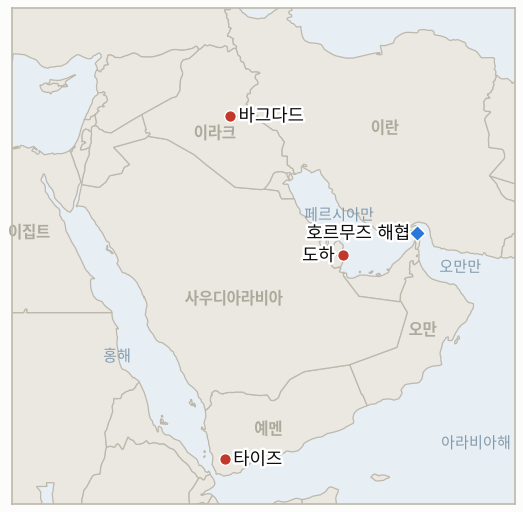

# 중동 일일 브리핑

**2026년 9월 29일**

- **보고 기간:** 약 24시간, 9월 28일 09:00 ~ 9월 29일 09:00 (한국시간)
- **종합 평가:** 시장이 다시 열리며 트럼프의 토요일 이란 호르무즈 계획 거부가 가격에 반영됐지만 외교가 끝난 것은 아니다. 브렌트유는 장중 108.83달러까지 올랐다가 카타르 중재자들이 수정안을 놓고 이란·미국과 별도 협의를 추진한다는 소식에 105.28달러로 마감했다(§1.1). 이란은 군사적 메시지를 계속 키우고 있으며 호르무즈 인근 선박 공격 성과를 과시하는 한편 이번 주 미국 관리와 만날 계획이 없다고 밝혔다(§1.2). 한국에는 국내 시장 충격이 더 컸다. 코스피는 반도체 급락으로 2.70% 하락해 7,000선을 내줬고 원화는 1,365.1원까지 약세를 보였다(§1.3). 후티의 사우디 공격은 멈췄고 이라크 연합군 철수 시한은 수요일이다(§1.4).

---

## 1. 무슨 일이 있었나

<figure style="float:right; width:46%; margin:2pt 0 8pt 14pt;">

<figcaption style="font-size:8pt; color:#666; text-align:center; margin-top:3pt; font-style:italic;">주요 논의 지점</figcaption>
</figure>

### 1.1 트럼프의 거부로 유가가 급등했다가 중재 협의 소식에 되밀렸다

트럼프가 이란의 7일 호르무즈 재개방 계획을 거부하자 월요일 거래에서 브렌트유는 장중 108.83달러까지 올랐다가 96센트 오른 105.28달러에 마감했고, WTI는 19센트 오른 92.60달러에 마감했다. 카타르 중재자들이 미국·이란과 협의하겠다고 밝힌 영향이다([로이터, WMBD 전재](https://wmbdradio.com/2026/09/28/oil-price-gains-pared-as-qatar-us-iran-talks-loom/)). 로이터의 한 소식통에 따르면 카타르 중재자들은 월요일 또는 화요일 뉴욕에서 아라그치 외무장관을, 미국 측과는 별도로 만나 7일 계획의 수정안을 논의한다. 아라그치는 "호르무즈 재개방을 위한 어떤 움직임도 이 조건이 충족되는 것에 달려 있다"고 말했고, 트럼프는 액시오스에 이번 주 추가 협의를 기대한다고 밝혔다([예루살렘포스트](https://www.jpost.com/middle-east/iran-news/article-909983)). 사우디 아람코는 사상 최고 수준의 운임을 상쇄하기 위해 배럴당 약 9달러 할인을 검토 중인 것으로 알려졌고, 미국 디젤 수출 제한 가능성 속에 브렌트·WTI 가격차는 5월 이후 최대 수준을 유지하고 있다([investingLive](https://investinglive.com/commodities/recap-oil-settles-slightly-higher-as-trump-rejects-iran-hormuz-plan-talks-keep-gains-in-check/)). **신뢰도: 높음**(가격과 중재 계획), 협의가 문안으로 이어질지는 **중간**.

### 1.2 이란은 호르무즈 공격 성과를 과시하며 직접 접촉의 문을 닫았다

알자지라에 따르면 이란은 미 해군 함정을 포함한 호르무즈 인근 공격으로 미 군함을 자국 해안에서 멀어지게 했다고 주장하고 있으며, 모즈타바 하메네이 최고지도자는 "곧 아라비아해가... 그들로부터 스스로 비워질 것"이라고 말했다. 국방부는 부상자 명단에 37명을 추가해 2월 28일 이후 총 861명이 됐다([알자지라](https://www.aljazeera.com/news/2026/9/28/iran-touts-hormuz-attacks-as-oil-flows-increase-despite-tensions)). 유엔 주재 이란 대표단은 이번 주 미국 관리와 만날 계획이 없다고 밝혔고, 왈츠 미국 대사는 7일 계획을 "상당히 냉소적인 시도"라고 불렀다([GlobalSecurity](https://www.globalsecurity.org/military/ops/iran-war-oprep.htm)). 그럼에도 물동량은 개선되고 있다. 켈플러는 9월 호르무즈 원유 통과량을 하루 740만 배럴로 예상하고 9월 27일로 끝난 주에 유조선 19척을 집계했으며, 지역 수출은 하루 1,280만 배럴로 전쟁 발발 이후 최고치를 기록했다(알자지라). **신뢰도: 높음**(발언), 물동량 추정은 라이트 장관(약 1,300만 배럴)과 베선트 장관(1,500만~2,200만 배럴)의 수치가 크게 달라 **중간**.

### 1.3 추석 연휴 후 첫 거래일 코스피가 2.70% 하락해 7,000선을 내줬다

코스피는 191.18포인트 내린 6,889.74에 마감했다. 삼성전자가 5.43%, SK하이닉스가 5.05% 하락했는데, AI 데이터센터 확장 지연 우려와 연휴 동안 누적된 미국 기술주 약세, 미 국채 금리 상승이 겹쳤다. 외국인이 3조 2천억 원, 기관이 1조 원을 순매도했고 개인이 2조 6천억 원을 순매수했다([비즈니스코리아](https://www.businesskorea.co.kr/news/articleView.html?idxno=277756), [서울경제 영문판](https://en.sedaily.com/finance/2026/09/28/kospi-falls-270-percent-to-close-at-688974)). 원/달러 환율은 7.6원 오른 1,365.1원에 마감했다. 이번 하락은 호르무즈보다 반도체와 금리가 주도했으며, 한국의 움직임 중 전쟁 요인이 얼마나 되는지 판단할 때 중요한 대목이다. **신뢰도: 높음.**

### 1.4 후티 공격은 멈췄고 이라크 시한이 다가오며 레바논 남부 공습은 강화됐다

후티의 사우디 공격은 사흘 연속 이어진 뒤 멈췄으나, 마위야 시장 보복 경고(IND-20260928-1)와 타이즈 교전은 여전히 열려 있다([GlobalSecurity](https://www.globalsecurity.org/military/ops/iran-war-oprep.htm), [말레이메일](https://www.malaymail.com/news/world/2026/09/28/houthis-say-saudi-strikes-on-yemens-taiz-leave-dozens-of-casualties/236811)). 이라크 연합군 철수 시한은 9월 30일이지만 새 발표는 없다. 이스라엘은 헤즈볼라의 폭발 드론이 피해를 내지 못한 뒤 레바논 남부 마을 공습을 강화했고 두 곳에서 백린탄을 사용한 것으로 알려졌다. 미국이 이란 영토에 대한 공습을 발표하지 않은 지는 21일째다. **신뢰도: 중간**(대부분 단일 취합 매체 출처).

---

## 2. 심층 분석: 동기와 유인

### 2.1 이란은 왜 미국 관리와의 직접 접촉은 거부하면서 중재 협의는 받아들이나?

중재 채널은 공개 거부 이후 대면 협상을 하는 것처럼 보이는 국내 정치 비용 없이 조건을 수정할 수 있게 해주고, 이란이 밝힌 기준선도 새로운 직접 협상이 아닌 6월 양해각서이기 때문이다. 선박 공격 성과 과시와 하메네이의 수사도 같은 청중을 겨냥한 것으로, 수정안이 움직이는 동안 위트코프 채널을 두고 아라그치를 공격한 강경파(IND-20260924-2)를 잠잠하게 만든다.

### 2.2 트럼프는 왜 계획을 거부하면서도 협의는 계속될 것이라고 신호했나?

거부는 7개 선결 조건에 대한 협상력을 지켜주고, 액시오스 발언은 문을 열어두기 때문이다. 공습 없는 날이 21일째이고 걸프 수출이 전쟁 이후 최고인 만큼 워싱턴이 받는 압박도 크지 않다. 중간선거 정치는 양쪽으로 작용한다. 높은 유가는 합의를 재촉하지만 유약해 보이는 것은 합의를 막는다.

### 2.3 한국 증시는 왜 호르무즈 뉴스만으로 설명되는 것보다 크게 하락했나?

하락이 반도체(삼성전자·SK하이닉스 5% 이상 하락)에 집중됐고, 한국 시장이 닫힌 긴 연휴 동안 미국 기술주와 금리가 움직여 월요일 장이 며칠치 재평가를 한꺼번에 흡수했기 때문이다. 호르무즈 위험은 원화와 원유 수입 비용에 서서히 작용하는 변수이지만 반도체·금리 충격은 지수에 직접 타격을 줬다.

---

## 3. 한국에 대한 정책적 함의

**노출도 스냅샷:** 2026년 7월 기준 한국 원유 수입의 약 70%가 호르무즈 해협 통항에 의존하며, 5~7월 비중동산 비중은 51.5%다(`instructions/korea-exposure.md`, 갱신 불필요). 브렌트유 105.28달러와 원/달러 1,365.1원은 이번 기간 수입 비용과 환율 효과가 모두 악화됐음을 뜻한다.

**사안별 함의:**

- **유가 급등 후 되밀림(§1.1):** 브렌트유가 100달러 위에서 마감하는 상황이 이어져 정유사 원료비 부담이 높다. 중재 협의는 개선 가능성을 주지만 일정은 없다. 운임이 사상 최고 수준을 유지하면 아람코의 할인 검토가 한국의 장기계약 비용을 낮춰줄 수 있다.
- **이란의 직접 접촉 거부(§1.2):** 한국 계획 담당자가 믿고 기댈 수 있는 호르무즈 재개방 시점이 늦어지며, 한국의 파병 문제(IND-20260928-2)가 정치적으로 부담스러운 이유를 다시 확인해준다.
- **코스피와 원화(§1.3):** 3조 2천억 원의 외국인 순매도를 동반한 2.70% 하락은 반도체와 금리 요인이 주도했지만 원화 약세는 원유 수입 비용을 키운다. 외국인 자금 유출이 이어지는지 지켜봐야 한다.
- **이라크 시한(§1.4):** 이라크는 한국의 주요 원유·건설 협력국이어서 9월 30일이 무질서하게 지나가면 호르무즈 외의 두 번째 공급 위험이 된다.

**검증 가능한 지표:**

- **IND-20260927-1** (확인, 2026-09-29): 트럼프의 거부 이후 수정안 중재 협의와 아라그치의 조건 재확인으로 추가 공개 조치가 있었다.
- **IND-20260929-1** (진행, 신규): 중재 협의가 2026-10-09경까지 공개된 수정안 또는 미국의 실질적 응답을 내놓는다.
- **IND-20260929-2** (진행, 신규): 코스피가 2026-10-08경까지 7,000 이상으로 마감한다.
- **IND-20260929-3** (진행, 신규): 이라크의 9월 30일 연합군 철수 시한이 2026-10-03경까지 이행되거나 공식 연장된다.
- **IND-20260924-3** (진행): 브렌트유가 2026-09-30경까지 100달러 이상 마감. 9월 28일 마감가 105.28달러로 확인 쪽에 가깝다.
- **IND-20260928-1** (진행): 마위야 시장 공습에 대한 보복으로 명시된 후티의 타격, 시한 2026-10-12경.
- **IND-20260928-2** (진행): 호르무즈 파병에 관한 한국 정부의 추가 공개 조치, 시한 2026-10-19경.
- **IND-20260928-3** (진행): 레무스 600 나포 주장에 대한 독립적 확인, 시한 2026-10-12경.
- **IND-20260927-3** (진행): 사우디의 세 번째 신규 도시 공격 없음. 사흘간의 중단이 이를 뒷받침한다, 시한 2026-10-11경.
- **IND-20260714-4** (진행, 시한 없음): 라스라판 주간 선적 수치는 여전히 나오지 않고 있다.

---

## 4. 주시 목록

- **카타르 중재의 아라그치·미국 협의 결과(IND-20260929-1).**
- **이라크의 9월 30일 연합군 철수 시한(IND-20260929-3)**과 9월 24일 알자이디 총리가 제시한 민병대 무장해제 일정.
- **후티의 사우디 공격이 사흘 중단 후 재개되는지(IND-20260927-3, IND-20260928-1).**
- **외국인 매도와 반도체 전망에 대한 코스피의 반응(IND-20260929-2).**
- **이스라엘의 레바논 남부 확전과 레바논·이스라엘 철수 협상:** 아직 구조적 변화는 없다.
- **브렌트유의 9월 30일까지 100달러 위 유지(IND-20260924-3).**

---

## 5. 출처 신뢰도 요약

| 주장 | 출처 | 신뢰도 |
|---|---|---|
| 브렌트 105.28달러·WTI 92.60달러 마감, 장중 고점 108.83달러 | 로이터(WMBD 전재), investingLive | 높음 |
| 7일 계획 수정안 카타르 중재 협의 | 로이터(예루살렘포스트 전재) | 계획은 높음, 결과는 중간 |
| 이란의 선박 공격 주장, 하메네이 발언, 사상자·물동량 수치 | 알자지라 | 발언은 높음, 물동량 추정은 중간 |
| 이란 유엔 대표단 무회동, 왈츠 발언, 이라크 시한, 레바논 공습 | GlobalSecurity(취합 매체) | 중간 |
| 코스피 6,889.74·원화 1,365.1원 마감, 업종·수급 자료 | 비즈니스코리아, 서울경제, 뉴스1 | 높음 |
| 타이즈 공습과 후티 경고 | 말레이메일 | 높음 |
