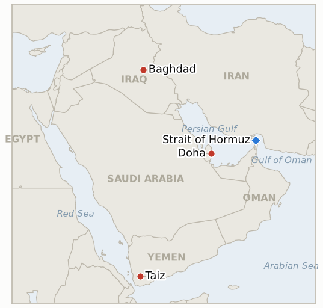

# Middle East Daily Briefing

**September 29, 2026**

- **Reporting window:** ~24 hours, September 28, 09:00 to September 29, 09:00 KST
- **Overall assessment:** Markets reopened and priced in Trump's Saturday rejection of Iran's Hormuz plan, but diplomacy did not die with it: Brent spiked to $108.83 and then pared to a $105.28 settle as Qatari mediators lined up separate talks with Iran and the US on an amended proposal (§1.1). Tehran keeps its military messaging loud, with Iran claiming success against ships near Hormuz and no meeting planned with US officials this week (§1.2). For South Korea the sharper hit was domestic: KOSPI fell 2.70% below 7,000 on a chip selloff, with the won at 1,365.1 (§1.3). Houthi attacks on Saudi Arabia paused, and Iraq's coalition withdrawal deadline arrives Wednesday (§1.4).

---

## 1. What Happened

<figure style="float:right; width:46%; margin:2pt 0 8pt 14pt;">

<figcaption style="font-size:8pt; color:#666; text-align:center; margin-top:3pt; font-style:italic;">Major places of discussion</figcaption>
</figure>

### 1.1 Oil spikes on Trump's rejection, then pares as mediators schedule talks

Brent rose as high as $108.83 in Monday trading after Trump rejected Iran's seven day plan to reopen Hormuz, then settled at $105.28, up 96 cents, while WTI settled at $92.60, up 19 cents, as Qatari mediators pledged to hold talks with the US and Iran ([Reuters via WMBD](https://wmbdradio.com/2026/09/28/oil-price-gains-pared-as-qatar-us-iran-talks-loom/)). A Reuters source said Qatari mediators would meet Foreign Minister Araghchi in New York and the US side separately on Monday or Tuesday, focused on an amended version of the seven day proposal; Araghchi said "any move toward reopening the Strait of Hormuz is contingent on these conditions being met," and Trump told Axios he expected further talks this week ([Jerusalem Post](https://www.jpost.com/middle-east/iran-news/article-909983)). Saudi Aramco is reportedly weighing discounts of about $9 a barrel against record freight costs, and the Brent to WTI spread stays near its widest since May on possible US diesel export curbs ([investingLive](https://investinglive.com/commodities/recap-oil-settles-slightly-higher-as-trump-rejects-iran-hormuz-plan-talks-keep-gains-in-check/)). **Confidence: High** on prices and the mediation plan; Medium on whether talks yield a text.

### 1.2 Iran touts Hormuz attacks and shuts the door on direct contact

Al Jazeera reported that Iran claims its attacks near Hormuz, including on US Navy vessels, have pushed US warships away from its coast, with Supreme Leader Mojtaba Khamenei saying "soon the Arabian Sea...will empty itself of them"; the Pentagon has added 37 service members to its wounded list, 861 since February 28 ([Al Jazeera](https://www.aljazeera.com/news/2026/9/28/iran-touts-hormuz-attacks-as-oil-flows-increase-despite-tensions)). Iran's UN delegation said it has no plans to meet US officials this week, and US Ambassador Waltz called the seven day plan "a pretty cynical attempt" ([GlobalSecurity](https://www.globalsecurity.org/military/ops/iran-war-oprep.htm)). Physical flows are nonetheless improving: Kpler expects 7.4 million barrels a day of crude through Hormuz in September and counted 19 tankers in the week ending Sept 27, while regional exports reached 12.8 million bpd, the highest since the war began (Al Jazeera). **Confidence: High** on statements; Medium on flow estimates, which differ widely between Wright (about 13 million) and Bessent (15 to 22 million).

### 1.3 KOSPI falls 2.70% below 7,000 in the first session after Chuseok

KOSPI closed at 6,889.74, down 191.18 points, as Samsung Electronics fell 5.43% and SK Hynix 5.05% on AI data center delay worries, US tech weakness and rising Treasury yields accumulated over the holiday; foreigners net sold 3.2 trillion won and institutions 1.0 trillion, while individuals bought 2.6 trillion ([Businesskorea](https://www.businesskorea.co.kr/news/articleView.html?idxno=277756); [Seoul Economic Daily](https://en.sedaily.com/finance/2026/09/28/kospi-falls-270-percent-to-close-at-688974)). The won closed at 1,365.1 per dollar, weaker by 7.6 won. The selloff was driven mainly by chips and rates rather than Hormuz, which matters for how much of Korea's move to attribute to the war. **Confidence: High.**

### 1.4 Houthi attacks pause, Iraq's deadline nears, south Lebanon strikes intensify

Houthi attacks on Saudi Arabia have paused after three consecutive days, while the Mawiyah market retaliation warning (IND-20260928-1) and Taiz fighting remain open ([GlobalSecurity](https://www.globalsecurity.org/military/ops/iran-war-oprep.htm); [Malay Mail](https://www.malaymail.com/news/world/2026/09/28/houthis-say-saudi-strikes-on-yemens-taiz-leave-dozens-of-casualties/236811)). Iraq's coalition withdrawal deadline falls on Sept 30 with no new statement, and Israel intensified strikes on south Lebanon villages, reportedly including white phosphorus at two sites, after a Hezbollah explosive drone caused no damage. The US has announced no strikes on Iranian territory for 21 consecutive days. **Confidence: Medium**, mostly single aggregator sourcing.

---

## 2. Deep Dive: Incentives and Motives

### 2.1 Why would Iran accept mediated talks while refusing to meet US officials directly?

Because mediated channels let Tehran amend terms without the domestic cost of being seen negotiating face to face after a public rejection, and Iran's stated baseline is the June memorandum rather than fresh direct talks. Loud claims about ship attacks and Khamenei's rhetoric serve the same audience, keeping the hardliners who attacked Araghchi over the Witkoff channel (IND-20260924-2) quiet while the amended text moves.

### 2.2 Why did Trump reject the plan yet signal that talks would continue?

Because rejection preserves leverage on the seven preconditions while Axios framing keeps the door open, and Washington bears less pressure with 21 quiet days on the strike front and Gulf exports at a war high. Midterm politics also cut both ways: high pump prices argue for a deal, while looking soft argues against.

### 2.3 Why did Korean equities fall harder than the Hormuz news alone would justify?

Because the drop concentrated in chips (Samsung and SK Hynix down over 5%) and came after a long holiday in which US tech and yields moved without Korea trading, so the Monday session absorbed several days of repricing at once. Hormuz risk is a slow variable in the won and oil import bill, whereas the chip and rate shock hit the index directly.

---

## 3. Policy Implications for South Korea

**Exposure snapshot:** South Korea's crude imports remain roughly 70% dependent on Hormuz transit as of July 2026, with the non-Middle East share of the crude mix at 51.5% for May to July (`instructions/korea-exposure.md`, no update needed). Brent at $105.28 and the won at 1,365.1 mean the import bill and its currency multiplier both worsened this window.

**Implications by development:**

- **Oil spike then pare (§1.1):** Brent settling above $100 keeps refiners' feedstock costs elevated; mediated talks offer upside optionality but no date. Aramco's proposed discounts could ease Korea's term costs if freight stays at records.
- **Iran's refusal of direct contact (§1.2):** lengthens the timeline for a Hormuz reopening Korean planners can bank, and reinforces why Seoul's deployment question (IND-20260928-2) stays politically costly.
- **KOSPI and won (§1.3):** a 2.70% drop with 3.2 trillion won of foreign selling is chip and rate driven, but a weaker won amplifies oil import costs; watch whether foreign outflows persist.
- **Iraq deadline (§1.4):** Iraq is a significant Korean crude and construction partner, so a disorderly Sept 30 outcome would add a second supply risk beyond Hormuz.

**Testable indicators:**

- **IND-20260927-1** (confirmed 2026-09-29): a further disclosed step followed Trump's rejection, in the form of mediated talks on an amended proposal and Araghchi's restated conditions.
- **IND-20260929-1** (open, new): mediated talks produce a disclosed amended text or US substantive response by ~2026-10-09.
- **IND-20260929-2** (open, new): KOSPI closes at or above 7,000 by ~2026-10-08.
- **IND-20260929-3** (open, new): Iraq's Sept 30 coalition withdrawal deadline is met or formally extended by ~2026-10-03.
- **IND-20260924-3** (open): Brent settle at or above $100 through ~2026-09-30; the Sept 28 settle of $105.28 keeps it trending toward confirm.
- **IND-20260928-1** (open): a Houthi strike framed as retaliation for the Mawiyah market strike, deadline ~2026-10-12.
- **IND-20260928-2** (open): a further disclosed Korean step on Hormuz deployment, deadline ~2026-10-19.
- **IND-20260928-3** (open): independent corroboration of the Remus 600 drone claim, deadline ~2026-10-12.
- **IND-20260927-3** (open): no third new Saudi city attacked; the three day pause supports this, deadline ~2026-10-11.
- **IND-20260714-4** (open, no deadline): still no fresh weekly Ras Laffan loading figure.

---

## 4. Watch List

- **Outcome of the Qatari mediated talks with Araghchi and the US (IND-20260929-1).**
- **Iraq's Sept 30 coalition withdrawal deadline (IND-20260929-3)** and the militia disarmament timeline set by Prime Minister Ali al-Zaidi on Sept 24.
- **Whether Houthi attacks on Saudi Arabia resume after the three day pause (IND-20260927-3, IND-20260928-1).**
- **KOSPI's reaction to foreign selling and the chip outlook (IND-20260929-2).**
- **Israel's south Lebanon escalation and Lebanon Israel withdrawal talks:** no structural change yet.
- **Brent's hold above $100 through Sept 30 (IND-20260924-3).**

---

## 5. Source Quality Summary

| Claim | Sources | Confidence |
|---|---|---|
| Brent $105.28 and WTI $92.60 settles, $108.83 intraday high | Reuters via WMBD, investingLive | High |
| Qatari mediated talks on amended seven day proposal | Reuters via Jerusalem Post | High on plan; Medium on outcome |
| Iran's ship attack claims, Khamenei quote, casualty and flow figures | Al Jazeera | High on statements; Medium on flow estimates |
| Iran UN delegation no meeting, Waltz remark, Iraq deadline, Lebanon strikes | GlobalSecurity (aggregator) | Medium |
| KOSPI 6,889.74 and won 1,365.1 closes, sector and flow data | Businesskorea, Seoul Economic Daily, News1 | High |
| Taiz strike and Houthi warning | Malay Mail | High |
