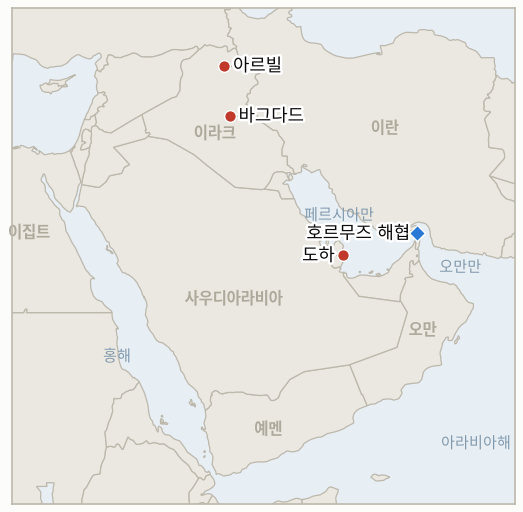

# 중동 일일 브리핑

**2026년 10월 1일**

- **보고 기간:** 약 24시간, 9월 30일 09:00 ~ 10월 1일 06:00 (한국시간)
- **종합 평가:** 외교 경로는 살아 있으나 공개 입장은 강경해졌다. 트럼프는 제재 완화 보도를 "날조"라고 일축했고, 아라그치는 미국 제안을 이란 내각에 보고했다(§1.1). 브렌트유는 102.59달러 안팎에 마감한 뒤 부인 발언에 소폭 올랐고 9월에 약 14% 상승했다(§1.2). 미국은 예정대로 이라크 철수를 마쳤으며 쿠르드 당국은 방공망 공백을 우려한다(§1.3). 코스피는 사흘 연속 하락해 3분기에 19.3% 떨어졌으나 원화는 강세를 보였다(§1.4).

**정정 및 업데이트:** 9월 30일 브리핑이 인용한 알자지라의 역내 원유 수출 하루 1,280만 배럴은, 9월 30일 알자지라 분석이 호르무즈를 통한 9월 원유 수출을 하루 약 1,633만 배럴, 전쟁 전의 약 80%로 제시함에 따라 회복세를 과소평가한 수치였다. 9월 29일 브렌트유 102.67달러는 장중 시세였으며 9월 30일 정산가는 102.59달러다.

---

## 1. 무슨 일이 있었나

<figure style="float:right; width:46%; margin:2pt 0 8pt 14pt;">

<figcaption style="font-size:8pt; color:#666; text-align:center; margin-top:3pt; font-style:italic;">주요 논의 지점</figcaption>
</figure>

### 1.1 트럼프가 제재 완화를 부인하고 이란은 미국 제안을 검토한다

트럼프는 트루스소셜에 "나는 그들에게 아무것도 제안하지 않았다!"고 적고, 핵 관련 구체적 조치의 대가로 제재 완화와 동결 자금 해제를 허용할 것이라는 악시오스 보도를 "날조"라고 불렀다([CNBC](https://www.cnbc.com/2026/09/30/us-iran-war-trump-hormuz.html)). 아라그치 외무장관은 카타르 중재자들과의 회동 뒤 미국 제안을 이란 내각에 보고했으며, NBC에는 이란이 "전쟁이 재개될 때를 완전히 대비하고 있다"고 말했고 이란은 역내 기반시설 공격을 위협했다([CNBC](https://www.cnbc.com/2026/09/30/us-iran-war-trump-hormuz.html); [Newsmax 종합](https://www.newsmax.com/world/globaltalk/iran-us-israel-saudi-arabia-uae-war-september-30-2026/2026/09/30/id/1271169/)). 미국 제안의 내용은 공개되지 않았다. **신뢰도: 발언은 높음, 제안 내용은 낮음.**

### 1.2 브렌트유가 102.6달러 안팎에 마감했고 부인 발언 뒤 소폭 올랐다

브렌트유는 사우디 동서 송유관 물량이 회복되면서 화요일 2.6% 내린 102.59달러에 마감했고, 트럼프의 부인 발언 뒤 수요일 이른 시간 약 0.7% 오른 103.30달러를 기록했다. WTI는 89.81달러 부근이었으며 브렌트유는 7월 이후 최대인 약 14%의 9월 상승폭으로 마감할 전망이었다([Al Jazeera](https://www.aljazeera.com/news/2026/9/30/economic-war-is-iran-losing-its-leverage-over-the-strait-of-hormuz); [Arab News/로이터](https://www.arabnews.com/energy/oil-gains-after-trump-denies-he-is-willing-to-ease-sanctions-on-iran-3003842)). 알자지라는 호르무즈 원유 흐름이 전쟁 전의 약 80%까지 회복됐으나 보험료는 여전히 높다고 전한다. 한 취합 사이트는 다른 기준으로 98달러 부근을 표시했으며 이 브리핑은 이를 쓰지 않는다. **신뢰도: 정확한 수준은 중간, 방향은 높음.**

### 1.3 미국이 이라크 철수를 완료했다

미군은 9월 30일 이라크 철수를 완료했다고 밝혔으며, 아르빌 기지에서의 질서 있는 철수로 12년간의 대이슬람국 임무가 끝났고, 알리 알자이디 총리가 이를 이라크 주권의 "새로운 단계"로 규정하며 인수 행사를 주재했다([ABC News](https://www.abc.net.au/news/2026-09-30/us-military-completes-iraq-withdrawal/107214128); [PBS](https://www.pbs.org/newshour/world/u-s-military-says-its-withdrawal-of-troops-from-iraq-for-islamic-state-fight-is-complete)). 쿠르드 당국은 전쟁 중 1,000건 넘는 드론·미사일 공격을 받은 지역에서 미국 방공 체계가 철수하는 데 우려를 표했다. **신뢰도: 높음.**

### 1.4 코스피가 힘든 분기를 마감했고 원화는 강세를 보였다

코스피는 32.77포인트(0.48%) 내린 6,838.04로 사흘 연속 하락했다. 장 초반 1.06% 상승 출발했으나 외국인이 사흘간 약 9조 원을 순매도했고, 지수는 2020년 1분기 이후 최악인 3분기 19.3% 하락으로 분기를 마쳤다([Seoul Economic Daily](https://en.sedaily.com/finance/2026/09/30/kospi-closes-down-048-percent-at-683804); [KuCoin News](https://www.kucoin.com/news/flash/kospi-closes-down-0-48-as-q3-plummets-19-3-worst-since-q1-2020)). 원·달러 환율은 3.9원 내린 1,352.8원에 마감했다([아시아경제](https://view.asiae.co.kr/article/2026093015594666636)). 하락은 미 국채 금리 상승과 연결됐다([머니투데이](https://www.mt.co.kr/stock/2026/09/30/2026093016171549037)). **신뢰도: 높음.**

---

## 2. 심층 분석: 유인과 동기

### 2.1 트럼프는 왜 협상이 이어지는 가운데 제재 완화를 공개적으로 부인하는가?

11월 3일 중간선거를 앞두고 공개적으로 양보하면 "약한 합의"라는 공격을 받는 반면, 카타르 경로는 조건부 제안을 계속 전달할 수 있기 때문이다. 부인은 협상 지위와 국내 정치 입지를 동시에 지키고 이란이 내놓아야 할 조치의 값을 높게 유지한다. 그렇다고 경로가 끊겼다는 뜻은 아니며, 테헤란은 여전히 제안을 받았다.

### 2.2 이란은 왜 협상하면서도 전쟁 준비 태세를 계속 내세우는가?

호르무즈 흐름이 전쟁 전의 80% 수준으로 회복되면서 테헤란의 지렛대가 줄고 경제가 급격히 위축되고 있기 때문이다. 역내 기반시설 공격 위협은 해협 재개방에 대가가 따른다는 점을 워싱턴과 걸프 국가들에 상기시키고 순서 문제에서 협상력을 높인다.

### 2.3 워싱턴은 왜 위험에도 불구하고 예정대로 이라크에서 철수했는가?

시한이 바그다드와 맺은 정치적 약속이었고 행정부가 중간선거 전에 철수를 기록으로 남기고 싶어 하기 때문이다. 쿠르디스탄의 방공망이 얇아지는 비용은 아르빌이 떠안으며, 그래서 민병대의 행동이 핵심 변수가 된다.

---

## 3. 한국에 대한 정책적 함의

**노출도 스냅샷:** 2026년 7월 기준 한국 원유 수입의 약 70%가 호르무즈 해협 통항에 의존한다(`instructions/korea-exposure.md`, 갱신 불필요). 원화 1,352.8원과 브렌트유 약 102.6달러는 수입 비용을 전쟁 전보다 크게 높은 수준에 두며, 3분기 코스피 19.3% 하락과 9월 외국인 약 21조 5,000억 원 매도(Seoul Economic Daily)는 시장이 장기 교착을 반영하고 있음을 보여준다.

**사안별 함의:**

- **제재 부인(§1.1):** 미국의 제재 완화 없이는 호르무즈 정상화가 빨라지기 어려우므로 국내 정유사는 중간선거 때까지 높은 원료비를 전제로 계획해야 하며, 호르무즈 파병 문제도 미결로 남는다.
- **유가(§1.2):** 전쟁 전의 약 80% 수준 흐름은 물량 부족 위험을 덜지만 가격 위험은 덜지 못하므로 현물보다 장기 계약이 유리하다.
- **이라크(§1.3):** 민병대가 쿠르디스탄이나 바그다드를 겨냥해 반발하면 이라크에 진출한 한국 기업에 공급·건설 위험이 더해진다.
- **코스피와 원화(§1.4):** 원화 강세 속 주가 하락은 외국인 자금 유출 패턴이며, 7,000선 회복에는 유가 안도보다 수급 반전이 필요하다.

**검증 가능한 지표:**

- **IND-20261001-1** (진행 중, 신규): 이란이 미국 제안에 대한 답변을 공개하거나 호르무즈 관련 조치를 발표한다. 기한 약 2026-10-11.
- **IND-20261001-2** (진행 중, 신규): 약 2026-10-09까지 한 주 동안 외국인이 코스피 순매수로 돌아선다.
- **IND-20260924-3** (확인): 브렌트유가 9월 30일 102.59달러에 정산돼 기한까지 100달러 이상을 유지했다.
- **IND-20260929-3** (확인): 미국이 9월 30일 이라크 철수 완료를 공표했다.
- **IND-20260930-1** (진행 중): 이란 제안에 대한 미국의 순서 관련 답변. 트럼프의 공개 부인은 공개된 답변이 아니며 기한은 약 2026-10-07.
- **IND-20260930-2** (진행 중): 서방 또는 쿠르디스탄 표적에 대한 민병대 공격은 아직 공개되지 않았다. 기한 약 2026-10-14.
- **IND-20260929-1** (진행 중): 수정안은 공개되지 않았다. 기한 약 2026-10-09.
- **IND-20260929-2** (진행 중): 코스피 6,838.04로 7,000 아래다. 기한 약 2026-10-08.
- **IND-20260928-1**, **IND-20260928-2**, **IND-20260928-3**, **IND-20260927-3**, **IND-20260714-4** (진행 중): 이번 기간 새 정보 없음.

---

## 4. 관찰 목록

- **미국 제안에 대한 이란 내각의 답변(IND-20261001-1, IND-20260930-1, IND-20260929-1).**
- **철수 이후 민병대 반응과 쿠르디스탄 방공망(IND-20260930-2).**
- **이스라엘 10월 총선 전 공격 가능성에 대한 네타냐후의 경고**와 군인 1명과 민간인 3명을 다치게 한 레바논 남부 공습: 구조적 변화는 없다.
- **11월 산유량 동결이 예상되는 OPEC+ 회의**와 10월 6일 비축유 교환 입찰.
- **코스피 외국인 수급과 7,000선(IND-20261001-2, IND-20260929-2).**

---

## 5. 출처 신뢰도 요약

| 주장 | 출처 | 신뢰도 |
|---|---|---|
| 트럼프의 제재 완화 부인, 아라그치의 미국 제안 내각 보고 | CNBC, Newsmax 종합 | 발언은 높음, 제안 내용은 낮음 |
| 브렌트유 정산가 102.59달러 후 약 103.30달러, 9월 약 14% 상승 | Al Jazeera, Arab News(로이터) (약 98달러로 표시한 상충 취합 자료 존재) | 중간 |
| 호르무즈 흐름 전쟁 전의 약 80%, 수출 약 1,633만 배럴 | Al Jazeera | 중간 |
| 미국의 이라크 철수 완료 | ABC News, PBS, NPR | 높음 |
| 코스피 6,838.04, 3분기 19.3% 하락 | Seoul Economic Daily, KuCoin News, 아시아경제 | 높음 |
| 원화 1,352.8원 마감 | 아시아경제, 머니투데이, 뉴스핌 | 높음 |
