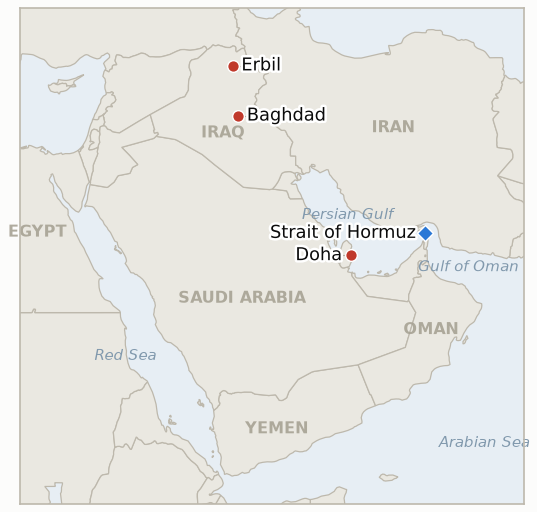

# Middle East Daily Briefing

**October 1, 2026**

- **Reporting window:** ~24 hours, September 30, 09:00 to October 1, 06:00 KST
- **Overall assessment:** Diplomacy stays alive but hardened in public: Trump called a report that he would ease sanctions a "HOAX" while Araghchi carried a US proposal to Iran's cabinet (§1.1). Brent settled near $102.59 and ticked up on the denial, ending September about 14% higher (§1.2). The US completed its Iraq withdrawal on schedule, leaving Kurdish officials worried about air defense (§1.3). KOSPI fell a third day and closed Q3 down 19.3%, though the won firmed (§1.4).

**Corrections and updates:** The September 30 brief cited Al Jazeera's regional crude exports at 12.8 million barrels a day; Al Jazeera's September 30 analysis puts September crude exports through Hormuz at about 16.3 million barrels a day, roughly 80% of pre war flows, so the earlier figure understated the recovery. The Sept 29 Brent quote of $102.67 was an intraday figure; the Sept 30 settle is $102.59.

---

## 1. What Happened

<figure style="float:right; width:46%; margin:2pt 0 8pt 14pt;">

<figcaption style="font-size:8pt; color:#666; text-align:center; margin-top:3pt; font-style:italic;">Major places of discussion</figcaption>
</figure>

### 1.1 Trump denies sanctions relief as Iran weighs a US proposal

Trump wrote on Truth Social that "I offered them NOTHING!" and called an Axios report that he would grant sanctions relief and release frozen funds in return for concrete nuclear steps a "HOAX" ([CNBC](https://www.cnbc.com/2026/09/30/us-iran-war-trump-hormuz.html)). Foreign Minister Araghchi presented Iran's cabinet with a US proposal after his meetings with Qatari mediators, while telling NBC that Iran is "fully prepared for the time for the war to be resumed," and Iran threatened infrastructure across the region ([CNBC](https://www.cnbc.com/2026/09/30/us-iran-war-trump-hormuz.html); [Newsmax/AP roundup](https://www.newsmax.com/world/globaltalk/iran-us-israel-saudi-arabia-uae-war-september-30-2026/2026/09/30/id/1271169/)). The contents of the US proposal are not disclosed. **Confidence: High on the statements; Low on the proposal's contents.**

### 1.2 Brent settles near $102.6 and ticks up after the denial

Brent fell 2.6% to $102.59 on Tuesday as Saudi East West pipeline flows recovered, then rose about 0.7% to $103.30 early Wednesday after Trump's denial; WTI was near $89.81 and Brent was headed for a September gain of about 14%, its largest since July ([Al Jazeera](https://www.aljazeera.com/news/2026/9/30/economic-war-is-iran-losing-its-leverage-over-the-strait-of-hormuz); [Arab News/Reuters](https://www.arabnews.com/energy/oil-gains-after-trump-denies-he-is-willing-to-ease-sanctions-on-iran-3003842)). Al Jazeera reports Hormuz crude flows at about 80% of pre war levels, yet insurance costs stay elevated. One aggregator page showed a Brent level near $98 on another basis, which this brief does not use. **Confidence: Medium on exact levels; High on direction.**

### 1.3 US completes its Iraq withdrawal

The US military said it completed its withdrawal from Iraq on September 30, with an orderly departure from Erbil air base ending the 12 year anti ISIS mission, and Prime Minister Ali al-Zaidi presided over the handover as "a new phase" of Iraqi sovereignty ([ABC News](https://www.abc.net.au/news/2026-09-30/us-military-completes-iraq-withdrawal/107214128); [PBS](https://www.pbs.org/newshour/world/u-s-military-says-its-withdrawal-of-troops-from-iraq-for-islamic-state-fight-is-complete)). Kurdish officials voiced concern over the removal of US air defense systems after more than 1,000 drone and missile attacks on the region during the war. **Confidence: High.**

### 1.4 KOSPI ends a rough quarter while the won firms

KOSPI fell 32.77 points, or 0.48%, to 6,838.04, a third straight decline, after opening 1.06% higher; foreigners sold about 9 trillion won over three sessions, and the index ended Q3 down 19.3%, its worst quarter since Q1 2020 ([Seoul Economic Daily](https://en.sedaily.com/finance/2026/09/30/kospi-closes-down-048-percent-at-683804); [KuCoin News](https://www.kucoin.com/news/flash/kospi-closes-down-0-48-as-q3-plummets-19-3-worst-since-q1-2020)). The won closed at 1,352.8 per dollar, stronger by 3.9 won ([Asia Economy](https://view.asiae.co.kr/article/2026093015594666636)), with the decline tied to higher US Treasury yields ([Money Today](https://www.mt.co.kr/stock/2026/09/30/2026093016171549037)). **Confidence: High.**

---

## 2. Deep Dive: Incentives and Motives

### 2.1 Why does Trump publicly deny sanctions relief while talks continue?

Because conceding in public before the November 3 midterms would hand critics a "weak deal" attack, while the private channel through Qatar can still carry conditional offers. The denial protects his bargaining position and his domestic standing at once, and it keeps the price of any Iranian step high. It does not prove the channel is dead: Tehran still received a proposal.

### 2.2 Why does Iran keep signaling readiness for war while engaging?

Because Tehran's leverage is shrinking as Hormuz flows recover toward 80% of pre war levels, and its economy is contracting sharply. Threats against regional infrastructure remind Washington and the Gulf states that the strait's reopening is not free, and they strengthen its hand on sequencing.

### 2.3 Why did Washington exit Iraq on schedule despite the risks?

Because the date was a political commitment made with Baghdad and the administration wants the exit on record before the midterms. The cost, a thinner air defense umbrella for Kurdistan, is borne by Erbil and is what makes militia behavior the key variable to watch.

---

## 3. Policy Implications for South Korea

**Exposure snapshot:** South Korea's crude imports remain roughly 70% dependent on Hormuz transit as of July 2026 (`instructions/korea-exposure.md`, no update needed). A won at 1,352.8 and Brent near $102.6 leave the import bill well above pre war levels, and a Q3 KOSPI loss of 19.3% with about 21.5 trillion won of September foreign selling (Seoul Economic Daily) shows markets pricing a long stalemate.

**Implications by development:**

- **Sanctions denial (§1.1):** without US sanctions relief there is no quick Hormuz normalization, so Korean refiners should keep planning on elevated feedstock costs through the midterms; the pending Hormuz deployment question stays unresolved.
- **Oil (§1.2):** flows near 80% of pre war levels ease physical shortage risk but not price risk, favoring term contracts over spot purchases.
- **Iraq (§1.3):** a militia backlash against Kurdistan or Baghdad would add a second supply and construction risk for Korean firms in Iraq.
- **KOSPI and won (§1.4):** a firmer won with falling equities is a foreign outflow pattern; the 7,000 level needs a flow reversal, not just oil relief.

**Testable indicators:**

- **IND-20261001-1** (open, new): Iran discloses a response to the US proposal or announces a Hormuz step by ~2026-10-11.
- **IND-20261001-2** (open, new): foreigners turn net buyers of KOSPI over the week to ~2026-10-09.
- **IND-20260924-3** (confirmed): Brent settled $102.59 on Sept 30, at or above $100 through the deadline.
- **IND-20260929-3** (confirmed): the US announced completion of its Iraq withdrawal on Sept 30.
- **IND-20260930-1** (open): US sequencing response to Iran's proposal; Trump's public denial is not a disclosed response; deadline ~2026-10-07.
- **IND-20260930-2** (open): no militia attack on Western or Kurdistan targets disclosed yet; deadline ~2026-10-14.
- **IND-20260929-1** (open): no amended text disclosed; deadline ~2026-10-09.
- **IND-20260929-2** (open): KOSPI 6,838.04, below 7,000; deadline ~2026-10-08.
- **IND-20260928-1**, **IND-20260928-2**, **IND-20260928-3**, **IND-20260927-3**, **IND-20260714-4** (open): no new information in this window.

---

## 4. Watch List

- **Iran's cabinet response to the US proposal (IND-20261001-1, IND-20260930-1, IND-20260929-1).**
- **Militia reaction and Kurdistan air defense after the exit (IND-20260930-2).**
- **Netanyahu's warning of possible attacks before Israel's October elections**, and Israeli strikes in south Lebanon that wounded a soldier and three civilians; no structural change.
- **OPEC+ November quota meeting**, expected to hold output, and the October 6 SPR exchange bids.
- **KOSPI foreign flows and the 7,000 level (IND-20261001-2, IND-20260929-2).**

---

## 5. Source Quality Summary

| Claim | Sources | Confidence |
|---|---|---|
| Trump denies sanctions relief; Araghchi presents US proposal to cabinet | CNBC, Newsmax roundup | High on statements; Low on proposal contents |
| Brent settle $102.59, then about $103.30; September gain about 14% | Al Jazeera, Reuters via Arab News (conflicting aggregator at about $98) | Medium |
| Hormuz flows about 80% of pre war, exports about 16.3 million b/d | Al Jazeera | Medium |
| US completes Iraq withdrawal | ABC News, PBS, NPR | High |
| KOSPI 6,838.04, Q3 down 19.3% | Seoul Economic Daily, KuCoin News, Asia Business Daily | High |
| Won 1,352.8 close | Asia Economy, Money Today, Newspim | High |
