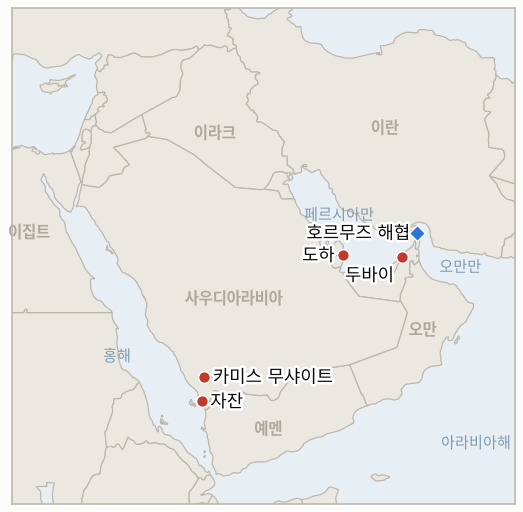

# 중동 일일 브리핑

**2026년 10월 2일**

- **보고 기간:** 약 24시간, 10월 1일 09:00 ~ 10월 2일 06:00 (한국시간)
- **종합 평가:** 외교 경로는 열려 있으나 군사 경로가 두터워지고 있다. 트럼프는 이란의 호르무즈 재개방안을 거부했고 이란 내각은 미국의 역제안을 검토 중이며(§1.1), 세 번째 미 항공모함 전단과 플라이두바이 조종실 공격을 둘러싼 위협은 결렬 시 비용을 키운다(§1.2). 오만 앞바다에서 초대형 유조선이 불탔다는 보도가 나왔고 후티의 공격은 카미스 무샤이트와 자잔에 다시 닿았다(§1.3). 브렌트유는 4.4% 급등해 102.31달러에 마감했고 코스피는 사상 최대 반도체 수출에 1.95% 반등했다(§1.4).

**정정 및 업데이트:** 10월 1일 브리핑은 9월 30일 브렌트유 정산가를 102.59달러로 적었다. 9월 30일 만기가 도래한 11월물은 103.50달러, 이제 기준물이 된 12월물은 98.03달러(WTI 90.42달러)에 정산됐으며, 일부 취합 자료와의 차이는 가격 변동이 아니라 두 계약 사이의 약 5.50달러 격차 때문이다. 이 브리핑은 10월 1일부터 12월물(102.31달러)을 사용한다. 또한 이전 브리핑은 9월 30일 장을 "화요일"로 적었으나 수요일이었다.

---

## 1. 무슨 일이 있었나

<figure style="float:right; width:46%; margin:2pt 0 8pt 14pt;">

<figcaption style="font-size:8pt; color:#666; text-align:center; margin-top:3pt; font-style:italic;">주요 논의 지점</figcaption>
</figure>

### 1.1 트럼프가 이란의 방안을 거부하고 이란은 미국의 역제안을 검토한다

트럼프는 미국의 봉쇄와 제재 해제를 대가로 7일 안에 호르무즈를 재개방하겠다는 이란의 방안을 "받아들일 수 없다"고 부르며, 이란이 "죽어가고 있고 돈이 들어오지 않기" 때문에 협상을 제안한다고 말했다([EA WorldView](https://eaworldview.com/2026/10/us-war-on-iran-trump-rejects-tehran-proposal-to-reopen-talks-and-strait-of-hormuz/)). 이란은 카타르 중재자를 통해 미국의 공식 답변을 받았다고 밝혔고, 아라그치 외무장관이 이를 페제시키안 대통령의 내각에 보고했다. 페제시키안은 합의가 "이제 상호 이익 전략에 기초해야 한다"고 말했으며, 내용은 공개되지 않았고 쟁점은 순서 문제로 전해진다([Boston Globe/AP](https://www.bostonglobe.com/2026/09/30/nation/iran-receives-us-response-end-war/); [Business Standard](https://www.business-standard.com/amp/world-news/iran-receives-official-us-response-to-latest-proposal-to-end-7-month-war-126100100079_1.html)). 미국은 또 이란 국내 승용차 생산의 90% 이상을 차지하는 자동차 업체 IKCO와 SAIPA를 제재했고, 미 당국자는 루비오 국무장관이 이란 대표단에 뉴욕 출국을 명령했다고 밝혔으나 테헤란은 예정된 출국이었다고 주장한다([Al Jazeera 라이브 블로그](https://www.aljazeera.com/amp/news/liveblog/2026/10/1/iran-war-live-trump-hints-us-could-strike-iran-warns-time-coming)). **신뢰도: 발언은 높음, 역제안 내용은 낮음.**

### 1.2 세 번째 항공모함 전단과 플라이두바이 공격에 얽힌 위협

미국이 세 번째 항공모함 전단을 중동에 보낸다는 보도가 나왔고, Al Jazeera 라이브 블로그는 11월 말까지 이란 주변에 항모 3척과 상륙전단 2개가 배치되며 헤그세스 국방장관이 대통령의 공격 명령에 대비돼 있음을 확인했다고 전했다([CNBC(검색 요약)](https://cnbc.com/2026/10/01/oil-prices-today-wti-brent.html); [Al Jazeera](https://www.aljazeera.com/amp/news/liveblog/2026/10/1/iran-war-live-trump-hints-us-could-strike-iran-warns-time-coming)). 별도로 플라이두바이 부조종사가 두바이발 텔아비브행 항공편 기장을 흉기로 찌르고 기체를 추락시키려 했으나 승객들이 제압해 사우디아라비아에 착륙했다. 트럼프는 "들리는 바로는" 이란과 연관이 있다며, 그렇다면 "크게 타격받을 것"이라고 말했다. 네타냐후는 "판단하기 이르다"며 오만 국적자의 "이슬람 급진 세뇌"에 의한 자살 시도로 설명했고, 트럼프는 근거를 제시하지 않았다([CBS News](https://www.cbsnews.com/news/trump-flydubai-pilot-linked-to-iran/)). **신뢰도: 위협 발언은 높음, 이란 연관성은 낮음, 항모 일정은 중간.**

### 1.3 호르무즈 인근에서 유조선이 불타고 후티 공격이 카미스 무샤이트와 자잔에 닿았다

이란 파르스 통신은 250만 배럴급 초대형 유조선이 오만 해안에서 약 8km 떨어진 곳에서 피격돼 불타고 있다고 전했고, 영국해상무역운영기구(UKMTO)는 미상의 발사체에 맞은 유조선이라고 설명했다. 공격 주체는 거명되지 않았으며 이란 매체는 이 선박이 "불법적으로" 통항했다고 주장했다([Al Jazeera 라이브 블로그](https://www.aljazeera.com/amp/news/liveblog/2026/10/1/iran-war-live-trump-hints-us-could-strike-iran-warns-time-coming)). 사우디 주도 연합군은 카미스 무샤이트 상공에서 후티 드론 4기와 탄도미사일 2발, 자잔 상공에서 탄도미사일을 요격했다고 밝혀 사우디 남부 도시에 대한 공세가 이어졌다(같은 출처). **신뢰도: 유조선의 신원과 원인은 중간, 연합군 발표 기준 요격은 높음.**

### 1.4 항모 보도에 브렌트유가 급등하고 코스피는 반도체 수출에 반등했다

브렌트유 12월물은 4.4% 올라 102.31달러에, WTI는 2.7% 올라 92.87달러에 정산됐다([CNBC(검색 요약)](https://cnbc.com/2026/10/01/oil-prices-today-wti-brent.html)). 코스피는 133.31포인트(1.95%) 오른 6,971.35, 코스닥은 4.48% 올랐으며, 한국의 9월 수출은 83.5% 늘어난 1,209억 달러로 사상 최대, 반도체 수출은 603억 달러였다. 원화는 달러당 1,358.4원으로 5.6원 약세였다([Seoul Economic Daily](https://en.sedaily.com/finance/2026/10/01/kospi-climbs-195-percent-to-close-at-697135); [Seoul Economic Daily](https://en.sedaily.com/finance/2026/10/01/koreas-september-exports-hit-record-1209-billion-on-chip)). 미 10년물 금리가 5.29%인 가운데 외국인은 다섯 달째 한국 주식을 순매도하고 있다. **신뢰도: 코스피·원화·수출은 높음, 유가는 계약별 호가 차이로 중간.**

---

## 2. 심층 분석: 유인과 동기

### 2.1 트럼프는 왜 이란의 방안을 거부하면서도 역제안을 보내는가?

거부와 역제안이 같은 목표, 곧 순서 문제의 주도권을 워싱턴이 쥐는 데 기여하기 때문이다. 7일 만에 호르무즈 재개방과 봉쇄 해제를 맞바꾸는 이란의 안을 받으면 11월 3일 중간선거 전에 굴복으로 비치지만, 카타르를 통한 역제안은 협상을 요청하는 쪽이 이란이라고 말할 수 있게 해 준다. 그가 중간선거 뒤 재공습을 예상한다는 보도는 외교가 군사력 증강의 시간을 벌어주는 면도 있음을 시사한다.

### 2.2 워싱턴은 왜 지금 세 번째 항공모함을 보내는가?

전력 배치가 지렛대이자 보험이기 때문이다. 이란 내각이 숙고하는 동안 압박을 가하고, 중간선거 뒤 협상이 깨질 경우 공격 선택지가 존재하도록 한다. 11월 말까지 항모 3척이라는 일정은 이 순서에 맞고, 유가의 4.4% 급등은 이 배치가 그 자체로 확전 위험으로 가격에 반영됨을 보여준다.

### 2.3 트럼프는 왜 플라이두바이 사건을 이란과 그토록 빨리 연결하는가?

근거 없는 귀속은 비용이 적고 확전 선택지를 정치적으로 열어두기 때문이다. 이후 공습이 있더라도 선택이 아니라 보복으로 보이게 한다. 네타냐후의 신중함과 부조종사의 급진적 세뇌 정황은 사실관계가 트럼프의 발언보다 얇음을 보여주며, 그래서 이 브리핑은 연관성을 입증되지 않은 것으로 다룬다.

### 2.4 후티는 왜 사우디 남부 도시를 계속 타격하는가?

카미스 무샤이트와 자잔에 대한 공세는 낮은 비용으로 리야드에 부담을 주고 사우디의 방어 부담을 바깥으로 넓히며, 그동안 이란과의 협상은 병행된다. 요격으로 피해는 제한적이지만 되풀이는 사우디 수출 기반시설과 방공망에 압력을 쌓는다.

---

## 3. 한국에 대한 정책적 함의

**익스포저 현황:** 2026년 7월 기준 한국 원유 수입의 약 70%가 호르무즈 해협 통항에 의존한다(`instructions/korea-exposure.md`, 갱신 불필요). 원화 1,358.4원과 브렌트유 약 102.3달러는 수입 비용을 전쟁 전보다 크게 높은 수준에 두지만, 사상 최대인 9월 수출 1,209억 달러(반도체 603억 달러)와 498억 5,000만 달러의 무역수지 흑자는 주식시장이 아직 충분히 반영하지 못한 완충 장치다.

**사안별 함의:**

- **거부와 역제안(§1.1):** 순서 문제로 교착되면 호르무즈 정상화가 빨라지기 어려우므로 국내 정유사는 중간선거 때까지 높은 원료비를 전제로 계획해야 하며, 호르무즈 파병 문제도 미결로 남는다.
- **항모 증강과 플라이두바이(§1.2):** 중간선거 뒤 공습이 이뤄지면 8~9월 물동량이 덜어준 물리적 공급 위험이 다시 열리므로 현물 구매보다 장기 계약과 전략 비축 수준이 중요하다.
- **호르무즈 유조선과 후티 공격(§1.3):** 만재 초대형 유조선 피격이 확인되면 전쟁 전의 80% 물동량에서도 국내 선사의 전쟁위험 보험료가 오른다.
- **시장(§1.4):** 반도체 수출 급증은 유일한 구조적 상쇄 요인이며, 코스피 7,000선은 유가가 아니라 외국인 매도의 반전 여부에 달려 있다.

**검증 가능한 지표:**

- **IND-20261002-1** (진행 중, 신규): 미국 또는 이스라엘이 플라이두바이 공격과 이란의 연관 증거를 공개하거나 미국이 이를 이유로 보복 공습을 한다. 기한 약 2026-10-09.
- **IND-20261002-2** (진행 중, 신규): 불탄 초대형 유조선의 공격 주체가 정부 또는 UKMTO 후속 발표로 지목된다. 기한 약 2026-10-09.
- **IND-20261001-1** (진행 중): 내각 검토 외에 미국 역제안에 대한 이란의 답변은 아직 공개되지 않았다. 기한 약 2026-10-11.
- **IND-20260930-1** (진행 중): 미국 역제안의 순서 관련 내용은 비공개이며 트럼프의 이란 방안 거부는 이에 대한 공개 답변이 아니다. 기한 약 2026-10-07.
- **IND-20260929-1** (진행 중): 이란은 카타르를 통한 미국의 공식 답변을 확인했으나 수정안은 공개되지 않았다. 기한 약 2026-10-09.
- **IND-20260929-2** (진행 중): 코스피는 10월 1일 6,971.35로 아직 7,000 아래다. 기한 약 2026-10-08.
- **IND-20261001-2** (진행 중): 외국인은 다섯 달째 순매도를 이어가고 있으며 한 주 연속 순매수는 아직 없다. 기한 약 2026-10-09.
- **IND-20260927-3** (진행 중): 자잔과 카미스 무샤이트가 다시 표적이 됐으나 자잔은 앞서 공격받은 적이 있어 새로운 도시는 아직 없다. 기한 약 2026-10-11.
- **IND-20260930-2**, **IND-20260928-1**, **IND-20260928-2**, **IND-20260928-3**, **IND-20260714-4** (진행 중): 이번 기간 새 정보 없음.

---

## 4. 관찰 목록

- **미국 역제안에 대한 이란 내각의 답변(IND-20261001-1, IND-20260930-1, IND-20260929-1).**
- **사우디아라비아의 플라이두바이 수사와 미국의 귀속 판단(IND-20261002-1).**
- **유조선 공격 주체와 호르무즈 주변 전쟁위험 보험료(IND-20261002-2).**
- **항모 도착과 월스트리트저널이 보도한 중간선거 뒤 공습 시나리오.**
- **미국의 이라크 철수 뒤 민병대 반응(IND-20260930-2).**
- **코스피 외국인 수급과 7,000선(IND-20261001-2, IND-20260929-2).**

---

## 5. 출처 신뢰도 요약

| 주장 | 출처 | 신뢰도 |
|---|---|---|
| 트럼프의 이란 방안 거부, 이란 내각의 미국 역제안 검토 | EA WorldView, Boston Globe/AP, Business Standard | 발언은 높음, 내용은 낮음 |
| 세 번째 항모 전단 파견, 11월 말 항모 3척 | CNBC(검색 요약), Al Jazeera 라이브 블로그 | 중간 |
| 플라이두바이 부조종사 공격과 트럼프의 이란 연관 주장 | CBS News | 위협은 높음, 이란 연관성은 낮음 |
| 오만 앞바다 초대형 유조선 피격 | Al Jazeera 라이브 블로그(파르스, UKMTO 인용) | 중간 |
| 카미스 무샤이트·자잔 상공 후티 드론·미사일 요격 | Al Jazeera 라이브 블로그(사우디 주도 연합군) | 중간 |
| 브렌트유 102.31달러(12월물), WTI 92.87달러 | CNBC(검색 요약), 9월 30일 계약 교체는 Rio Times | 중간 |
| 코스피 6,971.35, 원화 1,358.4원, 9월 수출 1,209억 달러 | Seoul Economic Daily, Yahoo Finance | 높음 |
