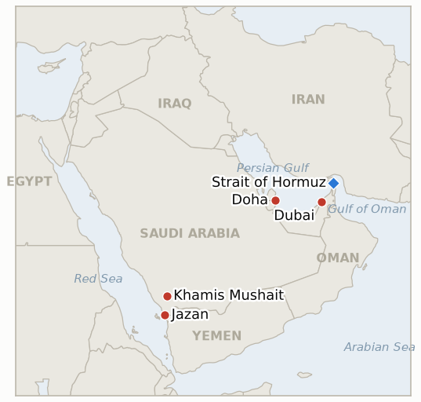

# Middle East Daily Briefing

**October 2, 2026**

- **Reporting window:** ~24 hours, October 1, 09:00 to October 2, 06:00 KST
- **Overall assessment:** The diplomatic track is open but the military track is thickening: Trump rejected Iran's Hormuz plan while Iran's cabinet reviews a US counterproposal (§1.1), and a third US carrier group and threats over a flydubai cockpit attack raise the cost of failure (§1.2). A supertanker was reported burning off Oman and Houthi fire reached Khamis Mushait and Jazan again (§1.3). Brent jumped 4.4% to $102.31 while KOSPI rebounded 1.95% on record chip exports (§1.4).

**Corrections and updates:** The October 1 brief gave the September 30 Brent settle as $102.59. The expiring November contract settled at $103.50 on September 30 and the now benchmark December contract at $98.03 (WTI $90.42), so the roughly $5.50 spread between contracts, not a price move, explains the gap with some aggregator quotes; this brief uses the December contract from October 1 ($102.31). The brief also placed the September 30 session on a "Tuesday"; it was a Wednesday.

---

## 1. What Happened

<figure style="float:right; width:46%; margin:2pt 0 8pt 14pt;">

<figcaption style="font-size:8pt; color:#666; text-align:center; margin-top:3pt; font-style:italic;">Major places of discussion</figcaption>
</figure>

### 1.1 Trump rejects Iran's plan as Tehran weighs the US counterproposal

Trump called Iran's seven day plan to reopen Hormuz in exchange for lifting the US blockade and sanctions "unacceptable," saying Tehran is proposing talks because "they are dying – the money isn't coming in" ([EA WorldView](https://eaworldview.com/2026/10/us-war-on-iran-trump-rejects-tehran-proposal-to-reopen-talks-and-strait-of-hormuz/)). Iran says it received an official US response through Qatari mediators and Foreign Minister Araghchi presented it to President Pezeshkian's cabinet, where Pezeshkian said the agreement "must now be based on a win-win strategy"; the content is undisclosed, and the dispute is described as one of sequencing ([Boston Globe/AP](https://www.bostonglobe.com/2026/09/30/nation/iran-receives-us-response-end-war/); [Business Standard](https://www.business-standard.com/amp/world-news/iran-receives-official-us-response-to-latest-proposal-to-end-7-month-war-126100100079_1.html)). Washington also sanctioned Iran's automakers IKCO and SAIPA, which account for over 90% of domestic car output, and a US official said Secretary of State Rubio ordered the Iranian delegation out of New York, which Tehran says was its scheduled departure ([Al Jazeera live blog](https://www.aljazeera.com/amp/news/liveblog/2026/10/1/iran-war-live-trump-hints-us-could-strike-iran-warns-time-coming)). **Confidence: High on the statements; Low on the counterproposal's contents.**

### 1.2 A third carrier group and a threat tied to the flydubai attack

Reports said the US is sending a third aircraft carrier strike group to the Middle East, with Al Jazeera's live blog citing three carriers and two amphibious groups around Iran by late November and Defense Secretary Hegseth confirming readiness for presidential strike orders ([CNBC via search summary](https://cnbc.com/2026/10/01/oil-prices-today-wti-brent.html); [Al Jazeera](https://www.aljazeera.com/amp/news/liveblog/2026/10/1/iran-war-live-trump-hints-us-could-strike-iran-warns-time-coming)). Separately, a flydubai co-pilot allegedly stabbed the captain of a Dubai to Tel Aviv flight and tried to crash it before passengers overpowered him and the plane landed in Saudi Arabia; Trump said "based on what I'm hearing" Iran is linked and that "they'll be hit very hard" if so, while Netanyahu called it "too early to say" and described a suicide attempt by an Omani citizen with "Islamist radical indoctrination," and Trump offered no evidence ([CBS News](https://www.cbsnews.com/news/trump-flydubai-pilot-linked-to-iran/)). **Confidence: High that the threat was made; Low on any Iranian link; Medium on the carrier timeline.**

### 1.3 A tanker burns near Hormuz and Houthi fire reaches Khamis Mushait and Jazan

Iran's Fars agency reported a 2.5 million barrel supertanker hit and burning about eight kilometers off Oman's coast, with UKMTO describing a tanker struck by an unknown projectile; no party was named, and Iranian media said the ship was transiting "illegally" ([Al Jazeera live blog](https://www.aljazeera.com/amp/news/liveblog/2026/10/1/iran-war-live-trump-hints-us-could-strike-iran-warns-time-coming)). The Saudi led coalition said it intercepted four Houthi drones over Khamis Mushait and two ballistic missiles over Khamis Mushait and Jazan, extending the barrage pattern on southern Saudi cities (same source). **Confidence: Medium on the tanker's identity and cause; High on the interceptions as reported by the coalition.**

### 1.4 Brent jumps on the carrier report while KOSPI rebounds on chip exports

Brent's December contract rose 4.4% to settle at $102.31 and WTI gained 2.7% to $92.87 after the carrier report ([CNBC via search summary](https://cnbc.com/2026/10/01/oil-prices-today-wti-brent.html)). KOSPI climbed 133.31 points, or 1.95%, to 6,971.35 and KOSDAQ rose 4.48%, as South Korea's September exports hit a record $120.9 billion (up 83.5%) with chip exports of $60.3 billion; the won closed at 1,358.4 per dollar, 5.6 won weaker ([Seoul Economic Daily](https://en.sedaily.com/finance/2026/10/01/kospi-climbs-195-percent-to-close-at-697135); [Seoul Economic Daily](https://en.sedaily.com/finance/2026/10/01/koreas-september-exports-hit-record-1209-billion-on-chip)). Foreigners have still sold Korean stocks for a fifth month with the US 10 year yield at 5.29%. **Confidence: High on KOSPI, won and exports; Medium on oil, whose quoted levels differ by contract.**

---

## 2. Deep Dive: Incentives and Motives

### 2.1 Why does Trump reject Iran's plan while still sending a counterproposal?

Because the rejection and the counterproposal serve the same goal: keeping the first move on sequencing with Washington. Accepting Iran's seven day Hormuz-for-blockade swap would look like capitulation before the November 3 midterms, while a counterproposal through Qatar lets him say Iran is the one asking. Reports that he expects renewed strikes after the midterms suggest the diplomacy is also buying time for the military buildup.

### 2.2 Why is Washington adding a third carrier now?

Because force posture is leverage and insurance at once: it pressures Tehran's cabinet while it deliberates, and it ensures that a strike option exists if talks fail after the midterms. The timeline of three carriers by late November fits that sequencing, and the oil market's 4.4% jump shows the posture is itself priced as escalation risk.

### 2.3 Why would Trump tie the flydubai incident to Iran so quickly?

Because attribution without evidence is cheap and keeps the escalation option politically available; it frames any later strike as retaliation rather than choice. Netanyahu's caution, and the pilot's reported radical indoctrination, show that the factual record is thinner than Trump's statement, which is why this brief treats the link as unproven.

### 2.4 Why do the Houthis keep hitting southern Saudi cities?

Because the barrage on Khamis Mushait and Jazan imposes costs on Riyadh at low expense and pushes the Saudi defense burden outward, while Iran's talks continue in parallel. Interceptions mean limited damage, but the repetition builds pressure on Saudi export infrastructure and air defenses.

---

## 3. Policy Implications for South Korea

**Exposure snapshot:** South Korea's crude imports remain roughly 70% dependent on Hormuz transit as of July 2026 (`instructions/korea-exposure.md`, no update needed). A won at 1,358.4 and Brent near $102.3 keep the import bill well above pre war levels, but record September exports of $120.9 billion (chips $60.3 billion) and a $49.85 billion trade surplus give a cushion that the stock market has not yet fully priced.

**Implications by development:**

- **Rejection and counterproposal (§1.1):** a stalled sequencing dispute means no quick Hormuz normalization; Korean refiners should keep planning on elevated feedstock costs through the midterms, and the pending Hormuz deployment question stays unresolved.
- **Carrier buildup and flydubai (§1.2):** a strike after the midterms would reopen the physical supply risk that August and September flows had eased; term contracts and strategic stock levels matter more than spot buying.
- **Hormuz tanker and Houthi fire (§1.3):** a strike on a laden supertanker, if confirmed, raises war risk premiums for Korean shippers even at 80% of pre war flows.
- **Markets (§1.4):** the chip export surge is the one structural offset; KOSPI's 7,000 level now depends on whether foreign selling reverses, not on oil.

**Testable indicators:**

- **IND-20261002-1** (open, new): the US or Israel discloses evidence of an Iranian link to the flydubai attack, or the US conducts a retaliatory strike citing it, by ~2026-10-09.
- **IND-20261002-2** (open, new): the burning supertanker's attacker is attributed by a government or UKMTO follow up by ~2026-10-09.
- **IND-20261001-1** (open): no disclosed Iranian response yet to the US counterproposal beyond cabinet review; deadline ~2026-10-11.
- **IND-20260930-1** (open): the US counterproposal's sequencing is undisclosed; Trump's rejection of Iran's plan is not a disclosed response to it; deadline ~2026-10-07.
- **IND-20260929-1** (open): Iran confirms an official US response through Qatar, but no amended text is public; deadline ~2026-10-09.
- **IND-20260929-2** (open): KOSPI closed 6,971.35 on Oct 1, still below 7,000; deadline ~2026-10-08.
- **IND-20261001-2** (open): foreigners remain net sellers in the fifth month; no full week of net buying yet; deadline ~2026-10-09.
- **IND-20260927-3** (open): Jazan and Khamis Mushait were targeted again; Jazan was hit before, so no genuinely new city yet; deadline ~2026-10-11.
- **IND-20260930-2**, **IND-20260928-1**, **IND-20260928-2**, **IND-20260928-3**, **IND-20260714-4** (open): no new information in this window.

---

## 4. Watch List

- **Iran's cabinet response to the US counterproposal (IND-20261001-1, IND-20260930-1, IND-20260929-1).**
- **The flydubai investigation in Saudi Arabia and any US attribution (IND-20261002-1).**
- **Tanker attribution and war risk premiums around Hormuz (IND-20261002-2).**
- **Carrier arrivals and the post midterm strike scenario reported by the Wall Street Journal.**
- **Militia reaction after the US Iraq exit (IND-20260930-2).**
- **KOSPI foreign flows and the 7,000 level (IND-20261001-2, IND-20260929-2).**

---

## 5. Source Quality Summary

| Claim | Sources | Confidence |
|---|---|---|
| Trump rejects Iran's plan; Iran's cabinet reviews US counterproposal | EA WorldView, Boston Globe/AP, Business Standard | High on statements; Low on contents |
| Third carrier group heading to the region; three carriers by late November | CNBC (via search summary), Al Jazeera live blog | Medium |
| flydubai co-pilot attack and Trump's Iran link claim | CBS News | High on the threat; Low on the Iran link |
| Supertanker hit off Oman | Al Jazeera live blog citing Fars and UKMTO | Medium |
| Houthi drones and missiles intercepted over Khamis Mushait and Jazan | Al Jazeera live blog (Saudi led coalition) | Medium |
| Brent $102.31 (Dec), WTI $92.87 | CNBC (via search summary), Rio Times for Sept 30 contract roll | Medium |
| KOSPI 6,971.35, won 1,358.4, September exports $120.9 billion | Seoul Economic Daily, Yahoo Finance | High |
