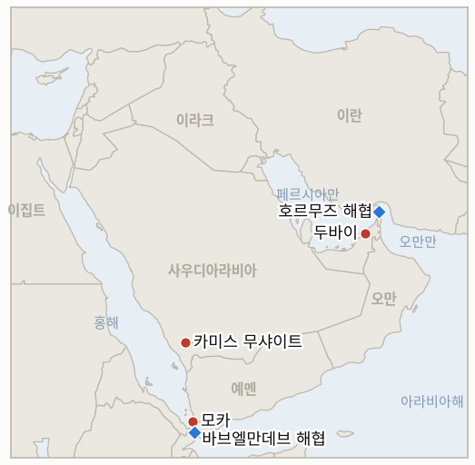

# 중동 일일 브리핑

**2026년 10월 3일**

- **보고 기간:** 약 24시간, 10월 2일 09:00 ~ 10월 3일 06:00 (한국시간)
- **종합 평가:** G7는 연료 가격 압박에 1억 배럴 규모의 비축유 방출로 대응했으나 브렌트유는 102.25달러로 거의 변하지 않았다(§1.1). 더 날카로운 쪽은 사우디와 후티의 전쟁이다. 리야드가 바브엘만데브 해안에 대한 후티의 장악을 되돌리기 위한 공세를 계획 중이라는 보도가 나왔고, 후티는 하루 동안 사우디의 공습 94회를 주장했다(§1.2). 미국과 이란은 순서 문제에서 여전히 막혀 있고 호르무즈에서 유조선이 다시 피격됐으며, 플라이두바이 공격에는 이란의 개입 증거가 아직 없다(§1.3). 코스피는 7,000선을 되찾았다(§1.4).

---

## 1. 무슨 일이 있었나

<figure style="float:right; width:46%; margin:2pt 0 8pt 14pt;">

<figcaption style="font-size:8pt; color:#666; text-align:center; margin-top:3pt; font-style:italic;">주요 논의 지점</figcaption>
</figure>

### 1.1 G7가 원유와 경유 1억 배럴을 방출한다

마크롱 프랑스 대통령이 주재한 화상회의 뒤 G7는 4개월에 걸쳐 최대 1억 배럴의 원유와 경유를 방출하며 "첫 20일 안에 상당 규모의 경유 방출을 앞당겨 실시"하겠다고 밝혔다([NBC News](https://www.nbcnews.com/business/energy/g-7-diesel-crude-release-trump-macron-rcna601132)). 배분은 유럽의 경유 약 5,000만 배럴과 국제에너지기구(IEA) 32개 회원국이 조율하는 원유 5,000만 배럴로 보도됐고, 미국은 1억 7,200만 배럴 방출의 마지막 몫으로 전략비축유에서 최대 4,000만 배럴을 대여하겠다고 별도로 제시했다([The National](https://thenationalnews.com/business/energy/2026/10/02/oil-prices-stable-amid-mixed-supply-signals-from-the-middle-east); [Rigzone](https://www.rigzone.com/news/oil_falls_as_g7_taps_emergency_supplies-02-oct-2026-184766-article)). 트럼프는 유럽이 "막대한 양"의 경유를 풀기로 했다고 말했고, NBC가 인용한 분석가는 경유 가격 효과가 일시적이고 작을 것이라고 평가했다. **신뢰도: G7 발표는 높음, 국가별 배분은 2차 보도에 의존해 중간.**

### 1.2 리야드가 후티 대상 공세를 계획 중이라는 보도와 공습 건수 급증

Times of Israel 등은 사우디가 지난달 후티가 장악한 바브엘만데브 해안과 모카를 되찾기 위해, 리야드의 감독 아래 예멘 병력이 주도하고 사우디 공군이 지원하는 공세를 계획 중이라고 보도했다. 미국은 정보와 표적 지원은 제공하지만 당분간 직접 공습은 계획하지 않는다([Times of Israel](https://www.timesofisrael.com/liveblog-october-02-2026/); [Yahoo News UK](https://uk.news.yahoo.com/saudis-plan-assault-houthis-break-160352911.html)). 후티는 24시간 동안 사우디의 공습 94회, 전투 재개 이후 누적 1,350회를 주장했고, 사우디 연합군은 사우디 남부 도시를 향한 탄도미사일 3발을 요격했다고 밝혔다(Times of Israel 라이브 블로그). 한편 사우디는 동서 송유관을 설계 용량의 80% 이상으로 복구했고 9월 호르무즈 통과 물량을 8월의 하루 100만 배럴에서 290만 배럴로 늘렸다([Rigzone](https://www.rigzone.com/news/oil_falls_as_g7_taps_emergency_supplies-02-oct-2026-184766-article); [The National](https://thenationalnews.com/business/energy/2026/10/02/oil-prices-stable-amid-mixed-supply-signals-from-the-middle-east)). **신뢰도: 공세 계획은 익명 취재원에 의존해 중간, 후티의 공습 집계는 당사자 주장이므로 낮음.**

### 1.3 이란과의 협상 교착, 유조선 피격, 플라이두바이 공격의 이란 연관 증거 부재

워싱턴과 테헤란은 호르무즈를 완전히 재개방할 합의에 진전을 이루지 못했고, 영국해상무역운영기구(UKMTO)는 해협을 통과하던 유조선이 미상의 발사체에 또 피격됐다고 전했다. 단계에는 대체로 동의하지만 순서가 다르다고 알려진 미국의 역제안에 대해서는 이란의 공개 답변이 아직 없다([Rigzone](https://www.rigzone.com/news/oil_falls_as_g7_taps_emergency_supplies-02-oct-2026-184766-article); [ABC45/AP](https://abc45.com/news/nation-world/iran-reviews-us-ceasefire-counterproposal-as-strait-of-hormuz-terms-remain-unclear)). 플라이두바이 공격과 관련해 이스라엘 Channel 12는 부조종사가 알카에다식 이념을 지녔다고 보도했고 월스트리트저널은 오만이 급진화 우려로 그를 이전에 입국 금지했다고 보도해, 트럼프가 시사한 이란 연관성과는 다른 방향을 가리킨다([Times of Israel 라이브 블로그](https://www.timesofisrael.com/liveblog-october-02-2026/)). 같은 라이브 블로그는 영국 경찰이 욤 키푸르를 앞두고 맨체스터 유대인 공동체를 겨냥한 공격을 모의한 혐의로 이란 국적자 2명을 기소했다고 전했다. **신뢰도: 협상 교착은 높음, 유조선 피격 보도는 중간, 플라이두바이 인물 정보는 언론 보도에 의존해 중간, 맨체스터 사건이 국가 지시를 반영한다는 점은 낮음.**

### 1.4 브렌트유는 102달러 부근을 유지하고 코스피는 7,000선을 되찾았다

브렌트유 12월물은 비축유 방출 소식에 99달러 부근까지 밀렸다가 6센트 내린 102.25달러에 정산됐고, WTI는 1.9% 내린 91.11달러에 정산됐다([Rigzone](https://www.rigzone.com/news/oil_falls_as_g7_taps_emergency_supplies-02-oct-2026-184766-article); [The National](https://thenationalnews.com/business/energy/2026/10/02/oil-prices-stable-amid-mixed-supply-signals-from-the-middle-east)). 코스피는 기술주 저가 매수로 32.39포인트(0.45%) 올라 7,003.74에 마감해 5거래일 만에 7,000선을 회복했고, 원화는 7.8원 강세인 달러당 1,350.6원이었다([Korea JoongAng Daily](https://www.koreajoongangdaily.com/business/kospi-closes-up-045-on-bargain-hunting-for-tech-shares/12902818)). 투자자별 수급은 출처에 나와 있지 않다. **신뢰도: 코스피와 원화는 높음, 유가는 매체별로 계약과 시점이 달라 중간.**

---

## 2. 심층 분석: 유인과 동기

### 2.1 G7는 왜 호르무즈 외교를 기다리지 않고 비축유 방출을 택했는가?

핵심 부족분이 경유이고 호르무즈 외교로는 이를 빨리 해결할 수 없으며, 각국 정부가 마주하는 것이 원유 기준가격이 아니라 소비자 물가이기 때문이다. 20일 안에 경유를 앞당겨 푸는 것은 유권자가 체감하는 고통을 겨냥하고, 원유 몫은 IEA의 조율을 눈에 보이게 과시한다. 브렌트유의 반응이 미미했다는 것은 시장이 이 방출을 전쟁의 공급 위험을 바꾸는 조치가 아니라 가교로 본다는 뜻이다.

### 2.2 리야드는 왜 지금 지상 공세를 계획하는가?

후티의 바브엘만데브 해안 장악이 동서 송유관이 제공하기로 했던 홍해 출구를 막고 있고, 워싱턴이 사우디를 대신해 공습하기를 거부했기 때문이다. 송유관을 설계 용량의 80% 이상으로 복구한 리야드는 공격을 감내하는 쪽에서 잃은 땅을 되찾는 쪽으로 옮겨갈 여력이 생겼고, 예멘 대리 병력을 써서 자국 인명 피해를 줄일 수 있다. 미국의 정보 지원 보도는 트럼프가 11월 3일 중간선거 전에 새 전선을 열지 않으면서 동맹을 돕게 해 준다.

### 2.3 후티는 왜 갈수록 큰 공습 건수를 공개하는가?

사우디 공습 집계는 후티를 피해자로 규정하고 카미스 무샤이트 등 사우디 도시에 대한 보복을 정당화하기 때문이다. 이 주장은 검증되지 않았지만, 테헤란과 사우디 내부 청중에게 확전에는 확전으로 맞서겠다는 신호도 보낸다.

### 2.4 미국과 이란의 순서 분쟁은 왜 닫히기 어려운가?

양측 모두 먼저 움직이면 상대에게 협상력을 넘겨준다고 보기 때문이다. 이란은 압박이 풀린 뒤에 호르무즈를 열려 하고, 워싱턴은 호르무즈 재개방과 핵 협상을 먼저 원한다. 중간선거 정치 때문에 트럼프는 눈에 보이는 양보의 비용이 크고, 이란 내각은 절박해 보이기보다 신중해 보일 유인이 있다. 그 사이 유조선 공격은 위험 프리미엄을 살려 두고 양측 모두에게 지연의 비용을 높인다.

---

## 3. 한국에 대한 정책적 함의

**익스포저 현황:** 한국은 원유의 약 70.7%, LNG의 20.4%를 중동에서 들여온다([KITA](https://www.kita.net/board/totalTradeNews/totalNewsExistDetail.do?no=99558); `instructions/korea-exposure.md`, 갱신 불필요). 브렌트유 102.25달러와 원화 1,350.6원 아래에서 수입 부담은 여전히 크지만, 원화의 7.8원 강세와 코스피의 7,000선 회복은 시장이 반도체 수출 완충에 기대고 있음을 보여 준다.

**사안별 함의:**

- **G7 방출(§1.1):** 한국은 IEA 회원국으로서 32개국 원유 몫에 포함되지만 한국의 배분량은 공개되지 않았다. 국내 정유사와 수입업체에게 더 직접적인 관건은 유럽 경유 가격 하락이 제품 비용을 낮추는지이며, 이 방출은 호르무즈 의존도를 줄이지 않는다.
- **사우디 공세 계획(§1.2):** 바브엘만데브 해안을 되찾는 작전은 장기적으로 사우디산 원유의 홍해 경로를 복원할 수 있으나, 단기적으로는 한국이 의존하는 사우디 수출 기반시설에 대한 후티의 보복 위험을 키운다.
- **협상 교착과 유조선 피격(§1.3):** 순서 문제의 돌파구가 없으면 호르무즈 운항 위험과 전쟁 위험 할증이 이어지며, 호르무즈 파병 문제는 미해결로 남는다(IND-20260928-2).
- **시장(§1.4):** 코스피의 7,000선 회복은 한 세션의 결과이며, 유지 여부는 유가가 아니라 외국인의 지속적 순매수가 좌우한다.

**검증 가능한 지표:**

- **IND-20261003-1** (신규, 진행 중): 사우디 또는 그 예멘 동맹 세력이 2026년 10월 23일경까지 홍해 연안의 후티 거점을 겨냥한 지상 공세를 공개적으로 개시한다.
- **IND-20261003-2** (신규, 진행 중): 브렌트유 12월물이 2026년 10월 16일경까지 하루라도 95달러 아래에서 정산되면 비축유 방출이 전쟁 위험 프리미엄을 압도함을 보여 준다. 그날까지 그런 정산이 없으면 반증된다.
- **IND-20260929-2** (해결, 확인): 코스피가 10월 2일 7,003.74에 마감해 10월 8일 기한 안에 7,000 이상을 회복했으며, 9월 28일의 급락은 지금까지 하루짜리 충격으로 확인됐다.
- **IND-20261002-1** (진행 중): 플라이두바이와 이란의 연관을 뒷받침하는 미국 또는 이스라엘의 증거가 공개되지 않았고 언론 보도는 급진화를 가리킨다. 기한 2026년 10월 9일경.
- **IND-20261002-2** (진행 중): UKMTO가 또 다른 유조선 피격을 귀속 없이 보고했고 앞선 유조선도 공격 주체가 미확인이다. 기한 2026년 10월 9일경.
- **IND-20261001-1** (진행 중): 미국 역제안에 대한 이란의 공개 답변이 없다. 기한 2026년 10월 11일경.
- **IND-20261001-2** (진행 중): 외국인 순매수 주간이 아직 없다. 기한 2026년 10월 9일경.
- **IND-20260927-3** (진행 중): 카미스 무샤이트가 다시 표적이 됐으나 새 도시는 없다. 기한 2026년 10월 11일경.
- **IND-20260930-1**, **IND-20260929-1**, **IND-20260930-2**, **IND-20260928-1**, **IND-20260928-2**, **IND-20260928-3**, **IND-20260714-4** (진행 중): 이번 보고 기간에 새로운 정보 없음.

---

## 4. 관찰 목록

- **G7 방출 첫 20일의 경유 공급과 브렌트유의 95달러 하회 여부(IND-20261003-2).**
- **사우디 지원 공세의 개시와 사우디 도시에 대한 후티의 보복(IND-20261003-1, IND-20260927-3).**
- **미국 역제안에 대한 이란의 답변과 순서 분쟁(IND-20261001-1).**
- **유조선 공격 주체와 플라이두바이 관련 증거(IND-20261002-1, IND-20261002-2).**
- **맨체스터 모의 사건과 유럽 내 이란 연계 모의.**
- **다음 주 코스피 외국인 수급(IND-20261001-2).**

---

## 5. 출처 신뢰도 요약

| 주장 | 출처 | 신뢰도 |
|---|---|---|
| G7의 4개월간 최대 1억 배럴 방출, 경유 우선 | NBC News, Rigzone, The National | 높음, 국가별 배분은 중간 |
| 사우디의 후티 대상 공세 계획, 미국은 정보 지원만 | Times of Israel, Yahoo News UK | 중간 |
| 후티의 사우디 공습 94회 주장, 미사일 3발 요격 | Times of Israel 라이브 블로그 | 집계는 낮음, 요격은 중간 |
| 호르무즈 협상 교착, UKMTO의 유조선 피격 보고 | Rigzone, ABC45/AP | 교착은 높음, 유조선은 중간 |
| 플라이두바이 부조종사의 급진화 정보, 맨체스터 기소 | Times of Israel 라이브 블로그(Channel 12, WSJ) | 중간, 국가 연계는 낮음 |
| 브렌트유 102.25달러, WTI 91.11달러 | Rigzone, NBC News, The National | 중간~높음 |
| 코스피 7,003.74, 원화 1,350.6원 | Korea JoongAng Daily, News1 | 높음 |
