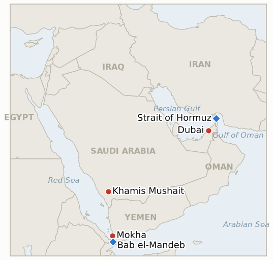

# Middle East Daily Briefing

**October 3, 2026**

- **Reporting window:** ~24 hours, October 2, 09:00 to October 3, 06:00 KST
- **Overall assessment:** The G7 answered the fuel squeeze with a 100 million barrel stock release, a supply side move that left Brent almost unchanged at $102.25 (§1.1). The Saudi and Houthi war is the sharper edge: Riyadh is reported to be planning an offensive to reverse the Houthi hold on the Bab el-Mandeb coast while the Houthis claim 94 Saudi strikes in a day (§1.2). The US and Iran remain stuck on sequencing, a tanker was hit in Hormuz again, and the flydubai attack still has no evidence of an Iranian hand (§1.3). KOSPI reclaimed 7,000 (§1.4).

---

## 1. What Happened

<figure style="float:right; width:46%; margin:2pt 0 8pt 14pt;">

<figcaption style="font-size:8pt; color:#666; text-align:center; margin-top:3pt; font-style:italic;">Major places of discussion</figcaption>
</figure>

### 1.1 The G7 releases 100 million barrels of crude and diesel

After a videoconference hosted by French President Macron, the G7 said it will release up to 100 million barrels of crude and diesel over four months, with "a frontloaded substantial diesel release within the first 20 days" ([NBC News](https://www.nbcnews.com/business/energy/g-7-diesel-crude-release-trump-macron-rcna601132)). Reporting on the split describes about 50 million barrels of European diesel and 50 million barrels of crude coordinated through the IEA's 32 members, while the US separately offered loans of up to 40 million barrels from its Strategic Petroleum Reserve as the last tranche of a 172 million barrel drawdown ([The National](https://thenationalnews.com/business/energy/2026/10/02/oil-prices-stable-amid-mixed-supply-signals-from-the-middle-east); [Rigzone](https://www.rigzone.com/news/oil_falls_as_g7_taps_emergency_supplies-02-oct-2026-184766-article)). Trump said Europe had "just agreed to release a massive amount" of diesel, and an analyst quoted by NBC judged the effect on diesel prices to be temporary and small. **Confidence: High on the G7 announcement; Medium on the national shares, which come from secondary reports.**

### 1.2 Riyadh is reported to be planning a Houthi offensive as the strike count climbs

The Times of Israel and others reported that Saudi Arabia is planning an offensive, led by Yemeni forces under Riyadh's oversight with Saudi air support, to reverse the Houthi seizure of the Bab el-Mandeb coast and Mokha last month; the US is offering intelligence and targeting help but is not planning direct strikes for now ([Times of Israel](https://www.timesofisrael.com/liveblog-october-02-2026/); [Yahoo News UK](https://uk.news.yahoo.com/saudis-plan-assault-houthis-break-160352911.html)). The Houthis claimed 94 Saudi strikes in 24 hours and 1,350 since fighting resumed, and the Saudi coalition said it intercepted three ballistic missiles fired toward a southern Saudi city (Times of Israel live blog). Saudi Arabia has meanwhile restored its East-West pipeline to more than 80% of capacity and lifted Hormuz shipments to 2.9 million barrels a day in September from 1 million in August ([Rigzone](https://www.rigzone.com/news/oil_falls_as_g7_taps_emergency_supplies-02-oct-2026-184766-article); [The National](https://thenationalnews.com/business/energy/2026/10/02/oil-prices-stable-amid-mixed-supply-signals-from-the-middle-east)). **Confidence: Medium on the offensive plan (anonymous sourcing); Low on the Houthi strike tallies, which are partisan claims.**

### 1.3 Iran talks stay stalled, a tanker is hit, and the flydubai attack has no Iran link

Washington and Tehran made no headway toward a deal that would fully reopen Hormuz, and UKMTO reported another tanker hit by an unknown projectile while transiting the strait; the US counterproposal, which reportedly agrees on the steps but not their order, remains unanswered in public ([Rigzone](https://www.rigzone.com/news/oil_falls_as_g7_taps_emergency_supplies-02-oct-2026-184766-article); [ABC45/AP](https://abc45.com/news/nation-world/iran-reviews-us-ceasefire-counterproposal-as-strait-of-hormuz-terms-remain-unclear)). On the flydubai attack, Israeli Channel 12 reported the co-pilot held al-Qaeda style ideology and the Wall Street Journal reported Oman had earlier banned him over radicalization concerns, which points away from the Iranian link Trump suggested ([Times of Israel live blog](https://www.timesofisrael.com/liveblog-october-02-2026/)). The same live blog reported that UK police charged two Iranian nationals with plotting an attack on a Manchester Jewish community before Yom Kippur. **Confidence: High that talks are stalled; Medium on the tanker report; Medium on the flydubai profile, which rests on media reports; Low that the Manchester case reflects state direction.**

### 1.4 Brent holds near $102 while KOSPI reclaims 7,000

Brent's December contract settled at $102.25, down 6 cents, after dipping toward $99 on the stock release news, and WTI settled at $91.11, down 1.9% ([Rigzone](https://www.rigzone.com/news/oil_falls_as_g7_taps_emergency_supplies-02-oct-2026-184766-article); [The National](https://thenationalnews.com/business/energy/2026/10/02/oil-prices-stable-amid-mixed-supply-signals-from-the-middle-east)). KOSPI rose 32.39 points, or 0.45%, to 7,003.74 on bargain hunting in tech shares, its first close above 7,000 in five sessions, and the won strengthened 7.8 won to 1,350.6 per dollar ([Korea JoongAng Daily](https://www.koreajoongangdaily.com/business/kospi-closes-up-045-on-bargain-hunting-for-tech-shares/12902818)). Investor flows were not reported in the source. **Confidence: High on KOSPI and won; Medium on oil, where contract and session quotes differ across outlets.**

---

## 2. Deep Dive: Incentives and Motives

### 2.1 Why did the G7 reach for stock releases instead of waiting for Hormuz diplomacy?

Because the binding shortage is diesel, which Hormuz diplomacy cannot fix quickly, and because governments face consumer prices rather than crude benchmarks. Frontloading diesel within 20 days targets the pain voters feel, while the crude half gives the IEA a visible show of coordination. The muted Brent reaction shows the market treats the release as a bridge, not as a change in the war's supply risk.

### 2.2 Why would Riyadh plan a ground offensive now?

Because the Houthi hold on the Bab el-Mandeb coast blocks the Red Sea outlet that the East-West pipeline was meant to provide, and Washington has declined to strike for Saudi Arabia. Having repaired the pipeline to over 80% of capacity, Riyadh can now afford to shift from absorbing attacks to reversing the gains, using Yemeni proxies to limit its own casualties. The reported US intelligence help lets Trump support an ally without a new front before the November 3 midterms.

### 2.3 Why do the Houthis publicize ever larger strike counts?

Because tallies of Saudi strikes frame the Houthis as the victim and justify retaliation on Khamis Mushait and other Saudi cities. The claims are unverified, but they also signal to Tehran and to Saudi audiences that escalation will be matched.

### 2.4 Why is the sequencing dispute between the US and Iran so hard to close?

Because each side fears that moving first hands the other its leverage: Iran wants pressure lifted before it reopens Hormuz, and Washington wants Hormuz and nuclear talks first. Midterm politics make a visible concession costly for Trump, while Iran's cabinet has an incentive to appear deliberate rather than desperate. Meanwhile tanker strikes keep the risk premium alive and raise the price of delay for both.

---

## 3. Policy Implications for South Korea

**Exposure snapshot:** South Korea draws about 70.7% of its crude and 20.4% of its LNG from the Middle East ([KITA](https://www.kita.net/board/totalTradeNews/totalNewsExistDetail.do?no=99558); `instructions/korea-exposure.md`, no update needed). With Brent at $102.25 and the won at 1,350.6, the import bill stays high, but the won's 7.8 won gain and KOSPI's return above 7,000 show markets leaning on the chip export cushion.

**Implications by development:**

- **G7 release (§1.1):** as an IEA member, Korea is part of the 32 member crude tranche, though its share is not disclosed; the more immediate question for Korean refiners and importers is whether lower European diesel prices ease product costs, while the release does not reduce Hormuz dependence.
- **Saudi offensive plan (§1.2):** a campaign to reopen the Bab el-Mandeb coast could eventually restore the Red Sea route for Saudi crude, but in the near term it adds Houthi retaliation risk to the Saudi export infrastructure Korea relies on.
- **Stalled talks and tanker hits (§1.3):** no sequencing breakthrough means the Hormuz shipping risk and war risk premiums persist; the Hormuz deployment question stays unresolved (IND-20260928-2).
- **Markets (§1.4):** KOSPI's 7,000 reclaim is a single session; sustained foreign buying, not oil, decides whether it holds.

**Testable indicators:**

- **IND-20261003-1** (open, new): Saudi Arabia or its Yemeni allies publicly launch a ground offensive against Houthi positions on the Red Sea coast by ~2026-10-23.
- **IND-20261003-2** (open, new): Brent December settles below $95 on any day by ~2026-10-16, which would show the stock release is overriding the war risk premium; no such settle by that date falsifies it.
- **IND-20260929-2** (resolved, confirmed): KOSPI closed at 7,003.74 on Oct 2, at or above 7,000 within the Oct 8 deadline, confirming the Sept 28 drop as a one day shock so far.
- **IND-20261002-1** (open): no disclosed US or Israeli evidence of an Iranian link to flydubai; media reports point to radicalization instead; deadline ~2026-10-09.
- **IND-20261002-2** (open): another tanker hit reported by UKMTO without attribution; the earlier tanker remains unattributed; deadline ~2026-10-09.
- **IND-20261001-1** (open): no disclosed Iranian response to the US counterproposal; deadline ~2026-10-11.
- **IND-20261001-2** (open): no foreign net buying week reported; deadline ~2026-10-09.
- **IND-20260927-3** (open): Khamis Mushait targeted again, no new city; deadline ~2026-10-11.
- **IND-20260930-1**, **IND-20260929-1**, **IND-20260930-2**, **IND-20260928-1**, **IND-20260928-2**, **IND-20260928-3**, **IND-20260714-4** (open): no new information in this window.

---

## 4. Watch List

- **The G7 release's first 20 days of diesel and whether Brent breaks below $95 (IND-20261003-2).**
- **Launch of the Saudi backed offensive and Houthi retaliation on Saudi cities (IND-20261003-1, IND-20260927-3).**
- **Iran's reply to the US counterproposal and the sequencing dispute (IND-20261001-1).**
- **Tanker attribution and any flydubai evidence (IND-20261002-1, IND-20261002-2).**
- **Manchester plot case and Iranian linked plotting in Europe.**
- **KOSPI foreign flows next week (IND-20261001-2).**

---

## 5. Source Quality Summary

| Claim | Sources | Confidence |
|---|---|---|
| G7 releases up to 100 million barrels over four months, diesel frontloaded | NBC News, Rigzone, The National | High; Medium on national shares |
| Saudi offensive plan against the Houthis; US intelligence help only | Times of Israel, Yahoo News UK | Medium |
| Houthi claim of 94 Saudi strikes; interception of three missiles | Times of Israel live blog | Low on the tallies; Medium on the interceptions |
| Hormuz talks stalled; tanker hit reported by UKMTO | Rigzone, ABC45/AP | High on stall; Medium on the tanker |
| flydubai co-pilot radicalization profile; Manchester charges | Times of Israel live blog (Channel 12, WSJ) | Medium; Low on state links |
| Brent $102.25, WTI $91.11 | Rigzone, NBC News, The National | Medium to High |
| KOSPI 7,003.74, won 1,350.6 | Korea JoongAng Daily, News1 | High |
