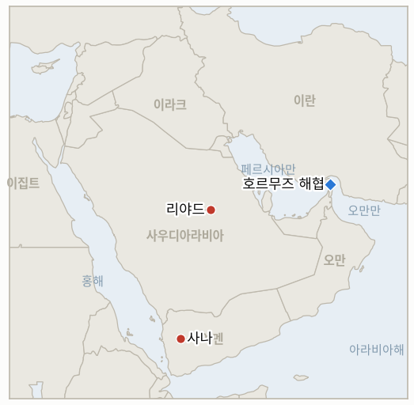

# 중동 일일 브리핑

**2026년 10월 4일**

- **보고 기간:** 약 24시간, 10월 3일 09:00 ~ 10월 4일 06:00 (한국시간)
- **종합 평가:** 토요일 사우디와 후티의 전쟁이 격화됐다. 사우디 공군이 사나를 공습했고 후티는 리야드 남쪽 아람코 시설을 타격했다고 주장했다. 연기가 보였다는 보도가 따랐으며, 리야드 일대에 대한 주장으로는 약 2주 만이다(§1.1). 워싱턴은 항공모함 전단과 상륙전단을 중동으로 보내 전력을 늘리고 있으며 트럼프는 전쟁이 11월 선거 "직후" 끝날 것이라고 말했다(§1.2). 호르무즈 인근에서 유조선이 다시 피격됐으나 해협을 통한 이라크 물량은 회복되고 있다(§1.3). 시장은 휴장해 금요일 수치가 유지된다(§1.4).

---

## 1. 무슨 일이 있었나

<figure style="float:right; width:46%; margin:2pt 0 8pt 14pt;">

<figcaption style="font-size:8pt; color:#666; text-align:center; margin-top:3pt; font-style:italic;">주요 논의 지점</figcaption>
</figure>

### 1.1 사우디 전투기가 사나를 타격하고 후티는 리야드 인근 아람코 타격을 주장한다

현지 특파원들은 토요일 사나에서 최소 5건의 폭발과 전투기 두 대의 미사일 발사를 보도했고, 후티 계열 알마시라 채널은 사우디의 공격이 26회라고 밝혔다([The Sunday Guardian](https://sundayguardianlive.com/world/us-israel-iran-war-latest-live-news-iraq-transports-2-million-barrels-of-crude-through-strait-of-hormuz-as-houthis-claim-riyadh-oil-facility-strike-and-saudi-arabia-launches-attacks-on-sanaa-298248)). 후티는 탄도미사일과 드론으로 리야드 남쪽 석유 시설을 타격했다고 주장했고 아람코 시설 부근에서 불길과 연기가 보인다는 보도가 있었으나, 사우디와 아람코는 피해를 확인하지 않았다([The Sunday Guardian](https://sundayguardianlive.com/world/us-israel-iran-war-latest-live-news-iraq-transports-2-million-barrels-of-crude-through-strait-of-hormuz-as-houthis-claim-riyadh-oil-facility-strike-and-saudi-arabia-launches-attacks-on-sanaa-298248); [CBS News](https://www.cbsnews.com/live-updates/trump-iran-war-us-midterm-elections-troops-deployment/)). 이번 공습은 항공 작전이며, 금요일에 리야드가 계획 중이라고 보도된 지상 공세는 아니다. **신뢰도: 사나 타격은 높음, 아람코 사건은 후티의 주장과 미확인 연기 보도에 의존하므로 중간, 공격 26회라는 수치는 일방의 주장이므로 낮음.**

### 1.2 워싱턴이 전력을 늘리고 전쟁이 중간선거 이후 끝난다고 시사한다

JD 밴스 부통령, 마르코 루비오 국무장관, 피트 헤그세스 국방장관, 존 랫클리프 CIA 국장 등 고위 당국자들이 금요일 캠프데이비드에서 이란 전쟁과 사우디·후티 교전을 논의했다([CBS News](https://www.cbsnews.com/live-updates/trump-iran-war-us-midterm-elections-troops-deployment/)). 항공모함 전단 USS 시어도어 루스벨트호와 상륙전단 USS 마킨 아일랜드호가 약 9,000명과 함께 중동으로 향하고 있어 지역 내 미군은 약 2만 명으로 늘어나며, 트럼프는 앨라배마 유세에서 전쟁이 11월 선거 "직후" 끝날 것으로 기대한다고 말했다([CBS News](https://www.cbsnews.com/live-updates/trump-iran-war-us-midterm-elections-troops-deployment/)). 이번 보고 기간에 미국의 대응 제안에 대한 이란의 답변은 보도되지 않았다. **신뢰도: 배치와 유세 발언은 높음(CBS), 병력 총계는 중간, 이란의 답변에 관한 새 정보는 없음.**

### 1.3 오만 앞바다에서 유조선이 피격되고 이라크의 호르무즈 물량은 회복된다

호르무즈 해협 인근 오만 동쪽 약 4해리 해상에서 유조선이 발사체에 맞았으나 승조원은 모두 무사한 것으로 전해졌으며, 이는 이번 주 이어진 출처 불명 피격에 더해진 것이다([The Sunday Guardian 라이브 블로그](https://sundayguardianlive.com/world/us-israel-iran-war-latest-live-news-iraq-transports-2-million-barrels-of-crude-through-strait-of-hormuz-as-houthis-claim-riyadh-oil-facility-strike-and-saudi-arabia-launches-attacks-on-sanaa-298248)). 같은 보도는 초대형 유조선이 이라크산 원유 200만 배럴을 싣고 해협을 통과했으며 이라크의 선적이 현재 하루 평균 약 200만 배럴이라고 전했다. 공격 주체는 밝혀지지 않았다. **신뢰도: 두 건 모두 단일 종합 라이브 블로그 보도이므로 중간.**

### 1.4 시장은 휴장해 금요일 수치가 유지된다

토요일에는 브렌트유와 WTI 정산이 없었고 한국거래소도 휴장해, 마지막으로 확인된 수치는 브렌트유 102.25달러, WTI 91.11달러, 코스피 7,003.74, 달러당 원화 1,350.6원이다(10월 3일 브리핑 참조). 아람코 주장과 항공모함 소식에 대한 첫 반응은 월요일 장에서 나타난다. **신뢰도: 거래가 없었다는 점은 높음.**

---

## 2. 심층 분석: 유인과 동기

### 2.1 리야드는 왜 공세 계획 보도 다음 날 사나를 폭격했나?

공군력은 예멘 지상군의 준비를 기다리지 않고 시작할 수 있는 계획의 일부이기 때문이다. 수도 공습은 후티 지도부와 사우디 내부 청중에게 결의를 보여 주고, 바브엘만데브 해안 진격에 앞서 전장을 정리한다. 또한 이 작전을 사우디 감독 아래 예멘군이 수행하는 형태로 유지해 부인할 여지를 남긴다.

### 2.2 후티는 왜 지금 리야드 인근 아람코 타격을 주장하나?

수도 인근 석유 기반시설에 대한 주장은 사나 공습에 같은 방식으로 답하는 것이며 비용이 적게 든다. 확인되지 않은 주장이라도 연기 영상이 곁들여지면 사우디 수출의 위험 프리미엄을 높인다. 리야드는 피해를 침묵하려는 유인이 있어 확인이 없다는 사실이 어느 쪽의 증거도 되지 못한다.

### 2.3 워싱턴은 왜 전력을 늘리면서 선거 후 전쟁이 끝난다고 말하나?

두 메시지 모두 중간선거 일정에 부합하기 때문이다. 함정 증강은 기존 배치를 보호하고 이란의 새로운 움직임을 억제하며, 종료 시점 약속은 유권자에게 개입이 일시적임을 알린다. 증강된 전력은 트럼프가 후티 타격을 약속하지 않고도 사우디를 지원할 수 있게 한다.

---

## 3. 한국에 대한 정책적 시사점

**노출도 요약:** 한국은 원유의 약 70.7%, LNG의 약 20.4%를 중동에서 들여온다([KITA](https://www.kita.net/board/totalTradeNews/totalNewsExistDetail.do?no=99558); `instructions/korea-exposure.md`, 갱신 불필요). 이번 보고 기간에는 시장 거래가 없어 금요일의 브렌트유 102.25달러와 원화 1,350.6원이 가장 최근 수치다.

**전개별 시사점:**

- **사나 공습과 아람코 주장(§1.1):** 리야드 인근 타격이 사실이면 홍해 항로뿐 아니라 사우디 원유 기반시설이 다시 위험에 놓인다. 한국의 노출은 사우디 공급에 있으므로 월요일 브렌트유 반응이 첫 신호다.
- **미군 증강(§1.2):** 미군 증강은 한국의 호르무즈 파병 문제(IND-20260928-2)에 대한 압박을 키우는 요인이나, 이번 기간에 한국 정부의 새 입장은 나오지 않았다.
- **유조선 피격과 이라크 물량(§1.3):** 출처 불명 피격이 이어져 이라크 물량이 회복되는 중에도 한국 선사의 전쟁 위험 할증은 높게 유지된다.
- **시장(§1.4):** 한국 시장은 월요일 아람코 주장을 주된 새 변수로 안고 개장한다.

**검증 가능한 지표:**

- **IND-20261004-1** (진행 중, 신규): 사우디, 아람코, 또는 독립 영상과 실명 매체의 현장 보도가 2026년 10월 11일경까지 리야드 일대 아람코 시설의 피해나 화재를 확인한다. 그때까지 침묵하거나 명시적으로 부인하면 반증된다.
- **IND-20261004-2** (진행 중, 신규): USS 시어도어 루스벨트 항모전단이 2026년 10월 25일경까지 미 중부사령부 작전구역에 들어온 것으로 보도된다.
- **IND-20261003-1** (진행 중): 사우디가 지원하는 홍해 연안 지상 공세는 아직 시작되지 않았으며 토요일의 사나 공습은 지상 공세 조건을 충족하지 않는다. 시한 2026년 10월 23일경.
- **IND-20261003-2** (진행 중): 브렌트유는 아직 95달러 아래에서 정산되지 않았고 이번 기간에는 거래가 없었다. 시한 2026년 10월 16일경.
- **IND-20261002-1**, **IND-20261002-2**, **IND-20261001-1**, **IND-20261001-2**, **IND-20260927-3**, **IND-20260930-1**, **IND-20260929-1**, **IND-20260930-2**, **IND-20260928-1**, **IND-20260928-2**, **IND-20260928-3**, **IND-20260714-4** (진행 중): 이번 기간 새 정보 없음. 다만 유조선 피격은 IND-20261002-2의 출처 불명 양상을 더한다.

---

## 4. 관찰 목록

- **리야드 인근 아람코 타격의 확인 또는 부인(IND-20261004-1).**
- **추가 사우디 공습과 예멘 지상 공세 개시 여부(IND-20261003-1).**
- **루스벨트 전단의 도착(IND-20261004-2)과 이란의 반응.**
- **미국 대응 제안에 대한 이란의 답변(IND-20261001-1).**
- **월요일 브렌트유와 코스피 개장(IND-20261003-2, IND-20261001-2).**

---

## 5. 출처 품질 요약

| 주장 | 출처 | 신뢰도 |
|---|---|---|
| 사우디의 사나 공습, 폭발 보도 | The Sunday Guardian 라이브 블로그(알마시라, 특파원) | 공습은 높음, 공격 26회는 낮음 |
| 후티의 리야드 남쪽 아람코 타격 주장, 연기 보도 | The Sunday Guardian, CBS News | 중간, 사우디는 미확인 |
| 캠프데이비드 회동, 항모와 상륙전단 배치(약 9,000명) | CBS News 라이브 업데이트 | 높음, 총계는 중간 |
| 오만 동쪽 4해리 유조선 피격, 이라크 물량 하루 약 200만 배럴 | The Sunday Guardian 라이브 블로그 | 중간 |
| 시장 휴장, 금요일 수치 유지 | 10월 3일 브리핑, KRX 일정 | 높음 |
