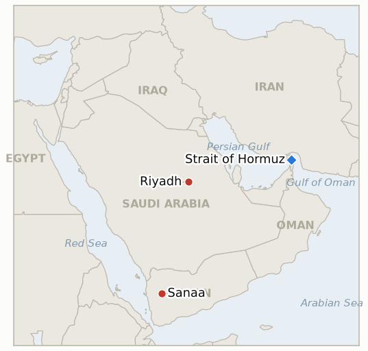

# Middle East Daily Briefing

**October 4, 2026**

- **Reporting window:** ~24 hours, October 3, 09:00 to October 4, 06:00 KST
- **Overall assessment:** The Saudi and Houthi war escalated on Saturday with Saudi air raids on Sanaa and a Houthi claim of a strike on an Aramco site south of Riyadh, the first claim against the Riyadh area in about two weeks that comes with reports of smoke (§1.1). Washington is adding force, with a carrier group and an amphibious group heading to the region, while Trump says the war should end "right after the election" (§1.2). A tanker was hit again near Hormuz even as Iraqi flows through the strait recover (§1.3). Markets were closed, so Friday's levels stand (§1.4).

---

## 1. What Happened

<figure style="float:right; width:46%; margin:2pt 0 8pt 14pt;">

<figcaption style="font-size:8pt; color:#666; text-align:center; margin-top:3pt; font-style:italic;">Major places of discussion</figcaption>
</figure>

### 1.1 Saudi jets hit Sanaa as the Houthis claim an Aramco strike near Riyadh

Correspondents reported at least five blasts in Sanaa on Saturday and two warplanes firing missiles at the city, and the Houthi-run Al-Masirah channel put the Saudi total at 26 attacks ([The Sunday Guardian](https://sundayguardianlive.com/world/us-israel-iran-war-latest-live-news-iraq-transports-2-million-barrels-of-crude-through-strait-of-hormuz-as-houthis-claim-riyadh-oil-facility-strike-and-saudi-arabia-launches-attacks-on-sanaa-298248)). The Houthis said they hit an oil facility south of Riyadh with ballistic missiles and drones, and reports described flames and smoke near an Aramco site, but neither Saudi Arabia nor Aramco confirmed damage ([The Sunday Guardian](https://sundayguardianlive.com/world/us-israel-iran-war-latest-live-news-iraq-transports-2-million-barrels-of-crude-through-strait-of-hormuz-as-houthis-claim-riyadh-oil-facility-strike-and-saudi-arabia-launches-attacks-on-sanaa-298248); [CBS News](https://www.cbsnews.com/live-updates/trump-iran-war-us-midterm-elections-troops-deployment/)). The raids are air strikes, not the ground offensive that Riyadh was reported to be planning on Friday. **Confidence: High that Sanaa was struck; Medium on the Aramco incident, which rests on the Houthi claim and unconfirmed reports of smoke; Low on the 26 attack figure, which is partisan.**

### 1.2 Washington adds force and signals the war ends after the midterms

Senior officials including Vice President Vance, Secretary of State Rubio, Defense Secretary Hegseth and CIA Director Ratcliffe met at Camp David on Friday to discuss the Iran war and the Saudi and Houthi fighting ([CBS News](https://www.cbsnews.com/live-updates/trump-iran-war-us-midterm-elections-troops-deployment/)). The USS Theodore Roosevelt carrier strike group and the USS Makin Island amphibious group are heading to the Middle East with about 9,000 personnel, which would lift US forces in the region to roughly 20,000, and Trump told an Alabama rally he expects the war to end "right after the election" in November ([CBS News](https://www.cbsnews.com/live-updates/trump-iran-war-us-midterm-elections-troops-deployment/)). No Iranian reply to the US counterproposal was reported in the window. **Confidence: High on the deployment and rally remarks (CBS); Medium on the force totals; no new information on Iran's response.**

### 1.3 A tanker is hit off Oman while Iraqi flows through Hormuz recover

An oil tanker was struck by a projectile about 4 nautical miles east of Oman near the Strait of Hormuz, with all crew reported safe, adding to the string of unattributed hits this week ([The Sunday Guardian live blog](https://sundayguardianlive.com/world/us-israel-iran-war-latest-live-news-iraq-transports-2-million-barrels-of-crude-through-strait-of-hormuz-as-houthis-claim-riyadh-oil-facility-strike-and-saudi-arabia-launches-attacks-on-sanaa-298248)). The same report said a supertanker carried 2 million barrels of Iraqi crude through the strait and that Iraqi shipments now average about 2 million barrels a day. No attribution was given for the strike. **Confidence: Medium on both items, from a single aggregator live blog.**

### 1.4 Markets are closed, so Friday's levels stand

Saturday had no Brent or WTI settlement and KRX was closed, so the last confirmed figures remain Brent $102.25, WTI $91.11, KOSPI 7,003.74 and the won at 1,350.6 per dollar (see the October 3 brief). The first test of the Aramco claim and the carrier news is Monday's session. **Confidence: High that no session occurred.**

---

## 2. Deep Dive: Incentives and Motives

### 2.1 Why did Riyadh bomb Sanaa on the day after reports of an offensive plan?

Because air power is the part of the plan Riyadh can start without waiting for Yemeni ground forces to be ready. Raids on the capital signal resolve to Houthi leaders and to Saudi audiences, and they shape the battlefield before any push on the Bab el-Mandeb coast. They also keep the offensive deniable as a Yemeni operation under Saudi oversight.

### 2.2 Why would the Houthis claim an Aramco strike near Riyadh now?

Because a claim on the capital's oil infrastructure answers the Sanaa raids in kind, and it is cheap: even an unconfirmed claim with images of smoke raises the risk premium on Saudi exports. Riyadh has an incentive to stay quiet about damage, so the absence of confirmation is not proof either way.

### 2.3 Why is Washington adding forces while saying the war ends after the election?

Because both messages serve the midterm calendar. More ships protect existing deployments and deter a new Iranian move, while the promised end date tells voters the commitment is temporary. The additional force also lets Trump back Saudi Arabia without committing to strikes on the Houthis.

---

## 3. Policy Implications for South Korea

**Exposure snapshot:** South Korea draws about 70.7% of its crude and 20.4% of its LNG from the Middle East ([KITA](https://www.kita.net/board/totalTradeNews/totalNewsExistDetail.do?no=99558); `instructions/korea-exposure.md`, no update needed). There was no market session in the window, so Friday's Brent $102.25 and won 1,350.6 are the latest figures.

**Implications by development:**

- **Sanaa raids and the Aramco claim (§1.1):** a strike near Riyadh would put Saudi crude infrastructure, not just Red Sea routes, back in play; Korea's exposure is to Saudi supply, so Monday's Brent reaction is the first read.
- **US force build up (§1.2):** a larger US presence adds to the pressure on Seoul over its own Hormuz deployment (IND-20260928-2); no new Korean government statement appeared in the window.
- **Tanker hit and Iraqi flows (§1.3):** continued unattributed hits keep war risk premiums on Korean shippers high even as Iraqi volumes recover.
- **Markets (§1.4):** Korea's market reopens Monday with the Aramco claim as the main new input.

**Testable indicators:**

- **IND-20261004-1** (open, new): Saudi Arabia or Aramco publicly confirms damage or fire at an Aramco facility in the Riyadh area, or independent imagery or a named outlet's on the ground report does, by ~2026-10-11; silence or an explicit denial by that date falsifies it.
- **IND-20261004-2** (open, new): the USS Theodore Roosevelt strike group is reported in the CENTCOM area of operations by ~2026-10-25.
- **IND-20261003-1** (open): the Saudi backed ground offensive on the Red Sea coast has not yet started; Saturday's air raids on Sanaa do not meet its ground offensive condition; deadline ~2026-10-23.
- **IND-20261003-2** (open): Brent has not settled below $95; no session in this window; deadline ~2026-10-16.
- **IND-20261002-1**, **IND-20261002-2**, **IND-20261001-1**, **IND-20261001-2**, **IND-20260927-3**, **IND-20260930-1**, **IND-20260929-1**, **IND-20260930-2**, **IND-20260928-1**, **IND-20260928-2**, **IND-20260928-3**, **IND-20260714-4** (open): no new information in this window, except that the tanker hit adds to the IND-20261002-2 pattern with no attribution.

---

## 4. Watch List

- **Confirmation or denial of the Aramco strike near Riyadh (IND-20261004-1).**
- **Further Saudi air raids and any start of the Yemeni ground offensive (IND-20261003-1).**
- **Arrival of the Theodore Roosevelt group (IND-20261004-2) and Iran's reaction.**
- **Iran's reply to the US counterproposal (IND-20261001-1).**
- **Monday's Brent and KOSPI open (IND-20261003-2, IND-20261001-2).**

---

## 5. Source Quality Summary

| Claim | Sources | Confidence |
|---|---|---|
| Saudi air strikes on Sanaa; blasts reported | The Sunday Guardian live blog (Al-Masirah, correspondents) | High on strikes; Low on 26 attack figure |
| Houthi claim of Aramco strike south of Riyadh, smoke reported | The Sunday Guardian, CBS News | Medium; unconfirmed by Saudi Arabia |
| Camp David meeting; carrier and amphibious group deployment, about 9,000 personnel | CBS News live updates | High; Medium on totals |
| Tanker struck 4 nm east of Oman; Iraqi flows about 2 million barrels a day | The Sunday Guardian live blog | Medium |
| No market sessions; Friday levels stand | October 3 brief, KRX calendar | High |
